# Business Process Model
# Mô hình Quy trình Nghiệp vụ - Hệ thống Kế toán

## Lịch sử Phiên bản

| Phiên bản | Ngày       | Tác giả | Mô tả Thay đổi |
|-----------|------------|---------|----------------|
| 1.0       | 2024-10-03 | BA Team | Phiên bản khởi tạo |

---

## MỤC LỤC

1. [Giới thiệu](#1-giới-thiệu)
2. [Quy trình Kế toán Tổng hợp](#2-quy-trình-kế-toán-tổng-hợp)
3. [Quy trình Công nợ Phải trả (AP)](#3-quy-trình-công-nợ-phải-trả-ap)
4. [Quy trình Công nợ Phải thu (AR)](#4-quy-trình-công-nợ-phải-thu-ar)
5. [Quy trình Tài sản Cố định](#5-quy-trình-tài-sản-cố-định)
6. [Quy trình Quản lý Ngân quỹ](#6-quy-trình-quản-lý-ngân-quỹ)
7. [Quy trình Thuế](#7-quy-trình-thuế)
8. [Quy trình Báo cáo Tài chính](#8-quy-trình-báo-cáo-tài-chính)
9. [Quy trình Kết chuyển Cuối kỳ](#9-quy-trình-kết-chuyển-cuối-kỳ)

---

## 1. GIỚI THIỆU

### 1.1 Mục đích
Tài liệu này mô tả chi tiết các quy trình nghiệp vụ kế toán trong hệ thống Accounting Module, bao gồm:
- Luồng công việc (workflow) cho từng quy trình
- Vai trò và trách nhiệm của các bên liên quan
- Điểm kiểm soát và phê duyệt
- Đầu vào/Đầu ra của mỗi bước
- Tích hợp với các module khác

### 1.2 Phương pháp Mô tả
- **BPMN 2.0** (Business Process Model and Notation) - Ký hiệu chuẩn quốc tế
- **Swimlane Diagram** - Phân biệt rõ vai trò
- **Flowchart** - Mô tả luồng chi tiết

### 1.3 Ký hiệu BPMN

```
[●] = Start Event (Bắt đầu)
[■] = End Event (Kết thúc)
[▭] = Task/Activity (Hoạt động)
[◇] = Gateway/Decision (Quyết định)
[⚏] = Document (Tài liệu)
[⟳] = Subprocess (Quy trình con)
[✉] = Message Event (Thông báo)
```

---

## 2. QUY TRÌNH KÉ TOÁN TỔNG HỢP

### 2.1 Quy trình Ghi nhận Bút toán

#### Mô tả Tổng quan
Quy trình ghi nhận bút toán kế toán từ chứng từ gốc, qua phê duyệt, đến ghi sổ.

#### Luồng Quy trình

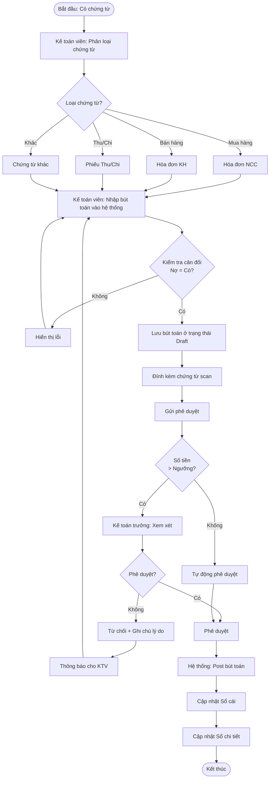

#### Chi tiết Bước thực hiện

| Bước | Vai trò | Hoạt động | Đầu vào | Đầu ra | Hệ thống |
|------|---------|-----------|---------|--------|----------|
| 1 | Kế toán viên | Nhận và phân loại chứng từ | Chứng từ giấy/điện tử | Chứng từ đã phân loại | Manual |
| 2 | Kế toán viên | Nhập bút toán | Chứng từ | Bút toán Draft | Accounting System |
| 3 | Hệ thống | Validate cân đối Nợ-Có | Bút toán | Thông báo lỗi/OK | Auto validation |
| 4 | Kế toán viên | Đính kèm file scan | Chứng từ scan | Bút toán + File | File upload |
| 5 | Kế toán viên | Gửi phê duyệt | Bút toán Draft | Request phê duyệt | Workflow |
| 6 | Hệ thống | Kiểm tra ngưỡng | Số tiền bút toán | Route phê duyệt | Auto routing |
| 7 | Kế toán trưởng | Xem xét & phê duyệt | Bút toán + chứng từ | Quyết định | Approval screen |
| 8 | Hệ thống | Post bút toán | Bút toán approved | Bút toán Posted | Auto posting |
| 9 | Hệ thống | Cập nhật sổ sách | Bút toán Posted | Sổ cái, sổ chi tiết | Auto update |

#### Business Rules

**BR-GL-001**: Ngưỡng phê duyệt
- Bút toán < 10 triệu: Tự động phê duyệt
- Bút toán 10-100 triệu: Kế toán trưởng phê duyệt
- Bút toán > 100 triệu: CFO phê duyệt

**BR-GL-002**: Kỳ kế toán
- Chỉ được ghi bút toán vào kỳ hiện tại hoặc kỳ chưa đóng
- Kỳ đã kết chuyển: Không cho phép ghi bút toán mới

**BR-GL-003**: Tài khoản
- Chỉ được ghi bút toán vào tài khoản chi tiết (không phải tài khoản tổng hợp)

---

### 2.2 Quy trình Sửa/Đảo Bút toán

#### Mô tả
Quy trình điều chỉnh bút toán đã ghi sổ bằng cách đảo bút toán (reversal).

#### Luồng Quy trình

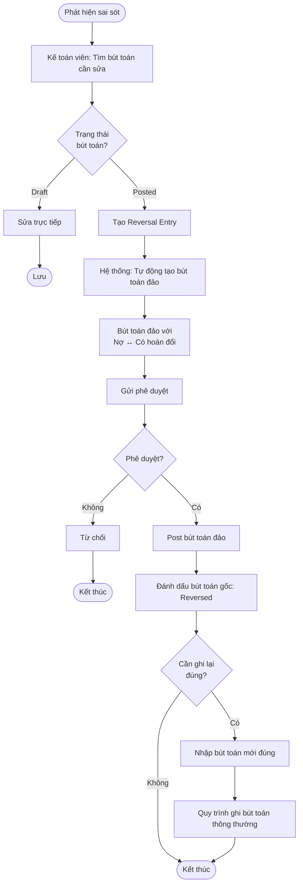

#### Business Rules

**BR-GL-004**: Đảo bút toán
- Bút toán đã Posted chỉ được điều chỉnh bằng Reversal, không được sửa trực tiếp
- Bút toán đảo phải được phê duyệt như bút toán gốc
- Ghi rõ lý do đảo bút toán trong diễn giải

---

## 3. QUY TRÌNH CÔNG NỢ PHẢI TRẢ (AP)

### 3.1 Quy trình Xử lý Hóa đơn Nhà cung cấp

#### Mô tả Tổng quan
Quy trình từ khi nhận hóa đơn NCC, đối chiếu 3 bên (PO-GR-Invoice), đến ghi nhận công nợ.

#### Luồng Quy trình

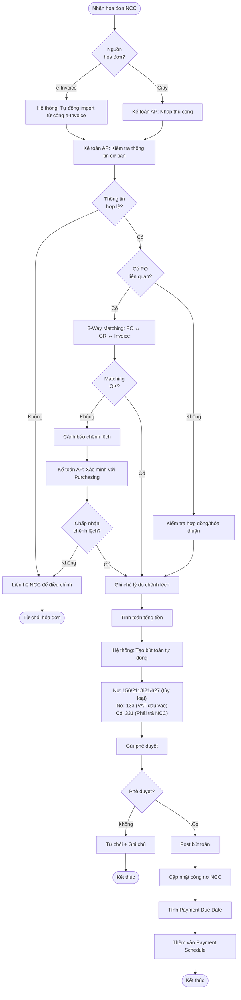

#### Chi tiết 3-Way Matching

| Bước | Đối chiếu | Tolerance | Xử lý nếu sai lệch |
|------|-----------|-----------|---------------------|
| 1 | Số lượng: PO vs GR | 0% | Liên hệ Purchasing |
| 2 | Số lượng: GR vs Invoice | ±2% | Chấp nhận nếu < 2% |
| 3 | Đơn giá: PO vs Invoice | ±1% | Liên hệ Purchasing |
| 4 | Tổng tiền: Tổng hợp | ±5% hoặc 1 triệu | Kế toán trưởng quyết định |

#### Business Rules

**BR-AP-001**: Hóa đơn hợp lệ
- MST nhà cung cấp phải đúng (10 hoặc 13 số)
- Số hóa đơn không được trùng
- Ngày hóa đơn không được là ngày tương lai

**BR-AP-002**: Payment Term
- Mặc định: 30 ngày kể từ ngày hóa đơn
- Theo thỏa thuận trong hợp đồng (nếu có)

---

### 3.2 Quy trình Thanh toán Nhà cung cấp

#### Luồng Quy trình

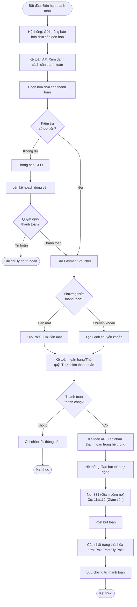

#### Business Rules

**BR-AP-003**: Thanh toán
- Số tiền thanh toán không được vượt quá công nợ còn lại
- Phải kiểm tra số dư trước khi thanh toán
- Ưu tiên thanh toán theo: Hóa đơn quá hạn > Sắp đến hạn > Còn xa hạn

**BR-AP-004**: Chiết khấu thanh toán sớm
- Nếu thanh toán trước hạn, áp dụng discount (nếu có thỏa thuận)
- Ghi nhận: Có 515 (Doanh thu tài chính - Chiết khấu được hưởng)

---

### 3.3 Quy trình Đối chiếu Công nợ

#### Luồng Quy trình

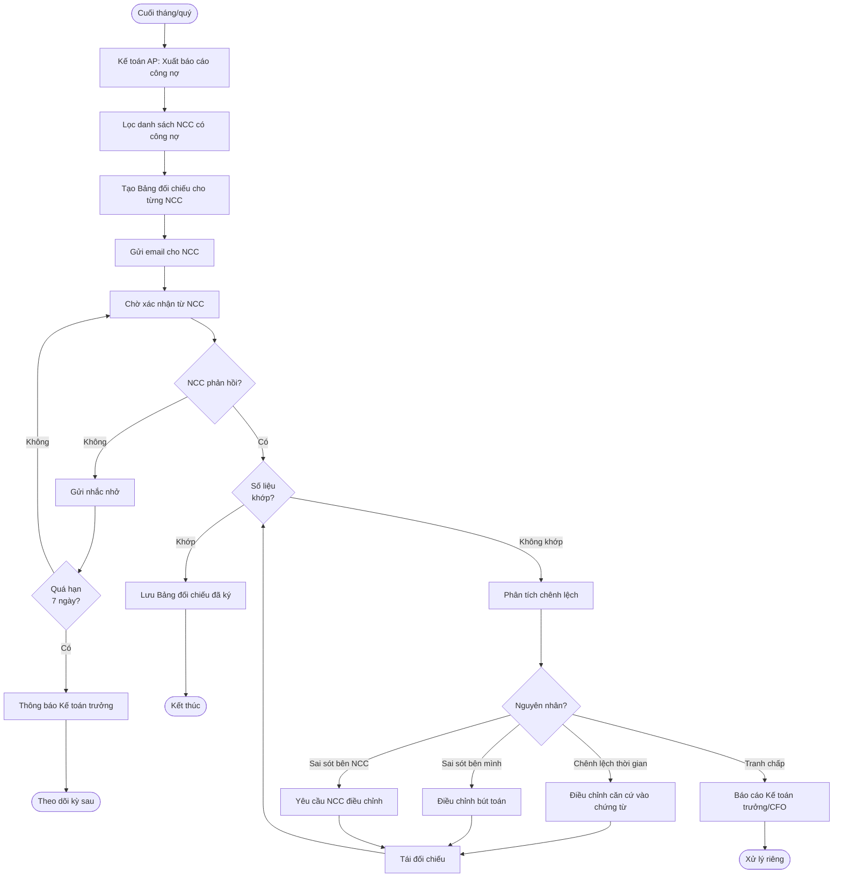

#### Thời điểm đối chiếu

| Loại NCC | Tần suất đối chiếu | Thời hạn phản hồi |
|----------|-------------------|-------------------|
| NCC lớn (công nợ > 500 triệu) | Hàng tháng | 5 ngày làm việc |
| NCC trung bình (50-500 triệu) | Hàng quý | 7 ngày làm việc |
| NCC nhỏ (< 50 triệu) | Hàng năm | 10 ngày làm việc |

---

## 4. QUY TRÌNH CÔNG NỢ PHẢI THU (AR)

### 4.1 Quy trình Xuất Hóa đơn Khách hàng

#### Luồng Quy trình

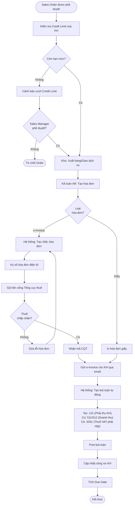

#### Business Rules

**BR-AR-001**: Credit Limit
- Mỗi khách hàng có hạn mức công nợ tối đa
- Hệ thống cảnh báo khi: (Công nợ hiện tại + Hóa đơn mới) > Credit Limit
- Sales Manager có quyền phê duyệt vượt hạn mức (tạm thời)

**BR-AR-002**: Hóa đơn điện tử
- Tuân thủ Nghị định 123/2020/NĐ-CP
- Format XML theo chuẩn Tổng cục thuế
- Phải có mã CQT trước khi gửi cho khách hàng

---

### 4.2 Quy trình Thu tiền Khách hàng

#### Luồng Quy trình

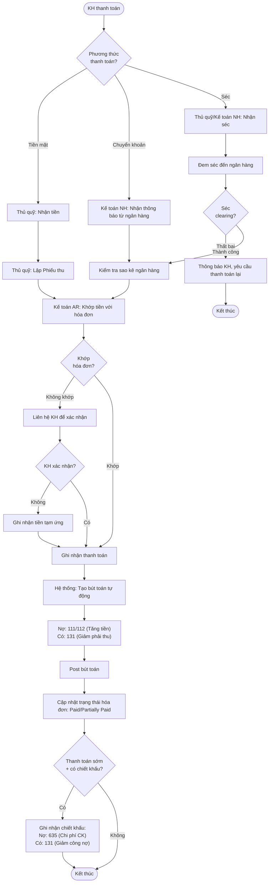

#### Business Rules

**BR-AR-003**: Khớp thanh toán
- Ưu tiên khớp theo: Số hóa đơn > Ngày hóa đơn (cũ nhất) > Khách hàng
- Nếu không xác định được, ghi nhận vào TK 3388 (Phải trả khác - Tạm ứng)

**BR-AR-004**: Thanh toán một phần
- Cho phép KH thanh toán từng phần
- Trạng thái: Unpaid → Partially Paid → Fully Paid

---

### 4.3 Quy trình Quản lý Nợ quá hạn

#### Luồng Quy trình

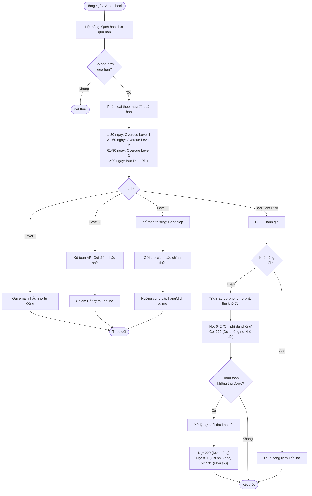

#### Chính sách Dự phòng Nợ khó đòi

| Thời gian quá hạn | Tỷ lệ dự phòng |
|-------------------|----------------|
| 0-90 ngày | 0% |
| 91-180 ngày | 30% |
| 181-365 ngày | 50% |
| > 365 ngày | 70% |
| Xác định không thu hồi được | 100% |

---

## 5. QUY TRÌNH TÀI SẢN CỐ ĐỊNH

### 5.1 Quy trình Mua sắm và Ghi tăng TSCĐ

#### Luồng Quy trình

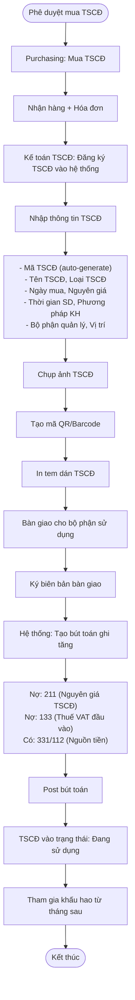

#### Business Rules

**BR-FA-001**: Điều kiện là TSCĐ
- Nguyên giá ≥ 30 triệu VNĐ
- Thời gian sử dụng > 1 năm
- Nếu không đủ điều kiện → Ghi nhận vào Chi phí hoặc Công cụ dụng cụ

**BR-FA-002**: Thời gian khấu hao
- Nhà cửa, vật kiến trúc: 5-50 năm
- Máy móc thiết bị: 5-15 năm
- Phương tiện vận tải: 6-10 năm
- Thiết bị văn phòng: 3-8 năm
- Tài sản vô hình: Theo hợp đồng hoặc 3-10 năm

---

### 5.2 Quy trình Khấu hao Hàng tháng

#### Luồng Quy trình

```mermaid
flowchart TD
    Start([Cuối tháng: Tự động chạy]) --> A[Hệ thống: Lấy danh sách TSCĐ đang sử dụng]
    A --> B[Lọc TSCĐ chưa hết khấu hao]
    B --> C[For Each TSCĐ: Tính khấu hao tháng]
    C --> D{Phương pháp?}

    D -->|Đường thẳng| E["KH tháng = Nguyên giá / Số tháng SD"]
    D -->|Số dư giảm dần| F["KH tháng = Giá trị còn lại × Tỷ lệ KH"]

    E & F --> G[Cộng dồn khấu hao lũy kế]
    G --> H{GTCL = 0?}
    H -->|Có| I[Đánh dấu: Hết khấu hao]
    H -->|Không| J[Tiếp tục khấu hao]

    I & J --> K[Tổng hợp khấu hao theo bộ phận]
    K --> L[Kế toán TSCĐ: Preview báo cáo khấu hao]
    L --> M{Kiểm tra<br/>OK?}
    M -->|Không| N[Điều chỉnh (nếu cần)]
    N --> C

    M -->|Có| O[Kế toán trưởng: Phê duyệt]
    O --> P[Hệ thống: Tạo bút toán khấu hao]
    P --> Q["Nợ: 627 (KH-Bộ phận SX)<br/>Nợ: 641 (KH-Bộ phận bán hàng)<br/>Nợ: 642 (KH-Bộ phận QLDN)<br/>Có: 214 (Hao mòn TSCĐ)"]
    Q --> R[Post bút toán]
    R --> S[Cập nhật GTCL của từng TSCĐ]
    S --> End([Kết thúc])
```

#### Công thức Khấu hao

**Phương pháp Đường thẳng:**
```
Khấu hao tháng = Nguyên giá / Thời gian sử dụng (tháng)
GTCL = Nguyên giá - Khấu hao lũy kế
```

**Phương pháp Số dư giảm dần:**
```
Tỷ lệ KH = (2 / Thời gian SD) × 100%
Khấu hao năm thứ N = GTCL đầu năm × Tỷ lệ KH
Khấu hao tháng = Khấu hao năm / 12
```

---

### 5.3 Quy trình Thanh lý TSCĐ

#### Luồng Quy trình

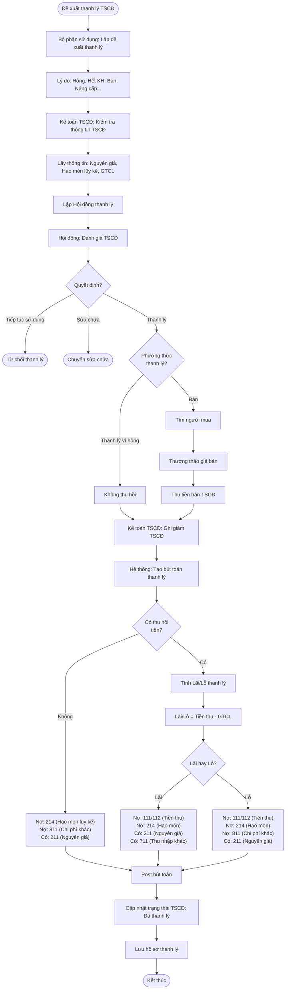

---

## 6. QUY TRÌNH QUẢN LÝ NGÂN QUỸ

### 6.1 Quy trình Thu/Chi Tiền mặt

#### Luồng Thu tiền

```mermaid
flowchart TD
    Start([Có nghiệp vụ thu tiền]) --> A[Thủ quỹ: Nhận tiền mặt]
    A --> B[Kiểm tra tiền thật/giả]
    B --> C{Tiền hợp lệ?}
    C -->|Không| D[Từ chối nhận]
    D --> End1([Kết thúc])

    C -->|Có| E[Đếm tiền]
    E --> F[Lập Phiếu thu tiền mặt]
    F --> G["Nhập thông tin:<br/>- Người nộp<br/>- Lý do thu<br/>- Số tiền<br/>- TK đối ứng"]

    G --> H[In Phiếu thu (2 liên)]
    H --> I[Người nộp ký xác nhận]
    I --> J[Giao 1 liên cho người nộp]
    J --> K[Thủ quỹ: Cất tiền vào két]
    K --> L[Hệ thống: Tạo bút toán]
    L --> M["Nợ: 111 (Tiền mặt)<br/>Có: TK đối ứng"]
    M --> N[Kế toán trưởng: Phê duyệt]
    N --> O[Post bút toán]
    O --> P[Cập nhật Sổ quỹ]
    P --> End2([Kết thúc])
```

#### Luồng Chi tiền

```mermaid
flowchart TD
    Start([Có nghiệp vụ chi tiền]) --> A[Người đề nghị: Lập Đề nghị thanh toán]
    A --> B[Manager: Phê duyệt đề nghị]
    B --> C{Phê duyệt?}
    C -->|Không| End1([Từ chối])

    C -->|Có| D[Chuyển cho Thủ quỹ]
    D --> E[Thủ quỹ: Kiểm tra số dư quỹ]
    E --> F{Đủ tiền?}
    F -->|Không| G[Thông báo Kế toán trưởng]
    G --> H[Rút tiền từ ngân hàng]
    H --> F

    F -->|Có| I[Lập Phiếu chi tiền mặt]
    I --> J["Nhập thông tin:<br/>- Người nhận<br/>- Lý do chi<br/>- Số tiền<br/>- TK đối ứng"]

    J --> K[In Phiếu chi (2 liên)]
    K --> L[Người nhận: Ký, ghi rõ họ tên, CMND]
    L --> M[Thủ quỹ: Chi tiền]
    M --> N[Hệ thống: Tạo bút toán]
    N --> O["Nợ: TK đối ứng<br/>Có: 111 (Tiền mặt)"]
    O --> P[Kế toán trưởng: Phê duyệt]
    P --> Q[Post bút toán]
    Q --> R[Cập nhật Sổ quỹ]
    R --> End2([Kết thúc])
```

#### Business Rules

**BR-CM-001**: Giới hạn tồn quỹ
- Tồn quỹ tối đa: 50 triệu VNĐ (hoặc theo quy định công ty)
- Nếu vượt → Phải nộp tiền vào ngân hàng

**BR-CM-002**: Giới hạn chi tiền mặt
- Chi tiền mặt ≤ 20 triệu VNĐ/giao dịch
- Vượt → Phải chuyển khoản

**BR-CM-003**: Kiểm kê quỹ
- Thủ quỹ kiểm kê cuối ngày
- Kế toán trưởng kiểm kê đột xuất (ít nhất tháng 1 lần)

---

### 6.2 Quy trình Đối chiếu Ngân hàng

#### Luồng Quy trình

```mermaid
flowchart TD
    Start([Cuối tháng]) --> A[Kế toán NH: Lấy sao kê ngân hàng]
    A --> B{Phương thức?}
    B -->|Online banking| C[Download sao kê (Excel/PDF)]
    B -->|API ngân hàng| D[Hệ thống: Tự động import qua API]
    B -->|Giấy| E[Nhập thủ công]

    C & D & E --> F[Chuẩn hóa dữ liệu sao kê]
    F --> G[Hệ thống: Auto-matching với sổ sách]
    G --> H[Khớp theo: Số tiền, Ngày, Nội dung]
    H --> I{Kết quả<br/>matching?}

    I -->|100% khớp| J[Hoàn thành đối chiếu]
    J --> End1([Kết thúc])

    I -->|Có chênh lệch| K[Kế toán NH: Phân tích chênh lệch]
    K --> L{Nguyên nhân?}

    L -->|Trên sao kê,<br/>chưa có trên sổ| M[Ví dụ: Lãi tiền gửi, Phí NH]
    M --> N[Nhập bút toán bổ sung vào sổ sách]

    L -->|Trên sổ,<br/>chưa có trên sao kê| O[Ví dụ: Séc chưa clearing]
    O --> P[Ghi nhận vào Outstanding Items]
    P --> Q[Theo dõi tháng sau]

    L -->|Sai sót| R[Kiểm tra lại chứng từ gốc]
    R --> S{Sai bên nào?}
    S -->|Bên mình| T[Điều chỉnh bút toán]
    S -->|Bên NH| U[Liên hệ NH để điều chỉnh]

    N & T & U --> V[Tái đối chiếu]
    V --> I

    Q --> W[Lập Bank Reconciliation Statement]
    W --> X[Kế toán trưởng: Xem xét & ký]
    X --> End2([Lưu hồ sơ])
```

#### Bank Reconciliation Statement (Bảng đối chiếu NH)

```
Số dư theo Sổ sách:                    XXX
Cộng: Khoản trên sao kê chưa ghi sổ:  +XX
Trừ: Khoản trên sổ chưa có sao kê:    -XX
                                    --------
Số dư theo Sao kê:                     XXX
```

---

## 7. QUY TRÌNH THUẾ

### 7.1 Quy trình Khai thuế GTGT (VAT)

#### Luồng Quy trình

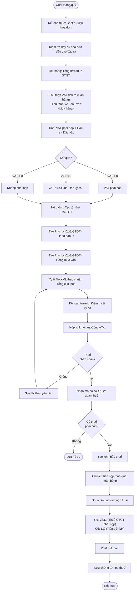

#### Business Rules

**BR-TAX-001**: Thời hạn khai thuế VAT
- Khai theo tháng: Chậm nhất ngày 20 tháng sau
- Khai theo quý: Chậm nhất ngày 30 tháng đầu quý sau

**BR-TAX-002**: Hóa đơn hợp lệ được khấu trừ
- Có hóa đơn GTGT hợp lệ
- Có chứng từ thanh toán qua ngân hàng (nếu ≥ 20 triệu)
- Hàng hóa/dịch vụ phục vụ hoạt động kinh doanh

---

### 7.2 Quy trình Khai thuế TNDN (CIT)

#### Luồng Quy trình Tạm tính Quý

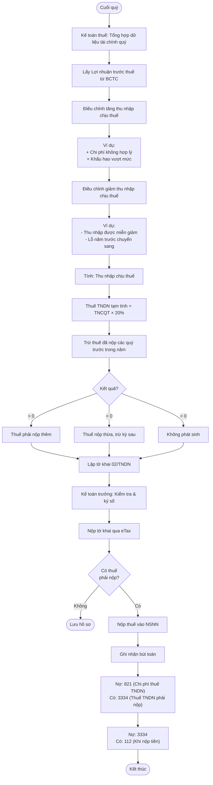

#### Luồng Quyết toán Năm

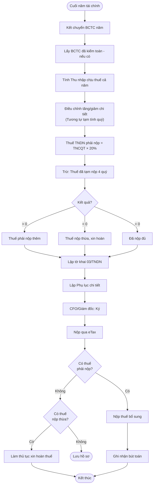

#### Business Rules

**BR-TAX-003**: Thời hạn khai thuế TNDN
- Tạm tính quý: Chậm nhất ngày 30 tháng đầu quý sau
- Quyết toán năm: Chậm nhất ngày 31/03 năm sau

**BR-TAX-004**: Thuế suất TNDN
- Mặc định: 20%
- DN nhỏ và vừa (điều kiện đặc biệt): 17%
- DN công nghệ cao (được ưu đãi): 10% hoặc miễn giảm

---

### 7.3 Quy trình Khai thuế TNCN từ Payroll

#### Luồng Quy trình

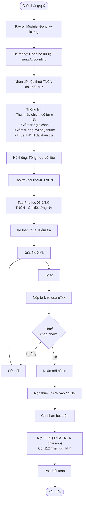

**Lưu ý:** Bút toán khấu trừ thuế TNCN khi trả lương đã được ghi nhận bởi Payroll Module:
```
Nợ: 334 (Phải trả NV)
Có: 3335 (Thuế TNCN phải nộp)
Có: 112 (Lương NET trả cho NV)
```

#### Business Rules

**BR-TAX-005**: Thời hạn nộp thuế TNCN
- Chậm nhất ngày 20 tháng sau (tháng khấu trừ)

---

## 8. QUY TRÌNH BÁO CÁO TÀI CHÍNH

### 8.1 Quy trình Lập Báo cáo Tài chính

#### Luồng Quy trình

```mermaid
flowchart TD
    Start([Cuối kỳ: Tháng/Quý/Năm]) --> A[Kế toán viên: Kiểm tra dữ liệu]
    A --> B["- Tất cả bút toán đã Posted<br/>- Đối chiếu công nợ hoàn tất<br/>- Đối chiếu ngân hàng hoàn tất<br/>- Khấu hao đã chạy"]

    B --> C{Dữ liệu<br/>hoàn chỉnh?}
    C -->|Không| D[Bổ sung dữ liệu còn thiếu]
    D --> A

    C -->|Có| E[Kế toán viên: Chạy quy trình kết chuyển]
    E --> F[Kết chuyển chi phí/doanh thu → TK 911]
    F --> G[Xác định KQKD (Lãi/Lỗ)]
    G --> H{Kỳ báo cáo?}

    H -->|Tháng/Quý| I[Không kết chuyển sang TK 421]
    H -->|Năm| J[Kết chuyển LNST → TK 421]

    I & J --> K[Hệ thống: Tạo BCTC tự động]
    K --> L[Bảng cân đối kế toán - B01-DN]
    L --> M[Báo cáo KQKD - B02-DN]
    M --> N[Báo cáo lưu chuyển tiền tệ - B03-DN]
    N --> O[Thuyết minh BCTC - B09-DN]

    O --> P[Kế toán trưởng: Kiểm tra BCTC]
    P --> Q{BCTC<br/>cân đối?}
    Q -->|Không| R[Tìm lỗi sai]
    R --> S[Điều chỉnh bút toán]
    S --> K

    Q -->|Có| T[Kế toán trưởng: Phê duyệt]
    T --> U[CFO/Giám đốc: Xem xét]
    U --> V{Phê duyệt?}
    V -->|Không| W[Yêu cầu điều chỉnh/giải trình]
    W --> R

    V -->|Có| X[Ký BCTC]
    X --> Y[Lưu trữ BCTC chính thức]
    Y --> Z{Kỳ năm?}
    Z -->|Có| AA[Gửi cho Kiểm toán độc lập - nếu yêu cầu]
    Z -->|Không| AB[Phân phối cho Stakeholders]
    AA --> AB
    AB --> End([Kết thúc])
```

#### Checklist Trước khi Lập BCTC

| Hạng mục | Kiểm tra | Trách nhiệm |
|----------|----------|-------------|
| ✅ Bút toán | 100% bút toán đã Posted | Kế toán viên |
| ✅ Công nợ | Đối chiếu NCC, KH hoàn tất | Kế toán AP/AR |
| ✅ Ngân hàng | Bank reconciliation hoàn tất | Kế toán NH |
| ✅ TSCĐ | Khấu hao tháng đã chạy | Kế toán TSCĐ |
| ✅ Kho | Tồn kho đã cập nhật | Kế toán kho |
| ✅ Lương | Lương tháng đã đóng | Payroll |
| ✅ Thuế | Thuế đã khai và nộp | Kế toán thuế |

---

### 8.2 Quy trình Kết chuyển Cuối kỳ

#### Luồng Chi tiết

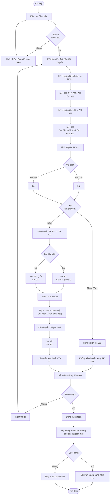

#### Business Rules Kết chuyển

**BR-CL-001**: Kết chuyển theo kỳ
- **Tháng/Quý**: Kết chuyển vào TK 911, giữ nguyên để tích lũy
- **Năm**: Kết chuyển TK 911 → TK 421, sau đó reset TK 911 về 0

**BR-CL-002**: Đóng kỳ
- Sau khi đóng kỳ, không cho phép ghi bút toán vào kỳ đó
- Chỉ Kế toán trưởng có quyền mở lại kỳ (trong trường hợp đặc biệt)

---

## 9. TÍCH HỢP VỚI CÁC MODULE KHÁC

### 9.1 Tích hợp với Payroll/HRM

#### Data Flow

```mermaid
flowchart LR
    A[Payroll Module] -->|Lương đã tính| B[Accounting]
    B -->|Trạng thái chốt kỳ| A

    A -->|"1. Lương phải trả<br/>2. Thuế TNCN<br/>3. BHXH NV<br/>4. BHXH DN"| C[Accounting: Ghi nhận bút toán]

    C --> D["Nợ: 641/642 (Chi phí lương)<br/>Nợ: 623 (BHXH DN)<br/>Có: 334 (Phải trả NV)<br/>Có: 338 (Phải trả BHXH)<br/>Có: 3335 (Thuế TNCN)"]

    D --> E[Accounting: Thanh toán lương]
    E --> F["Nợ: 334<br/>Có: 112 (Chuyển khoản)"]
```

#### Business Rules

**BR-INT-001**: Đồng bộ Payroll
- Payroll phải đóng kỳ trước khi Accounting ghi nhận
- Sau khi Accounting ghi nhận, Payroll không được sửa dữ liệu đã gửi

---

### 9.2 Tích hợp với Inventory (Kho)

#### Data Flow

```mermaid
flowchart LR
    A[Inventory Module] -->|Xuất nhập kho| B[Accounting]

    A -->|Nhập kho: PO + GR| C[Accounting: Ghi tăng hàng tồn]
    C --> D["Nợ: 156 (Hàng hóa)<br/>Có: 331 (Phải trả NCC)"]

    A -->|Xuất kho: Sales| E[Accounting: Ghi giảm hàng tồn + Giá vốn]
    E --> F["Nợ: 632 (Giá vốn hàng bán)<br/>Có: 156 (Hàng hóa)"]
```

---

### 9.3 Tích hợp với Sales

#### Data Flow

```mermaid
flowchart LR
    A[Sales Module] -->|Sales Order| B[Accounting]
    B -->|Credit limit check| A

    A -->|Hóa đơn bán hàng| C[Accounting: Ghi nhận doanh thu]
    C --> D["Nợ: 131 (Phải thu)<br/>Có: 511 (Doanh thu)<br/>Có: 3331 (VAT đầu ra)"]
```

---

## 10. KẾT LUẬN

### 10.1 Tóm tắt Quy trình

Tài liệu này đã mô tả chi tiết 8 quy trình nghiệp vụ cốt lõi của module Accounting:
1. ✅ Kế toán Tổng hợp (GL)
2. ✅ Công nợ Phải trả (AP)
3. ✅ Công nợ Phải thu (AR)
4. ✅ Tài sản Cố định (FA)
5. ✅ Quản lý Ngân quỹ (Cash)
6. ✅ Thuế (VAT, CIT, PIT)
7. ✅ Báo cáo Tài chính
8. ✅ Kết chuyển Cuối kỳ

### 10.2 Vai trò & Trách nhiệm Tổng hợp

| Vai trò | Quy trình chính | Quyền hạn chính |
|---------|-----------------|-----------------|
| **Kế toán viên** | GL, AP, AR, FA, Cash | Nhập liệu, tạo bút toán |
| **Kế toán trưởng** | Tất cả | Phê duyệt, kết chuyển, ký BCTC |
| **Kế toán thuế** | Tax | Khai thuế, nộp thuế |
| **Thủ quỹ** | Cash | Thu chi tiền mặt, kiểm kê |
| **Kế toán NH** | Cash | Đối chiếu NH |
| **CFO** | Financial Reporting | Phê duyệt BCTC, quyết định tài chính |

### 10.3 Tài liệu Liên quan

- [1_SRS_Accounting.md](1_SRS_Accounting.md) - Yêu cầu chức năng
- [3_UserStories.md](3_UserStories.md) - User Stories
- [7_DataFlowDiagram.md](7_DataFlowDiagram.md) - Data Flow chi tiết

---

**Phê duyệt:**

| Vai trò | Họ tên | Chữ ký | Ngày |
|---------|--------|--------|------|
| **CFO/Kế toán trưởng** | | | |
| **Business Analyst Lead** | | | |
| **Process Owner** | | | |

---

*Tài liệu này mô tả quy trình AS-IS/TO-BE cho module Accounting. Mọi thay đổi quy trình phải được phê duyệt bởi CFO và Product Owner.*

**Phiên bản:** 1.0
**Ngày tạo:** 2024-10-03
**Người tạo:** BA Team
**Trạng thái:** ✅ Draft - Pending Review
