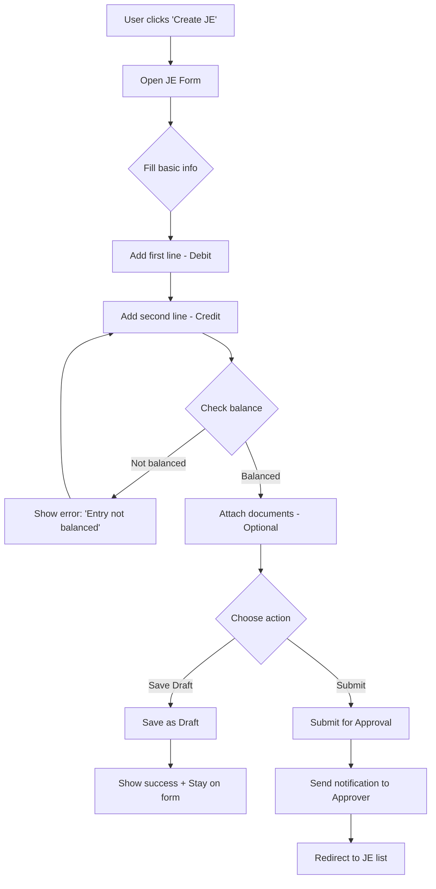
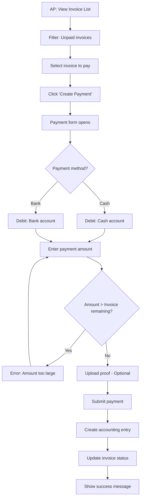
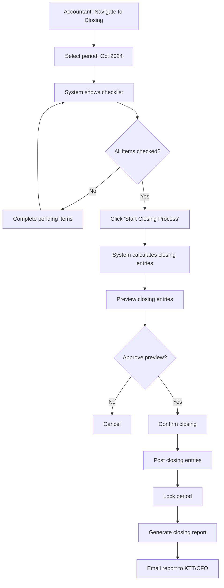

# Prototype & Mockups
# Hệ thống Kế toán - Accounting Module

## Lịch sử Phiên bản

| Phiên bản | Ngày       | Tác giả | Mô tả Thay đổi |
|-----------|------------|---------|----------------|
| 1.0       | 2024-10-03 | UX Team | Phiên bản khởi tạo |

---

## MỤC LỤC

1. [Giới thiệu](#1-giới-thiệu)
2. [Design Principles](#2-design-principles)
3. [Wireframes - Low Fidelity](#3-wireframes-low-fidelity)
4. [Mockups - High Fidelity](#4-mockups-high-fidelity)
5. [User Flow Diagrams](#5-user-flow-diagrams)
6. [Component Library](#6-component-library)
7. [Responsive Design](#7-responsive-design)

---

## 1. GIỚI THIỆU

### 1.1 Mục đích

Tài liệu này mô tả thiết kế giao diện và trải nghiệm người dùng (UI/UX) cho module Accounting, bao gồm:
- ✅ Wireframes (low-fidelity) - Bố cục và cấu trúc
- ✅ Mockups (high-fidelity) - Thiết kế chi tiết
- ✅ User flows - Luồng tương tác
- ✅ Component library - Thư viện thành phần

### 1.2 Tools Used

- **Wireframing:** Figma, Balsamiq
- **Mockups:** Figma, Adobe XD
- **Prototyping:** Figma Interactive Prototype
- **User Flow:** Miro, Lucidchart

### 1.3 Target Users

| Persona | Frequency | Key Needs | Technical Level |
|---------|-----------|-----------|-----------------|
| **Kế toán viên** | Daily (8h/day) | Speed, Efficiency, Accuracy | Medium |
| **Kế toán trưởng** | Daily (2-3h) | Oversight, Reports, Approval | Medium-High |
| **Thủ quỹ** | Daily (4-5h) | Simple cash entry | Low-Medium |
| **CFO** | Weekly | Dashboards, Strategic reports | High |

---

## 2. DESIGN PRINCIPLES

### 2.1 Core Principles

**1. Efficiency First**
- Minimize clicks to complete tasks
- Keyboard shortcuts for power users
- Auto-save and auto-complete
- Bulk actions support

**2. Error Prevention**
- Real-time validation
- Clear error messages
- Confirmation for critical actions
- Undo/redo capability

**3. Visual Hierarchy**
- Most important info prominently displayed
- Clear distinction between primary/secondary actions
- Consistent use of color and typography

**4. Accessibility**
- WCAG 2.1 Level AA compliance
- Keyboard navigation
- Screen reader support
- High contrast mode option

**5. Localization**
- Vietnamese as primary language
- English support
- Number format: 1.000.000,00 (VN style)
- Date format: DD/MM/YYYY

### 2.2 Design System

**Color Palette:**
```
Primary:   #0052CC (Blue - Trust, Professional)
Secondary: #00875A (Green - Success, Money)
Error:     #DE350B (Red - Danger, Alert)
Warning:   #FF991F (Orange - Caution)
Info:      #0065FF (Light Blue - Information)
Neutral:   #172B4D, #6B778C, #F4F5F7 (Text, Backgrounds)
```

**Typography:**
```
Headings:  Roboto Bold
Body:      Roboto Regular
Mono:      Roboto Mono (for numbers, amounts)

Sizes:
  H1: 28px
  H2: 24px
  H3: 20px
  Body: 14px
  Small: 12px
```

**Spacing:**
```
Base unit: 8px
Spacing scale: 4px, 8px, 16px, 24px, 32px, 48px
```

---

## 3. WIREFRAMES - LOW FIDELITY

### 3.1 Main Dashboard Layout

```
┌─────────────────────────────────────────────────────────────┐
│ [Logo]  Accounting Module          [Search]  [🔔] [👤 User]│
├────────┬────────────────────────────────────────────────────┤
│        │ DASHBOARD                                          │
│ Home   │                                                    │
│        │ ┌──────────┐ ┌──────────┐ ┌──────────┐           │
│ GL     │ │ Cash     │ │ AR       │ │ AP       │           │
│ • COA  │ │ 50M VNĐ  │ │ 120M VNĐ │ │ 80M VNĐ  │           │
│ • JE   │ └──────────┘ └──────────┘ └──────────┘           │
│ • LED  │                                                    │
│        │ ┌────────────────────────────────────────────┐    │
│ AP     │ │ Revenue Trend (Last 6 months)             │    │
│ • Inv  │ │ [Line Chart]                               │    │
│ • Pay  │ └────────────────────────────────────────────┘    │
│        │                                                    │
│ AR     │ ┌─────────────────┐ ┌─────────────────────┐      │
│ • Inv  │ │ Pending Approval│ │ Overdue Invoices   │      │
│ • Rec  │ │ • JE-001: 5M   │ │ • INV-123: 10M     │      │
│        │ │ • JE-005: 2M   │ │ • INV-150: 5M      │      │
│ FA     │ └─────────────────┘ └─────────────────────┘      │
│        │                                                    │
│ TAX    │ [Quick Actions: Create JE | Create Invoice |     │
│        │                 Receive Payment | View Reports]    │
│ Reports│                                                    │
│        │                                                    │
└────────┴────────────────────────────────────────────────────┘
```

**Key Features:**
- Left sidebar: Hierarchical navigation
- Top bar: Global search, notifications, user menu
- Main area: Dashboard widgets, key metrics
- Quick actions: Most common tasks

---

### 3.2 Journal Entry Form (Wireframe)

```
┌─────────────────────────────────────────────────────────────┐
│ CREATE JOURNAL ENTRY                         [Save] [Cancel]│
├─────────────────────────────────────────────────────────────┤
│                                                              │
│ Document Info:                                               │
│ ┌────────────┐ ┌────────────┐ ┌────────────────────────┐   │
│ │ Date       │ │ Doc No.    │ │ Description            │   │
│ │ [15/10/24] │ │ [PC001]    │ │ [                    ] │   │
│ └────────────┘ └────────────┘ └────────────────────────┘   │
│                                                              │
│ Journal Lines:                                               │
│ ┌──────────────────────────────────────────────────────┐    │
│ │ Account      │ Debit       │ Credit      │ Object   │    │
│ ├──────────────────────────────────────────────────────┤    │
│ │ 111-Tiền mặt│ 5,000,000   │             │          │ [-] │
│ │ 131-Phải thu│             │ 5,000,000   │ KH-A     │ [-] │
│ │ [+ Add line]                                        │    │
│ └──────────────────────────────────────────────────────┘    │
│                                                              │
│ Totals:   Debit: 5,000,000    Credit: 5,000,000  ✓ Balanced│
│                                                              │
│ Attachments: [📎 Upload]                                    │
│                                                              │
│ Workflow:  ○ Save as Draft                                  │
│            ○ Submit for Approval                             │
│                                                              │
│                              [Save Draft] [Submit for App.] │
└─────────────────────────────────────────────────────────────┘
```

---

### 3.3 General Ledger View (Wireframe)

```
┌─────────────────────────────────────────────────────────────┐
│ GENERAL LEDGER                                               │
├─────────────────────────────────────────────────────────────┤
│                                                              │
│ Filters: ┌─────────────┐ ┌─────────────┐ ┌──────────────┐  │
│          │ Account     │ │ Period      │ │ Status       │  │
│          │ [131-Phải  ▼│ │ [Oct 2024] ▼│ │ [All]       ▼│  │
│          └─────────────┘ └─────────────┘ └──────────────┘  │
│                                    [🔍 Search] [Export Excel]│
│                                                              │
│ Account: 131 - Phải thu khách hàng                          │
│ Period: 01/10/2024 - 31/10/2024                             │
│                                                              │
│ ┌──────────────────────────────────────────────────────┐    │
│ │ Date  │Doc No │Description│ Debit     │Credit    │Bal │   │
│ ├──────────────────────────────────────────────────────┤    │
│ │ 01/10 │       │Opening Bal│           │          │10M │   │
│ │ 05/10 │HD-001 │Bán hàng KH│ 5,000,000 │          │15M │   │
│ │ 10/10 │PT-001 │Thu tiền   │           │5,000,000 │10M │   │
│ │ 31/10 │       │Closing Bal│           │          │10M │   │
│ ├──────────────────────────────────────────────────────┤    │
│ │ TOTAL │       │           │ 5,000,000 │5,000,000 │    │   │
│ └──────────────────────────────────────────────────────┘    │
│                                                              │
│ [< Prev Page]  Page 1 of 5  [Next Page >]                   │
└─────────────────────────────────────────────────────────────┘
```

---

### 3.4 Accounts Payable - Invoice List

```
┌─────────────────────────────────────────────────────────────┐
│ SUPPLIER INVOICES                         [+ Create Invoice]│
├─────────────────────────────────────────────────────────────┤
│                                                              │
│ Quick Filters: [All] [Unpaid] [Partially Paid] [Overdue]   │
│                                                              │
│ ┌──────────────────────────────────────────────────────┐    │
│ │Supplier │Invoice No│Date   │Amount    │Due   │Status │   │
│ ├──────────────────────────────────────────────────────┤    │
│ │ABC Corp │HĐ-001    │05/10  │50,000,000│15/10 │⚠️ Over│   │
│ │XYZ Ltd  │HĐ-002    │10/10  │30,000,000│20/10 │Unpaid │   │
│ │DEF Inc  │HĐ-003    │12/10  │20,000,000│25/10 │Paid ✓ │   │
│ └──────────────────────────────────────────────────────┘    │
│                                                              │
│ Actions: [☑ Select All] [💰 Create Payment] [📊 Aging Rpt] │
└─────────────────────────────────────────────────────────────┘
```

---

### 3.5 Financial Reports - Balance Sheet

```
┌─────────────────────────────────────────────────────────────┐
│ BALANCE SHEET (Bảng Cân đối Kế toán)                        │
├─────────────────────────────────────────────────────────────┤
│                                                              │
│ Company: [ABC Company]          Period: [31/12/2024]        │
│                                 Compare: [31/12/2023]        │
│                                                              │
│ [Export PDF] [Export Excel] [Print]                         │
│                                                              │
│ ┌──────────────────────────────────────────────────────┐    │
│ │ ASSETS                    │ 2024       │ 2023       │    │
│ ├──────────────────────────────────────────────────────┤    │
│ │ A. CURRENT ASSETS         │            │            │    │
│ │   I. Cash & Equivalents   │ 50,000,000 │ 40,000,000 │    │
│ │      111 - Cash           │ 20,000,000 │ 15,000,000 │    │
│ │      112 - Bank deposits  │ 30,000,000 │ 25,000,000 │    │
│ │   II. Receivables         │120,000,000 │100,000,000 │    │
│ │      131 - AR             │120,000,000 │100,000,000 │    │
│ │ ...                       │            │            │    │
│ └──────────────────────────────────────────────────────┘    │
│                                                              │
│ Prepared by: [Kế toán viên]  Approved by: [Kế toán trưởng] │
└─────────────────────────────────────────────────────────────┘
```

---

## 4. MOCKUPS - HIGH FIDELITY

### 4.1 Dashboard - Full Color Mockup

**[Figma Link: Dashboard_Mockup_v1.fig]**

**Key Visual Elements:**
- **Header:** Dark blue (#0052CC) with white text
- **Sidebar:** Light gray (#F4F5F7) with dark text
- **Cards:** White with subtle shadow
- **Charts:** Colorful (Blue, Green, Orange)
- **Buttons:**
  - Primary: Blue (#0052CC)
  - Secondary: Gray outline
  - Danger: Red (#DE350B)

**Sample Card Design:**
```
┌─────────────────────────┐
│ 💰 Cash Balance        │
│                         │
│      50,000,000 VNĐ     │
│                         │
│ ↗️ +5M from last month  │
└─────────────────────────┘
```

---

### 4.2 Journal Entry Form - Detailed Mockup

**Visual Design:**
- **Header:** "Create Journal Entry" in H2 (24px)
- **Form fields:** White background, 1px gray border
- **Grid:** 12-column layout
- **Spacing:** 16px between fields, 24px between sections
- **Buttons:**
  - "Save Draft": Secondary (gray outline)
  - "Submit": Primary (blue, bold)

**Interactive Elements:**
- **Account dropdown:** Auto-complete with fuzzy search
  ```
  Type: "131"
  Dropdown shows:
  - 131 - Phải thu khách hàng
  - 1311 - Phải thu nội địa
  - 1312 - Phải thu xuất khẩu
  ```

- **Amount field:**
  - Auto-format: `5000000` → `5,000,000`
  - Right-aligned
  - Monospace font

- **Balance indicator:**
  ```
  Total Debit: 5,000,000    Total Credit: 5,000,000
  [✓ Balanced]  (Green checkmark)
  ```

---

### 4.3 Mobile Responsive - Tablet View

**Breakpoints:**
- Desktop: > 1200px (Full sidebar)
- Tablet: 768px - 1199px (Collapsible sidebar)
- Mobile: < 767px (Hamburger menu)

**Tablet Layout (iPad landscape):**
```
┌──────────────────────────────────────┐
│ [☰] Accounting    [🔔] [👤]          │
├──────────────────────────────────────┤
│                                      │
│ Dashboard Cards (2 columns)          │
│ ┌──────────┐ ┌──────────┐           │
│ │ Cash     │ │ AR       │           │
│ └──────────┘ └──────────┘           │
│                                      │
│ Charts (Full width)                  │
│ ┌────────────────────────┐           │
│ │ Revenue Trend         │           │
│ └────────────────────────┘           │
│                                      │
└──────────────────────────────────────┘
```

---

## 5. USER FLOW DIAGRAMS

### 5.1 Create Journal Entry Flow



### 5.2 Invoice Payment Flow (AP)



### 5.3 Month-End Closing Flow



---

## 6. COMPONENT LIBRARY

### 6.1 Form Components

#### Input Field
```
Standard Text Input:
┌────────────────────────────┐
│ Document Number            │
│ [PC001                   ] │
└────────────────────────────┘

With Error:
┌────────────────────────────┐
│ Document Number          * │
│ [                        ] │
│ ⚠️ This field is required  │
└────────────────────────────┘
```

#### Dropdown
```
Account Dropdown:
┌────────────────────────────┐
│ Select Account           ▼ │
├────────────────────────────┤
│ 🔍 Search accounts...      │
├────────────────────────────┤
│ 111 - Tiền mặt             │
│ 112 - Tiền gửi ngân hàng   │
│ 131 - Phải thu khách hàng  │
│ ...                        │
└────────────────────────────┘
```

#### Date Picker
```
┌────────────────────────────┐
│ Date                    📅 │
│ [15/10/2024            ] ▼ │
└────────────────────────────┘

Calendar opens:
┌──────────────────────┐
│  October 2024        │
│ Mo Tu We Th Fr Sa Su │
│        1  2  3  4  5 │
│  6  7  8  9 10 11 12 │
│ 13 14 [15] 16 17 ... │
└──────────────────────┘
```

#### Amount Input
```
┌────────────────────────────┐
│ Amount (VNĐ)               │
│ [        5,000,000       ] │ <- Right aligned, auto-format
└────────────────────────────┘
```

### 6.2 Data Display Components

#### Table - Standard
```
┌────────────────────────────────────────────────────┐
│ ↑ Date │ ↕ Doc No │ Description    │ Amount       │
├────────────────────────────────────────────────────┤
│ 15/10  │ PC001    │ Thu tiền KH   │  5,000,000 ₫ │
│ 16/10  │ PC002    │ Bán hàng      │ 10,000,000 ₫ │
│ ...                                                │
└────────────────────────────────────────────────────┘
Features: Sortable, Filterable, Pagination
```

#### Card Widget
```
┌─────────────────────────┐
│ 📊 Revenue This Month  │
│                         │
│   120,000,000 VNĐ       │
│                         │
│   ↗️ +15% vs last month │
└─────────────────────────┘
```

#### Status Badge
```
Paid:     [✓ Paid]      (Green background)
Unpaid:   [○ Unpaid]    (Gray background)
Overdue:  [⚠️ Overdue]   (Red background)
Draft:    [📝 Draft]     (Blue background)
```

### 6.3 Action Components

#### Primary Button
```
┌─────────────────┐
│   Save & Submit │  (Blue #0052CC, white text, 8px radius)
└─────────────────┘
```

#### Secondary Button
```
┌─────────────────┐
│     Cancel      │  (White bg, gray border, dark text)
└─────────────────┘
```

#### Icon Button
```
[🗑️]  [✏️]  [👁️]  [📎]
Delete Edit  View  Attach
```

### 6.4 Notification Components

#### Success Toast
```
┌────────────────────────────────┐
│ ✓ Journal entry saved success  │  (Green bg, 3 sec auto-hide)
└────────────────────────────────┘
```

#### Error Alert
```
┌────────────────────────────────┐
│ ⚠️ Error: Entry not balanced   │  (Red bg, manual dismiss)
│    Debit: 5M ≠ Credit: 4M     │
│                        [Close] │
└────────────────────────────────┘
```

#### Info Banner
```
┌─────────────────────────────────────────┐
│ ℹ️ Period Oct 2024 is locked. Contact  │
│    Kế toán trưởng to reopen.     [OK]  │
└─────────────────────────────────────────┘
```

---

## 7. RESPONSIVE DESIGN

### 7.1 Breakpoint Strategy

| Device | Breakpoint | Layout |
|--------|------------|--------|
| Mobile | < 768px | Single column, hamburger menu |
| Tablet | 768px - 1199px | 2 columns, collapsible sidebar |
| Desktop | ≥ 1200px | Multi-column, fixed sidebar |

### 7.2 Mobile Adaptations

**Navigation:**
- Desktop: Fixed sidebar (250px)
- Mobile: Hamburger menu → Full-screen overlay

**Forms:**
- Desktop: Multi-column layout
- Mobile: Single column, stacked fields

**Tables:**
- Desktop: Full table
- Mobile: Card view or horizontal scroll

**Example - Journal Entry on Mobile:**
```
┌─────────────────────┐
│ [☰] Create JE  [❌] │
├─────────────────────┤
│                     │
│ Document Info       │
│ ┌─────────────────┐ │
│ │ Date            │ │
│ │ [15/10/2024]    │ │
│ └─────────────────┘ │
│                     │
│ ┌─────────────────┐ │
│ │ Doc No          │ │
│ │ [PC001]         │ │
│ └─────────────────┘ │
│                     │
│ Line 1              │
│ ┌─────────────────┐ │
│ │ Account         │ │
│ │ [111-Tiền mặt]  │ │
│ │ Debit           │ │
│ │ [5,000,000]     │ │
│ └─────────────────┘ │
│                     │
│ [+ Add Line]        │
│                     │
│ ┌─────────────────┐ │
│ │ Save Draft      │ │
│ └─────────────────┘ │
│ ┌─────────────────┐ │
│ │ Submit          │ │
│ └─────────────────┘ │
└─────────────────────┘
```

---

## 8. INTERACTION PATTERNS

### 8.1 Keyboard Shortcuts

| Action | Shortcut | Context |
|--------|----------|---------|
| New Journal Entry | Ctrl + N | Global |
| Save | Ctrl + S | Forms |
| Submit | Ctrl + Enter | Forms |
| Search | Ctrl + F | Lists/Tables |
| Next field | Tab | Forms |
| Previous field | Shift + Tab | Forms |
| Open dropdown | Alt + ↓ | Dropdowns |
| Add new line | Ctrl + L | Journal Entry |
| Delete line | Ctrl + D | Journal Entry line |

### 8.2 Loading States

**Form Submission:**
```
[Save]  →  [⏳ Saving...]  →  [✓ Saved]
```

**Data Loading:**
```
┌─────────────────────────┐
│   Loading data...       │
│   [Progress spinner]    │
└─────────────────────────┘
```

**Skeleton Screen (Table):**
```
┌────────────────────────────┐
│ ███████ ██████ ████████  │ <- Animated shimmer
│ ███████ ██████ ████████  │
│ ███████ ██████ ████████  │
└────────────────────────────┘
```

### 8.3 Confirmation Dialogs

**Critical Action (Delete):**
```
┌─────────────────────────────────┐
│  ⚠️ Confirm Deletion             │
│                                  │
│  Are you sure you want to delete│
│  Journal Entry PC001?            │
│                                  │
│  This action cannot be undone.  │
│                                  │
│  [Cancel]         [Delete]      │
└─────────────────────────────────┘
```

---

## 9. ACCESSIBILITY

### 9.1 WCAG 2.1 Compliance

**Level AA Requirements:**
- ✅ Color contrast ratio ≥ 4.5:1 for normal text
- ✅ Color contrast ratio ≥ 3:1 for large text
- ✅ All functionality available via keyboard
- ✅ Focus indicators visible
- ✅ Error identification and suggestions
- ✅ Labels and instructions for inputs

### 9.2 Screen Reader Support

**Semantic HTML:**
```html
<button aria-label="Save journal entry">Save</button>
<input aria-describedby="amount-help" />
<span id="amount-help" role="tooltip">Enter amount in VNĐ</span>
```

**Live Regions:**
```html
<div aria-live="polite" aria-atomic="true">
  Journal entry saved successfully
</div>
```

---

## 10. PROTOTYPE LINKS

### 10.1 Interactive Prototypes

| Screen | Figma Link | Status |
|--------|-----------|--------|
| Dashboard | [View Prototype](https://figma.com/proto/dashboard) | ✅ Ready |
| Journal Entry | [View Prototype](https://figma.com/proto/journal-entry) | ✅ Ready |
| General Ledger | [View Prototype](https://figma.com/proto/general-ledger) | 🔄 In Progress |
| AP Invoices | [View Prototype](https://figma.com/proto/ap-invoices) | 📝 Planned |
| Financial Reports | [View Prototype](https://figma.com/proto/reports) | 📝 Planned |

### 10.2 User Testing

**Planned Sessions:**
- Week 1: Dashboard & Navigation (5 users)
- Week 2: Journal Entry form (5 users)
- Week 3: Reports & Analytics (3 users)

**Success Metrics:**
- Task completion rate: > 90%
- Time on task: < 2 min for common tasks
- Error rate: < 5%
- User satisfaction (SUS score): > 70

---

## PHỤ LỤC: DESIGN ASSETS

### Asset Delivery

**For Development:**
- ✅ Figma Design File (with developer handoff)
- ✅ SVG icons (optimized)
- ✅ PNG assets (@1x, @2x, @3x)
- ✅ CSS variables (colors, spacing, typography)
- ✅ Component specifications (spacing, sizing)

**Design Tokens (CSS):**
```css
:root {
  --color-primary: #0052CC;
  --color-secondary: #00875A;
  --color-error: #DE350B;

  --spacing-xs: 4px;
  --spacing-sm: 8px;
  --spacing-md: 16px;
  --spacing-lg: 24px;

  --font-size-h1: 28px;
  --font-size-body: 14px;

  --border-radius: 4px;
  --box-shadow: 0 2px 4px rgba(0,0,0,0.1);
}
```

---

**Phiên bản:** 1.0
**Ngày tạo:** 2024-10-03
**Người tạo:** UX Team
**Trạng thái:** ✅ Draft - Pending Review
**Figma:** [Link to Figma Project]
