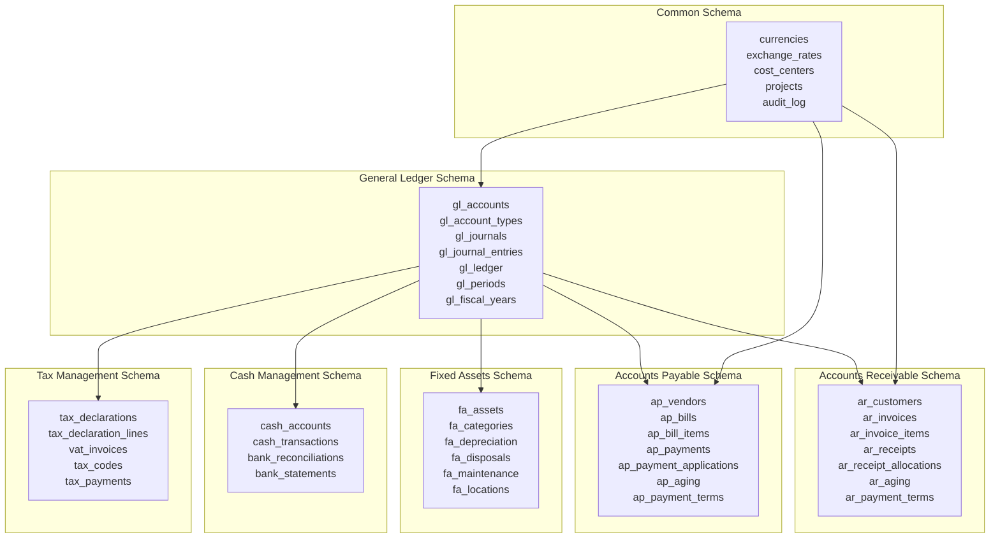
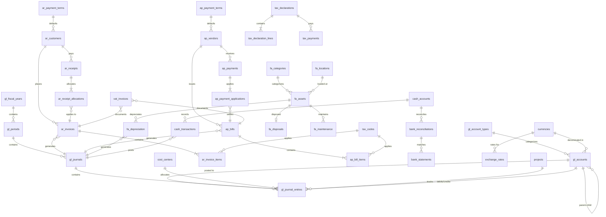
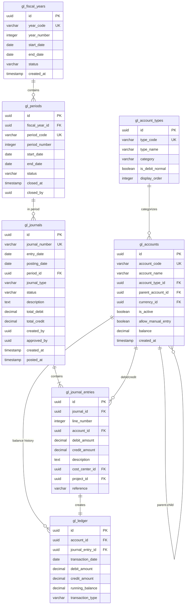

# DATABASE DESIGN DOCUMENT
## Finance & Accounting Module

**Document Version:** 1.0
**Date:** 2025-10-09
**Project:** Bflow ERP System
**Module:** Finance & Accounting
**Phase:** Design (Thiết kế)

---

## Document Control

| Version | Date | Author | Changes |
|---------|------|--------|---------|
| 1.0 | 2025-10-09 | Database Team | Initial database design |

**Review & Approval:**
| Role | Name | Signature | Date |
|------|------|-----------|------|
| Database Architect | | | |
| Tech Lead | | | |
| Chief Accountant | | | |

---

## Table of Contents

1. [Introduction](#1-introduction)
2. [Database Architecture](#2-database-architecture)
3. [Entity Relationship Diagram](#3-entity-relationship-diagram)
4. [Table Specifications](#4-table-specifications)
5. [Indexing Strategy](#5-indexing-strategy)
6. [Data Dictionary](#6-data-dictionary)
7. [Constraints and Rules](#7-constraints-and-rules)
8. [Partitioning Strategy](#8-partitioning-strategy)
9. [Backup and Recovery](#9-backup-and-recovery)
10. [Migration Strategy](#10-migration-strategy)

---

## 1. Introduction

### 1.1 Purpose
This document specifies the complete database design for the Finance & Accounting module, including all tables, relationships, constraints, and optimization strategies.

### 1.2 Scope
Covers:
- 40+ normalized tables (3NF)
- Entity Relationship Diagrams
- Complete data dictionary
- Indexing and optimization strategies
- Data integrity constraints
- Audit trail design

### 1.3 Database Technology
- **DBMS:** PostgreSQL 15+
- **Normalization:** Third Normal Form (3NF)
- **Character Set:** UTF-8
- **Collation:** Vietnamese locale support

### 1.4 References
- Architecture Design Document (1_ArchitectureDesign.md)
- Detailed Design Document (2_DetailedDesign.md)
- Thông tư 200/2014/TT-BTC - Vietnamese Accounting Standards
- Circular 133/2016/TT-BTC - Chart of Accounts

---

## 2. Database Architecture

### 2.1 Schema Organization



### 2.2 Database Sizing Estimates

| Schema | Tables | Est. Rows/Year | Growth Rate |
|--------|--------|----------------|-------------|
| General Ledger | 8 | 120,000 | 10% annually |
| Accounts Receivable | 7 | 60,000 | 15% annually |
| Accounts Payable | 7 | 48,000 | 12% annually |
| Fixed Assets | 6 | 1,000 | 5% annually |
| Cash Management | 4 | 24,000 | 10% annually |
| Tax Management | 5 | 2,400 | 8% annually |
| Common | 5 | 5,000 | 5% annually |
| **Total** | **42** | **260,400** | **10.7% avg** |

---

## 3. Entity Relationship Diagram

### 3.1 Complete ERD



### 3.2 General Ledger ERD Detail



### 3.3 AR/AP ERD Detail

```mermaid
erDiagram
    ar_customers {
        uuid id PK
        varchar customer_code UK
        varchar customer_name
        varchar tax_code
        varchar address
        varchar contact_person
        varchar phone
        varchar email
        uuid payment_term_id FK
        decimal credit_limit
        boolean is_active
    }

    ar_invoices {
        uuid id PK
        varchar invoice_number UK
        date invoice_date
        date due_date
        uuid customer_id FK
        uuid payment_term_id FK
        decimal subtotal
        decimal tax_amount
        decimal total_amount
        decimal paid_amount
        varchar status
        uuid journal_id FK
        timestamp created_at
    }

    ar_invoice_items {
        uuid id PK
        uuid invoice_id FK
        integer line_number
        text description
        decimal quantity
        decimal unit_price
        decimal amount
        uuid revenue_account_id FK
        uuid tax_code_id FK
        decimal tax_amount
    }

    ar_receipts {
        uuid id PK
        varchar receipt_number UK
        date receipt_date
        uuid customer_id FK
        decimal amount
        varchar payment_method
        uuid cash_account_id FK
        varchar reference
        varchar status
        uuid journal_id FK
    }

    ar_receipt_allocations {
        uuid id PK
        uuid receipt_id FK
        uuid invoice_id FK
        decimal allocated_amount
        date allocation_date
    }

    ar_customers ||--o{ ar_invoices : "places"
    ar_invoices ||--|{ ar_invoice_items : "contains"
    ar_customers ||--o{ ar_receipts : "pays"
    ar_receipts ||--|{ ar_receipt_allocations : "allocates"
    ar_receipt_allocations }o--|| ar_invoices : "applies to"
```



---

## 4. Table Specifications

### 4.1 General Ledger Tables

#### Table: gl_fiscal_years
Vietnamese Accounting Year Management

| Column | Type | Constraints | Description |
|--------|------|-------------|-------------|
| id | UUID | PK | Primary key |
| year_code | VARCHAR(10) | UK, NOT NULL | Year code (e.g., FY2025) |
| year_number | INTEGER | NOT NULL | Fiscal year number |
| start_date | DATE | NOT NULL | Year start date |
| end_date | DATE | NOT NULL | Year end date |
| status | VARCHAR(20) | NOT NULL | OPEN, CLOSED |
| created_at | TIMESTAMP | NOT NULL | Creation timestamp |
| created_by | UUID | FK | Creator user ID |

**Indexes:**
- PRIMARY KEY (id)
- UNIQUE (year_code)
- INDEX (status)

**Sample Data:**
```sql
INSERT INTO gl_fiscal_years VALUES
('uuid-1', 'FY2025', 2025, '2025-01-01', '2025-12-31', 'OPEN', NOW(), 'user-1');
```

---

#### Table: gl_periods
Accounting Period Management (Monthly/Quarterly)

| Column | Type | Constraints | Description |
|--------|------|-------------|-------------|
| id | UUID | PK | Primary key |
| fiscal_year_id | UUID | FK, NOT NULL | FK to gl_fiscal_years |
| period_code | VARCHAR(20) | UK, NOT NULL | Period code (2025-01) |
| period_number | INTEGER | NOT NULL | Period number (1-12) |
| period_type | VARCHAR(20) | NOT NULL | MONTH, QUARTER |
| start_date | DATE | NOT NULL | Period start date |
| end_date | DATE | NOT NULL | Period end date |
| status | VARCHAR(20) | NOT NULL | OPEN, CLOSING, CLOSED |
| closed_at | TIMESTAMP | NULL | Closure timestamp |
| closed_by | UUID | FK, NULL | User who closed |

**Indexes:**
- PRIMARY KEY (id)
- UNIQUE (period_code)
- INDEX (fiscal_year_id, period_number)
- INDEX (status)

**Business Rules:**
- One period cannot overlap another
- Periods must close in sequence
- Cannot post to closed periods

---

#### Table: gl_account_types
Chart of Accounts Classification per Circular 133/2016/TT-BTC

| Column | Type | Constraints | Description |
|--------|------|-------------|-------------|
| id | UUID | PK | Primary key |
| type_code | VARCHAR(10) | UK, NOT NULL | Type code (1, 2, 3, ...) |
| type_name | VARCHAR(100) | NOT NULL | Type name (Assets, Liabilities) |
| category | VARCHAR(50) | NOT NULL | ASSET, LIABILITY, EQUITY, REVENUE, EXPENSE |
| is_debit_normal | BOOLEAN | NOT NULL | TRUE if debit increases balance |
| display_order | INTEGER | NOT NULL | Sort order for display |
| description | TEXT | NULL | Description |

**Indexes:**
- PRIMARY KEY (id)
- UNIQUE (type_code)

**Sample Data:**
```sql
INSERT INTO gl_account_types VALUES
('uuid-1', '1', 'Tài sản ngắn hạn', 'ASSET', TRUE, 1, 'Current Assets'),
('uuid-2', '2', 'Tài sản dài hạn', 'ASSET', TRUE, 2, 'Non-current Assets'),
('uuid-3', '3', 'Nợ phải trả', 'LIABILITY', FALSE, 3, 'Liabilities'),
('uuid-4', '4', 'Vốn chủ sở hữu', 'EQUITY', FALSE, 4, 'Owner Equity'),
('uuid-5', '5', 'Doanh thu', 'REVENUE', FALSE, 5, 'Revenue'),
('uuid-6', '6', 'Chi phí', 'EXPENSE', TRUE, 6, 'Expenses');
```

---

#### Table: gl_accounts
Chart of Accounts (Hierarchical)

| Column | Type | Constraints | Description |
|--------|------|-------------|-------------|
| id | UUID | PK | Primary key |
| account_code | VARCHAR(20) | UK, NOT NULL | Account code (111, 1111, 11111) |
| account_name | VARCHAR(200) | NOT NULL | Account name |
| account_type_id | UUID | FK, NOT NULL | FK to gl_account_types |
| parent_account_id | UUID | FK, NULL | Parent account for hierarchy |
| currency_id | UUID | FK, NOT NULL | Default currency |
| is_active | BOOLEAN | NOT NULL | Is account active? |
| allow_manual_entry | BOOLEAN | NOT NULL | Allow direct posting? |
| require_cost_center | BOOLEAN | NOT NULL | Require cost center? |
| require_project | BOOLEAN | NOT NULL | Require project? |
| balance | DECIMAL(18,2) | NOT NULL | Current balance |
| description | TEXT | NULL | Account description |
| created_at | TIMESTAMP | NOT NULL | Creation timestamp |

**Indexes:**
- PRIMARY KEY (id)
- UNIQUE (account_code)
- INDEX (account_type_id)
- INDEX (parent_account_id)
- INDEX (is_active)

**Sample Data (Vietnam Chart of Accounts):**
```sql
-- Tiền mặt
INSERT INTO gl_accounts VALUES
('acc-1', '111', 'Tiền mặt', 'type-1', NULL, 'vnd', TRUE, TRUE, FALSE, FALSE, 0, 'Cash on hand', NOW());

-- Tiền gửi ngân hàng
INSERT INTO gl_accounts VALUES
('acc-2', '112', 'Tiền gửi ngân hàng', 'type-1', NULL, 'vnd', TRUE, FALSE, FALSE, FALSE, 0, 'Cash in bank', NOW());

INSERT INTO gl_accounts VALUES
('acc-3', '1121', 'VCB - TK 1234567890', 'type-1', 'acc-2', 'vnd', TRUE, TRUE, FALSE, FALSE, 0, 'Vietcombank account', NOW());

-- Phải thu khách hàng
INSERT INTO gl_accounts VALUES
('acc-4', '131', 'Phải thu khách hàng', 'type-1', NULL, 'vnd', TRUE, FALSE, FALSE, FALSE, 0, 'Accounts Receivable', NOW());

-- Phải trả người bán
INSERT INTO gl_accounts VALUES
('acc-5', '331', 'Phải trả người bán', 'type-3', NULL, 'vnd', TRUE, FALSE, FALSE, FALSE, 0, 'Accounts Payable', NOW());

-- Doanh thu bán hàng
INSERT INTO gl_accounts VALUES
('acc-6', '511', 'Doanh thu bán hàng và cung cấp dịch vụ', 'type-5', NULL, 'vnd', TRUE, FALSE, FALSE, TRUE, 0, 'Sales Revenue', NOW());

-- Thuế GTGT phải nộp
INSERT INTO gl_accounts VALUES
('acc-7', '3331', 'Thuế GTGT phải nộp', 'type-3', NULL, 'vnd', TRUE, FALSE, FALSE, FALSE, 0, 'VAT Payable', NOW());
```

---

#### Table: gl_journals
Journal Entry Header

| Column | Type | Constraints | Description |
|--------|------|-------------|-------------|
| id | UUID | PK | Primary key |
| journal_number | VARCHAR(30) | UK, NOT NULL | Auto-generated number |
| entry_date | DATE | NOT NULL | Entry date |
| posting_date | DATE | NULL | Date posted to GL |
| period_id | UUID | FK, NOT NULL | FK to gl_periods |
| journal_type | VARCHAR(30) | NOT NULL | MANUAL, AUTO, RECURRING |
| source_type | VARCHAR(30) | NULL | AR, AP, FA, CASH |
| source_id | UUID | NULL | Source document ID |
| status | VARCHAR(20) | NOT NULL | DRAFT, PENDING, APPROVED, POSTED, REVERSED |
| description | TEXT | NOT NULL | Entry description |
| total_debit | DECIMAL(18,2) | NOT NULL | Total debit amount |
| total_credit | DECIMAL(18,2) | NOT NULL | Total credit amount |
| created_by | UUID | FK, NOT NULL | Creator user |
| created_at | TIMESTAMP | NOT NULL | Creation time |
| approved_by | UUID | FK, NULL | Approver user |
| approved_at | TIMESTAMP | NULL | Approval time |
| posted_at | TIMESTAMP | NULL | Posting time |
| reversed_by | UUID | NULL | FK to reversing entry |

**Indexes:**
- PRIMARY KEY (id)
- UNIQUE (journal_number)
- INDEX (period_id, status)
- INDEX (entry_date)
- INDEX (created_by)
- INDEX (source_type, source_id)

**Constraints:**
```sql
ALTER TABLE gl_journals ADD CONSTRAINT chk_balanced
  CHECK (total_debit = total_credit);

ALTER TABLE gl_journals ADD CONSTRAINT chk_status_transition
  CHECK (
    (status = 'DRAFT' AND approved_by IS NULL AND posted_at IS NULL) OR
    (status = 'APPROVED' AND approved_by IS NOT NULL) OR
    (status = 'POSTED' AND posted_at IS NOT NULL)
  );
```

---

#### Table: gl_journal_entries
Journal Entry Lines (Double-Entry)

| Column | Type | Constraints | Description |
|--------|------|-------------|-------------|
| id | UUID | PK | Primary key |
| journal_id | UUID | FK, NOT NULL | FK to gl_journals |
| line_number | INTEGER | NOT NULL | Line sequence |
| account_id | UUID | FK, NOT NULL | FK to gl_accounts |
| debit_amount | DECIMAL(18,2) | NULL | Debit amount |
| credit_amount | DECIMAL(18,2) | NULL | Credit amount |
| description | TEXT | NULL | Line description |
| cost_center_id | UUID | FK, NULL | FK to cost_centers |
| project_id | UUID | FK, NULL | FK to projects |
| reference | VARCHAR(100) | NULL | External reference |
| currency_id | UUID | FK, NOT NULL | Line currency |
| exchange_rate | DECIMAL(12,6) | NOT NULL | Exchange rate if foreign |

**Indexes:**
- PRIMARY KEY (id)
- INDEX (journal_id, line_number)
- INDEX (account_id)
- INDEX (cost_center_id)
- INDEX (project_id)

**Constraints:**
```sql
ALTER TABLE gl_journal_entries ADD CONSTRAINT chk_debit_or_credit
  CHECK (
    (debit_amount IS NOT NULL AND credit_amount IS NULL AND debit_amount > 0) OR
    (credit_amount IS NOT NULL AND debit_amount IS NULL AND credit_amount > 0)
  );
```

---

#### Table: gl_ledger
General Ledger (Materialized Account Balances)

| Column | Type | Constraints | Description |
|--------|------|-------------|-------------|
| id | UUID | PK | Primary key |
| account_id | UUID | FK, NOT NULL | FK to gl_accounts |
| journal_entry_id | UUID | FK, NOT NULL | FK to gl_journal_entries |
| transaction_date | DATE | NOT NULL | Transaction date |
| debit_amount | DECIMAL(18,2) | NOT NULL | Debit amount |
| credit_amount | DECIMAL(18,2) | NOT NULL | Credit amount |
| running_balance | DECIMAL(18,2) | NOT NULL | Running balance |
| transaction_type | VARCHAR(50) | NOT NULL | Transaction type |
| fiscal_year_id | UUID | FK, NOT NULL | FK to gl_fiscal_years |
| period_id | UUID | FK, NOT NULL | FK to gl_periods |

**Indexes:**
- PRIMARY KEY (id)
- INDEX (account_id, transaction_date)
- INDEX (journal_entry_id)
- INDEX (period_id)

**Partitioning:**
```sql
-- Partition by fiscal year for performance
CREATE TABLE gl_ledger_2025 PARTITION OF gl_ledger
  FOR VALUES FROM ('2025-01-01') TO ('2026-01-01');
```

---

### 4.2 Accounts Receivable Tables

#### Table: ar_customers
Customer Master Data

| Column | Type | Constraints | Description |
|--------|------|-------------|-------------|
| id | UUID | PK | Primary key |
| customer_code | VARCHAR(20) | UK, NOT NULL | Customer code |
| customer_name | VARCHAR(200) | NOT NULL | Customer name |
| tax_code | VARCHAR(20) | NULL | Tax identification number |
| legal_name | VARCHAR(200) | NULL | Legal entity name |
| address | TEXT | NULL | Address |
| city | VARCHAR(100) | NULL | City |
| country | VARCHAR(100) | NOT NULL | Country |
| contact_person | VARCHAR(100) | NULL | Contact person |
| phone | VARCHAR(20) | NULL | Phone number |
| email | VARCHAR(100) | NULL | Email |
| payment_term_id | UUID | FK, NULL | Default payment term |
| credit_limit | DECIMAL(18,2) | NOT NULL | Credit limit |
| is_active | BOOLEAN | NOT NULL | Is active? |
| created_at | TIMESTAMP | NOT NULL | Creation time |

**Indexes:**
- PRIMARY KEY (id)
- UNIQUE (customer_code)
- INDEX (customer_name)
- INDEX (tax_code)
- INDEX (is_active)

---

#### Table: ar_invoices
Sales Invoices

| Column | Type | Constraints | Description |
|--------|------|-------------|-------------|
| id | UUID | PK | Primary key |
| invoice_number | VARCHAR(30) | UK, NOT NULL | Invoice number |
| invoice_date | DATE | NOT NULL | Invoice date |
| due_date | DATE | NOT NULL | Payment due date |
| customer_id | UUID | FK, NOT NULL | FK to ar_customers |
| payment_term_id | UUID | FK, NULL | Payment terms |
| currency_id | UUID | FK, NOT NULL | Invoice currency |
| exchange_rate | DECIMAL(12,6) | NOT NULL | Exchange rate |
| subtotal | DECIMAL(18,2) | NOT NULL | Subtotal before tax |
| tax_amount | DECIMAL(18,2) | NOT NULL | Total tax amount |
| total_amount | DECIMAL(18,2) | NOT NULL | Grand total |
| paid_amount | DECIMAL(18,2) | NOT NULL | Amount paid |
| status | VARCHAR(20) | NOT NULL | DRAFT, ISSUED, PARTIAL, PAID, OVERDUE, VOID |
| journal_id | UUID | FK, NULL | FK to gl_journals |
| notes | TEXT | NULL | Notes |
| created_by | UUID | FK, NOT NULL | Creator |
| created_at | TIMESTAMP | NOT NULL | Creation time |

**Indexes:**
- PRIMARY KEY (id)
- UNIQUE (invoice_number)
- INDEX (customer_id, invoice_date)
- INDEX (due_date, status)
- INDEX (status)

**Computed Column:**
```sql
ALTER TABLE ar_invoices ADD COLUMN outstanding_amount DECIMAL(18,2)
  GENERATED ALWAYS AS (total_amount - paid_amount) STORED;
```

---

#### Table: ar_invoice_items
Invoice Line Items

| Column | Type | Constraints | Description |
|--------|------|-------------|-------------|
| id | UUID | PK | Primary key |
| invoice_id | UUID | FK, NOT NULL | FK to ar_invoices |
| line_number | INTEGER | NOT NULL | Line number |
| description | TEXT | NOT NULL | Item description |
| quantity | DECIMAL(12,3) | NOT NULL | Quantity |
| unit_price | DECIMAL(18,2) | NOT NULL | Unit price |
| amount | DECIMAL(18,2) | NOT NULL | Line amount |
| revenue_account_id | UUID | FK, NOT NULL | FK to gl_accounts |
| tax_code_id | UUID | FK, NULL | FK to tax_codes |
| tax_rate | DECIMAL(5,2) | NOT NULL | Tax rate % |
| tax_amount | DECIMAL(18,2) | NOT NULL | Tax amount |

**Indexes:**
- PRIMARY KEY (id)
- INDEX (invoice_id, line_number)
- INDEX (revenue_account_id)

**Constraints:**
```sql
ALTER TABLE ar_invoice_items ADD CONSTRAINT chk_amount
  CHECK (amount = quantity * unit_price);
```

---

#### Table: ar_receipts
Customer Payments

| Column | Type | Constraints | Description |
|--------|------|-------------|-------------|
| id | UUID | PK | Primary key |
| receipt_number | VARCHAR(30) | UK, NOT NULL | Receipt number |
| receipt_date | DATE | NOT NULL | Receipt date |
| customer_id | UUID | FK, NOT NULL | FK to ar_customers |
| amount | DECIMAL(18,2) | NOT NULL | Payment amount |
| payment_method | VARCHAR(30) | NOT NULL | CASH, BANK, CARD, CHECK |
| cash_account_id | UUID | FK, NOT NULL | FK to cash_accounts |
| reference | VARCHAR(100) | NULL | Check/transfer reference |
| status | VARCHAR(20) | NOT NULL | DRAFT, POSTED |
| journal_id | UUID | FK, NULL | FK to gl_journals |
| notes | TEXT | NULL | Notes |
| created_by | UUID | FK, NOT NULL | Creator |
| created_at | TIMESTAMP | NOT NULL | Creation time |

**Indexes:**
- PRIMARY KEY (id)
- UNIQUE (receipt_number)
- INDEX (customer_id, receipt_date)
- INDEX (cash_account_id)

---

#### Table: ar_receipt_allocations
Payment Allocation to Invoices

| Column | Type | Constraints | Description |
|--------|------|-------------|-------------|
| id | UUID | PK | Primary key |
| receipt_id | UUID | FK, NOT NULL | FK to ar_receipts |
| invoice_id | UUID | FK, NOT NULL | FK to ar_invoices |
| allocated_amount | DECIMAL(18,2) | NOT NULL | Allocated amount |
| allocation_date | DATE | NOT NULL | Allocation date |

**Indexes:**
- PRIMARY KEY (id)
- INDEX (receipt_id)
- INDEX (invoice_id)

**Constraints:**
```sql
-- Ensure allocation doesn't exceed receipt amount
CREATE TRIGGER trg_check_allocation_amount
BEFORE INSERT OR UPDATE ON ar_receipt_allocations
FOR EACH ROW EXECUTE FUNCTION check_allocation_limit();
```

---

#### Table: ar_payment_terms
Payment Terms Configuration

| Column | Type | Constraints | Description |
|--------|------|-------------|-------------|
| id | UUID | PK | Primary key |
| term_code | VARCHAR(20) | UK, NOT NULL | Term code |
| term_name | VARCHAR(100) | NOT NULL | Term name |
| net_days | INTEGER | NOT NULL | Net payment days |
| discount_days | INTEGER | NULL | Early payment discount days |
| discount_percent | DECIMAL(5,2) | NULL | Discount percentage |
| is_active | BOOLEAN | NOT NULL | Is active? |

**Sample Data:**
```sql
INSERT INTO ar_payment_terms VALUES
('term-1', 'NET30', 'Net 30 days', 30, NULL, NULL, TRUE),
('term-2', 'NET60', 'Net 60 days', 60, NULL, NULL, TRUE),
('term-3', '2/10NET30', '2% 10 days, Net 30', 30, 10, 2.00, TRUE),
('term-4', 'COD', 'Cash on Delivery', 0, NULL, NULL, TRUE);
```

---

### 4.3 Accounts Payable Tables

#### Table: ap_vendors
Vendor Master Data

| Column | Type | Constraints | Description |
|--------|------|-------------|-------------|
| id | UUID | PK | Primary key |
| vendor_code | VARCHAR(20) | UK, NOT NULL | Vendor code |
| vendor_name | VARCHAR(200) | NOT NULL | Vendor name |
| tax_code | VARCHAR(20) | NULL | Tax ID |
| legal_name | VARCHAR(200) | NULL | Legal name |
| address | TEXT | NULL | Address |
| contact_person | VARCHAR(100) | NULL | Contact |
| phone | VARCHAR(20) | NULL | Phone |
| email | VARCHAR(100) | NULL | Email |
| bank_name | VARCHAR(100) | NULL | Bank name |
| bank_account | VARCHAR(50) | NULL | Bank account number |
| payment_term_id | UUID | FK, NULL | Default payment term |
| is_1099_vendor | BOOLEAN | NOT NULL | Is 1099 vendor? |
| is_active | BOOLEAN | NOT NULL | Is active? |
| created_at | TIMESTAMP | NOT NULL | Creation time |

**Indexes:**
- PRIMARY KEY (id)
- UNIQUE (vendor_code)
- INDEX (vendor_name)
- INDEX (tax_code)

---

#### Table: ap_bills
Vendor Bills

| Column | Type | Constraints | Description |
|--------|------|-------------|-------------|
| id | UUID | PK | Primary key |
| bill_number | VARCHAR(30) | UK, NOT NULL | Bill number |
| vendor_invoice_number | VARCHAR(50) | NULL | Vendor's invoice # |
| bill_date | DATE | NOT NULL | Bill date |
| due_date | DATE | NOT NULL | Due date |
| vendor_id | UUID | FK, NOT NULL | FK to ap_vendors |
| payment_term_id | UUID | FK, NULL | Payment terms |
| currency_id | UUID | FK, NOT NULL | Currency |
| exchange_rate | DECIMAL(12,6) | NOT NULL | Exchange rate |
| subtotal | DECIMAL(18,2) | NOT NULL | Subtotal |
| tax_amount | DECIMAL(18,2) | NOT NULL | Tax amount |
| total_amount | DECIMAL(18,2) | NOT NULL | Total |
| paid_amount | DECIMAL(18,2) | NOT NULL | Paid amount |
| status | VARCHAR(20) | NOT NULL | DRAFT, PENDING, APPROVED, PAID, VOID |
| journal_id | UUID | FK, NULL | FK to gl_journals |
| approved_by | UUID | FK, NULL | Approver |
| approved_at | TIMESTAMP | NULL | Approval time |
| created_by | UUID | FK, NOT NULL | Creator |
| created_at | TIMESTAMP | NOT NULL | Creation time |

**Indexes:**
- PRIMARY KEY (id)
- UNIQUE (bill_number)
- INDEX (vendor_id, bill_date)
- INDEX (due_date, status)

---

#### Table: ap_bill_items
Bill Line Items

| Column | Type | Constraints | Description |
|--------|------|-------------|-------------|
| id | UUID | PK | Primary key |
| bill_id | UUID | FK, NOT NULL | FK to ap_bills |
| line_number | INTEGER | NOT NULL | Line number |
| description | TEXT | NOT NULL | Description |
| amount | DECIMAL(18,2) | NOT NULL | Amount |
| expense_account_id | UUID | FK, NOT NULL | FK to gl_accounts |
| cost_center_id | UUID | FK, NULL | FK to cost_centers |
| project_id | UUID | FK, NULL | FK to projects |
| tax_code_id | UUID | FK, NULL | FK to tax_codes |
| tax_amount | DECIMAL(18,2) | NOT NULL | Tax amount |

**Indexes:**
- PRIMARY KEY (id)
- INDEX (bill_id, line_number)
- INDEX (expense_account_id)
- INDEX (cost_center_id)
- INDEX (project_id)

---

#### Table: ap_payments
Vendor Payments

| Column | Type | Constraints | Description |
|--------|------|-------------|-------------|
| id | UUID | PK | Primary key |
| payment_number | VARCHAR(30) | UK, NOT NULL | Payment number |
| payment_date | DATE | NOT NULL | Payment date |
| vendor_id | UUID | FK, NOT NULL | FK to ap_vendors |
| amount | DECIMAL(18,2) | NOT NULL | Payment amount |
| payment_method | VARCHAR(30) | NOT NULL | CASH, BANK, CHECK |
| cash_account_id | UUID | FK, NOT NULL | FK to cash_accounts |
| check_number | VARCHAR(20) | NULL | Check number |
| reference | VARCHAR(100) | NULL | Reference |
| status | VARCHAR(20) | NOT NULL | DRAFT, POSTED |
| journal_id | UUID | FK, NULL | FK to gl_journals |
| created_by | UUID | FK, NOT NULL | Creator |
| created_at | TIMESTAMP | NOT NULL | Creation time |

**Indexes:**
- PRIMARY KEY (id)
- UNIQUE (payment_number)
- INDEX (vendor_id, payment_date)
- INDEX (cash_account_id)

---

#### Table: ap_payment_applications
Payment Application to Bills

| Column | Type | Constraints | Description |
|--------|------|-------------|-------------|
| id | UUID | PK | Primary key |
| payment_id | UUID | FK, NOT NULL | FK to ap_payments |
| bill_id | UUID | FK, NOT NULL | FK to ap_bills |
| applied_amount | DECIMAL(18,2) | NOT NULL | Applied amount |
| discount_taken | DECIMAL(18,2) | NOT NULL | Discount taken |
| application_date | DATE | NOT NULL | Application date |

**Indexes:**
- PRIMARY KEY (id)
- INDEX (payment_id)
- INDEX (bill_id)

---

### 4.4 Fixed Assets Tables

#### Table: fa_categories
Fixed Asset Categories

| Column | Type | Constraints | Description |
|--------|------|-------------|-------------|
| id | UUID | PK | Primary key |
| category_code | VARCHAR(20) | UK, NOT NULL | Category code |
| category_name | VARCHAR(100) | NOT NULL | Category name |
| asset_account_id | UUID | FK, NOT NULL | Asset GL account |
| depreciation_expense_account_id | UUID | FK, NOT NULL | Expense account |
| accumulated_depreciation_account_id | UUID | FK, NOT NULL | Contra asset account |
| default_useful_life | INTEGER | NOT NULL | Default life (years) |
| default_residual_percent | DECIMAL(5,2) | NOT NULL | Residual % |
| default_method | VARCHAR(20) | NOT NULL | SL, DB, SYD |
| is_active | BOOLEAN | NOT NULL | Is active? |

**Sample Data:**
```sql
INSERT INTO fa_categories VALUES
('cat-1', 'BUILDING', 'Buildings', 'acc-211', 'acc-627', 'acc-214', 25, 10.00, 'SL', TRUE),
('cat-2', 'VEHICLE', 'Vehicles', 'acc-212', 'acc-627', 'acc-214', 8, 10.00, 'DB', TRUE),
('cat-3', 'COMPUTER', 'Computers', 'acc-213', 'acc-627', 'acc-214', 3, 0.00, 'SL', TRUE),
('cat-4', 'FURNITURE', 'Furniture', 'acc-213', 'acc-627', 'acc-214', 10, 10.00, 'SL', TRUE);
```

---

#### Table: fa_assets
Fixed Asset Register

| Column | Type | Constraints | Description |
|--------|------|-------------|-------------|
| id | UUID | PK | Primary key |
| asset_code | VARCHAR(20) | UK, NOT NULL | Asset code |
| asset_name | VARCHAR(200) | NOT NULL | Asset name |
| category_id | UUID | FK, NOT NULL | FK to fa_categories |
| location_id | UUID | FK, NULL | FK to fa_locations |
| acquisition_date | DATE | NOT NULL | Acquisition date |
| placed_in_service_date | DATE | NULL | Service date |
| acquisition_cost | DECIMAL(18,2) | NOT NULL | Cost |
| residual_value | DECIMAL(18,2) | NOT NULL | Salvage value |
| useful_life | INTEGER | NOT NULL | Life in years |
| depreciation_method | VARCHAR(20) | NOT NULL | SL, DB, SYD |
| accumulated_depreciation | DECIMAL(18,2) | NOT NULL | Accumulated dep |
| book_value | DECIMAL(18,2) | NOT NULL | Current book value |
| status | VARCHAR(20) | NOT NULL | IN_PROGRESS, ACTIVE, DISPOSED |
| serial_number | VARCHAR(100) | NULL | Serial number |
| description | TEXT | NULL | Description |
| created_at | TIMESTAMP | NOT NULL | Creation time |

**Indexes:**
- PRIMARY KEY (id)
- UNIQUE (asset_code)
- INDEX (category_id)
- INDEX (status)
- INDEX (placed_in_service_date)

**Computed Column:**
```sql
ALTER TABLE fa_assets ADD COLUMN book_value DECIMAL(18,2)
  GENERATED ALWAYS AS (acquisition_cost - accumulated_depreciation) STORED;
```

---

#### Table: fa_depreciation
Depreciation History

| Column | Type | Constraints | Description |
|--------|------|-------------|-------------|
| id | UUID | PK | Primary key |
| asset_id | UUID | FK, NOT NULL | FK to fa_assets |
| period_id | UUID | FK, NOT NULL | FK to gl_periods |
| depreciation_date | DATE | NOT NULL | Depreciation date |
| depreciation_amount | DECIMAL(18,2) | NOT NULL | Period depreciation |
| accumulated_depreciation | DECIMAL(18,2) | NOT NULL | Total accumulated |
| book_value | DECIMAL(18,2) | NOT NULL | Ending book value |
| journal_id | UUID | FK, NULL | FK to gl_journals |
| calculation_method | VARCHAR(20) | NOT NULL | Method used |
| created_at | TIMESTAMP | NOT NULL | Creation time |

**Indexes:**
- PRIMARY KEY (id)
- INDEX (asset_id, period_id)
- INDEX (period_id)

---

#### Table: fa_disposals
Asset Disposals

| Column | Type | Constraints | Description |
|--------|------|-------------|-------------|
| id | UUID | PK | Primary key |
| asset_id | UUID | FK, NOT NULL | FK to fa_assets |
| disposal_date | DATE | NOT NULL | Disposal date |
| disposal_method | VARCHAR(20) | NOT NULL | SALE, SCRAP, DONATION |
| proceeds_amount | DECIMAL(18,2) | NOT NULL | Sale proceeds |
| book_value | DECIMAL(18,2) | NOT NULL | Book value at disposal |
| gain_loss | DECIMAL(18,2) | NOT NULL | Gain or loss |
| journal_id | UUID | FK, NULL | FK to gl_journals |
| notes | TEXT | NULL | Notes |
| created_by | UUID | FK, NOT NULL | Creator |
| created_at | TIMESTAMP | NOT NULL | Creation time |

**Indexes:**
- PRIMARY KEY (id)
- UNIQUE (asset_id)
- INDEX (disposal_date)

---

### 4.5 Cash Management Tables

#### Table: cash_accounts
Cash and Bank Accounts

| Column | Type | Constraints | Description |
|--------|------|-------------|-------------|
| id | UUID | PK | Primary key |
| account_code | VARCHAR(20) | UK, NOT NULL | Account code |
| account_name | VARCHAR(100) | NOT NULL | Account name |
| account_type | VARCHAR(20) | NOT NULL | CASH, BANK, PETTY_CASH |
| gl_account_id | UUID | FK, NOT NULL | FK to gl_accounts |
| currency_id | UUID | FK, NOT NULL | Account currency |
| bank_name | VARCHAR(100) | NULL | Bank name |
| bank_branch | VARCHAR(100) | NULL | Branch |
| account_number | VARCHAR(50) | NULL | Account number |
| current_balance | DECIMAL(18,2) | NOT NULL | Current balance |
| is_active | BOOLEAN | NOT NULL | Is active? |

**Indexes:**
- PRIMARY KEY (id)
- UNIQUE (account_code)
- INDEX (gl_account_id)

---

#### Table: cash_transactions
Cash Receipts and Payments

| Column | Type | Constraints | Description |
|--------|------|-------------|-------------|
| id | UUID | PK | Primary key |
| transaction_number | VARCHAR(30) | UK, NOT NULL | Transaction number |
| transaction_date | DATE | NOT NULL | Transaction date |
| cash_account_id | UUID | FK, NOT NULL | FK to cash_accounts |
| transaction_type | VARCHAR(20) | NOT NULL | RECEIPT, PAYMENT |
| amount | DECIMAL(18,2) | NOT NULL | Amount |
| counterparty | VARCHAR(200) | NULL | Payee/payer |
| description | TEXT | NOT NULL | Description |
| reference | VARCHAR(100) | NULL | Reference |
| journal_id | UUID | FK, NULL | FK to gl_journals |
| created_by | UUID | FK, NOT NULL | Creator |
| created_at | TIMESTAMP | NOT NULL | Creation time |

**Indexes:**
- PRIMARY KEY (id)
- UNIQUE (transaction_number)
- INDEX (cash_account_id, transaction_date)
- INDEX (transaction_type)

---

#### Table: bank_reconciliations
Bank Reconciliation Header

| Column | Type | Constraints | Description |
|--------|------|-------------|-------------|
| id | UUID | PK | Primary key |
| cash_account_id | UUID | FK, NOT NULL | FK to cash_accounts |
| reconciliation_date | DATE | NOT NULL | Reconciliation date |
| statement_date | DATE | NOT NULL | Bank statement date |
| statement_balance | DECIMAL(18,2) | NOT NULL | Statement ending balance |
| book_balance | DECIMAL(18,2) | NOT NULL | Book balance |
| adjusted_balance | DECIMAL(18,2) | NOT NULL | Reconciled balance |
| status | VARCHAR(20) | NOT NULL | IN_PROGRESS, COMPLETED |
| reconciled_by | UUID | FK, NULL | Reconciled by |
| reconciled_at | TIMESTAMP | NULL | Reconciliation time |

**Indexes:**
- PRIMARY KEY (id)
- INDEX (cash_account_id, reconciliation_date)

---

### 4.6 Tax Management Tables

#### Table: tax_codes
Tax Code Configuration

| Column | Type | Constraints | Description |
|--------|------|-------------|-------------|
| id | UUID | PK | Primary key |
| tax_code | VARCHAR(20) | UK, NOT NULL | Tax code |
| tax_name | VARCHAR(100) | NOT NULL | Tax name |
| tax_type | VARCHAR(20) | NOT NULL | VAT, CIT, PIT |
| rate | DECIMAL(5,2) | NOT NULL | Tax rate % |
| gl_account_id | UUID | FK, NOT NULL | Tax GL account |
| effective_from | DATE | NOT NULL | Effective from |
| effective_to | DATE | NULL | Effective to |
| is_active | BOOLEAN | NOT NULL | Is active? |

**Sample Data:**
```sql
INSERT INTO tax_codes VALUES
('tax-1', 'VAT0', 'VAT 0%', 'VAT', 0.00, 'acc-3331', '2020-01-01', NULL, TRUE),
('tax-2', 'VAT5', 'VAT 5%', 'VAT', 5.00, 'acc-3331', '2020-01-01', NULL, TRUE),
('tax-3', 'VAT10', 'VAT 10%', 'VAT', 10.00, 'acc-3331', '2020-01-01', NULL, TRUE),
('tax-4', 'CIT20', 'Corporate Income Tax 20%', 'CIT', 20.00, 'acc-3334', '2020-01-01', NULL, TRUE);
```

---

#### Table: tax_declarations
Tax Declaration Header

| Column | Type | Constraints | Description |
|--------|------|-------------|-------------|
| id | UUID | PK | Primary key |
| declaration_number | VARCHAR(30) | UK, NOT NULL | Declaration number |
| tax_type | VARCHAR(20) | NOT NULL | VAT, CIT, PIT |
| declaration_type | VARCHAR(20) | NOT NULL | MONTHLY, QUARTERLY, ANNUAL |
| period_id | UUID | FK, NULL | FK to gl_periods |
| fiscal_year_id | UUID | FK, NOT NULL | FK to gl_fiscal_years |
| filing_date | DATE | NULL | Filing date |
| taxable_amount | DECIMAL(18,2) | NOT NULL | Taxable amount |
| tax_amount | DECIMAL(18,2) | NOT NULL | Tax amount |
| status | VARCHAR(20) | NOT NULL | DRAFT, SUBMITTED, APPROVED |
| submission_receipt | VARCHAR(100) | NULL | TCT receipt number |
| created_by | UUID | FK, NOT NULL | Creator |
| created_at | TIMESTAMP | NOT NULL | Creation time |

**Indexes:**
- PRIMARY KEY (id)
- UNIQUE (declaration_number)
- INDEX (tax_type, period_id)
- INDEX (fiscal_year_id)

---

#### Table: tax_declaration_lines
Tax Declaration Line Items

| Column | Type | Constraints | Description |
|--------|------|-------------|-------------|
| id | UUID | PK | Primary key |
| declaration_id | UUID | FK, NOT NULL | FK to tax_declarations |
| line_number | INTEGER | NOT NULL | Line number |
| line_code | VARCHAR(20) | NOT NULL | Form line code |
| description | TEXT | NOT NULL | Description |
| amount | DECIMAL(18,2) | NOT NULL | Amount |

**Indexes:**
- PRIMARY KEY (id)
- INDEX (declaration_id, line_number)

---

#### Table: vat_invoices
VAT Invoice Register (Nghị định 123/2020)

| Column | Type | Constraints | Description |
|--------|------|-------------|-------------|
| id | UUID | PK | Primary key |
| invoice_type | VARCHAR(20) | NOT NULL | OUTPUT, INPUT |
| invoice_number | VARCHAR(30) | NOT NULL | Invoice number |
| invoice_serial | VARCHAR(20) | NOT NULL | Invoice serial |
| invoice_template | VARCHAR(20) | NOT NULL | Invoice template |
| invoice_date | DATE | NOT NULL | Invoice date |
| seller_name | VARCHAR(200) | NOT NULL | Seller name |
| seller_tax_code | VARCHAR(20) | NOT NULL | Seller tax code |
| buyer_name | VARCHAR(200) | NOT NULL | Buyer name |
| buyer_tax_code | VARCHAR(20) | NULL | Buyer tax code |
| amount | DECIMAL(18,2) | NOT NULL | Amount before VAT |
| vat_rate | DECIMAL(5,2) | NOT NULL | VAT rate |
| vat_amount | DECIMAL(18,2) | NOT NULL | VAT amount |
| total_amount | DECIMAL(18,2) | NOT NULL | Total with VAT |
| source_type | VARCHAR(20) | NULL | AR_INVOICE, AP_BILL |
| source_id | UUID | NULL | Source document ID |
| e_invoice_code | VARCHAR(50) | NULL | E-invoice code |
| created_at | TIMESTAMP | NOT NULL | Creation time |

**Indexes:**
- PRIMARY KEY (id)
- INDEX (invoice_type, invoice_date)
- INDEX (seller_tax_code)
- INDEX (buyer_tax_code)
- INDEX (source_type, source_id)

---

### 4.7 Common Tables

#### Table: currencies
Currency Master

| Column | Type | Constraints | Description |
|--------|------|-------------|-------------|
| id | UUID | PK | Primary key |
| currency_code | VARCHAR(3) | UK, NOT NULL | ISO code (VND, USD) |
| currency_name | VARCHAR(100) | NOT NULL | Currency name |
| symbol | VARCHAR(10) | NOT NULL | Symbol |
| decimal_places | INTEGER | NOT NULL | Decimal places |
| is_active | BOOLEAN | NOT NULL | Is active? |

**Sample Data:**
```sql
INSERT INTO currencies VALUES
('curr-1', 'VND', 'Vietnamese Dong', '₫', 0, TRUE),
('curr-2', 'USD', 'US Dollar', '$', 2, TRUE),
('curr-3', 'EUR', 'Euro', '€', 2, TRUE);
```

---

#### Table: exchange_rates
Currency Exchange Rates

| Column | Type | Constraints | Description |
|--------|------|-------------|-------------|
| id | UUID | PK | Primary key |
| from_currency_id | UUID | FK, NOT NULL | From currency |
| to_currency_id | UUID | FK, NOT NULL | To currency |
| rate_date | DATE | NOT NULL | Rate date |
| rate | DECIMAL(12,6) | NOT NULL | Exchange rate |
| rate_type | VARCHAR(20) | NOT NULL | OFFICIAL, BANK, CUSTOM |

**Indexes:**
- PRIMARY KEY (id)
- UNIQUE (from_currency_id, to_currency_id, rate_date, rate_type)

---

#### Table: cost_centers
Cost Center Master

| Column | Type | Constraints | Description |
|--------|------|-------------|-------------|
| id | UUID | PK | Primary key |
| cost_center_code | VARCHAR(20) | UK, NOT NULL | Code |
| cost_center_name | VARCHAR(100) | NOT NULL | Name |
| parent_id | UUID | FK, NULL | Parent cost center |
| manager_id | UUID | FK, NULL | Manager user |
| is_active | BOOLEAN | NOT NULL | Is active? |

---

#### Table: projects
Project Master

| Column | Type | Constraints | Description |
|--------|------|-------------|-------------|
| id | UUID | PK | Primary key |
| project_code | VARCHAR(20) | UK, NOT NULL | Code |
| project_name | VARCHAR(200) | NOT NULL | Name |
| start_date | DATE | NOT NULL | Start date |
| end_date | DATE | NULL | End date |
| status | VARCHAR(20) | NOT NULL | PLANNED, ACTIVE, CLOSED |
| budget | DECIMAL(18,2) | NULL | Budget |

---

#### Table: audit_log
Comprehensive Audit Trail

| Column | Type | Constraints | Description |
|--------|------|-------------|-------------|
| id | UUID | PK | Primary key |
| table_name | VARCHAR(100) | NOT NULL | Table name |
| record_id | UUID | NOT NULL | Record ID |
| action | VARCHAR(20) | NOT NULL | INSERT, UPDATE, DELETE |
| old_values | JSONB | NULL | Old values |
| new_values | JSONB | NULL | New values |
| changed_by | UUID | FK, NOT NULL | User ID |
| changed_at | TIMESTAMP | NOT NULL | Timestamp |
| ip_address | VARCHAR(50) | NULL | IP address |
| user_agent | TEXT | NULL | User agent |

**Indexes:**
- PRIMARY KEY (id)
- INDEX (table_name, record_id)
- INDEX (changed_by)
- INDEX (changed_at)

**Partitioning:**
```sql
-- Partition by month for audit log
CREATE TABLE audit_log_2025_10 PARTITION OF audit_log
  FOR VALUES FROM ('2025-10-01') TO ('2025-11-01');
```

---

## 5. Indexing Strategy

### 5.1 Primary Indexes

All tables have:
- **Primary Key (UUID):** Clustered index on ID column
- **Unique Constraints:** On business keys (codes, numbers)

### 5.2 Foreign Key Indexes

```sql
-- General Ledger
CREATE INDEX idx_gl_journals_period ON gl_journals(period_id);
CREATE INDEX idx_gl_journals_created_by ON gl_journals(created_by);
CREATE INDEX idx_gl_journal_entries_journal ON gl_journal_entries(journal_id);
CREATE INDEX idx_gl_journal_entries_account ON gl_journal_entries(account_id);

-- Accounts Receivable
CREATE INDEX idx_ar_invoices_customer ON ar_invoices(customer_id);
CREATE INDEX idx_ar_invoice_items_invoice ON ar_invoice_items(invoice_id);
CREATE INDEX idx_ar_receipts_customer ON ar_receipts(customer_id);

-- Accounts Payable
CREATE INDEX idx_ap_bills_vendor ON ap_bills(vendor_id);
CREATE INDEX idx_ap_bill_items_bill ON ap_bill_items(bill_id);
CREATE INDEX idx_ap_payments_vendor ON ap_payments(vendor_id);

-- Fixed Assets
CREATE INDEX idx_fa_assets_category ON fa_assets(category_id);
CREATE INDEX idx_fa_depreciation_asset ON fa_depreciation(asset_id);
```

### 5.3 Query Optimization Indexes

```sql
-- Date range queries
CREATE INDEX idx_gl_journals_entry_date ON gl_journals(entry_date);
CREATE INDEX idx_ar_invoices_invoice_date ON ar_invoices(invoice_date);
CREATE INDEX idx_ap_bills_bill_date ON ap_bills(bill_date);

-- Status filtering
CREATE INDEX idx_gl_journals_status ON gl_journals(status);
CREATE INDEX idx_ar_invoices_status ON ar_invoices(status);
CREATE INDEX idx_ap_bills_status ON ap_bills(status);

-- Composite indexes for common queries
CREATE INDEX idx_gl_journals_period_status ON gl_journals(period_id, status);
CREATE INDEX idx_ar_invoices_customer_date ON ar_invoices(customer_id, invoice_date);
CREATE INDEX idx_ap_bills_vendor_date ON ap_bills(vendor_id, bill_date);

-- Overdue invoices query
CREATE INDEX idx_ar_invoices_overdue ON ar_invoices(due_date, status)
  WHERE status IN ('ISSUED', 'PARTIAL');
```

### 5.4 Full-Text Search Indexes

```sql
-- Search accounts by name
CREATE INDEX idx_gl_accounts_name_fts ON gl_accounts
  USING GIN (to_tsvector('english', account_name));

-- Search customers
CREATE INDEX idx_ar_customers_name_fts ON ar_customers
  USING GIN (to_tsvector('english', customer_name));

-- Search vendors
CREATE INDEX idx_ap_vendors_name_fts ON ap_vendors
  USING GIN (to_tsvector('english', vendor_name));
```

---

## 6. Data Dictionary

### 6.1 Common Data Types

| Type | Usage | Format | Example |
|------|-------|--------|---------|
| UUID | Primary keys, foreign keys | RFC 4122 | 550e8400-e29b-41d4-a716-446655440000 |
| VARCHAR(n) | Codes, short text | UTF-8 | "INV-2025-0001" |
| TEXT | Descriptions, notes | UTF-8 | Long descriptions |
| DECIMAL(18,2) | Money amounts | 18 digits, 2 decimals | 1000000.50 |
| DECIMAL(12,6) | Exchange rates | 12 digits, 6 decimals | 23500.123456 |
| DATE | Dates | YYYY-MM-DD | 2025-10-09 |
| TIMESTAMP | Date/time | ISO 8601 | 2025-10-09 14:30:00 |
| BOOLEAN | Flags | TRUE/FALSE | TRUE |
| JSONB | Flexible data | JSON | {"key": "value"} |

### 6.2 Enumerated Values

#### Journal Status
- DRAFT: Draft, not posted
- PENDING_APPROVAL: Awaiting approval
- APPROVED: Approved, ready to post
- POSTED: Posted to GL
- REVERSED: Reversed entry

#### Invoice Status
- DRAFT: Draft invoice
- ISSUED: Issued to customer
- PARTIAL: Partially paid
- PAID: Fully paid
- OVERDUE: Past due date
- VOID: Voided invoice

#### Period Status
- NOT_STARTED: Not yet opened
- OPEN: Open for transactions
- CLOSING: Close in progress
- CLOSED: Permanently closed

#### Asset Status
- IN_PROGRESS: Under acquisition
- ACTIVE: In service
- UNDER_MAINTENANCE: Maintenance
- DISPOSED: Disposed

#### Payment Method
- CASH: Cash payment
- BANK: Bank transfer
- CARD: Credit/debit card
- CHECK: Check payment

---

## 7. Constraints and Rules

### 7.1 Check Constraints

```sql
-- Journal entry must balance
ALTER TABLE gl_journals ADD CONSTRAINT chk_journal_balanced
  CHECK (total_debit = total_credit);

-- Journal line must have debit OR credit (not both)
ALTER TABLE gl_journal_entries ADD CONSTRAINT chk_debit_or_credit
  CHECK (
    (debit_amount IS NOT NULL AND credit_amount IS NULL AND debit_amount > 0) OR
    (credit_amount IS NOT NULL AND debit_amount IS NULL AND credit_amount > 0)
  );

-- Invoice amount validations
ALTER TABLE ar_invoices ADD CONSTRAINT chk_invoice_totals
  CHECK (total_amount = subtotal + tax_amount);

ALTER TABLE ar_invoices ADD CONSTRAINT chk_paid_amount
  CHECK (paid_amount >= 0 AND paid_amount <= total_amount);

-- Date validations
ALTER TABLE ar_invoices ADD CONSTRAINT chk_due_date
  CHECK (due_date >= invoice_date);

ALTER TABLE gl_periods ADD CONSTRAINT chk_period_dates
  CHECK (end_date > start_date);

-- Fixed asset validations
ALTER TABLE fa_assets ADD CONSTRAINT chk_residual_value
  CHECK (residual_value >= 0 AND residual_value < acquisition_cost);

ALTER TABLE fa_assets ADD CONSTRAINT chk_useful_life
  CHECK (useful_life > 0 AND useful_life <= 50);
```

### 7.2 Triggers

```sql
-- Auto-update account balance when journal posted
CREATE OR REPLACE FUNCTION update_account_balance()
RETURNS TRIGGER AS $$
BEGIN
  IF NEW.status = 'POSTED' AND OLD.status != 'POSTED' THEN
    -- Update account balances from journal lines
    UPDATE gl_accounts a
    SET balance = balance +
      (SELECT COALESCE(SUM(debit_amount), 0) - COALESCE(SUM(credit_amount), 0)
       FROM gl_journal_entries
       WHERE journal_id = NEW.id AND account_id = a.id)
    WHERE id IN (SELECT account_id FROM gl_journal_entries WHERE journal_id = NEW.id);
  END IF;
  RETURN NEW;
END;
$$ LANGUAGE plpgsql;

CREATE TRIGGER trg_update_account_balance
AFTER UPDATE ON gl_journals
FOR EACH ROW EXECUTE FUNCTION update_account_balance();

-- Auto-update invoice status when payment received
CREATE OR REPLACE FUNCTION update_invoice_status()
RETURNS TRIGGER AS $$
BEGIN
  UPDATE ar_invoices
  SET status = CASE
    WHEN paid_amount = 0 THEN 'ISSUED'
    WHEN paid_amount < total_amount THEN 'PARTIAL'
    WHEN paid_amount = total_amount THEN 'PAID'
  END
  WHERE id = NEW.invoice_id;
  RETURN NEW;
END;
$$ LANGUAGE plpgsql;

CREATE TRIGGER trg_update_invoice_status
AFTER INSERT OR UPDATE ON ar_receipt_allocations
FOR EACH ROW EXECUTE FUNCTION update_invoice_status();

-- Audit trail trigger
CREATE OR REPLACE FUNCTION audit_trail()
RETURNS TRIGGER AS $$
BEGIN
  IF TG_OP = 'INSERT' THEN
    INSERT INTO audit_log (table_name, record_id, action, new_values, changed_by, changed_at)
    VALUES (TG_TABLE_NAME, NEW.id, 'INSERT', row_to_json(NEW), NEW.created_by, NOW());
  ELSIF TG_OP = 'UPDATE' THEN
    INSERT INTO audit_log (table_name, record_id, action, old_values, new_values, changed_by, changed_at)
    VALUES (TG_TABLE_NAME, NEW.id, 'UPDATE', row_to_json(OLD), row_to_json(NEW), NEW.created_by, NOW());
  ELSIF TG_OP = 'DELETE' THEN
    INSERT INTO audit_log (table_name, record_id, action, old_values, changed_by, changed_at)
    VALUES (TG_TABLE_NAME, OLD.id, 'DELETE', row_to_json(OLD), current_setting('app.user_id')::uuid, NOW());
  END IF;
  RETURN NULL;
END;
$$ LANGUAGE plpgsql;

-- Apply to all major tables
CREATE TRIGGER trg_audit_gl_journals
AFTER INSERT OR UPDATE OR DELETE ON gl_journals
FOR EACH ROW EXECUTE FUNCTION audit_trail();
```

### 7.3 Referential Integrity

```sql
-- Cascade deletes for detail records
ALTER TABLE gl_journal_entries
  ADD CONSTRAINT fk_journal
  FOREIGN KEY (journal_id) REFERENCES gl_journals(id)
  ON DELETE CASCADE;

ALTER TABLE ar_invoice_items
  ADD CONSTRAINT fk_invoice
  FOREIGN KEY (invoice_id) REFERENCES ar_invoices(id)
  ON DELETE CASCADE;

-- Restrict deletes for master data
ALTER TABLE gl_journals
  ADD CONSTRAINT fk_period
  FOREIGN KEY (period_id) REFERENCES gl_periods(id)
  ON DELETE RESTRICT;

ALTER TABLE ar_invoices
  ADD CONSTRAINT fk_customer
  FOREIGN KEY (customer_id) REFERENCES ar_customers(id)
  ON DELETE RESTRICT;
```

---

## 8. Partitioning Strategy

### 8.1 Table Partitioning

```sql
-- Partition gl_ledger by fiscal year
CREATE TABLE gl_ledger (
  id UUID NOT NULL,
  account_id UUID NOT NULL,
  transaction_date DATE NOT NULL,
  -- ... other columns
  PRIMARY KEY (id, transaction_date)
) PARTITION BY RANGE (transaction_date);

CREATE TABLE gl_ledger_2024 PARTITION OF gl_ledger
  FOR VALUES FROM ('2024-01-01') TO ('2025-01-01');

CREATE TABLE gl_ledger_2025 PARTITION OF gl_ledger
  FOR VALUES FROM ('2025-01-01') TO ('2026-01-01');

CREATE TABLE gl_ledger_2026 PARTITION OF gl_ledger
  FOR VALUES FROM ('2026-01-01') TO ('2027-01-01');

-- Partition audit_log by month
CREATE TABLE audit_log (
  id UUID NOT NULL,
  changed_at TIMESTAMP NOT NULL,
  -- ... other columns
  PRIMARY KEY (id, changed_at)
) PARTITION BY RANGE (changed_at);

-- Create monthly partitions programmatically
CREATE TABLE audit_log_2025_10 PARTITION OF audit_log
  FOR VALUES FROM ('2025-10-01') TO ('2025-11-01');
```

### 8.2 Partition Maintenance

```sql
-- Drop old partitions (data retention policy)
DROP TABLE IF EXISTS audit_log_2020_01;

-- Create future partitions
CREATE TABLE gl_ledger_2027 PARTITION OF gl_ledger
  FOR VALUES FROM ('2027-01-01') TO ('2028-01-01');
```

---

## 9. Backup and Recovery

### 9.1 Backup Strategy

| Type | Frequency | Retention | Tool |
|------|-----------|-----------|------|
| Full Backup | Daily (2 AM) | 30 days | pg_dump |
| Incremental | Every 6 hours | 7 days | WAL archiving |
| Transaction Log | Continuous | 7 days | WAL streaming |
| Cloud Backup | Daily | 90 days | AWS S3 / Azure Blob |

### 9.2 Recovery Procedures

```bash
# Full database restore
pg_restore -d accounting_db backup_2025_10_09.dump

# Point-in-time recovery
pg_restore --time '2025-10-09 14:00:00' -d accounting_db

# Table-level restore
pg_restore -t gl_journals backup_2025_10_09.dump
```

### 9.3 Disaster Recovery

- **RTO (Recovery Time Objective):** 4 hours
- **RPO (Recovery Point Objective):** 15 minutes
- **Standby Database:** Hot standby with streaming replication
- **Failover:** Automatic with pgpool-II

---

## 10. Migration Strategy

### 10.1 Initial Data Migration

```sql
-- Step 1: Create schema
\i 01_create_tables.sql
\i 02_create_indexes.sql
\i 03_create_constraints.sql

-- Step 2: Migrate master data
\i 04_migrate_chart_of_accounts.sql
\i 05_migrate_customers.sql
\i 06_migrate_vendors.sql

-- Step 3: Migrate transactional data
\i 07_migrate_opening_balances.sql
\i 08_migrate_historical_transactions.sql

-- Step 4: Validate
\i 09_validate_data.sql
```

### 10.2 Data Validation

```sql
-- Validate account balances
SELECT
  a.account_code,
  a.balance AS system_balance,
  SUM(COALESCE(l.debit_amount, 0) - COALESCE(l.credit_amount, 0)) AS calculated_balance,
  a.balance - SUM(COALESCE(l.debit_amount, 0) - COALESCE(l.credit_amount, 0)) AS difference
FROM gl_accounts a
LEFT JOIN gl_ledger l ON a.id = l.account_id
GROUP BY a.id, a.account_code, a.balance
HAVING ABS(a.balance - SUM(COALESCE(l.debit_amount, 0) - COALESCE(l.credit_amount, 0))) > 0.01;

-- Validate invoice balances
SELECT
  invoice_number,
  total_amount,
  paid_amount,
  (SELECT SUM(allocated_amount) FROM ar_receipt_allocations WHERE invoice_id = i.id) AS calculated_paid,
  paid_amount - (SELECT SUM(allocated_amount) FROM ar_receipt_allocations WHERE invoice_id = i.id) AS difference
FROM ar_invoices i
WHERE paid_amount > 0
HAVING ABS(paid_amount - (SELECT COALESCE(SUM(allocated_amount), 0) FROM ar_receipt_allocations WHERE invoice_id = i.id)) > 0.01;

-- Validate accounting equation (Assets = Liabilities + Equity)
SELECT
  SUM(CASE WHEN at.category = 'ASSET' THEN a.balance ELSE 0 END) AS total_assets,
  SUM(CASE WHEN at.category = 'LIABILITY' THEN a.balance ELSE 0 END) AS total_liabilities,
  SUM(CASE WHEN at.category = 'EQUITY' THEN a.balance ELSE 0 END) AS total_equity,
  SUM(CASE WHEN at.category = 'ASSET' THEN a.balance ELSE 0 END) -
  (SUM(CASE WHEN at.category = 'LIABILITY' THEN a.balance ELSE 0 END) +
   SUM(CASE WHEN at.category = 'EQUITY' THEN a.balance ELSE 0 END)) AS difference
FROM gl_accounts a
JOIN gl_account_types at ON a.account_type_id = at.id;
```

---

## Appendix A: SQL DDL Scripts

### Complete Schema Creation

```sql
-- File: 01_create_tables.sql

-- General Ledger Tables
CREATE TABLE gl_fiscal_years (
  id UUID PRIMARY KEY DEFAULT gen_random_uuid(),
  year_code VARCHAR(10) UNIQUE NOT NULL,
  year_number INTEGER NOT NULL,
  start_date DATE NOT NULL,
  end_date DATE NOT NULL,
  status VARCHAR(20) NOT NULL CHECK (status IN ('OPEN', 'CLOSED')),
  created_at TIMESTAMP NOT NULL DEFAULT NOW(),
  created_by UUID NOT NULL
);

CREATE TABLE gl_periods (
  id UUID PRIMARY KEY DEFAULT gen_random_uuid(),
  fiscal_year_id UUID NOT NULL REFERENCES gl_fiscal_years(id),
  period_code VARCHAR(20) UNIQUE NOT NULL,
  period_number INTEGER NOT NULL,
  period_type VARCHAR(20) NOT NULL CHECK (period_type IN ('MONTH', 'QUARTER', 'YEAR')),
  start_date DATE NOT NULL,
  end_date DATE NOT NULL,
  status VARCHAR(20) NOT NULL CHECK (status IN ('NOT_STARTED', 'OPEN', 'CLOSING', 'CLOSED')),
  closed_at TIMESTAMP,
  closed_by UUID,
  CHECK (end_date > start_date)
);

CREATE TABLE gl_account_types (
  id UUID PRIMARY KEY DEFAULT gen_random_uuid(),
  type_code VARCHAR(10) UNIQUE NOT NULL,
  type_name VARCHAR(100) NOT NULL,
  category VARCHAR(50) NOT NULL CHECK (category IN ('ASSET', 'LIABILITY', 'EQUITY', 'REVENUE', 'EXPENSE')),
  is_debit_normal BOOLEAN NOT NULL,
  display_order INTEGER NOT NULL,
  description TEXT
);

CREATE TABLE gl_accounts (
  id UUID PRIMARY KEY DEFAULT gen_random_uuid(),
  account_code VARCHAR(20) UNIQUE NOT NULL,
  account_name VARCHAR(200) NOT NULL,
  account_type_id UUID NOT NULL REFERENCES gl_account_types(id),
  parent_account_id UUID REFERENCES gl_accounts(id),
  currency_id UUID NOT NULL,
  is_active BOOLEAN NOT NULL DEFAULT TRUE,
  allow_manual_entry BOOLEAN NOT NULL DEFAULT TRUE,
  require_cost_center BOOLEAN NOT NULL DEFAULT FALSE,
  require_project BOOLEAN NOT NULL DEFAULT FALSE,
  balance DECIMAL(18,2) NOT NULL DEFAULT 0,
  description TEXT,
  created_at TIMESTAMP NOT NULL DEFAULT NOW()
);

CREATE TABLE gl_journals (
  id UUID PRIMARY KEY DEFAULT gen_random_uuid(),
  journal_number VARCHAR(30) UNIQUE NOT NULL,
  entry_date DATE NOT NULL,
  posting_date DATE,
  period_id UUID NOT NULL REFERENCES gl_periods(id),
  journal_type VARCHAR(30) NOT NULL CHECK (journal_type IN ('MANUAL', 'AUTO', 'RECURRING', 'ADJUSTING', 'CLOSING')),
  source_type VARCHAR(30),
  source_id UUID,
  status VARCHAR(20) NOT NULL CHECK (status IN ('DRAFT', 'PENDING_APPROVAL', 'APPROVED', 'POSTED', 'REVERSED')),
  description TEXT NOT NULL,
  total_debit DECIMAL(18,2) NOT NULL DEFAULT 0,
  total_credit DECIMAL(18,2) NOT NULL DEFAULT 0,
  created_by UUID NOT NULL,
  created_at TIMESTAMP NOT NULL DEFAULT NOW(),
  approved_by UUID,
  approved_at TIMESTAMP,
  posted_at TIMESTAMP,
  reversed_by UUID,
  CHECK (total_debit = total_credit)
);

CREATE TABLE gl_journal_entries (
  id UUID PRIMARY KEY DEFAULT gen_random_uuid(),
  journal_id UUID NOT NULL REFERENCES gl_journals(id) ON DELETE CASCADE,
  line_number INTEGER NOT NULL,
  account_id UUID NOT NULL REFERENCES gl_accounts(id),
  debit_amount DECIMAL(18,2),
  credit_amount DECIMAL(18,2),
  description TEXT,
  cost_center_id UUID,
  project_id UUID,
  reference VARCHAR(100),
  currency_id UUID NOT NULL,
  exchange_rate DECIMAL(12,6) NOT NULL DEFAULT 1,
  CHECK (
    (debit_amount IS NOT NULL AND credit_amount IS NULL AND debit_amount > 0) OR
    (credit_amount IS NOT NULL AND debit_amount IS NULL AND credit_amount > 0)
  )
);

-- Additional tables would follow...
-- See complete DDL in database/schema/ directory
```

---

## Appendix B: Sample Queries

### Financial Reports

```sql
-- Trial Balance
SELECT
  a.account_code,
  a.account_name,
  SUM(CASE WHEN je.debit_amount IS NOT NULL THEN je.debit_amount ELSE 0 END) AS total_debit,
  SUM(CASE WHEN je.credit_amount IS NOT NULL THEN je.credit_amount ELSE 0 END) AS total_credit,
  SUM(CASE WHEN je.debit_amount IS NOT NULL THEN je.debit_amount ELSE 0 END) -
  SUM(CASE WHEN je.credit_amount IS NOT NULL THEN je.credit_amount ELSE 0 END) AS balance
FROM gl_accounts a
LEFT JOIN gl_journal_entries je ON a.id = je.account_id
LEFT JOIN gl_journals j ON je.journal_id = j.id
WHERE j.status = 'POSTED'
  AND j.posting_date <= '2025-10-09'
GROUP BY a.id, a.account_code, a.account_name
ORDER BY a.account_code;

-- AR Aging Report
SELECT
  c.customer_name,
  SUM(CASE WHEN CURRENT_DATE - i.due_date BETWEEN 0 AND 30 THEN i.total_amount - i.paid_amount ELSE 0 END) AS current,
  SUM(CASE WHEN CURRENT_DATE - i.due_date BETWEEN 31 AND 60 THEN i.total_amount - i.paid_amount ELSE 0 END) AS days_31_60,
  SUM(CASE WHEN CURRENT_DATE - i.due_date BETWEEN 61 AND 90 THEN i.total_amount - i.paid_amount ELSE 0 END) AS days_61_90,
  SUM(CASE WHEN CURRENT_DATE - i.due_date > 90 THEN i.total_amount - i.paid_amount ELSE 0 END) AS over_90,
  SUM(i.total_amount - i.paid_amount) AS total_outstanding
FROM ar_customers c
JOIN ar_invoices i ON c.id = i.customer_id
WHERE i.status IN ('ISSUED', 'PARTIAL', 'OVERDUE')
GROUP BY c.id, c.customer_name
HAVING SUM(i.total_amount - i.paid_amount) > 0
ORDER BY total_outstanding DESC;
```

---

## Document Approval

**Prepared by:** Database Team
**Reviewed by:** Database Architect, Tech Lead
**Approved by:** CTO
**Date:** 2025-10-09

---

**End of Document**
