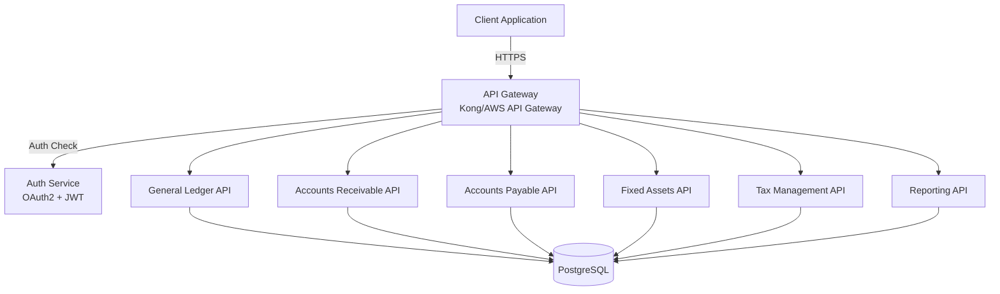
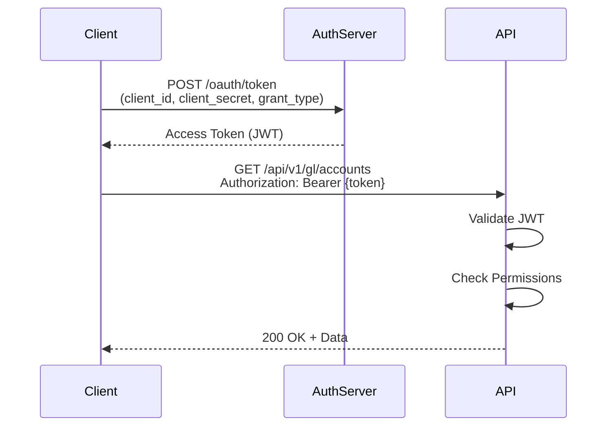

# API DESIGN SPECIFICATION
## Finance & Accounting Module

**Document Version:** 1.0
**Date:** 2025-10-09
**Project:** Bflow ERP System
**Module:** Finance & Accounting
**Phase:** Design (Thiết kế)
**API Version:** v1.0

---

## Document Control

| Version | Date | Author | Changes |
|---------|------|--------|---------|
| 1.0 | 2025-10-09 | API Team | Initial API design |

**Review & Approval:**
| Role | Name | Signature | Date |
|------|------|-----------|------|
| API Architect | | | |
| Tech Lead | | | |
| Security Lead | | | |

---

## Table of Contents

1. [Introduction](#1-introduction)
2. [API Architecture](#2-api-architecture)
3. [Authentication & Authorization](#3-authentication--authorization)
4. [General Ledger APIs](#4-general-ledger-apis)
5. [Accounts Receivable APIs](#5-accounts-receivable-apis)
6. [Accounts Payable APIs](#6-accounts-payable-apis)
7. [Fixed Assets APIs](#7-fixed-assets-apis)
8. [Cash Management APIs](#8-cash-management-apis)
9. [Tax Management APIs](#9-tax-management-apis)
10. [Reporting APIs](#10-reporting-apis)
11. [Common APIs](#11-common-apis)
12. [Error Handling](#12-error-handling)
13. [Rate Limiting](#13-rate-limiting)
14. [Versioning Strategy](#14-versioning-strategy)

---

## 1. Introduction

### 1.1 Purpose
This document specifies the complete RESTful API design for the Finance & Accounting module, including all endpoints, request/response schemas, and integration patterns.

### 1.2 Scope
Covers:
- 60+ RESTful API endpoints
- OpenAPI 3.0 specifications
- Request/Response schemas
- Error handling patterns
- Authentication and authorization
- Rate limiting and throttling

### 1.3 API Standards
- **Protocol:** HTTPS only
- **Format:** JSON (application/json)
- **Authentication:** OAuth 2.0 + JWT
- **API Style:** RESTful
- **Versioning:** URL-based (/api/v1/)
- **Documentation:** OpenAPI 3.0 (Swagger)

### 1.4 Base URL
- **Production:** https://api.bflow.com/finance/v1
- **Staging:** https://api-staging.bflow.com/finance/v1
- **Development:** https://api-dev.bflow.com/finance/v1

---

## 2. API Architecture

### 2.1 API Layers



### 2.2 API Endpoint Summary

| Module | Endpoint Count | Base Path |
|--------|----------------|-----------|
| General Ledger | 12 | /api/v1/gl |
| Accounts Receivable | 10 | /api/v1/ar |
| Accounts Payable | 10 | /api/v1/ap |
| Fixed Assets | 8 | /api/v1/fa |
| Cash Management | 6 | /api/v1/cash |
| Tax Management | 8 | /api/v1/tax |
| Reporting | 10 | /api/v1/reports |
| Common | 6 | /api/v1/common |
| **Total** | **70** | |

---

## 3. Authentication & Authorization

### 3.1 OAuth 2.0 Flow



### 3.2 JWT Token Structure

```json
{
  "header": {
    "alg": "RS256",
    "typ": "JWT"
  },
  "payload": {
    "sub": "user-uuid",
    "name": "Nguyen Van A",
    "email": "nguyenvana@company.com",
    "roles": ["ACCOUNTANT", "USER"],
    "permissions": [
      "gl:read",
      "gl:write",
      "ar:read",
      "ar:write"
    ],
    "company_id": "company-uuid",
    "iat": 1696838400,
    "exp": 1696842000
  },
  "signature": "..."
}
```

### 3.3 Role-Based Access Control

| Role | Permissions |
|------|-------------|
| **CFO** | All read/write access, approve high-value transactions |
| **Chief Accountant** | All GL/AR/AP/FA operations, period close, approve entries |
| **Accountant** | Create/edit entries, invoices, bills, payments |
| **AR Clerk** | AR module read/write |
| **AP Clerk** | AP module read/write |
| **Auditor** | Read-only access, export reports |
| **Manager** | Read access, view reports |

### 3.4 Permission Model

```
{module}:{operation}:{scope}

Examples:
- gl:read:own        - Read own journal entries
- gl:read:all        - Read all journal entries
- gl:write:all       - Create/edit journal entries
- gl:approve:all     - Approve journal entries
- gl:post:all        - Post journal entries
- gl:period:close    - Close accounting periods
```

---

## 4. General Ledger APIs

### 4.1 Chart of Accounts

#### GET /api/v1/gl/accounts
List all accounts in chart of accounts

**Request:**
```http
GET /api/v1/gl/accounts?page=1&limit=50&search=cash&type=ASSET
Authorization: Bearer {token}
```

**Query Parameters:**
| Parameter | Type | Required | Description |
|-----------|------|----------|-------------|
| page | integer | No | Page number (default: 1) |
| limit | integer | No | Items per page (default: 50, max: 100) |
| search | string | No | Search by code or name |
| type | string | No | Filter by account type |
| is_active | boolean | No | Filter active/inactive |

**Response: 200 OK**
```json
{
  "data": [
    {
      "id": "550e8400-e29b-41d4-a716-446655440000",
      "account_code": "111",
      "account_name": "Tiền mặt",
      "account_type": {
        "id": "type-uuid",
        "type_code": "1",
        "type_name": "Tài sản ngắn hạn",
        "category": "ASSET",
        "is_debit_normal": true
      },
      "parent_account": null,
      "currency": {
        "code": "VND",
        "name": "Vietnamese Dong",
        "symbol": "₫"
      },
      "is_active": true,
      "allow_manual_entry": true,
      "balance": 50000000.00,
      "child_accounts_count": 0,
      "created_at": "2025-01-01T00:00:00Z"
    },
    {
      "id": "account-2-uuid",
      "account_code": "112",
      "account_name": "Tiền gửi ngân hàng",
      "account_type": {
        "id": "type-uuid",
        "type_code": "1",
        "type_name": "Tài sản ngắn hạn",
        "category": "ASSET",
        "is_debit_normal": true
      },
      "parent_account": null,
      "currency": {
        "code": "VND",
        "name": "Vietnamese Dong",
        "symbol": "₫"
      },
      "is_active": true,
      "allow_manual_entry": false,
      "balance": 250000000.00,
      "child_accounts_count": 3,
      "created_at": "2025-01-01T00:00:00Z"
    }
  ],
  "pagination": {
    "current_page": 1,
    "per_page": 50,
    "total_pages": 5,
    "total_items": 234
  }
}
```

---

#### POST /api/v1/gl/accounts
Create new GL account

**Request:**
```http
POST /api/v1/gl/accounts
Authorization: Bearer {token}
Content-Type: application/json

{
  "account_code": "1121",
  "account_name": "VCB - TK 1234567890",
  "account_type_id": "type-uuid",
  "parent_account_id": "account-112-uuid",
  "currency_id": "vnd-uuid",
  "allow_manual_entry": true,
  "require_cost_center": false,
  "require_project": false,
  "description": "Vietcombank account"
}
```

**Validation Rules:**
- account_code: Required, unique, alphanumeric
- account_name: Required, max 200 chars
- account_type_id: Required, valid UUID
- parent_account_id: Optional, valid UUID
- currency_id: Required, valid UUID

**Response: 201 Created**
```json
{
  "data": {
    "id": "new-account-uuid",
    "account_code": "1121",
    "account_name": "VCB - TK 1234567890",
    "account_type": {
      "id": "type-uuid",
      "type_code": "1",
      "type_name": "Tài sản ngắn hạn",
      "category": "ASSET"
    },
    "parent_account": {
      "id": "account-112-uuid",
      "account_code": "112",
      "account_name": "Tiền gửi ngân hàng"
    },
    "currency": {
      "code": "VND",
      "name": "Vietnamese Dong"
    },
    "is_active": true,
    "allow_manual_entry": true,
    "balance": 0.00,
    "created_at": "2025-10-09T14:30:00Z"
  }
}
```

---

#### GET /api/v1/gl/accounts/{id}
Get account details

**Response: 200 OK**
```json
{
  "data": {
    "id": "account-uuid",
    "account_code": "1121",
    "account_name": "VCB - TK 1234567890",
    "account_type": { "..." },
    "balance": 150000000.00,
    "ytd_debit": 500000000.00,
    "ytd_credit": 350000000.00,
    "transaction_count": 45,
    "last_transaction_date": "2025-10-08"
  }
}
```

---

#### PUT /api/v1/gl/accounts/{id}
Update account

**Request:**
```http
PUT /api/v1/gl/accounts/{id}
Authorization: Bearer {token}
Content-Type: application/json

{
  "account_name": "VCB - TK 1234567890 (Updated)",
  "is_active": true
}
```

**Response: 200 OK**

---

#### DELETE /api/v1/gl/accounts/{id}
Delete account (soft delete)

**Response: 204 No Content**

**Error: 409 Conflict** (if account has transactions)
```json
{
  "error": {
    "code": "ACCOUNT_HAS_TRANSACTIONS",
    "message": "Cannot delete account with existing transactions",
    "details": {
      "transaction_count": 45,
      "last_transaction_date": "2025-10-08"
    }
  }
}
```

---

### 4.2 Journal Entries

#### POST /api/v1/gl/journals
Create journal entry

**Request:**
```http
POST /api/v1/gl/journals
Authorization: Bearer {token}
Content-Type: application/json

{
  "entry_date": "2025-10-09",
  "period_id": "period-uuid",
  "journal_type": "MANUAL",
  "description": "Record cash sale",
  "lines": [
    {
      "line_number": 1,
      "account_code": "111",
      "debit_amount": 1100000.00,
      "credit_amount": null,
      "description": "Cash received from sale",
      "cost_center_id": null,
      "project_id": null
    },
    {
      "line_number": 2,
      "account_code": "511",
      "debit_amount": null,
      "credit_amount": 1000000.00,
      "description": "Sales revenue",
      "project_id": "project-uuid"
    },
    {
      "line_number": 3,
      "account_code": "3331",
      "debit_amount": null,
      "credit_amount": 100000.00,
      "description": "VAT 10%"
    }
  ]
}
```

**Validation:**
- Lines must have at least 2 entries
- Each line must have either debit OR credit (not both, not neither)
- Total debits must equal total credits
- Period must be open
- All accounts must be active and allow manual entry

**Response: 201 Created**
```json
{
  "data": {
    "id": "journal-uuid",
    "journal_number": "JE-2025-10-0001",
    "entry_date": "2025-10-09",
    "period": {
      "id": "period-uuid",
      "period_code": "2025-10",
      "status": "OPEN"
    },
    "journal_type": "MANUAL",
    "status": "DRAFT",
    "description": "Record cash sale",
    "total_debit": 1100000.00,
    "total_credit": 1100000.00,
    "lines": [
      {
        "id": "line-1-uuid",
        "line_number": 1,
        "account": {
          "account_code": "111",
          "account_name": "Tiền mặt"
        },
        "debit_amount": 1100000.00,
        "credit_amount": null,
        "description": "Cash received from sale"
      }
    ],
    "created_by": {
      "id": "user-uuid",
      "name": "Nguyen Van A"
    },
    "created_at": "2025-10-09T14:30:00Z"
  }
}
```

---

#### GET /api/v1/gl/journals
List journal entries

**Request:**
```http
GET /api/v1/gl/journals?period_id={uuid}&status=DRAFT&page=1&limit=20
Authorization: Bearer {token}
```

**Query Parameters:**
| Parameter | Type | Required | Description |
|-----------|------|----------|-------------|
| period_id | UUID | No | Filter by period |
| status | string | No | DRAFT, PENDING_APPROVAL, APPROVED, POSTED, REVERSED |
| entry_date_from | date | No | From date (YYYY-MM-DD) |
| entry_date_to | date | No | To date (YYYY-MM-DD) |
| created_by | UUID | No | Filter by creator |
| search | string | No | Search in description |

**Response: 200 OK**
```json
{
  "data": [
    {
      "id": "journal-uuid",
      "journal_number": "JE-2025-10-0001",
      "entry_date": "2025-10-09",
      "status": "DRAFT",
      "description": "Record cash sale",
      "total_debit": 1100000.00,
      "total_credit": 1100000.00,
      "line_count": 3,
      "created_by": {
        "name": "Nguyen Van A"
      },
      "created_at": "2025-10-09T14:30:00Z"
    }
  ],
  "pagination": {
    "current_page": 1,
    "per_page": 20,
    "total_pages": 3,
    "total_items": 45
  }
}
```

---

#### GET /api/v1/gl/journals/{id}
Get journal entry details

**Response: 200 OK**
```json
{
  "data": {
    "id": "journal-uuid",
    "journal_number": "JE-2025-10-0001",
    "entry_date": "2025-10-09",
    "posting_date": null,
    "period": {
      "id": "period-uuid",
      "period_code": "2025-10",
      "status": "OPEN"
    },
    "journal_type": "MANUAL",
    "status": "DRAFT",
    "description": "Record cash sale",
    "total_debit": 1100000.00,
    "total_credit": 1100000.00,
    "lines": [
      {
        "id": "line-1-uuid",
        "line_number": 1,
        "account": {
          "id": "account-111-uuid",
          "account_code": "111",
          "account_name": "Tiền mặt"
        },
        "debit_amount": 1100000.00,
        "credit_amount": null,
        "description": "Cash received from sale",
        "cost_center": null,
        "project": null
      },
      {
        "id": "line-2-uuid",
        "line_number": 2,
        "account": {
          "id": "account-511-uuid",
          "account_code": "511",
          "account_name": "Doanh thu bán hàng"
        },
        "debit_amount": null,
        "credit_amount": 1000000.00,
        "description": "Sales revenue",
        "project": {
          "id": "project-uuid",
          "project_code": "PRJ-001",
          "project_name": "Project Alpha"
        }
      },
      {
        "id": "line-3-uuid",
        "line_number": 3,
        "account": {
          "id": "account-3331-uuid",
          "account_code": "3331",
          "account_name": "Thuế GTGT phải nộp"
        },
        "debit_amount": null,
        "credit_amount": 100000.00,
        "description": "VAT 10%"
      }
    ],
    "created_by": {
      "id": "user-uuid",
      "name": "Nguyen Van A",
      "email": "nguyenvana@company.com"
    },
    "created_at": "2025-10-09T14:30:00Z",
    "approved_by": null,
    "approved_at": null,
    "posted_at": null
  }
}
```

---

#### PUT /api/v1/gl/journals/{id}
Update journal entry (only DRAFT status)

**Request:**
```http
PUT /api/v1/gl/journals/{id}
Authorization: Bearer {token}
Content-Type: application/json

{
  "description": "Updated description",
  "lines": [
    // Updated lines
  ]
}
```

**Response: 200 OK**

---

#### POST /api/v1/gl/journals/{id}/submit
Submit for approval

**Response: 200 OK**
```json
{
  "data": {
    "id": "journal-uuid",
    "status": "PENDING_APPROVAL",
    "submitted_at": "2025-10-09T14:35:00Z"
  }
}
```

---

#### POST /api/v1/gl/journals/{id}/approve
Approve journal entry

**Permissions Required:** `gl:approve:all`

**Request:**
```http
POST /api/v1/gl/journals/{id}/approve
Authorization: Bearer {token}
Content-Type: application/json

{
  "approval_notes": "Approved - valid transaction"
}
```

**Response: 200 OK**
```json
{
  "data": {
    "id": "journal-uuid",
    "status": "APPROVED",
    "approved_by": {
      "id": "approver-uuid",
      "name": "Tran Thi B"
    },
    "approved_at": "2025-10-09T14:40:00Z"
  }
}
```

---

#### POST /api/v1/gl/journals/{id}/post
Post journal entry to GL

**Permissions Required:** `gl:post:all`

**Response: 200 OK**
```json
{
  "data": {
    "id": "journal-uuid",
    "status": "POSTED",
    "posting_date": "2025-10-09",
    "posted_at": "2025-10-09T14:45:00Z",
    "ledger_entries_created": 3
  }
}
```

**Side Effects:**
- Account balances updated
- GL ledger entries created
- Status changed to POSTED
- Cannot be edited or deleted

---

#### POST /api/v1/gl/journals/{id}/reverse
Reverse posted journal entry

**Permissions Required:** `gl:post:all`

**Request:**
```http
POST /api/v1/gl/journals/{id}/reverse
Authorization: Bearer {token}
Content-Type: application/json

{
  "reversal_date": "2025-10-10",
  "description": "Reversal of JE-2025-10-0001 - error correction"
}
```

**Response: 201 Created**
```json
{
  "data": {
    "original_journal": {
      "id": "journal-uuid",
      "journal_number": "JE-2025-10-0001",
      "status": "REVERSED"
    },
    "reversal_journal": {
      "id": "reversal-journal-uuid",
      "journal_number": "JE-2025-10-0050",
      "entry_date": "2025-10-10",
      "status": "POSTED",
      "description": "Reversal of JE-2025-10-0001 - error correction",
      "total_debit": 1100000.00,
      "total_credit": 1100000.00
    }
  }
}
```

---

#### DELETE /api/v1/gl/journals/{id}
Delete journal entry (only DRAFT status)

**Response: 204 No Content**

**Error: 409 Conflict** (if status is not DRAFT)
```json
{
  "error": {
    "code": "CANNOT_DELETE_POSTED_ENTRY",
    "message": "Cannot delete journal entry with status POSTED. Use reverse instead."
  }
}
```

---

### 4.3 Periods & Fiscal Years

#### GET /api/v1/gl/periods
List accounting periods

**Response: 200 OK**
```json
{
  "data": [
    {
      "id": "period-uuid",
      "period_code": "2025-10",
      "period_number": 10,
      "period_type": "MONTH",
      "start_date": "2025-10-01",
      "end_date": "2025-10-31",
      "fiscal_year": {
        "year_code": "FY2025",
        "year_number": 2025
      },
      "status": "OPEN",
      "journal_count": 45,
      "posted_journal_count": 38
    }
  ]
}
```

---

#### POST /api/v1/gl/periods/{id}/close
Close accounting period

**Permissions Required:** `gl:period:close`

**Request:**
```http
POST /api/v1/gl/periods/{id}/close
Authorization: Bearer {token}
Content-Type: application/json

{
  "perform_validations": true,
  "force_close": false
}
```

**Pre-Close Validations:**
- All journal entries must be posted
- Trial balance must balance
- Bank reconciliations completed
- No pending approvals

**Response: 200 OK**
```json
{
  "data": {
    "id": "period-uuid",
    "status": "CLOSED",
    "closed_by": {
      "name": "Chief Accountant"
    },
    "closed_at": "2025-11-01T09:00:00Z",
    "validation_results": {
      "all_entries_posted": true,
      "trial_balance_balanced": true,
      "reconciliations_complete": true
    }
  }
}
```

---

#### GET /api/v1/gl/trial-balance
Get trial balance

**Request:**
```http
GET /api/v1/gl/trial-balance?as_of_date=2025-10-09&account_type=ASSET
Authorization: Bearer {token}
```

**Query Parameters:**
| Parameter | Type | Required | Description |
|-----------|------|----------|-------------|
| as_of_date | date | Yes | As of date |
| account_type | string | No | Filter by type |
| level | integer | No | Account hierarchy level |

**Response: 200 OK**
```json
{
  "data": {
    "as_of_date": "2025-10-09",
    "currency": "VND",
    "accounts": [
      {
        "account_code": "111",
        "account_name": "Tiền mặt",
        "account_type": "ASSET",
        "debit_balance": 50000000.00,
        "credit_balance": 0.00,
        "net_balance": 50000000.00
      },
      {
        "account_code": "131",
        "account_name": "Phải thu khách hàng",
        "account_type": "ASSET",
        "debit_balance": 120000000.00,
        "credit_balance": 0.00,
        "net_balance": 120000000.00
      },
      {
        "account_code": "331",
        "account_name": "Phải trả người bán",
        "account_type": "LIABILITY",
        "debit_balance": 0.00,
        "credit_balance": 80000000.00,
        "net_balance": 80000000.00
      }
    ],
    "totals": {
      "total_debit": 850000000.00,
      "total_credit": 850000000.00,
      "difference": 0.00,
      "is_balanced": true
    }
  }
}
```

---

## 5. Accounts Receivable APIs

### 5.1 Customers

#### GET /api/v1/ar/customers
List customers

**Query Parameters:**
- page, limit, search, is_active

**Response: 200 OK**
```json
{
  "data": [
    {
      "id": "customer-uuid",
      "customer_code": "CUST-001",
      "customer_name": "Công ty ABC",
      "tax_code": "0123456789",
      "contact_person": "Nguyen Van A",
      "phone": "0901234567",
      "email": "contact@abc.com",
      "credit_limit": 100000000.00,
      "current_balance": 45000000.00,
      "credit_available": 55000000.00,
      "payment_term": {
        "term_code": "NET30",
        "net_days": 30
      },
      "is_active": true,
      "overdue_amount": 15000000.00,
      "invoice_count": 12
    }
  ],
  "pagination": { "..." }
}
```

---

#### POST /api/v1/ar/customers
Create customer

**Request:**
```json
{
  "customer_code": "CUST-002",
  "customer_name": "Công ty XYZ",
  "tax_code": "0987654321",
  "legal_name": "Công ty TNHH XYZ",
  "address": "123 Nguyen Trai, Ha Noi",
  "contact_person": "Tran Van B",
  "phone": "0912345678",
  "email": "info@xyz.com",
  "payment_term_id": "term-net30-uuid",
  "credit_limit": 50000000.00
}
```

**Response: 201 Created**

---

### 5.2 Invoices

#### POST /api/v1/ar/invoices
Create invoice

**Request:**
```http
POST /api/v1/ar/invoices
Authorization: Bearer {token}
Content-Type: application/json

{
  "invoice_date": "2025-10-09",
  "due_date": "2025-11-08",
  "customer_id": "customer-uuid",
  "payment_term_id": "term-uuid",
  "currency_id": "vnd-uuid",
  "items": [
    {
      "line_number": 1,
      "description": "Consulting services - October 2025",
      "quantity": 20,
      "unit_price": 500000.00,
      "amount": 10000000.00,
      "revenue_account_id": "account-511-uuid",
      "tax_code_id": "vat10-uuid",
      "tax_rate": 10.00,
      "tax_amount": 1000000.00
    },
    {
      "line_number": 2,
      "description": "Software license - 1 year",
      "quantity": 1,
      "unit_price": 5000000.00,
      "amount": 5000000.00,
      "revenue_account_id": "account-511-uuid",
      "tax_code_id": "vat10-uuid",
      "tax_rate": 10.00,
      "tax_amount": 500000.00
    }
  ],
  "notes": "Payment by bank transfer to VCB account 1234567890"
}
```

**Business Logic:**
- Validate customer credit limit
- Auto-calculate totals
- Generate journal entry (DR: AR, CR: Revenue, CR: VAT)
- Create VAT invoice record

**Response: 201 Created**
```json
{
  "data": {
    "id": "invoice-uuid",
    "invoice_number": "INV-2025-10-0001",
    "invoice_date": "2025-10-09",
    "due_date": "2025-11-08",
    "customer": {
      "id": "customer-uuid",
      "customer_code": "CUST-001",
      "customer_name": "Công ty ABC"
    },
    "currency": "VND",
    "subtotal": 15000000.00,
    "tax_amount": 1500000.00,
    "total_amount": 16500000.00,
    "paid_amount": 0.00,
    "outstanding_amount": 16500000.00,
    "status": "ISSUED",
    "items": [
      {
        "line_number": 1,
        "description": "Consulting services - October 2025",
        "quantity": 20,
        "unit_price": 500000.00,
        "amount": 10000000.00,
        "tax_amount": 1000000.00
      }
    ],
    "journal_entry": {
      "id": "journal-uuid",
      "journal_number": "JE-2025-10-0025",
      "status": "POSTED"
    },
    "vat_invoice": {
      "invoice_serial": "AB/25E",
      "invoice_number": "0000001",
      "invoice_template": "01GTKT0/001"
    },
    "created_at": "2025-10-09T15:00:00Z"
  }
}
```

---

#### GET /api/v1/ar/invoices
List invoices

**Query Parameters:**
| Parameter | Type | Description |
|-----------|------|-------------|
| customer_id | UUID | Filter by customer |
| status | string | DRAFT, ISSUED, PARTIAL, PAID, OVERDUE, VOID |
| invoice_date_from | date | From date |
| invoice_date_to | date | To date |
| due_date_from | date | From due date |
| due_date_to | date | To due date |
| overdue_only | boolean | Only overdue invoices |

**Response: 200 OK**
```json
{
  "data": [
    {
      "id": "invoice-uuid",
      "invoice_number": "INV-2025-10-0001",
      "invoice_date": "2025-10-09",
      "due_date": "2025-11-08",
      "customer": {
        "customer_code": "CUST-001",
        "customer_name": "Công ty ABC"
      },
      "total_amount": 16500000.00,
      "paid_amount": 0.00,
      "outstanding_amount": 16500000.00,
      "status": "ISSUED",
      "days_outstanding": 0,
      "is_overdue": false
    }
  ],
  "summary": {
    "total_invoices": 45,
    "total_amount": 850000000.00,
    "total_outstanding": 320000000.00,
    "overdue_count": 8,
    "overdue_amount": 120000000.00
  },
  "pagination": { "..." }
}
```

---

#### GET /api/v1/ar/invoices/{id}
Get invoice details

**Response: 200 OK** (full invoice object)

---

#### POST /api/v1/ar/invoices/{id}/void
Void invoice

**Request:**
```json
{
  "void_reason": "Customer cancelled order"
}
```

**Response: 200 OK**
```json
{
  "data": {
    "id": "invoice-uuid",
    "status": "VOID",
    "voided_at": "2025-10-09T16:00:00Z",
    "reversal_journal": {
      "journal_number": "JE-2025-10-0030",
      "status": "POSTED"
    }
  }
}
```

---

### 5.3 Receipts & Payments

#### POST /api/v1/ar/receipts
Record customer payment

**Request:**
```http
POST /api/v1/ar/receipts
Authorization: Bearer {token}
Content-Type: application/json

{
  "receipt_date": "2025-10-09",
  "customer_id": "customer-uuid",
  "amount": 16500000.00,
  "payment_method": "BANK",
  "cash_account_id": "bank-account-uuid",
  "reference": "TXN20251009123456",
  "allocations": [
    {
      "invoice_id": "invoice-uuid",
      "allocated_amount": 16500000.00
    }
  ],
  "notes": "Bank transfer received"
}
```

**Business Logic:**
- Validate payment amount
- Allocate to invoices
- Update invoice status
- Generate journal entry (DR: Cash, CR: AR)

**Response: 201 Created**
```json
{
  "data": {
    "id": "receipt-uuid",
    "receipt_number": "REC-2025-10-0001",
    "receipt_date": "2025-10-09",
    "customer": {
      "customer_code": "CUST-001",
      "customer_name": "Công ty ABC"
    },
    "amount": 16500000.00,
    "payment_method": "BANK",
    "cash_account": {
      "account_code": "1121",
      "account_name": "VCB - TK 1234567890"
    },
    "reference": "TXN20251009123456",
    "status": "POSTED",
    "allocations": [
      {
        "invoice": {
          "invoice_number": "INV-2025-10-0001"
        },
        "allocated_amount": 16500000.00
      }
    ],
    "unapplied_amount": 0.00,
    "journal_entry": {
      "journal_number": "JE-2025-10-0026",
      "status": "POSTED"
    },
    "created_at": "2025-10-09T16:30:00Z"
  }
}
```

---

#### GET /api/v1/ar/receipts
List receipts

**Response: 200 OK** (list of receipts)

---

### 5.4 Reports

#### GET /api/v1/ar/aging
Accounts receivable aging report

**Request:**
```http
GET /api/v1/ar/aging?as_of_date=2025-10-09&customer_id={uuid}
Authorization: Bearer {token}
```

**Response: 200 OK**
```json
{
  "data": {
    "as_of_date": "2025-10-09",
    "currency": "VND",
    "customers": [
      {
        "customer_code": "CUST-001",
        "customer_name": "Công ty ABC",
        "current": 50000000.00,
        "days_1_30": 30000000.00,
        "days_31_60": 15000000.00,
        "days_61_90": 5000000.00,
        "over_90": 0.00,
        "total_outstanding": 100000000.00,
        "oldest_invoice_date": "2025-08-15",
        "contact": {
          "person": "Nguyen Van A",
          "phone": "0901234567"
        }
      }
    ],
    "summary": {
      "total_customers": 25,
      "total_current": 250000000.00,
      "total_1_30": 120000000.00,
      "total_31_60": 60000000.00,
      "total_61_90": 30000000.00,
      "total_over_90": 10000000.00,
      "grand_total": 470000000.00
    }
  }
}
```

---

#### GET /api/v1/ar/customer-statement
Customer statement

**Request:**
```http
GET /api/v1/ar/customer-statement?customer_id={uuid}&from_date=2025-09-01&to_date=2025-10-09
Authorization: Bearer {token}
```

**Response: 200 OK**
```json
{
  "data": {
    "customer": {
      "customer_code": "CUST-001",
      "customer_name": "Công ty ABC",
      "address": "123 Nguyen Trai, Ha Noi"
    },
    "period": {
      "from_date": "2025-09-01",
      "to_date": "2025-10-09"
    },
    "opening_balance": 30000000.00,
    "transactions": [
      {
        "date": "2025-09-15",
        "type": "INVOICE",
        "reference": "INV-2025-09-0015",
        "description": "Consulting services",
        "debit": 16500000.00,
        "credit": 0.00,
        "balance": 46500000.00
      },
      {
        "date": "2025-09-20",
        "type": "PAYMENT",
        "reference": "REC-2025-09-0010",
        "description": "Bank transfer",
        "debit": 0.00,
        "credit": 16500000.00,
        "balance": 30000000.00
      }
    ],
    "closing_balance": 45000000.00,
    "summary": {
      "total_invoices": 3,
      "total_payments": 2,
      "net_change": 15000000.00
    }
  }
}
```

---

## 6. Accounts Payable APIs

### 6.1 Vendors

#### GET /api/v1/ap/vendors
List vendors

**Response: 200 OK** (similar to customers)

---

#### POST /api/v1/ap/vendors
Create vendor

**Request:**
```json
{
  "vendor_code": "VEND-001",
  "vendor_name": "Nhà cung cấp DEF",
  "tax_code": "0111222333",
  "bank_name": "Vietcombank",
  "bank_account": "9876543210",
  "payment_term_id": "term-uuid",
  "is_1099_vendor": false
}
```

**Response: 201 Created**

---

### 6.2 Bills

#### POST /api/v1/ap/bills
Create vendor bill

**Request:**
```json
{
  "bill_date": "2025-10-09",
  "due_date": "2025-11-08",
  "vendor_id": "vendor-uuid",
  "vendor_invoice_number": "VEND-INV-12345",
  "currency_id": "vnd-uuid",
  "items": [
    {
      "line_number": 1,
      "description": "Office supplies",
      "amount": 5000000.00,
      "expense_account_id": "account-642-uuid",
      "cost_center_id": "cc-admin-uuid",
      "tax_code_id": "vat10-uuid",
      "tax_amount": 500000.00
    }
  ],
  "notes": "Due by bank transfer"
}
```

**Business Logic:**
- Generate journal entry (DR: Expense, DR: VAT, CR: AP)
- Create VAT invoice record (input VAT)

**Response: 201 Created**
```json
{
  "data": {
    "id": "bill-uuid",
    "bill_number": "BILL-2025-10-0001",
    "vendor_invoice_number": "VEND-INV-12345",
    "bill_date": "2025-10-09",
    "due_date": "2025-11-08",
    "vendor": {
      "vendor_code": "VEND-001",
      "vendor_name": "Nhà cung cấp DEF"
    },
    "subtotal": 5000000.00,
    "tax_amount": 500000.00,
    "total_amount": 5500000.00,
    "paid_amount": 0.00,
    "outstanding_amount": 5500000.00,
    "status": "APPROVED",
    "journal_entry": {
      "journal_number": "JE-2025-10-0027",
      "status": "POSTED"
    },
    "created_at": "2025-10-09T17:00:00Z"
  }
}
```

---

#### GET /api/v1/ap/bills
List bills

**Query Parameters:** Similar to invoices

**Response: 200 OK**

---

### 6.3 Payments

#### POST /api/v1/ap/payments
Make vendor payment

**Request:**
```json
{
  "payment_date": "2025-10-10",
  "vendor_id": "vendor-uuid",
  "amount": 5500000.00,
  "payment_method": "BANK",
  "cash_account_id": "bank-account-uuid",
  "reference": "TXN20251010654321",
  "applications": [
    {
      "bill_id": "bill-uuid",
      "applied_amount": 5500000.00,
      "discount_taken": 0.00
    }
  ]
}
```

**Response: 201 Created**
```json
{
  "data": {
    "id": "payment-uuid",
    "payment_number": "PAY-2025-10-0001",
    "payment_date": "2025-10-10",
    "vendor": {
      "vendor_code": "VEND-001",
      "vendor_name": "Nhà cung cấp DEF",
      "bank_account": "9876543210"
    },
    "amount": 5500000.00,
    "payment_method": "BANK",
    "reference": "TXN20251010654321",
    "status": "POSTED",
    "applications": [
      {
        "bill": {
          "bill_number": "BILL-2025-10-0001"
        },
        "applied_amount": 5500000.00
      }
    ],
    "journal_entry": {
      "journal_number": "JE-2025-10-0028",
      "status": "POSTED"
    },
    "created_at": "2025-10-10T10:00:00Z"
  }
}
```

---

#### GET /api/v1/ap/aging
Accounts payable aging report

**Response: 200 OK** (similar to AR aging)

---

#### POST /api/v1/ap/payment-batch
Batch payment processing

**Request:**
```json
{
  "payment_date": "2025-10-15",
  "cash_account_id": "bank-account-uuid",
  "bills": [
    {
      "bill_id": "bill-1-uuid",
      "amount": 5500000.00
    },
    {
      "bill_id": "bill-2-uuid",
      "amount": 3000000.00
    }
  ]
}
```

**Response: 201 Created**
```json
{
  "data": {
    "batch_id": "batch-uuid",
    "payment_count": 2,
    "total_amount": 8500000.00,
    "payments": [
      {
        "payment_number": "PAY-2025-10-0015",
        "vendor_name": "Vendor A",
        "amount": 5500000.00
      },
      {
        "payment_number": "PAY-2025-10-0016",
        "vendor_name": "Vendor B",
        "amount": 3000000.00
      }
    ],
    "payment_file": {
      "format": "NAPAS",
      "download_url": "/api/v1/ap/payment-batch/{batch_id}/download"
    }
  }
}
```

---

## 7. Fixed Assets APIs

### 7.1 Asset Management

#### POST /api/v1/fa/assets
Register fixed asset

**Request:**
```json
{
  "asset_code": "FA-2025-0001",
  "asset_name": "Dell Laptop Latitude 5520",
  "category_id": "computer-category-uuid",
  "location_id": "office-location-uuid",
  "acquisition_date": "2025-10-09",
  "placed_in_service_date": "2025-10-09",
  "acquisition_cost": 25000000.00,
  "residual_value": 0.00,
  "useful_life": 3,
  "depreciation_method": "SL",
  "serial_number": "SN123456789",
  "description": "Employee laptop for developer"
}
```

**Business Logic:**
- Generate acquisition journal entry (DR: Asset, CR: Cash/AP)

**Response: 201 Created**
```json
{
  "data": {
    "id": "asset-uuid",
    "asset_code": "FA-2025-0001",
    "asset_name": "Dell Laptop Latitude 5520",
    "category": {
      "category_code": "COMPUTER",
      "category_name": "Computers & IT Equipment"
    },
    "acquisition_date": "2025-10-09",
    "placed_in_service_date": "2025-10-09",
    "acquisition_cost": 25000000.00,
    "residual_value": 0.00,
    "useful_life": 3,
    "depreciation_method": "SL",
    "monthly_depreciation": 694444.44,
    "accumulated_depreciation": 0.00,
    "book_value": 25000000.00,
    "status": "ACTIVE",
    "journal_entry": {
      "journal_number": "JE-2025-10-0029",
      "status": "POSTED"
    },
    "created_at": "2025-10-09T18:00:00Z"
  }
}
```

---

#### GET /api/v1/fa/assets
List fixed assets

**Query Parameters:**
- category_id, location_id, status, search

**Response: 200 OK**
```json
{
  "data": [
    {
      "id": "asset-uuid",
      "asset_code": "FA-2025-0001",
      "asset_name": "Dell Laptop Latitude 5520",
      "category": "COMPUTER",
      "acquisition_date": "2025-10-09",
      "acquisition_cost": 25000000.00,
      "accumulated_depreciation": 0.00,
      "book_value": 25000000.00,
      "status": "ACTIVE",
      "remaining_life_months": 36
    }
  ],
  "summary": {
    "total_assets": 45,
    "total_cost": 850000000.00,
    "total_accumulated_depreciation": 320000000.00,
    "total_book_value": 530000000.00
  }
}
```

---

#### POST /api/v1/fa/depreciation/calculate
Calculate monthly depreciation

**Request:**
```json
{
  "period_id": "period-2025-10-uuid",
  "asset_ids": [] // Empty = all active assets
}
```

**Response: 200 OK**
```json
{
  "data": {
    "period": {
      "period_code": "2025-10"
    },
    "calculation_date": "2025-10-31",
    "assets_processed": 45,
    "depreciations": [
      {
        "asset_code": "FA-2025-0001",
        "asset_name": "Dell Laptop",
        "depreciation_amount": 694444.44,
        "accumulated_depreciation": 694444.44,
        "book_value": 24305555.56
      }
    ],
    "total_depreciation": 15000000.00
  }
}
```

---

#### POST /api/v1/fa/depreciation/post
Post depreciation entries

**Request:**
```json
{
  "period_id": "period-2025-10-uuid"
}
```

**Business Logic:**
- Generate journal entry (DR: Depreciation Expense, CR: Accumulated Depreciation)

**Response: 200 OK**
```json
{
  "data": {
    "journal_entry": {
      "journal_number": "JE-2025-10-0050",
      "description": "Monthly depreciation - October 2025",
      "total_debit": 15000000.00,
      "total_credit": 15000000.00,
      "status": "POSTED"
    },
    "assets_depreciated": 45
  }
}
```

---

#### POST /api/v1/fa/assets/{id}/dispose
Dispose fixed asset

**Request:**
```json
{
  "disposal_date": "2025-10-15",
  "disposal_method": "SALE",
  "proceeds_amount": 10000000.00,
  "notes": "Sold to employee"
}
```

**Business Logic:**
- Calculate gain/loss on disposal
- Generate disposal journal entry

**Response: 200 OK**
```json
{
  "data": {
    "asset": {
      "asset_code": "FA-2020-0050",
      "asset_name": "Old Server"
    },
    "disposal_date": "2025-10-15",
    "book_value": 5000000.00,
    "proceeds_amount": 10000000.00,
    "gain_loss": 5000000.00,
    "gain_loss_type": "GAIN",
    "journal_entry": {
      "journal_number": "JE-2025-10-0055",
      "description": "Disposal of FA-2020-0050",
      "lines": [
        {
          "account": "Cash",
          "debit": 10000000.00
        },
        {
          "account": "Accumulated Depreciation",
          "debit": 20000000.00
        },
        {
          "account": "Fixed Asset",
          "credit": 25000000.00
        },
        {
          "account": "Gain on Disposal",
          "credit": 5000000.00
        }
      ],
      "status": "POSTED"
    }
  }
}
```

---

## 8. Cash Management APIs

#### GET /api/v1/cash/accounts
List cash accounts

**Response: 200 OK**
```json
{
  "data": [
    {
      "id": "cash-account-uuid",
      "account_code": "CASH-001",
      "account_name": "Petty Cash - Office",
      "account_type": "CASH",
      "gl_account": {
        "account_code": "111",
        "account_name": "Tiền mặt"
      },
      "currency": "VND",
      "current_balance": 10000000.00,
      "is_active": true
    },
    {
      "id": "bank-account-uuid",
      "account_code": "BANK-VCB-001",
      "account_name": "VCB - TK 1234567890",
      "account_type": "BANK",
      "bank_name": "Vietcombank",
      "account_number": "1234567890",
      "current_balance": 250000000.00,
      "is_active": true
    }
  ]
}
```

---

#### POST /api/v1/cash/transactions
Record cash transaction

**Request:**
```json
{
  "transaction_date": "2025-10-09",
  "cash_account_id": "cash-account-uuid",
  "transaction_type": "PAYMENT",
  "amount": 500000.00,
  "counterparty": "Office Supplies Store",
  "description": "Purchase office supplies",
  "reference": "Receipt #123"
}
```

**Response: 201 Created**

---

#### POST /api/v1/cash/bank-reconciliation
Create bank reconciliation

**Request:**
```json
{
  "cash_account_id": "bank-account-uuid",
  "reconciliation_date": "2025-10-31",
  "statement_date": "2025-10-31",
  "statement_balance": 250000000.00,
  "book_balance": 245000000.00,
  "reconciling_items": [
    {
      "type": "OUTSTANDING_CHECK",
      "reference": "CHECK-001",
      "amount": 5000000.00,
      "description": "Vendor payment not cleared"
    }
  ]
}
```

**Response: 201 Created**

---

## 9. Tax Management APIs

### 9.1 VAT Declaration

#### POST /api/v1/tax/vat-declarations
Create VAT declaration

**Request:**
```json
{
  "period_id": "period-2025-10-uuid",
  "declaration_type": "MONTHLY"
}
```

**Business Logic:**
- Auto-collect output invoices (sales)
- Auto-collect input invoices (purchases)
- Calculate VAT payable

**Response: 201 Created**
```json
{
  "data": {
    "id": "vat-declaration-uuid",
    "declaration_number": "VAT-2025-10",
    "period": {
      "period_code": "2025-10",
      "start_date": "2025-10-01",
      "end_date": "2025-10-31"
    },
    "output_vat": {
      "invoice_count": 25,
      "total_sales": 500000000.00,
      "vat_0_percent": 50000000.00,
      "vat_5_percent": 100000000.00,
      "vat_10_percent": 350000000.00,
      "total_output_vat": 40000000.00
    },
    "input_vat": {
      "invoice_count": 15,
      "total_purchases": 200000000.00,
      "deductible_vat": 18000000.00,
      "non_deductible_vat": 2000000.00
    },
    "vat_payable": 22000000.00,
    "status": "DRAFT",
    "created_at": "2025-11-01T09:00:00Z"
  }
}
```

---

#### GET /api/v1/tax/vat-declarations/{id}
Get VAT declaration details

**Response: 200 OK** (full declaration with invoice details)

---

#### POST /api/v1/tax/vat-declarations/{id}/submit
Submit to tax authority

**Request:**
```json
{
  "submit_method": "ELECTRONIC",
  "e_invoice_provider": "VNPT"
}
```

**Business Logic:**
- Generate XML per Thông tư 32/2011/TT-BTC
- Submit to tax portal API
- Receive submission receipt

**Response: 200 OK**
```json
{
  "data": {
    "id": "vat-declaration-uuid",
    "status": "SUBMITTED",
    "filing_date": "2025-11-05",
    "submission_receipt": "TCT-20251105-123456",
    "xml_file_url": "/api/v1/tax/vat-declarations/{id}/xml",
    "pdf_report_url": "/api/v1/tax/vat-declarations/{id}/pdf"
  }
}
```

---

### 9.2 Corporate Income Tax

#### POST /api/v1/tax/cit-declarations
Create CIT declaration (annual)

**Request:**
```json
{
  "fiscal_year_id": "fy-2025-uuid",
  "declaration_type": "ANNUAL"
}
```

**Response: 201 Created**
```json
{
  "data": {
    "id": "cit-declaration-uuid",
    "declaration_number": "CIT-2025",
    "fiscal_year": {
      "year_code": "FY2025",
      "start_date": "2025-01-01",
      "end_date": "2025-12-31"
    },
    "accounting_profit": 500000000.00,
    "adjustments": [
      {
        "description": "Non-deductible expenses",
        "amount": 10000000.00,
        "type": "ADD"
      },
      {
        "description": "Tax-exempt income",
        "amount": 5000000.00,
        "type": "SUBTRACT"
      }
    ],
    "taxable_income": 505000000.00,
    "tax_rate": 20.00,
    "cit_payable": 101000000.00,
    "prepaid_tax": 90000000.00,
    "balance_due": 11000000.00,
    "status": "DRAFT"
  }
}
```

---

## 10. Reporting APIs

### 10.1 Financial Statements

#### GET /api/v1/reports/balance-sheet
Balance Sheet (Bảng cân đối kế toán)

**Request:**
```http
GET /api/v1/reports/balance-sheet?as_of_date=2025-10-31&format=json
Authorization: Bearer {token}
```

**Query Parameters:**
| Parameter | Type | Required | Description |
|-----------|------|----------|-------------|
| as_of_date | date | Yes | Reporting date |
| format | string | No | json, pdf, excel |
| comparative | boolean | No | Show comparative period |

**Response: 200 OK**
```json
{
  "data": {
    "company_name": "Công ty ABC",
    "report_name": "Balance Sheet (Bảng cân đối kế toán)",
    "as_of_date": "2025-10-31",
    "currency": "VND",
    "assets": {
      "current_assets": {
        "cash_and_equivalents": 300000000.00,
        "accounts_receivable": 150000000.00,
        "inventory": 200000000.00,
        "prepaid_expenses": 50000000.00,
        "total_current_assets": 700000000.00
      },
      "non_current_assets": {
        "fixed_assets_cost": 850000000.00,
        "accumulated_depreciation": -320000000.00,
        "fixed_assets_net": 530000000.00,
        "intangible_assets": 100000000.00,
        "total_non_current_assets": 630000000.00
      },
      "total_assets": 1330000000.00
    },
    "liabilities": {
      "current_liabilities": {
        "accounts_payable": 100000000.00,
        "accrued_expenses": 50000000.00,
        "short_term_loans": 150000000.00,
        "vat_payable": 22000000.00,
        "total_current_liabilities": 322000000.00
      },
      "non_current_liabilities": {
        "long_term_loans": 200000000.00,
        "total_non_current_liabilities": 200000000.00
      },
      "total_liabilities": 522000000.00
    },
    "equity": {
      "share_capital": 500000000.00,
      "retained_earnings": 308000000.00,
      "total_equity": 808000000.00
    },
    "total_liabilities_and_equity": 1330000000.00,
    "validation": {
      "is_balanced": true,
      "difference": 0.00
    }
  }
}
```

---

#### GET /api/v1/reports/income-statement
Income Statement (Báo cáo kết quả hoạt động kinh doanh)

**Request:**
```http
GET /api/v1/reports/income-statement?from_date=2025-01-01&to_date=2025-10-31
Authorization: Bearer {token}
```

**Response: 200 OK**
```json
{
  "data": {
    "company_name": "Công ty ABC",
    "report_name": "Income Statement",
    "period": {
      "from_date": "2025-01-01",
      "to_date": "2025-10-31"
    },
    "revenue": {
      "sales_revenue": 2000000000.00,
      "service_revenue": 500000000.00,
      "total_revenue": 2500000000.00
    },
    "cost_of_sales": {
      "cost_of_goods_sold": 1200000000.00,
      "gross_profit": 1300000000.00,
      "gross_margin_percent": 52.00
    },
    "operating_expenses": {
      "selling_expenses": 300000000.00,
      "administrative_expenses": 400000000.00,
      "depreciation_expense": 150000000.00,
      "total_operating_expenses": 850000000.00
    },
    "operating_profit": 450000000.00,
    "other_income_expenses": {
      "interest_income": 10000000.00,
      "interest_expense": -30000000.00,
      "other_income": 20000000.00,
      "total_other": 0.00
    },
    "profit_before_tax": 450000000.00,
    "income_tax_expense": 90000000.00,
    "net_profit": 360000000.00,
    "earnings_per_share": null
  }
}
```

---

#### GET /api/v1/reports/cash-flow
Cash Flow Statement (Báo cáo lưu chuyển tiền tệ)

**Response: 200 OK** (Direct or Indirect method)

---

### 10.2 Management Reports

#### GET /api/v1/reports/general-ledger
General Ledger Report

**Request:**
```http
GET /api/v1/reports/general-ledger?account_id={uuid}&from_date=2025-10-01&to_date=2025-10-31
```

**Response: 200 OK**
```json
{
  "data": {
    "account": {
      "account_code": "111",
      "account_name": "Tiền mặt"
    },
    "period": {
      "from_date": "2025-10-01",
      "to_date": "2025-10-31"
    },
    "opening_balance": 50000000.00,
    "transactions": [
      {
        "date": "2025-10-05",
        "journal_number": "JE-2025-10-0001",
        "description": "Cash sale",
        "debit": 1100000.00,
        "credit": 0.00,
        "balance": 51100000.00
      },
      {
        "date": "2025-10-10",
        "journal_number": "JE-2025-10-0015",
        "description": "Payment for supplies",
        "debit": 0.00,
        "credit": 500000.00,
        "balance": 50600000.00
      }
    ],
    "totals": {
      "total_debit": 15000000.00,
      "total_credit": 10000000.00,
      "net_change": 5000000.00
    },
    "closing_balance": 55000000.00
  }
}
```

---

#### GET /api/v1/reports/expense-by-category
Expense Analysis by Category

**Response: 200 OK** (grouped by account category)

---

#### GET /api/v1/reports/revenue-by-project
Revenue Analysis by Project

**Response: 200 OK** (grouped by project)

---

## 11. Common APIs

#### GET /api/v1/common/currencies
List currencies

**Response: 200 OK**
```json
{
  "data": [
    {
      "id": "vnd-uuid",
      "currency_code": "VND",
      "currency_name": "Vietnamese Dong",
      "symbol": "₫",
      "decimal_places": 0,
      "is_active": true
    },
    {
      "id": "usd-uuid",
      "currency_code": "USD",
      "currency_name": "US Dollar",
      "symbol": "$",
      "decimal_places": 2,
      "is_active": true
    }
  ]
}
```

---

#### GET /api/v1/common/exchange-rates
Get exchange rates

**Request:**
```http
GET /api/v1/common/exchange-rates?from=VND&to=USD&date=2025-10-09
```

**Response: 200 OK**
```json
{
  "data": {
    "from_currency": "VND",
    "to_currency": "USD",
    "rate_date": "2025-10-09",
    "rate": 0.000040,
    "rate_type": "OFFICIAL",
    "source": "State Bank of Vietnam"
  }
}
```

---

#### GET /api/v1/common/cost-centers
List cost centers

**Response: 200 OK**

---

#### GET /api/v1/common/projects
List projects

**Response: 200 OK**

---

#### GET /api/v1/common/payment-terms
List payment terms

**Response: 200 OK**

---

#### GET /api/v1/common/tax-codes
List tax codes

**Response: 200 OK**

---

## 12. Error Handling

### 12.1 Error Response Format

```json
{
  "error": {
    "code": "ERROR_CODE",
    "message": "Human-readable error message",
    "details": {
      "field": "additional context"
    },
    "timestamp": "2025-10-09T14:30:00Z",
    "request_id": "req-uuid"
  }
}
```

### 12.2 HTTP Status Codes

| Code | Meaning | Usage |
|------|---------|-------|
| 200 | OK | Successful GET, PUT, PATCH |
| 201 | Created | Successful POST |
| 204 | No Content | Successful DELETE |
| 400 | Bad Request | Validation error |
| 401 | Unauthorized | Missing/invalid authentication |
| 403 | Forbidden | Insufficient permissions |
| 404 | Not Found | Resource not found |
| 409 | Conflict | Business logic conflict |
| 422 | Unprocessable Entity | Semantic error |
| 429 | Too Many Requests | Rate limit exceeded |
| 500 | Internal Server Error | Server error |

### 12.3 Error Codes

| Code | Description |
|------|-------------|
| VAL_001 | Validation error |
| AUTH_001 | Authentication failed |
| AUTH_002 | Insufficient permissions |
| PERIOD_001 | Period closed |
| PERIOD_002 | Period not found |
| JOURNAL_001 | Journal entry not balanced |
| JOURNAL_002 | Cannot edit posted entry |
| AR_001 | Customer credit limit exceeded |
| AR_002 | Invoice already paid |
| AP_001 | Bill already paid |
| FA_001 | Asset already disposed |

### 12.4 Validation Error Example

```json
{
  "error": {
    "code": "VAL_001",
    "message": "Validation failed",
    "details": {
      "fields": [
        {
          "field": "lines",
          "message": "Journal entry is not balanced",
          "total_debit": 1100000.00,
          "total_credit": 1000000.00,
          "difference": 100000.00
        },
        {
          "field": "lines[0].account_code",
          "message": "Account not found",
          "value": "999"
        }
      ]
    }
  }
}
```

---

## 13. Rate Limiting

### 13.1 Rate Limits

| Tier | Requests/Minute | Requests/Hour | Requests/Day |
|------|-----------------|---------------|--------------|
| Free | 60 | 1,000 | 10,000 |
| Basic | 300 | 10,000 | 100,000 |
| Premium | 1,000 | 50,000 | 500,000 |
| Enterprise | Unlimited | Unlimited | Unlimited |

### 13.2 Rate Limit Headers

```http
X-RateLimit-Limit: 1000
X-RateLimit-Remaining: 995
X-RateLimit-Reset: 1696842000
```

### 13.3 Rate Limit Exceeded Response

```http
HTTP/1.1 429 Too Many Requests
Content-Type: application/json
Retry-After: 60

{
  "error": {
    "code": "RATE_LIMIT_EXCEEDED",
    "message": "Rate limit exceeded. Please try again in 60 seconds.",
    "retry_after": 60
  }
}
```

---

## 14. Versioning Strategy

### 14.1 URL Versioning

```
https://api.bflow.com/finance/v1/gl/accounts
https://api.bflow.com/finance/v2/gl/accounts (future)
```

### 14.2 Deprecation Policy

- Minimum 12 months notice
- Deprecation header in responses
- Migration guide provided

```http
Deprecation: Sun, 01 Nov 2026 00:00:00 GMT
Link: <https://docs.bflow.com/migration/v1-to-v2>; rel="deprecation"
```

---

## Appendix A: OpenAPI 3.0 Specification

```yaml
openapi: 3.0.3
info:
  title: Bflow Finance & Accounting API
  version: 1.0.0
  description: RESTful API for Finance & Accounting module
  contact:
    email: api@bflow.com

servers:
  - url: https://api.bflow.com/finance/v1
    description: Production
  - url: https://api-staging.bflow.com/finance/v1
    description: Staging

security:
  - BearerAuth: []

components:
  securitySchemes:
    BearerAuth:
      type: http
      scheme: bearer
      bearerFormat: JWT

  schemas:
    Account:
      type: object
      properties:
        id:
          type: string
          format: uuid
        account_code:
          type: string
          example: "111"
        account_name:
          type: string
          example: "Tiền mặt"
        balance:
          type: number
          format: decimal
          example: 50000000.00

    JournalEntry:
      type: object
      properties:
        id:
          type: string
          format: uuid
        journal_number:
          type: string
          example: "JE-2025-10-0001"
        entry_date:
          type: string
          format: date
        status:
          type: string
          enum: [DRAFT, PENDING_APPROVAL, APPROVED, POSTED, REVERSED]
        lines:
          type: array
          items:
            $ref: '#/components/schemas/JournalLine'

    JournalLine:
      type: object
      properties:
        line_number:
          type: integer
        account_id:
          type: string
          format: uuid
        debit_amount:
          type: number
          format: decimal
          nullable: true
        credit_amount:
          type: number
          format: decimal
          nullable: true

paths:
  /gl/accounts:
    get:
      summary: List GL accounts
      tags:
        - General Ledger
      parameters:
        - name: page
          in: query
          schema:
            type: integer
            default: 1
        - name: limit
          in: query
          schema:
            type: integer
            default: 50
      responses:
        '200':
          description: Successful response
          content:
            application/json:
              schema:
                type: object
                properties:
                  data:
                    type: array
                    items:
                      $ref: '#/components/schemas/Account'

  /gl/journals:
    post:
      summary: Create journal entry
      tags:
        - General Ledger
      requestBody:
        required: true
        content:
          application/json:
            schema:
              $ref: '#/components/schemas/JournalEntry'
      responses:
        '201':
          description: Created
        '400':
          description: Validation error
```

---

## Document Approval

**Prepared by:** API Team
**Reviewed by:** API Architect, Tech Lead
**Approved by:** CTO
**Date:** 2025-10-09

---

**End of Document**
