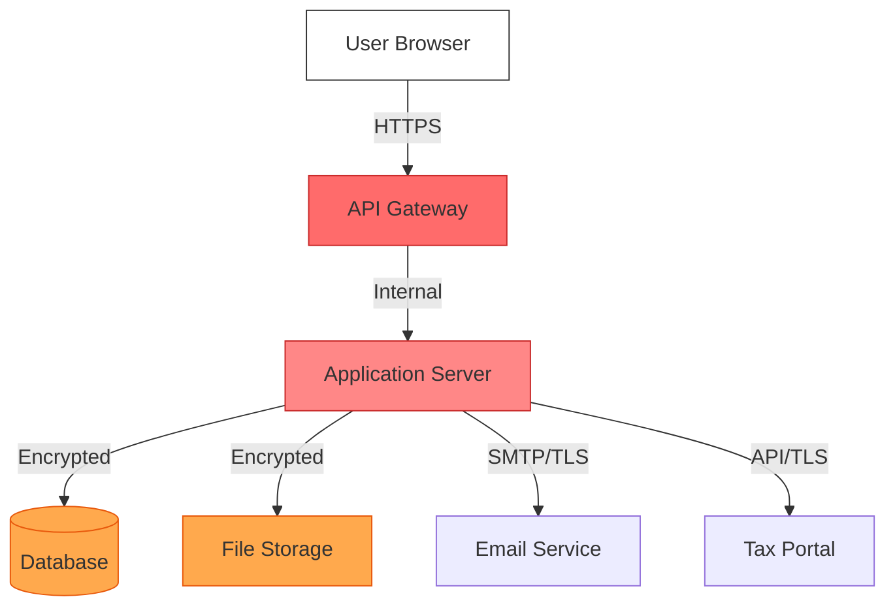
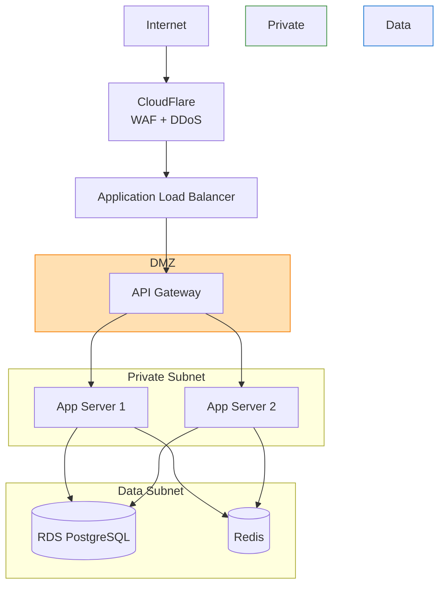

# SECURITY DESIGN DOCUMENT
## Finance & Accounting Module

**Document Version:** 1.0
**Date:** 2025-10-09
**Project:** Bflow ERP System
**Module:** Finance & Accounting
**Phase:** Design (Thiết kế)

---

## Document Control

| Version | Date | Author | Changes |
|---------|------|--------|---------|
| 1.0 | 2025-10-09 | Security Team | Initial security design |

**Review & Approval:**
| Role | Name | Signature | Date |
|------|------|-----------|------|
| Security Lead | | | |
| CISO | | | |
| Compliance Officer | | | |

---

## Table of Contents

1. [Introduction](#1-introduction)
2. [Threat Modeling](#2-threat-modeling)
3. [Authentication & Authorization](#3-authentication--authorization)
4. [Data Protection](#4-data-protection)
5. [Network Security](#5-network-security)
6. [Application Security](#6-application-security)
7. [Audit Trail](#7-audit-trail)
8. [Compliance Requirements](#8-compliance-requirements)

---

## 1. Introduction

### 1.1 Purpose
Define comprehensive security controls for the Finance & Accounting module to protect financial data and ensure compliance with Vietnam regulations.

### 1.2 Security Objectives

**CIA Triad:**
- **Confidentiality:** Protect sensitive financial data from unauthorized access
- **Integrity:** Ensure accuracy and completeness of financial transactions
- **Availability:** Maintain 99.9% system uptime

**Additional Objectives:**
- **Non-repudiation:** Audit trail for all transactions
- **Authentication:** Strong user identity verification
- **Authorization:** Role-based access control
- **Auditability:** Complete transaction logging

### 1.3 Regulatory Compliance
- Nghị định 13/2023/NĐ-CP - Personal Data Protection
- Luật Kế toán 2015 - Accounting Law
- Thông tư 200/2014/TT-BTC - Accounting Standards
- Nghị định 123/2020/NĐ-CP - E-Invoice Regulations
- ISO 27001:2013 - Information Security Management
- SOC 2 Type II - Service Organization Controls

---

## 2. Threat Modeling

### 2.1 STRIDE Analysis

#### Spoofing Identity
| Threat | Impact | Likelihood | Mitigation |
|--------|--------|------------|------------|
| Attacker impersonates accountant | High | Medium | MFA, IP whitelisting, session monitoring |
| Session hijacking | High | Low | HTTPS, secure cookies, short session timeout |
| API key theft | Medium | Medium | Key rotation, encryption, rate limiting |

#### Tampering with Data
| Threat | Impact | Likelihood | Mitigation |
|--------|--------|------------|------------|
| Modify posted journal entries | Critical | Low | Immutable audit log, digital signatures |
| Change account balances | Critical | Low | Transaction integrity checks, versioning |
| Alter financial reports | High | Low | Hash verification, PDF signing |

#### Repudiation
| Threat | Impact | Likelihood | Mitigation |
|--------|--------|------------|------------|
| User denies creating entry | High | Medium | Audit trail with timestamps, IP logging |
| Supervisor denies approval | High | Low | Digital signatures, approval workflow logs |

#### Information Disclosure
| Threat | Impact | Likelihood | Mitigation |
|--------|--------|------------|------------|
| Unauthorized access to GL | Critical | Medium | RBAC, data classification, encryption |
| SQL injection | High | Medium | Parameterized queries, input validation |
| Sensitive data in logs | Medium | High | Log sanitization, PII masking |

#### Denial of Service
| Threat | Impact | Likelihood | Mitigation |
|--------|--------|------------|------------|
| API flooding | Medium | High | Rate limiting, WAF, CAPTCHA |
| Database exhaustion | High | Low | Connection pooling, query timeout |
| Period close disruption | Medium | Low | Auto-scaling, load balancing |

#### Elevation of Privilege
| Threat | Impact | Likelihood | Mitigation |
|--------|--------|------------|------------|
| Clerk posts journal entry | High | Medium | Approval workflow, separation of duties |
| User closes period | Critical | Low | Permission checks, dual authorization |
| Privilege escalation attack | High | Low | Least privilege principle, RBAC validation |

### 2.2 Attack Surface



**Attack Vectors:**
1. Web application (XSS, CSRF, injection)
2. API endpoints (authentication bypass, injection)
3. Database (SQL injection, privilege escalation)
4. File uploads (malware, path traversal)
5. External integrations (Man-in-the-Middle)
6. User accounts (brute force, social engineering)

---

## 3. Authentication & Authorization

### 3.1 Authentication Mechanisms

**Multi-Factor Authentication (MFA):**
```yaml
Required for:
  - All users accessing financial data
  - API access to sensitive endpoints
  - Period close operations
  - High-value approvals (> 100M VND)

Supported Methods:
  - TOTP (Google Authenticator, Microsoft Authenticator)
  - SMS OTP (Vietnam mobile networks)
  - Email OTP
  - Hardware tokens (YubiKey for admins)

Configuration:
  otp_validity: 5 minutes
  max_attempts: 3
  lockout_duration: 30 minutes
```

**Password Policy:**
```yaml
requirements:
  min_length: 12
  complexity:
    - uppercase: 1
    - lowercase: 1
    - numbers: 1
    - special_chars: 1
  password_history: 5
  max_age_days: 90
  prevent_common_passwords: true
  prevent_username_in_password: true

lockout_policy:
  failed_attempts: 5
  lockout_duration: 30 minutes
  notify_security_team: true
```

**Session Management:**
```yaml
session:
  timeout_idle: 30 minutes
  timeout_absolute: 8 hours
  concurrent_sessions: 1
  secure_cookie: true
  httponly_cookie: true
  samesite: strict

token:
  jwt_expiry: 1 hour
  refresh_token_expiry: 7 days
  rotation_on_use: true
```

### 3.2 Authorization - RBAC Matrix

| Role | GL Read | GL Write | GL Approve | GL Post | Period Close | View Reports | Export Data |
|------|---------|----------|------------|---------|--------------|--------------|-------------|
| **CFO** | ✓ | ✓ | ✓ | ✓ | ✓ | ✓ | ✓ |
| **Chief Accountant** | ✓ | ✓ | ✓ | ✓ | ✓ | ✓ | ✓ |
| **Accountant** | ✓ | ✓ | ✗ | ✗ | ✗ | ✓ | ✓ |
| **AR Clerk** | AR only | AR only | ✗ | ✗ | ✗ | AR reports | AR data |
| **AP Clerk** | AP only | AP only | ✗ | ✗ | ✗ | AP reports | AP data |
| **Auditor** | ✓ | ✗ | ✗ | ✗ | ✗ | ✓ | ✓ |
| **Manager** | ✓ | ✗ | ✗ | ✗ | ✗ | ✓ | ✗ |

**Permission Hierarchy:**
```yaml
permissions:
  gl:read:own: "Read own journal entries"
  gl:read:all: "Read all journal entries"
  gl:write:all: "Create/edit journal entries"
  gl:approve:all: "Approve journal entries"
  gl:post:all: "Post journal entries to GL"
  gl:reverse:all: "Reverse posted entries"
  gl:period:close: "Close accounting periods"

  ar:read:all: "Read AR data"
  ar:write:all: "Create/edit invoices"
  ar:approve:high_value: "Approve invoices > 50M VND"

  ap:read:all: "Read AP data"
  ap:write:all: "Create/edit bills"
  ap:payment:execute: "Make vendor payments"

  reports:financial:view: "View financial statements"
  reports:management:view: "View management reports"
  reports:export:excel: "Export reports to Excel"

  admin:users:manage: "Manage users and roles"
  admin:security:view: "View security logs"
```

**Separation of Duties (SoD):**
```yaml
sod_rules:
  - name: "Journal Entry Creation and Approval"
    conflict: ["gl:write:all", "gl:approve:all"]
    action: prevent
    message: "Same user cannot create and approve entries"

  - name: "Payment Creation and Approval"
    conflict: ["ap:payment:create", "ap:payment:approve"]
    action: prevent

  - name: "Period Close and Entry Posting"
    conflict: ["gl:post:all", "gl:period:close"]
    action: warn
    message: "Recommend different users"

  - name: "Asset Acquisition and Depreciation"
    conflict: ["fa:asset:create", "fa:depreciation:calculate"]
    action: warn
```

---

## 4. Data Protection

### 4.1 Data Classification

| Classification | Examples | Encryption | Access Control | Retention |
|----------------|----------|------------|----------------|-----------|
| **Critical** | Bank account numbers, tax codes, passwords | AES-256 at rest + TLS in transit | MFA required, audit logged | 10 years |
| **Confidential** | Journal entries, invoices, salaries | AES-256 at rest + TLS in transit | RBAC, audit logged | 7 years |
| **Internal** | Chart of accounts, reports | TLS in transit | RBAC | 3 years |
| **Public** | Company name, address | TLS in transit | Authenticated users | N/A |

### 4.2 Encryption Strategy

**Data at Rest:**
```yaml
database:
  encryption: AES-256-GCM
  key_management: AWS KMS / Azure Key Vault
  transparent_data_encryption: enabled
  column_encryption:
    - table: ap_vendors
      columns: [bank_account, tax_code]
    - table: ar_customers
      columns: [tax_code]

file_storage:
  encryption: AES-256-GCM
  key_rotation: every 90 days
  encrypted_fields:
    - attachments
    - pdf_reports
    - export_files

backup:
  encryption: AES-256
  encrypted_at_source: true
  key_management: separate KMS key
```

**Data in Transit:**
```yaml
transport_security:
  protocol: TLS 1.3
  minimum_version: TLS 1.2
  cipher_suites:
    - TLS_AES_256_GCM_SHA384
    - TLS_CHACHA20_POLY1305_SHA256
  certificate_authority: Let's Encrypt / DigiCert
  certificate_renewal: automated

api_security:
  enforce_https: true
  hsts_max_age: 31536000
  hsts_include_subdomains: true
  hsts_preload: true
```

**Key Management:**
```yaml
kms:
  provider: AWS KMS
  key_rotation: automatic every 365 days
  key_hierarchy:
    - master_key: HSM-backed
    - data_encryption_keys: generated per service
    - envelope_encryption: true

access_control:
  key_access_log: enabled
  key_usage_audit: enabled
  separation_of_duties: enabled
  approval_required_for: key_deletion
```

### 4.3 Data Masking

**PII Masking in Logs:**
```python
sensitive_fields = [
    'tax_code',
    'bank_account',
    'email',
    'phone',
    'address'
]

def mask_sensitive_data(data):
    if 'tax_code' in data:
        # 0123456789 → 012****789
        data['tax_code'] = data['tax_code'][:3] + '****' + data['tax_code'][-3:]

    if 'bank_account' in data:
        # 1234567890 → ******7890
        data['bank_account'] = '******' + data['bank_account'][-4:]

    return data
```

**Display Masking:**
- Tax code: Show first 3 and last 3 digits
- Bank account: Show last 4 digits only
- Email: Show first character and domain
- Phone: Show last 4 digits

---

## 5. Network Security

### 5.1 Network Architecture



### 5.2 Firewall Rules

**Inbound Rules:**
```yaml
dmz:
  - source: 0.0.0.0/0
    port: 443
    protocol: HTTPS
    action: allow
    description: "Public HTTPS traffic"

  - source: VPN_CIDR
    port: 22
    protocol: SSH
    action: allow
    description: "Admin SSH access"

private_subnet:
  - source: DMZ
    port: 8080
    protocol: HTTP
    action: allow
    description: "API to App traffic"

  - source: 0.0.0.0/0
    port: "*"
    protocol: "*"
    action: deny
    description: "Block all other inbound"

data_subnet:
  - source: private_subnet
    port: 5432
    protocol: PostgreSQL
    action: allow

  - source: 0.0.0.0/0
    port: "*"
    protocol: "*"
    action: deny
```

### 5.3 Web Application Firewall (WAF)

**WAF Rules:**
```yaml
owasp_top_10:
  - sql_injection: block
  - xss: block
  - csrf: block
  - file_inclusion: block
  - command_injection: block

rate_limiting:
  api_endpoints:
    - path: /api/v1/auth/login
      limit: 5 requests per minute
      action: block

    - path: /api/v1/gl/*
      limit: 100 requests per minute
      action: throttle

geo_blocking:
  allowed_countries: [VN, US, SG]
  blocked_countries: []

ip_reputation:
  block_known_malicious_ips: true
  block_tor_exit_nodes: true
```

---

## 6. Application Security

### 6.1 Input Validation

**Validation Rules:**
```typescript
// Account Code Validation
const accountCodeSchema = z.string()
  .min(3)
  .max(20)
  .regex(/^[0-9]+$/)
  .refine(code => !code.includes('--'), 'Invalid characters');

// Amount Validation
const amountSchema = z.number()
  .positive()
  .max(9999999999999.99)
  .refine(amount => {
    const decimals = amount.toString().split('.')[1];
    return !decimals || decimals.length <= 2;
  }, 'Max 2 decimal places');

// Journal Entry Validation
const journalEntrySchema = z.object({
  entry_date: z.date().max(new Date()),
  period_id: z.string().uuid(),
  description: z.string().max(500).trim(),
  lines: z.array(journalLineSchema).min(2),
}).refine(entry => {
  const totalDebit = entry.lines.reduce((sum, line) => sum + (line.debit || 0), 0);
  const totalCredit = entry.lines.reduce((sum, line) => sum + (line.credit || 0), 0);
  return Math.abs(totalDebit - totalCredit) < 0.01;
}, 'Entry must be balanced');
```

**SQL Injection Prevention:**
```typescript
// Bad: Direct string concatenation
const query = `SELECT * FROM gl_accounts WHERE account_code = '${code}'`;

// Good: Parameterized query
const query = {
  text: 'SELECT * FROM gl_accounts WHERE account_code = $1',
  values: [code]
};
```

**XSS Prevention:**
```typescript
// Sanitize user input
import DOMPurify from 'dompurify';

function sanitizeInput(userInput: string): string {
  return DOMPurify.sanitize(userInput, {
    ALLOWED_TAGS: [],
    ALLOWED_ATTR: []
  });
}

// Content Security Policy
app.use(helmet.contentSecurityPolicy({
  directives: {
    defaultSrc: ["'self'"],
    scriptSrc: ["'self'", "'unsafe-inline'"],
    styleSrc: ["'self'", "'unsafe-inline'"],
    imgSrc: ["'self'", "data:", "https:"],
    connectSrc: ["'self'", "https://api.bflow.com"],
    fontSrc: ["'self'"],
    objectSrc: ["'none'"],
    upgradeInsecureRequests: []
  }
}));
```

### 6.2 API Security

**Rate Limiting:**
```typescript
import rateLimit from 'express-rate-limit';

const apiLimiter = rateLimit({
  windowMs: 15 * 60 * 1000, // 15 minutes
  max: 100, // 100 requests per window
  message: 'Too many requests, please try again later',
  standardHeaders: true,
  legacyHeaders: false,
});

const authLimiter = rateLimit({
  windowMs: 15 * 60 * 1000,
  max: 5, // 5 login attempts
  skipSuccessfulRequests: true,
});

app.use('/api/', apiLimiter);
app.use('/api/auth/login', authLimiter);
```

**API Authentication:**
```typescript
// JWT Validation Middleware
function authenticateJWT(req, res, next) {
  const token = req.headers.authorization?.split(' ')[1];

  if (!token) {
    return res.status(401).json({ error: 'No token provided' });
  }

  try {
    const decoded = jwt.verify(token, process.env.JWT_SECRET, {
      algorithms: ['RS256'],
      issuer: 'https://auth.bflow.com',
      audience: 'https://api.bflow.com'
    });

    // Check token expiration
    if (decoded.exp < Date.now() / 1000) {
      return res.status(401).json({ error: 'Token expired' });
    }

    // Check token revocation
    if (await isTokenRevoked(token)) {
      return res.status(401).json({ error: 'Token revoked' });
    }

    req.user = decoded;
    next();
  } catch (error) {
    return res.status(403).json({ error: 'Invalid token' });
  }
}
```

### 6.3 Secure Coding Practices

**Code Review Checklist:**
- [ ] No hardcoded credentials
- [ ] All inputs validated
- [ ] SQL queries parameterized
- [ ] Error messages don't leak sensitive info
- [ ] Logging doesn't contain PII
- [ ] Authorization checks on all endpoints
- [ ] HTTPS enforced
- [ ] Dependencies up to date
- [ ] Secrets stored in environment variables
- [ ] CSRF protection enabled

**Dependency Management:**
```yaml
security_scanning:
  tools:
    - npm audit (JavaScript/TypeScript)
    - Snyk (vulnerability scanning)
    - Dependabot (automated updates)
    - SonarQube (code quality)

  frequency:
    - on_commit: true
    - daily_scan: true
    - weekly_report: true

  actions:
    critical_vulnerability: block_deployment
    high_vulnerability: notify_team
    medium_vulnerability: create_ticket
```

---

## 7. Audit Trail

### 7.1 Audit Log Requirements

**What to Log:**
```yaml
security_events:
  - user_login
  - user_logout
  - failed_login_attempt
  - password_change
  - mfa_enabled_disabled
  - permission_change
  - role_assignment

business_events:
  - journal_entry_created
  - journal_entry_approved
  - journal_entry_posted
  - journal_entry_reversed
  - invoice_created
  - invoice_voided
  - payment_recorded
  - period_closed
  - report_exported

data_events:
  - record_created
  - record_updated
  - record_deleted
  - data_exported
  - bulk_operation
```

**Audit Log Schema:**
```json
{
  "event_id": "uuid",
  "timestamp": "2025-10-09T14:30:00Z",
  "event_type": "JOURNAL_POSTED",
  "user_id": "user-uuid",
  "user_name": "Nguyen Van A",
  "user_role": "ACCOUNTANT",
  "ip_address": "192.168.1.100",
  "user_agent": "Mozilla/5.0...",
  "resource_type": "journal_entry",
  "resource_id": "journal-uuid",
  "action": "POST",
  "old_values": {
    "status": "APPROVED"
  },
  "new_values": {
    "status": "POSTED",
    "posting_date": "2025-10-09"
  },
  "result": "SUCCESS",
  "error_message": null
}
```

### 7.2 Log Retention

```yaml
log_retention:
  audit_logs: 10 years
  security_logs: 7 years
  application_logs: 1 year
  access_logs: 90 days

storage:
  primary: AWS S3
  backup: AWS Glacier
  encryption: AES-256
  immutable: true (WORM storage)

access_control:
  read_access: [AUDITOR, CISO, COMPLIANCE_OFFICER]
  write_access: [SYSTEM]
  delete_access: []
```

### 7.3 Log Monitoring

**SIEM Integration:**
```yaml
siem:
  platform: Splunk / ELK Stack

  alerts:
    - name: "Multiple Failed Logins"
      condition: "failed_login_count > 5 in 15 minutes"
      action: "Lock account + notify security team"

    - name: "High-Value Transaction"
      condition: "transaction_amount > 100,000,000 VND"
      action: "Notify CFO + require dual approval"

    - name: "Unusual Time Access"
      condition: "login time between 22:00 and 06:00"
      action: "Log + notify security team"

    - name: "Period Close by Non-Authorized User"
      condition: "period_close AND user_role != CHIEF_ACCOUNTANT"
      action: "Block + alert"

    - name: "Mass Data Export"
      condition: "export_row_count > 10,000"
      action: "Notify DPO + log for review"
```

---

## 8. Compliance Requirements

### 8.1 Nghị định 13/2023 - Personal Data Protection

**Data Subject Rights:**
```yaml
rights_implementation:
  right_to_access:
    endpoint: GET /api/v1/data-subject-access
    response_time: within 72 hours
    format: JSON or PDF

  right_to_rectification:
    endpoint: PUT /api/v1/users/{id}/personal-data
    verification: require current password + MFA

  right_to_erasure:
    endpoint: DELETE /api/v1/users/{id}
    conditions: no active transactions
    retention: anonymize instead of delete for audit

  right_to_data_portability:
    endpoint: GET /api/v1/data-export
    format: JSON, CSV, Excel
    scope: personal data only

  right_to_object:
    endpoint: POST /api/v1/processing-objection
    process: manual review by DPO
```

**Consent Management:**
```yaml
consent:
  required_for:
    - email_notifications
    - data_processing_for_analytics
    - third_party_sharing

  consent_record:
    - consent_id
    - user_id
    - purpose
    - granted_at
    - expires_at
    - withdrawn_at

  withdrawal:
    - endpoint: DELETE /api/v1/consent/{id}
    - effect: immediate
    - notification: email confirmation
```

### 8.2 Luật Kế toán 2015 - Accounting Law

**Requirements:**
```yaml
accounting_compliance:
  double_entry:
    - enforce: all journal entries must balance
    - validation: total_debit == total_credit

  audit_trail:
    - immutable: posted entries cannot be edited
    - reversal: only mechanism to correct errors
    - retention: minimum 10 years

  period_closing:
    - approval_required: Chief Accountant
    - locked: no modifications after close
    - checklist: all validations must pass

  digital_signature:
    - financial_statements: signed by Chief Accountant + Director
    - tax_declarations: signed before submission
    - standard: comply with Decree 130/2018
```

### 8.3 SOC 2 Type II Controls

**Control Objectives:**
```yaml
security:
  CC6.1: "Logical and physical access controls"
    - MFA for all users
    - IP whitelisting for admin access
    - Session timeout after 30 minutes

  CC6.2: "New internal and external system users authorized"
    - Approval workflow for new users
    - Background check for finance roles
    - Regular access reviews (quarterly)

  CC6.3: "Obsolete accounts removed"
    - Auto-disable after 90 days inactive
    - Immediate revocation on termination
    - Monthly review of active accounts

availability:
  A1.1: "System availability commitments"
    - 99.9% uptime SLA
    - Redundant infrastructure
    - Automated failover

  A1.2: "Recovery from incidents"
    - RTO: 4 hours
    - RPO: 15 minutes
    - Disaster recovery tested quarterly
```

---

## Appendix A: Security Checklist

### Pre-Deployment Security Checklist

**Infrastructure:**
- [ ] WAF configured and tested
- [ ] DDoS protection enabled
- [ ] Network segmentation implemented
- [ ] Firewall rules reviewed
- [ ] SSL certificates valid
- [ ] Backup and recovery tested

**Application:**
- [ ] All dependencies updated
- [ ] Security headers configured
- [ ] CSRF protection enabled
- [ ] XSS prevention implemented
- [ ] SQL injection prevention validated
- [ ] Rate limiting configured

**Data:**
- [ ] Encryption at rest enabled
- [ ] Encryption in transit enforced
- [ ] Key management configured
- [ ] Data classification implemented
- [ ] PII masking in logs

**Access Control:**
- [ ] MFA enabled for all users
- [ ] RBAC matrix implemented
- [ ] Separation of duties enforced
- [ ] Default deny policy
- [ ] Regular access reviews scheduled

**Monitoring:**
- [ ] Audit logging enabled
- [ ] SIEM alerts configured
- [ ] Security dashboards created
- [ ] Incident response plan documented
- [ ] Security metrics defined

---

## Document Approval

**Prepared by:** Security Team
**Reviewed by:** CISO, Compliance Officer
**Approved by:** CTO
**Date:** 2025-10-09

---

**End of Document**
