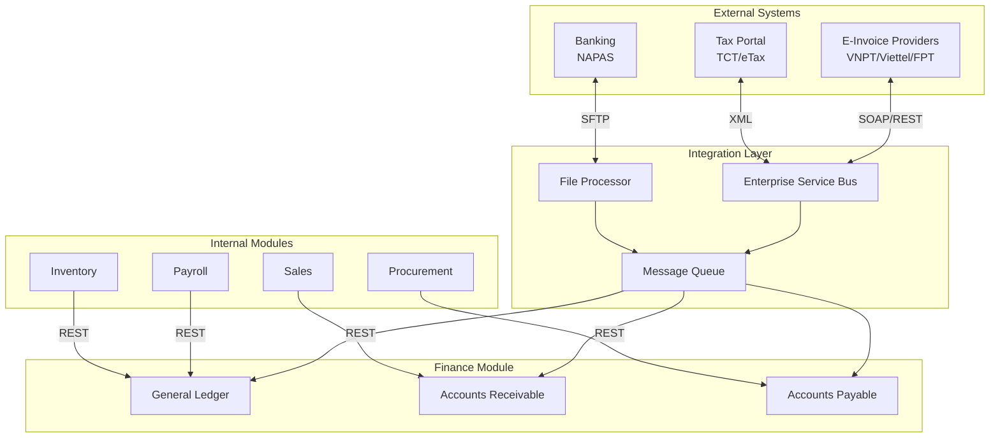

# INTEGRATION DESIGN DOCUMENT
## Finance & Accounting Module

**Document Version:** 1.0
**Date:** 2025-10-09
**Project:** Bflow ERP System
**Module:** Finance & Accounting
**Phase:** Design (Thiết kế)

---

## Document Control

| Version | Date | Author | Changes |
|---------|------|--------|---------|
| 1.0 | 2025-10-09 | Integration Team | Initial integration design |

**Review & Approval:**
| Role | Name | Signature | Date |
|------|------|-----------|------|
| Integration Architect | | | |
| Tech Lead | | | |
| Chief Accountant | | | |

---

## Table of Contents

1. [Introduction](#1-introduction)
2. [Integration Architecture](#2-integration-architecture)
3. [E-Invoice Integration](#3-e-invoice-integration)
4. [Banking Integration](#4-banking-integration)
5. [Tax Portal Integration](#5-tax-portal-integration)
6. [ERP Module Integrations](#6-erp-module-integrations)
7. [Error Handling & Retry](#7-error-handling--retry)
8. [Monitoring & Logging](#8-monitoring--logging)

---

## 1. Introduction

### 1.1 Purpose
Define integration patterns and specifications for the Finance & Accounting module to connect with external systems and internal ERP modules.

### 1.2 Integration Points

| Integration | Type | Direction | Protocol | Frequency |
|-------------|------|-----------|----------|-----------|
| E-Invoice (VNPT/Viettel/FPT) | External | Bi-directional | SOAP/REST | Real-time |
| Banking (NAPAS) | External | Outbound | File Transfer | Batch (daily) |
| Tax Portal (TCT/eTax) | External | Bi-directional | XML/SOAP | Monthly |
| Payroll Module | Internal | Inbound | REST API | Monthly |
| Sales Module | Internal | Inbound | REST API | Real-time |
| Inventory Module | Internal | Inbound | REST API | Daily |
| Procurement Module | Internal | Inbound | REST API | Real-time |

### 1.3 Integration Patterns



---

## 2. Integration Architecture

### 2.1 Enterprise Service Bus (ESB)

**Technology Stack:**
- **ESB Platform:** Apache Camel / MuleSoft
- **Message Broker:** RabbitMQ / Apache Kafka
- **API Gateway:** Kong / AWS API Gateway
- **Protocol Support:** REST, SOAP, JMS, FTP, SFTP

**ESB Configuration:**
```yaml
esb:
  routes:
    - id: einvoice-vnpt
      from: direct:create-invoice
      steps:
        - transform: invoice-to-einvoice-xml
        - enrich: add-digital-signature
        - to: soap:vnpt-einvoice-api
        - on-error: dlq:einvoice-errors

    - id: tax-declaration
      from: direct:submit-vat
      steps:
        - transform: vat-to-xml-format
        - validate: against-xsd-schema
        - to: soap:tct-tax-portal
        - log: audit-trail

    - id: payment-file
      from: timer:daily-payments
      steps:
        - aggregate: pending-payments
        - transform: to-napas-format
        - to: sftp:bank-server
```

### 2.2 Message Queue Architecture

**Queue Configuration:**
```yaml
rabbitmq:
  exchanges:
    - name: accounting.events
      type: topic
      durable: true

  queues:
    - name: journal.entry.posted
      routing_key: accounting.journal.posted
      ttl: 86400000  # 24 hours
      max_length: 10000

    - name: invoice.created
      routing_key: accounting.invoice.created

    - name: payment.received
      routing_key: accounting.payment.received

  dead_letter_queue:
    name: accounting.dlq
    ttl: 604800000  # 7 days
```

**Message Format:**
```json
{
  "message_id": "msg-uuid",
  "correlation_id": "corr-uuid",
  "timestamp": "2025-10-09T14:30:00Z",
  "event_type": "INVOICE_CREATED",
  "source": "accounting-service",
  "version": "1.0",
  "data": {
    "invoice_id": "inv-uuid",
    "customer_id": "cust-uuid",
    "total_amount": 16500000.00,
    "status": "ISSUED"
  }
}
```

---

## 3. E-Invoice Integration

### 3.1 E-Invoice Providers (Nghị định 123/2020)

**Supported Providers:**
1. VNPT (Vietnam Posts and Telecommunications Group)
2. Viettel (Military Telecom Corporation)
3. FPT (FPT Corporation)
4. MISA (MISA Joint Stock Company)

### 3.2 VNPT E-Invoice Integration

**API Endpoint:**
```
Production: https://api-einvoice.vnpt.vn/services/InvoiceAPI
Staging: https://api-einvoice-sandbox.vnpt.vn/services/InvoiceAPI
```

**Authentication:**
```xml
<soapenv:Header>
  <wsse:Security>
    <wsse:UsernameToken>
      <wsse:Username>TAX_CODE</wsse:Username>
      <wsse:Password>API_KEY</wsse:Password>
    </wsse:UsernameToken>
  </wsse:Security>
</soapenv:Header>
```

**Create Invoice Request:**
```xml
<soapenv:Envelope xmlns:soapenv="http://schemas.xmlsoap.org/soap/envelope/">
  <soapenv:Body>
    <ImportAndPublishInv>
      <Account>
        <user>0123456789</user>
        <pass>api_key_here</pass>
      </Account>
      <invoiceAuth>
        <invoice>
          <invoiceType>01GTKT0/001</invoiceType>
          <templateCode>01GTKT0/001</templateCode>
          <invoiceSeries>AB/25E</invoiceSeries>
          <invoiceNumber>0000001</invoiceNumber>
          <invoiceDate>09/10/2025</invoiceDate>
          <exchangeRate>1</exchangeRate>
          <currencyCode>VND</currencyCode>

          <sellerLegalName>Công ty ABC</sellerLegalName>
          <sellerTaxCode>0123456789</sellerTaxCode>
          <sellerAddressLine>123 Nguyen Trai, Ha Noi</sellerAddressLine>

          <buyerLegalName>Công ty XYZ</buyerLegalName>
          <buyerTaxCode>0987654321</buyerTaxCode>
          <buyerAddressLine>456 Le Loi, HCM</buyerAddressLine>

          <products>
            <product>
              <lineNumber>1</lineNumber>
              <itemName>Consulting services</itemName>
              <unitName>hour</unitName>
              <quantity>20</quantity>
              <unitPrice>500000</unitPrice>
              <amount>10000000</amount>
              <taxPercentage>10</taxPercentage>
              <taxAmount>1000000</taxAmount>
            </product>
          </products>

          <totalAmountWithoutTax>15000000</totalAmountWithoutTax>
          <totalTaxAmount>1500000</totalTaxAmount>
          <totalAmountWithTax>16500000</totalAmountWithTax>

          <paymentMethodName>Chuyển khoản</paymentMethodName>
        </invoice>
      </invoiceAuth>
    </ImportAndPublishInv>
  </soapenv:Body>
</soapenv:Envelope>
```

**Response:**
```xml
<ImportAndPublishInvResponse>
  <return>
    <invoiceNo>0000001</invoiceNo>
    <transactionID>TXN-20251009-001</transactionID>
    <reservationCode>AA/25E00000001</reservationCode>
    <supplierTaxCode>0123456789</supplierTaxCode>
    <status>SUCCESS</status>
    <message>Invoice published successfully</message>
  </return>
</ImportAndPublishInvResponse>
```

**Error Handling:**
```typescript
async function createEInvoice(invoice: Invoice): Promise<EInvoiceResponse> {
  try {
    const xmlRequest = buildEInvoiceXML(invoice);
    const response = await soapClient.call('ImportAndPublishInv', xmlRequest);

    if (response.status === 'SUCCESS') {
      await updateInvoice(invoice.id, {
        einvoice_code: response.reservationCode,
        einvoice_transaction_id: response.transactionID,
        einvoice_status: 'PUBLISHED'
      });
      return response;
    } else {
      throw new EInvoiceError(response.message);
    }
  } catch (error) {
    // Retry logic
    if (isRetryable(error)) {
      await queue.publish('einvoice.retry', { invoice_id: invoice.id });
    } else {
      await notifyAccounting('E-invoice creation failed', error);
    }
    throw error;
  }
}
```

### 3.3 E-Invoice Status Sync

**Polling Job (every 15 minutes):**
```typescript
cron.schedule('*/15 * * * *', async () => {
  const pendingInvoices = await getInvoicesWithStatus('PENDING_EINVOICE');

  for (const invoice of pendingInvoices) {
    const status = await checkEInvoiceStatus(invoice.einvoice_transaction_id);

    if (status === 'ISSUED') {
      await updateInvoice(invoice.id, {
        einvoice_status: 'ISSUED',
        einvoice_url: status.invoice_url
      });
    }
  }
});
```

---

## 4. Banking Integration

### 4.1 NAPAS Payment File Format

**File Format:** Fixed-width text file (ISO-8859-1 encoding)

**Header Record (H):**
```
Position  Length  Field Name        Sample Value
1-1       1       Record Type       H
2-11      10      Sender Bank       0011234567
12-31     20      Sender Name       CONG TY ABC
32-39     8       File Date         20251009
40-45     6       File Time         143000
46-53     8       Sequence Number   00000001
```

**Detail Record (D):**
```
Position  Length  Field Name        Sample Value
1-1       1       Record Type       D
2-11      10      Beneficiary Acc   9876543210
12-51     40      Beneficiary Name  NHA CUNG CAP XYZ
52-66     15      Amount            000000005500000
67-69     3       Currency          VND
70-109    40      Description       Payment for INV-001
110-119   10      Reference         PAY0001
```

**Trailer Record (T):**
```
Position  Length  Field Name        Sample Value
1-1       1       Record Type       T
2-9       8       Record Count      00000003
10-24     15      Total Amount      000000016500000
```

**File Generation:**
```typescript
function generateNAPASFile(payments: Payment[]): string {
  const lines: string[] = [];

  // Header
  lines.push([
    'H',
    company.bankCode.padEnd(10),
    company.name.padEnd(20),
    format(new Date(), 'yyyyMMdd'),
    format(new Date(), 'HHmmss'),
    sequenceNumber.toString().padStart(8, '0')
  ].join(''));

  // Details
  let totalAmount = 0;
  for (const payment of payments) {
    lines.push([
      'D',
      payment.vendor.bankAccount.padEnd(10),
      payment.vendor.name.padEnd(40),
      payment.amount.toFixed(0).padStart(15, '0'),
      'VND',
      payment.description.padEnd(40),
      payment.paymentNumber.padEnd(10)
    ].join(''));
    totalAmount += payment.amount;
  }

  // Trailer
  lines.push([
    'T',
    payments.length.toString().padStart(8, '0'),
    totalAmount.toFixed(0).padStart(15, '0')
  ].join(''));

  return lines.join('\n');
}
```

### 4.2 SFTP File Transfer

**SFTP Configuration:**
```yaml
sftp:
  host: sftp.vietcombank.com.vn
  port: 22
  username: COMPANY_CODE
  private_key_path: /keys/vietcombank_rsa
  remote_directory: /upload/payments
  local_directory: /data/outbound

  schedule:
    cron: "0 14 * * 1-5"  # 2 PM weekdays
    timezone: Asia/Ho_Chi_Minh

  file_naming:
    pattern: "PAY_{bank_code}_{YYYYMMDD}_{sequence}.txt"
    example: "PAY_VCB_20251009_001.txt"

  retry:
    max_attempts: 3
    retry_interval: 300  # 5 minutes
```

**Upload Process:**
```typescript
async function uploadPaymentFile() {
  const sftp = await connectSFTP(config.banking.sftp);

  try {
    // Generate file
    const payments = await getPendingPayments();
    const fileContent = generateNAPASFile(payments);
    const fileName = generateFileName();

    // Write locally
    await fs.writeFile(`/data/outbound/${fileName}`, fileContent);

    // Upload via SFTP
    await sftp.put(`/data/outbound/${fileName}`, `/upload/payments/${fileName}`);

    // Mark as sent
    await markPaymentsAsSent(payments.map(p => p.id), fileName);

    // Log
    logger.info(`Payment file uploaded: ${fileName}`, {
      payment_count: payments.length,
      total_amount: payments.reduce((sum, p) => sum + p.amount, 0)
    });

  } finally {
    await sftp.end();
  }
}
```

### 4.3 Bank Statement Import

**MT940 Format (SWIFT):**
```
:20:STATEMENT001
:25:VCB/1234567890
:28C:00001/001
:60F:C251008VND300000000,00
:61:2510091009D5500000,00NTRFNONREF//PAY0001
NHA CUNG CAP XYZ
:61:2510091009C16500000,00NTRFNONREF//INV0001
CONG TY ABC - THANH TOAN HOA DON
:62F:C251009VND311000000,00
```

**Parser:**
```typescript
function parseMT940(fileContent: string): BankStatement {
  const lines = fileContent.split('\n');
  const transactions: BankTransaction[] = [];

  for (const line of lines) {
    if (line.startsWith(':61:')) {
      // :61:2510091009D5500000,00NTRFNONREF//PAY0001
      const valueDate = line.substring(4, 10);  // 251009
      const type = line.charAt(10);  // D = Debit, C = Credit
      const amount = parseFloat(line.substring(11, 26).replace(',', '.'));
      const reference = line.split('//')[1];

      transactions.push({
        valueDate: parseDate(valueDate, 'yyMMdd'),
        type: type === 'D' ? 'DEBIT' : 'CREDIT',
        amount,
        reference
      });
    }
  }

  return { transactions };
}
```

---

## 5. Tax Portal Integration

### 5.1 TCT (General Department of Taxation) Portal

**API Endpoint:**
```
Production: https://etax.gdt.gov.vn/api/v1
Staging: https://etax-test.gdt.gov.vn/api/v1
```

**Authentication:**
```http
POST /api/v1/auth/login
Content-Type: application/json

{
  "tax_code": "0123456789",
  "username": "admin",
  "password": "encrypted_password",
  "certificate": "base64_digital_certificate"
}

Response:
{
  "access_token": "jwt_token_here",
  "expires_in": 3600,
  "token_type": "Bearer"
}
```

### 5.2 VAT Declaration Submission

**XML Format (Thông tư 32/2011/TT-BTC):**
```xml
<?xml version="1.0" encoding="UTF-8"?>
<ToKhaiThueGTGT xmlns="http://kbnn.vn/TKhaiThue">
  <ThongTinChung>
    <MaSoThue>0123456789</MaSoThue>
    <TenNguoiNopThue>CONG TY ABC</TenNguoiNopThue>
    <KyKeToan>
      <Thang>10</Thang>
      <Nam>2025</Nam>
    </KyKeToan>
    <LoaiToKhai>01</LoaiToKhai>
  </ThongTinChung>

  <ThueGTGTDauRa>
    <TongDoanhThu>500000000</TongDoanhThu>
    <DoanhThuChiuThue0>50000000</DoanhThuChiuThue0>
    <DoanhThuChiuThue5>100000000</DoanhThuChiuThue5>
    <DoanhThuChiuThue10>350000000</DoanhThuChiuThue10>
    <ThueGTGTDauRa>40000000</ThueGTGTDauRa>
  </ThueGTGTDauRa>

  <ThueGTGTDauVao>
    <TongGiaTriMuaVao>200000000</TongGiaTriMuaVao>
    <ThueGTGTDauVaoDuocKhauTru>18000000</ThueGTGTDauVaoDuocKhauTru>
    <ThueGTGTDauVaoKhongDuocKhauTru>2000000</ThueGTGTDauVaoKhongDuocKhauTru>
  </ThueGTGTDauVao>

  <ThueGTGTPhaiNop>
    <ThueGTGTPhaiNop>22000000</ThueGTGTPhaiNop>
  </ThueGTGTPhaiNop>

  <NguoiKy>
    <TenNguoiKy>Nguyen Van A</TenNguoiKy>
    <ChucDanh>Ke toan truong</ChucDanh>
    <NgayKy>09/10/2025</NgayKy>
  </NguoiKy>

  <ChuKySo>base64_digital_signature</ChuKySo>
</ToKhaiThueGTGT>
```

**Submission Code:**
```typescript
async function submitVATDeclaration(declarationId: string) {
  const declaration = await getVATDeclaration(declarationId);

  // Generate XML
  const xml = generateVATXML(declaration);

  // Validate against XSD schema
  const isValid = await validateXML(xml, 'vat-declaration-schema.xsd');
  if (!isValid) {
    throw new ValidationError('XML does not conform to schema');
  }

  // Add digital signature
  const signedXML = await signXML(xml, company.digitalCertificate);

  // Submit to TCT
  const response = await axios.post(
    'https://etax.gdt.gov.vn/api/v1/declarations/vat',
    signedXML,
    {
      headers: {
        'Content-Type': 'application/xml',
        'Authorization': `Bearer ${accessToken}`
      }
    }
  );

  // Save receipt
  await updateDeclaration(declarationId, {
    status: 'SUBMITTED',
    submission_receipt: response.data.receipt_number,
    submitted_at: new Date()
  });

  return response.data;
}
```

### 5.3 Digital Signature

**Certificate Format:** PKCS#12 (.p12) issued by Vietnam CA

**Signing Process:**
```typescript
import forge from 'node-forge';

async function signXML(xml: string, certificatePath: string): Promise<string> {
  // Load certificate
  const p12Content = await fs.readFile(certificatePath);
  const p12Asn1 = forge.asn1.fromDer(p12Content.toString('binary'));
  const p12 = forge.pkcs12.pkcs12FromAsn1(p12Asn1, 'certificate_password');

  // Get private key
  const privateKey = p12.getBags({ bagType: forge.pki.oids.pkcs8ShroudedKeyBag })[0].key;

  // Create signature
  const md = forge.md.sha256.create();
  md.update(xml, 'utf8');
  const signature = privateKey.sign(md);
  const signatureBase64 = forge.util.encode64(signature);

  // Add signature to XML
  const signedXML = xml.replace(
    '</ToKhaiThueGTGT>',
    `  <ChuKySo>${signatureBase64}</ChuKySo>\n</ToKhaiThueGTGT>`
  );

  return signedXML;
}
```

---

## 6. ERP Module Integrations

### 6.1 Payroll → GL Integration

**Monthly Salary Posting:**
```typescript
// Triggered at end of payroll period
async function postPayrollToGL(payrollPeriodId: string) {
  const payrollData = await payrollAPI.getPayrollSummary(payrollPeriodId);

  // Create journal entry
  const journalEntry = {
    entry_date: payrollData.paymentDate,
    period_id: getCurrentPeriod().id,
    journal_type: 'AUTO',
    source_type: 'PAYROLL',
    source_id: payrollPeriodId,
    description: `Salary posting for ${payrollData.periodName}`,
    lines: [
      // Debit: Salary expense
      {
        account_code: '641',  // Chi phí lương
        debit_amount: payrollData.totalGrossSalary,
        description: 'Total gross salary'
      },
      // Credit: BHXH payable (company)
      {
        account_code: '3383',  // BHXH phải nộp
        credit_amount: payrollData.totalSocialInsuranceCompany,
        description: 'Social insurance - company'
      },
      // Credit: PIT payable
      {
        account_code: '3335',  // Thuế TNCN phải nộp
        credit_amount: payrollData.totalPIT,
        description: 'Personal income tax'
      },
      // Credit: BHXH payable (employee)
      {
        account_code: '3383',
        credit_amount: payrollData.totalSocialInsuranceEmployee,
        description: 'Social insurance - employee'
      },
      // Credit: Salaries payable
      {
        account_code: '334',  // Phải trả công nhân viên
        credit_amount: payrollData.totalNetSalary,
        description: 'Net salary payable'
      }
    ]
  };

  const createdEntry = await glAPI.createJournalEntry(journalEntry);
  await glAPI.postJournalEntry(createdEntry.id);

  return createdEntry;
}
```

**Event Listener:**
```typescript
// Listen for payroll events
eventBus.on('payroll.period.closed', async (event) => {
  try {
    const journalEntry = await postPayrollToGL(event.period_id);

    logger.info('Payroll posted to GL', {
      payroll_period: event.period_id,
      journal_number: journalEntry.journal_number,
      total_amount: journalEntry.total_debit
    });
  } catch (error) {
    logger.error('Failed to post payroll to GL', error);
    await notifyAccounting('Payroll GL posting failed', error);
  }
});
```

### 6.2 Sales → AR Integration

**Real-time Invoice Creation:**
```typescript
// When sales order is fulfilled
eventBus.on('sales.order.fulfilled', async (event) => {
  const salesOrder = await salesAPI.getOrder(event.order_id);

  // Create AR invoice
  const invoice = await arAPI.createInvoice({
    invoice_date: new Date(),
    customer_id: salesOrder.customer_id,
    payment_term_id: salesOrder.payment_term_id,
    items: salesOrder.items.map(item => ({
      description: item.product_name,
      quantity: item.quantity,
      unit_price: item.unit_price,
      amount: item.amount,
      revenue_account_id: item.revenue_account_id,
      tax_code_id: item.tax_code_id
    })),
    notes: `Sales Order: ${salesOrder.order_number}`
  });

  // Link invoice back to sales order
  await salesAPI.updateOrder(event.order_id, {
    invoice_id: invoice.id,
    invoice_number: invoice.invoice_number
  });
});
```

### 6.3 Inventory → GL Integration

**Daily Inventory Posting:**
```typescript
cron.schedule('0 23 * * *', async () => {
  const inventoryTransactions = await inventoryAPI.getTransactionsForDate(today);

  for (const txn of inventoryTransactions) {
    if (txn.type === 'PURCHASE') {
      // DR: Inventory, CR: AP
      await glAPI.createJournalEntry({
        description: `Inventory purchase: ${txn.reference}`,
        lines: [
          {
            account_code: '152',  // Nguyên vật liệu
            debit_amount: txn.amount
          },
          {
            account_code: '331',  // Phải trả người bán
            credit_amount: txn.amount
          }
        ]
      });
    } else if (txn.type === 'SALE') {
      // DR: COGS, CR: Inventory
      await glAPI.createJournalEntry({
        description: `Cost of goods sold: ${txn.reference}`,
        lines: [
          {
            account_code: '632',  // Giá vốn hàng bán
            debit_amount: txn.cost
          },
          {
            account_code: '152',
            credit_amount: txn.cost
          }
        ]
      });
    }
  }
});
```

---

## 7. Error Handling & Retry

### 7.1 Retry Strategy

**Exponential Backoff:**
```typescript
async function retryWithBackoff<T>(
  fn: () => Promise<T>,
  maxAttempts: number = 3,
  baseDelay: number = 1000
): Promise<T> {
  for (let attempt = 1; attempt <= maxAttempts; attempt++) {
    try {
      return await fn();
    } catch (error) {
      if (attempt === maxAttempts || !isRetryable(error)) {
        throw error;
      }

      const delay = baseDelay * Math.pow(2, attempt - 1);
      await sleep(delay);
    }
  }
  throw new Error('Max retry attempts reached');
}

function isRetryable(error: any): boolean {
  // Network errors
  if (error.code === 'ECONNREFUSED' || error.code === 'ETIMEDOUT') {
    return true;
  }

  // HTTP 5xx errors
  if (error.response?.status >= 500) {
    return true;
  }

  // Rate limiting
  if (error.response?.status === 429) {
    return true;
  }

  return false;
}
```

### 7.2 Dead Letter Queue

**DLQ Configuration:**
```yaml
dlq:
  queues:
    - name: einvoice.dlq
      source: einvoice.created
      max_retries: 3
      retention: 7 days

    - name: payment.dlq
      source: payment.file.upload
      max_retries: 5
      retention: 30 days

  alerts:
    - condition: message_count > 10
      action: notify_team
      channel: slack

    - condition: age > 24 hours
      action: escalate
      channel: pagerduty
```

**DLQ Processing:**
```typescript
// Manual retry from DLQ
async function retryDLQMessage(messageId: string) {
  const message = await dlq.getMessage(messageId);

  try {
    await processMessage(message);
    await dlq.deleteMessage(messageId);
  } catch (error) {
    await dlq.updateMessage(messageId, {
      retry_count: message.retry_count + 1,
      last_error: error.message
    });
  }
}
```

---

## 8. Monitoring & Logging

### 8.1 Integration Metrics

**Key Metrics:**
```yaml
metrics:
  - name: einvoice_success_rate
    type: counter
    labels: [provider, invoice_type]

  - name: einvoice_response_time
    type: histogram
    buckets: [100, 500, 1000, 5000]

  - name: payment_file_size
    type: gauge
    labels: [bank]

  - name: tax_submission_count
    type: counter
    labels: [tax_type, status]

  - name: integration_errors
    type: counter
    labels: [integration, error_type]
```

**Prometheus Queries:**
```promql
# E-invoice success rate
rate(einvoice_success_total[5m]) / rate(einvoice_attempts_total[5m])

# Payment file upload latency
histogram_quantile(0.95, payment_file_upload_duration_seconds)

# Tax submission failures
sum(rate(tax_submission_errors_total[1h])) by (tax_type)
```

### 8.2 Integration Logs

**Structured Logging:**
```typescript
logger.info('E-invoice created', {
  integration: 'einvoice',
  provider: 'VNPT',
  invoice_id: invoice.id,
  invoice_number: invoice.invoice_number,
  transaction_id: response.transactionID,
  duration_ms: 1250,
  status: 'SUCCESS'
});

logger.error('Payment file upload failed', {
  integration: 'banking',
  bank: 'VCB',
  file_name: fileName,
  payment_count: payments.length,
  error: error.message,
  stack_trace: error.stack,
  retry_attempt: 2
});
```

### 8.3 Health Checks

**Integration Health Endpoints:**
```typescript
app.get('/health/integrations', async (req, res) => {
  const health = {
    status: 'healthy',
    integrations: {}
  };

  // Check E-invoice
  try {
    await einvoiceClient.ping();
    health.integrations.einvoice = { status: 'up', latency_ms: 120 };
  } catch {
    health.integrations.einvoice = { status: 'down' };
    health.status = 'degraded';
  }

  // Check Banking SFTP
  try {
    await sftpClient.connect();
    health.integrations.banking = { status: 'up' };
  } catch {
    health.integrations.banking = { status: 'down' };
    health.status = 'degraded';
  }

  // Check Tax Portal
  try {
    await taxPortalClient.ping();
    health.integrations.tax = { status: 'up', latency_ms: 250 };
  } catch {
    health.integrations.tax = { status: 'down' };
    health.status = 'degraded';
  }

  res.status(health.status === 'healthy' ? 200 : 503).json(health);
});
```

---

## Appendix A: Integration Checklist

**Pre-Production:**
- [ ] Credentials obtained for all external systems
- [ ] SSL certificates installed
- [ ] Firewall rules configured
- [ ] SFTP keys exchanged
- [ ] Digital certificates installed
- [ ] Test transactions successful
- [ ] Error handling tested
- [ ] Retry logic validated
- [ ] Monitoring dashboards created
- [ ] Runbooks documented

**Post-Production:**
- [ ] Daily reconciliation process
- [ ] Weekly health check reviews
- [ ] Monthly integration reports
- [ ] Quarterly disaster recovery tests

---

## Document Approval

**Prepared by:** Integration Team
**Reviewed by:** Integration Architect, Tech Lead
**Approved by:** CTO
**Date:** 2025-10-09

---

**End of Document**
