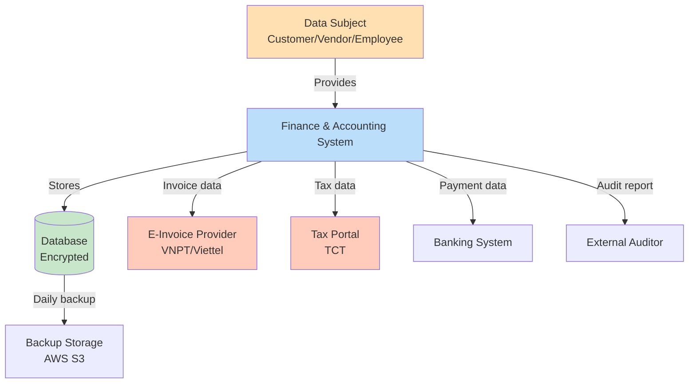
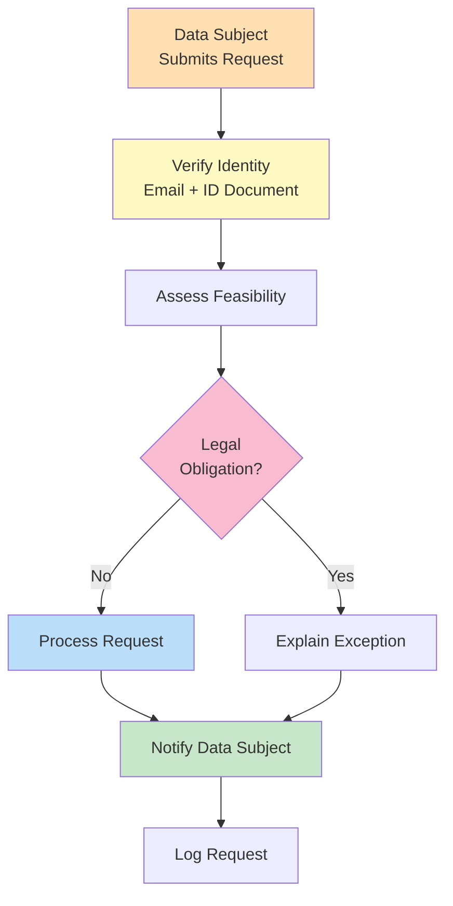

# PRIVACY IMPACT ASSESSMENT (DPIA)
## Finance & Accounting Module

**Document Version:** 1.0
**Date:** 2025-10-09
**Project:** Bflow ERP System
**Module:** Finance & Accounting
**Phase:** Design (Thiết kế)

---

## Document Control

| Version | Date | Author | Changes |
|---------|------|--------|---------|
| 1.0 | 2025-10-09 | Privacy Team | Initial DPIA |

**Review & Approval:**
| Role | Name | Signature | Date |
|------|------|-----------|------|
| Data Protection Officer | | | |
| Legal Counsel | | | |
| CISO | | | |

---

## Table of Contents

1. [Introduction](#1-introduction)
2. [Legal Framework](#2-legal-framework)
3. [Data Inventory](#3-data-inventory)
4. [Privacy Risk Assessment](#4-privacy-risk-assessment)
5. [Data Subject Rights](#5-data-subject-rights)
6. [Data Retention](#6-data-retention)
7. [Third-Party Processing](#7-third-party-processing)
8. [Mitigation Measures](#8-mitigation-measures)

---

## 1. Introduction

### 1.1 Purpose
This Data Protection Impact Assessment (DPIA) evaluates privacy risks associated with the Finance & Accounting module and ensures compliance with Vietnam's personal data protection laws.

### 1.2 Scope
- Personal data processed in Finance & Accounting module
- Data flows and transfers
- Privacy risks and mitigation measures
- Data subject rights implementation
- Compliance with Nghị định 13/2023/NĐ-CP

### 1.3 Assessment Methodology
- Data inventory and classification
- Privacy risk identification
- Impact assessment (Likelihood × Severity)
- Mitigation controls
- Residual risk evaluation

---

## 2. Legal Framework

### 2.1 Nghị định 13/2023/NĐ-CP
**Personal Data Protection Decree**

**Key Requirements:**
```yaml
lawful_basis:
  - consent: Required for non-essential processing
  - contract: Processing necessary for contract execution
  - legal_obligation: Accounting law compliance
  - legitimate_interest: Business operations

principles:
  - lawfulness: Process only with legal basis
  - purpose_limitation: Use only for specified purposes
  - data_minimization: Collect only necessary data
  - accuracy: Maintain accurate data
  - storage_limitation: Retain only as long as necessary
  - integrity_confidentiality: Secure data

data_subject_rights:
  - right_to_access
  - right_to_rectification
  - right_to_erasure
  - right_to_restrict_processing
  - right_to_data_portability
  - right_to_object
  - right_to_withdraw_consent
```

### 2.2 Luật Kế toán 2015
**Accounting Law**

**Data Retention Requirements:**
```yaml
retention_periods:
  financial_statements: 10 years
  general_ledger: 10 years
  journal_entries: 10 years
  invoices: 10 years
  tax_declarations: 10 years
  payment_records: 10 years
  employment_contracts: 7 years after termination
  audit_reports: 10 years
```

**Conflict Resolution:**
- Nghị định 13/2023 allows retention for legal compliance
- Accounting Law takes precedence for financial data
- Personal data in accounting records retained per Accounting Law
- Non-accounting personal data follows standard retention

### 2.3 Other Applicable Laws
- Luật An toàn thông tin mạng 2018 (Cybersecurity Law)
- Nghị định 85/2016/NĐ-CP (Data security)
- Thông tư 47/2020/TT-NHNN (Banking security)

---

## 3. Data Inventory

### 3.1 Personal Data Categories

| Data Category | Data Elements | Purpose | Legal Basis | Retention |
|---------------|---------------|---------|-------------|-----------|
| **Customer Identity** | Name, tax code, address, phone, email | Customer management, invoicing | Contract | 10 years |
| **Vendor Identity** | Name, tax code, address, phone, email, bank account | Vendor management, payments | Contract | 10 years |
| **Employee Financial** | Salary, bonuses, deductions, tax info | Payroll accounting | Legal obligation | 10 years |
| **User Account** | Username, email, role, last login | System access | Legitimate interest | Account lifetime + 2 years |
| **Audit Trail** | User ID, IP address, actions, timestamps | Security, compliance | Legal obligation | 10 years |
| **Transaction Data** | Journal entries, invoices, payments | Accounting records | Legal obligation | 10 years |

### 3.2 Sensitive Personal Data

**Special Categories (Requires Enhanced Protection):**

| Category | Data Elements | Justification | Extra Safeguards |
|----------|---------------|---------------|------------------|
| Financial Data | Bank accounts, tax codes, salary | Accounting requirement | Encryption, access control |
| Authentication | Passwords, MFA secrets | System security | Hashing, encryption |
| Health Data | None | N/A | N/A |
| Biometric Data | None (future: fingerprint for approval) | Enhanced security | Explicit consent required |

### 3.3 Data Flow Mapping



**Data Flows:**

| Flow | Data Category | Recipient | Transfer Mechanism | Safeguards |
|------|---------------|-----------|-------------------|------------|
| System → Database | All personal data | Internal (PostgreSQL) | Internal network | Encryption at rest, access control |
| System → E-Invoice Provider | Customer name, tax code, invoice details | VNPT/Viettel (Vietnam) | HTTPS API | TLS 1.3, data minimization |
| System → Tax Portal | Tax declarations | TCT (Vietnam) | HTTPS/XML | TLS 1.3, digital signature |
| System → Banking | Vendor bank account, payment amount | VCB/TCB (Vietnam) | SFTP | SSH encryption, file encryption |
| System → Backup | All data | AWS S3 (Singapore) | Encrypted transfer | AES-256 encryption, restricted access |
| System → Auditor | Financial records (anonymized where possible) | External auditor | Secure export | Password-protected files, NDA |

---

## 4. Privacy Risk Assessment

### 4.1 Risk Methodology

**Risk Scoring:**
- **Likelihood:** Rare (1), Unlikely (2), Possible (3), Likely (4), Almost Certain (5)
- **Severity:** Negligible (1), Minor (2), Moderate (3), Major (4), Severe (5)
- **Risk Level:** Likelihood × Severity
  - 1-5: Low
  - 6-12: Medium
  - 15-25: High

### 4.2 Identified Privacy Risks

| Risk ID | Risk Description | Likelihood | Severity | Risk Level | Mitigation |
|---------|------------------|------------|----------|------------|------------|
| R01 | Unauthorized access to customer financial data | 3 | 5 | 15 (High) | RBAC, MFA, encryption, audit logging |
| R02 | Data breach during backup transfer | 2 | 4 | 8 (Medium) | Encryption in transit, VPN, access controls |
| R03 | Excessive data retention beyond legal requirement | 3 | 3 | 9 (Medium) | Automated retention policy, data lifecycle |
| R04 | Third-party processor non-compliance | 2 | 4 | 8 (Medium) | DPA, regular audits, vendor assessment |
| R05 | Inability to fulfill data subject rights | 2 | 3 | 6 (Medium) | DSR workflow, data mapping, response SLA |
| R06 | Personal data in log files | 4 | 3 | 12 (Medium) | Log sanitization, PII masking |
| R07 | Cross-border data transfer without safeguards | 1 | 5 | 5 (Low) | Standard Contractual Clauses, encryption |
| R08 | Data loss due to system failure | 2 | 4 | 8 (Medium) | Backup strategy, disaster recovery, redundancy |
| R09 | Insider threat - employee data misuse | 2 | 4 | 8 (Medium) | Access logging, separation of duties, background checks |
| R10 | Inadequate data anonymization in reports | 3 | 3 | 9 (Medium) | Anonymization rules, review process |

### 4.3 Risk Heatmap

```
Severity
  5 │                   R01
  4 │       R02  R04  R08  R09
  3 │   R03  R05  R06  R10
  2 │
  1 │   R07
    └─────────────────────────
      1   2   3   4   5
           Likelihood
```

### 4.4 Detailed Risk Analysis

**R01: Unauthorized Access to Customer Financial Data**

**Description:** Attackers or unauthorized employees access customer financial information including tax codes, bank accounts, transaction history.

**Potential Impact:**
- Financial fraud
- Identity theft
- Reputational damage
- Regulatory fines

**Current Controls:**
- Role-based access control (RBAC)
- Multi-factor authentication (MFA)
- Data encryption (AES-256)
- Audit logging

**Additional Mitigations:**
- Implement privileged access management (PAM)
- Regular access reviews (quarterly)
- Data loss prevention (DLP) tools
- Security awareness training

**Residual Risk:** Medium (6)

---

**R06: Personal Data in Log Files**

**Description:** Application logs may contain personal data (names, tax codes, emails) which are stored long-term and accessible to operations team.

**Potential Impact:**
- Excessive data exposure
- Compliance violation
- Data subject rights cannot be exercised

**Current Controls:**
- Centralized logging system
- Access controls on logs

**Additional Mitigations:**
```typescript
// Implement log sanitization
const sensitiveFields = ['tax_code', 'email', 'bank_account', 'phone'];

function sanitizeLogData(data: any): any {
  const sanitized = { ...data };

  for (const field of sensitiveFields) {
    if (field in sanitized) {
      if (field === 'tax_code') {
        // 0123456789 → 012****789
        sanitized[field] = sanitized[field].substring(0, 3) + '****' + sanitized[field].substring(7);
      } else if (field === 'email') {
        // user@example.com → u***@example.com
        const [local, domain] = sanitized[field].split('@');
        sanitized[field] = local[0] + '***@' + domain;
      } else if (field === 'bank_account') {
        // 1234567890 → ******7890
        sanitized[field] = '******' + sanitized[field].slice(-4);
      } else {
        sanitized[field] = '[REDACTED]';
      }
    }
  }

  return sanitized;
}

// Usage
logger.info('Invoice created', sanitizeLogData({
  invoice_id: 'inv-123',
  customer_name: 'Công ty ABC',
  tax_code: '0123456789',  // Will be masked
  amount: 16500000
}));
```

**Residual Risk:** Low (4)

---

## 5. Data Subject Rights

### 5.1 Rights Implementation

#### Right to Access (Article 15)

**Implementation:**
```typescript
// GET /api/v1/data-subject-access?email={email}
async function handleDataSubjectAccessRequest(email: string) {
  // Verify identity (requires authentication + MFA)
  await verifyDataSubjectIdentity(email);

  // Collect all personal data
  const personalData = {
    user_profile: await getUserProfile(email),
    customer_record: await getCustomerByEmail(email),
    vendor_record: await getVendorByEmail(email),
    transactions: await getTransactionsByUser(email),
    audit_logs: await getAuditLogsByUser(email),
    consents: await getConsentRecords(email)
  };

  // Generate report
  const report = generateDSARReport(personalData);

  // Log request
  await logDSAR({
    type: 'ACCESS',
    email,
    fulfilled_at: new Date(),
    format: 'JSON'
  });

  return report;
}
```

**Response Time:** Within 72 hours
**Format:** JSON, PDF, or Excel
**Verification:** Email verification + ID document

#### Right to Rectification (Article 16)

**Implementation:**
```typescript
// PUT /api/v1/users/{id}/personal-data
async function updatePersonalData(userId: string, updates: any) {
  // Verify identity
  await verifyIdentity(userId);

  // Validate updates
  const validatedUpdates = await validatePersonalDataUpdates(updates);

  // Update all occurrences
  await updateUserProfile(userId, validatedUpdates);
  await updateCustomerRecord(userId, validatedUpdates);

  // Audit
  await logDSAR({
    type: 'RECTIFICATION',
    user_id: userId,
    changes: validatedUpdates
  });

  return { success: true };
}
```

#### Right to Erasure (Article 17)

**Implementation:**
```typescript
async function handleErasureRequest(userId: string) {
  // Check if erasure is possible
  const canErase = await checkErasureFeasibility(userId);

  if (!canErase.allowed) {
    // Cannot erase if required for legal compliance
    return {
      success: false,
      reason: 'Data required for accounting compliance (10 year retention)',
      alternative: 'We will anonymize non-essential data'
    };
  }

  // Anonymize instead of delete (for audit trail)
  await anonymizePersonalData(userId);

  // Log
  await logDSAR({
    type: 'ERASURE',
    user_id: userId,
    action: 'ANONYMIZED',
    reason: canErase.reason
  });

  return { success: true };
}

// Anonymization
async function anonymizePersonalData(userId: string) {
  await db.transaction(async (trx) => {
    // Replace with pseudonyms
    await trx('users').where({ id: userId }).update({
      name: `User-${generateHash(userId)}`,
      email: `deleted-${userId}@anonymized.local`,
      phone: null,
      address: null
    });

    // Keep accounting data but anonymize identifiers
    await trx('ar_customers').where({ user_id: userId }).update({
      customer_name: `[ANONYMIZED]`,
      email: null,
      phone: null,
      contact_person: null
    });
  });
}
```

#### Right to Data Portability (Article 20)

**Implementation:**
```typescript
// GET /api/v1/data-export?format={json|csv|excel}
async function exportPersonalData(userId: string, format: string) {
  const data = await collectPortableData(userId);

  switch (format) {
    case 'json':
      return {
        format: 'application/json',
        content: JSON.stringify(data, null, 2)
      };

    case 'csv':
      return {
        format: 'text/csv',
        content: convertToCSV(data)
      };

    case 'excel':
      return {
        format: 'application/vnd.openxmlformats-officedocument.spreadsheetml.sheet',
        content: generateExcel(data)
      };
  }
}
```

### 5.2 Data Subject Request Workflow



**SLA:**
- Acknowledgment: Within 24 hours
- Fulfillment: Within 72 hours (3 days)
- Complex requests: Up to 30 days (with explanation)

---

## 6. Data Retention

### 6.1 Retention Schedule

| Data Category | Retention Period | Legal Basis | Deletion Method |
|---------------|------------------|-------------|-----------------|
| Journal Entries | 10 years | Luật Kế toán 2015 | Secure deletion |
| Invoices | 10 years | Luật Kế toán 2015 | Secure deletion |
| Tax Declarations | 10 years | Luật Thuế | Secure deletion |
| Payment Records | 10 years | Luật Kế toán 2015 | Secure deletion |
| Audit Logs | 10 years | Compliance requirement | Secure deletion |
| Customer Master Data | Account lifetime + 10 years | Business need + legal | Anonymization |
| User Accounts | Account lifetime + 2 years | Legitimate interest | Hard deletion |
| Session Logs | 90 days | Security monitoring | Auto-deletion |
| Application Logs | 1 year | Troubleshooting | Auto-deletion |
| Backup Files | 90 days | Disaster recovery | Encrypted deletion |

### 6.2 Automated Retention Policy

```typescript
// Daily retention job
cron.schedule('0 2 * * *', async () => {
  const today = new Date();

  // Delete session logs older than 90 days
  const sessionCutoff = subDays(today, 90);
  await db('session_logs').where('created_at', '<', sessionCutoff).delete();

  // Delete application logs older than 1 year
  const appLogCutoff = subDays(today, 365);
  await db('application_logs').where('created_at', '<', appLogCutoff).delete();

  // Anonymize inactive user accounts older than 2 years
  const inactiveUserCutoff = subDays(today, 730);
  const inactiveUsers = await db('users')
    .where('last_login_at', '<', inactiveUserCutoff)
    .andWhere('status', 'INACTIVE');

  for (const user of inactiveUsers) {
    await anonymizeUser(user.id);
  }

  // Archive accounting data older than 10 years
  const accountingCutoff = subYears(today, 10);
  const oldJournals = await db('gl_journals')
    .where('entry_date', '<', accountingCutoff);

  if (oldJournals.length > 0) {
    await archiveToGlacier(oldJournals);
    await db('gl_journals').whereIn('id', oldJournals.map(j => j.id)).delete();
  }

  logger.info('Retention policy executed', {
    sessions_deleted: sessionDeleteCount,
    logs_deleted: logDeleteCount,
    users_anonymized: inactiveUsers.length,
    journals_archived: oldJournals.length
  });
});
```

### 6.3 Deletion Procedures

**Secure Deletion:**
```typescript
async function secureDelete(table: string, condition: any) {
  // 1. Soft delete (mark as deleted)
  await db(table).where(condition).update({
    deleted_at: new Date(),
    deleted: true
  });

  // 2. After 30 day grace period, hard delete
  setTimeout(async () => {
    // Overwrite with random data (DoD 5220.22-M standard)
    await db.raw(`
      UPDATE ${table}
      SET data = random()::text
      WHERE deleted = true AND deleted_at < NOW() - INTERVAL '30 days'
    `);

    // Physical deletion
    await db(table).where('deleted', true).andWhere('deleted_at', '<', subDays(new Date(), 30)).delete();

    // Vacuum database
    await db.raw('VACUUM FULL');
  }, 30 * 24 * 60 * 60 * 1000);
}
```

---

## 7. Third-Party Processing

### 7.1 Data Processing Agreements (DPA)

**Required Processors:**

| Processor | Service | Data Shared | Location | DPA Status |
|-----------|---------|-------------|----------|------------|
| AWS | Infrastructure hosting | All data (encrypted) | Singapore | ✓ Signed |
| VNPT E-Invoice | E-invoice service | Customer name, tax code, invoice details | Vietnam | ✓ Signed |
| Viettel E-Invoice | E-invoice service | Customer name, tax code, invoice details | Vietnam | ✓ Signed |
| VCB/TCB | Banking services | Vendor bank account, payment amounts | Vietnam | ✓ Signed |
| External Auditor | Financial audit | Financial records (anonymized where possible) | Vietnam | ✓ Signed + NDA |

**DPA Requirements:**
```yaml
dpa_clauses:
  - purpose_limitation: Process only for specified purposes
  - confidentiality: Maintain confidentiality of personal data
  - security_measures: Implement appropriate technical and organizational measures
  - sub_processors: Obtain prior written consent for sub-processors
  - data_subject_rights: Assist in fulfilling data subject rights
  - breach_notification: Notify within 24 hours of data breach
  - data_return: Return or delete data upon contract termination
  - audit_rights: Allow audits and inspections
  - compliance: Comply with Nghị định 13/2023/NĐ-CP
```

### 7.2 Vendor Assessment

**Due Diligence Checklist:**
- [ ] Privacy policy review
- [ ] Security certifications (ISO 27001, SOC 2)
- [ ] Data breach history
- [ ] Sub-processor list
- [ ] Data location and transfer mechanisms
- [ ] Compliance with Vietnam laws
- [ ] Insurance coverage
- [ ] Incident response plan
- [ ] Business continuity plan
- [ ] Financial stability

**Annual Review:**
- Review DPAs annually
- Conduct security audits
- Verify compliance
- Update risk assessments

---

## 8. Mitigation Measures

### 8.1 Technical Measures

**Data Protection by Design:**
```typescript
// Pseudonymization
class Pseudonymizer {
  private key: string;

  pseudonymize(value: string): string {
    const hash = crypto.createHmac('sha256', this.key).update(value).digest('hex');
    return hash.substring(0, 16);
  }

  // Reversible if key is known
  reversePseudonym(pseudonym: string, originalValues: string[]): string | null {
    for (const value of originalValues) {
      if (this.pseudonymize(value) === pseudonym) {
        return value;
      }
    }
    return null;
  }
}

// Usage in analytics
const pseudonymizer = new Pseudonymizer(process.env.PSEUDONYM_KEY);

// Store pseudonymized user ID in analytics
analytics.track({
  user_id: pseudonymizer.pseudonymize(user.id),
  event: 'invoice_created',
  amount: invoice.total
});
```

**Data Minimization:**
```typescript
// Only collect necessary fields
interface CustomerDTO {
  customer_name: string;           // Required
  tax_code: string;                // Required for invoicing
  email: string;                   // Required for communication
  phone?: string;                  // Optional
  address?: string;                // Optional
  // Removed: date_of_birth, id_number (not needed for B2B)
}

// Validate at API level
const customerSchema = z.object({
  customer_name: z.string().min(1).max(200),
  tax_code: z.string().regex(/^\d{10}$/),
  email: z.string().email(),
  phone: z.string().optional(),
  address: z.string().optional()
}).strict();  // Reject extra fields
```

**Access Logging:**
```typescript
// Log all access to personal data
async function logDataAccess(event: {
  user_id: string;
  action: 'READ' | 'WRITE' | 'DELETE';
  resource_type: string;
  resource_id: string;
  data_subject_id: string;
}) {
  await db('data_access_log').insert({
    ...event,
    timestamp: new Date(),
    ip_address: getClientIP(),
    user_agent: getUserAgent()
  });
}

// Usage
app.get('/api/v1/customers/:id', async (req, res) => {
  const customer = await getCustomer(req.params.id);

  // Log access
  await logDataAccess({
    user_id: req.user.id,
    action: 'READ',
    resource_type: 'customer',
    resource_id: customer.id,
    data_subject_id: customer.id
  });

  res.json(customer);
});
```

### 8.2 Organizational Measures

**Privacy Governance:**
```yaml
privacy_team:
  - role: Data Protection Officer (DPO)
    responsibilities:
      - Monitor compliance with Nghị định 13/2023
      - Conduct DPIAs
      - Respond to data subject requests
      - Liaise with authorities

  - role: Privacy Champion (each department)
    responsibilities:
      - Promote privacy awareness
      - Escalate privacy issues
      - Implement privacy controls

training:
  - audience: All employees
    frequency: Annually
    topics:
      - Nghị định 13/2023 overview
      - Data subject rights
      - Secure data handling
      - Incident reporting

  - audience: Developers
    frequency: Bi-annually
    topics:
      - Privacy by design
      - Secure coding practices
      - Data minimization
      - Encryption implementation
```

**Incident Response:**
```yaml
breach_response_plan:
  detection:
    - Automated monitoring alerts
    - User reports
    - Security audits

  assessment:
    - Severity classification
    - Affected data subjects count
    - Data categories involved
    - Risk to data subjects

  containment:
    - Isolate affected systems
    - Revoke compromised credentials
    - Block attacker access

  notification:
    - Internal: Immediate (< 1 hour)
    - DPO: Within 4 hours
    - Authorities: Within 72 hours
    - Data subjects: Without undue delay (if high risk)

  recovery:
    - Restore from backups
    - Patch vulnerabilities
    - Post-incident review
```

---

## Appendix A: Privacy Notice

**Privacy Notice for Finance & Accounting Module**

**Who we are:**
Bflow ERP System
Address: [Company Address]
Email: privacy@bflow.com
DPO: [DPO Name and Contact]

**What personal data we collect:**
- Identity data: Name, email, phone, address
- Financial data: Tax code, bank account, transaction history
- Usage data: IP address, login times, actions performed

**Why we collect it:**
- To provide accounting services
- To comply with legal obligations (Luật Kế toán 2015)
- To detect and prevent fraud
- To improve our services

**Legal basis:**
- Contract execution
- Legal compliance
- Legitimate business interests

**Who we share it with:**
- E-invoice providers (VNPT, Viettel) - for invoicing
- Tax authorities (TCT) - for tax compliance
- Banks (VCB, TCB) - for payment processing
- External auditors - for financial audits

**How long we keep it:**
- Financial data: 10 years (legal requirement)
- User accounts: Account lifetime + 2 years
- Logs: 90 days to 1 year

**Your rights:**
- Right to access your data
- Right to correct inaccurate data
- Right to erase data (subject to legal exceptions)
- Right to restrict processing
- Right to data portability
- Right to object
- Right to lodge a complaint with authorities

**Contact us:**
Email: privacy@bflow.com
Phone: [Company Phone]

**Last updated:** 2025-10-09

---

## Appendix B: Consent Form Template

```html
<form id="consent-form">
  <h3>Consent for Data Processing</h3>

  <p>We process your personal data for the following purposes:</p>

  <label>
    <input type="checkbox" name="consent_accounting" value="yes" required />
    <strong>Essential:</strong> To provide accounting services and comply with legal obligations (Luật Kế toán 2015).
    <em>This is required and cannot be opted out.</em>
  </label>

  <label>
    <input type="checkbox" name="consent_marketing" value="yes" />
    <strong>Optional:</strong> To send you promotional emails about new features and services.
    <em>You can opt out at any time.</em>
  </label>

  <label>
    <input type="checkbox" name="consent_analytics" value="yes" />
    <strong>Optional:</strong> To analyze your usage patterns to improve our services (anonymized data).
  </label>

  <p>
    You have the right to withdraw your consent at any time by contacting us at
    <a href="mailto:privacy@bflow.com">privacy@bflow.com</a>.
  </p>

  <p>
    By clicking "I Agree", you consent to the processing of your personal data as described above
    and acknowledge that you have read our <a href="/privacy-policy">Privacy Policy</a>.
  </p>

  <button type="submit">I Agree</button>
</form>
```

---

## Document Approval

**Prepared by:** Privacy Team
**Reviewed by:** Data Protection Officer, Legal Counsel
**Approved by:** CEO
**Date:** 2025-10-09

**Next Review Date:** 2026-10-09

---

**End of Document**
