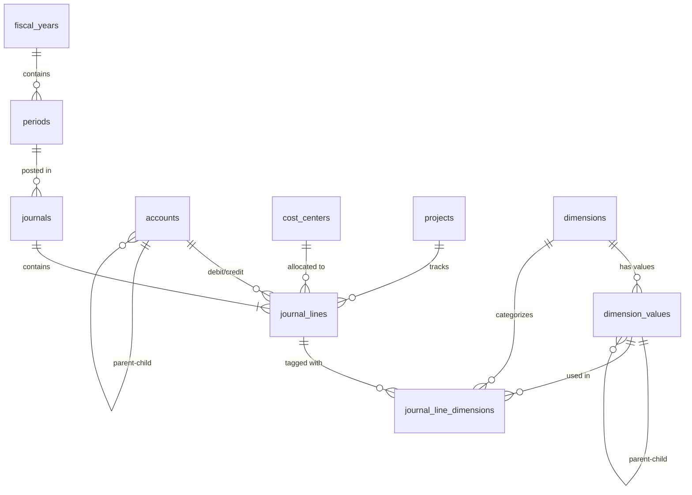

# Core Accounting - Database Design
## Hybrid Dimension Model

**Version:** 1.0
**Date:** 2025-10-30
**Approach:** Journal Line Mode - Hybrid Dimensions

---

## 1. Overview

### 1.1 Architecture Decision
**Phương án:** HYBRID DIMENSION MODEL

- **Fixed Dimensions:** Cost Center, Project (built-in columns trong `journal_lines`)
- **Flexible Dimensions:** Custom dimensions qua bảng `journal_line_dimensions` (many-to-many)

### 1.2 Why Hybrid?

**Ưu điểm:**
- Performance tốt cho dimensions thường xuyên (cost_center, project)
- Flexibility cho dimensions mở rộng (department, location, product, customer, etc.)
- Query đơn giản cho báo cáo thông thường
- Dễ mở rộng khi có yêu cầu mới

**Nhược điểm:**
- Schema phức tạp hơn pure fixed hoặc pure flexible
- Cần quyết định trước dimensions nào là "fixed"

---

## 2. Core Tables

### 2.1 Chart of Accounts

#### Table: `accounts`
Hệ thống tài khoản theo Circular 133/2016/TT-BTC

```sql
CREATE TABLE accounts (
    id                  UUID PRIMARY KEY DEFAULT gen_random_uuid(),
    account_code        VARCHAR(20) UNIQUE NOT NULL,  -- 111, 1121, 131, 331, 511...
    account_name        VARCHAR(200) NOT NULL,         -- Tiền mặt, Phải thu KH...
    parent_id           UUID REFERENCES accounts(id),  -- Hierarchical structure
    account_type        VARCHAR(20) NOT NULL,          -- ASSET, LIABILITY, EQUITY, REVENUE, EXPENSE
    is_debit_normal     BOOLEAN NOT NULL,              -- TRUE cho tài sản/chi phí
    currency_code       VARCHAR(3) NOT NULL DEFAULT 'VND',
    is_active           BOOLEAN NOT NULL DEFAULT TRUE,
    allow_posting       BOOLEAN NOT NULL DEFAULT TRUE, -- FALSE cho parent accounts
    require_cost_center BOOLEAN NOT NULL DEFAULT FALSE,
    require_project     BOOLEAN NOT NULL DEFAULT FALSE,
    balance             DECIMAL(18,2) NOT NULL DEFAULT 0,
    created_at          TIMESTAMP NOT NULL DEFAULT NOW(),
    updated_at          TIMESTAMP NOT NULL DEFAULT NOW()
);

CREATE INDEX idx_accounts_code ON accounts(account_code);
CREATE INDEX idx_accounts_parent ON accounts(parent_id);
CREATE INDEX idx_accounts_type ON accounts(account_type);
```

**Chart of Accounts theo Thông tư 200/2014/TT-BTC:**

Xem file SQL script đầy đủ: [chart_of_accounts_vn_200.sql](#appendix-a-chart-of-accounts-vn)

**Cấu trúc tổng quan:**

| Loại | Mã | Tên nhóm | Type | Debit Normal |
|------|-----|----------|------|--------------|
| **1** | **TÀI SẢN NGẮN HẠN** | | | |
| | 11 | Tiền và các khoản tương đương tiền | ASSET | TRUE |
| | 12 | Đầu tư tài chính ngắn hạn | ASSET | TRUE |
| | 13 | Các khoản phải thu ngắn hạn | ASSET | TRUE |
| | 14 | Hàng tồn kho | ASSET | TRUE |
| | 15 | Tài sản ngắn hạn khác | ASSET | TRUE |
| **2** | **TÀI SẢN DÀI HẠN** | | | |
| | 21 | Các khoản phải thu dài hạn | ASSET | TRUE |
| | 22 | Tài sản cố định | ASSET | TRUE |
| | 24 | Bất động sản đầu tư | ASSET | TRUE |
| | 25 | Đầu tư tài chính dài hạn | ASSET | TRUE |
| | 26 | Tài sản dở dang dài hạn | ASSET | TRUE |
| | 27 | Chi phí trả trước dài hạn | ASSET | TRUE |
| | 28 | Các tài sản dài hạn khác | ASSET | TRUE |
| **3** | **NỢ PHẢI TRẢ** | | | |
| | 31 | Vay và nợ ngắn hạn | LIABILITY | FALSE |
| | 33 | Phải trả người bán và người mua trả tiền trước | LIABILITY | FALSE |
| | 34 | Phải trả người lao động | LIABILITY | FALSE |
| | 35 | Thuế và các khoản phải nộp nhà nước | LIABILITY | FALSE |
| | 36 | Phải trả nội bộ | LIABILITY | FALSE |
| | 34 | Vay và nợ dài hạn | LIABILITY | FALSE |
| **4** | **VỐN CHỦ SỞ HỮU** | | | |
| | 41 | Vốn chủ sở hữu | EQUITY | FALSE |
| | 42 | Thặng dư vốn cổ phần | EQUITY | FALSE |
| | 43 | Quỹ dự phòng tài chính | EQUITY | FALSE |
| | 44 | Lợi nhuận chưa phân phối | EQUITY | FALSE |
| **5** | **DOANH THU** | | | |
| | 51 | Doanh thu | REVENUE | FALSE |
| | 52 | Các khoản giảm trừ doanh thu | CONTRA_REVENUE | TRUE |
| **6** | **CHI PHÍ SẢN XUẤT, KINH DOANH** | | | |
| | 61 | Mua hàng | EXPENSE | TRUE |
| | 62 | Chi phí nguyên liệu, vật liệu trực tiếp | EXPENSE | TRUE |
| | 63 | Chi phí nhân công trực tiếp | EXPENSE | TRUE |
| | 64 | Chi phí sử dụng máy thi công | EXPENSE | TRUE |
| | 62 | Chi phí sản xuất chung | EXPENSE | TRUE |
| | 63 | Giá thành sản xuất | EXPENSE | TRUE |
| | 64 | Chi phí bán hàng | EXPENSE | TRUE |
| | 64 | Chi phí quản lý doanh nghiệp | EXPENSE | TRUE |
| **7** | **THU NHẬP KHÁC** | | | |
| | 71 | Thu nhập khác | OTHER_INCOME | FALSE |
| **8** | **CHI PHÍ KHÁC** | | | |
| | 81 | Chi phí khác | OTHER_EXPENSE | TRUE |
| | 82 | Chi phí thuế thu nhập doanh nghiệp | EXPENSE | TRUE |
| **9** | **XÁC ĐỊNH KẾT QUẢ** | | | |
| | 91 | Xác định kết quả kinh doanh | P_L | FALSE |
| **0** | **TÀI KHOẢN NGOẠI BẢNG** | | | |
| | 00 | Tài sản thuê ngoài, nhận giữ hộ, nhận gia công | OFF_BALANCE | TRUE |

**Sample Data (Tài khoản phổ biến):**
```sql
-- === LOẠI 1: TÀI SẢN NGẮN HẠN ===

-- Nhóm 11: Tiền và các khoản tương đương tiền
INSERT INTO accounts (account_code, account_name, account_type, is_debit_normal, allow_posting) VALUES
('111', 'Tiền mặt', 'ASSET', TRUE, TRUE),
('1111', 'Tiền Việt Nam', 'ASSET', TRUE, TRUE),
('1112', 'Ngoại tệ', 'ASSET', TRUE, TRUE),

('112', 'Tiền gửi ngân hàng', 'ASSET', TRUE, FALSE),
('1121', 'Tiền Việt Nam', 'ASSET', TRUE, TRUE),
('1122', 'Ngoại tệ', 'ASSET', TRUE, TRUE),

('113', 'Tiền đang chuyển', 'ASSET', TRUE, TRUE);

-- Nhóm 12: Đầu tư tài chính ngắn hạn
INSERT INTO accounts (account_code, account_name, account_type, is_debit_normal) VALUES
('121', 'Đầu tư chứng khoán ngắn hạn', 'ASSET', TRUE),
('128', 'Đầu tư ngắn hạn khác', 'ASSET', TRUE);

-- Nhóm 13: Các khoản phải thu
INSERT INTO accounts (account_code, account_name, account_type, is_debit_normal, allow_posting) VALUES
('131', 'Phải thu khách hàng', 'ASSET', TRUE, TRUE),
('133', 'Thuế GTGT được khấu trừ', 'ASSET', TRUE, TRUE),
('136', 'Phải thu nội bộ', 'ASSET', TRUE, TRUE),
('138', 'Phải thu khác', 'ASSET', TRUE, TRUE),
('139', 'Dự phòng phải thu khó đòi', 'ASSET', FALSE, TRUE);  -- Contra asset

-- Nhóm 14: Hàng tồn kho
INSERT INTO accounts (account_code, account_name, account_type, is_debit_normal, allow_posting) VALUES
('152', 'Nguyên liệu, vật liệu', 'ASSET', TRUE, TRUE),
('153', 'Công cụ, dụng cụ', 'ASSET', TRUE, TRUE),
('154', 'Chi phí sản xuất, kinh doanh dở dang', 'ASSET', TRUE, TRUE),
('155', 'Thành phẩm', 'ASSET', TRUE, TRUE),
('156', 'Hàng hóa', 'ASSET', TRUE, TRUE),
('157', 'Hàng gửi đi bán', 'ASSET', TRUE, TRUE),
('158', 'Hàng hóa kho bảo thuế', 'ASSET', TRUE, TRUE);

-- Nhóm 15: Tài sản ngắn hạn khác
INSERT INTO accounts (account_code, account_name, account_type, is_debit_normal) VALUES
('151', 'Tạm ứng', 'ASSET', TRUE),
('154', 'Chi phí trả trước ngắn hạn', 'ASSET', TRUE);

-- === LOẠI 2: TÀI SẢN DÀI HẠN ===

-- Nhóm 21: Phải thu dài hạn
INSERT INTO accounts (account_code, account_name, account_type, is_debit_normal) VALUES
('211', 'Phải thu dài hạn của khách hàng', 'ASSET', TRUE),
('216', 'Phải thu dài hạn nội bộ', 'ASSET', TRUE),
('218', 'Phải thu dài hạn khác', 'ASSET', TRUE),
('219', 'Dự phòng phải thu dài hạn khó đòi', 'ASSET', FALSE);

-- Nhóm 22: Tài sản cố định
INSERT INTO accounts (account_code, account_name, account_type, is_debit_normal, allow_posting) VALUES
('211', 'Tài sản cố định hữu hình', 'ASSET', TRUE, FALSE),
('2111', 'Nhà cửa, vật kiến trúc', 'ASSET', TRUE, TRUE),
('2112', 'Máy móc, thiết bị', 'ASSET', TRUE, TRUE),
('2113', 'Phương tiện vận tải, truyền dẫn', 'ASSET', TRUE, TRUE),
('2114', 'Thiết bị, dụng cụ quản lý', 'ASSET', TRUE, TRUE),

('214', 'Hao mòn tài sản cố định', 'ASSET', FALSE, FALSE),  -- Contra asset
('2141', 'Hao mòn TSCĐ hữu hình', 'ASSET', FALSE, TRUE),
('2143', 'Hao mòn TSCĐ vô hình', 'ASSET', FALSE, TRUE),

('213', 'Tài sản cố định vô hình', 'ASSET', TRUE, TRUE),
('217', 'TSCĐ thuê tài chính', 'ASSET', TRUE, TRUE);

-- Nhóm 24: Bất động sản đầu tư
INSERT INTO accounts (account_code, account_name, account_type, is_debit_normal) VALUES
('241', 'Nguyên giá bất động sản đầu tư', 'ASSET', TRUE),
('242', 'Hao mòn bất động sản đầu tư', 'ASSET', FALSE);

-- Nhóm 25: Đầu tư tài chính dài hạn
INSERT INTO accounts (account_code, account_name, account_type, is_debit_normal) VALUES
('251', 'Đầu tư vào công ty con', 'ASSET', TRUE),
('252', 'Đầu tư vào công ty liên kết', 'ASSET', TRUE),
('258', 'Đầu tư dài hạn khác', 'ASSET', TRUE);

-- Nhóm 27: Chi phí trả trước dài hạn
INSERT INTO accounts (account_code, account_name, account_type, is_debit_normal) VALUES
('271', 'Chi phí trả trước dài hạn', 'ASSET', TRUE);

-- === LOẠI 3: NỢ PHẢI TRẢ ===

-- Nhóm 31: Vay và nợ ngắn hạn
INSERT INTO accounts (account_code, account_name, account_type, is_debit_normal) VALUES
('311', 'Vay ngắn hạn', 'LIABILITY', FALSE),
('315', 'Nợ dài hạn đến hạn trả', 'LIABILITY', FALSE);

-- Nhóm 33: Phải trả người bán
INSERT INTO accounts (account_code, account_name, account_type, is_debit_normal) VALUES
('331', 'Phải trả người bán', 'LIABILITY', FALSE),
('333', 'Thuế và các khoản phải nộp nhà nước', 'LIABILITY', FALSE),
('3331', 'Thuế GTGT phải nộp', 'LIABILITY', FALSE),
('3332', 'Thuế TNDN', 'LIABILITY', FALSE),
('3333', 'Thuế TNCN', 'LIABILITY', FALSE),
('3334', 'Thuế tài nguyên', 'LIABILITY', FALSE),
('3335', 'Thuế nhà đất, tiền thuê đất', 'LIABILITY', FALSE),
('3336', 'Thuế môn bài', 'LIABILITY', FALSE),
('3337', 'Thuế bảo vệ môi trường', 'LIABILITY', FALSE),
('3338', 'Các loại thuế khác', 'LIABILITY', FALSE),
('3339', 'Phí, lệ phí và các khoản phải nộp khác', 'LIABILITY', FALSE);

-- Nhóm 34: Phải trả người lao động
INSERT INTO accounts (account_code, account_name, account_type, is_debit_normal) VALUES
('334', 'Phải trả người lao động', 'LIABILITY', FALSE),
('338', 'Phải trả phải nộp khác', 'LIABILITY', FALSE),
('3382', 'Kinh phí công đoàn', 'LIABILITY', FALSE),
('3383', 'Bảo hiểm xã hội', 'LIABILITY', FALSE),
('3384', 'Bảo hiểm y tế', 'LIABILITY', FALSE),
('3386', 'Bảo hiểm thất nghiệp', 'LIABILITY', FALSE),
('3388', 'Phải trả, phải nộp khác', 'LIABILITY', FALSE);

-- Nhóm 34: Vay dài hạn
INSERT INTO accounts (account_code, account_name, account_type, is_debit_normal) VALUES
('341', 'Vay dài hạn', 'LIABILITY', FALSE),
('343', 'Nợ dài hạn', 'LIABILITY', FALSE);

-- Nhóm 35: Doanh thu chưa thực hiện
INSERT INTO accounts (account_code, account_name, account_type, is_debit_normal) VALUES
('347', 'Doanh thu chưa thực hiện', 'LIABILITY', FALSE);

-- === LOẠI 4: VỐN CHỦ SỞ HỮU ===

INSERT INTO accounts (account_code, account_name, account_type, is_debit_normal, allow_posting) VALUES
('411', 'Vốn đầu tư của chủ sở hữu', 'EQUITY', FALSE, FALSE),
('4111', 'Vốn góp của chủ sở hữu', 'EQUITY', FALSE, TRUE),
('4112', 'Thặng dư vốn cổ phần', 'EQUITY', FALSE, TRUE),
('4118', 'Vốn khác', 'EQUITY', FALSE, TRUE),

('413', 'Quỹ đầu tư phát triển', 'EQUITY', FALSE, TRUE),
('414', 'Quỹ dự phòng tài chính', 'EQUITY', FALSE, TRUE),
('415', 'Quỹ khen thưởng, phúc lợi', 'EQUITY', FALSE, TRUE),

('421', 'Lợi nhuận chưa phân phối', 'EQUITY', FALSE, FALSE),
('4211', 'Lợi nhuận năm trước', 'EQUITY', FALSE, TRUE),
('4212', 'Lợi nhuận năm nay', 'EQUITY', FALSE, TRUE);

-- === LOẠI 5: DOANH THU ===

INSERT INTO accounts (account_code, account_name, account_type, is_debit_normal, allow_posting) VALUES
('511', 'Doanh thu bán hàng và cung cấp dịch vụ', 'REVENUE', FALSE, TRUE),
('512', 'Doanh thu bán hàng nội bộ', 'REVENUE', FALSE, TRUE),
('515', 'Doanh thu hoạt động tài chính', 'REVENUE', FALSE, TRUE),

-- Giảm trừ doanh thu (Contra revenue - debit normal)
('521', 'Các khoản giảm trừ doanh thu', 'CONTRA_REVENUE', TRUE, FALSE),
('5211', 'Chiết khấu thương mại', 'CONTRA_REVENUE', TRUE, TRUE),
('5212', 'Hàng bán bị trả lại', 'CONTRA_REVENUE', TRUE, TRUE),
('5213', 'Giảm giá hàng bán', 'CONTRA_REVENUE', TRUE, TRUE);

-- === LOẠI 6: CHI PHÍ SẢN XUẤT KINH DOANH ===

-- Doanh nghiệp thương mại (mua bán)
INSERT INTO accounts (account_code, account_name, account_type, is_debit_normal) VALUES
('611', 'Mua hàng', 'EXPENSE', TRUE),
('632', 'Giá vốn hàng bán', 'EXPENSE', TRUE);

-- Doanh nghiệp sản xuất
INSERT INTO accounts (account_code, account_name, account_type, is_debit_normal, allow_posting) VALUES
('621', 'Chi phí nguyên liệu, vật liệu trực tiếp', 'EXPENSE', TRUE, TRUE),
('622', 'Chi phí nhân công trực tiếp', 'EXPENSE', TRUE, TRUE),
('623', 'Chi phí sử dụng máy thi công', 'EXPENSE', TRUE, TRUE),
('627', 'Chi phí sản xuất chung', 'EXPENSE', TRUE, TRUE),
('631', 'Giá thành sản xuất', 'EXPENSE', TRUE, TRUE);

-- Chi phí chung
INSERT INTO accounts (account_code, account_name, account_type, is_debit_normal, allow_posting, require_cost_center) VALUES
('641', 'Chi phí bán hàng', 'EXPENSE', TRUE, FALSE, TRUE),
('6411', 'Chi phí nhân viên bán hàng', 'EXPENSE', TRUE, TRUE, TRUE),
('6412', 'Chi phí vật liệu, bao bì', 'EXPENSE', TRUE, TRUE, TRUE),
('6413', 'Chi phí dụng cụ, đồ dùng', 'EXPENSE', TRUE, TRUE, TRUE),
('6414', 'Chi phí khấu hao TSCĐ', 'EXPENSE', TRUE, TRUE, TRUE),
('6415', 'Chi phí bảo hành', 'EXPENSE', TRUE, TRUE, TRUE),
('6417', 'Chi phí dịch vụ mua ngoài', 'EXPENSE', TRUE, TRUE, TRUE),
('6418', 'Chi phí bằng tiền khác', 'EXPENSE', TRUE, TRUE, TRUE),

('642', 'Chi phí quản lý doanh nghiệp', 'EXPENSE', TRUE, FALSE, TRUE),
('6421', 'Chi phí nhân viên quản lý', 'EXPENSE', TRUE, TRUE, TRUE),
('6422', 'Chi phí vật liệu quản lý', 'EXPENSE', TRUE, TRUE, TRUE),
('6423', 'Chi phí đồ dùng văn phòng', 'EXPENSE', TRUE, TRUE, TRUE),
('6424', 'Chi phí khấu hao TSCĐ', 'EXPENSE', TRUE, TRUE, TRUE),
('6425', 'Thuế, phí và lệ phí', 'EXPENSE', TRUE, TRUE, TRUE),
('6426', 'Chi phí dự phòng', 'EXPENSE', TRUE, TRUE, TRUE),
('6427', 'Chi phí dịch vụ mua ngoài', 'EXPENSE', TRUE, TRUE, TRUE),
('6428', 'Chi phí bằng tiền khác', 'EXPENSE', TRUE, TRUE, TRUE);

-- === LOẠI 7: THU NHẬP KHÁC ===

INSERT INTO accounts (account_code, account_name, account_type, is_debit_normal) VALUES
('711', 'Thu nhập khác', 'OTHER_INCOME', FALSE);

-- === LOẠI 8: CHI PHÍ KHÁC ===

INSERT INTO accounts (account_code, account_name, account_type, is_debit_normal) VALUES
('811', 'Chi phí khác', 'OTHER_EXPENSE', TRUE),
('821', 'Chi phí thuế TNDN', 'EXPENSE', TRUE);

-- === LOẠI 9: XÁC ĐỊNH KẾT QUẢ ===

INSERT INTO accounts (account_code, account_name, account_type, is_debit_normal) VALUES
('911', 'Xác định kết quả kinh doanh', 'P_L', FALSE);

-- === LOẠI 0: TÀI KHOẢN NGOẠI BẢNG ===

INSERT INTO accounts (account_code, account_name, account_type, is_debit_normal) VALUES
('001', 'Tài sản thuê ngoài', 'OFF_BALANCE', TRUE),
('002', 'Vật tư, hàng hóa nhận giữ hộ, nhận gia công', 'OFF_BALANCE', TRUE),
('003', 'Hàng hóa nhận bán hộ, nhận ký gửi', 'OFF_BALANCE', TRUE),
('004', 'Hàng hóa kho bảo thuế', 'OFF_BALANCE', TRUE),
('005', 'Hàng mượn, nhận giữ hộ', 'OFF_BALANCE', TRUE),
('006', 'Ngoại tệ các loại', 'OFF_BALANCE', TRUE),
('007', 'Dự toán chi sự nghiệp, dự án', 'OFF_BALANCE', TRUE);
```

**Ghi chú quan trọng:**

1. **Hierarchical Structure:**
   - Tài khoản cấp 1 (111, 112...): `parent_id = NULL`, `allow_posting = FALSE` (tổng hợp)
   - Tài khoản cấp 2 (1111, 1121...): `parent_id = <parent_uuid>`, `allow_posting = TRUE`

2. **Contra Accounts:**
   - `139` - Dự phòng phải thu: `is_debit_normal = FALSE` (ngược với asset thường)
   - `214` - Hao mòn TSCĐ: `is_debit_normal = FALSE` (contra asset)
   - `521` - Giảm trừ doanh thu: `is_debit_normal = TRUE` (contra revenue)

3. **Tài khoản bắt buộc dimension:**
   - `641`, `642` (chi phí) → `require_cost_center = TRUE`
   - `511` (doanh thu) → `require_project = TRUE` (tùy business)

4. **Multi-tenant:**
   - Thêm cột `tenant_id` vào bảng `accounts`
   - Mỗi tenant có bộ chart of accounts riêng (có thể customize)
   - Seed data ban đầu từ template Thông tư 200

---

### 2.2 Fiscal Periods

#### Table: `fiscal_years`
```sql
CREATE TABLE fiscal_years (
    id          UUID PRIMARY KEY DEFAULT gen_random_uuid(),
    year_code   VARCHAR(10) UNIQUE NOT NULL,  -- FY2025
    year_number INTEGER NOT NULL,              -- 2025
    start_date  DATE NOT NULL,                 -- 2025-01-01
    end_date    DATE NOT NULL,                 -- 2025-12-31
    status      VARCHAR(20) NOT NULL,          -- OPEN, CLOSED
    created_at  TIMESTAMP NOT NULL DEFAULT NOW()
);
```

#### Table: `periods`
```sql
CREATE TABLE periods (
    id              UUID PRIMARY KEY DEFAULT gen_random_uuid(),
    fiscal_year_id  UUID NOT NULL REFERENCES fiscal_years(id),
    period_code     VARCHAR(20) UNIQUE NOT NULL,  -- 2025-01, 2025-02...
    period_number   INTEGER NOT NULL,              -- 1-12
    start_date      DATE NOT NULL,
    end_date        DATE NOT NULL,
    status          VARCHAR(20) NOT NULL,          -- OPEN, CLOSED
    closed_at       TIMESTAMP,
    closed_by       UUID,
    created_at      TIMESTAMP NOT NULL DEFAULT NOW()
);

CREATE INDEX idx_periods_fiscal_year ON periods(fiscal_year_id);
CREATE INDEX idx_periods_status ON periods(status);
```

---

### 2.3 Journal Entries (Core)

#### Table: `journals`
Journal Entry Header

```sql
CREATE TABLE journals (
    id              UUID PRIMARY KEY DEFAULT gen_random_uuid(),
    journal_number  VARCHAR(30) UNIQUE NOT NULL,  -- JE-2025-00001
    entry_date      DATE NOT NULL,
    posting_date    DATE,                          -- NULL nếu chưa post
    period_id       UUID NOT NULL REFERENCES periods(id),
    source_type     VARCHAR(30),                   -- AR_INVOICE, AP_BILL, MANUAL, OPENING_BALANCE...
    source_id       UUID,                          -- ID của source document
    description     TEXT NOT NULL,
    total_debit     DECIMAL(18,2) NOT NULL DEFAULT 0,
    total_credit    DECIMAL(18,2) NOT NULL DEFAULT 0,
    status          VARCHAR(20) NOT NULL,          -- DRAFT, POSTED, REVERSED
    created_by      UUID NOT NULL,
    created_at      TIMESTAMP NOT NULL DEFAULT NOW(),
    posted_by       UUID,
    posted_at       TIMESTAMP,
    reversed_by     UUID REFERENCES journals(id),  -- Link to reversing entry

    CONSTRAINT chk_balanced CHECK (total_debit = total_credit),
    CONSTRAINT chk_status CHECK (status IN ('DRAFT', 'POSTED', 'REVERSED'))
);

CREATE INDEX idx_journals_period ON journals(period_id);
CREATE INDEX idx_journals_entry_date ON journals(entry_date);
CREATE INDEX idx_journals_status ON journals(status);
CREATE INDEX idx_journals_source ON journals(source_type, source_id);
```

---

#### Table: `journal_lines`
Journal Entry Lines - **HYBRID DIMENSION MODEL**

```sql
CREATE TABLE journal_lines (
    id              UUID PRIMARY KEY DEFAULT gen_random_uuid(),
    journal_id      UUID NOT NULL REFERENCES journals(id) ON DELETE CASCADE,
    line_number     INTEGER NOT NULL,
    account_id      UUID NOT NULL REFERENCES accounts(id),

    -- Amount
    debit_amount    DECIMAL(18,2),
    credit_amount   DECIMAL(18,2),

    -- Description
    description     TEXT,
    reference       VARCHAR(100),                  -- External reference

    -- FIXED DIMENSIONS (Built-in columns)
    cost_center_id  UUID REFERENCES cost_centers(id),
    project_id      UUID REFERENCES projects(id),

    -- Multi-currency support
    currency_code   VARCHAR(3) NOT NULL DEFAULT 'VND',
    exchange_rate   DECIMAL(12,6) NOT NULL DEFAULT 1.000000,
    fc_debit        DECIMAL(18,2),                 -- Foreign currency debit
    fc_credit       DECIMAL(18,2),                 -- Foreign currency credit

    created_at      TIMESTAMP NOT NULL DEFAULT NOW(),

    -- Business rules
    CONSTRAINT chk_debit_or_credit CHECK (
        (debit_amount IS NOT NULL AND credit_amount IS NULL AND debit_amount > 0) OR
        (credit_amount IS NOT NULL AND debit_amount IS NULL AND credit_amount > 0)
    ),
    CONSTRAINT uq_journal_line_number UNIQUE (journal_id, line_number)
);

CREATE INDEX idx_journal_lines_journal ON journal_lines(journal_id);
CREATE INDEX idx_journal_lines_account ON journal_lines(account_id);
CREATE INDEX idx_journal_lines_cost_center ON journal_lines(cost_center_id);
CREATE INDEX idx_journal_lines_project ON journal_lines(project_id);
```

---

### 2.4 Flexible Dimensions

#### Table: `dimensions`
Master data cho flexible dimensions

```sql
CREATE TABLE dimensions (
    id              UUID PRIMARY KEY DEFAULT gen_random_uuid(),
    dimension_code  VARCHAR(20) UNIQUE NOT NULL,  -- DEPARTMENT, LOCATION, PRODUCT, CUSTOMER...
    dimension_name  VARCHAR(100) NOT NULL,         -- Phòng ban, Địa điểm, Sản phẩm...
    is_active       BOOLEAN NOT NULL DEFAULT TRUE,
    created_at      TIMESTAMP NOT NULL DEFAULT NOW()
);

-- Sample dimensions
INSERT INTO dimensions (dimension_code, dimension_name) VALUES
('DEPARTMENT', 'Phòng ban'),
('LOCATION', 'Địa điểm'),
('PRODUCT', 'Sản phẩm'),
('CUSTOMER', 'Khách hàng'),
('VENDOR', 'Nhà cung cấp'),
('EMPLOYEE', 'Nhân viên');
```

#### Table: `dimension_values`
Values cho từng dimension

```sql
CREATE TABLE dimension_values (
    id              UUID PRIMARY KEY DEFAULT gen_random_uuid(),
    dimension_id    UUID NOT NULL REFERENCES dimensions(id),
    value_code      VARCHAR(50) NOT NULL,          -- SALE, MARKETING, IT...
    value_name      VARCHAR(200) NOT NULL,         -- Phòng Kinh doanh, Phòng Marketing...
    parent_id       UUID REFERENCES dimension_values(id),  -- Hierarchical
    is_active       BOOLEAN NOT NULL DEFAULT TRUE,
    created_at      TIMESTAMP NOT NULL DEFAULT NOW(),

    CONSTRAINT uq_dimension_value UNIQUE (dimension_id, value_code)
);

CREATE INDEX idx_dimension_values_dimension ON dimension_values(dimension_id);
CREATE INDEX idx_dimension_values_parent ON dimension_values(parent_id);

-- Sample: Department dimension values
INSERT INTO dimension_values (dimension_id, value_code, value_name)
SELECT id, 'SALE', 'Phòng Kinh doanh' FROM dimensions WHERE dimension_code = 'DEPARTMENT'
UNION ALL
SELECT id, 'MARKETING', 'Phòng Marketing' FROM dimensions WHERE dimension_code = 'DEPARTMENT'
UNION ALL
SELECT id, 'IT', 'Phòng IT' FROM dimensions WHERE dimension_code = 'DEPARTMENT';
```

#### Table: `journal_line_dimensions`
Many-to-many: Journal Lines ↔ Flexible Dimensions

```sql
CREATE TABLE journal_line_dimensions (
    id                  UUID PRIMARY KEY DEFAULT gen_random_uuid(),
    journal_line_id     UUID NOT NULL REFERENCES journal_lines(id) ON DELETE CASCADE,
    dimension_id        UUID NOT NULL REFERENCES dimensions(id),
    dimension_value_id  UUID NOT NULL REFERENCES dimension_values(id),
    created_at          TIMESTAMP NOT NULL DEFAULT NOW(),

    -- Mỗi journal line chỉ có 1 value cho mỗi dimension
    CONSTRAINT uq_line_dimension UNIQUE (journal_line_id, dimension_id)
);

CREATE INDEX idx_jl_dimensions_line ON journal_line_dimensions(journal_line_id);
CREATE INDEX idx_jl_dimensions_value ON journal_line_dimensions(dimension_value_id);
```

---

### 2.5 Fixed Dimension Masters

#### Table: `cost_centers`
```sql
CREATE TABLE cost_centers (
    id                  UUID PRIMARY KEY DEFAULT gen_random_uuid(),
    cost_center_code    VARCHAR(20) UNIQUE NOT NULL,
    cost_center_name    VARCHAR(100) NOT NULL,
    parent_id           UUID REFERENCES cost_centers(id),
    manager_id          UUID,  -- FK to users
    is_active           BOOLEAN NOT NULL DEFAULT TRUE,
    created_at          TIMESTAMP NOT NULL DEFAULT NOW()
);

CREATE INDEX idx_cost_centers_parent ON cost_centers(parent_id);
```

#### Table: `projects`
```sql
CREATE TABLE projects (
    id              UUID PRIMARY KEY DEFAULT gen_random_uuid(),
    project_code    VARCHAR(20) UNIQUE NOT NULL,
    project_name    VARCHAR(200) NOT NULL,
    start_date      DATE NOT NULL,
    end_date        DATE,
    status          VARCHAR(20) NOT NULL,  -- PLANNED, ACTIVE, COMPLETED, CANCELLED
    budget          DECIMAL(18,2),
    is_active       BOOLEAN NOT NULL DEFAULT TRUE,
    created_at      TIMESTAMP NOT NULL DEFAULT NOW()
);

CREATE INDEX idx_projects_status ON projects(status);
```

---

## 3. Complete ERD

### 3.1 Core Accounting ERD



### 3.2 Detailed Schema Diagram

```
┌─────────────────┐
│ fiscal_years    │
│ - id            │
│ - year_code     │
│ - start_date    │
│ - end_date      │
└────────┬────────┘
         │ 1:N
         ▼
┌─────────────────┐
│ periods         │
│ - id            │
│ - period_code   │
│ - start_date    │
│ - status        │
└────────┬────────┘
         │ 1:N
         ▼
┌─────────────────────────────────────────────────────────┐
│ journals                                                 │
│ - id                                                     │
│ - journal_number                                         │
│ - entry_date                                             │
│ - posting_date                                           │
│ - source_type (AR_INVOICE, AP_BILL, OPENING_BALANCE...) │
│ - total_debit                                            │
│ - total_credit                                           │
│ - status (DRAFT, POSTED)                                 │
└────────┬────────────────────────────────────────────────┘
         │ 1:N
         ▼
┌─────────────────────────────────────────────────────────┐
│ journal_lines (HYBRID MODEL)                             │
│ - id                                                     │
│ - account_id              ───────────┐                   │
│ - debit_amount                       │                   │
│ - credit_amount                      │                   │
│                                      │                   │
│ FIXED DIMENSIONS:                    │                   │
│ - cost_center_id  ────────┐          │                   │
│ - project_id      ────────┼──┐       │                   │
│                           │  │       │                   │
│ - currency_code           │  │       │                   │
│ - exchange_rate           │  │       │                   │
└───────┬───────────────────┼──┼───────┼───────────────────┘
        │                   │  │       │
        │ N:M               │  │       │
        ▼                   │  │       │
┌───────────────────────┐   │  │       │
│ journal_line_dimensions│   │  │       │
│ - journal_line_id     │   │  │       │
│ - dimension_id        │   │  │       │
│ - dimension_value_id  │   │  │       │
└───┬──────────┬────────┘   │  │       │
    │          │            │  │       │
    │          └────────────┼──┼───────┼─────┐
    │                       │  │       │     │
    ▼                       │  │       │     ▼
┌───────────────┐           │  │       │  ┌──────────────┐
│ dimensions    │           │  │       │  │ dimension_   │
│ - id          │           │  │       │  │ values       │
│ - code        │◄──────────┘  │       │  │ - id         │
│ (DEPARTMENT,  │              │       │  │ - value_code │
│  LOCATION,    │              │       │  │ - value_name │
│  PRODUCT...)  │              │       │  └──────────────┘
└───────────────┘              │       │
                               │       │
                               ▼       ▼
                        ┌──────────────────┐
                        │ cost_centers     │
                        │ - id             │
                        │ - code           │
                        │ - name           │
                        └──────────────────┘

                        ┌──────────────────┐
                        │ projects         │
                        │ - id             │
                        │ - code           │
                        │ - name           │
                        └──────────────────┘

                        ┌──────────────────┐
                        │ accounts         │
                        │ - id             │
                        │ - account_code   │
                        │ - account_name   │
                        │ - account_type   │
                        │ - parent_id      │
                        └──────────────────┘
```

---

## 4. Usage Examples

### 4.1 Simple Journal Entry (Only Fixed Dimensions)

**Scenario:** Record cash sale
- Dr: Cash (111) - 11,000,000
- Cr: Revenue (511) - 10,000,000
- Cr: VAT Output (3331) - 1,000,000

```sql
-- Insert journal header
INSERT INTO journals (journal_number, entry_date, period_id, source_type, description, total_debit, total_credit, status, created_by)
VALUES ('JE-2025-00001', '2025-10-30', 'period-uuid', 'MANUAL', 'Bán hàng thu tiền mặt', 11000000, 11000000, 'DRAFT', 'user-uuid');

-- Insert journal lines
INSERT INTO journal_lines (journal_id, line_number, account_id, debit_amount, cost_center_id, project_id)
VALUES ('journal-uuid', 1, 'acc-111', 11000000, 'cc-sale', 'proj-a');

INSERT INTO journal_lines (journal_id, line_number, account_id, credit_amount, cost_center_id, project_id)
VALUES ('journal-uuid', 2, 'acc-511', 10000000, 'cc-sale', 'proj-a');

INSERT INTO journal_lines (journal_id, line_number, account_id, credit_amount)
VALUES ('journal-uuid', 3, 'acc-3331', 1000000);
```

---

### 4.2 Complex Entry (Fixed + Flexible Dimensions)

**Scenario:** Record expense with multiple dimensions
- Dr: Marketing Expense (641) - 5,000,000
  - Department: MARKETING
  - Location: HCM
  - Product: Product A
- Cr: Cash (111) - 5,000,000

```sql
-- Insert journal
INSERT INTO journals (journal_number, entry_date, period_id, description, total_debit, total_credit, status, created_by)
VALUES ('JE-2025-00002', '2025-10-30', 'period-uuid', 'Chi phí quảng cáo', 5000000, 5000000, 'DRAFT', 'user-uuid');

-- Line 1: Expense (with fixed dimensions)
INSERT INTO journal_lines (journal_id, line_number, account_id, debit_amount, cost_center_id, project_id)
VALUES ('journal-uuid', 1, 'acc-641', 5000000, 'cc-marketing', 'proj-campaign')
RETURNING id INTO @line1_id;

-- Add flexible dimensions to line 1
INSERT INTO journal_line_dimensions (journal_line_id, dimension_id, dimension_value_id)
VALUES
  (@line1_id, 'dim-department', 'val-marketing'),
  (@line1_id, 'dim-location', 'val-hcm'),
  (@line1_id, 'dim-product', 'val-product-a');

-- Line 2: Cash
INSERT INTO journal_lines (journal_id, line_number, account_id, credit_amount)
VALUES ('journal-uuid', 2, 'acc-111', 5000000);
```

---

### 4.3 Opening Balance Entry

**Scenario:** Khởi tạo số dư đầu kỳ

```sql
-- Create opening balance journal
INSERT INTO journals (
    journal_number,
    entry_date,
    posting_date,
    period_id,
    source_type,
    description,
    total_debit,
    total_credit,
    status,
    created_by
)
VALUES (
    'OB-2025-00001',
    '2025-01-01',
    '2025-01-01',
    'period-2025-01',
    'OPENING_BALANCE',
    'Số dư đầu kỳ năm 2025',
    50000000,
    50000000,
    'POSTED',
    'admin-uuid'
);

-- Debit lines (Assets)
INSERT INTO journal_lines (journal_id, line_number, account_id, debit_amount, description)
VALUES
  ('ob-journal-uuid', 1, 'acc-111', 10000000, 'Số dư tiền mặt'),
  ('ob-journal-uuid', 2, 'acc-112', 30000000, 'Số dư tiền gửi ngân hàng'),
  ('ob-journal-uuid', 3, 'acc-131', 10000000, 'Số dư phải thu khách hàng');

-- Credit lines (Liabilities + Equity)
INSERT INTO journal_lines (journal_id, line_number, account_id, credit_amount, description)
VALUES
  ('ob-journal-uuid', 4, 'acc-331', 5000000, 'Số dư phải trả NCC'),
  ('ob-journal-uuid', 5, 'acc-4111', 45000000, 'Vốn chủ sở hữu đầu kỳ');
```

---

## 5. Reporting Queries

### 5.1 Trial Balance (Sổ cái)

```sql
SELECT
    a.account_code,
    a.account_name,
    SUM(COALESCE(jl.debit_amount, 0)) AS total_debit,
    SUM(COALESCE(jl.credit_amount, 0)) AS total_credit,
    SUM(COALESCE(jl.debit_amount, 0)) - SUM(COALESCE(jl.credit_amount, 0)) AS balance
FROM accounts a
LEFT JOIN journal_lines jl ON a.id = jl.account_id
LEFT JOIN journals j ON jl.journal_id = j.id
WHERE j.status = 'POSTED'
  AND j.posting_date BETWEEN '2025-01-01' AND '2025-12-31'
GROUP BY a.id, a.account_code, a.account_name
ORDER BY a.account_code;
```

### 5.2 P&L by Cost Center (Fixed Dimension)

```sql
SELECT
    cc.cost_center_code,
    cc.cost_center_name,
    SUM(CASE WHEN a.account_type = 'REVENUE' THEN COALESCE(jl.credit_amount, 0) - COALESCE(jl.debit_amount, 0) ELSE 0 END) AS revenue,
    SUM(CASE WHEN a.account_type = 'EXPENSE' THEN COALESCE(jl.debit_amount, 0) - COALESCE(jl.credit_amount, 0) ELSE 0 END) AS expense,
    SUM(CASE WHEN a.account_type = 'REVENUE' THEN COALESCE(jl.credit_amount, 0) - COALESCE(jl.debit_amount, 0) ELSE 0 END) -
    SUM(CASE WHEN a.account_type = 'EXPENSE' THEN COALESCE(jl.debit_amount, 0) - COALESCE(jl.credit_amount, 0) ELSE 0 END) AS profit
FROM cost_centers cc
LEFT JOIN journal_lines jl ON cc.id = jl.cost_center_id
LEFT JOIN accounts a ON jl.account_id = a.id
LEFT JOIN journals j ON jl.journal_id = j.id
WHERE j.status = 'POSTED'
  AND j.posting_date BETWEEN '2025-01-01' AND '2025-12-31'
  AND a.account_type IN ('REVENUE', 'EXPENSE')
GROUP BY cc.id, cc.cost_center_code, cc.cost_center_name
ORDER BY cc.cost_center_code;
```

### 5.3 Expense by Department (Flexible Dimension)

```sql
SELECT
    dv.value_code AS department_code,
    dv.value_name AS department_name,
    SUM(jl.debit_amount) AS total_expense
FROM journal_line_dimensions jld
JOIN dimension_values dv ON jld.dimension_value_id = dv.id
JOIN dimensions d ON jld.dimension_id = d.id
JOIN journal_lines jl ON jld.journal_line_id = jl.id
JOIN accounts a ON jl.account_id = a.id
JOIN journals j ON jl.journal_id = j.id
WHERE d.dimension_code = 'DEPARTMENT'
  AND a.account_type = 'EXPENSE'
  AND j.status = 'POSTED'
  AND j.posting_date BETWEEN '2025-01-01' AND '2025-12-31'
GROUP BY dv.value_code, dv.value_name
ORDER BY total_expense DESC;
```

### 5.4 Multi-Dimension Report

```sql
-- Revenue by Project x Department x Product
SELECT
    p.project_name,
    dept.value_name AS department,
    prod.value_name AS product,
    SUM(COALESCE(jl.credit_amount, 0) - COALESCE(jl.debit_amount, 0)) AS revenue
FROM journal_lines jl
JOIN journals j ON jl.journal_id = j.id
JOIN accounts a ON jl.account_id = a.id
JOIN projects p ON jl.project_id = p.id
LEFT JOIN journal_line_dimensions jld_dept ON jl.id = jld_dept.journal_line_id
    AND jld_dept.dimension_id = (SELECT id FROM dimensions WHERE dimension_code = 'DEPARTMENT')
LEFT JOIN dimension_values dept ON jld_dept.dimension_value_id = dept.id
LEFT JOIN journal_line_dimensions jld_prod ON jl.id = jld_prod.journal_line_id
    AND jld_prod.dimension_id = (SELECT id FROM dimensions WHERE dimension_code = 'PRODUCT')
LEFT JOIN dimension_values prod ON jld_prod.dimension_value_id = prod.id
WHERE j.status = 'POSTED'
  AND a.account_type = 'REVENUE'
  AND j.posting_date BETWEEN '2025-01-01' AND '2025-12-31'
GROUP BY p.project_name, dept.value_name, prod.value_name
ORDER BY revenue DESC;
```

---

## 6. Business Rules & Constraints

### 6.1 Journal Balancing

```sql
-- Trigger: Auto-calculate totals
CREATE OR REPLACE FUNCTION update_journal_totals()
RETURNS TRIGGER AS $$
BEGIN
    UPDATE journals
    SET total_debit = (SELECT COALESCE(SUM(debit_amount), 0) FROM journal_lines WHERE journal_id = NEW.journal_id),
        total_credit = (SELECT COALESCE(SUM(credit_amount), 0) FROM journal_lines WHERE journal_id = NEW.journal_id)
    WHERE id = NEW.journal_id;
    RETURN NEW;
END;
$$ LANGUAGE plpgsql;

CREATE TRIGGER trg_update_journal_totals
AFTER INSERT OR UPDATE OR DELETE ON journal_lines
FOR EACH ROW EXECUTE FUNCTION update_journal_totals();
```

### 6.2 Period Validation

```sql
-- Prevent posting to closed periods
CREATE OR REPLACE FUNCTION check_period_open()
RETURNS TRIGGER AS $$
DECLARE
    period_status VARCHAR(20);
BEGIN
    SELECT status INTO period_status FROM periods WHERE id = NEW.period_id;

    IF period_status = 'CLOSED' AND NEW.status = 'POSTED' THEN
        RAISE EXCEPTION 'Cannot post to closed period';
    END IF;

    RETURN NEW;
END;
$$ LANGUAGE plpgsql;

CREATE TRIGGER trg_check_period_open
BEFORE INSERT OR UPDATE ON journals
FOR EACH ROW EXECUTE FUNCTION check_period_open();
```

### 6.3 Account Balance Update

```sql
-- Update account balances when journal posted
CREATE OR REPLACE FUNCTION update_account_balances()
RETURNS TRIGGER AS $$
BEGIN
    IF NEW.status = 'POSTED' AND (OLD.status IS NULL OR OLD.status != 'POSTED') THEN
        UPDATE accounts a
        SET balance = balance +
            (SELECT COALESCE(SUM(jl.debit_amount), 0) - COALESCE(SUM(jl.credit_amount), 0)
             FROM journal_lines jl
             WHERE jl.journal_id = NEW.id AND jl.account_id = a.id)
        WHERE id IN (SELECT account_id FROM journal_lines WHERE journal_id = NEW.id);
    END IF;

    RETURN NEW;
END;
$$ LANGUAGE plpgsql;

CREATE TRIGGER trg_update_account_balances
AFTER UPDATE ON journals
FOR EACH ROW EXECUTE FUNCTION update_account_balances();
```

---

## 7. Performance Optimization

### 7.1 Indexes

```sql
-- Journal queries
CREATE INDEX idx_journals_posting_date ON journals(posting_date) WHERE status = 'POSTED';
CREATE INDEX idx_journals_source ON journals(source_type, source_id);

-- Journal line queries
CREATE INDEX idx_jl_account_journal ON journal_lines(account_id, journal_id);
CREATE INDEX idx_jl_dimensions_lookup ON journal_lines(cost_center_id, project_id);

-- Dimension queries
CREATE INDEX idx_jl_dim_value ON journal_line_dimensions(dimension_value_id);
CREATE INDEX idx_dim_values_code ON dimension_values(dimension_id, value_code);

-- Full-text search
CREATE INDEX idx_accounts_name_fts ON accounts USING gin(to_tsvector('english', account_name));
```

### 7.2 Partitioning

```sql
-- Partition journals by fiscal year
CREATE TABLE journals (
    -- columns...
) PARTITION BY RANGE (entry_date);

CREATE TABLE journals_2024 PARTITION OF journals
    FOR VALUES FROM ('2024-01-01') TO ('2025-01-01');

CREATE TABLE journals_2025 PARTITION OF journals
    FOR VALUES FROM ('2025-01-01') TO ('2026-01-01');
```

---

## 8. Migration Notes

### 8.1 Adding New Flexible Dimension

```sql
-- Example: Add "BRANCH" dimension
INSERT INTO dimensions (dimension_code, dimension_name)
VALUES ('BRANCH', 'Chi nhánh');

-- Add dimension values
INSERT INTO dimension_values (dimension_id, value_code, value_name)
SELECT id, 'HCM', 'Chi nhánh TP.HCM' FROM dimensions WHERE dimension_code = 'BRANCH'
UNION ALL
SELECT id, 'HN', 'Chi nhánh Hà Nội' FROM dimensions WHERE dimension_code = 'BRANCH';

-- No schema changes needed!
-- Just start using in journal_line_dimensions
```

### 8.2 Converting Flexible → Fixed

If a flexible dimension becomes very common (used in 80%+ of transactions), consider promoting to fixed:

```sql
-- Add new column
ALTER TABLE journal_lines ADD COLUMN branch_id UUID REFERENCES branches(id);

-- Migrate data
UPDATE journal_lines jl
SET branch_id = (
    SELECT dimension_value_id
    FROM journal_line_dimensions
    WHERE journal_line_id = jl.id
      AND dimension_id = (SELECT id FROM dimensions WHERE dimension_code = 'BRANCH')
);

-- Create index
CREATE INDEX idx_journal_lines_branch ON journal_lines(branch_id);

-- Optionally: Remove from flexible dimensions
DELETE FROM journal_line_dimensions
WHERE dimension_id = (SELECT id FROM dimensions WHERE dimension_code = 'BRANCH');
```

---

## 9. Summary

### 9.1 Table Count
- **Core:** 6 tables (accounts, fiscal_years, periods, journals, journal_lines, journal_line_dimensions)
- **Fixed Dimensions:** 2 tables (cost_centers, projects)
- **Flexible Dimensions:** 2 tables (dimensions, dimension_values)
- **Total:** 10 tables

### 9.2 Key Features
✅ Double-entry accounting compliance
✅ Flexible dimension support (unlimited)
✅ Performance-optimized for common dimensions
✅ Easy to extend without schema changes
✅ Multi-currency support built-in
✅ Hierarchical accounts/dimensions
✅ Period closing workflow
✅ Audit trail ready

---

**End of Document**
