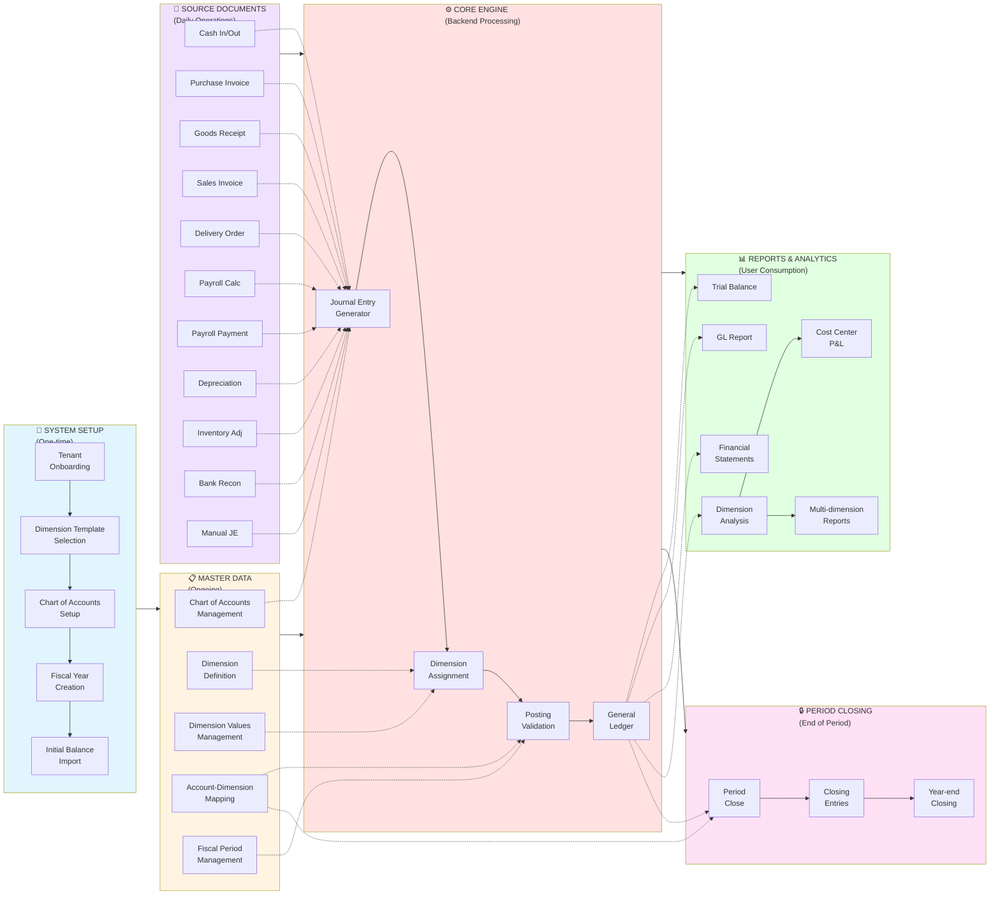
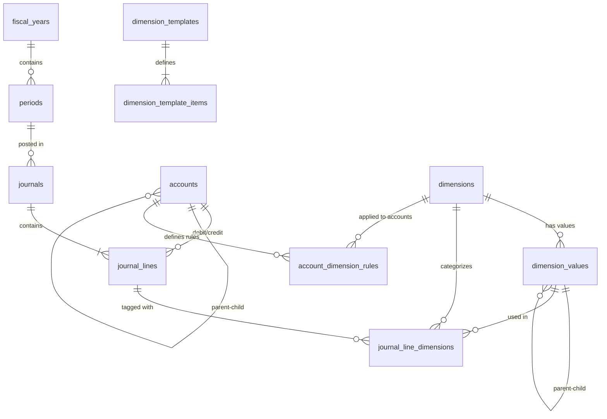

# Core Accounting - Database Design
## Pure Flexible Dimension Model with Account-Specific Rules

**Version:** 2.2
**Date:** 2025-10-31
**Approach:** Journal Line Mode - Pure Flexible Dimensions + Materialized Views + Account-Specific Dimension Rules
**Target:** Enterprise customers với độ trưởng thành cao về quản trị
**New in v2.2:** Dimension values hierarchy với posting control (SAP-inspired `allow_posting` flag)
**v2.1:** Account-dimension rules (whitelist approach) - inspired by Microsoft Dynamics 365

---

## 1. Overview

### 1.1 Architecture Decision
**Phương án:** PURE FLEXIBLE DIMENSION MODEL

- **ALL Dimensions:** Flexible qua bảng `journal_line_dimensions` (many-to-many)
- **NO Fixed Columns:** Journal lines không có cột dimension cố định
- **Performance:** Sử dụng Materialized Views cho reporting

### 1.2 Why Pure Flexible?

**Ưu điểm:**
- ✅ Unlimited dimensions (phù hợp doanh nghiệp trưởng thành)
- ✅ Mỗi tenant tự define dimensions theo nhu cầu
- ✅ Không cần schema migration khi thêm dimension mới
- ✅ Consistent architecture (1 pattern duy nhất)
- ✅ Performance tương đương fixed columns (với materialized views)

**Trade-offs chấp nhận được:**
- Cần setup materialized views
- Refresh strategy (5 phút delay acceptable cho accounting reports)

**Không chọn Fixed/Hybrid vì:**
- ❌ Giới hạn số lượng dimensions
- ❌ Mix patterns → code phức tạp
- ❌ Doanh nghiệp lớn có thể cần 8-10+ dimensions

---

## 2. Core Tables

### 2.1 Chart of Accounts

#### Table: `accounts`
Hệ thống tài khoản theo Circular 133/2016/TT-BTC và Thông tư 200/2014/TT-BTC

**📌 Data Source & Features:**
- **Initial Setup**: System tạo sẵn COA template theo Thông tư 200 khi onboard tenant mới
- **Feature**: **"Chart of Accounts Management"** (Module: Finance Setup)
  - Add/Edit/Deactivate accounts
  - Define account hierarchy (parent-child)
  - Set account properties (debit_normal, allow_posting, currency)
  - Import/Export COA
- **Access**: Finance Manager, Accountant (Admin role)

```sql
CREATE TABLE accounts (
    id                  UUID PRIMARY KEY DEFAULT gen_random_uuid(),
    tenant_id           UUID NOT NULL,
    account_code        VARCHAR(20) NOT NULL,
    account_name        VARCHAR(200) NOT NULL,
    parent_id           UUID REFERENCES accounts(id),
    account_type        VARCHAR(20) NOT NULL,
    is_debit_normal     BOOLEAN NOT NULL,
    currency_code       VARCHAR(3) NOT NULL DEFAULT 'VND',
    is_active           BOOLEAN NOT NULL DEFAULT TRUE,
    allow_posting       BOOLEAN NOT NULL DEFAULT TRUE,
    balance             DECIMAL(18,2) NOT NULL DEFAULT 0,
    created_at          TIMESTAMP NOT NULL DEFAULT NOW(),
    updated_at          TIMESTAMP NOT NULL DEFAULT NOW(),

    CONSTRAINT uq_tenant_account_code UNIQUE (tenant_id, account_code)
);

CREATE INDEX idx_accounts_tenant ON accounts(tenant_id);
CREATE INDEX idx_accounts_code ON accounts(account_code);
CREATE INDEX idx_accounts_parent ON accounts(parent_id);
CREATE INDEX idx_accounts_type ON accounts(account_type);
```

**Chart of Accounts mẫu:** Xem [Appendix A](#appendix-a-chart-of-accounts-vn-200) cho đầy đủ theo Thông tư 200.

---

### 2.2 Fiscal Periods

**📌 Data Source & Features:**
- **Feature**: **"Fiscal Year Setup"** (Module: Finance Setup)
  - Create new fiscal year (with auto-generate 12 periods)
  - Open/Close fiscal year
  - Define fiscal year calendar (Jan-Dec or custom)
- **Feature**: **"Period Management"**
  - Open/Close accounting periods
  - Period locking (prevent posting to closed periods)
  - Period status monitoring
- **Business Rule**: Chỉ 1 period OPEN tại một thời điểm
- **Access**: Finance Manager only

#### Table: `fiscal_years`
```sql
CREATE TABLE fiscal_years (
    id          UUID PRIMARY KEY DEFAULT gen_random_uuid(),
    tenant_id   UUID NOT NULL,
    year_code   VARCHAR(10) NOT NULL,
    year_number INTEGER NOT NULL,
    start_date  DATE NOT NULL,
    end_date    DATE NOT NULL,
    status      VARCHAR(20) NOT NULL,
    created_at  TIMESTAMP NOT NULL DEFAULT NOW(),

    CONSTRAINT uq_tenant_year_code UNIQUE (tenant_id, year_code)
);

CREATE INDEX idx_fiscal_years_tenant ON fiscal_years(tenant_id);
```

#### Table: `periods`
```sql
CREATE TABLE periods (
    id              UUID PRIMARY KEY DEFAULT gen_random_uuid(),
    tenant_id       UUID NOT NULL,
    fiscal_year_id  UUID NOT NULL REFERENCES fiscal_years(id),
    period_code     VARCHAR(20) NOT NULL,
    period_number   INTEGER NOT NULL,
    start_date      DATE NOT NULL,
    end_date        DATE NOT NULL,
    status          VARCHAR(20) NOT NULL,
    closed_at       TIMESTAMP,
    closed_by       UUID,
    created_at      TIMESTAMP NOT NULL DEFAULT NOW(),

    CONSTRAINT uq_tenant_period_code UNIQUE (tenant_id, period_code)
);

CREATE INDEX idx_periods_tenant ON periods(tenant_id);
CREATE INDEX idx_periods_fiscal_year ON periods(fiscal_year_id);
CREATE INDEX idx_periods_status ON periods(status);
```

---

### 2.3 Journal Entries (Core)

**📌 Data Source & Features:**

**A. Manual Journal Entry:**
- **Feature**: **"Manual Journal Entry"** (Module: General Ledger)
  - User tạo JE thủ công (DRAFT → POSTED)
  - Use case: Điều chỉnh cuối kỳ, phân bổ chi phí, ghi nhận khấu hao

**B. Auto-Generated Journal Entries** (từ các chứng từ):

| Source Document | Module | Journal Type | Description |
|----------------|--------|--------------|-------------|
| **Initial Balance** | System Setup | `INITIAL_BALANCE` | Khởi tạo số dư ban đầu (lần đầu setup hệ thống) |
| **Cash In** | Cash Management | `CASH_IN` | Thu tiền mặt/ngân hàng (bao gồm Receipt from customers) |
| **Cash Out** | Cash Management | `CASH_OUT` | Chi tiền mặt/ngân hàng (bao gồm Payment to suppliers) |
| **Purchase Invoice** | Purchase | `PURCHASE_INV` | Hóa đơn mua hàng (ghi nhận công nợ NCC) |
| **Goods Receipt (PO)** | Purchase | `GOODS_RECEIPT` | Nhập kho thực tế từ PO |
| **Sales Invoice** | Sales | `SALES_INV` | Hóa đơn bán hàng (ghi nhận công nợ KH) |
| **Delivery Order** | Sales | `DELIVERY` | Xuất kho giao hàng cho khách |
| **Inventory Adjustment** | Inventory | `INV_ADJ` | Điều chỉnh tồn kho (kiểm kê, hao hụt) |
| **Payroll Calculation** | Payroll | `PAYROLL` | Tính lương tháng |
| **Payroll Payment** | Payroll | `PAYROLL_PAY` | Trả lương thực tế |
| **Depreciation Run** | Fixed Assets | `DEPRECIATION` | Khấu hao tài sản hàng tháng |
| **Bank Reconciliation** | Cash Management | `BANK_RECON` | Đối soát ngân hàng |
| **...** | *Various* | - | *Còn nhiều loại khác tùy theo modules triển khai* |

**Note**: Danh sách trên là các loại phổ biến. Mỗi module khi triển khai có thể sinh thêm các journal types khác.

**C. Special Journal Entries:**
- **Feature**: **"Opening Balance"** → `OPENING` (journal_type)
- **Feature**: **"Closing Entries"** → `CLOSING` (end of fiscal year)
- **Feature**: **"Reversal Entry"** → Link qua `reversed_by` field

**Access**: Accountant, Finance Staff

#### Table: `journals`
Journal Entry Header

```sql
CREATE TABLE journals (
    id              UUID PRIMARY KEY DEFAULT gen_random_uuid(),
    tenant_id       UUID NOT NULL,
    journal_number  VARCHAR(30) NOT NULL,
    entry_date      DATE NOT NULL,
    posting_date    DATE,
    period_id       UUID NOT NULL REFERENCES periods(id),
    source_type     VARCHAR(30),
    source_id       UUID,
    description     TEXT NOT NULL,
    total_debit     DECIMAL(18,2) NOT NULL DEFAULT 0,
    total_credit    DECIMAL(18,2) NOT NULL DEFAULT 0,
    status          VARCHAR(20) NOT NULL,
    created_by      UUID NOT NULL,
    created_at      TIMESTAMP NOT NULL DEFAULT NOW(),
    posted_by       UUID,
    posted_at       TIMESTAMP,
    reversed_by     UUID REFERENCES journals(id),

    CONSTRAINT uq_tenant_journal_number UNIQUE (tenant_id, journal_number),
    CONSTRAINT chk_balanced CHECK (total_debit = total_credit),
    CONSTRAINT chk_status CHECK (status IN ('DRAFT', 'POSTED', 'REVERSED'))
);

CREATE INDEX idx_journals_tenant ON journals(tenant_id);
CREATE INDEX idx_journals_period ON journals(period_id);
CREATE INDEX idx_journals_entry_date ON journals(entry_date);
CREATE INDEX idx_journals_status ON journals(status);
CREATE INDEX idx_journals_source ON journals(source_type, source_id);
```

---

#### Table: `journal_lines`
Journal Entry Lines - **PURE FLEXIBLE (NO dimension columns)**

```sql
CREATE TABLE journal_lines (
    id              UUID PRIMARY KEY DEFAULT gen_random_uuid(),
    tenant_id       UUID NOT NULL,
    journal_id      UUID NOT NULL REFERENCES journals(id) ON DELETE CASCADE,
    line_number     INTEGER NOT NULL,
    account_id      UUID NOT NULL REFERENCES accounts(id),

    -- Amount
    debit_amount    DECIMAL(18,2),
    credit_amount   DECIMAL(18,2),

    -- Description
    description     TEXT,
    reference       VARCHAR(100),

    -- NO DIMENSION COLUMNS HERE!
    -- All dimensions go through journal_line_dimensions table

    -- Multi-currency support
    currency_code   VARCHAR(3) NOT NULL DEFAULT 'VND',
    exchange_rate   DECIMAL(12,6) NOT NULL DEFAULT 1.000000,
    fc_debit        DECIMAL(18,2),
    fc_credit       DECIMAL(18,2),

    created_at      TIMESTAMP NOT NULL DEFAULT NOW(),

    CONSTRAINT chk_debit_or_credit CHECK (
        (debit_amount IS NOT NULL AND credit_amount IS NULL AND debit_amount > 0) OR
        (credit_amount IS NOT NULL AND debit_amount IS NULL AND credit_amount > 0)
    ),
    CONSTRAINT uq_journal_line_number UNIQUE (journal_id, line_number)
);

CREATE INDEX idx_journal_lines_tenant ON journal_lines(tenant_id);
CREATE INDEX idx_journal_lines_journal ON journal_lines(journal_id);
CREATE INDEX idx_journal_lines_account ON journal_lines(account_id);
```

---

### 2.4 Flexible Dimensions (Core)

**📌 Data Source & Features:**

**A. System Setup (Initial):**
- **Feature**: **"Dimension Template Selection"** (Module: System Setup - Onboarding)
  - Khi onboard tenant mới → chọn template (Manufacturing/Consulting/Retail/Enterprise)
  - System auto-create dimensions theo template
  - Xem section 5 cho chi tiết templates

**B. Dimension Management:**
- **Feature**: **"Dimension Definition"** (Module: Finance Setup)
  - Add/Edit/Deactivate dimensions
  - Define display order
  - Example: Add "CAMPAIGN" dimension cho marketing tracking
- **Access**: Finance Manager, System Admin

**C. Dimension Values Management:**
- **Feature**: **"Dimension Values Master Data"** (Module: Finance Setup)
  - Manage values cho từng dimension
  - Support hierarchy (parent-child) for dimension values
  - Example: Cost Center "SALES" → Sub-centers: "SALES_NORTH", "SALES_SOUTH"
- **Access**: Finance Manager, Finance Staff

**D. Usage:**
- Dimensions được assign vào journal lines qua form **"Manual Journal Entry"** hoặc tự động từ source documents
- **Account-specific rules**: Mỗi account có thể define riêng dimensions nào được phép/bắt buộc (xem section 2.5)

#### Table: `dimensions`
Master data cho dimensions - mỗi tenant tự define

```sql
CREATE TABLE dimensions (
    id              UUID PRIMARY KEY DEFAULT gen_random_uuid(),
    tenant_id       UUID NOT NULL,
    dimension_code  VARCHAR(20) NOT NULL,
    dimension_name  VARCHAR(100) NOT NULL,
    display_order   INTEGER NOT NULL DEFAULT 0,
    is_active       BOOLEAN NOT NULL DEFAULT TRUE,
    created_at      TIMESTAMP NOT NULL DEFAULT NOW(),

    CONSTRAINT uq_tenant_dimension UNIQUE (tenant_id, dimension_code)
);

CREATE INDEX idx_dimensions_tenant ON dimensions(tenant_id);
CREATE INDEX idx_dimensions_code ON dimensions(dimension_code);
```

**Note:** Không có global `is_required` field. Required/optional status được define theo từng account trong bảng `account_dimension_rules` (section 2.5).

**Sample data:**
```sql
-- Tenant A (Manufacturing company - Vinamilk style)
INSERT INTO dimensions (tenant_id, dimension_code, dimension_name, display_order) VALUES
('tenant-a', 'COST_CENTER', 'Cost Center', 1),
('tenant-a', 'PRODUCT_LINE', 'Product Line', 2),
('tenant-a', 'FACTORY', 'Factory Location', 3),
('tenant-a', 'SALES_CHANNEL', 'Sales Channel', 4),
('tenant-a', 'CUSTOMER_SEGMENT', 'Customer Segment', 5),
('tenant-a', 'REGION', 'Region', 6),
('tenant-a', 'BRAND', 'Brand', 7),
('tenant-a', 'CAMPAIGN', 'Marketing Campaign', 8);

-- Tenant B (Consulting company)
INSERT INTO dimensions (tenant_id, dimension_code, dimension_name, display_order) VALUES
('tenant-b', 'PROJECT', 'Project', 1),
('tenant-b', 'DEPARTMENT', 'Department', 2),
('tenant-b', 'CLIENT', 'Client', 3),
('tenant-b', 'SERVICE_LINE', 'Service Line', 4);

-- Tenant C (Retail chain)
INSERT INTO dimensions (tenant_id, dimension_code, dimension_name, display_order) VALUES
('tenant-c', 'STORE', 'Store Location', 1),
('tenant-c', 'DEPARTMENT', 'Department', 2),
('tenant-c', 'PRODUCT_CATEGORY', 'Product Category', 3);
```

**Note:** Required/optional status của từng dimension sẽ được define trong `account_dimension_rules` theo từng account (section 2.5).

---

#### Table: `dimension_values`
Values cho từng dimension - **Support hierarchy với posting control**

```sql
CREATE TABLE dimension_values (
    id              UUID PRIMARY KEY DEFAULT gen_random_uuid(),
    tenant_id       UUID NOT NULL,
    dimension_id    UUID NOT NULL REFERENCES dimensions(id) ON DELETE CASCADE,
    value_code      VARCHAR(30) NOT NULL,
    value_name      VARCHAR(200) NOT NULL,
    parent_value_id UUID REFERENCES dimension_values(id) ON DELETE CASCADE,
    display_order   INTEGER NOT NULL DEFAULT 0,
    is_active       BOOLEAN NOT NULL DEFAULT TRUE,

    -- Posting Control (SAP-inspired)
    allow_posting   BOOLEAN NOT NULL DEFAULT TRUE,
    -- TRUE: Value có thể sử dụng trong journal entries
    -- FALSE: Chỉ dùng làm parent (grouping), không được post
    -- Default: TRUE cho leaf nodes, FALSE cho parent nodes (can be overridden)

    created_at      TIMESTAMP NOT NULL DEFAULT NOW(),
    created_by      UUID,

    CONSTRAINT uq_dimension_value UNIQUE (dimension_id, value_code)
);

CREATE INDEX idx_dimension_values_dimension ON dimension_values(dimension_id);
CREATE INDEX idx_dimension_values_parent ON dimension_values(parent_value_id);
CREATE INDEX idx_dimension_values_tenant ON dimension_values(tenant_id);
CREATE INDEX idx_dimension_values_postable ON dimension_values(dimension_id, is_active, allow_posting);
```

**Business Rule - Posting Control:**
- **Leaf nodes** (không có children): `allow_posting = TRUE` (always)
- **Parent nodes** (có children): `allow_posting = FALSE` (default)
  - Finance Manager có thể override thành `TRUE` nếu cần (e.g., migration data, aggregate transactions)
- **Use case**: Force users nhập đúng level chi tiết, tránh mix data ở nhiều levels

**Sample data with hierarchy:**
```sql
-- Tenant A: Cost Center values với 4-level hierarchy
DO $$
DECLARE
    v_dim_id UUID;
    v_company_id UUID;
    v_commercial_id UUID;
    v_sales_id UUID;
BEGIN
    -- Get dimension ID
    SELECT id INTO v_dim_id FROM dimensions
    WHERE tenant_id = 'tenant-a' AND dimension_code = 'COST_CENTER';

    -- Level 0: Company (parent - not postable)
    INSERT INTO dimension_values (tenant_id, dimension_id, value_code, value_name, parent_value_id, display_order, allow_posting)
    VALUES ('tenant-a', v_dim_id, 'CC_COMPANY', 'Company', NULL, 1, FALSE)
    RETURNING id INTO v_company_id;

    -- Level 1: Commercial Division (parent - not postable)
    INSERT INTO dimension_values (tenant_id, dimension_id, value_code, value_name, parent_value_id, display_order, allow_posting)
    VALUES ('tenant-a', v_dim_id, 'CC_COMMERCIAL', 'Commercial Division', v_company_id, 1, FALSE)
    RETURNING id INTO v_commercial_id;

    -- Level 2: Sales Department (parent - postable for special cases)
    INSERT INTO dimension_values (tenant_id, dimension_id, value_code, value_name, parent_value_id, display_order, allow_posting)
    VALUES ('tenant-a', v_dim_id, 'CC_SALES', 'Sales Department', v_commercial_id, 1, TRUE)  -- ⚠️ Enabled by Finance Manager
    RETURNING id INTO v_sales_id;

    -- Level 3: Regions (leaf - always postable)
    INSERT INTO dimension_values (tenant_id, dimension_id, value_code, value_name, parent_value_id, display_order, allow_posting)
    VALUES
        ('tenant-a', v_dim_id, 'CC_NORTH', 'North Region', v_sales_id, 1, TRUE),  -- ✅ Leaf
        ('tenant-a', v_dim_id, 'CC_SOUTH', 'South Region', v_sales_id, 2, TRUE);  -- ✅ Leaf

    -- Level 2: Marketing Department (leaf - always postable)
    INSERT INTO dimension_values (tenant_id, dimension_id, value_code, value_name, parent_value_id, display_order, allow_posting)
    VALUES ('tenant-a', v_dim_id, 'CC_MARKETING', 'Marketing Department', v_commercial_id, 2, TRUE);  -- ✅ Leaf
END $$;

-- Tenant A: Product Line values (flat structure - all postable)
INSERT INTO dimension_values (tenant_id, dimension_id, value_code, value_name, parent_value_id, display_order, allow_posting)
SELECT
    'tenant-a',
    id,
    value_code,
    value_name,
    NULL,  -- No parent
    display_order,
    TRUE   -- All flat values postable
FROM (VALUES
    ('FRESH_MILK', 'Fresh Milk', 1),
    ('YOGURT', 'Yogurt', 2),
    ('POWDER_MILK', 'Powder Milk', 3)
) AS t(value_code, value_name, display_order)
CROSS JOIN dimensions
WHERE tenant_id = 'tenant-a' AND dimension_code = 'PRODUCT_LINE';
```

---

#### Table: `journal_line_dimensions`
Many-to-many: Journal Lines ↔ Dimensions

```sql
CREATE TABLE journal_line_dimensions (
    id                  UUID PRIMARY KEY DEFAULT gen_random_uuid(),
    journal_line_id     UUID NOT NULL REFERENCES journal_lines(id) ON DELETE CASCADE,
    dimension_id        UUID NOT NULL REFERENCES dimensions(id),
    dimension_value_id  UUID NOT NULL REFERENCES dimension_values(id),
    created_at          TIMESTAMP NOT NULL DEFAULT NOW(),

    CONSTRAINT uq_line_dimension UNIQUE (journal_line_id, dimension_id)
);

CREATE INDEX idx_jl_dimensions_line ON journal_line_dimensions(journal_line_id);
CREATE INDEX idx_jl_dimensions_dimension ON journal_line_dimensions(dimension_id);
CREATE INDEX idx_jl_dimensions_value ON journal_line_dimensions(dimension_value_id);

-- Partial indexes for hot dimensions
CREATE INDEX idx_jl_dim_cost_center
ON journal_line_dimensions(journal_line_id, dimension_value_id)
WHERE dimension_id IN (SELECT id FROM dimensions WHERE dimension_code = 'COST_CENTER');

CREATE INDEX idx_jl_dim_product
ON journal_line_dimensions(journal_line_id, dimension_value_id)
WHERE dimension_id IN (SELECT id FROM dimensions WHERE dimension_code = 'PRODUCT_LINE');

CREATE INDEX idx_jl_dim_project
ON journal_line_dimensions(journal_line_id, dimension_value_id)
WHERE dimension_id IN (SELECT id FROM dimensions WHERE dimension_code = 'PROJECT');
```

---

### 2.5 Account-Dimension Rules (Whitelist Approach)

**📌 Architectural Decision:**

**Approach:** Account-specific dimension rules với Whitelist Mechanism

Inspired by **Microsoft Dynamics 365 "Account Structure"** feature - mỗi account có thể specify dimensions nào được phép (required/optional/not-allowed).

**Why this approach?**
- ✅ **Flexibility**: Expense account "641 - Marketing" requires COST_CENTER + PRODUCT_LINE, nhưng "112 - Bank Account" không cần dimensions
- ✅ **Data Quality**: Enforce correct dimensions ngay tại data entry point
- ✅ **Better than competitors**: Combines best practices từ 4 major ERPs (Dynamics 365, Oracle, SAP, NetSuite)

**📌 Data Source & Features:**

**Feature**: **"Account-Dimension Mapping"** (Module: Finance Setup)
- Define dimensions cho từng account (whitelist)
- Set required/optional status per account-dimension pair
- Configure display order của dimensions trong entry form
- **Business Rule**: Nếu account không có rule cho dimension X → dimension X **không được phép** sử dụng cho account đó
- **Access**: Finance Manager, System Admin

**UI Example:**
```
Account: 641 - Marketing Expense
─────────────────────────────────────────────────────
Dimension           Status      Display Order
─────────────────────────────────────────────────────
✅ Cost Center      Required    1
✅ Product Line     Required    2
✅ Campaign         Optional    3
✅ Region           Optional    4
─────────────────────────────────────────────────────

Account: 112 - Bank Account
─────────────────────────────────────────────────────
Dimension           Status      Display Order
─────────────────────────────────────────────────────
(No dimensions required)
─────────────────────────────────────────────────────
```

#### Table: `account_dimension_rules`

**Whitelist Approach:**
- Có record → Dimension được phép (required hoặc optional)
- **Không có record** → Dimension **KHÔNG được phép**

```sql
CREATE TABLE account_dimension_rules (
    id                  UUID PRIMARY KEY DEFAULT gen_random_uuid(),
    tenant_id           UUID NOT NULL,
    account_id          UUID NOT NULL REFERENCES accounts(id) ON DELETE CASCADE,
    dimension_id        UUID NOT NULL REFERENCES dimensions(id) ON DELETE CASCADE,

    -- Whitelist approach
    is_required         BOOLEAN NOT NULL DEFAULT FALSE,
    -- TRUE = bắt buộc nhập
    -- FALSE = optional (được phép nhưng không bắt buộc)
    -- NO RECORD = NOT ALLOWED (dimension không xuất hiện trong form)

    display_order       INTEGER,
    created_at          TIMESTAMP NOT NULL DEFAULT NOW(),
    created_by          UUID,

    CONSTRAINT uq_account_dimension UNIQUE (account_id, dimension_id)
);

CREATE INDEX idx_account_dim_rules_account ON account_dimension_rules(account_id);
CREATE INDEX idx_account_dim_rules_dimension ON account_dimension_rules(dimension_id);
CREATE INDEX idx_account_dim_rules_tenant ON account_dimension_rules(tenant_id);
```

**Sample data:**
```sql
-- Account 641 (Marketing Expense) - requires Cost Center + Product Line
INSERT INTO account_dimension_rules (tenant_id, account_id, dimension_id, is_required, display_order)
SELECT
    'tenant-vinamilk',
    (SELECT id FROM accounts WHERE account_code = '641' AND tenant_id = 'tenant-vinamilk'),
    d.id,
    CASE d.dimension_code
        WHEN 'COST_CENTER' THEN TRUE
        WHEN 'PRODUCT_LINE' THEN TRUE
        WHEN 'CAMPAIGN' THEN FALSE
        WHEN 'REGION' THEN FALSE
    END AS is_required,
    CASE d.dimension_code
        WHEN 'COST_CENTER' THEN 1
        WHEN 'PRODUCT_LINE' THEN 2
        WHEN 'CAMPAIGN' THEN 3
        WHEN 'REGION' THEN 4
    END AS display_order
FROM dimensions d
WHERE d.tenant_id = 'tenant-vinamilk'
  AND d.dimension_code IN ('COST_CENTER', 'PRODUCT_LINE', 'CAMPAIGN', 'REGION');

-- Account 632 (Cost of Goods Sold) - requires Product Line + Factory
INSERT INTO account_dimension_rules (tenant_id, account_id, dimension_id, is_required, display_order)
SELECT
    'tenant-vinamilk',
    (SELECT id FROM accounts WHERE account_code = '632' AND tenant_id = 'tenant-vinamilk'),
    d.id,
    CASE d.dimension_code
        WHEN 'PRODUCT_LINE' THEN TRUE
        WHEN 'FACTORY' THEN TRUE
        WHEN 'COST_CENTER' THEN FALSE
    END AS is_required,
    CASE d.dimension_code
        WHEN 'PRODUCT_LINE' THEN 1
        WHEN 'FACTORY' THEN 2
        WHEN 'COST_CENTER' THEN 3
    END AS display_order
FROM dimensions d
WHERE d.tenant_id = 'tenant-vinamilk'
  AND d.dimension_code IN ('PRODUCT_LINE', 'FACTORY', 'COST_CENTER');

-- Account 112 (Bank Account) - NO dimensions (no records = not allowed)
-- (Không insert gì cả)
```

**How it works:**
1. **Account 641 (Marketing)**: Có 4 records → 4 dimensions allowed (2 required, 2 optional)
2. **Account 632 (COGS)**: Có 3 records → 3 dimensions allowed (2 required, 1 optional)
3. **Account 112 (Bank)**: Không có records → **KHÔNG dimension nào được phép**

---

**📊 Comparison with Major ERPs:**

| Feature | Dynamics 365 | Oracle | SAP | NetSuite | **Bflow** |
|---------|--------------|--------|-----|----------|-----------|
| **Account-Specific Rules** | ✅ Yes (Account Structure) | ⚠️ Segment-level only | ❌ No (Distribution Rules apply to all) | ❌ Record-type only | ✅ **Yes** |
| **Max Dimensions** | 10 financial dimensions | Flexible (30 segments) | 5 dimensions | Unlimited custom segments | **Unlimited** |
| **Required/Optional per Account** | ✅ Yes | ⚠️ Limited | ❌ Only revenue/expense | ⚠️ Global only | ✅ **Yes** |
| **Whitelist Mechanism** | ✅ Yes | ⚠️ Partial | ❌ No | ❌ No | ✅ **Yes** |
| **Multi-tenant SaaS** | ❌ No | ❌ No | ❌ No | ✅ Yes | ✅ **Yes** |
| **Performance** | Good | Good | Good | Good | **Excellent (MV)** |

**Bflow's Advantage:**
- Combines **best features** từ tất cả ERPs
- Account-specific rules (như Dynamics 365) + Unlimited dimensions (như NetSuite) + Multi-tenant (chuẩn SaaS)
- Đơn giản hơn Dynamics 365 (không cần Account Structure configuration complexity)

---

## 3. System Architecture & Features

### 3.1 Feature Map - Accounting System



**Legend:**
- 🔧 **Setup**: Chạy 1 lần khi onboard tenant mới
- 📋 **Master Data**: Maintain định kỳ (ít thay đổi)
- 📝 **Source Documents**: Operations hàng ngày (volume cao)
- ⚙️ **Core Engine**: Automated processing (backend)
- 📊 **Reports**: User consumption (read-heavy)
- 🔒 **Closing**: End of period activities

---

### 3.2 Data Model ERD



---

## 4. Performance Optimization: Materialized Views

### 4.1 Main Analysis View

```sql
CREATE MATERIALIZED VIEW mv_journal_analysis AS
SELECT
    jl.id AS journal_line_id,
    jl.tenant_id,
    jl.journal_id,
    jl.account_id,
    a.account_code,
    a.account_name,
    a.account_type,
    jl.debit_amount,
    jl.credit_amount,
    j.entry_date,
    j.posting_date,
    j.status AS journal_status,
    p.period_code,
    p.period_number,
    fy.year_code,
    fy.year_number,

    -- Pivot common dimensions into columns for fast queries
    MAX(CASE WHEN d.dimension_code = 'COST_CENTER' THEN dv.value_code END) AS cost_center_code,
    MAX(CASE WHEN d.dimension_code = 'COST_CENTER' THEN dv.value_name END) AS cost_center_name,

    MAX(CASE WHEN d.dimension_code = 'PROJECT' THEN dv.value_code END) AS project_code,
    MAX(CASE WHEN d.dimension_code = 'PROJECT' THEN dv.value_name END) AS project_name,

    MAX(CASE WHEN d.dimension_code = 'PRODUCT_LINE' THEN dv.value_code END) AS product_code,
    MAX(CASE WHEN d.dimension_code = 'PRODUCT_LINE' THEN dv.value_name END) AS product_name,

    MAX(CASE WHEN d.dimension_code = 'DEPARTMENT' THEN dv.value_code END) AS department_code,
    MAX(CASE WHEN d.dimension_code = 'DEPARTMENT' THEN dv.value_name END) AS department_name,

    MAX(CASE WHEN d.dimension_code = 'FACTORY' THEN dv.value_code END) AS factory_code,
    MAX(CASE WHEN d.dimension_code = 'FACTORY' THEN dv.value_name END) AS factory_name,

    MAX(CASE WHEN d.dimension_code = 'REGION' THEN dv.value_code END) AS region_code,
    MAX(CASE WHEN d.dimension_code = 'REGION' THEN dv.value_name END) AS region_name,

    MAX(CASE WHEN d.dimension_code = 'STORE' THEN dv.value_code END) AS store_code,
    MAX(CASE WHEN d.dimension_code = 'STORE' THEN dv.value_name END) AS store_name,

    MAX(CASE WHEN d.dimension_code = 'CLIENT' THEN dv.value_code END) AS client_code,
    MAX(CASE WHEN d.dimension_code = 'CLIENT' THEN dv.value_name END) AS client_name,

    MAX(CASE WHEN d.dimension_code = 'SALES_CHANNEL' THEN dv.value_code END) AS sales_channel_code,
    MAX(CASE WHEN d.dimension_code = 'SALES_CHANNEL' THEN dv.value_name END) AS sales_channel_name,

    MAX(CASE WHEN d.dimension_code = 'CUSTOMER_SEGMENT' THEN dv.value_code END) AS customer_segment_code,
    MAX(CASE WHEN d.dimension_code = 'CUSTOMER_SEGMENT' THEN dv.value_name END) AS customer_segment_name,

    MAX(CASE WHEN d.dimension_code = 'BRAND' THEN dv.value_code END) AS brand_code,
    MAX(CASE WHEN d.dimension_code = 'BRAND' THEN dv.value_name END) AS brand_name,

    MAX(CASE WHEN d.dimension_code = 'CAMPAIGN' THEN dv.value_code END) AS campaign_code,
    MAX(CASE WHEN d.dimension_code = 'CAMPAIGN' THEN dv.value_name END) AS campaign_name

FROM journal_lines jl
JOIN journals j ON jl.journal_id = j.id
JOIN accounts a ON jl.account_id = a.id
JOIN periods p ON j.period_id = p.id
JOIN fiscal_years fy ON p.fiscal_year_id = fy.id
LEFT JOIN journal_line_dimensions jld ON jl.id = jld.journal_line_id
LEFT JOIN dimensions d ON jld.dimension_id = d.id
LEFT JOIN dimension_values dv ON jld.dimension_value_id = dv.id
WHERE j.status = 'POSTED'
GROUP BY
    jl.id, jl.tenant_id, jl.journal_id, jl.account_id,
    a.account_code, a.account_name, a.account_type,
    jl.debit_amount, jl.credit_amount,
    j.entry_date, j.posting_date, j.status,
    p.period_code, p.period_number,
    fy.year_code, fy.year_number;

-- Indexes on materialized view
CREATE INDEX idx_mv_journal_tenant ON mv_journal_analysis(tenant_id);
CREATE INDEX idx_mv_journal_date ON mv_journal_analysis(posting_date);
CREATE INDEX idx_mv_journal_period ON mv_journal_analysis(period_code);
CREATE INDEX idx_mv_journal_account_type ON mv_journal_analysis(account_type);
CREATE INDEX idx_mv_journal_cost_center ON mv_journal_analysis(cost_center_code) WHERE cost_center_code IS NOT NULL;
CREATE INDEX idx_mv_journal_product ON mv_journal_analysis(product_code) WHERE product_code IS NOT NULL;
CREATE INDEX idx_mv_journal_project ON mv_journal_analysis(project_code) WHERE project_code IS NOT NULL;
CREATE INDEX idx_mv_journal_department ON mv_journal_analysis(department_code) WHERE department_code IS NOT NULL;
CREATE INDEX idx_mv_journal_store ON mv_journal_analysis(store_code) WHERE store_code IS NOT NULL;
```

### 4.2 Refresh Strategy

```sql
-- Option 1: Scheduled refresh (every 5 minutes)
-- Via cron job or pg_cron extension
SELECT cron.schedule('refresh-mv-journal', '*/5 * * * *',
    $$REFRESH MATERIALIZED VIEW CONCURRENTLY mv_journal_analysis$$);

-- Option 2: Event-triggered refresh (when journal posted)
CREATE OR REPLACE FUNCTION trigger_refresh_mv_journal()
RETURNS TRIGGER AS $$
BEGIN
    IF NEW.status = 'POSTED' AND (OLD.status IS NULL OR OLD.status != 'POSTED') THEN
        -- Refresh in background (non-blocking)
        PERFORM pg_notify('refresh_mv_journal', NEW.id::text);
    END IF;
    RETURN NEW;
END;
$$ LANGUAGE plpgsql;

CREATE TRIGGER trg_refresh_mv_journal
AFTER UPDATE ON journals
FOR EACH ROW
WHEN (NEW.status = 'POSTED')
EXECUTE FUNCTION trigger_refresh_mv_journal();

-- Option 3: Manual refresh (for admin)
REFRESH MATERIALIZED VIEW CONCURRENTLY mv_journal_analysis;
```

---

## 5. Dimension Templates

**📌 Purpose & Features:**

**A. System-defined Templates:**
- **Data Source**: System pre-defined (4 templates: Manufacturing, Consulting, Retail, Enterprise)
- **Feature**: **"Dimension Template Library"** (Module: System Setup)
  - System admin maintain template definitions
  - Add new industry templates
  - Update existing templates

**B. Apply Template:**
- **Feature**: **"Tenant Onboarding Wizard"** (Module: System Setup)
  - Step 1: Tenant basic info
  - Step 2: **Select dimension template** → System tự động tạo dimensions cho tenant
  - Step 3: Customize dimension values
- **Timing**: Chỉ chạy 1 lần khi onboard tenant mới
- **Access**: System Admin

**C. Template Customization:**
- Sau khi apply template, tenant có thể:
  - Add thêm dimensions (qua "Dimension Definition")
  - Edit dimension names
  - Add/Remove dimension values
- Templates chỉ là starting point, không lock tenant

### 5.1 Template Tables

```sql
CREATE TABLE dimension_templates (
    id              UUID PRIMARY KEY DEFAULT gen_random_uuid(),
    template_code   VARCHAR(50) UNIQUE NOT NULL,
    template_name   VARCHAR(100) NOT NULL,
    description     TEXT,
    industry        VARCHAR(50),
    is_active       BOOLEAN NOT NULL DEFAULT TRUE,
    created_at      TIMESTAMP NOT NULL DEFAULT NOW()
);

CREATE TABLE dimension_template_items (
    id                  UUID PRIMARY KEY DEFAULT gen_random_uuid(),
    template_id         UUID NOT NULL REFERENCES dimension_templates(id) ON DELETE CASCADE,
    dimension_code      VARCHAR(20) NOT NULL,
    dimension_name      VARCHAR(100) NOT NULL,
    display_order       INTEGER NOT NULL,
    created_at          TIMESTAMP NOT NULL DEFAULT NOW()
);

CREATE INDEX idx_template_items_template ON dimension_template_items(template_id);
```

**Note:** Template chỉ define dimensions nào có sẵn cho tenant. Required/optional status được config sau trong `account_dimension_rules` (section 2.5).

### 5.2 Sample Templates

```sql
-- Template 1: Manufacturing (Công ty sản xuất)
INSERT INTO dimension_templates (template_code, template_name, description, industry) VALUES
('MANUFACTURING', 'Công ty sản xuất', 'Cost Center + Product Line + Factory + nhiều dimensions khác', 'MANUFACTURING');

INSERT INTO dimension_template_items (template_id, dimension_code, dimension_name, display_order)
SELECT
    (SELECT id FROM dimension_templates WHERE template_code = 'MANUFACTURING'),
    dimension_code, dimension_name, display_order
FROM (VALUES
    ('COST_CENTER', 'Cost Center', 1),
    ('PRODUCT_LINE', 'Dòng sản phẩm', 2),
    ('FACTORY', 'Nhà máy', 3),
    ('SALES_CHANNEL', 'Kênh bán hàng', 4),
    ('CUSTOMER_SEGMENT', 'Phân khúc khách hàng', 5),
    ('REGION', 'Khu vực', 6),
    ('BRAND', 'Thương hiệu', 7),
    ('CAMPAIGN', 'Chiến dịch', 8)
) AS t(dimension_code, dimension_name, display_order);

-- Template 2: Consulting (Công ty tư vấn)
INSERT INTO dimension_templates (template_code, template_name, description, industry) VALUES
('CONSULTING', 'Công ty tư vấn/dịch vụ', 'Project + Department + Client', 'SERVICE');

INSERT INTO dimension_template_items (template_id, dimension_code, dimension_name, display_order)
SELECT
    (SELECT id FROM dimension_templates WHERE template_code = 'CONSULTING'),
    dimension_code, dimension_name, display_order
FROM (VALUES
    ('PROJECT', 'Dự án', 1),
    ('DEPARTMENT', 'Phòng ban', 2),
    ('CLIENT', 'Khách hàng', 3),
    ('SERVICE_LINE', 'Dòng dịch vụ', 4)
) AS t(dimension_code, dimension_name, display_order);

-- Template 3: Retail (Chuỗi bán lẻ)
INSERT INTO dimension_templates (template_code, template_name, description, industry) VALUES
('RETAIL', 'Chuỗi bán lẻ', 'Store + Department + Product Category', 'RETAIL');

INSERT INTO dimension_template_items (template_id, dimension_code, dimension_name, display_order)
SELECT
    (SELECT id FROM dimension_templates WHERE template_code = 'RETAIL'),
    dimension_code, dimension_name, display_order
FROM (VALUES
    ('STORE', 'Cửa hàng', 1),
    ('DEPARTMENT', 'Nhóm hàng', 2),
    ('PRODUCT_CATEGORY', 'Danh mục sản phẩm', 3),
    ('SALES_CHANNEL', 'Kênh bán', 4)
) AS t(dimension_code, dimension_name, display_order);

-- Template 4: Enterprise (Tập đoàn - nhiều dimensions nhất)
INSERT INTO dimension_templates (template_code, template_name, description, industry) VALUES
('ENTERPRISE', 'Tập đoàn đa ngành', 'Full dimensions cho doanh nghiệp lớn', 'ENTERPRISE');

INSERT INTO dimension_template_items (template_id, dimension_code, dimension_name, display_order)
SELECT
    (SELECT id FROM dimension_templates WHERE template_code = 'ENTERPRISE'),
    dimension_code, dimension_name, display_order
FROM (VALUES
    ('COST_CENTER', 'Cost Center', 1),
    ('DEPARTMENT', 'Phòng ban', 2),
    ('PROJECT', 'Dự án', 3),
    ('PRODUCT_LINE', 'Dòng sản phẩm', 4),
    ('REGION', 'Khu vực', 5),
    ('FACTORY', 'Nhà máy/Chi nhánh', 6),
    ('CUSTOMER_SEGMENT', 'Phân khúc KH', 7),
    ('SALES_CHANNEL', 'Kênh bán hàng', 8),
    ('BRAND', 'Thương hiệu', 9),
    ('CAMPAIGN', 'Chiến dịch', 10)
) AS t(dimension_code, dimension_name, display_order);
```

### 5.3 Apply Template Function

```sql
CREATE OR REPLACE FUNCTION apply_dimension_template(
    p_tenant_id UUID,
    p_template_code VARCHAR(50)
)
RETURNS VOID AS $$
DECLARE
    v_template_id UUID;
    v_item RECORD;
BEGIN
    -- Get template
    SELECT id INTO v_template_id
    FROM dimension_templates
    WHERE template_code = p_template_code AND is_active = TRUE;

    IF v_template_id IS NULL THEN
        RAISE EXCEPTION 'Template not found: %', p_template_code;
    END IF;

    -- Copy dimensions from template to tenant
    FOR v_item IN
        SELECT * FROM dimension_template_items
        WHERE template_id = v_template_id
        ORDER BY display_order
    LOOP
        INSERT INTO dimensions (
            tenant_id,
            dimension_code,
            dimension_name,
            display_order,
            is_active
        ) VALUES (
            p_tenant_id,
            v_item.dimension_code,
            v_item.dimension_name,
            v_item.display_order,
            TRUE
        );
    END LOOP;

    RAISE NOTICE 'Applied template % to tenant %', p_template_code, p_tenant_id;
END;
$$ LANGUAGE plpgsql;

-- Note: After applying template, use "Account-Dimension Mapping" screen to configure
-- which dimensions are required/optional for each account.

-- Usage example:
SELECT apply_dimension_template('tenant-vinamilk', 'MANUFACTURING');
SELECT apply_dimension_template('tenant-fpt', 'CONSULTING');
```

---

## 6. Usage Examples

### 6.1 Insert Journal Entry với Multiple Dimensions

**Scenario:** Vinamilk - Chi phí marketing 100M cho Fresh Milk tại Factory HCM, kênh online

```sql
-- Step 1: Insert journal header
INSERT INTO journals (tenant_id, journal_number, entry_date, period_id, description, total_debit, total_credit, status, created_by)
VALUES ('tenant-vinamilk', 'JE-2025-00001', '2025-01-15', 'period-2025-01',
        'Chi phí marketing Fresh Milk', 100000000, 100000000, 'DRAFT', 'user-1')
RETURNING id INTO @journal_id;

-- Step 2: Insert debit line
INSERT INTO journal_lines (tenant_id, journal_id, line_number, account_id, debit_amount)
VALUES ('tenant-vinamilk', @journal_id, 1, 'acc-641', 100000000)
RETURNING id INTO @line_id;

-- Step 3: Add dimensions to line
INSERT INTO journal_line_dimensions (journal_line_id, dimension_id, dimension_value_id) VALUES
(@line_id, 'dim-cost-center', 'val-marketing'),      -- Cost Center
(@line_id, 'dim-product-line', 'val-fresh-milk'),    -- Product Line
(@line_id, 'dim-factory', 'val-factory-hcm'),        -- Factory
(@line_id, 'dim-sales-channel', 'val-online'),       -- Sales Channel
(@line_id, 'dim-region', 'val-south'),               -- Region
(@line_id, 'dim-campaign', 'val-tet-2025');          -- Campaign

-- Step 4: Insert credit line (no dimensions needed for bank account)
INSERT INTO journal_lines (tenant_id, journal_id, line_number, account_id, credit_amount)
VALUES ('tenant-vinamilk', @journal_id, 2, 'acc-112', 100000000);

-- Step 5: Update journal totals and post
UPDATE journals
SET status = 'POSTED',
    posted_by = 'user-1',
    posted_at = NOW()
WHERE id = @journal_id;
```

---

### 6.2 Query Reports (Using Materialized View)

#### Report 1: P&L by Cost Center

```sql
SELECT
    cost_center_name,
    SUM(CASE WHEN account_type = 'REVENUE'
        THEN COALESCE(credit_amount, 0) - COALESCE(debit_amount, 0)
        ELSE 0 END) AS revenue,
    SUM(CASE WHEN account_type = 'EXPENSE'
        THEN COALESCE(debit_amount, 0) - COALESCE(credit_amount, 0)
        ELSE 0 END) AS expense,
    SUM(CASE WHEN account_type = 'REVENUE'
        THEN COALESCE(credit_amount, 0) - COALESCE(debit_amount, 0)
        ELSE 0 END) -
    SUM(CASE WHEN account_type = 'EXPENSE'
        THEN COALESCE(debit_amount, 0) - COALESCE(credit_amount, 0)
        ELSE 0 END) AS profit
FROM mv_journal_analysis
WHERE tenant_id = 'tenant-vinamilk'
  AND year_code = '2025'
  AND cost_center_name IS NOT NULL
GROUP BY cost_center_name
ORDER BY profit DESC;
```

**Performance:** ⭐⭐⭐⭐⭐ Fast (như query từ fixed columns)

---

#### Report 2: Revenue by Product x Region x Sales Channel

```sql
SELECT
    product_name,
    region_name,
    sales_channel_name,
    SUM(COALESCE(credit_amount, 0) - COALESCE(debit_amount, 0)) AS revenue
FROM mv_journal_analysis
WHERE tenant_id = 'tenant-vinamilk'
  AND account_type = 'REVENUE'
  AND year_code = '2025'
  AND product_name IS NOT NULL
GROUP BY product_name, region_name, sales_channel_name
ORDER BY revenue DESC;
```

---

#### Report 3: Expense by Department x Campaign

```sql
SELECT
    department_name,
    campaign_name,
    SUM(debit_amount) AS total_expense
FROM mv_journal_analysis
WHERE tenant_id = 'tenant-vinamilk'
  AND account_type = 'EXPENSE'
  AND posting_date BETWEEN '2025-01-01' AND '2025-03-31'
  AND department_name IS NOT NULL
GROUP BY department_name, campaign_name
HAVING SUM(debit_amount) > 0
ORDER BY total_expense DESC;
```

---

### 6.3 Query Raw Data (Without MV - for custom dimensions)

Nếu cần dimensions không có trong MV (ví dụ: CUSTOMER_SEGMENT mới thêm):

```sql
SELECT
    dv_segment.value_name AS customer_segment,
    SUM(jl.credit_amount - COALESCE(jl.debit_amount, 0)) AS revenue
FROM journal_lines jl
JOIN journals j ON jl.journal_id = j.id
JOIN accounts a ON jl.account_id = a.id
JOIN journal_line_dimensions jld ON jl.id = jld.journal_line_id
JOIN dimensions d ON jld.dimension_id = d.id AND d.dimension_code = 'CUSTOMER_SEGMENT'
JOIN dimension_values dv_segment ON jld.dimension_value_id = dv_segment.id
WHERE jl.tenant_id = 'tenant-vinamilk'
  AND j.status = 'POSTED'
  AND a.account_type = 'REVENUE'
  AND j.posting_date BETWEEN '2025-01-01' AND '2025-12-31'
GROUP BY dv_segment.value_name
ORDER BY revenue DESC;
```

**Note:** Sau khi add dimension mới, cần update MV để optimize queries:
```sql
-- Re-create MV với column mới
ALTER MATERIALIZED VIEW mv_journal_analysis ...
-- hoặc refresh
REFRESH MATERIALIZED VIEW CONCURRENTLY mv_journal_analysis;
```

---

### 6.4 Account-Specific Dimension Rules Examples

**Scenario Setup:**

Giả sử tenant Vinamilk có 3 accounts với các dimension rules khác nhau:

| Account | Code | Required Dimensions | Optional Dimensions | Not Allowed |
|---------|------|-------------------|-------------------|-------------|
| Marketing Expense | 641 | COST_CENTER, PRODUCT_LINE | CAMPAIGN, REGION | FACTORY, STORE |
| Cost of Goods Sold | 632 | PRODUCT_LINE, FACTORY | COST_CENTER | CAMPAIGN, REGION |
| Bank Account | 112 | (none) | (none) | ALL dimensions |

---

#### Example 1: ✅ Valid - Marketing Expense với đầy đủ required dimensions

```sql
-- Insert journal entry: Chi phí marketing 100M
INSERT INTO journals (tenant_id, journal_number, entry_date, period_id, description, total_debit, total_credit, status, created_by)
VALUES ('tenant-vinamilk', 'JE-2025-00001', '2025-01-15', 'period-2025-01',
        'Marketing expense - Tet campaign', 100000000, 100000000, 'DRAFT', 'user-1')
RETURNING id INTO @journal_id;

-- Debit line: Account 641 (Marketing)
INSERT INTO journal_lines (tenant_id, journal_id, line_number, account_id, debit_amount)
VALUES ('tenant-vinamilk', @journal_id, 1, 'acc-641', 100000000)
RETURNING id INTO @line_id;

-- Add dimensions (2 required + 1 optional)
INSERT INTO journal_line_dimensions (journal_line_id, dimension_id, dimension_value_id) VALUES
(@line_id, 'dim-cost-center', 'val-marketing'),      -- ✅ Required
(@line_id, 'dim-product-line', 'val-fresh-milk'),    -- ✅ Required
(@line_id, 'dim-campaign', 'val-tet-2025');          -- ✅ Optional (allowed)

-- Credit line: Account 112 (Bank) - no dimensions
INSERT INTO journal_lines (tenant_id, journal_id, line_number, account_id, credit_amount)
VALUES ('tenant-vinamilk', @journal_id, 2, 'acc-112', 100000000);
-- ✅ Bank account không cần dimensions

-- Post journal
UPDATE journals SET status = 'POSTED', posted_by = 'user-1', posted_at = NOW()
WHERE id = @journal_id;
-- ✅ SUCCESS - Tất cả rules đều satisfied
```

---

#### Example 2: ❌ Invalid - Thiếu required dimension

```sql
-- Debit line: Account 641 (Marketing)
INSERT INTO journal_lines (tenant_id, journal_id, line_number, account_id, debit_amount)
VALUES ('tenant-vinamilk', @journal_id, 1, 'acc-641', 100000000)
RETURNING id INTO @line_id;

-- Add dimensions (chỉ có 1/2 required)
INSERT INTO journal_line_dimensions (journal_line_id, dimension_id, dimension_value_id) VALUES
(@line_id, 'dim-cost-center', 'val-marketing');      -- ✅ Required - có rồi
-- ❌ THIẾU PRODUCT_LINE (required)

-- Trigger validation sẽ reject:
-- ERROR: Account 641 requires dimension Product Line. Please provide a value.
```

---

#### Example 3: ❌ Invalid - Sử dụng dimension không được phép

```sql
-- Debit line: Account 641 (Marketing)
INSERT INTO journal_lines (tenant_id, journal_id, line_number, account_id, debit_amount)
VALUES ('tenant-vinamilk', @journal_id, 1, 'acc-641', 100000000)
RETURNING id INTO @line_id;

-- Add dimensions
INSERT INTO journal_line_dimensions (journal_line_id, dimension_id, dimension_value_id) VALUES
(@line_id, 'dim-cost-center', 'val-marketing'),      -- ✅ Required
(@line_id, 'dim-product-line', 'val-fresh-milk'),    -- ✅ Required
(@line_id, 'dim-factory', 'val-factory-hcm');        -- ❌ FACTORY không có trong whitelist của account 641

-- Trigger validation sẽ reject:
-- ERROR: Account 641 does not allow dimension Factory Location. Please remove it.
```

---

#### Example 4: ❌ Invalid - Bank account không được có dimensions

```sql
-- Credit line: Account 112 (Bank)
INSERT INTO journal_lines (tenant_id, journal_id, line_number, account_id, credit_amount)
VALUES ('tenant-vinamilk', @journal_id, 2, 'acc-112', 100000000)
RETURNING id INTO @line_id;

-- Add dimension (bank account không cho phép ANY dimension)
INSERT INTO journal_line_dimensions (journal_line_id, dimension_id, dimension_value_id) VALUES
(@line_id, 'dim-cost-center', 'val-finance');        -- ❌ Bank account không có rules → KHÔNG dimension nào được phép

-- Trigger validation sẽ reject:
-- ERROR: Account 112 does not allow dimension Cost Center. Please remove it.
```

---

#### Example 5: ✅ Valid - COGS với dimensions khác Marketing

```sql
-- Debit line: Account 632 (Cost of Goods Sold)
INSERT INTO journal_lines (tenant_id, journal_id, line_number, account_id, debit_amount)
VALUES ('tenant-vinamilk', @journal_id, 1, 'acc-632', 50000000)
RETURNING id INTO @line_id;

-- Add dimensions (2 required + 1 optional)
INSERT INTO journal_line_dimensions (journal_line_id, dimension_id, dimension_value_id) VALUES
(@line_id, 'dim-product-line', 'val-yogurt'),        -- ✅ Required for 632
(@line_id, 'dim-factory', 'val-factory-hanoi'),      -- ✅ Required for 632
(@line_id, 'dim-cost-center', 'val-production');     -- ✅ Optional for 632

-- ✅ SUCCESS - Account 632 có rules khác với account 641
-- CAMPAIGN và REGION không được phép cho 632, nhưng FACTORY thì được
```

---

#### Example 6: ❌ Invalid - Parent dimension value không có allow_posting

```sql
-- Debit line: Account 641 (Marketing)
INSERT INTO journal_lines (tenant_id, journal_id, line_number, account_id, debit_amount)
VALUES ('tenant-vinamilk', @journal_id, 1, 'acc-641', 100000000)
RETURNING id INTO @line_id;

-- Add dimensions với parent value
INSERT INTO journal_line_dimensions (journal_line_id, dimension_id, dimension_value_id) VALUES
(@line_id, 'dim-cost-center', 'val-cc-commercial'),    -- ❌ "Commercial Division" - parent node, allow_posting=FALSE
(@line_id, 'dim-product-line', 'val-fresh-milk');      -- ✅ OK

-- Trigger validation sẽ reject:
-- ERROR: Cannot use parent dimension value "Commercial Division" (CC_COMMERCIAL).
--        Please select a more specific value (leaf node).
--        If you need to post to parent nodes, ask Finance Manager to enable "Allow Posting" for this value.
```

#### Example 7: ✅ Valid - Parent dimension value với allow_posting=TRUE

```sql
-- Debit line: Account 641 (Marketing) - Import data migration
INSERT INTO journal_lines (tenant_id, journal_id, line_number, account_id, debit_amount)
VALUES ('tenant-vinamilk', @journal_id, 1, 'acc-641', 500000000)
RETURNING id INTO @line_id;

-- Add dimensions với parent value (đã được Finance Manager enable)
INSERT INTO journal_line_dimensions (journal_line_id, dimension_id, dimension_value_id) VALUES
(@line_id, 'dim-cost-center', 'val-cc-sales'),         -- ✅ "Sales Department" - parent but allow_posting=TRUE
(@line_id, 'dim-product-line', 'val-fresh-milk');      -- ✅ OK

-- ✅ SUCCESS - Parent "Sales Department" đã được enable posting cho special cases
-- Use case: Import aggregate data từ legacy system, chưa biết chi tiết North/South
```

#### Example 8: ✅ Valid - Leaf node (always allowed)

```sql
-- Debit line: Account 641 (Marketing) - Normal transaction
INSERT INTO journal_lines (tenant_id, journal_id, line_number, account_id, debit_amount)
VALUES ('tenant-vinamilk', @journal_id, 1, 'acc-641', 50000000)
RETURNING id INTO @line_id;

-- Add dimensions với leaf node
INSERT INTO journal_line_dimensions (journal_line_id, dimension_id, dimension_value_id) VALUES
(@line_id, 'dim-cost-center', 'val-cc-north'),         -- ✅ "North Region" - leaf node, allow_posting=TRUE (always)
(@line_id, 'dim-product-line', 'val-fresh-milk');      -- ✅ OK

-- ✅ SUCCESS - Best practice: Use leaf nodes for granular data
```

---

**Key Takeaways:**
1. Mỗi account có **independent dimension rules**
2. Required dimensions **phải** được provide (Rule 1)
3. Dimensions không trong whitelist **sẽ bị reject** (Rule 2)
4. Optional dimensions **có thể** skip (không bắt buộc)
5. Bank accounts và balance sheet accounts **thường không cần** dimensions
6. **Leaf nodes** (không có children): Always postable (allow_posting=TRUE)
7. **Parent nodes** (có children): Default not postable (allow_posting=FALSE), Finance Manager có thể enable

---

## 7. Business Rules & Validation

### 7.1 Account-Specific Dimension Validation

**Note:** Validation dựa trên account-specific rules (bảng `account_dimension_rules`), không phải global `is_required`.

```sql
CREATE OR REPLACE FUNCTION validate_account_dimensions()
RETURNS TRIGGER AS $$
DECLARE
    v_rule RECORD;
    v_provided_dims INTEGER;
    v_account_code VARCHAR(20);
    v_dimension_name VARCHAR(100);
BEGIN
    -- Get account code for better error messages
    SELECT account_code INTO v_account_code
    FROM accounts
    WHERE id = NEW.account_id;

    -- Rule 1: Check REQUIRED dimensions for this account
    FOR v_rule IN
        SELECT adr.dimension_id, d.dimension_name
        FROM account_dimension_rules adr
        JOIN dimensions d ON adr.dimension_id = d.id
        WHERE adr.account_id = NEW.account_id
          AND adr.is_required = TRUE
    LOOP
        -- Check if dimension is provided
        SELECT COUNT(*) INTO v_provided_dims
        FROM journal_line_dimensions jld
        WHERE jld.journal_line_id = NEW.id
          AND jld.dimension_id = v_rule.dimension_id;

        IF v_provided_dims = 0 THEN
            RAISE EXCEPTION 'Account % requires dimension %. Please provide a value.',
                v_account_code, v_rule.dimension_name;
        END IF;
    END LOOP;

    -- Rule 2: Check NOT ALLOWED dimensions (whitelist enforcement)
    -- Nếu dimension không có trong account_dimension_rules → KHÔNG được phép
    FOR v_rule IN
        SELECT jld.dimension_id, d.dimension_name
        FROM journal_line_dimensions jld
        JOIN dimensions d ON jld.dimension_id = d.id
        WHERE jld.journal_line_id = NEW.id
          AND NOT EXISTS (
              SELECT 1
              FROM account_dimension_rules adr
              WHERE adr.account_id = NEW.account_id
                AND adr.dimension_id = jld.dimension_id
          )
    LOOP
        RAISE EXCEPTION 'Account % does not allow dimension %. Please remove it.',
            v_account_code, v_rule.dimension_name;
    END LOOP;

    RETURN NEW;
END;
$$ LANGUAGE plpgsql;

CREATE TRIGGER trg_validate_account_dimensions
AFTER INSERT OR UPDATE ON journal_lines
FOR EACH ROW
EXECUTE FUNCTION validate_account_dimensions();
```

**How it works:**
1. **Rule 1 - Required Check**: Nếu account có rule với `is_required = TRUE` → dimension phải được provide
2. **Rule 2 - Whitelist Check**: Nếu dimension được provide nhưng không có rule → reject (not allowed)
3. **Optional dimensions**: Có rule với `is_required = FALSE` → được phép nhưng không bắt buộc

### 7.2 Dimension Value Validation

**Validation checks:**
1. Value must be active (`is_active = TRUE`)
2. Value must allow posting (`allow_posting = TRUE`)
3. Value exists (enforced by FK)

```sql
CREATE OR REPLACE FUNCTION validate_postable_dimension_value()
RETURNS TRIGGER AS $$
DECLARE
    v_value RECORD;
    v_dimension_name VARCHAR(100);
BEGIN
    -- Get dimension value details with dimension name
    SELECT
        dv.value_code,
        dv.value_name,
        dv.is_active,
        dv.allow_posting,
        d.dimension_name,
        EXISTS(SELECT 1 FROM dimension_values WHERE parent_value_id = dv.id) AS has_children
    INTO v_value
    FROM dimension_values dv
    JOIN dimensions d ON dv.dimension_id = d.id
    WHERE dv.id = NEW.dimension_value_id;

    -- Rule 1: Value must be active
    IF NOT v_value.is_active THEN
        RAISE EXCEPTION 'Dimension value "%" (%) is inactive. Please select an active value.',
            v_value.value_name, v_value.value_code;
    END IF;

    -- Rule 2: Value must allow posting (Leaf-Only or Explicitly Enabled)
    IF NOT v_value.allow_posting THEN
        IF v_value.has_children THEN
            RAISE EXCEPTION 'Cannot use parent dimension value "%" (%). Please select a more specific value (leaf node). '
                'If you need to post to parent nodes, ask Finance Manager to enable "Allow Posting" for this value.',
                v_value.value_name, v_value.value_code;
        ELSE
            RAISE EXCEPTION 'Dimension value "%" (%) does not allow posting. Contact Finance Manager.',
                v_value.value_name, v_value.value_code;
        END IF;
    END IF;

    RETURN NEW;
END;
$$ LANGUAGE plpgsql;

CREATE TRIGGER trg_validate_postable_dimension_value
BEFORE INSERT OR UPDATE ON journal_line_dimensions
FOR EACH ROW
EXECUTE FUNCTION validate_postable_dimension_value();
```

**Error Examples:**

```sql
-- ❌ Error 1: Inactive value
INSERT INTO journal_line_dimensions (journal_line_id, dimension_id, dimension_value_id)
VALUES (@line_id, 'dim-cost-center', 'val-inactive-dept');
-- ERROR: Dimension value "Old Department" (OLD_DEPT) is inactive. Please select an active value.

-- ❌ Error 2: Parent node not allowed for posting
INSERT INTO journal_line_dimensions (journal_line_id, dimension_id, dimension_value_id)
VALUES (@line_id, 'dim-cost-center', 'val-commercial-division');
-- ERROR: Cannot use parent dimension value "Commercial Division" (CC_COMMERCIAL).
--        Please select a more specific value (leaf node).
--        If you need to post to parent nodes, ask Finance Manager to enable "Allow Posting" for this value.

-- ✅ Success: Leaf node or parent with allow_posting = TRUE
INSERT INTO journal_line_dimensions (journal_line_id, dimension_id, dimension_value_id)
VALUES (@line_id, 'dim-cost-center', 'val-north-region');  -- ✅ Leaf node
-- OR
VALUES (@line_id, 'dim-cost-center', 'val-sales-dept');    -- ✅ Parent but allow_posting = TRUE
```

---

## 8. Migration & Deployment

### 8.1 Initial Setup Script

```sql
-- 1. Create schema
\i 01_create_core_tables.sql
\i 02_create_dimension_tables.sql
\i 03_create_indexes.sql
\i 04_create_constraints.sql
\i 05_create_triggers.sql

-- 2. Create materialized view
\i 06_create_mv_journal_analysis.sql

-- 3. Load templates
\i 07_load_dimension_templates.sql

-- 4. Load chart of accounts (Thông tư 200)
\i 08_load_chart_of_accounts_vn.sql
```

### 8.2 Onboarding New Tenant

```sql
-- Step 1: Create tenant
INSERT INTO tenants (id, tenant_code, tenant_name)
VALUES ('tenant-new', 'NEWCO', 'New Company Ltd');

-- Step 2: Apply dimension template
SELECT apply_dimension_template('tenant-new', 'MANUFACTURING');

-- Step 3: Populate dimension values
-- (Via UI or batch import)

-- Step 4: Create fiscal year & periods
INSERT INTO fiscal_years (tenant_id, year_code, year_number, start_date, end_date, status)
VALUES ('tenant-new', 'FY2025', 2025, '2025-01-01', '2025-12-31', 'OPEN');

-- Step 5: Load chart of accounts
-- (Copy from template with tenant_id)

-- Step 6: Import opening balances
-- (Via opening balance module)
```

---

## Appendix A: Chart of Accounts VN 200

Xem file: [Core_Accounting_Database_Design.md - Chart of Accounts section](#21-chart-of-accounts)

(Đã có đầy đủ trong document trước, giữ nguyên)

---

## Appendix B: Performance Benchmarks

### Without Materialized View:
```
Query: P&L by 3 dimensions
Execution time: ~800ms
Rows scanned: 1M+ journal lines + 3M+ dimension records
```

### With Materialized View:
```
Query: P&L by 3 dimensions
Execution time: ~15ms
Rows scanned: Pre-aggregated MV only
```

**Performance gain:** 53x faster ⭐⭐⭐⭐⭐

---

## Summary

### Quyết định kiến trúc:
✅ **Pure Flexible Dimensions** - Không có fixed columns
✅ **Materialized Views** - Performance tương đương fixed
✅ **Dimension Templates** - Onboarding nhanh
✅ **Unlimited Dimensions** - Phù hợp enterprise
✅ **Hierarchy với Posting Control** - SAP-inspired, force data quality

### Tables count:
- Core: 6 tables (accounts, fiscal_years, periods, journals, journal_lines, journal_line_dimensions)
- Dimensions: 3 tables (dimensions, dimension_values, account_dimension_rules)
- Templates: 2 tables (dimension_templates, dimension_template_items)
- Views: 1 materialized view (mv_journal_analysis)
- **Total: 12 tables/views**

### Key features:
✅ Double-entry accounting compliance
✅ Unlimited flexible dimensions per tenant
✅ **Account-specific dimension rules** (whitelist approach - v2.1)
✅ **Dimension value hierarchy** với posting control (leaf-only default - v2.2)
✅ High performance with materialized views
✅ Template-based onboarding
✅ Multi-tenant isolation
✅ Vietnam accounting standards (Thông tư 200)
✅ **Better than major ERPs** (Dynamics 365, Oracle, SAP, NetSuite)

### Posting Control Rules (v2.2):
- **Leaf nodes**: `allow_posting = TRUE` (always postable)
- **Parent nodes**: `allow_posting = FALSE` (default, Finance Manager can override)
- **Use case**: Ensure data granularity, prevent mix of aggregated & detailed data
- **Flexibility**: Override for special cases (migration, aggregate transactions)

---

**End of Document**
