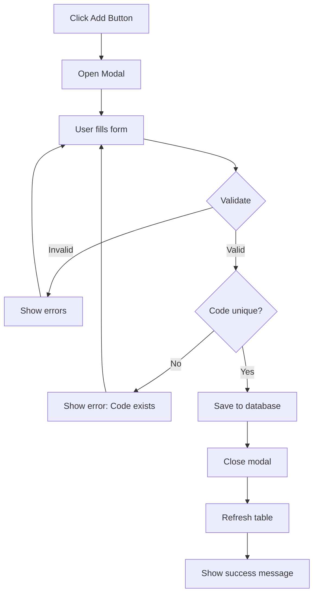
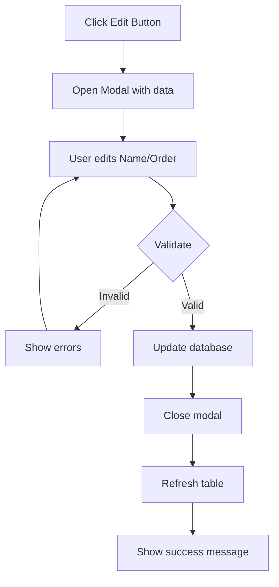
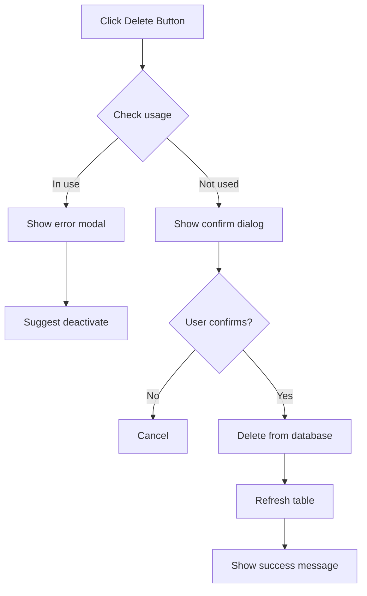

# Dimension Definition - Design Specification

**Feature:** Dimension Definition
**Version:** 1.0
**Date:** 2025-10-31

---

## 1. Design Overview

### 1.1 Screen Layout

```
┌─────────────────────────────────────────────────────────────┐
│ 📊 Dimension Management                          [+ Add]     │
├─────────────────────────────────────────────────────────────┤
│ 🔍 Search: [____________]         📊 Total: 8 | Active: 7   │
├─────────────────────────────────────────────────────────────┤
│                                                               │
│ ┌───────────────────────────────────────────────────────┐  │
│ │ Code         │ Name              │ Order │ Status │ 🎬│  │
│ ├───────────────────────────────────────────────────────┤  │
│ │ COST_CENTER  │ Cost Center       │   1   │ 🟢    │ ✏️│  │
│ │ PRODUCT_LINE │ Dòng sản phẩm     │   2   │ 🟢    │ ✏️│  │
│ │ FACTORY      │ Nhà máy           │   3   │ 🟢    │ ✏️│  │
│ │ CAMPAIGN     │ Chiến dịch        │   4   │ 🔴    │ ✏️│  │
│ └───────────────────────────────────────────────────────┘  │
│                                                               │
└─────────────────────────────────────────────────────────────┘
```

### 1.2 Component Breakdown

**Main Components:**
1. Header Bar (Title + Add button)
2. Filter Bar (Search + Stats)
3. Data Table (Dimensions list)
4. Action Buttons (Edit/Delete/Deactivate)
5. Modal Dialogs (Add/Edit form, Confirmation)

---

## 2. UI Components Detail

### 2.1 Data Table

**Columns:**

| Column | Width | Sortable | Description |
|--------|-------|----------|-------------|
| Dimension Code | 20% | Yes | UPPERCASE, unique identifier |
| Dimension Name | 35% | Yes | Display name (Vietnamese/English) |
| Display Order | 15% | Yes | Integer, determines order in entry forms |
| Status | 15% | Yes | Active (green badge) / Inactive (gray badge) |
| Actions | 15% | No | Edit, Deactivate/Activate, Delete |

**Table Features:**
- Hover effect on rows
- Inactive rows: gray text + gray background
- Click row → highlight (optional)
- Pagination: 20 rows per page
- Empty state: "No dimensions found. Click 'Add Dimension' to get started."

---

### 2.2 Add/Edit Modal

**Form Fields:**

```
┌─────────────────────────────────────────────┐
│  Add Dimension                         [X]   │
├─────────────────────────────────────────────┤
│                                              │
│  Dimension Code *                            │
│  [CAMPAIGN____________]                      │
│  Uppercase, max 20 chars, alphanumeric only  │
│                                              │
│  Dimension Name *                            │
│  [Chiến dịch Marketing_____________]         │
│  Max 100 characters                          │
│                                              │
│  Display Order *                             │
│  [5____]                                     │
│  Default: Next available number              │
│                                              │
│           [Cancel]  [Save Dimension]         │
└─────────────────────────────────────────────┘
```

**Validation Rules:**

| Field | Rules | Error Message |
|-------|-------|---------------|
| Code | Required, unique, uppercase, max 20 chars | "Code already exists" / "Invalid format" |
| Name | Required, max 100 chars | "Name is required" |
| Order | Required, integer, > 0 | "Must be a positive number" |

**Edit Mode Differences:**
- Code field: **Read-only** (disabled, gray background)
- Title: "Edit Dimension"
- Button: "Update Dimension"

---

### 2.3 Confirmation Dialogs

#### Deactivate Confirmation
```
┌─────────────────────────────────────────────┐
│  Confirm Deactivation                       │
├─────────────────────────────────────────────┤
│                                              │
│  Are you sure you want to deactivate        │
│  CAMPAIGN - Chiến dịch?                     │
│                                              │
│  It will no longer appear in entry forms,   │
│  but historical data will be preserved.     │
│                                              │
│           [Cancel]  [Deactivate]            │
└─────────────────────────────────────────────┘
```

#### Delete Confirmation
```
┌─────────────────────────────────────────────┐
│  ⚠️ Confirm Deletion                        │
├─────────────────────────────────────────────┤
│                                              │
│  This will permanently delete:              │
│  CAMPAIGN - Chiến dịch                      │
│                                              │
│  This action CANNOT be undone!              │
│                                              │
│           [Cancel]  [Delete]                │
└─────────────────────────────────────────────┘
```

#### Delete Error (In Use)
```
┌─────────────────────────────────────────────┐
│  ❌ Cannot Delete                           │
├─────────────────────────────────────────────┤
│                                              │
│  This dimension is currently in use and     │
│  cannot be deleted.                         │
│                                              │
│  Referenced in:                             │
│  • 150 journal entries                      │
│  • 12 account dimension rules               │
│                                              │
│  Please deactivate instead.                 │
│                                              │
│           [Deactivate]  [Close]             │
└─────────────────────────────────────────────┘
```

---

## 3. Business Logic

### 3.1 Add Dimension Flow



### 3.2 Edit Dimension Flow



### 3.3 Delete Dimension Flow



---

## 4. API Endpoints (For Dev Reference)

### 4.1 GET /api/dimensions
**Purpose:** Lấy danh sách dimensions của tenant

**Request:**
```
GET /api/dimensions?tenant_id={tenant_id}&search={keyword}&status={active|inactive|all}
```

**Response:**
```json
{
  "success": true,
  "data": [
    {
      "id": "uuid",
      "dimension_code": "COST_CENTER",
      "dimension_name": "Cost Center",
      "display_order": 1,
      "is_active": true,
      "created_at": "2025-01-15T10:00:00Z",
      "usage_count": {
        "journal_entries": 150,
        "account_rules": 25
      }
    }
  ],
  "meta": {
    "total": 8,
    "active": 7,
    "inactive": 1
  }
}
```

---

### 4.2 POST /api/dimensions
**Purpose:** Tạo dimension mới

**Request:**
```json
{
  "tenant_id": "uuid",
  "dimension_code": "CAMPAIGN",
  "dimension_name": "Chiến dịch Marketing",
  "display_order": 5
}
```

**Response:**
```json
{
  "success": true,
  "message": "Dimension created successfully",
  "data": {
    "id": "uuid",
    "dimension_code": "CAMPAIGN",
    "dimension_name": "Chiến dịch Marketing",
    "display_order": 5,
    "is_active": true,
    "created_at": "2025-01-15T10:00:00Z"
  }
}
```

**Error Response:**
```json
{
  "success": false,
  "error": {
    "code": "DUPLICATE_CODE",
    "message": "Dimension code already exists",
    "field": "dimension_code"
  }
}
```

---

### 4.3 PUT /api/dimensions/:id
**Purpose:** Update dimension

**Request:**
```json
{
  "dimension_name": "Chiến dịch",
  "display_order": 8
}
```

**Response:** Similar to POST

---

### 4.4 DELETE /api/dimensions/:id
**Purpose:** Xóa dimension

**Response (Success):**
```json
{
  "success": true,
  "message": "Dimension deleted successfully"
}
```

**Response (Error - In Use):**
```json
{
  "success": false,
  "error": {
    "code": "DIMENSION_IN_USE",
    "message": "Cannot delete dimension that is in use",
    "usage": {
      "journal_entries": 150,
      "account_rules": 12
    }
  }
}
```

---

### 4.5 PATCH /api/dimensions/:id/deactivate
**Purpose:** Deactivate/Activate dimension

**Request:**
```json
{
  "is_active": false
}
```

**Response:**
```json
{
  "success": true,
  "message": "Dimension deactivated successfully"
}
```

---

## 5. Mock Data (For Prototype)

```javascript
const mockDimensions = [
  {
    id: 'dim-001',
    code: 'COST_CENTER',
    name: 'Cost Center',
    displayOrder: 1,
    isActive: true,
    usageCount: { journals: 245, rules: 35 }
  },
  {
    id: 'dim-002',
    code: 'PRODUCT_LINE',
    name: 'Dòng sản phẩm',
    displayOrder: 2,
    isActive: true,
    usageCount: { journals: 198, rules: 28 }
  },
  {
    id: 'dim-003',
    code: 'FACTORY',
    name: 'Nhà máy',
    displayOrder: 3,
    isActive: true,
    usageCount: { journals: 156, rules: 22 }
  },
  {
    id: 'dim-004',
    code: 'SALES_CHANNEL',
    name: 'Kênh bán hàng',
    displayOrder: 4,
    isActive: true,
    usageCount: { journals: 89, rules: 15 }
  },
  {
    id: 'dim-005',
    code: 'REGION',
    name: 'Khu vực',
    displayOrder: 5,
    isActive: true,
    usageCount: { journals: 134, rules: 18 }
  },
  {
    id: 'dim-006',
    code: 'BRAND',
    name: 'Thương hiệu',
    displayOrder: 6,
    isActive: true,
    usageCount: { journals: 67, rules: 12 }
  },
  {
    id: 'dim-007',
    code: 'CAMPAIGN',
    name: 'Chiến dịch',
    displayOrder: 7,
    isActive: false,
    usageCount: { journals: 45, rules: 8 }
  },
  {
    id: 'dim-008',
    code: 'CUSTOMER_SEGMENT',
    name: 'Phân khúc KH',
    displayOrder: 8,
    isActive: true,
    usageCount: { journals: 0, rules: 0 }
  }
];
```

---

## 6. UI States

### 6.1 Loading State
- Show skeleton loader for table
- Disable Add button

### 6.2 Empty State
```
┌─────────────────────────────────────────────┐
│                                              │
│              📊                             │
│                                              │
│       No Dimensions Found                    │
│                                              │
│   Click "Add Dimension" to get started      │
│                                              │
│           [+ Add Dimension]                  │
│                                              │
└─────────────────────────────────────────────┘
```

### 6.3 Error State
- Show error banner at top
- Allow retry action

---

## 7. Responsive Design

### Desktop (> 1024px)
- Full table với tất cả columns
- Modal width: 600px

### Tablet (768px - 1024px)
- Table responsive, có thể scroll horizontal
- Modal width: 90%

### Mobile (< 768px)
- Card view instead of table
- Full-screen modal

---

## 8. Accessibility

- **Keyboard Navigation:**
  - Tab: Move between fields
  - Enter: Submit form
  - Esc: Close modal

- **Screen Reader:**
  - All buttons có aria-label
  - Form errors announced
  - Status badges có text alternatives

- **Color Contrast:**
  - All text: WCAG AA compliance
  - Focus indicators visible

---

## 9. Technical Notes for Dev

### 9.1 Frontend
- Framework: React/Vue (TBD)
- UI Library: Bootstrap 5 / Ant Design
- State Management: Redux/Vuex
- Form Validation: Yup / Vuelidate

### 9.2 Backend
- Database: PostgreSQL
- Table: `dimensions` (xem Core Accounting Design)
- Soft delete: Use `is_active` flag
- Audit: Track created_by, updated_by

### 9.3 Performance
- Table pagination: Client-side (< 100 records) or Server-side (> 100)
- Search: Debounce 300ms
- Cache: Dimensions list (5 min TTL)

---

**End of Design Document**
