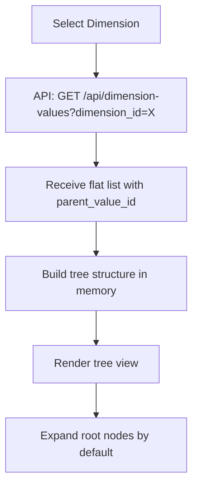
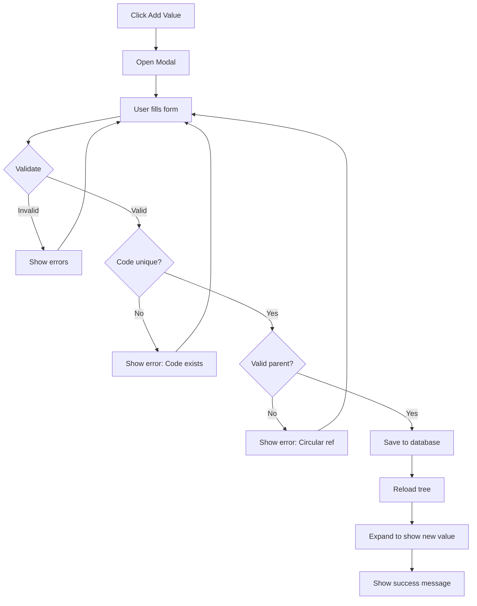
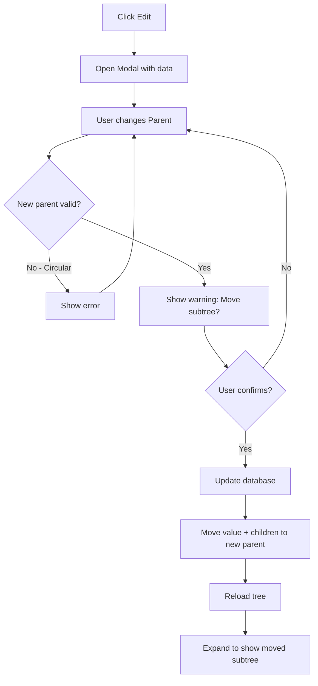
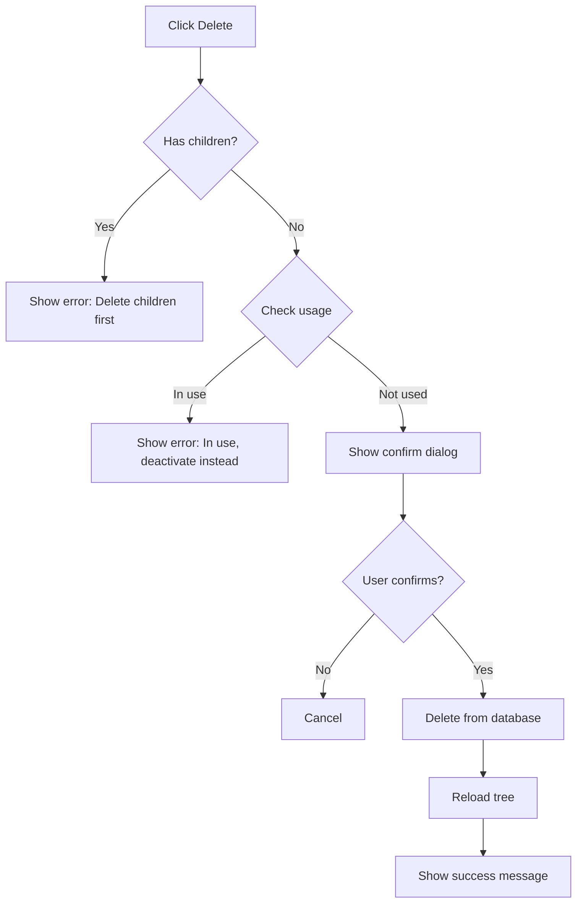

# Dimension Values Management - Design Specification

**Feature:** Dimension Values Management
**Version:** 1.0
**Date:** 2025-10-31

---

## 1. Design Overview

### 1.1 Screen Layout

```
┌─────────────────────────────────────────────────────────────────┐
│ 📊 Dimension Values Management                                  │
├─────────────────────────────────────────────────────────────────┤
│ Select Dimension: [▼ Cost Center - 45 values]     [+ Add Value] │
│                                                    [📤 Import]   │
├─────────────────────────────────────────────────────────────────┤
│ 🔍 Search: [____________]         📊 Total: 45 | Active: 42     │
├─────────────────────────────────────────────────────────────────┤
│                                                                   │
│ ┌─────────────────────────────────────────────────────────────┐ │
│ │ ▼ COMPANY                        │ CC_COMPANY │ 🟢 │ 🎬    │ │
│ │   ▼ COMMERCIAL                   │ CC_COMMER  │ 🟢 │ 🎬    │ │
│ │     ▶ SALES                      │ CC_SALES   │ 🟢 │ 🎬    │ │
│ │     − MARKETING                  │ CC_MARKET  │ 🟢 │ 🎬    │ │
│ │   ▶ PRODUCTION                   │ CC_PROD    │ 🟢 │ 🎬    │ │
│ │   ▶ SUPPORT                      │ CC_SUPPORT │ 🔴 │ 🎬    │ │
│ └─────────────────────────────────────────────────────────────┘ │
│                                                                   │
└─────────────────────────────────────────────────────────────────┘
```

### 1.2 Component Breakdown

**Main Components:**
1. Dimension Selector (Dropdown)
2. Header Bar (Title + Action buttons)
3. Filter Bar (Search + Stats)
4. Tree View (Hierarchical values list)
5. Action Buttons (Add Child, Edit, Delete, Deactivate)
6. Modal Dialogs (Add/Edit form, Confirmation, Import)

---

## 2. UI Components Detail

### 2.1 Dimension Selector

**Purpose:** Select which dimension's values to view/manage

**Design:**
```html
<select class="form-select dimension-selector">
  <option value="dim-001">Cost Center - 45 values (42 active)</option>
  <option value="dim-002">Product Line - 28 values (28 active)</option>
  <option value="dim-003">Factory - 12 values (10 active)</option>
</select>
```

**Behavior:**
- Only show active dimensions (is_active = TRUE)
- Format: "[Dimension Name] - [Total] values ([Active] active)"
- On change → Load values for selected dimension
- Default: First dimension by display_order

---

### 2.2 Tree View Component

**Columns:**

| Column | Width | Sortable | Description |
|--------|-------|----------|-------------|
| Name (with hierarchy) | 40% | No | Tree structure with indent + icons |
| Code | 20% | No | Value code (CC_SALES, etc.) |
| Posting | 10% | No | Posting status icon (✅ ⚠️ ❌) |
| Status | 15% | No | Active (green) / Inactive (gray) badge |
| Actions | 15% | No | Edit, Delete, Deactivate |

**Posting Status Icons:**
- **✅** (Green checkmark) - Leaf node, always postable (`allow_posting=TRUE`)
- **⚠️** (Yellow warning) - Parent node with posting enabled (special case, Finance Manager override)
- **❌** (Red cross) - Parent node, not postable (`allow_posting=FALSE`, default for parents)
- **Tooltip on hover:**
  - ✅: "Can be used in journal entries"
  - ⚠️: "Parent node with posting enabled (special case)"
  - ❌: "Cannot be used in journal entries (parent node)"

**Tree Structure Features:**

**Icons:**
- `▶` - Collapsed (has children, not expanded)
- `▼` - Expanded (has children, expanded)
- `−` - Leaf node (no children)

**Indentation:**
- Level 0 (root): 0px indent
- Level 1: 30px indent
- Level 2: 60px indent
- Level 3: 90px indent
- Level 4: 120px indent

**Visual Design:**
```
Name                           Code          Post  Status  Actions
─────────────────────────────────────────────────────────────────────
▼ COMPANY                      CC_COMPANY    ❌    🟢     [✏️ Edit]
  ▼ COMMERCIAL                 CC_COMMER     ❌    🟢     [✏️ Edit]
    ▶ SALES                    CC_SALES      ⚠️    🟢     [✏️ Edit]
    − MARKETING                CC_MARKET     ✅    🟢     [✏️ Edit]
  ▶ PRODUCTION                 CC_PROD       ❌    🟢     [✏️ Edit]
  − FINANCE                    CC_FIN        ✅    🔴     [✏️ Edit]
```

**Legend:**
- `▼` `▶` `−` = Tree expand/collapse icons
- ❌ = Parent, not postable (default)
- ⚠️ = Parent, postable (Finance Manager enabled)
- ✅ = Leaf, always postable
- 🟢 = Active
- 🔴 = Inactive

**Interaction:**
- Click icon → Expand/Collapse
- Click name → Highlight row (optional select)
- Hover → Show actions buttons
- Right-click → Context menu (Add Child, Edit, Delete, Deactivate)
- Inactive values: Gray text + gray background

---

### 2.3 Add/Edit Value Modal

**Form Fields:**

```
┌─────────────────────────────────────────────┐
│  Add Value to: Cost Center            [X]   │
├─────────────────────────────────────────────┤
│                                              │
│  Value Code *                                │
│  [CC_NORTH__________________________]       │
│  Uppercase, max 30 chars, unique             │
│                                              │
│  Value Name *                                │
│  [North Region_____________________]         │
│  Max 200 characters                          │
│                                              │
│  Parent Value                                │
│  [▼ CC_SALES - Sales Department____]        │
│  Optional (leave blank for root level)       │
│                                              │
│  Display Order *                             │
│  [1____]                                     │
│  Order within siblings                       │
│                                              │
│  ☑ Allow Posting                             │
│  Can this value be used in journal entries?  │
│  (Auto-disabled for leaf nodes - always ON)  │
│                                              │
│  ⚠️ Warning: Parent nodes default to OFF.   │
│     Only enable if you need to post to       │
│     aggregated levels (e.g., data migration) │
│                                              │
│           [Cancel]  [Save Value]             │
└─────────────────────────────────────────────┘
```

**Validation Rules:**

| Field | Rules | Error Message |
|-------|-------|---------------|
| Code | Required, unique in dimension, uppercase, max 30 | "Code already exists" / "Invalid format" |
| Name | Required, max 200 chars | "Name is required" |
| Parent | Optional, cannot be self/descendant | "Invalid parent (circular reference)" |
| Order | Required, integer > 0 | "Must be a positive number" |
| Allow Posting | Boolean, default TRUE, disabled if leaf node | N/A (auto-managed) |

**Edit Mode Differences:**
- Code field: **Read-only** (disabled, gray background)
- Title: "Edit Value: [Value Name]"
- Button: "Update Value"
- Warning if change parent: "This will move [Value] and all children under new parent"

**Posting Control Checkbox Behavior:**

| Scenario | Checkbox State | Default Value | Can Change? | Notes |
|----------|---------------|---------------|-------------|-------|
| **Leaf node (no children)** | Checked, Disabled | TRUE | ❌ No | Always postable, immutable |
| **Parent node (has children)** - Add mode | Unchecked, Enabled | FALSE | ✅ Yes | Finance Manager can enable if needed |
| **Parent node (has children)** - Edit mode | Depends on current value | Current | ✅ Yes | Finance Manager can toggle |
| **Parent → Leaf transition** | Auto-check, Disable | TRUE | ❌ No | When all children deleted/moved |
| **Leaf → Parent transition** | Keep current, Enable | Current | ✅ Yes | When first child added |

**Business Rules:**
- **Default behavior:** Leaf nodes = TRUE (always), Parent nodes = FALSE (default, but can override)
- **Frontend validation:** Prevent unchecking for leaf nodes (checkbox disabled)
- **Backend validation:** Enforce in database trigger (see Core Accounting Design v2.2)
- **Warning message:** Show when Finance Manager enables posting for parent node
- **Use cases for parent posting:**
  - Data migration (when detailed data unavailable)
  - Aggregate transactions (company-wide allocations)
  - Template transactions (to be split later)

**Parent Dropdown:**
- Show tree structure in dropdown (with indent)
- Example:
  ```
  (Root Level - No Parent)
  COMPANY
    COMMERCIAL
      SALES
    PRODUCTION
  ```
- Exclude: Current value itself + all descendants

---

### 2.4 Confirmation Dialogs

#### Deactivate Confirmation
```
┌─────────────────────────────────────────────┐
│  Confirm Deactivation                       │
├─────────────────────────────────────────────┤
│                                              │
│  Deactivate "Sales Department"?             │
│                                              │
│  It will no longer appear in entry forms,   │
│  but historical data will be preserved.     │
│                                              │
│  ☐ Also deactivate all child values (3)    │
│                                              │
│           [Cancel]  [Deactivate]            │
└─────────────────────────────────────────────┘
```

#### Delete Confirmation
```
┌─────────────────────────────────────────────┐
│  ⚠️ Confirm Deletion                        │
├─────────────────────────────────────────────┤
│                                              │
│  Permanently delete:                        │
│  North Region (CC_NORTH)                    │
│                                              │
│  This action CANNOT be undone!              │
│                                              │
│           [Cancel]  [Delete]                │
└─────────────────────────────────────────────┘
```

#### Delete Error (In Use or Has Children)
```
┌─────────────────────────────────────────────┐
│  ❌ Cannot Delete                           │
├─────────────────────────────────────────────┤
│                                              │
│  Cannot delete "Sales Department" because:  │
│                                              │
│  • Has 3 child values                       │
│  • Used in 150 journal entries              │
│                                              │
│  Please deactivate instead or delete        │
│  children first.                            │
│                                              │
│           [Deactivate]  [Close]             │
└─────────────────────────────────────────────┘
```

---

### 2.5 Bulk Import Modal

```
┌───────────────────────────────────────────────────┐
│  Import Values from Excel                    [X]  │
├───────────────────────────────────────────────────┤
│                                                    │
│  Step 1: Download Template                        │
│  [📥 Download Excel Template]                     │
│                                                    │
│  Step 2: Upload File                              │
│  [Choose File] No file selected                   │
│  Supported: .xlsx, .csv (max 5MB)                 │
│                                                    │
│  Step 3: Preview & Validate                       │
│  ┌────────────────────────────────────────────┐  │
│  │ Code        │ Name        │ Parent │ Status │  │
│  ├────────────────────────────────────────────┤  │
│  │ CC_NORTH    │ North Reg   │ CC_SAL │ ✅ OK  │  │
│  │ CC_SOUTH    │ South Reg   │ CC_SAL │ ✅ OK  │  │
│  │ CC_NORTH    │ Duplicate   │ -      │ ❌ Dup │  │
│  │ CC_WEST     │ West Reg    │ INVALID│ ❌ Err │  │
│  └────────────────────────────────────────────┘  │
│                                                    │
│  Summary: 150 rows | 145 valid | 5 errors         │
│                                                    │
│  ☐ Skip errors and import valid rows only         │
│                                                    │
│           [Cancel]  [Import Valid Rows]           │
└───────────────────────────────────────────────────┘
```

---

## 3. Business Logic

### 3.1 Load Values for Dimension



### 3.2 Add Value Flow



### 3.3 Edit Value with Parent Change



### 3.4 Delete Value Flow



---

## 4. API Endpoints (For Dev Reference)

### 4.1 GET /api/dimension-values

**Purpose:** Lấy danh sách values của một dimension

**Request:**
```
GET /api/dimension-values?dimension_id={uuid}&search={keyword}&status={active|inactive|all}
```

**Response:**
```json
{
  "success": true,
  "data": [
    {
      "id": "val-001",
      "dimension_id": "dim-001",
      "value_code": "CC_COMPANY",
      "value_name": "Company",
      "parent_value_id": null,
      "display_order": 1,
      "is_active": true,
      "allow_posting": false,
      "created_at": "2025-01-15T10:00:00Z",
      "level": 0,
      "has_children": true,
      "usage_count": {
        "journal_entries": 0,
        "children": 3
      }
    },
    {
      "id": "val-002",
      "dimension_id": "dim-001",
      "value_code": "CC_COMMERCIAL",
      "value_name": "Commercial Division",
      "parent_value_id": "val-001",
      "display_order": 1,
      "is_active": true,
      "allow_posting": false,
      "level": 1,
      "has_children": true,
      "usage_count": {
        "journal_entries": 25,
        "children": 2
      }
    }
  ],
  "meta": {
    "dimension_name": "Cost Center",
    "total": 45,
    "active": 42,
    "inactive": 3
  }
}
```

---

### 4.2 POST /api/dimension-values

**Purpose:** Tạo value mới

**Request:**
```json
{
  "dimension_id": "dim-001",
  "value_code": "CC_NORTH",
  "value_name": "North Region",
  "parent_value_id": "val-005",
  "display_order": 1,
  "allow_posting": true
}
```

**Notes:**
- `allow_posting` is optional, defaults to:
  - `TRUE` if no parent (leaf node initially)
  - `FALSE` if has parent specified (assumes will be parent in future)
- Backend should auto-set based on business rules if not provided

**Response:**
```json
{
  "success": true,
  "message": "Value created successfully",
  "data": {
    "id": "val-new-001",
    "dimension_id": "dim-001",
    "value_code": "CC_NORTH",
    "value_name": "North Region",
    "parent_value_id": "val-005",
    "display_order": 1,
    "is_active": true,
    "allow_posting": true,
    "created_at": "2025-01-15T10:00:00Z"
  }
}
```

**Error Response (Duplicate Code):**
```json
{
  "success": false,
  "error": {
    "code": "DUPLICATE_CODE",
    "message": "Value code already exists in this dimension",
    "field": "value_code"
  }
}
```

**Error Response (Circular Reference):**
```json
{
  "success": false,
  "error": {
    "code": "CIRCULAR_REFERENCE",
    "message": "Parent cannot be the value itself or its descendant",
    "field": "parent_value_id"
  }
}
```

---

### 4.3 PUT /api/dimension-values/:id

**Purpose:** Update value (name, parent, order, posting control)

**Request:**
```json
{
  "value_name": "North Sales Region",
  "parent_value_id": "val-006",
  "display_order": 2,
  "allow_posting": false
}
```

**Notes:**
- `allow_posting` can be updated for parent nodes only
- Backend should reject if trying to set `allow_posting=false` for leaf node
- Auto-adjust when value transitions between leaf ↔ parent

**Response:** Similar to POST (includes updated `allow_posting` value)

---

### 4.4 DELETE /api/dimension-values/:id

**Purpose:** Xóa value

**Response (Success):**
```json
{
  "success": true,
  "message": "Value deleted successfully"
}
```

**Response (Error - Has Children):**
```json
{
  "success": false,
  "error": {
    "code": "HAS_CHILDREN",
    "message": "Cannot delete value that has children",
    "children_count": 3
  }
}
```

**Response (Error - In Use):**
```json
{
  "success": false,
  "error": {
    "code": "VALUE_IN_USE",
    "message": "Cannot delete value that is in use",
    "usage": {
      "journal_entries": 150
    }
  }
}
```

---

### 4.5 PATCH /api/dimension-values/:id/deactivate

**Purpose:** Deactivate/Activate value

**Request:**
```json
{
  "is_active": false,
  "deactivate_children": true
}
```

**Response:**
```json
{
  "success": true,
  "message": "Value and 3 children deactivated successfully",
  "affected_count": 4
}
```

---

### 4.6 POST /api/dimension-values/bulk-import

**Purpose:** Import values từ Excel

**Request:** (multipart/form-data)
```
file: values.xlsx
dimension_id: dim-001
skip_errors: true
```

**Response:**
```json
{
  "success": true,
  "message": "Import completed",
  "summary": {
    "total_rows": 150,
    "imported": 145,
    "errors": 5
  },
  "errors": [
    {
      "row": 23,
      "code": "CC_NORTH",
      "error": "Duplicate code"
    },
    {
      "row": 45,
      "code": "CC_WEST",
      "error": "Invalid parent code: CC_INVALID"
    }
  ]
}
```

---

## 5. Mock Data (For Prototype)

### 5.1 Dimensions List (for Selector)
```javascript
const mockDimensions = [
  {
    id: 'dim-001',
    code: 'COST_CENTER',
    name: 'Cost Center',
    valueCount: 45,
    activeCount: 42
  },
  {
    id: 'dim-002',
    code: 'PRODUCT_LINE',
    name: 'Product Line',
    valueCount: 28,
    activeCount: 28
  },
  {
    id: 'dim-003',
    code: 'SALES_CHANNEL',
    name: 'Sales Channel',
    valueCount: 12,
    activeCount: 10
  }
];
```

### 5.2 Dimension Values (COST_CENTER - with Hierarchy)
```javascript
const mockValues = [
  {
    id: 'val-001',
    code: 'CC_COMPANY',
    name: 'Company',
    parentId: null,
    displayOrder: 1,
    isActive: true,
    allowPosting: false,  // ❌ Parent, not postable
    hasChildren: true,
    usageCount: { journals: 0, children: 3 }
  },
  {
    id: 'val-002',
    code: 'CC_COMMERCIAL',
    name: 'Commercial Division',
    parentId: 'val-001',
    displayOrder: 1,
    isActive: true,
    allowPosting: false,  // ❌ Parent, not postable
    hasChildren: true,
    usageCount: { journals: 25, children: 2 }
  },
  {
    id: 'val-003',
    code: 'CC_SALES',
    name: 'Sales Department',
    parentId: 'val-002',
    displayOrder: 1,
    isActive: true,
    allowPosting: true,   // ⚠️ Parent with posting enabled (special case)
    hasChildren: true,
    usageCount: { journals: 150, children: 2 }
  },
  {
    id: 'val-004',
    code: 'CC_NORTH',
    name: 'North Region',
    parentId: 'val-003',
    displayOrder: 1,
    isActive: true,
    allowPosting: true,   // ✅ Leaf, always postable
    hasChildren: false,
    usageCount: { journals: 89, children: 0 }
  },
  {
    id: 'val-005',
    code: 'CC_SOUTH',
    name: 'South Region',
    parentId: 'val-003',
    displayOrder: 2,
    isActive: true,
    allowPosting: true,   // ✅ Leaf, always postable
    hasChildren: false,
    usageCount: { journals: 67, children: 0 }
  },
  {
    id: 'val-006',
    code: 'CC_MARKETING',
    name: 'Marketing Department',
    parentId: 'val-002',
    displayOrder: 2,
    isActive: true,
    allowPosting: true,   // ✅ Leaf, always postable
    hasChildren: false,
    usageCount: { journals: 45, children: 0 }
  },
  {
    id: 'val-007',
    code: 'CC_PRODUCTION',
    name: 'Production Division',
    parentId: 'val-001',
    displayOrder: 2,
    isActive: true,
    allowPosting: false,  // ❌ Parent, not postable
    hasChildren: true,
    usageCount: { journals: 198, children: 2 }
  },
  {
    id: 'val-008',
    code: 'CC_FACTORY1',
    name: 'Factory 1',
    parentId: 'val-007',
    displayOrder: 1,
    isActive: true,
    allowPosting: true,   // ✅ Leaf, always postable
    hasChildren: false,
    usageCount: { journals: 120, children: 0 }
  },
  {
    id: 'val-009',
    code: 'CC_FACTORY2',
    name: 'Factory 2',
    parentId: 'val-007',
    displayOrder: 2,
    isActive: true,
    allowPosting: true,   // ✅ Leaf, always postable
    hasChildren: false,
    usageCount: { journals: 78, children: 0 }
  },
  {
    id: 'val-010',
    code: 'CC_SUPPORT',
    name: 'Support Division',
    parentId: 'val-001',
    displayOrder: 3,
    isActive: false,
    allowPosting: false,  // ❌ Parent, not postable
    hasChildren: true,
    usageCount: { journals: 34, children: 3 }
  },
  {
    id: 'val-011',
    code: 'CC_HR',
    name: 'Human Resources',
    parentId: 'val-010',
    displayOrder: 1,
    isActive: false,
    allowPosting: true,   // ✅ Leaf, always postable
    hasChildren: false,
    usageCount: { journals: 12, children: 0 }
  },
  {
    id: 'val-012',
    code: 'CC_IT',
    name: 'IT Department',
    parentId: 'val-010',
    displayOrder: 2,
    isActive: true,
    allowPosting: true,   // ✅ Leaf, always postable
    hasChildren: false,
    usageCount: { journals: 15, children: 0 }
  },
  {
    id: 'val-013',
    code: 'CC_FINANCE',
    name: 'Finance Department',
    parentId: 'val-010',
    displayOrder: 3,
    isActive: true,
    allowPosting: true,   // ✅ Leaf, always postable
    hasChildren: false,
    usageCount: { journals: 7, children: 0 }
  }
];
```

**Legend for Mock Data:**
- ✅ Leaf nodes: `allowPosting: true` (always, cannot be changed)
- ❌ Parent nodes: `allowPosting: false` (default, Finance Manager can override)
- ⚠️ Special case: `CC_SALES` is parent but has `allowPosting: true` (Finance Manager enabled for aggregate sales posting)

---

## 6. Tree Building Algorithm (For Frontend Dev)

### 6.1 Flat List to Tree Conversion

```javascript
function buildTree(flatList) {
  const tree = [];
  const lookup = {};

  // Create lookup map
  flatList.forEach(item => {
    lookup[item.id] = { ...item, children: [] };
  });

  // Build tree
  flatList.forEach(item => {
    if (item.parentId === null) {
      tree.push(lookup[item.id]);
    } else {
      if (lookup[item.parentId]) {
        lookup[item.parentId].children.push(lookup[item.id]);
      }
    }
  });

  return tree;
}
```

### 6.2 Circular Reference Detection

```javascript
function hasCircularReference(valueId, newParentId, lookup) {
  let current = newParentId;

  while (current !== null) {
    if (current === valueId) {
      return true; // Circular!
    }
    current = lookup[current]?.parentId;
  }

  return false;
}
```

### 6.3 Get All Descendants

```javascript
function getAllDescendants(valueId, lookup) {
  const descendants = [];

  function traverse(id) {
    const value = lookup[id];
    if (value && value.children) {
      value.children.forEach(child => {
        descendants.push(child.id);
        traverse(child.id);
      });
    }
  }

  traverse(valueId);
  return descendants;
}
```

---

## 7. UI States

### 7.1 Loading State
- Show skeleton loader for tree
- Disable Add Value button
- Dimension selector enabled

### 7.2 Empty State (No Values)
```
┌─────────────────────────────────────────────┐
│                                              │
│              📊                             │
│                                              │
│       No Values Found                        │
│                                              │
│   Click "Add Value" to create the first     │
│   value for this dimension                  │
│                                              │
│           [+ Add Value]                      │
│                                              │
└─────────────────────────────────────────────┘
```

### 7.3 Empty Search Result
```
┌─────────────────────────────────────────────┐
│                                              │
│              🔍                             │
│                                              │
│       No matching values found               │
│                                              │
│   Try different search keywords             │
│                                              │
│           [Clear Search]                     │
│                                              │
└─────────────────────────────────────────────┘
```

### 7.4 Error State
- Show error banner at top
- Allow retry action
- Preserve user's current view

---

## 8. Responsive Design

### Desktop (> 1024px)
- Full tree view with all columns
- Modal width: 700px
- Tree indent: 30px per level

### Tablet (768px - 1024px)
- Tree can scroll horizontal if needed
- Modal width: 90%
- Tree indent: 20px per level

### Mobile (< 768px)
- Card view instead of tree table
- Full-screen modal
- Hierarchy shown with nested cards
- Tree indent: 15px per level

---

## 9. Accessibility

### Keyboard Navigation:
- **Tab:** Move between elements
- **Arrow Right:** Expand node
- **Arrow Left:** Collapse node
- **Arrow Up/Down:** Navigate tree nodes
- **Enter:** Edit selected value
- **Delete:** Delete selected value (with confirm)
- **Esc:** Close modal

### Screen Reader:
- Tree structure announced ("Level 1 of 4", "Has 3 children")
- Expand/collapse state announced
- All buttons have aria-label
- Form errors announced

### Color Contrast:
- All text: WCAG AA compliance
- Focus indicators visible
- Status not conveyed by color only (use icons + text)

---

## 10. Technical Notes for Dev

### 10.1 Frontend
- Framework: React/Vue (TBD)
- UI Library: Bootstrap 5 + Tree component (react-virtualized-tree or similar)
- State Management: Redux/Vuex for tree state
- Tree Component: Support virtual scrolling for 1000+ nodes

### 10.2 Backend
- Database: PostgreSQL
- Table: `dimension_values` (see Core Accounting Design)
- Recursive CTE for tree queries
- Index on parent_value_id for performance

### 10.3 Performance
- Tree loading: < 1s for 500 nodes
- Virtual scrolling: Render only visible nodes
- Search: Client-side for < 200 nodes, server-side for > 200
- Cache: Tree structure (5 min TTL)
- Lazy loading: Load children on expand (for > 1000 nodes)

### 10.4 Validation
- Client-side: Immediate feedback on form
- Server-side: Enforce circular reference check in database trigger
- Display order: Auto-increment within siblings

---

**End of Design Document**
