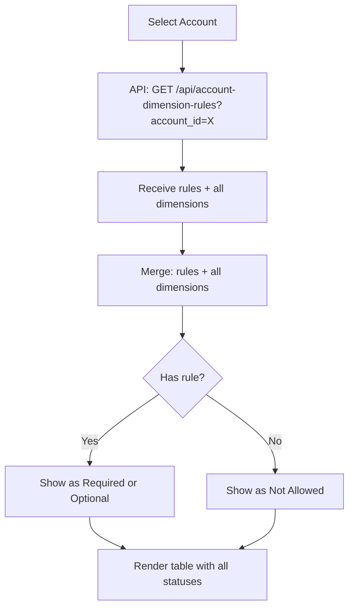
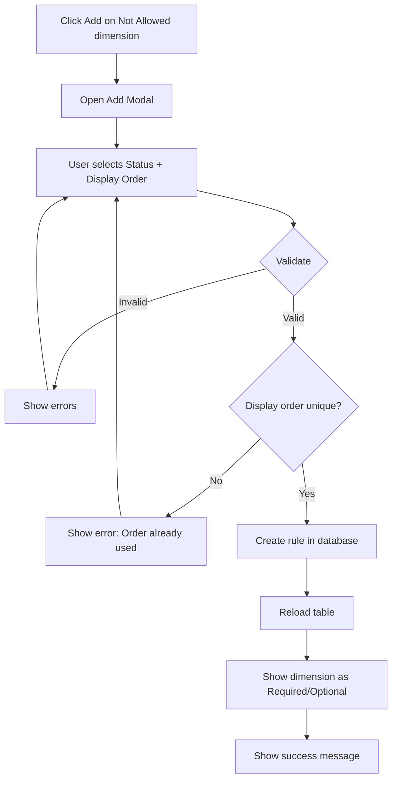
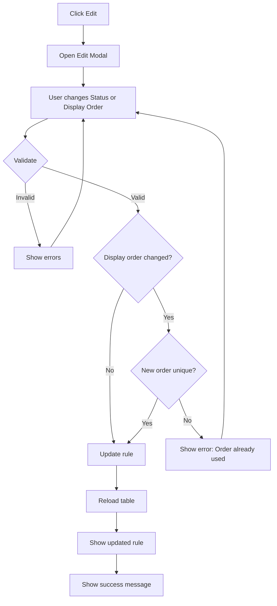
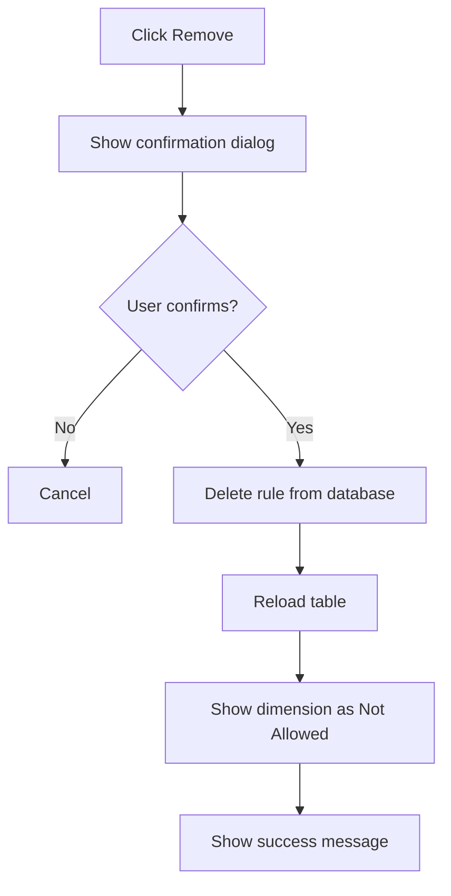
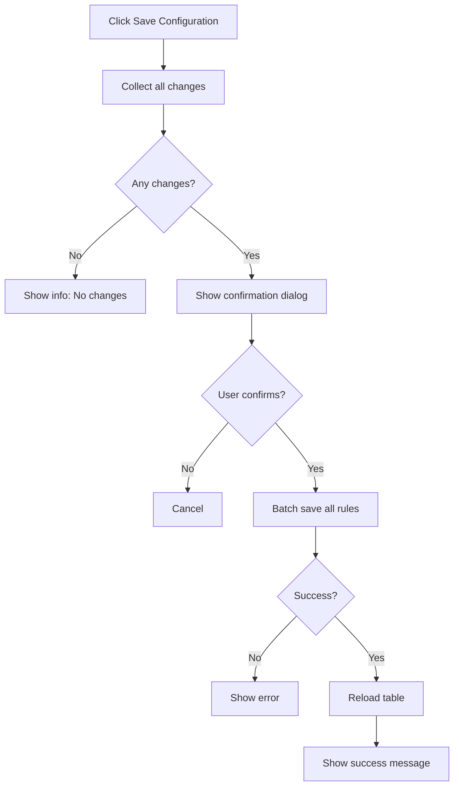

# Account-Dimension Mapping - Design Specification

**Feature:** Account-Dimension Mapping
**Version:** 1.0
**Date:** 2025-10-31
**Purpose:** Configure which dimensions are allowed/required for each account (inspired by Microsoft Dynamics 365 Account Structure)

---

## 1. Design Overview

### 1.1 Business Purpose

**Problem Statement:**
- Different accounts require different dimensions
- Example: "641 - Marketing Expense" requires Cost Center + Product Line, but "112 - Bank Account" needs no dimensions
- Need account-specific rules for data quality enforcement

**Solution:**
- **Whitelist Approach**: Explicitly define which dimensions are allowed per account
- **Required vs Optional**: Set dimension as required (must fill) or optional (can fill) per account
- **Display Order**: Control order of dimensions in journal entry form
- **No Record = Not Allowed**: If account has no rule for dimension X → dimension X cannot be used

**Inspired by:** Microsoft Dynamics 365 "Account Structure" feature

---

### 1.2 Screen Layout

```
┌─────────────────────────────────────────────────────────────────┐
│ 📊 Account-Dimension Mapping                                    │
├─────────────────────────────────────────────────────────────────┤
│                                                                   │
│ Select Account: [▼ 641 - Marketing Expense_________________]    │
│                                                                   │
│ ────────────────────────────────────────────────────────────── │
│                                                                   │
│ Configure Dimensions for: 641 - Marketing Expense               │
│                                                                   │
│ ┌───────────────────────────────────────────────────────────┐  │
│ │ Dimension          Status          Display Order   Actions │  │
│ ├───────────────────────────────────────────────────────────┤  │
│ │ Cost Center        🟢 Required     [1]             [✏️]   │  │
│ │ Product Line       🟢 Required     [2]             [✏️]   │  │
│ │ Campaign           🟡 Optional     [3]             [✏️]   │  │
│ │ Region             🟡 Optional     [4]             [✏️]   │  │
│ │ Factory            ⚪ Not Allowed  -               [➕]   │  │
│ │ Sales Channel      ⚪ Not Allowed  -               [➕]   │  │
│ └───────────────────────────────────────────────────────────┘  │
│                                                                   │
│ ℹ️ Note: Only allowed dimensions will appear in journal entry   │
│    forms. Required dimensions must be filled.                   │
│                                                                   │
│                              [Save Configuration]  [Reset]       │
│                                                                   │
└─────────────────────────────────────────────────────────────────┘
```

### 1.3 Component Breakdown

**Main Components:**
1. Account Selector (Dropdown with search)
2. Dimension Configuration Table
3. Status Indicators (Required / Optional / Not Allowed)
4. Display Order Input
5. Action Buttons (Add, Edit, Remove)
6. Save/Reset Buttons

---

## 2. UI Components Detail

### 2.1 Account Selector

**Purpose:** Select which account to configure dimension rules

**Design:**
```html
<div class="form-group">
  <label for="accountSelect">Select Account</label>
  <select class="form-select" id="accountSelect">
    <option value="">-- Select Account --</option>
    <optgroup label="Assets (Class 1)">
      <option value="acc-001">111 - Cash</option>
      <option value="acc-002">112 - Bank Account</option>
    </optgroup>
    <optgroup label="Expenses (Class 6)">
      <option value="acc-641">641 - Marketing Expense</option>
      <option value="acc-642">642 - Office Expense</option>
    </optgroup>
  </select>
</div>
```

**Behavior:**
- Show only **active accounts** (is_active = TRUE)
- Group by account class (1xx Assets, 3xx Equity, 5xx Revenue, 6xx Expenses, etc.)
- Show format: `[Code] - [Name]`
- Support search/filter by code or name
- On change → Load dimension rules for selected account

**Account Categories:**
- **Class 1 (100-199)**: Assets
- **Class 2 (200-299)**: Liabilities
- **Class 3 (300-399)**: Equity
- **Class 4 (400-499)**: Revenue
- **Class 5 (500-599)**: Expenses
- **Class 6 (600-699)**: Expenses
- **Class 7 (700-799)**: Other Revenue
- **Class 8 (800-899)**: Other Expenses

---

### 2.2 Dimension Configuration Table

**Columns:**

| Column | Width | Description |
|--------|-------|-------------|
| Dimension Name | 35% | Dimension name (e.g., "Cost Center") |
| Status | 25% | Required / Optional / Not Allowed |
| Display Order | 15% | Order in journal entry form (1, 2, 3...) |
| Actions | 25% | Add/Edit/Remove buttons |

**Status Indicators:**

| Status | Badge | Color | Meaning |
|--------|-------|-------|---------|
| **Required** | 🟢 | Green | Dimension is REQUIRED - user must fill in journal entry |
| **Optional** | 🟡 | Yellow/Orange | Dimension is OPTIONAL - user can fill but not required |
| **Not Allowed** | ⚪ | Gray | Dimension is NOT ALLOWED - will not appear in journal entry form |

---

### 2.3 Row States

#### Required Dimension Row
```html
<tr class="dimension-row required">
  <td>
    <strong>Cost Center</strong>
    <small class="text-muted d-block">COST_CENTER</small>
  </td>
  <td>
    <span class="badge bg-success">
      <i class="bi bi-check-circle-fill"></i> Required
    </span>
  </td>
  <td>
    <input type="number" class="form-control form-control-sm" value="1" min="1" style="width: 60px;">
  </td>
  <td>
    <button class="btn btn-sm btn-outline-primary" onclick="editRule('dim-001')">Edit</button>
    <button class="btn btn-sm btn-outline-danger" onclick="removeRule('dim-001')">Remove</button>
  </td>
</tr>
```

#### Optional Dimension Row
```html
<tr class="dimension-row optional">
  <td>
    <strong>Campaign</strong>
    <small class="text-muted d-block">CAMPAIGN</small>
  </td>
  <td>
    <span class="badge bg-warning text-dark">
      <i class="bi bi-dash-circle-fill"></i> Optional
    </span>
  </td>
  <td>
    <input type="number" class="form-control form-control-sm" value="3" min="1" style="width: 60px;">
  </td>
  <td>
    <button class="btn btn-sm btn-outline-primary" onclick="editRule('dim-003')">Edit</button>
    <button class="btn btn-sm btn-outline-danger" onclick="removeRule('dim-003')">Remove</button>
  </td>
</tr>
```

#### Not Allowed Dimension Row
```html
<tr class="dimension-row not-allowed">
  <td>
    <strong class="text-muted">Factory</strong>
    <small class="text-muted d-block">FACTORY</small>
  </td>
  <td>
    <span class="badge bg-secondary">
      <i class="bi bi-x-circle-fill"></i> Not Allowed
    </span>
  </td>
  <td>
    <span class="text-muted">-</span>
  </td>
  <td>
    <button class="btn btn-sm btn-outline-success" onclick="addRule('dim-005')">
      <i class="bi bi-plus-circle"></i> Add
    </button>
  </td>
</tr>
```

---

### 2.4 Add/Edit Dimension Modal

**Add Dimension to Account:**
```
┌─────────────────────────────────────────────┐
│  Add Dimension to Account                   │
│  641 - Marketing Expense              [X]   │
├─────────────────────────────────────────────┤
│                                              │
│  Dimension *                                 │
│  [▼ Factory_________________________]       │
│                                              │
│  Status *                                    │
│  ○ Required                                  │
│  ● Optional                                  │
│                                              │
│  Display Order *                             │
│  [5____]                                     │
│  (Suggested: 5)                              │
│                                              │
│           [Cancel]  [Add Dimension]         │
└─────────────────────────────────────────────┘
```

**Edit Dimension Rule:**
```
┌─────────────────────────────────────────────┐
│  Edit Dimension Rule                        │
│  641 - Marketing Expense              [X]   │
├─────────────────────────────────────────────┤
│                                              │
│  Dimension                                   │
│  Cost Center (read-only)                    │
│                                              │
│  Status *                                    │
│  ● Required                                  │
│  ○ Optional                                  │
│                                              │
│  Display Order *                             │
│  [1____]                                     │
│                                              │
│           [Cancel]  [Update Rule]           │
└─────────────────────────────────────────────┘
```

**Validation Rules:**

| Field | Rules | Error Message |
|-------|-------|---------------|
| Dimension | Required, cannot be duplicate | "This dimension is already configured for this account" |
| Status | Required (Required or Optional) | "Please select status" |
| Display Order | Required, integer > 0, unique per account | "Display order must be unique" / "Must be a positive number" |

---

### 2.5 Confirmation Dialogs

#### Remove Dimension Rule Confirmation
```
┌─────────────────────────────────────────────┐
│  ⚠️ Confirm Remove                          │
├─────────────────────────────────────────────┤
│                                              │
│  Remove "Cost Center" from                  │
│  641 - Marketing Expense?                   │
│                                              │
│  This dimension will no longer appear       │
│  in journal entry forms for this account.   │
│                                              │
│  ⚠️ Warning: This does NOT delete existing │
│     journal entries with this dimension.    │
│                                              │
│           [Cancel]  [Remove]                │
└─────────────────────────────────────────────┘
```

#### Save Configuration Confirmation
```
┌─────────────────────────────────────────────┐
│  💾 Save Configuration                      │
├─────────────────────────────────────────────┤
│                                              │
│  Save dimension rules for                   │
│  641 - Marketing Expense?                   │
│                                              │
│  Summary:                                    │
│  • 2 Required dimensions                    │
│  • 2 Optional dimensions                    │
│  • 2 Not Allowed dimensions                 │
│                                              │
│  These rules will apply to all new          │
│  journal entries for this account.          │
│                                              │
│           [Cancel]  [Save]                  │
└─────────────────────────────────────────────┘
```

---

## 3. Business Logic

### 3.1 Load Account Dimension Rules



**Logic:**
1. Load ALL active dimensions for tenant
2. Load rules for selected account (may be 0 rules)
3. Merge data:
   - Dimension has rule with `is_required=TRUE` → Status = "Required"
   - Dimension has rule with `is_required=FALSE` → Status = "Optional"
   - Dimension has NO rule → Status = "Not Allowed"

---

### 3.2 Add Dimension to Account



---

### 3.3 Edit Dimension Rule



---

### 3.4 Remove Dimension Rule



**Important:**
- Removing a rule does NOT delete existing journal entries
- It only prevents future journal entries from using this dimension for this account

---

### 3.5 Save All Configuration



---

## 4. API Endpoints (For Dev Reference)

### 4.1 GET /api/accounts

**Purpose:** Lấy danh sách accounts để populate dropdown

**Request:**
```
GET /api/accounts?tenant_id={uuid}&status=active&fields=id,code,name,account_type
```

**Response:**
```json
{
  "success": true,
  "data": [
    {
      "id": "acc-001",
      "account_code": "111",
      "account_name": "Cash",
      "account_type": "ASSET",
      "class": 1
    },
    {
      "id": "acc-641",
      "account_code": "641",
      "account_name": "Marketing Expense",
      "account_type": "EXPENSE",
      "class": 6
    }
  ]
}
```

---

### 4.2 GET /api/account-dimension-rules

**Purpose:** Lấy dimension rules cho một account cụ thể + all dimensions

**Request:**
```
GET /api/account-dimension-rules?account_id={uuid}
```

**Response:**
```json
{
  "success": true,
  "data": {
    "account": {
      "id": "acc-641",
      "code": "641",
      "name": "Marketing Expense"
    },
    "all_dimensions": [
      {
        "id": "dim-001",
        "code": "COST_CENTER",
        "name": "Cost Center",
        "is_active": true
      },
      {
        "id": "dim-002",
        "code": "PRODUCT_LINE",
        "name": "Product Line",
        "is_active": true
      },
      {
        "id": "dim-005",
        "code": "FACTORY",
        "name": "Factory",
        "is_active": true
      }
    ],
    "rules": [
      {
        "id": "rule-001",
        "account_id": "acc-641",
        "dimension_id": "dim-001",
        "dimension_code": "COST_CENTER",
        "dimension_name": "Cost Center",
        "is_required": true,
        "display_order": 1
      },
      {
        "id": "rule-002",
        "account_id": "acc-641",
        "dimension_id": "dim-002",
        "dimension_code": "PRODUCT_LINE",
        "dimension_name": "Product Line",
        "is_required": true,
        "display_order": 2
      },
      {
        "id": "rule-003",
        "account_id": "acc-641",
        "dimension_id": "dim-003",
        "dimension_code": "CAMPAIGN",
        "dimension_name": "Campaign",
        "is_required": false,
        "display_order": 3
      }
    ],
    "summary": {
      "total_dimensions": 6,
      "required_count": 2,
      "optional_count": 1,
      "not_allowed_count": 3
    }
  }
}
```

**Logic:**
- Return ALL active dimensions (for rendering "Not Allowed" rows)
- Return rules for the account (for rendering "Required" and "Optional" rows)
- Frontend merges data to show full table

---

### 4.3 POST /api/account-dimension-rules

**Purpose:** Tạo rule mới (add dimension to account)

**Request:**
```json
{
  "account_id": "acc-641",
  "dimension_id": "dim-005",
  "is_required": false,
  "display_order": 5
}
```

**Response:**
```json
{
  "success": true,
  "message": "Dimension added to account successfully",
  "data": {
    "id": "rule-new-001",
    "account_id": "acc-641",
    "dimension_id": "dim-005",
    "dimension_code": "FACTORY",
    "dimension_name": "Factory",
    "is_required": false,
    "display_order": 5,
    "created_at": "2025-10-31T10:00:00Z"
  }
}
```

**Error Response (Duplicate):**
```json
{
  "success": false,
  "error": {
    "code": "DUPLICATE_RULE",
    "message": "This dimension is already configured for this account",
    "field": "dimension_id"
  }
}
```

**Error Response (Display Order Conflict):**
```json
{
  "success": false,
  "error": {
    "code": "DISPLAY_ORDER_CONFLICT",
    "message": "Display order 5 is already used by another dimension for this account",
    "field": "display_order"
  }
}
```

---

### 4.4 PUT /api/account-dimension-rules/:id

**Purpose:** Update existing rule (change status or display order)

**Request:**
```json
{
  "is_required": true,
  "display_order": 2
}
```

**Response:**
```json
{
  "success": true,
  "message": "Dimension rule updated successfully",
  "data": {
    "id": "rule-003",
    "account_id": "acc-641",
    "dimension_id": "dim-003",
    "dimension_code": "CAMPAIGN",
    "dimension_name": "Campaign",
    "is_required": true,
    "display_order": 2,
    "updated_at": "2025-10-31T10:00:00Z"
  }
}
```

---

### 4.5 DELETE /api/account-dimension-rules/:id

**Purpose:** Remove dimension from account (delete rule)

**Response:**
```json
{
  "success": true,
  "message": "Dimension removed from account successfully"
}
```

**Note:**
- This only deletes the rule (dimension becomes "Not Allowed" for this account)
- Does NOT affect existing journal entries
- Does NOT delete the dimension itself

---

### 4.6 POST /api/account-dimension-rules/batch

**Purpose:** Save all rules at once (batch update)

**Request:**
```json
{
  "account_id": "acc-641",
  "rules": [
    {
      "dimension_id": "dim-001",
      "is_required": true,
      "display_order": 1
    },
    {
      "dimension_id": "dim-002",
      "is_required": true,
      "display_order": 2
    },
    {
      "dimension_id": "dim-003",
      "is_required": false,
      "display_order": 3
    }
  ]
}
```

**Response:**
```json
{
  "success": true,
  "message": "All dimension rules saved successfully",
  "data": {
    "account_id": "acc-641",
    "rules_created": 1,
    "rules_updated": 2,
    "rules_deleted": 1
  }
}
```

---

## 5. Mock Data (For Prototype)

### 5.1 Accounts List
```javascript
const mockAccounts = [
  {
    id: 'acc-001',
    code: '111',
    name: 'Cash',
    type: 'ASSET',
    class: 1
  },
  {
    id: 'acc-002',
    code: '112',
    name: 'Bank Account',
    type: 'ASSET',
    class: 1
  },
  {
    id: 'acc-641',
    code: '641',
    name: 'Marketing Expense',
    type: 'EXPENSE',
    class: 6
  },
  {
    id: 'acc-642',
    code: '642',
    name: 'Office Expense',
    type: 'EXPENSE',
    class: 6
  },
  {
    id: 'acc-632',
    code: '632',
    name: 'Cost of Goods Sold',
    type: 'EXPENSE',
    class: 6
  }
];
```

### 5.2 All Dimensions
```javascript
const mockDimensions = [
  {
    id: 'dim-001',
    code: 'COST_CENTER',
    name: 'Cost Center',
    isActive: true
  },
  {
    id: 'dim-002',
    code: 'PRODUCT_LINE',
    name: 'Product Line',
    isActive: true
  },
  {
    id: 'dim-003',
    code: 'CAMPAIGN',
    name: 'Campaign',
    isActive: true
  },
  {
    id: 'dim-004',
    code: 'REGION',
    name: 'Region',
    isActive: true
  },
  {
    id: 'dim-005',
    code: 'FACTORY',
    name: 'Factory',
    isActive: true
  },
  {
    id: 'dim-006',
    code: 'SALES_CHANNEL',
    name: 'Sales Channel',
    isActive: true
  }
];
```

### 5.3 Account-Dimension Rules (for Account 641 - Marketing Expense)
```javascript
const mockRules = {
  'acc-641': [
    {
      id: 'rule-001',
      accountId: 'acc-641',
      dimensionId: 'dim-001',
      dimensionCode: 'COST_CENTER',
      dimensionName: 'Cost Center',
      isRequired: true,
      displayOrder: 1
    },
    {
      id: 'rule-002',
      accountId: 'acc-641',
      dimensionId: 'dim-002',
      dimensionCode: 'PRODUCT_LINE',
      dimensionName: 'Product Line',
      isRequired: true,
      displayOrder: 2
    },
    {
      id: 'rule-003',
      accountId: 'acc-641',
      dimensionId: 'dim-003',
      dimensionCode: 'CAMPAIGN',
      dimensionName: 'Campaign',
      isRequired: false,
      displayOrder: 3
    },
    {
      id: 'rule-004',
      accountId: 'acc-641',
      dimensionId: 'dim-004',
      dimensionCode: 'REGION',
      dimensionName: 'Region',
      isRequired: false,
      displayOrder: 4
    }
  ],
  'acc-632': [
    {
      id: 'rule-101',
      accountId: 'acc-632',
      dimensionId: 'dim-002',
      dimensionCode: 'PRODUCT_LINE',
      dimensionName: 'Product Line',
      isRequired: true,
      displayOrder: 1
    },
    {
      id: 'rule-102',
      accountId: 'acc-632',
      dimensionId: 'dim-005',
      dimensionCode: 'FACTORY',
      dimensionName: 'Factory',
      isRequired: true,
      displayOrder: 2
    },
    {
      id: 'rule-103',
      accountId: 'acc-632',
      dimensionId: 'dim-001',
      dimensionCode: 'COST_CENTER',
      dimensionName: 'Cost Center',
      isRequired: false,
      displayOrder: 3
    }
  ],
  'acc-002': [] // Bank Account - no dimensions
};
```

---

## 6. UI States

### 6.1 Empty State (No Account Selected)
```
┌─────────────────────────────────────────────┐
│                                              │
│              📊                             │
│                                              │
│       No Account Selected                    │
│                                              │
│   Please select an account from the         │
│   dropdown to configure dimensions          │
│                                              │
└─────────────────────────────────────────────┘
```

### 6.2 Empty State (No Dimensions Configured)
```
┌─────────────────────────────────────────────┐
│ Account: 112 - Bank Account                 │
├─────────────────────────────────────────────┤
│                                              │
│              📋                             │
│                                              │
│       No Dimensions Configured               │
│                                              │
│   This account has no dimension rules.      │
│   Dimensions will not appear in journal     │
│   entry forms for this account.             │
│                                              │
│   Click "Add" on any dimension below to     │
│   allow it for this account:                │
│                                              │
│   • Cost Center         [➕ Add]            │
│   • Product Line        [➕ Add]            │
│   • Campaign            [➕ Add]            │
│                                              │
└─────────────────────────────────────────────┘
```

### 6.3 Loading State
- Show skeleton loader for table
- Disable account selector
- Show "Loading..." message

### 6.4 Error State
- Show error banner at top
- Display error message
- Allow retry action
- Preserve selected account

---

## 7. Validation Rules

### 7.1 Client-Side Validation
- Account must be selected
- Dimension cannot be duplicate for same account
- Display order must be integer > 0
- Display order must be unique per account
- Status must be selected (Required or Optional)

### 7.2 Server-Side Validation
- Enforce unique constraint: (account_id, dimension_id)
- Enforce display order uniqueness per account
- Validate account exists and is active
- Validate dimension exists and is active
- Check user has permission (Finance Manager role)

---

## 8. Business Rules

### 8.1 Whitelist Approach
```
If account has NO rule for dimension X:
  → Dimension X is NOT ALLOWED
  → Dimension X will NOT appear in journal entry form
  → User CANNOT use dimension X for this account

If account has rule for dimension X:
  → If is_required = TRUE → Dimension X is REQUIRED
  → If is_required = FALSE → Dimension X is OPTIONAL
```

### 8.2 Impact on Journal Entry
```
When user creates journal entry for Account 641:

✅ MUST fill: Cost Center, Product Line (is_required = TRUE)
✅ CAN fill: Campaign, Region (is_required = FALSE)
❌ CANNOT fill: Factory, Sales Channel (no rule = not allowed)

Frontend should:
1. Show only allowed dimensions
2. Mark required dimensions with asterisk (*)
3. Validate required dimensions before save
```

### 8.3 Permission
- **Who can configure:** Finance Manager, System Admin
- **Who can view:** All accounting staff
- **Audit trail:** Log all changes (created_by, created_at)

---

## 9. Responsive Design

### Desktop (> 1024px)
- Full table layout
- All columns visible
- Modal width: 600px

### Tablet (768px - 1024px)
- Table can scroll horizontal if needed
- Modal width: 90%

### Mobile (< 768px)
- Card view instead of table
- Stack dimension info vertically
- Full-screen modal
- Larger touch targets for buttons

---

## 10. Accessibility

### Keyboard Navigation:
- **Tab:** Move between elements
- **Enter:** Activate selected element
- **Esc:** Close modal
- **Arrow Up/Down:** Navigate dropdown options

### Screen Reader:
- All form fields have labels
- Status badges announced ("Required", "Optional", "Not Allowed")
- All buttons have aria-label
- Error messages announced

### Color Contrast:
- WCAG AA compliance for all text
- Status not conveyed by color only (use icons + text)
- Focus indicators visible

---

## 11. Technical Notes for Dev

### 11.1 Frontend
- Framework: React/Vue (TBD)
- UI Library: Bootstrap 5
- State Management: Redux/Vuex for rules state
- Validation: Yup or Joi for form validation

### 11.2 Backend
- Database: PostgreSQL
- Table: `account_dimension_rules` (see Core Accounting Design v2.2)
- Constraint: UNIQUE (account_id, dimension_id)
- Index on: account_id, dimension_id, tenant_id

### 11.3 Performance
- Cache account list (30 min TTL)
- Cache dimension list (15 min TTL)
- Load rules on-demand per account (not all at once)

### 11.4 Business Logic
- Whitelist approach: No record = Not Allowed
- Display order: Auto-suggest next available order
- Batch save: Use transaction for atomic updates

---

## 12. Integration Points

### 12.1 Journal Entry Form
**Impact:** Journal entry form must:
1. Query `account_dimension_rules` for selected account
2. Show only allowed dimensions
3. Mark required dimensions with (*)
4. Validate required dimensions on save

**API Call from Journal Entry:**
```
GET /api/account-dimension-rules?account_id={selected_account_id}

Returns:
- List of required dimensions (must fill)
- List of optional dimensions (can fill)
```

### 12.2 Dimension Management
**Impact:** When dimension is deactivated:
- Rules remain in database (is_active flag on dimension)
- Frontend should hide deactivated dimensions
- Cannot add deactivated dimension to account

---

## 13. Example Scenarios

### Scenario 1: Marketing Expense (Account 641)
```
Required: Cost Center, Product Line
Optional: Campaign, Region
Not Allowed: Factory, Sales Channel

Journal Entry Validation:
✅ PASS: Has Cost Center + Product Line
❌ FAIL: Missing Cost Center
❌ FAIL: Includes Factory (not allowed)
```

### Scenario 2: Bank Account (Account 112)
```
No dimensions configured (all Not Allowed)

Journal Entry Validation:
✅ PASS: No dimensions
❌ FAIL: Has any dimension (not allowed)
```

### Scenario 3: COGS (Account 632)
```
Required: Product Line, Factory
Optional: Cost Center

Journal Entry Validation:
✅ PASS: Has Product Line + Factory
❌ FAIL: Missing Factory
❌ FAIL: Includes Campaign (not allowed)
```

---

## 14. Comparison with ERP Systems

| Feature | Dynamics 365 | Oracle | SAP | Bflow |
|---------|--------------|--------|-----|-------|
| **Account-Specific Rules** | ✅ Yes (Account Structure) | ⚠️ Segment-level only | ❌ No | ✅ **Yes** |
| **Whitelist Approach** | ✅ Yes | ⚠️ Partial | ❌ No | ✅ **Yes** |
| **Required/Optional** | ✅ Yes | ⚠️ Limited | ❌ No | ✅ **Yes** |
| **Display Order Control** | ✅ Yes | ✅ Yes | ⚠️ Limited | ✅ **Yes** |
| **UI Complexity** | ⚠️ High | ⚠️ High | ⚠️ Medium | ✅ **Simple** |

**Bflow's Advantage:**
- Simpler UI than Dynamics 365 (no "Account Structure" complexity)
- More flexible than SAP (account-specific rules vs. global distribution rules)
- Better UX than Oracle (whitelist vs. segment validation)

---

**End of Design Document**
