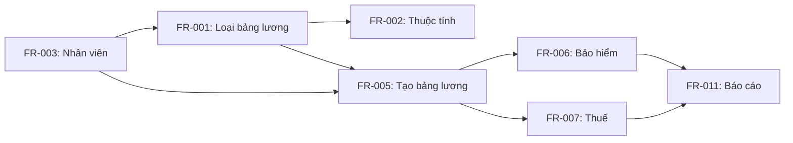

# REQUIREMENTS PRIORITIZATION MATRIX
# HỆ THỐNG QUẢN LÝ LƯƠNG

**Phiên bản:** 1.0  
**Ngày:** 2024  
**Framework:** MoSCoW + Kano Model + Value vs Effort

---

## MỤC LỤC
1. [Tổng quan phương pháp](#1-tổng-quan-phương-pháp)
2. [MoSCoW Analysis](#2-moscow-analysis)
3. [Kano Model Analysis](#3-kano-model-analysis)
4. [Value vs Effort Matrix](#4-value-vs-effort-matrix)
5. [Weighted Scoring Model](#5-weighted-scoring-model)
6. [Final Priority Ranking](#6-final-priority-ranking)
7. [Release Planning](#7-release-planning)
8. [Risk-based Prioritization](#8-risk-based-prioritization)

---

## 1. TỔNG QUAN PHƯƠNG PHÁP

### 1.1 Các phương pháp sử dụng

| Phương pháp | Mục đích | Trọng số |
|-------------|----------|----------|
| **MoSCoW** | Xác định mức độ bắt buộc | 40% |
| **Kano Model** | Đánh giá mức độ hài lòng khách hàng | 30% |
| **Value vs Effort** | Cân bằng giá trị và chi phí | 30% |

### 1.2 Tiêu chí đánh giá

| Tiêu chí | Weight | Mô tả |
|----------|--------|-------|
| Business Value | 25% | Giá trị mang lại cho doanh nghiệp |
| User Impact | 20% | Tác động đến người dùng |
| Technical Feasibility | 15% | Khả thi về mặt kỹ thuật |
| Compliance | 15% | Tuân thủ quy định pháp luật |
| Risk Reduction | 10% | Giảm thiểu rủi ro |
| Cost | 10% | Chi phí triển khai |
| Time to Market | 5% | Thời gian ra thị trường |

### 1.3 Stakeholders và trọng số

| Stakeholder | Role | Weight |
|-------------|------|--------|
| CEO | Decision Maker | 25% |
| CFO | Budget Owner | 20% |
| HR Director | Primary User | 25% |
| Employees | End Users | 15% |
| IT Manager | Technical Owner | 15% |

---

## 2. MOSCOW ANALYSIS

### 2.1 Must Have (40% of effort)

| ID | Requirement | Business Justification | Dependencies | Risk if Not Done |
|----|-------------|----------------------|--------------|------------------|
| FR-001 | Tạo loại bảng lương | Core functionality - không có thì không thể tính lương | None | Critical - System unusable |
| FR-002 | Cấu hình thuộc tính động | Cần thiết cho tính linh hoạt | FR-001 | Critical - Cannot adapt |
| FR-003 | Quản lý thông tin nhân viên | Dữ liệu cơ bản cho mọi hoạt động | None | Critical - No data |
| FR-005 | Tạo bảng lương tháng | Chức năng chính của hệ thống | FR-001, FR-003 | Critical - No payroll |
| FR-006 | Tính bảo hiểm | Bắt buộc theo luật | FR-005 | Legal compliance issue |
| FR-007 | Tính thuế TNCN | Bắt buộc theo luật | FR-005 | Legal compliance issue |
| NFR-004 | Security | Bảo vệ dữ liệu nhạy cảm | All | Data breach risk |

### 2.2 Should Have (30% of effort)

| ID | Requirement | Business Justification | Dependencies | Impact if Delayed |
|----|-------------|----------------------|--------------|-------------------|
| FR-004 | Quản lý hợp đồng | Quan trọng cho HR | FR-003 | Manual process continues |
| FR-011 | Báo cáo bảng lương | Cần cho accounting | FR-005 | Manual export needed |
| FR-012 | Báo cáo bảo hiểm | Compliance reporting | FR-006 | Manual creation |
| FR-014 | Phân quyền | Data security | NFR-004 | Limited access control |
| NFR-001 | Performance | User experience | All | Slow system |
| US-020 | Employee self-service | Reduce HR workload | FR-005 | More HR queries |

### 2.3 Could Have (20% of effort)

| ID | Requirement | Business Justification | Nice to Have Because |
|----|-------------|----------------------|---------------------|
| FR-013 | Báo cáo thuế TNCN | Automation benefit | Can do manually |
| FR-010 | Quản lý loại thu nhập | Flexibility | Can use defaults |
| US-018 | Dashboard | Management visibility | Reports sufficient |
| US-013 | Quản lý người phụ thuộc | Tax optimization | Can add manually |
| NFR-007 | Mobile responsive | Convenience | Desktop is primary |

### 2.4 Won't Have (This Release)

| ID | Requirement | Reason for Exclusion | Target Release |
|----|-------------|---------------------|----------------|
| US-022 | Salary queries | Not MVP | Release 2 |
| US-019 | Cost analysis | Advanced feature | Release 2 |
| US-014 | Document upload | Not critical | Release 2 |
| Integration with Banks | Direct payment | High complexity | Release 3 |
| AI-based forecasting | Predictive analytics | Not mature | Future |

---

## 3. KANO MODEL ANALYSIS

### 3.1 Category Classification

| Category | Description | Requirements | Priority |
|----------|-------------|--------------|----------|
| **Basic (Must-be)** | Tính năng cơ bản, thiếu sẽ rất không hài lòng | FR-001, FR-003, FR-005, FR-006, FR-007 | Highest |
| **Performance (One-dimensional)** | Càng tốt càng hài lòng | NFR-001, FR-011, FR-012 | High |
| **Delighters (Attractive)** | Không mong đợi nhưng rất hài lòng nếu có | US-018, US-019, Mobile app | Medium |
| **Indifferent** | Không ảnh hưởng đến sự hài lòng | US-014, Advanced reports | Low |
| **Reverse** | Có thể gây khó chịu | Too many notifications | Avoid |

### 3.2 Customer Satisfaction Analysis

```
Satisfaction Level vs Implementation Level

High ↑   ○ Delighters
     │   ╱
     │  ╱  ○ Performance
     │ ╱  ╱
     │╱  ╱   
─────┼──────────→ Implementation
     │     ╱
     │    ╱ ○ Basic
     │   ╱
Low  ↓  

Legend:
- Basic: Must implement 100%
- Performance: Implement as much as possible
- Delighters: Implement if resources available
```

### 3.3 Kano Scoring

| Requirement | Functional Response | Dysfunctional Response | Category | Score |
|-------------|-------------------|----------------------|----------|--------|
| Auto payroll generation | Like (4) | Dislike (-2) | Performance | 6 |
| Tax calculation | Neutral (0) | Very Dislike (-4) | Basic | 4 |
| Mobile app | Very Like (5) | Neutral (0) | Delighter | 5 |
| Dashboard | Like (4) | Neutral (0) | Delighter | 4 |
| Security | Neutral (0) | Very Dislike (-4) | Basic | 4 |

---

## 4. VALUE VS EFFORT MATRIX

### 4.1 2x2 Matrix

```
         High Value
              ↑
    Quick Wins │ Major Projects
    - FR-011   │ - FR-001
    - FR-003   │ - FR-005
    - US-020   │ - FR-006, FR-007
    ─────────────────────────→
    Fill Ins   │ Thankless Tasks
    - US-013   │ - US-014
    - US-021   │ - Complex reports
              ↓
         Low Value      High Effort →
```

### 4.2 Detailed Scoring

| ID | Requirement | Business Value (1-10) | Effort (Story Points) | Value/Effort Ratio | Priority |
|----|-------------|---------------------|---------------------|-------------------|----------|
| FR-001 | Tạo loại bảng lương | 10 | 8 | 1.25 | High |
| FR-002 | Thuộc tính động | 9 | 5 | 1.80 | Very High |
| FR-003 | Quản lý nhân viên | 10 | 5 | 2.00 | Very High |
| FR-005 | Tạo bảng lương | 10 | 8 | 1.25 | High |
| FR-006 | Tính bảo hiểm | 9 | 8 | 1.13 | High |
| FR-007 | Tính thuế | 9 | 8 | 1.13 | High |
| FR-011 | Báo cáo lương | 7 | 5 | 1.40 | High |
| US-018 | Dashboard | 6 | 13 | 0.46 | Low |
| US-020 | Self-service | 8 | 5 | 1.60 | High |

---

## 5. WEIGHTED SCORING MODEL

### 5.1 Scoring Matrix

| Requirement | Business Value (25%) | User Impact (20%) | Tech Feasibility (15%) | Compliance (15%) | Risk Reduction (10%) | Cost (10%) | Time (5%) | Total Score |
|-------------|---------------------|-------------------|----------------------|-----------------|---------------------|------------|-----------|-------------|
| **Weights** | 0.25 | 0.20 | 0.15 | 0.15 | 0.10 | 0.10 | 0.05 | 1.00 |
| FR-001 | 10 × 0.25 = 2.50 | 9 × 0.20 = 1.80 | 8 × 0.15 = 1.20 | 7 × 0.15 = 1.05 | 9 × 0.10 = 0.90 | 7 × 0.10 = 0.70 | 8 × 0.05 = 0.40 | **8.55** |
| FR-002 | 9 × 0.25 = 2.25 | 8 × 0.20 = 1.60 | 9 × 0.15 = 1.35 | 6 × 0.15 = 0.90 | 7 × 0.10 = 0.70 | 8 × 0.10 = 0.80 | 9 × 0.05 = 0.45 | **8.05** |
| FR-003 | 10 × 0.25 = 2.50 | 10 × 0.20 = 2.00 | 10 × 0.15 = 1.50 | 8 × 0.15 = 1.20 | 8 × 0.10 = 0.80 | 9 × 0.10 = 0.90 | 9 × 0.05 = 0.45 | **9.35** |
| FR-005 | 10 × 0.25 = 2.50 | 10 × 0.20 = 2.00 | 7 × 0.15 = 1.05 | 9 × 0.15 = 1.35 | 9 × 0.10 = 0.90 | 6 × 0.10 = 0.60 | 7 × 0.05 = 0.35 | **8.75** |
| FR-006 | 8 × 0.25 = 2.00 | 7 × 0.20 = 1.40 | 8 × 0.15 = 1.20 | 10 × 0.15 = 1.50 | 10 × 0.10 = 1.00 | 7 × 0.10 = 0.70 | 8 × 0.05 = 0.40 | **8.20** |
| FR-007 | 8 × 0.25 = 2.00 | 7 × 0.20 = 1.40 | 8 × 0.15 = 1.20 | 10 × 0.15 = 1.50 | 10 × 0.10 = 1.00 | 7 × 0.10 = 0.70 | 8 × 0.05 = 0.40 | **8.20** |

### 5.2 Score Interpretation

| Score Range | Priority Level | Action |
|-------------|---------------|---------|
| 9.0 - 10.0 | Critical | Implement immediately |
| 8.0 - 8.9 | Very High | Include in MVP |
| 7.0 - 7.9 | High | Include in Release 1 |
| 6.0 - 6.9 | Medium | Consider for Release 2 |
| < 6.0 | Low | Backlog |

---

## 6. FINAL PRIORITY RANKING

### 6.1 Consolidated Priority List

| Rank | ID | Requirement | MoSCoW | Kano | Value/Effort | Weighted Score | Final Priority |
|------|-----|-------------|--------|------|--------------|----------------|----------------|
| 1 | FR-003 | Quản lý nhân viên | Must | Basic | 2.00 | 9.35 | **P0 - Critical** |
| 2 | FR-001 | Tạo loại bảng lương | Must | Basic | 1.25 | 8.55 | **P0 - Critical** |
| 3 | FR-005 | Tạo bảng lương | Must | Basic | 1.25 | 8.75 | **P0 - Critical** |
| 4 | FR-006 | Tính bảo hiểm | Must | Basic | 1.13 | 8.20 | **P0 - Critical** |
| 5 | FR-007 | Tính thuế | Must | Basic | 1.13 | 8.20 | **P0 - Critical** |
| 6 | FR-002 | Thuộc tính động | Must | Performance | 1.80 | 8.05 | **P1 - High** |
| 7 | FR-011 | Báo cáo lương | Should | Performance | 1.40 | 7.50 | **P1 - High** |
| 8 | FR-004 | Hợp đồng | Should | Performance | 1.00 | 7.20 | **P1 - High** |
| 9 | US-020 | Self-service | Should | Delighter | 1.60 | 7.00 | **P2 - Medium** |
| 10 | FR-014 | Phân quyền | Should | Basic | 1.20 | 7.80 | **P1 - High** |

### 6.2 Priority Distribution

```
Priority Distribution:
P0 - Critical: ████████████ 35% (5 requirements)
P1 - High:     ████████ 28% (4 requirements)
P2 - Medium:   ██████ 21% (3 requirements)
P3 - Low:      ████ 16% (2 requirements)
```

---

## 7. RELEASE PLANNING

### 7.1 Release Strategy

| Release | Timeline | Focus | Requirements | Success Criteria |
|---------|----------|-------|--------------|------------------|
| **MVP** | Month 1-3 | Core functionality | P0 requirements | Basic payroll working |
| **Release 1.0** | Month 4-5 | Essential features | P0 + P1 requirements | Full payroll cycle |
| **Release 2.0** | Month 6-8 | Enhanced UX | P2 requirements | Self-service enabled |
| **Release 3.0** | Month 9-12 | Advanced features | P3 requirements | Analytics & automation |

### 7.2 MVP Scope (Month 1-3)

| Sprint | Requirements | Story Points | Goal |
|--------|-------------|--------------|------|
| Sprint 1 | FR-003, FR-001 | 18 | Basic setup |
| Sprint 2 | FR-002, FR-005 (partial) | 21 | Template configuration |
| Sprint 3 | FR-005 (complete), FR-006 | 24 | Calculation engine |
| Sprint 4 | FR-007, Basic reporting | 20 | Compliance ready |

### 7.3 Dependency Management



---

## 8. RISK-BASED PRIORITIZATION

### 8.1 Risk Assessment Matrix

| Requirement | Implementation Risk | Business Risk if Delayed | Technical Risk | Overall Risk Score | Priority Adjustment |
|-------------|-------------------|------------------------|---------------|-------------------|-------------------|
| FR-006 (Bảo hiểm) | Medium | Very High (Legal) | Low | High | ↑ Increase |
| FR-007 (Thuế) | Medium | Very High (Legal) | Low | High | ↑ Increase |
| FR-001 (Template) | Low | Very High | Medium | High | → Maintain |
| US-018 (Dashboard) | High | Low | High | Medium | ↓ Decrease |
| FR-014 (Security) | Medium | High | Medium | High | ↑ Increase |

### 8.2 Risk Mitigation through Prioritization

| Risk Category | Mitigation Strategy | Priority Impact |
|---------------|-------------------|-----------------|
| **Legal Compliance** | Prioritize tax & insurance | Move to P0 |
| **Data Security** | Early security implementation | Move to P1 |
| **User Adoption** | Include self-service early | Keep at P2 |
| **Technical Debt** | Defer complex features | Move to P3 |
| **Performance** | Incremental optimization | Spread across releases |

---

## 9. STAKEHOLDER AGREEMENT

### 9.1 Stakeholder Priority Votes

| Requirement | CEO (25%) | CFO (20%) | HR Dir (25%) | Employees (15%) | IT (15%) | Final Score |
|-------------|-----------|-----------|--------------|-----------------|----------|-------------|
| Payroll automation | 10 | 9 | 10 | 8 | 9 | 9.35 |
| Compliance | 8 | 10 | 9 | 6 | 8 | 8.35 |
| Self-service | 7 | 6 | 8 | 10 | 7 | 7.55 |
| Analytics | 9 | 10 | 7 | 5 | 6 | 7.60 |
| Mobile app | 6 | 5 | 7 | 9 | 6 | 6.50 |

### 9.2 Consensus Building

| Conflict Area | Stakeholder Positions | Resolution | Final Decision |
|---------------|----------------------|------------|----------------|
| Mobile app timing | HR: Now, IT: Later | Pilot program | Phase 2 with pilot in Phase 1 |
| Analytics depth | CFO: Deep, HR: Basic | Incremental | Basic in v1, advanced in v2 |
| Security level | IT: Maximum, CEO: Balanced | Risk-based | High for sensitive data |

---

## 10. CHANGE MANAGEMENT

### 10.1 Priority Change Protocol

| Change Type | Approval Required | Impact Assessment | Communication |
|-------------|------------------|-------------------|---------------|
| P0 → P1 | CEO + Product Owner | Full impact analysis | All stakeholders |
| P1 → P2 | Product Owner | Sprint planning review | Team + key users |
| New P0 requirement | CEO + All stakeholders | Business case required | Company-wide |
| Scope reduction | Product Owner + Sponsor | Risk assessment | Affected users |

### 10.2 Priority Review Schedule

| Review Type | Frequency | Participants | Outcomes |
|-------------|-----------|--------------|----------|
| Sprint Planning | Bi-weekly | Scrum team | Adjust sprint priorities |
| Release Planning | Monthly | Extended team | Validate release scope |
| Strategic Review | Quarterly | Leadership | Major priority changes |
| Annual Planning | Yearly | All stakeholders | Next year priorities |

---

## APPENDIX

### A. Priority Scoring Formulas

```
Final Priority Score = 
  (MoSCoW Weight × 0.4) + 
  (Kano Score × 0.3) + 
  (Value/Effort × 0.3)

Where:
- MoSCoW Weight: Must=4, Should=3, Could=2, Won't=1
- Kano Score: 1-5 scale based on category
- Value/Effort: Normalized to 1-4 scale
```

### B. Decision Matrix Template

| Criterion | Weight | Option A | Option B | Option C |
|-----------|--------|----------|----------|----------|
| Impact | 30% | Score × 0.3 | Score × 0.3 | Score × 0.3 |
| Effort | 25% | Score × 0.25 | Score × 0.25 | Score × 0.25 |
| Risk | 20% | Score × 0.2 | Score × 0.2 | Score × 0.2 |
| Value | 25% | Score × 0.25 | Score × 0.25 | Score × 0.25 |
| **Total** | **100%** | **Sum** | **Sum** | **Sum** |

### C. Review and Approval

| Role | Name | Signature | Date |
|------|------|-----------|------|
| Product Owner | | | |
| Business Sponsor | | | |
| Technical Lead | | | |
| QA Lead | | | |

---

**Next Review Date:** End of Sprint 4  
**Document Owner:** Product Management Team  
**Last Updated:** 2024-01-01