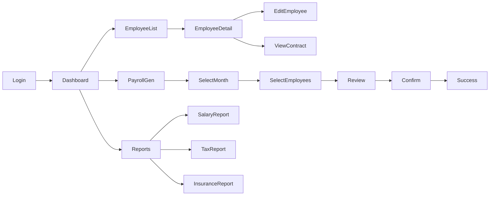

# PROTOTYPE & MOCKUP DOCUMENTATION
# HỆ THỐNG QUẢN LÝ LƯƠNG

**Phiên bản:** 1.0  
**Ngày:** 2024  
**Design Tool:** Figma / Adobe XD

---

## MỤC LỤC
1. [Tổng quan thiết kế](#1-tổng-quan-thiết-kế)
2. [Design System](#2-design-system)  
3. [Information Architecture](#3-information-architecture)
4. [Wireframes - Low Fidelity](#4-wireframes---low-fidelity)
5. [Mockups - High Fidelity](#5-mockups---high-fidelity)
6. [Interactive Prototype](#6-interactive-prototype)
7. [Mobile Responsive Design](#7-mobile-responsive-design)
8. [Usability Guidelines](#8-usability-guidelines)

---

## 1. TỔNG QUAN THIẾT KẾ

### 1.1 Design Principles

| Nguyên tắc | Mô tả | Ứng dụng |
|------------|-------|----------|
| **Simplicity** | Giao diện đơn giản, rõ ràng | Tối đa 3 clicks cho mọi tác vụ |
| **Consistency** | Nhất quán trong toàn hệ thống | Sử dụng design system thống nhất |
| **Efficiency** | Tối ưu hiệu suất làm việc | Shortcuts, bulk actions |
| **Clarity** | Thông tin rõ ràng, dễ hiểu | Labels, tooltips, help text |
| **Accessibility** | Tiếp cận được với mọi người dùng | WCAG 2.1 AA compliance |

### 1.2 User Interface Goals

- Giảm 50% thời gian training
- Tăng 80% tốc độ xử lý công việc  
- Giảm 90% lỗi do người dùng
- Đạt 4.5/5 điểm satisfaction score

### 1.3 Target Devices

| Device | Resolution | Priority | Usage |
|--------|------------|----------|-------|
| Desktop | 1920×1080 | Primary | 70% |
| Laptop | 1366×768 | Primary | 20% |
| Tablet | 768×1024 | Secondary | 7% |
| Mobile | 375×812 | Secondary | 3% |

---

## 2. DESIGN SYSTEM

### 2.1 Color Palette

```
Primary Colors:
├── Primary: #2563EB (Blue 600) - Main actions, links
├── Secondary: #10B981 (Green 500) - Success, positive
├── Accent: #F59E0B (Amber 500) - Warnings, attention
└── Danger: #EF4444 (Red 500) - Errors, delete

Neutral Colors:
├── Gray 900: #111827 - Main text
├── Gray 700: #374151 - Secondary text
├── Gray 500: #6B7280 - Placeholder, disabled
├── Gray 300: #D1D5DB - Borders
├── Gray 100: #F3F4F6 - Background
└── White: #FFFFFF - Cards, modals
```

### 2.2 Typography

```
Font Family: Inter, system-ui

Heading Scales:
├── H1: 32px/40px - 600 weight - Page titles
├── H2: 24px/32px - 600 weight - Section headers
├── H3: 20px/28px - 600 weight - Sub-sections
├── H4: 16px/24px - 600 weight - Card titles
└── H5: 14px/20px - 600 weight - Small headers

Body Text:
├── Large: 16px/24px - 400 weight - Main content
├── Base: 14px/20px - 400 weight - Default text
├── Small: 12px/16px - 400 weight - Helper text
└── Tiny: 10px/12px - 400 weight - Labels
```

### 2.3 Spacing System

```
Base unit: 4px

Spacing Scale:
├── xs: 4px
├── sm: 8px
├── md: 16px
├── lg: 24px
├── xl: 32px
├── 2xl: 48px
└── 3xl: 64px
```

### 2.4 Component Library

| Component | Variants | States | Usage |
|-----------|----------|--------|-------|
| Button | Primary, Secondary, Ghost, Danger | Default, Hover, Active, Disabled | Actions |
| Input | Text, Number, Date, Select | Default, Focus, Error, Disabled | Data entry |
| Card | Default, Elevated, Bordered | Default, Hover, Selected | Content container |
| Table | Basic, Sortable, Selectable | Default, Loading, Empty | Data display |
| Modal | Small, Medium, Large | Open, Closing | Dialogs |
| Toast | Success, Error, Warning, Info | Visible, Hiding | Notifications |

---

## 3. INFORMATION ARCHITECTURE

### 3.1 Site Map

```
Root
├── Dashboard
│   ├── Overview
│   ├── Quick Actions
│   └── Notifications
├── Nhân viên
│   ├── Danh sách nhân viên
│   ├── Thêm nhân viên
│   ├── Chi tiết nhân viên
│   └── Hợp đồng lao động
├── Bảng lương
│   ├── Cấu hình loại bảng lương
│   ├── Tạo bảng lương tháng
│   ├── Xem/Sửa bảng lương
│   └── Phê duyệt bảng lương
├── Báo cáo
│   ├── Báo cáo lương
│   ├── Báo cáo bảo hiểm
│   ├── Báo cáo thuế
│   └── Thống kê
└── Cấu hình
    ├── Quy định bảo hiểm
    ├── Biểu thuế
    ├── Loại thu nhập
    └── Phân quyền

```

### 3.2 Navigation Structure

```
Primary Navigation (Top Bar):
[Logo] [Dashboard] [Nhân viên] [Bảng lương] [Báo cáo] [Cấu hình] ... [User Menu]

Secondary Navigation (Sidebar):
- Context-sensitive based on section
- Collapsible for more screen space
- Quick actions at bottom

Breadcrumbs:
Home > Section > Subsection > Current Page
```

---

## 4. WIREFRAMES - LOW FIDELITY

### 4.1 Dashboard Wireframe

```
┌─────────────────────────────────────────────────────────┐
│ [Logo] Dashboard  Nhân viên  Bảng lương  Báo cáo    [👤] │
├─────────────────────────────────────────────────────────┤
│                                                          │
│  Tổng quan tháng 10/2024                               │
│  ┌─────────────┐ ┌─────────────┐ ┌─────────────┐      │
│  │ Tổng lương  │ │ Nhân viên   │ │ Đã duyệt    │      │
│  │ 500,000,000 │ │ 150 người   │ │ 145/150     │      │
│  └─────────────┘ └─────────────┘ └─────────────┘      │
│                                                          │
│  Quick Actions                                          │
│  [Tạo bảng lương] [Import chấm công] [Xuất báo cáo]   │
│                                                          │
│  ┌─────────────────────────────────────────────┐      │
│  │ Biểu đồ chi phí lương theo tháng             │      │
│  │ [====Chart Area====]                         │      │
│  └─────────────────────────────────────────────┘      │
│                                                          │
│  Recent Activities                                      │
│  • Admin đã tạo bảng lương tháng 10 - 2 giờ trước     │
│  • 5 nhân viên mới được thêm - 5 giờ trước           │
│  • Quy định BH được cập nhật - 1 ngày trước          │
└─────────────────────────────────────────────────────────┘
```

### 4.2 Employee List Wireframe

```
┌─────────────────────────────────────────────────────────┐
│ Home > Nhân viên > Danh sách                      [👤]  │
├─────────────────────────────────────────────────────────┤
│                                                          │
│ Danh sách nhân viên                                    │
│                                                          │
│ [🔍 Tìm kiếm...] [Filter▼] [+ Thêm nhân viên] [Export] │
│                                                          │
│ ┌────┬──────────┬──────────┬────────┬────────┬──────┐ │
│ │ □  │ Mã NV    │ Họ tên   │ Phòng  │ Lương  │ Action│ │
│ ├────┼──────────┼──────────┼────────┼────────┼──────┤ │
│ │ □  │ NV001    │ Nguyễn A │ IT     │ 15M    │ ⋮    │ │
│ │ □  │ NV002    │ Trần B   │ HR     │ 12M    │ ⋮    │ │
│ │ □  │ NV003    │ Lê C     │ Sales  │ 10M    │ ⋮    │ │
│ └────┴──────────┴──────────┴────────┴────────┴──────┘ │
│                                                          │
│ Showing 1-10 of 150  [<] [1] [2] [3] ... [15] [>]     │
└─────────────────────────────────────────────────────────┘
```

### 4.3 Salary Template Configuration Wireframe

```
┌─────────────────────────────────────────────────────────┐
│ Home > Bảng lương > Cấu hình loại                 [👤]  │
├─────────────────────────────────────────────────────────┤
│                                                         │
│ Cấu hình loại bảng lương                                │
│                                                          │
│ Thông tin cơ bản                                       │
│ ┌─────────────────────────────────────────────┐       │
│ │ Tên loại: [Bảng lương nhân viên IT         ] │       │
│ │ Phòng ban áp dụng : [IT Department      ▼  ] │       │
│ │ Mô tả: [...................................]│       │
│ └─────────────────────────────────────────────┘       │
│                                                          │
│ Thuộc tính bảng lương                                  │
│ ┌────────────┬──────────┬────────┬──────────┐        │
│ │ Tên cột    │ Mã      │ Loại   │ Công thức│        │
│ ├────────────┼──────────┼────────┼──────────┤        │
│ │ Lương CB   │ LUONG_CB │ System │ -        │        │
│ │ Công chuẩn │ CONG_CH  │ Number │ 22       │        │
│ │ Công TT    │ CONG_TT  │ Manual │ -        │        │
│ │ + Add new attribute                        │        │
│ └────────────────────────────────────────────┘        │
│                                                          │
│ [Cancel] [Save as Draft] [Save & Activate]            │
└─────────────────────────────────────────────────────────┘
```

---

## 5. MOCKUPS - HIGH FIDELITY

### 5.1 Login Screen

**Visual Description:**
- Centered login box với gradient background
- Logo công ty ở trên cùng
- 2 input fields với icons (user, lock)
- Remember me checkbox và Forgot password link
- Primary button cho Sign In
- Security badges ở footer

**Key Elements:**
```
Background: Linear gradient (#2563EB → #1E40AF)
Card: White với shadow-xl, rounded-lg
Inputs: Border gray-300, focus:border-primary
Button: bg-primary, hover:bg-primary-dark
```

### 5.2 Dashboard Screen

**Visual Description:**
- Clean white background với gray-100 sections
- 3 KPI cards với colored icons và trending indicators
- Line chart cho salary trend (Chart.js)
- Activity feed với timestamps
- Quick action buttons với primary colors

**Components Used:**
- KPI Card component với icon slot
- Chart component (responsive)
- Activity List với avatar và timestamp
- Button group cho quick actions

### 5.3 Payroll Generation Screen

**Visual Description:**
- Step indicator (1. Select → 2. Configure → 3. Review → 4. Confirm)
- Month/Year selector với calendar widget
- Employee selection với search và filters
- Progress bar during generation
- Results summary với success/error counts

**Interactive Elements:**
- Dropdown cho month/year selection
- Checkbox tree cho department/employee selection
- Real-time progress updates
- Expandable error details

### 5.4 Employee Payslip View

**Visual Description:**
- Header với employee info và photo
- Earnings section (green accent)
- Deductions section (red accent)
- Net pay highlighted (large font, primary color)
- Download và Print buttons

**Layout:**
```
┌─────────────────────────────────┐
│ Employee Info    │    Photo     │
├─────────────────┴───────────────┤
│ Earnings                        │
│ ├── Basic Salary    15,000,000  │
│ ├── Allowances       2,000,000  │
│ └── Total           17,000,000  │
├──────────────────────────────────┤
│ Deductions                      │
│ ├── Insurance        1,500,000  │
│ ├── Tax              1,000,000  │
│ └── Total            2,500,000  │
├──────────────────────────────────┤
│ NET PAY            14,500,000   │
└──────────────────────────────────┘
```

---

## 6. INTERACTIVE PROTOTYPE

### 6.1 Prototype Flow



### 6.2 Interaction Specifications

| Screen | Trigger | Action | Result | Animation |
|--------|---------|--------|--------|-----------|
| Login | Click "Sign In" | Validate credentials | Navigate to Dashboard | Fade transition |
| Dashboard | Click KPI Card | Show detailed breakdown | Modal opens | Slide up |
| Employee List | Click row | View employee details | Navigate to detail page | Slide left |
| Payroll | Click "Generate" | Start generation process | Show progress bar | Progress animation |
| Reports | Select date range | Filter data | Update chart/table | Smooth transition |

### 6.3 Micro-interactions

```
Button States:
- Default: background-color with 0.2s ease
- Hover: Darken 10%, scale(1.02)
- Active: Scale(0.98)
- Loading: Spinner animation

Form Validation:
- Real-time validation on blur
- Error: Red border, shake animation
- Success: Green checkmark fade-in

Notifications:
- Toast slides in from top-right
- Auto-dismiss after 5s
- Manual dismiss on click
```

---

## 7. MOBILE RESPONSIVE DESIGN

### 7.1 Responsive Breakpoints

| Breakpoint | Width | Layout Changes |
|------------|-------|----------------|
| Mobile | < 640px | Single column, hamburger menu |
| Tablet | 640-1024px | 2 columns, collapsible sidebar |
| Desktop | > 1024px | Full layout, persistent sidebar |

### 7.2 Mobile-Specific Adaptations

```
Navigation:
- Hamburger menu replacing top nav
- Bottom tab bar for quick access
- Swipe gestures for navigation

Tables:
- Horizontal scroll for wide tables
- Card view alternative for data
- Expandable rows for details

Forms:
- Full-width inputs
- Native date/time pickers
- Larger touch targets (min 44px)

Charts:
- Simplified visualizations
- Touch-friendly interactions
- Rotate prompt for landscape
```

### 7.3 Mobile Wireframe Example

```
┌─────────────────┐
│ ☰  Payroll  👤  │
├─────────────────┤
│ October 2024    │
├─────────────────┤
│ ┌─────────────┐ │
│ │ Total       │ │
│ │ 500M VND    │ │
│ └─────────────┘ │
│ ┌─────────────┐ │
│ │ Employees   │ │
│ │ 150         │ │
│ └─────────────┘ │
├─────────────────┤
│ Quick Actions   │
│ [Generate]      │
│ [Import]        │
│ [Export]        │
├─────────────────┤
│ 🏠  📊  👥  ⚙️  │
└─────────────────┘
```

---

## 8. USABILITY GUIDELINES

### 8.1 Accessibility Requirements

| Requirement | Implementation | Testing |
|------------|----------------|---------|
| **Keyboard Navigation** | Tab order, focus indicators | Manual testing |
| **Screen Reader** | ARIA labels, semantic HTML | NVDA/JAWS |
| **Color Contrast** | WCAG AA (4.5:1 text, 3:1 UI) | Automated tools |
| **Text Scaling** | Support up to 200% zoom | Browser testing |
| **Alternative Text** | All images and icons | Accessibility audit |

### 8.2 Error Handling

```
Error Message Structure:
┌─────────────────────────────┐
│ ⚠️ Error Type              │
│                             │
│ What went wrong:            │
│ Clear explanation           │
│                             │
│ How to fix:                │
│ • Step 1                    │
│ • Step 2                    │
│                             │
│ [Try Again] [Get Help]      │
└─────────────────────────────┘
```

### 8.3 Loading States

| State | Visual | Message | Action |
|-------|--------|---------|--------|
| Initial Load | Skeleton screen | - | - |
| Data Fetching | Spinner | "Loading..." | - |
| Processing | Progress bar | "Processing X of Y" | Cancel option |
| Success | Green checkmark | "Complete!" | Auto-dismiss |
| Error | Red X | Error message | Retry option |

### 8.4 Empty States

```
Design Pattern:
┌─────────────────────────────┐
│                             │
│      [Illustration]         │
│                             │
│    No data found           │
│                             │
│  Helpful description text   │
│                             │
│   [Primary Action Button]   │
│                             │
└─────────────────────────────┘
```

---

## 9. USER TESTING SCENARIOS

### 9.1 Task Flows for Testing

| Task | Steps | Success Criteria | Time Limit |
|------|-------|------------------|------------|
| Create payroll | 1. Navigate to Payroll<br>2. Select month<br>3. Generate<br>4. Review<br>5. Approve | Payroll created successfully | 5 minutes |
| Add employee | 1. Go to Employees<br>2. Click Add<br>3. Fill form<br>4. Save | Employee added to list | 3 minutes |
| View report | 1. Navigate to Reports<br>2. Select type<br>3. Set filters<br>4. Export | Report downloaded | 2 minutes |

### 9.2 Usability Metrics

| Metric | Target | Measurement Method |
|--------|--------|-------------------|
| Task Success Rate | > 95% | Completion tracking |
| Time on Task | < Target time | Timer measurement |
| Error Rate | < 1 per task | Error counting |
| Satisfaction | > 4.0/5.0 | Post-task survey |
| Learnability | < 30 min | Training time |

---

## 10. DESIGN HANDOFF

### 10.1 Assets for Development

| Asset Type | Format | Naming Convention | Location |
|------------|--------|------------------|----------|
| Icons | SVG | icon-{name}-{size}.svg | /assets/icons |
| Images | PNG/WebP | img-{context}-{name}.png | /assets/images |
| Fonts | WOFF2 | font-{family}-{weight}.woff2 | /assets/fonts |
| Colors | CSS/JSON | colors.css / colors.json | /tokens |

### 10.2 Component Documentation

```javascript
// Button Component Example
<Button
  variant="primary|secondary|danger"
  size="small|medium|large"
  disabled={boolean}
  loading={boolean}
  icon={IconComponent}
  onClick={handler}
>
  Button Text
</Button>

// Props Documentation
- variant: Visual style of button
- size: Button size
- disabled: Disable interaction
- loading: Show loading spinner
- icon: Optional icon component
- onClick: Click event handler
```

### 10.3 Design Tokens

```css
/* Spacing Tokens */
--spacing-xs: 4px;
--spacing-sm: 8px;
--spacing-md: 16px;
--spacing-lg: 24px;

/* Color Tokens */
--color-primary: #2563EB;
--color-success: #10B981;
--color-danger: #EF4444;

/* Typography Tokens */
--font-size-base: 14px;
--font-weight-normal: 400;
--font-weight-bold: 600;

/* Border Radius */
--radius-sm: 4px;
--radius-md: 8px;
--radius-lg: 12px;
```

---

## APPENDIX

### A. Prototype Links

- **Figma Prototype**: [figma.com/project-link]
- **Interactive Demo**: [demo.project.com]
- **Design System**: [design.project.com]
- **Component Storybook**: [storybook.project.com]

### B. Version History

| Version | Date | Changes | Author |
|---------|------|---------|--------|
| 0.1 | 2024-01-01 | Initial wireframes | Design Team |
| 0.2 | 2024-01-15 | High-fidelity mockups | Design Team |
| 1.0 | 2024-02-01 | Final prototype | Design Team |

### C. Feedback Log

| Date | Reviewer | Feedback | Action Taken |
|------|----------|----------|--------------|
| 2024-01-10 | HR Manager | Need bulk actions | Added to v1.0 |
| 2024-01-20 | Users | Want dark mode | Planned for v2.0 |

---

**Document Sign-off:**

| Role | Name | Date |
|------|------|------|
| UX Designer | | |
| Product Owner | | |
| Development Lead | | |
| QA Lead | | |