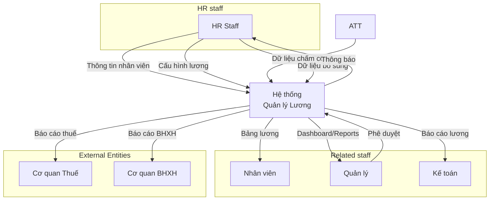
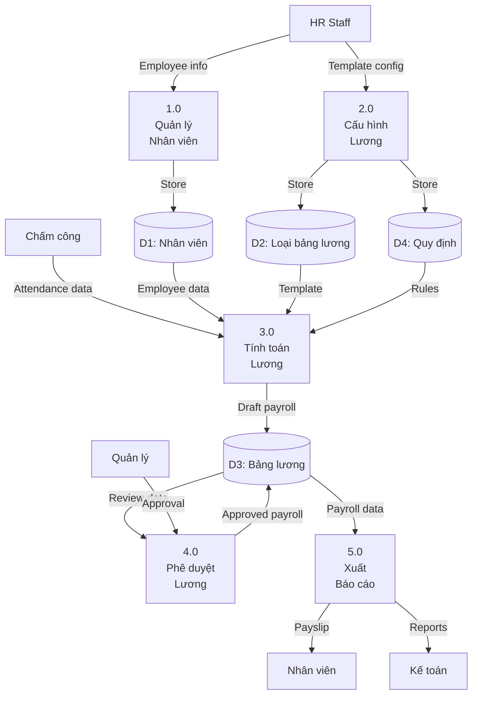
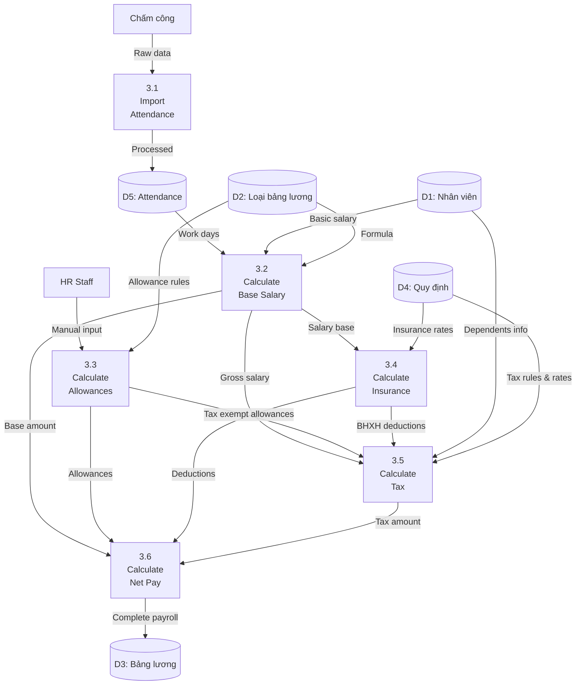
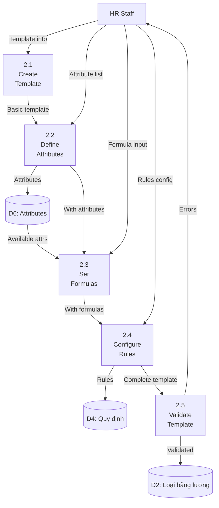

# DATA FLOW DIAGRAM (DFD)
# HỆ THỐNG QUẢN LÝ LƯƠNG

**Phiên bản:** 1.0  
**Ngày:** 2024  
**Notation:** Gane-Sarson

---

## MỤC LỤC
1. [Giới thiệu](#1-giới-thiệu)
2. [Context Diagram (Level 0)](#2-context-diagram-level-0)
3. [Level 1 DFD - System Overview](#3-level-1-dfd---system-overview)
4. [Level 2 DFD - Detailed Processes](#4-level-2-dfd---detailed-processes)
5. [Data Dictionary](#5-data-dictionary)
6. [Process Specifications](#6-process-specifications)
7. [Data Store Specifications](#7-data-store-specifications)
8. [External Entity Specifications](#8-external-entity-specifications)

---

## 1. GIỚI THIỆU

### 1.1 Mục đích
Data Flow Diagram (DFD) mô tả luồng dữ liệu trong hệ thống quản lý lương, giúp:
- Hiểu rõ cách dữ liệu di chuyển qua hệ thống
- Xác định các process chính và data store
- Phân tích điểm yếu trong luồng dữ liệu
- Làm cơ sở cho thiết kế database và architecture

### 1.2 Ký hiệu sử dụng (Gane-Sarson Notation)

```
┌─────────────┐     External Entity (Source/Sink)
│   Entity    │     Nguồn hoặc đích dữ liệu bên ngoài
└─────────────┘

┌─────────────┐     Process
│ 1.0         │     Xử lý hoặc biến đổi dữ liệu
│   Process   │     
└─────────────┘

═══════════════     Data Store
 D1 | Data Store    Nơi lưu trữ dữ liệu

─────────────→     Data Flow
  Flow Name        Luồng dữ liệu với tên
```

### 1.3 Phạm vi hệ thống
- **Trong phạm vi**: Quản lý nhân viên, tính lương, báo cáo, cấu hình
- **Ngoài phạm vi**: Chấm công (external), thanh toán ngân hàng (external)

---

## 2. CONTEXT DIAGRAM (LEVEL 0)

### 2.1 Diagram



### 2.2 External Entities Description

| Entity | Type | Description | Data Exchange |
|--------|------|-------------|---------------|
| Nhân viên | Sink | Người nhận lương | Nhận bảng lương, xem thông tin |
| HR Staff | Source/Sink | Quản lý nhân sự | Nhập/nhận dữ liệu nhân viên |
| Quản lý | Source/Sink | Phê duyệt, giám sát | Phê duyệt, xem báo cáo |
| Kế toán | Sink | Xử lý tài chính | Nhận báo cáo để thanh toán |
| Cơ quan Thuế | Sink | Thu thuế | Nhận báo cáo thuế TNCN |
| Cơ quan BHXH | Sink | Quản lý bảo hiểm | Nhận báo cáo BHXH |
| Hệ thống Chấm công | Source | Cung cấp dữ liệu công | Gửi dữ liệu chấm công |

---

## 3. LEVEL 1 DFD - SYSTEM OVERVIEW

### 3.1 Main Processes



### 3.2 Process Overview

| Process ID | Process Name | Purpose | Key Inputs | Key Outputs |
|------------|--------------|---------|------------|-------------|
| 1.0 | Quản lý Nhân viên | CRUD nhân viên | Employee info | Employee records |
| 2.0 | Cấu hình Lương | Setup templates | Config data | Salary templates |
| 3.0 | Tính toán Lương | Calculate payroll | Attendance, Rules | Draft payroll |
| 4.0 | Phê duyệt Lương | Review & approve | Draft payroll | Approved payroll |
| 5.0 | Xuất Báo cáo | Generate reports | Approved payroll | Various reports |

---

## 4. LEVEL 2 DFD - DETAILED PROCESSES

### 4.1 Process 3.0 - Tính toán Lương (Detailed)



### 4.2 Process 2.0 - Cấu hình Lương (Detailed)



---

## 5. DATA DICTIONARY

### 5.1 Data Elements

| Element Name | Type | Size | Format | Description | Validation |
|-------------|------|------|--------|-------------|------------|
| employee_id | String | 10 | NVXXXXXX | Mã nhân viên | Required, Unique |
| employee_name | String | 100 | Text | Họ tên nhân viên | Required |
| basic_salary | Decimal | 15,2 | 999,999,999.99 | Lương cơ bản | > 0 |
| work_days | Decimal | 5,2 | 99.99 | Số ngày công | 0-31 |
| insurance_rate | Decimal | 5,2 | 99.99% | Tỷ lệ bảo hiểm | 0-100 |
| tax_amount | Decimal | 15,2 | 999,999,999.99 | Tiền thuế | >= 0 |
| net_salary | Decimal | 15,2 | 999,999,999.99 | Lương thực nhận | >= 0 |
| month | Integer | 2 | MM | Tháng | 1-12 |
| year | Integer | 4 | YYYY | Năm | 2020-2099 |
| status | String | 20 | Text | Trạng thái | Draft/Approved/Paid |

### 5.2 Data Structures

#### Employee Record
```
Employee = {
    employee_id +
    employee_name +
    department +
    position +
    hire_date +
    contract_type +
    basic_salary +
    bank_account +
    tax_id +
    insurance_id
}
```

#### Payroll Record
```
Payroll = {
    payroll_id +
    employee_id +
    month +
    year +
    work_days +
    basic_amount +
    allowances[] +
    insurance_deductions +
    tax_deductions +
    net_salary +
    status +
    approval_date +
    approved_by
}
```

#### Salary Template
```
SalaryTemplate = {
    template_id +
    template_name +
    department +
    attributes[] {
        attribute_name +
        attribute_type +
        data_source +
        formula +
        required_flag
    } +
    created_date +
    modified_date
}
```

---

## 6. PROCESS SPECIFICATIONS

### 6.1 Process 3.2: Calculate Base Salary

**Process ID:** 3.2  
**Process Name:** Calculate Base Salary  
**Purpose:** Tính lương cơ bản dựa trên công thức

**Input:**
- Work days (số ngày chấm công được tính) từ D5 (Attendance)
- Basic salary từ D1 (lương cơ bản từ hợp đồng lao động Employee)
- Formula từ D2 (Template)

**Processing Logic:**
```pseudocode
BEGIN Calculate_Base_Salary
    GET employee.basic_salary
    GET attendance.work_days
    GET template.work_days_standard
    GET template.formula
    
    IF formula.type = "DAILY" THEN
        base_salary = basic_salary / work_days_standard * work_days
    ELSE IF formula.type = "MONTHLY" THEN
        IF work_days >= work_days_standard THEN
            base_salary = basic_salary
        ELSE
            base_salary = basic_salary * (work_days / work_days_standard)
        END IF
    END IF
    
    RETURN base_salary
END
```

**Output:**
- Base salary amount cho process 3.6

**Business Rules:**
- Làm tròn đến hàng nghìn
- Không được âm
- Không vượt quá lương cơ bản trong hợp đồng

### 6.2 Process 3.5: Calculate Tax

**Process ID:** 3.5  
**Process Name:** Calculate Tax
**Purpose:** Tính thuế TNCN theo biểu lũy tiến từ thu nhập GROSS (trước BHXH)

**Input:**
- Gross salary từ process 3.2 (Lương cơ bản)
- Tax exempt allowances từ process 3.3 (Phụ cấp không chịu thuế)
- BHXH deductions từ process 3.4 (Bảo hiểm đã trừ)
- Dependents info từ D1 (Thông tin người phụ thuộc)
- Tax rules & rates từ D4 (Quy định thuế)

**Processing Logic:**
```pseudocode
BEGIN Calculate_Tax
    // Thu thập thông tin đầu vào
    GET gross_salary FROM process_3.2  // Lương cơ bản TRƯỚC trừ BHXH
    GET taxable_allowances FROM process_3.3  // Phụ cấp chịu thuế
    GET tax_exempt_allowances FROM process_3.3  // Phụ cấp không chịu thuế
    GET bhxh_employee_contribution FROM process_3.4  // BHXH nhân viên đóng (8%)
    GET dependents_count FROM employee_record

    // ===== LOGIC TÍNH THUẾ TNCN THEO QUY ĐỊNH VIỆT NAM =====
    // Bước 1: Tính tổng thu nhập chịu thuế GROSS (chưa trừ BHXH)
    total_gross_income = gross_salary + taxable_allowances

    // Bước 2: Các khoản giảm trừ
    personal_deduction = 11,000,000  // Giảm trừ cá nhân 2024
    dependent_deduction = dependents_count * 4,400,000  // Giảm trừ người phụ thuộc

    // Bước 3: Thu nhập chịu thuế = GROSS - BHXH cá nhân đóng - Giảm trừ
    // (Theo Luật thuế TNCN: BHXH được trừ trước khi tính thuế)
    taxable_income = total_gross_income
                    - bhxh_employee_contribution  // Trừ BHXH cá nhân (8%)
                    - personal_deduction         // Trừ giảm trừ cá nhân
                    - dependent_deduction        // Trừ giảm trừ người phụ thuộc
    
    IF taxable_income <= 0 THEN
        RETURN 0
    END IF
    
    tax = 0
    FOR EACH bracket IN tax_brackets
        IF taxable_income > bracket.min THEN
            taxable_in_bracket = MIN(taxable_income - bracket.min, 
                                    bracket.max - bracket.min)
            tax = tax + taxable_in_bracket * bracket.rate
        END IF
    END FOR
    
    RETURN tax
END
```

**Output:**
- Tax amount cho process 3.6

---

## 7. DATA STORE SPECIFICATIONS

### 7.1 D1: Employee Data Store

| Attribute | Description | Key | Source |
|-----------|-------------|-----|--------|
| Store ID | D1 | - | - |
| Store Name | Nhân viên | - | - |
| Description | Lưu trữ thông tin nhân viên | - | - |
| Primary Key | employee_id | PK | - |
| Volume | ~1,000 records | - | - |
| Growth Rate | 10-20 records/month | - | - |
| Access Frequency | High (hourly) | - | - |
| Retention | Permanent | - | - |

**Main Processes:**
- Create: Process 1.0
- Read: Process 3.0, 5.0
- Update: Process 1.0
- Delete: Soft delete only

### 7.2 D3: Payroll Data Store

| Attribute | Description | Key | Source |
|-----------|-------------|-----|--------|
| Store ID | D3 | - | - |
| Store Name | Bảng lương | - | - |
| Description | Lưu trữ dữ liệu bảng lương | - | - |
| Primary Key | payroll_id | PK | - |
| Foreign Keys | employee_id | FK | D1 |
| Volume | ~12,000 records/year | - | - |
| Growth Rate | ~1,000 records/month | - | - |
| Access Frequency | Very High (continuous) | - | - |
| Retention | 7 years (legal requirement) | - | - |

**Main Processes:**
- Create: Process 3.0
- Read: Process 4.0, 5.0
- Update: Process 4.0
- Delete: Not allowed (audit trail)

### 7.3 D4: Rules Data Store

| Attribute | Description | Key | Source |
|-----------|-------------|-----|--------|
| Store ID | D4 | - | - |
| Store Name | Quy định | - | - |
| Description | Lưu trữ quy định BH, thuế | - | - |
| Primary Key | rule_id | PK | - |
| Volume | ~50 records | - | - |
| Growth Rate | 5-10 records/year | - | - |
| Access Frequency | Medium (daily) | - | - |
| Retention | Permanent with versioning | - | - |

---

## 8. EXTERNAL ENTITY SPECIFICATIONS

### 8.1 Attendance System Interface

**Entity:** Hệ thống Chấm công  
**Type:** Source System  
**Interface Type:** REST API / File Import

**Data Format:**
```json
{
    "employee_id": "NV000001",
    "month": 10,
    "year": 2024,
    "attendance_details": [
        {
            "date": "2024-10-01",
            "check_in": "08:00",
            "check_out": "17:30",
            "overtime_hours": 0,
            "leave_type": null
        }
    ],
    "summary": {
        "total_work_days": 22,
        "total_overtime": 8,
        "total_leave": 0
    }
}
```

**Frequency:** Monthly (25th of each month)  
**Volume:** ~1,000 records per batch  
**Protocol:** HTTPS with API authentication  
**Error Handling:** Retry mechanism with notification

### 8.2 Tax Authority Interface

**Entity:** Cơ quan Thuế  
**Type:** Sink System  
**Interface Type:** XML Export

**Required Reports:**
- Monthly tax declaration
- Annual tax finalization
- Employee tax certificates

**Data Format:** According to Tax Authority XML Schema v2.0  
**Submission:** Portal upload or API (when available)  
**Deadline:** 20th of following month  
**Validation:** XSD schema validation before submission

---

## 9. DATA FLOW ANALYSIS

### 9.1 Critical Data Flows

| Flow ID | From | To | Data | Volume/Month | Priority |
|---------|------|-----|------|--------------|----------|
| DF001 | Attendance System | Process 3.1 | Attendance data | 1,000 records | Critical |
| DF002 | Process 3.6 | D3 Payroll | Complete payroll | 1,000 records | Critical |
| DF003 | D3 Payroll | Process 5.0 | Approved payroll | 1,000 records | High |
| DF004 | Process 5.0 | Employees | Payslips | 1,000 documents | High |
| DF005 | Process 5.0 | Tax Authority | Tax report | 1 report | Critical |

### 9.2 Data Flow Bottlenecks

| Bottleneck | Location | Impact | Mitigation |
|------------|----------|--------|------------|
| Manual data entry | Process 3.3 | Delays, errors | Automation, validation |
| Approval process | Process 4.0 | Timeline delays | Parallel approval, reminders |
| Report generation | Process 5.0 | Performance | Caching, async processing |
| External integration | Attendance import | Data delays | Automated scheduling |

---

## 10. BALANCING AND VALIDATION

### 10.1 Balancing Check

**Level 0 to Level 1:**
- ✅ All external entities present
- ✅ All data flows accounted for
- ✅ No new external entities introduced

**Level 1 to Level 2:**
- ✅ Parent process inputs = Sum of child inputs
- ✅ Parent process outputs = Sum of child outputs
- ✅ Data stores consistent across levels

### 10.2 Validation Rules

| Rule | Description | Status |
|------|-------------|--------|
| Completeness | All processes have inputs and outputs | ✅ Pass |
| Consistency | Data store names consistent | ✅ Pass |
| Correctness | Business logic accurately represented | ✅ Pass |
| No Black Holes | All processes produce output | ✅ Pass |
| No Miracles | All outputs have sources | ✅ Pass |

---

## APPENDIX

### A. Notation Legend

| Symbol | Meaning | Usage |
|--------|---------|-------|
| Rectangle | External Entity | Data source/sink outside system |
| Rounded Rectangle | Process | Transform data |
| Open Rectangle | Data Store | Store data |
| Arrow | Data Flow | Movement of data |
| Double Line | Duplicate Data Store | Reference to store defined elsewhere |

### B. Revision History

| Version | Date | Changes | Author |
|---------|------|---------|--------|
| 0.1 | 2024-01-01 | Initial context diagram | System Analyst |
| 0.5 | 2024-01-10 | Added Level 1 DFD | System Analyst |
| 1.0 | 2024-01-20 | Complete with Level 2 | System Analyst |

### C. References

- Gane-Sarson DFD Notation Standard
- Structured Systems Analysis and Design Method (SSADM)
- System Requirements Specification v1.0
- Business Process Model v1.0

---

**Document Approval:**

| Role | Name | Signature | Date |
|------|------|-----------|------|
| System Analyst | | | |
| Technical Architect | | | |
| Business Analyst | | | |
| Project Manager | | | |
