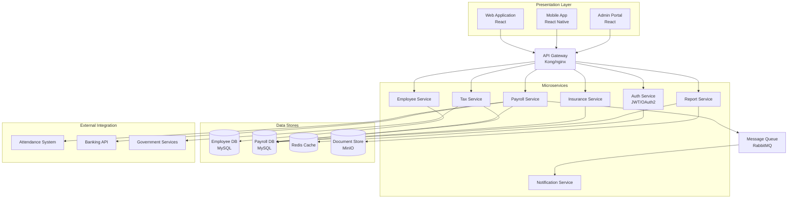
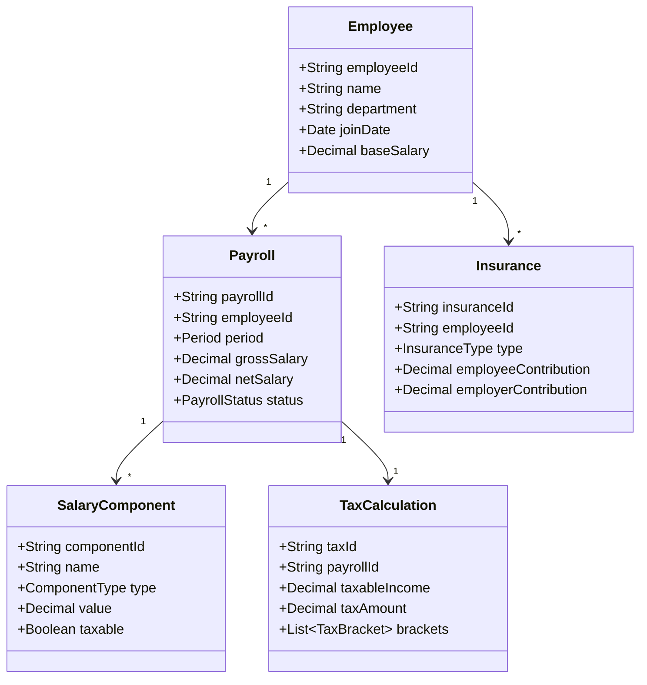
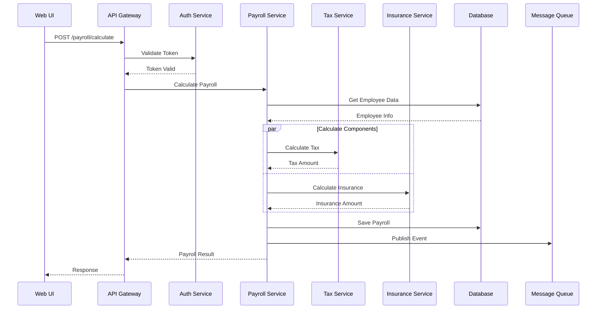
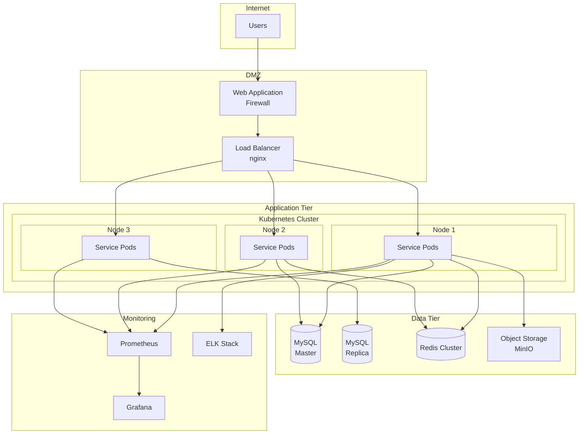
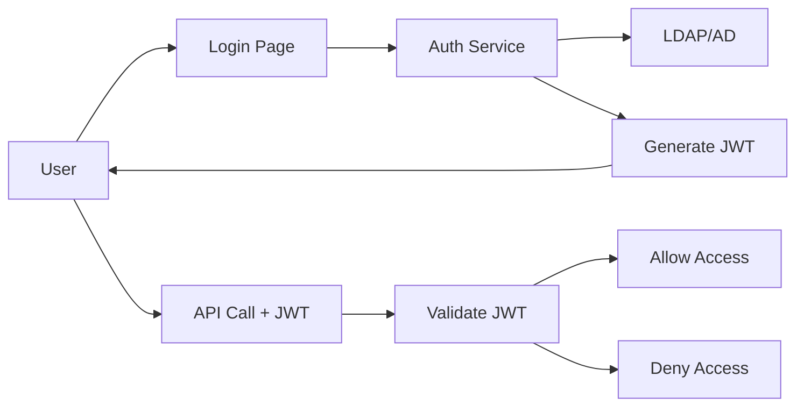
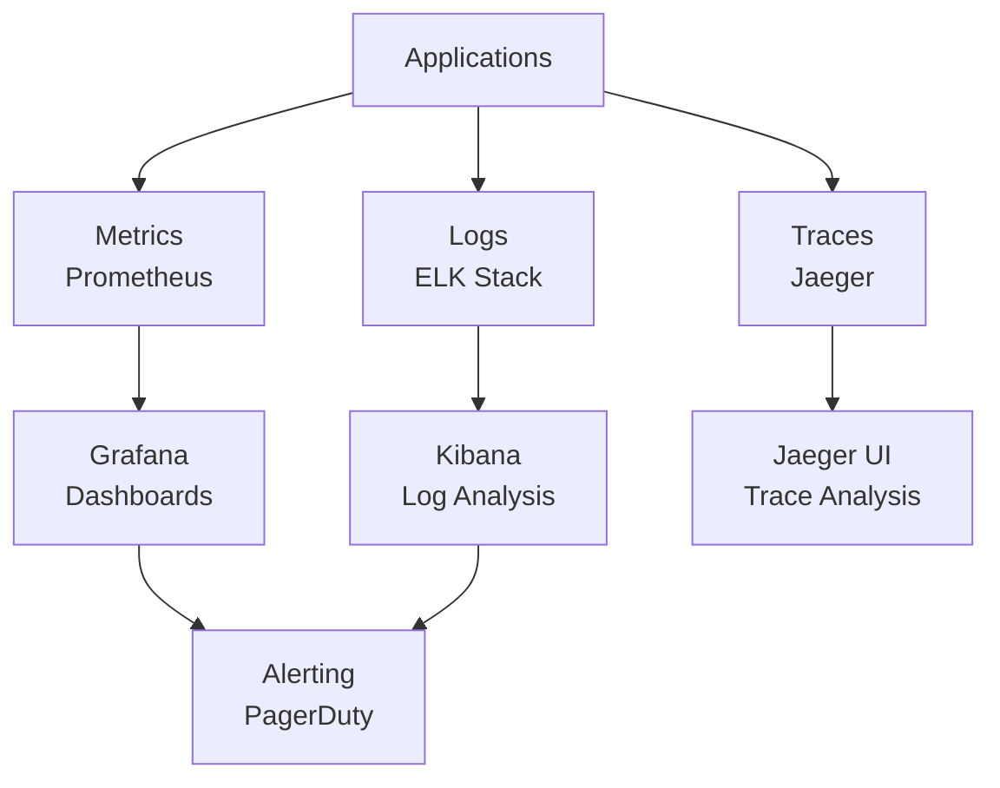

# ARCHITECTURE DESIGN DOCUMENT
## Hệ thống Quản lý Lương - Payroll Management System

**Version:** 1.0
**Date:** 2024-09-24
**Status:** Draft
**Author:** Architecture Team

---

## MỤC LỤC
1. [Giới thiệu](#1-giới-thiệu)
2. [Kiến trúc Tổng quan](#2-kiến-trúc-tổng-quan)
3. [Architecture Views](#3-architecture-views)
4. [Technology Stack](#4-technology-stack)
5. [System Components](#5-system-components)
6. [Deployment Architecture](#6-deployment-architecture)
7. [Security Architecture](#7-security-architecture)
8. [Performance & Scalability](#8-performance--scalability)
9. [Integration Architecture](#9-integration-architecture)
10. [Architecture Decisions](#10-architecture-decisions)

---

## 1. GIỚI THIỆU

### 1.1 Mục đích
Tài liệu này mô tả kiến trúc tổng thể của Hệ thống Quản lý Lương, bao gồm các thành phần, công nghệ, và mô hình triển khai.

### 1.2 Phạm vi
- Kiến trúc hệ thống cấp cao
- Các thành phần và tương tác
- Công nghệ và frameworks
- Mô hình triển khai
- Chiến lược tích hợp

### 1.3 Stakeholders
- Development Team
- Technical Architects
- DevOps Team
- Security Team
- Project Managers

---

## 2. KIẾN TRÚC TỔNG QUAN

### 2.1 Architecture Style
**Microservices Architecture** với các đặc điểm:
- Service-oriented
- Loosely coupled
- Independently deployable
- Technology agnostic
- Fault tolerant

### 2.2 Architecture Principles

| Principle | Description | Rationale |
|-----------|-------------|-----------|
| **Separation of Concerns** | Mỗi service chịu trách nhiệm một business domain | Dễ maintain và scale |
| **Single Responsibility** | Mỗi component có một nhiệm vụ rõ ràng | Giảm complexity |
| **Open/Closed** | Mở cho extension, đóng cho modification | Stability |
| **Dependency Inversion** | Depend on abstractions, not concretions | Flexibility |
| **API-First** | Design API trước khi implementation | Contract clarity |
| **Security by Design** | Security là priority từ đầu | Risk mitigation |

### 2.3 High-Level Architecture Diagram



---

## 3. ARCHITECTURE VIEWS

### 3.1 Logical View

#### 3.1.1 Layered Architecture

| Layer | Responsibility | Components |
|-------|---------------|------------|
| **Presentation** | User Interface | Web App, Mobile App, Admin Portal |
| **API Gateway** | Request routing, Auth, Rate limiting | Kong/nginx |
| **Business Logic** | Core business rules | Microservices |
| **Data Access** | Data persistence | Repository pattern |
| **Integration** | External systems | Adapters, Connectors |

#### 3.1.2 Domain Model



### 3.2 Process View

#### 3.2.1 Payroll Calculation Sequence



### 3.3 Development View

#### 3.3.1 Package Structure

```
payroll-system/
├── services/
│   ├── auth-service/
│   │   ├── src/
│   │   ├── tests/
│   │   └── Dockerfile
│   ├── employee-service/
│   ├── payroll-service/
│   ├── tax-service/
│   ├── insurance-service/
│   └── report-service/
├── frontend/
│   ├── web-app/
│   ├── mobile-app/
│   └── admin-portal/
├── infrastructure/
│   ├── docker-compose.yml
│   ├── kubernetes/
│   └── terraform/
└── shared/
    ├── common-libs/
    └── api-contracts/
```

---

## 4. TECHNOLOGY STACK

### 4.1 Backend Technologies

| Component | Technology | Version | Justification |
|-----------|-----------|---------|---------------|
| **Language** | Python | 3.11+ | Simple, readable, extensive libraries |
| **Framework** | Django | 4.x | Full-stack, batteries-included, mature |
| **API** | Django REST Framework | 3.x | Powerful REST API toolkit for Django |
| **Database** | MySQL | 8.0 | ACID compliance, JSON support |
| **Cache** | Redis | 7.x | High performance, pub/sub |
| **Message Queue** | Celery + RabbitMQ | - | Async task processing for Python |
| **Search** | Elasticsearch | 8.x | Full-text search for reports |

### 4.2 Frontend Technologies

| Component | Technology | Version | Justification |
|-----------|-----------|---------|---------------|
| **Template Engine** | Django Templates (DTL) | Built-in | Server-side rendering, tight Django integration |
| **HTML/CSS/JS** | HTML5, CSS3, Vanilla JavaScript | - | Lightweight, no build process required |
| **UI Framework** | Bootstrap 5 | 5.x | Responsive, widely supported |
| **AJAX Library** | Fetch API / Axios | - | Modern async HTTP requests |
| **Build Tool** | Django Compressor (optional) | - | Asset compression and bundling |

### 4.3 Infrastructure & DevOps

| Component | Technology | Justification |
|-----------|-----------|---------------|
| **Container** | Docker | Standardized deployment |
| **Orchestration** | Kubernetes | Auto-scaling, self-healing |
| **CI/CD** | GitLab CI | Integrated with source control |
| **Monitoring** | Prometheus + Grafana | Metrics and visualization |
| **Logging** | ELK Stack | Centralized logging |
| **API Gateway** | Kong | Rate limiting, authentication |

---

## 5. SYSTEM COMPONENTS

### 5.1 Core Services

#### 5.1.1 Authentication Service
- **Purpose:** User authentication & authorization
- **Technology:** Django Authentication + django-rest-framework-simplejwt
- **Features:**
  - JWT token authentication
  - Session-based authentication (Django built-in)
  - Multi-factor authentication (via django-otp)
  - Role-based access control (Django permissions)
  - OAuth2 support (via django-oauth-toolkit)
- **API Endpoints:**
  - POST /api/auth/login
  - POST /api/auth/refresh
  - POST /api/auth/logout
  - GET /api/auth/validate

#### 5.1.2 Employee Service
- **Purpose:** Employee master data management
- **Technology:** Django Models + Django REST Framework ViewSets
- **Database:** MySQL (via Django ORM)
- **Features:**
  - CRUD operations (Django ModelViewSet)
  - Contract management
  - Department/position management
  - Dependent information
- **API Endpoints:**
  - GET/POST/PUT/DELETE /api/employees/
  - GET /api/employees/{id}/contracts/
  - GET /api/employees/{id}/dependents/

#### 5.1.3 Payroll Service
- **Purpose:** Core payroll calculation
- **Technology:** Django Models + Celery for batch processing
- **Features:**
  - Salary calculation engine (Python business logic)
  - Formula builder (Python expression evaluator)
  - Batch processing (Celery async tasks)
  - Approval workflow (Django workflow states)
- **Key Algorithms:**
  - Gross salary calculation
  - Tax calculation (Vietnam law)
  - Insurance deduction
  - Net pay computation

#### 5.1.4 Tax Service
- **Purpose:** Tax calculation per Vietnam regulations
- **Features:**
  - Progressive tax calculation
  - Personal deduction: 11,000,000 VND
  - Dependent deduction: 4,400,000 VND/person
  - Tax report generation
- **Important:** Tax calculated from GROSS income (before insurance)

#### 5.1.5 Insurance Service
- **Purpose:** Social insurance calculation
- **Features:**
  - BHXH (8% employee, 17.5% employer)
  - BHYT (1.5% employee, 3% employer)
  - BHTN (1% employee, 1% employer)
  - Compliance checking

#### 5.1.6 Report Service
- **Purpose:** Report generation & analytics
- **Features:**
  - Payslip generation
  - Tax reports
  - Insurance reports
  - Management dashboards
  - Export to PDF/Excel

### 5.2 Supporting Components

#### 5.2.1 Notification Service
- Email notifications
- SMS integration
- In-app notifications
- Push notifications

#### 5.2.2 Audit Service
- Activity logging
- Change tracking
- Compliance reporting
- Security audit trails

#### 5.2.3 Scheduler Service
- Cron job management
- Batch processing
- Recurring tasks
- Auto-calculation triggers

---

## 6. DEPLOYMENT ARCHITECTURE

### 6.1 Production Environment



### 6.2 Environment Specifications

| Environment | Purpose | Configuration |
|-------------|---------|---------------|
| **Development** | Local development | Docker Compose, 1 instance per service |
| **Testing** | QA testing | Kubernetes, minimal replicas |
| **Staging** | Pre-production | Same as production, smaller scale |
| **Production** | Live system | Full HA, auto-scaling |

### 6.3 Scaling Strategy

#### Horizontal Scaling
- Microservices: 2-10 replicas based on load
- Database: Read replicas for reports
- Cache: Redis cluster with 3+ nodes

#### Vertical Scaling
- Initial: 2 vCPU, 4GB RAM per service
- Scale up to: 8 vCPU, 16GB RAM as needed

---

## 7. SECURITY ARCHITECTURE

### 7.1 Security Layers

| Layer | Security Measures |
|-------|------------------|
| **Network** | Firewall, VPN, Network segmentation |
| **Application** | OAuth2, JWT, RBAC, Input validation |
| **Data** | Encryption at rest & transit, Backup |
| **Audit** | Activity logging, Compliance tracking |

### 7.2 Authentication & Authorization



### 7.3 Data Security

- **Encryption at Rest:** AES-256 for database
- **Encryption in Transit:** TLS 1.3
- **Sensitive Data:** Masked in logs
- **PII Protection:** GDPR/LGPD compliance
- **Backup:** Daily encrypted backups

---

## 8. PERFORMANCE & SCALABILITY

### 8.1 Performance Requirements

| Metric | Target | Measurement |
|--------|--------|-------------|
| **Response Time** | <2 seconds | 95th percentile |
| **Throughput** | 1000 req/sec | Peak load |
| **Concurrent Users** | 500+ | Active sessions |
| **Availability** | 99.9% | Monthly uptime |
| **RTO** | <4 hours | Recovery time |
| **RPO** | <1 hour | Data loss tolerance |

### 8.2 Performance Optimization

#### Caching Strategy
- **Redis:** Session data, frequently accessed data
- **CDN:** Static assets
- **Application Cache:** Computed values
- **Database:** Query result caching

#### Database Optimization
- Indexing strategy
- Query optimization
- Connection pooling
- Read/write splitting

#### Asynchronous Processing
- Message queue for long-running tasks
- Event-driven architecture
- Batch processing for reports

### 8.3 Load Testing Scenarios

| Scenario | Users | Duration | Success Criteria |
|----------|-------|----------|------------------|
| Normal Load | 100 | 30 min | <1s response time |
| Peak Load | 500 | 15 min | <2s response time |
| Stress Test | 1000 | 5 min | System recovers |
| Endurance | 200 | 4 hours | No memory leaks |

---

## 9. INTEGRATION ARCHITECTURE

### 9.1 Integration Points

| System | Type | Protocol | Purpose |
|--------|------|----------|---------|
| **Attendance System** | Internal | REST API | Import work hours |
| **Banking API** | External | REST/SOAP | Salary transfer |
| **Tax Authority** | External | XML/API | Tax reporting |
| **Insurance Agency** | External | Web Service | Insurance reporting |

### 9.2 Integration Patterns

#### 9.2.1 API Integration
```
Service A --> API Gateway --> Service B
           ↓
        Rate Limiting
        Authentication
        Transformation
```

#### 9.2.2 Event-Driven Integration
```
Service A --> Event --> Message Queue --> Service B
                     ↓
                Event Store
```

#### 9.2.3 Batch Integration
```
External System --> SFTP/API --> ETL Process --> Database
                              ↓
                          Validation
                          Transformation
                          Error Handling
```

### 9.3 Error Handling & Retry

- **Retry Policy:** Exponential backoff
- **Circuit Breaker:** Fail fast pattern
- **Dead Letter Queue:** Failed messages
- **Compensation:** Saga pattern for transactions

---

## 10. ARCHITECTURE DECISIONS

### 10.1 Architecture Decision Records (ADRs)

| ADR# | Decision | Rationale | Consequences |
|------|----------|-----------|--------------|
| ADR-001 | Django Monolith over Microservices | Faster development, simpler deployment, team expertise | Less flexible scaling, tighter coupling |
| ADR-002 | MySQL for transactional data | ACID, JSON support, widespread adoption, Django ORM support | Database vendor lock-in |
| ADR-003 | Django Templates for frontend | Server-side rendering, faster initial load, SEO-friendly | Less interactive than SPA |
| ADR-004 | Docker + Docker Compose | Containerization, consistent environments | Less advanced than K8s |
| ADR-005 | JWT + Session auth | Stateless API + Stateful web, flexible | Dual auth management |
| ADR-006 | Celery for async tasks | Python-native, robust, well-integrated with Django | Additional infrastructure (Redis/RabbitMQ) |

### 10.2 Trade-offs

| Aspect | Choice | Trade-off |
|--------|--------|-----------|
| **Consistency** | Eventual consistency | Performance vs accuracy |
| **Coupling** | Loose coupling | Complexity vs simplicity |
| **Storage** | Polyglot persistence | Flexibility vs maintenance |
| **Security** | Defense in depth | Security vs user experience |

### 10.3 Technical Debt

| Item | Priority | Mitigation |
|------|----------|------------|
| Legacy system migration | High | Phased migration approach |
| Test coverage | Medium | Incremental improvement |
| Documentation | Low | Auto-generation tools |

---

## 11. DISASTER RECOVERY

### 11.1 Backup Strategy

| Data Type | Frequency | Retention | Location |
|-----------|-----------|-----------|----------|
| Database | Daily | 30 days | Offsite storage |
| Files | Weekly | 90 days | Object storage |
| Configs | On change | Versioned | Git repository |

### 11.2 Recovery Procedures

1. **Database Recovery**
   - Point-in-time recovery
   - Automated failover
   - Data consistency checks

2. **Application Recovery**
   - Container restart
   - Service health checks
   - Load balancer updates

3. **Full System Recovery**
   - Infrastructure as Code
   - Automated provisioning
   - Data restoration

---

## 12. MONITORING & OBSERVABILITY

### 12.1 Monitoring Stack



### 12.2 Key Metrics

| Category | Metrics |
|----------|---------|
| **Business** | Payrolls processed, Error rates |
| **Application** | Response time, Throughput, Error rate |
| **Infrastructure** | CPU, Memory, Disk, Network |
| **Database** | Query performance, Connection pool |

### 12.3 Alerting Rules

| Alert | Condition | Action |
|-------|-----------|--------|
| High Error Rate | >5% errors | Page on-call |
| Slow Response | >5s response time | Email team |
| Low Disk Space | <20% free | Auto-scale storage |
| Service Down | Health check fails | Auto-restart, page |

---

## 13. COMPLIANCE & GOVERNANCE

### 13.1 Regulatory Compliance

- **Labor Law:** Vietnam Labor Code 2019
- **Tax Law:** Personal Income Tax regulations
- **Data Privacy:** Personal data protection
- **Financial:** Accounting standards

### 13.2 Architecture Governance

- Architecture review board
- Design review process
- Technology standards
- Security assessments

---

## 14. APPENDICES

### A. Glossary
| Term | Definition |
|------|------------|
| JWT | JSON Web Token |
| RBAC | Role-Based Access Control |
| HA | High Availability |
| RTO | Recovery Time Objective |
| RPO | Recovery Point Objective |

### B. References
- [Spring Boot Documentation](https://spring.io/projects/spring-boot)
- [React Documentation](https://react.dev)
- [Kubernetes Documentation](https://kubernetes.io/docs)
- [MySQL Documentation](https://dev.mysql.com/doc/)

### C. Version History
| Version | Date | Changes | Author |
|---------|------|---------|--------|
| 1.0 | 2024-09-24 | Initial version | Architecture Team |

---

**Document Status:** DRAFT
**Review Status:** Pending
**Approval:** Required from Technical Lead