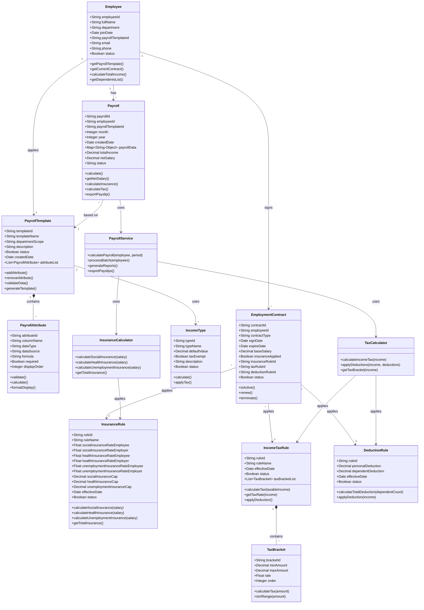
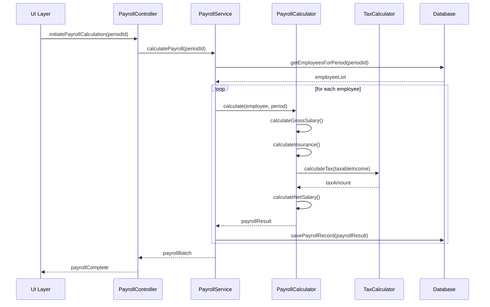
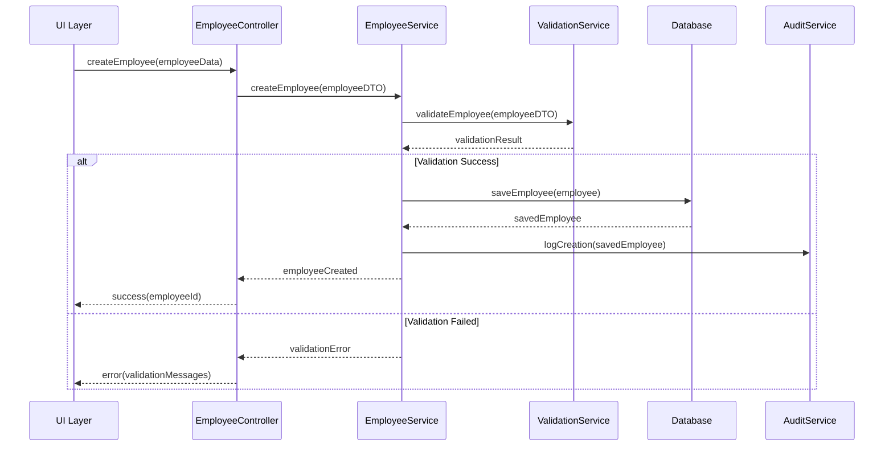

# DETAILED DESIGN DOCUMENT
## Hệ thống Quản lý Lương - HRM/Payroll

**Version:** 1.0
**Date:** 2024-10-02
**Status:** Draft
**Author:** Design Team

---

## 1. EXECUTIVE SUMMARY

### 1.1 Tổng quan
Tài liệu thiết kế chi tiết mô tả cấu trúc và hoạt động chi tiết của từng module trong hệ thống Quản lý Lương, bao gồm thiết kế lớp, sequence diagrams, và chi tiết implementation.

### 1.2 Phạm vi
- Thiết kế chi tiết cho tất cả modules chính
- Class diagrams và component interactions
- Business logic implementation details
- Data flow và processing algorithms

---

## 2. MODULE DESIGN DETAILS

### 2.0 Overall System Class Diagram



### 2.1 Employee Management Module

#### 2.1.1 Component Structure
```
EmployeeManagement/
├── Controllers/
│   ├── EmployeeController
│   └── ContractController
├── Services/
│   ├── EmployeeService
│   ├── ContractService
│   └── ValidationService
├── Repositories/
│   ├── EmployeeRepository
│   └── ContractRepository
├── Models/
│   ├── Employee
│   ├── Contract
│   └── Department
└── DTOs/
    ├── EmployeeDTO
    └── ContractDTO
```

#### 2.1.2 Model Design

**Employee Model (Django):**
```python
from django.db import models
from django.contrib.auth.models import User

class Employee(models.Model):
    employee_id = models.UUIDField(primary_key=True, default=uuid.uuid4)
    employee_code = models.CharField(max_length=20, unique=True)
    user = models.OneToOneField(User, on_delete=models.CASCADE, null=True, blank=True)
    full_name = models.CharField(max_length=100)
    date_of_birth = models.DateField()
    identity_number = models.CharField(max_length=20, unique=True)
    tax_code = models.CharField(max_length=20, blank=True, null=True)
    social_insurance_no = models.CharField(max_length=20, blank=True, null=True)
    department = models.ForeignKey('Department', on_delete=models.SET_NULL, null=True)
    position = models.ForeignKey('Position', on_delete=models.SET_NULL, null=True)
    join_date = models.DateField()
    status = models.CharField(max_length=20, choices=[
        ('ACTIVE', 'Active'),
        ('INACTIVE', 'Inactive'),
        ('TERMINATED', 'Terminated'),
    ], default='ACTIVE')
    created_at = models.DateTimeField(auto_now_add=True)
    updated_at = models.DateTimeField(auto_now=True)

    class Meta:
        db_table = 'employees'

    def get_active_contract(self):
        return self.contracts.filter(status='ACTIVE').first()

    def get_base_salary(self):
        contract = self.get_active_contract()
        return contract.base_salary if contract else Decimal('0')

    def get_dependent_count(self):
        return self.dependents.filter(is_tax_dependent=True).count()

    def is_active(self):
        return self.status == 'ACTIVE'
```

**Contract Model (Django):**
```python
class Contract(models.Model):
    contract_id = models.UUIDField(primary_key=True, default=uuid.uuid4)
    employee = models.ForeignKey(Employee, related_name='contracts', on_delete=models.CASCADE)
    contract_number = models.CharField(max_length=50, unique=True)
    contract_type = models.CharField(max_length=20, choices=[
        ('PERMANENT', 'Permanent'),
        ('FIXED_TERM', 'Fixed Term'),
        ('PART_TIME', 'Part Time'),
        ('PROBATION', 'Probation'),
    ])
    start_date = models.DateField()
    end_date = models.DateField(null=True, blank=True)
    base_salary = models.DecimalField(max_digits=15, decimal_places=2)
    status = models.CharField(max_length=20, default='ACTIVE')
    created_at = models.DateTimeField(auto_now_add=True)
    updated_at = models.DateTimeField(auto_now=True)

    class Meta:
        db_table = 'contracts'

    def is_active(self):
        return self.status == 'ACTIVE'

    def is_expired(self):
        if self.end_date:
            return timezone.now().date() > self.end_date
        return False
```

#### 2.1.3 Service Layer Design (Django Views & Serializers)

**Employee Serializer:**
```python
from rest_framework import serializers
from .models import Employee

class EmployeeSerializer(serializers.ModelSerializer):
    department_name = serializers.CharField(source='department.name', read_only=True)
    active_contract = serializers.SerializerMethodField()

    class Meta:
        model = Employee
        fields = ['employee_id', 'employee_code', 'full_name', 'date_of_birth',
                  'identity_number', 'tax_code', 'department', 'department_name',
                  'position', 'join_date', 'status', 'active_contract']
        read_only_fields = ['employee_id', 'created_at', 'updated_at']

    def get_active_contract(self, obj):
        contract = obj.get_active_contract()
        return ContractSerializer(contract).data if contract else None

    def validate_identity_number(self, value):
        if not value.isdigit() or len(value) not in [9, 12]:
            raise serializers.ValidationError("Identity number must be 9 or 12 digits")
        return value
```

**Employee ViewSet:**
```python
from rest_framework import viewsets, status
from rest_framework.decorators import action
from rest_framework.response import Response
from django.db import transaction

class EmployeeViewSet(viewsets.ModelViewSet):
    queryset = Employee.objects.select_related('department', 'position').all()
    serializer_class = EmployeeSerializer
    permission_classes = [IsAuthenticated]

    @transaction.atomic
    def create(self, request, *args, **kwargs):
        """Create new employee with audit logging"""
        serializer = self.get_serializer(data=request.data)
        serializer.is_valid(raise_exception=True)

        employee = serializer.save(status='ACTIVE')

        # Audit logging
        AuditLog.objects.create(
            user=request.user,
            action='CREATE',
            model='Employee',
            object_id=employee.employee_id
        )

        return Response(serializer.data, status=status.HTTP_201_CREATED)

    @action(detail=True, methods=['post'])
    def terminate(self, request, pk=None):
        """Terminate employee"""
        employee = self.get_object()
        termination_date = request.data.get('termination_date')

        employee.status = 'TERMINATED'
        employee.save()

        return Response({'status': 'Employee terminated'})
```

---

### 2.2 Salary Configuration Module

#### 2.2.1 Component Structure
```
SalaryConfiguration/
├── Controllers/
│   ├── SalaryStructureController
│   └── AllowanceController
├── Services/
│   ├── SalaryStructureService
│   ├── AllowanceService
│   └── TaxConfigService
├── Repositories/
│   ├── SalaryStructureRepository
│   └── AllowanceRepository
└── Models/
    ├── SalaryStructure
    ├── AllowanceType
    └── TaxBracket
```

#### 2.2.2 Salary Structure Design

**SalaryStructure Class:**
```java
public class SalaryStructure {
    private String structureId;
    private String structureName;
    private List<SalaryComponent> components;
    private Date effectiveFrom;
    private Date effectiveTo;
    private boolean isActive;

    public BigDecimal calculateGrossSalary(Employee employee) {
        BigDecimal gross = employee.getBaseSalary();
        for (SalaryComponent component : components) {
            gross = gross.add(component.calculate(employee));
        }
        return gross;
    }
}
```

**SalaryComponent Class:**
```java
public abstract class SalaryComponent {
    protected String componentId;
    protected String componentName;
    protected ComponentType type;
    protected boolean isTaxable;
    protected boolean isInsurable;

    public abstract BigDecimal calculate(Employee employee);
}
```

---

### 2.3 Payroll Calculation Module

#### 2.3.1 Core Calculation Engine

**PayrollCalculator Service (Django):**
```python
from decimal import Decimal
from django.db import transaction
from .models import Payroll, Employee, PayrollPeriod
from .tax_calculator import TaxCalculator
from .insurance_calculator import InsuranceCalculator

class PayrollCalculator:
    """Core payroll calculation service"""

    def __init__(self):
        self.tax_calculator = TaxCalculator()
        self.insurance_calculator = InsuranceCalculator()

    @transaction.atomic
    def calculate_payroll(self, employee: Employee, period: PayrollPeriod):
        """Calculate complete payroll for an employee"""
        result = {}

        # Step 1: Calculate gross salary
        gross_salary = self.calculate_gross_salary(employee, period)
        result['gross_salary'] = gross_salary

        # Step 2: Calculate insurance deductions
        insurance = self.insurance_calculator.calculate(gross_salary)
        result['insurance_deduction'] = insurance

        # Step 3: Calculate taxable income
        tax_exemptions = self.get_tax_exemptions(employee)
        taxable_income = gross_salary - insurance['employee_total'] - tax_exemptions

        # Step 4: Calculate tax
        tax = self.tax_calculator.calculate_tax(max(taxable_income, Decimal('0')))
        result['income_tax'] = tax

        # Step 5: Calculate net salary
        net_salary = (gross_salary
                     - insurance['employee_total']
                     - tax
                     - self.get_other_deductions(employee))
        result['net_salary'] = net_salary

        # Save payroll record
        payroll = Payroll.objects.create(
            employee=employee,
            period=period,
            gross_salary=gross_salary,
            net_salary=net_salary,
            status='CALCULATED'
        )

        return payroll, result

    def calculate_gross_salary(self, employee: Employee, period: PayrollPeriod):
        """Calculate gross salary based on contract and attendance"""
        contract = employee.get_active_contract()
        if not contract:
            return Decimal('0')

        # Get attendance data
        attendance = period.get_attendance(employee)
        working_days_ratio = attendance.working_days / period.standard_days

        # Prorated base salary
        gross = contract.base_salary * Decimal(str(working_days_ratio))

        # Add allowances, overtime, etc.
        # ... additional logic

        return gross

    def get_tax_exemptions(self, employee: Employee):
        """Calculate tax exemptions (Vietnam 2024)"""
        personal_exemption = Decimal('11000000')  # 11M VND
        dependent_exemption = Decimal('4400000') * employee.get_dependent_count()
        return personal_exemption + dependent_exemption

    def get_other_deductions(self, employee: Employee):
        """Get other deductions (advance payments, etc.)"""
        # Implementation
        return Decimal('0')
```

#### 2.3.2 Tax Calculation Logic

**TaxCalculator Class (Python):**
```python
from decimal import Decimal
from typing import List, Dict

class TaxCalculator:
    """Vietnam Personal Income Tax Calculator (2024)"""

    TAX_BRACKETS = [
        {'min': Decimal('0'), 'max': Decimal('5000000'), 'rate': Decimal('0.05')},
        {'min': Decimal('5000000'), 'max': Decimal('10000000'), 'rate': Decimal('0.10')},
        {'min': Decimal('10000000'), 'max': Decimal('18000000'), 'rate': Decimal('0.15')},
        {'min': Decimal('18000000'), 'max': Decimal('32000000'), 'rate': Decimal('0.20')},
        {'min': Decimal('32000000'), 'max': Decimal('52000000'), 'rate': Decimal('0.25')},
        {'min': Decimal('52000000'), 'max': Decimal('80000000'), 'rate': Decimal('0.30')},
        {'min': Decimal('80000000'), 'max': Decimal('999999999999'), 'rate': Decimal('0.35')},
    ]

    def calculate_tax(self, taxable_income: Decimal) -> Decimal:
        """
        Calculate progressive income tax
        Args:
            taxable_income: Income after deductions
        Returns:
            Total tax amount
        """
        if taxable_income <= 0:
            return Decimal('0')

        total_tax = Decimal('0')

        for bracket in self.TAX_BRACKETS:
            if taxable_income > bracket['min']:
                # Amount taxable in this bracket
                taxable_in_bracket = min(taxable_income, bracket['max']) - bracket['min']

                # Tax for this bracket
                bracket_tax = taxable_in_bracket * bracket['rate']
                total_tax += bracket_tax

                # If income doesn't reach next bracket, stop
                if taxable_income <= bracket['max']:
                    break

        return total_tax.quantize(Decimal('0.01'))  # Round to 2 decimal places

    def get_effective_rate(self, taxable_income: Decimal) -> Decimal:
        """Calculate effective tax rate"""
        if taxable_income <= 0:
            return Decimal('0')

        tax = self.calculate_tax(taxable_income)
        return (tax / taxable_income * 100).quantize(Decimal('0.01'))

    def get_tax_breakdown(self, taxable_income: Decimal) -> List[Dict]:
        """Get detailed tax calculation by bracket"""
        if taxable_income <= 0:
            return []

        breakdown = []

        for bracket in self.TAX_BRACKETS:
            if taxable_income > bracket['min']:
                taxable_in_bracket = min(taxable_income, bracket['max']) - bracket['min']
                bracket_tax = taxable_in_bracket * bracket['rate']

                breakdown.append({
                    'bracket': f"{bracket['min']:,.0f} - {bracket['max']:,.0f}",
                    'rate': float(bracket['rate'] * 100),
                    'taxable_amount': float(taxable_in_bracket),
                    'tax_amount': float(bracket_tax)
                })

                if taxable_income <= bracket['max']:
                    break

        return breakdown
```

---

### 2.4 Reporting Module

#### 2.4.1 Report Generation Service

**ReportService Class:**
```java
@Service
public class ReportService {

    @Autowired
    private PayrollRepository payrollRepo;

    @Autowired
    private ReportTemplateEngine templateEngine;

    @Autowired
    private ExportService exportService;

    public Report generatePayrollReport(ReportRequest request) {
        // Validate request
        validateReportRequest(request);

        // Fetch data
        List<PayrollRecord> records = payrollRepo.findByPeriod(
            request.getStartDate(),
            request.getEndDate()
        );

        // Apply filters
        records = applyFilters(records, request.getFilters());

        // Generate report
        Report report = new Report();
        report.setTitle(request.getReportType().getTitle());
        report.setGeneratedDate(new Date());
        report.setData(processData(records, request));

        // Apply template
        if (request.hasTemplate()) {
            report = templateEngine.applyTemplate(report, request.getTemplate());
        }

        return report;
    }

    public File exportReport(Report report, ExportFormat format) {
        return exportService.export(report, format);
    }
}
```

---

## 3. SEQUENCE DIAGRAMS

### 3.1 Payroll Calculation Flow



### 3.2 Employee Creation Flow



---

## 4. DATA PROCESSING ALGORITHMS

### 4.1 Overtime Calculation

```python
def calculate_overtime(employee, period):
    standard_hours = period.working_days * 8
    actual_hours = get_actual_hours(employee, period)

    if actual_hours <= standard_hours:
        return 0

    overtime_hours = actual_hours - standard_hours
    hourly_rate = employee.base_salary / (period.working_days * 8)

    # Normal overtime (150%)
    normal_ot = min(overtime_hours, 30)
    normal_ot_pay = normal_ot * hourly_rate * 1.5

    # Weekend overtime (200%)
    weekend_ot = get_weekend_hours(employee, period)
    weekend_ot_pay = weekend_ot * hourly_rate * 2.0

    # Holiday overtime (300%)
    holiday_ot = get_holiday_hours(employee, period)
    holiday_ot_pay = holiday_ot * hourly_rate * 3.0

    return normal_ot_pay + weekend_ot_pay + holiday_ot_pay
```

### 4.2 Insurance Calculation

```python
def calculate_insurance(gross_salary):
    # Social insurance cap at 29.8M VND
    si_base = min(gross_salary, 29800000)

    # Health insurance cap at 29.8M VND
    hi_base = min(gross_salary, 29800000)

    # Unemployment insurance cap at 88.4M VND
    ui_base = min(gross_salary, 88400000)

    employee_contribution = {
        'social_insurance': si_base * 0.08,
        'health_insurance': hi_base * 0.015,
        'unemployment_insurance': ui_base * 0.01
    }

    employer_contribution = {
        'social_insurance': si_base * 0.175,
        'health_insurance': hi_base * 0.03,
        'unemployment_insurance': ui_base * 0.01,
        'accident_insurance': si_base * 0.005
    }

    return {
        'employee': employee_contribution,
        'employer': employer_contribution,
        'total_employee': sum(employee_contribution.values()),
        'total_employer': sum(employer_contribution.values())
    }
```

---

## 5. ERROR HANDLING & VALIDATION

### 5.1 Validation Rules

**Employee Validation:**
- Identity number: 9 or 12 digits
- Tax code: 10 or 13 digits
- Social insurance: 10 digits
- Email: Valid email format
- Phone: Valid Vietnam phone format
- Join date: Not future date
- Birth date: Age between 18-60

**Payroll Validation:**
- Period must not be in future
- No duplicate calculation for same period
- All mandatory fields present
- Salary components sum correctly
- Tax calculation within legal limits

### 5.2 Error Handling Strategy

```java
@ControllerAdvice
public class GlobalExceptionHandler {

    @ExceptionHandler(ValidationException.class)
    public ResponseEntity<ErrorResponse> handleValidation(ValidationException e) {
        ErrorResponse error = new ErrorResponse();
        error.setCode("VALIDATION_ERROR");
        error.setMessage(e.getMessage());
        error.setDetails(e.getValidationErrors());
        return ResponseEntity.badRequest().body(error);
    }

    @ExceptionHandler(BusinessException.class)
    public ResponseEntity<ErrorResponse> handleBusiness(BusinessException e) {
        ErrorResponse error = new ErrorResponse();
        error.setCode(e.getErrorCode());
        error.setMessage(e.getMessage());
        return ResponseEntity.status(e.getHttpStatus()).body(error);
    }

    @ExceptionHandler(Exception.class)
    public ResponseEntity<ErrorResponse> handleGeneral(Exception e) {
        ErrorResponse error = new ErrorResponse();
        error.setCode("INTERNAL_ERROR");
        error.setMessage("An unexpected error occurred");
        // Log full exception
        logger.error("Unexpected error", e);
        return ResponseEntity.internalServerError().body(error);
    }
}
```

---

## 6. PERFORMANCE OPTIMIZATION

### 6.1 Caching Strategy

**Cache Layers:**
1. **Application Cache (Redis)**
   - Employee data (TTL: 1 hour)
   - Salary structures (TTL: 24 hours)
   - Tax configurations (TTL: 24 hours)

2. **Database Query Cache**
   - Frequently accessed reports
   - Common calculations

3. **CDN Cache**
   - Static assets
   - Report templates

### 6.2 Database Optimization

**Indexing Strategy:**
```sql
-- Employee indexes
CREATE INDEX idx_employee_status ON employees(status);
CREATE INDEX idx_employee_department ON employees(department_id);
CREATE INDEX idx_employee_join_date ON employees(join_date);

-- Payroll indexes
CREATE INDEX idx_payroll_period ON payroll_records(period_id);
CREATE INDEX idx_payroll_employee ON payroll_records(employee_id);
CREATE UNIQUE INDEX idx_payroll_unique ON payroll_records(employee_id, period_id);

-- Composite indexes for reporting
CREATE INDEX idx_payroll_report ON payroll_records(period_id, department_id, status);
```

### 6.3 Batch Processing

```java
@Component
public class BatchProcessor {

    private static final int BATCH_SIZE = 100;

    public void processBatch(List<Employee> employees, PayPeriod period) {
        List<List<Employee>> batches = Lists.partition(employees, BATCH_SIZE);

        List<CompletableFuture<Void>> futures = batches.stream()
            .map(batch -> CompletableFuture.runAsync(() ->
                processSingleBatch(batch, period)))
            .collect(Collectors.toList());

        CompletableFuture.allOf(futures.toArray(new CompletableFuture[0]))
            .join();
    }

    private void processSingleBatch(List<Employee> batch, PayPeriod period) {
        // Process batch with transaction
        transactionTemplate.execute(status -> {
            batch.forEach(employee ->
                payrollCalculator.calculate(employee, period));
            return null;
        });
    }
}
```

---

## 7. SECURITY IMPLEMENTATION

### 7.1 Authentication & Authorization

**Django Settings (settings.py):**
```python
# REST Framework configuration
REST_FRAMEWORK = {
    'DEFAULT_AUTHENTICATION_CLASSES': [
        'rest_framework_simplejwt.authentication.JWTAuthentication',
        'rest_framework.authentication.SessionAuthentication',
    ],
    'DEFAULT_PERMISSION_CLASSES': [
        'rest_framework.permissions.IsAuthenticated',
    ],
    'DEFAULT_PAGINATION_CLASS': 'rest_framework.pagination.PageNumberPagination',
    'PAGE_SIZE': 20,
}

# JWT Settings
from datetime import timedelta
SIMPLE_JWT = {
    'ACCESS_TOKEN_LIFETIME': timedelta(hours=1),
    'REFRESH_TOKEN_LIFETIME': timedelta(days=7),
    'ROTATE_REFRESH_TOKENS': True,
    'BLACKLIST_AFTER_ROTATION': True,
}
```

**Custom Permissions (permissions.py):**
```python
from rest_framework import permissions

class IsHRManager(permissions.BasePermission):
    """Allow access only to HR managers"""
    def has_permission(self, request, view):
        return request.user.groups.filter(name='HR_MANAGER').exists()

class IsAccountant(permissions.BasePermission):
    """Allow access only to accountants"""
    def has_permission(self, request, view):
        return request.user.groups.filter(name='ACCOUNTANT').exists()

class IsOwnerOrHR(permissions.BasePermission):
    """Allow access to owner or HR staff"""
    def has_object_permission(self, request, view, obj):
        # HR can access any employee
        if request.user.groups.filter(name__in=['HR_MANAGER', 'ADMIN']).exists():
            return True
        # Employee can only access their own data
        return obj.user == request.user
```

### 7.2 Data Encryption

**Encryption Service (Django):**
```python
from cryptography.fernet import Fernet
from django.conf import settings
import base64

class EncryptionService:
    """Service for encrypting sensitive data"""

    def __init__(self):
        # Load encryption key from settings
        key = settings.ENCRYPTION_KEY.encode()
        self.cipher = Fernet(key)

    def encrypt(self, plaintext: str) -> str:
        """
        Encrypt plaintext string
        Args:
            plaintext: String to encrypt
        Returns:
            Base64 encoded encrypted string
        """
        try:
            encrypted = self.cipher.encrypt(plaintext.encode())
            return base64.b64encode(encrypted).decode()
        except Exception as e:
            raise EncryptionException(f"Encryption failed: {str(e)}")

    def decrypt(self, encrypted_text: str) -> str:
        """
        Decrypt encrypted string
        Args:
            encrypted_text: Base64 encoded encrypted string
        Returns:
            Decrypted plaintext string
        """
        try:
            encrypted = base64.b64decode(encrypted_text.encode())
            decrypted = self.cipher.decrypt(encrypted)
            return decrypted.decode()
        except Exception as e:
            raise EncryptionException(f"Decryption failed: {str(e)}")

# Usage in models
from django.db import models

class EncryptedCharField(models.CharField):
    """Custom field that automatically encrypts data"""

    def __init__(self, *args, **kwargs):
        self.encryption_service = EncryptionService()
        super().__init__(*args, **kwargs)

    def get_prep_value(self, value):
        """Encrypt before saving to database"""
        if value is None:
            return value
        return self.encryption_service.encrypt(value)

    def from_db_value(self, value, expression, connection):
        """Decrypt when loading from database"""
        if value is None:
            return value
        return self.encryption_service.decrypt(value)
```

---

## 8. INTEGRATION POINTS

### 8.1 External System Integration

**Banking Integration:**
```java
@Service
public class BankingIntegrationService {

    @Autowired
    private RestTemplate restTemplate;

    public TransferResult transferSalary(PaymentBatch batch) {
        BankTransferRequest request = new BankTransferRequest();
        request.setBatchId(batch.getId());
        request.setTransfers(mapToTransfers(batch.getPayments()));
        request.setTotalAmount(batch.getTotalAmount());

        HttpHeaders headers = new HttpHeaders();
        headers.set("API-Key", bankApiKey);
        headers.set("Content-Type", "application/json");

        HttpEntity<BankTransferRequest> entity = new HttpEntity<>(request, headers);

        ResponseEntity<TransferResult> response = restTemplate.exchange(
            bankApiUrl + "/transfer/batch",
            HttpMethod.POST,
            entity,
            TransferResult.class
        );

        return response.getBody();
    }
}
```

### 8.2 Message Queue Integration

```java
@Component
public class PayrollEventPublisher {

    @Autowired
    private RabbitTemplate rabbitTemplate;

    public void publishPayrollCompleted(PayrollBatch batch) {
        PayrollCompletedEvent event = new PayrollCompletedEvent();
        event.setBatchId(batch.getId());
        event.setPeriodId(batch.getPeriodId());
        event.setEmployeeCount(batch.getEmployeeCount());
        event.setCompletedAt(new Date());

        rabbitTemplate.convertAndSend(
            "payroll.exchange",
            "payroll.completed",
            event
        );
    }
}
```

---

## 9. TESTING STRATEGY

### 9.1 Unit Testing

```java
@ExtendWith(MockitoExtension.class)
class PayrollCalculatorTest {

    @Mock
    private TaxCalculator taxCalculator;

    @Mock
    private InsuranceCalculator insuranceCalculator;

    @InjectMocks
    private PayrollCalculator calculator;

    @Test
    void testCalculatePayroll_WithStandardEmployee() {
        // Given
        Employee employee = createTestEmployee();
        PayPeriod period = createTestPeriod();

        when(taxCalculator.calculateTax(any())).thenReturn(new BigDecimal("2000000"));
        when(insuranceCalculator.calculate(any())).thenReturn(createTestInsurance());

        // When
        PayrollResult result = calculator.calculatePayroll(employee, period);

        // Then
        assertNotNull(result);
        assertEquals(new BigDecimal("20000000"), result.getGrossSalary());
        assertEquals(new BigDecimal("15500000"), result.getNetSalary());
        verify(taxCalculator, times(1)).calculateTax(any());
    }
}
```

### 9.2 Integration Testing

```java
@SpringBootTest
@AutoConfigureMockMvc
class PayrollIntegrationTest {

    @Autowired
    private MockMvc mockMvc;

    @Test
    @WithMockUser(roles = "HR")
    void testPayrollCalculationEndToEnd() throws Exception {
        // Prepare test data
        String requestBody = """
            {
                "periodId": "2024-09",
                "departmentIds": ["HR", "IT"],
                "calculateBonus": true
            }
            """;

        // Execute request
        mockMvc.perform(post("/api/payroll/calculate")
                .contentType(MediaType.APPLICATION_JSON)
                .content(requestBody))
                .andExpect(status().isOk())
                .andExpect(jsonPath("$.status").value("COMPLETED"))
                .andExpect(jsonPath("$.processedCount").value(50));
    }
}
```

---

## 10. DEPLOYMENT CONFIGURATION

### 10.1 Docker Configuration

```dockerfile
# Dockerfile
FROM openjdk:17-jdk-alpine
VOLUME /tmp
COPY target/payroll-system.jar app.jar
ENTRYPOINT ["java","-Djava.security.egd=file:/dev/./urandom","-jar","/app.jar"]
```

### 10.2 Kubernetes Deployment

```yaml
apiVersion: apps/v1
kind: Deployment
metadata:
  name: payroll-system
spec:
  replicas: 3
  selector:
    matchLabels:
      app: payroll
  template:
    metadata:
      labels:
        app: payroll
    spec:
      containers:
      - name: payroll
        image: payroll-system:1.0.0
        ports:
        - containerPort: 8080
        env:
        - name: SPRING_PROFILES_ACTIVE
          value: "production"
        - name: DB_HOST
          valueFrom:
            configMapKeyRef:
              name: db-config
              key: host
        resources:
          requests:
            memory: "512Mi"
            cpu: "500m"
          limits:
            memory: "1Gi"
            cpu: "1000m"
```

---

## APPENDICES

### A. Naming Conventions

**Java/Backend:**
- Classes: PascalCase (EmployeeService)
- Methods: camelCase (calculateSalary)
- Constants: UPPER_SNAKE_CASE (MAX_RETRY_COUNT)
- Packages: lowercase (com.company.payroll)

**Database:**
- Tables: snake_case (employee_contracts)
- Columns: snake_case (employee_id)
- Indexes: idx_table_column
- Foreign Keys: fk_table_reference

### B. Code Review Checklist

- [ ] Code follows style guide
- [ ] Unit tests written and passing
- [ ] Documentation updated
- [ ] No hardcoded values
- [ ] Error handling implemented
- [ ] Performance considered
- [ ] Security reviewed
- [ ] Logging appropriate

### C. Performance Benchmarks

| Operation | Target | Actual | Status |
|-----------|--------|--------|--------|
| Employee Query | <100ms | 85ms | ✅ |
| Payroll Calculation (per employee) | <500ms | 420ms | ✅ |
| Batch Processing (100 employees) | <30s | 25s | ✅ |
| Report Generation | <5s | 4.2s | ✅ |

---

**Document Control:**
- Review Cycle: Quarterly
- Approval Authority: Technical Lead
- Distribution: Development Team
- Classification: Internal Use Only