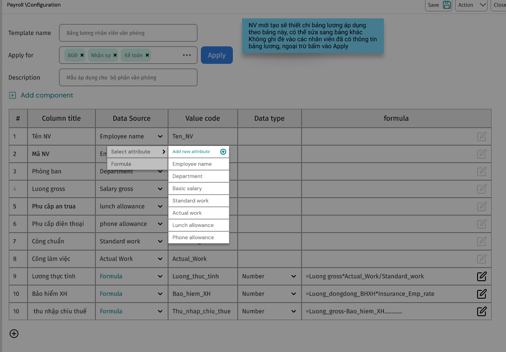

# UI/UX DESIGN DOCUMENT
## Hệ thống Quản lý Lương - Payroll Management System

**Version:** 1.0
**Date:** 2024-10-02
**Status:** Draft
**Author:** UI/UX Design Team

---

## MỤC LỤC
1. [Giới thiệu](#1-giới-thiệu)
2. [Design Strategy](#2-design-strategy)
3. [User Research & Personas](#3-user-research--personas)
4. [Information Architecture](#4-information-architecture)
5. [Design System](#5-design-system)
6. [User Interface Design](#6-user-interface-design)
7. [User Experience Flows](#7-user-experience-flows)
8. [Responsive Design](#8-responsive-design)
9. [Accessibility](#9-accessibility)
10. [Testing & Validation](#10-testing--validation)

---

## 1. GIỚI THIỆU

### 1.1 Mục đích
Tài liệu này định nghĩa thiết kế giao diện người dùng và trải nghiệm người dùng cho Hệ thống Quản lý Lương, đảm bảo tính khả dụng, hiệu quả và thân thiện với người dùng.

### 1.2 Phạm vi
- User interface design cho web application
- Mobile responsive design
- User experience flows và interactions
- Design system và component library
- Accessibility guidelines
- Usability testing methodology

### 1.3 Design Principles
- **User-Centered**: Thiết kế tập trung vào nhu cầu người dùng
- **Simplicity**: Giao diện đơn giản, dễ hiểu
- **Consistency**: Nhất quán trong toàn bộ hệ thống
- **Efficiency**: Tối ưu hóa quy trình làm việc
- **Accessibility**: Đảm bảo truy cập cho mọi người dùng

---

## 2. DESIGN STRATEGY

### 2.1 Design Goals
```
Primary Goals:
- Giảm thời gian xử lý payroll từ 5 ngày xuống 2 ngày
- Tăng độ chính xác tính lương lên 99.9%
- Giảm thời gian training cho user mới từ 2 tuần xuống 3 ngày
- Đạt user satisfaction score > 4.5/5.0

Secondary Goals:
- Hỗ trợ đa thiết bị (desktop, tablet, mobile)
- Tương thích với các trình duyệt phổ biến
- Đáp ứng accessibility standards (WCAG 2.1 AA)
```

### 2.2 Design Methodology
- **Human-Centered Design**: Focus on user needs và behaviors
- **Iterative Design**: Continuous improvement based on feedback
- **Data-Driven Design**: Decision making based on user analytics
- **Collaborative Design**: Cross-functional team collaboration

### 2.3 Success Metrics
```yaml
usability_metrics:
  task_completion_rate: "> 95%"
  error_rate: "< 2%"
  time_to_complete_payroll: "< 30 minutes"
  user_satisfaction: "> 4.5/5.0"

performance_metrics:
  page_load_time: "< 3 seconds"
  time_to_interactive: "< 5 seconds"
  mobile_usability_score: "> 90%"
```

---

## 3. USER RESEARCH & PERSONAS

### 3.1 Primary Personas

#### Persona 1: HR Manager - Nguyễn Thị Linh
```
Demographics:
- Age: 32-45
- Education: University degree
- Experience: 5+ years in HR
- Tech Savvy: Medium to High

Goals:
- Quản lý toàn bộ quy trình payroll efficiently
- Đảm bảo compliance với labor laws
- Generate accurate reports cho management
- Minimize errors và manual work

Pain Points:
- Tính toán thuế phức tạp theo luật VN
- Quản lý nhiều employee records
- Integration với attendance system
- Monthly reporting requirements

Behaviors:
- Sử dụng desktop primary, mobile occasionally
- Prefers structured workflows
- Values accuracy over speed
- Requires detailed audit trails
```

#### Persona 2: Accountant - Trần Văn Minh
```
Demographics:
- Age: 28-40
- Education: Accounting/Finance degree
- Experience: 3+ years in accounting
- Tech Savvy: Medium

Goals:
- Process payments accurately và on time
- Reconcile payroll với financial systems
- Generate tax reports cho authorities
- Maintain financial compliance

Pain Points:
- Integration với banking systems
- Tax calculation complexity
- Month-end closing procedures
- Audit requirements

Behaviors:
- Desktop heavy user
- Detail-oriented workflow
- Requires approval mechanisms
- Values integration capabilities
```

#### Persona 3: Employee - Lê Văn An
```
Demographics:
- Age: 25-50
- Education: Various
- Tech Savvy: Low to Medium

Goals:
- View payslip và salary history
- Understand deductions và taxes
- Download salary certificates
- Update personal information

Pain Points:
- Complex payslip information
- Limited self-service options
- Mobile access requirements
- Vietnamese language support

Behaviors:
- Mobile-first user
- Occasional access (monthly)
- Simple task completion
- Values clarity và transparency
```

### 3.2 User Journey Mapping

#### HR Manager - Monthly Payroll Process
```
Stages:
1. Preparation (Day 1-2)
   - Import attendance data
   - Review employee changes
   - Update salary adjustments

2. Calculation (Day 3-4)
   - Run payroll calculation
   - Review và validate results
   - Handle exceptions

3. Approval (Day 5)
   - Submit for approval
   - Generate reports
   - Process payments

Touch Points:
- Dashboard overview
- Employee management
- Calculation engine
- Approval workflow
- Reporting system

Emotions:
- Anxiety (accuracy concerns)
- Relief (automated calculations)
- Satisfaction (completed on time)
```

---

## 4. INFORMATION ARCHITECTURE

### 4.1 Site Map
```
Payroll System
├── Dashboard
│   ├── Overview metrics
│   ├── Pending tasks
│   └── Recent activities
├── Employee Management
│   ├── Employee list
│   ├── Employee details
│   ├── Bulk operations
│   └── Import/Export
├── Payroll Processing
│   ├── Calculation setup
│   ├── Payroll calculation
│   ├── Results review
│   └── Approval workflow
├── Reports & Analytics
│   ├── Payroll reports
│   ├── Tax reports
│   ├── Financial reports
│   └── Custom reports
├── Settings
│   ├── Company settings
│   ├── Tax configuration
│   ├── User management
│   └── System settings
└── Help & Support
    ├── Documentation
    ├── Video tutorials
    └── Contact support
```

### 4.2 Navigation Structure

#### Primary Navigation
```
Main Menu (Top Navigation):
- Dashboard (Home icon)
- Employees (People icon)
- Payroll (Calculator icon)
- Reports (Chart icon)
- Settings (Gear icon)

Secondary Navigation (Context-sensitive):
- Breadcrumb navigation
- Tab navigation within sections
- Action buttons (floating or fixed)
```

#### Mobile Navigation
```
Bottom Navigation:
- Dashboard
- Employees
- Payroll
- Reports
- More (Settings, Help)

Hamburger Menu for:
- Advanced features
- Settings
- Help & Support
```

---

## 5. DESIGN SYSTEM

### 5.1 Color Palette

#### Primary Colors
```css
:root {
  --primary-50: #e3f2fd;
  --primary-100: #bbdefb;
  --primary-500: #2196f3;  /* Main brand color */
  --primary-700: #1976d2;
  --primary-900: #0d47a1;
}
```

#### Secondary Colors
```css
:root {
  --secondary-50: #f3e5f5;
  --secondary-500: #9c27b0;
  --secondary-700: #7b1fa2;
}
```

#### Semantic Colors
```css
:root {
  --success: #4caf50;
  --warning: #ff9800;
  --error: #f44336;
  --info: #2196f3;

  --success-light: #e8f5e8;
  --warning-light: #fff3e0;
  --error-light: #ffebee;
  --info-light: #e3f2fd;
}
```

#### Neutral Colors
```css
:root {
  --gray-50: #fafafa;
  --gray-100: #f5f5f5;
  --gray-200: #eeeeee;
  --gray-500: #9e9e9e;
  --gray-700: #616161;
  --gray-900: #212121;
}
```

### 5.2 Typography

#### Font Family
```css
:root {
  --font-primary: 'Inter', -apple-system, BlinkMacSystemFont, sans-serif;
  --font-mono: 'JetBrains Mono', 'Courier New', monospace;
}
```

#### Type Scale
```css
.text-xs { font-size: 0.75rem; line-height: 1rem; }
.text-sm { font-size: 0.875rem; line-height: 1.25rem; }
.text-base { font-size: 1rem; line-height: 1.5rem; }
.text-lg { font-size: 1.125rem; line-height: 1.75rem; }
.text-xl { font-size: 1.25rem; line-height: 1.75rem; }
.text-2xl { font-size: 1.5rem; line-height: 2rem; }
.text-3xl { font-size: 1.875rem; line-height: 2.25rem; }
```

### 5.3 Spacing System
```css
:root {
  --space-1: 0.25rem;  /* 4px */
  --space-2: 0.5rem;   /* 8px */
  --space-3: 0.75rem;  /* 12px */
  --space-4: 1rem;     /* 16px */
  --space-6: 1.5rem;   /* 24px */
  --space-8: 2rem;     /* 32px */
  --space-12: 3rem;    /* 48px */
}
```

### 5.4 Component Library

#### Button Components
```html
<!-- Primary Button -->
<button class="btn btn-primary">
  Tính lương
</button>

<!-- Secondary Button -->
<button class="btn btn-secondary">
  Hủy bỏ
</button>

<!-- Danger Button -->
<button class="btn btn-danger">
  Xóa nhân viên
</button>

<!-- Icon Button -->
<button class="btn btn-icon">
  <icon name="download" />
  Tải xuống
</button>
```

#### Form Components
```html
<!-- Text Input -->
<div class="form-group">
  <label for="employee-name">Họ và tên</label>
  <input
    type="text"
    id="employee-name"
    class="form-control"
    placeholder="Nhập họ và tên"
  />
  <span class="form-help">Vui lòng nhập họ và tên đầy đủ</span>
</div>

<!-- Select Dropdown -->
<div class="form-group">
  <label for="department">Phòng ban</label>
  <select id="department" class="form-control">
    <option value="">Chọn phòng ban</option>
    <option value="hr">Nhân sự</option>
    <option value="it">Công nghệ thông tin</option>
  </select>
</div>

<!-- Date Picker -->
<div class="form-group">
  <label for="hire-date">Ngày tuyển dụng</label>
  <input
    type="date"
    id="hire-date"
    class="form-control"
  />
</div>
```

#### Data Display Components
```html
<!-- Data Table -->
<table class="data-table">
  <thead>
    <tr>
      <th>Mã NV</th>
      <th>Họ tên</th>
      <th>Phòng ban</th>
      <th>Lương cơ bản</th>
      <th>Thao tác</th>
    </tr>
  </thead>
  <tbody>
    <tr>
      <td>EMP001</td>
      <td>Nguyễn Văn An</td>
      <td>IT</td>
      <td>20,000,000 VNĐ</td>
      <td>
        <button class="btn btn-sm">Sửa</button>
        <button class="btn btn-sm btn-danger">Xóa</button>
      </td>
    </tr>
  </tbody>
</table>

<!-- Card Component -->
<div class="card">
  <div class="card-header">
    <h3>Thông tin lương tháng 9/2024</h3>
  </div>
  <div class="card-body">
    <div class="metric-grid">
      <div class="metric">
        <span class="metric-label">Lương gross</span>
        <span class="metric-value">22,000,000 VNĐ</span>
      </div>
      <div class="metric">
        <span class="metric-label">Lương net</span>
        <span class="metric-value">19,268,000 VNĐ</span>
      </div>
    </div>
  </div>
</div>
```

---

## 6. USER INTERFACE DESIGN

### 6.1 Dashboard Design

#### Layout Structure
```
┌─────────────────────────────────────────┐
│ Header: Logo | Navigation | User Menu   │
├─────────────────────────────────────────┤
│ Breadcrumb: Dashboard                   │
├─────────────────────────────────────────┤
│ ┌─────────┐ ┌─────────┐ ┌─────────┐    │
│ │ Pending │ │ Total   │ │ This    │    │
│ │ Payroll │ │ Empl.   │ │ Month   │    │
│ │   5     │ │  247    │ │ 245M    │    │
│ └─────────┘ └─────────┘ └─────────┘    │
├─────────────────────────────────────────┤
│ ┌───────────────┐ ┌─────────────────┐  │
│ │ Recent        │ │ Payroll Status  │  │
│ │ Activities    │ │ Chart           │  │
│ │               │ │                 │  │
│ └───────────────┘ └─────────────────┘  │
├─────────────────────────────────────────┤
│ Quick Actions: [Calculate] [Reports]    │
└─────────────────────────────────────────┘
```



#### Key Metrics Cards
```html
<div class="metrics-grid">
  <div class="metric-card pending">
    <div class="metric-icon">⏳</div>
    <div class="metric-content">
      <h3>5</h3>
      <p>Bảng lương chờ xử lý</p>
    </div>
    <button class="metric-action">Xem chi tiết</button>
  </div>

  <div class="metric-card employees">
    <div class="metric-icon">👥</div>
    <div class="metric-content">
      <h3>247</h3>
      <p>Tổng số nhân viên</p>
    </div>
  </div>

  <div class="metric-card payroll">
    <div class="metric-icon">💰</div>
    <div class="metric-content">
      <h3>245M VNĐ</h3>
      <p>Lương tháng này</p>
    </div>
  </div>
</div>
```

### 6.2 Employee Management Interface

#### Employee List View
```
┌─────────────────────────────────────────┐
│ Header + Search: [🔍 Tìm kiếm NV...  ] │
│ Filters: [Phòng ban ▼] [Trạng thái ▼] │
├─────────────────────────────────────────┤
│ Actions: [+ Thêm NV] [Import] [Export] │
├─────────────────────────────────────────┤
│ Table:                                  │
│ ┌──┬──────────┬────────────┬──────────┐ │
│ │☐ │ Mã NV    │ Họ tên     │ P.ban   │ │
│ ├──┼──────────┼────────────┼──────────┤ │
│ │☐ │ EMP001   │ Nguyễn V.A │ IT      │ │
│ │☐ │ EMP002   │ Trần T.B   │ HR      │ │
│ └──┴──────────┴────────────┴──────────┘ │
├─────────────────────────────────────────┤
│ Pagination: « 1 2 3 ... 10 »           │
└─────────────────────────────────────────┘
```

#### Employee Detail Form
```html
<form class="employee-form">
  <div class="form-section">
    <h3>Thông tin cơ bản</h3>
    <div class="form-row">
      <div class="form-group">
        <label>Mã nhân viên *</label>
        <input type="text" required />
      </div>
      <div class="form-group">
        <label>Họ và tên *</label>
        <input type="text" required />
      </div>
    </div>
    <div class="form-row">
      <div class="form-group">
        <label>Email *</label>
        <input type="email" required />
      </div>
      <div class="form-group">
        <label>Số điện thoại</label>
        <input type="tel" />
      </div>
    </div>
  </div>

  <div class="form-section">
    <h3>Thông tin công việc</h3>
    <div class="form-row">
      <div class="form-group">
        <label>Phòng ban *</label>
        <select required>
          <option value="">Chọn phòng ban</option>
          <option value="it">IT</option>
          <option value="hr">HR</option>
        </select>
      </div>
      <div class="form-group">
        <label>Chức vụ</label>
        <input type="text" />
      </div>
    </div>
  </div>

  <div class="form-actions">
    <button type="button" class="btn btn-secondary">Hủy</button>
    <button type="submit" class="btn btn-primary">Lưu</button>
  </div>
</form>
```

### 6.3 Payroll Processing Interface

#### Payroll Calculation Wizard
```
Step 1: Setup
┌─────────────────────────────────────────┐
│ ○ Setup → ○ Calculate → ○ Review → ○ Approve
├─────────────────────────────────────────┤
│ Calculation Period:                     │
│ [September 2024      ▼]                │
│                                         │
│ Include:                                │
│ ☑ Overtime                              │
│ ☑ Bonuses                               │
│ ☑ Allowances                            │
│ ☐ Retroactive adjustments              │
│                                         │
│ Employees:                              │
│ ○ All active employees (247)            │
│ ○ Selected departments                  │
│ ○ Individual employees                  │
│                                         │
│         [Cancel]    [Next: Calculate →]│
└─────────────────────────────────────────┘
```

#### Calculation Results View
```html
<div class="payroll-results">
  <div class="results-summary">
    <h3>Kết quả tính lương - Tháng 9/2024</h3>
    <div class="summary-metrics">
      <div class="metric">
        <span>Tổng Gross:</span>
        <span>5,434,000,000 VNĐ</span>
      </div>
      <div class="metric">
        <span>Tổng Net:</span>
        <span>4,757,152,000 VNĐ</span>
      </div>
      <div class="metric">
        <span>Thuế TNCN:</span>
        <span>423,760,000 VNĐ</span>
      </div>
    </div>
  </div>

  <div class="results-table">
    <table>
      <thead>
        <tr>
          <th>Nhân viên</th>
          <th>Gross Salary</th>
          <th>Deductions</th>
          <th>Net Salary</th>
          <th>Status</th>
        </tr>
      </thead>
      <tbody>
        <tr class="row-success">
          <td>EMP001 - Nguyễn Văn An</td>
          <td>22,000,000</td>
          <td>2,732,000</td>
          <td>19,268,000</td>
          <td><span class="status-success">✓ OK</span></td>
        </tr>
        <tr class="row-warning">
          <td>EMP002 - Trần Thị Bình</td>
          <td>18,000,000</td>
          <td>1,980,000</td>
          <td>16,020,000</td>
          <td><span class="status-warning">⚠ Review</span></td>
        </tr>
      </tbody>
    </table>
  </div>
</div>
```

---

## 7. USER EXPERIENCE FLOWS

### 7.1 Employee Onboarding Flow

```
Start → Employee Form → Validation → Contract Upload →
Salary Setup → Tax Information → Review → Confirmation →
Welcome Email → Employee Portal Access
```

#### Flow Details
```yaml
step_1_employee_form:
  inputs:
    - personal_information
    - contact_details
    - identification_documents
  validations:
    - email_uniqueness
    - id_number_format
    - required_fields

step_2_contract_upload:
  inputs:
    - contract_document
    - contract_type
    - start_date
  validations:
    - file_format
    - file_size
    - contract_date

step_3_salary_setup:
  inputs:
    - basic_salary
    - allowances
    - payment_method
  calculations:
    - insurance_contributions
    - tax_implications
```

### 7.2 Monthly Payroll Process Flow

```
Attendance Import → Data Validation → Salary Calculation →
Exception Handling → Management Review → Approval →
Payment Processing → Payslip Generation → Employee Notification
```

#### Critical Decision Points
```yaml
data_validation:
  conditions:
    - attendance_completeness: "> 95%"
    - employee_changes_reviewed: true
    - adjustments_approved: true
  actions:
    - proceed_to_calculation
    - return_for_corrections

calculation_review:
  conditions:
    - calculation_errors: "0"
    - total_variance: "< 5%"
    - exceptions_resolved: true
  actions:
    - submit_for_approval
    - return_for_review
```

### 7.3 Error Handling Flows

#### Validation Error Flow
```
User Input → Client Validation → Server Validation →
Error Display → User Correction → Re-validation → Success
```

#### System Error Flow
```
System Error → Error Logging → User Notification →
Fallback Options → Support Contact → Resolution Tracking
```

---

## 8. RESPONSIVE DESIGN

### 8.1 Breakpoint Strategy
```css
/* Mobile First Approach */
.container {
  width: 100%;
  padding: 0 1rem;
}

/* Tablet */
@media (min-width: 768px) {
  .container {
    max-width: 750px;
    margin: 0 auto;
  }
}

/* Desktop */
@media (min-width: 1024px) {
  .container {
    max-width: 1200px;
  }
}

/* Large Desktop */
@media (min-width: 1440px) {
  .container {
    max-width: 1400px;
  }
}
```

### 8.2 Mobile Interface Adaptations

#### Navigation
```
Desktop: Horizontal top navigation
Mobile: Bottom tab navigation + hamburger menu

Hierarchy:
- Essential actions in bottom tabs
- Secondary features in hamburger menu
- Context actions in floating action button
```

#### Data Tables
```
Desktop: Full table with all columns
Tablet: Hide less important columns
Mobile: Card-based layout with expandable details

Example:
[Employee Card]
Nguyễn Văn An (EMP001)
IT Department
19,268,000 VNĐ (Net)
[Details ▼] [Actions ⋮]
```

#### Forms
```
Desktop: Multi-column layout
Mobile: Single column, grouped sections

Optimizations:
- Larger touch targets (min 44px)
- Appropriate input types
- Contextual keyboards
- Progressive disclosure
```

---

## 9. ACCESSIBILITY

### 9.1 WCAG 2.1 AA Compliance

#### Perceivable
```yaml
color_contrast:
  normal_text: "4.5:1"
  large_text: "3:1"

alternative_text:
  images: "Descriptive alt text"
  icons: "Screen reader labels"
  charts: "Data table alternatives"

keyboard_navigation:
  tab_order: "Logical sequence"
  focus_indicators: "Visible focus states"
  skip_links: "Skip to main content"
```

#### Operable
```html
<!-- Keyboard Navigation -->
<button
  type="button"
  tabindex="0"
  aria-label="Tính lương cho tháng hiện tại"
  onkeypress="handleKeyPress(event)"
>
  Tính lương
</button>

<!-- Focus Management -->
<div role="dialog" aria-labelledby="dialog-title">
  <h2 id="dialog-title">Xác nhận xóa nhân viên</h2>
  <button autofocus>Xác nhận</button>
  <button>Hủy</button>
</div>
```

#### Understandable
```html
<!-- Form Labels -->
<label for="salary-input">
  Lương cơ bản *
  <span class="sr-only">(bắt buộc)</span>
</label>
<input
  id="salary-input"
  type="number"
  required
  aria-describedby="salary-help"
/>
<div id="salary-help">
  Nhập số tiền lương cơ bản theo VNĐ
</div>

<!-- Error Messages -->
<div role="alert" aria-live="polite">
  Lỗi: Email đã tồn tại trong hệ thống
</div>
```

### 9.2 Screen Reader Support
```html
<!-- Semantic HTML -->
<main role="main">
  <section aria-labelledby="payroll-section">
    <h2 id="payroll-section">Bảng lương tháng 9/2024</h2>
    <table role="table" aria-label="Danh sách lương nhân viên">
      <caption>
        247 nhân viên, sắp xếp theo mã nhân viên
      </caption>
      <thead>
        <tr role="row">
          <th scope="col">Mã NV</th>
          <th scope="col">Họ tên</th>
          <th scope="col">Lương net</th>
        </tr>
      </thead>
    </table>
  </section>
</main>
```

---

## 10. TESTING & VALIDATION

### 10.1 Usability Testing Plan

#### Test Scenarios
```yaml
scenario_1_employee_creation:
  task: "Thêm mới một nhân viên"
  success_criteria:
    - completion_rate: "> 90%"
    - time_to_complete: "< 5 minutes"
    - error_rate: "< 5%"

scenario_2_payroll_calculation:
  task: "Tính lương cho tháng hiện tại"
  success_criteria:
    - completion_rate: "> 95%"
    - time_to_complete: "< 10 minutes"
    - user_confidence: "> 4/5"

scenario_3_mobile_payslip_view:
  task: "Xem phiếu lương trên mobile"
  success_criteria:
    - completion_rate: "> 85%"
    - readability_score: "> 4/5"
    - navigation_ease: "> 4/5"
```

#### Testing Methods
```yaml
moderated_testing:
  participants: 15
  duration: "60 minutes per session"
  location: "Remote + In-person"

unmoderated_testing:
  participants: 50
  tool: "UserTesting.com"
  duration: "30 minutes per session"

a_b_testing:
  variants:
    - current_design
    - alternative_layout
  metrics:
    - task_completion_rate
    - time_on_task
    - user_satisfaction
```

### 10.2 Design Validation Checklist

#### Visual Design
```
□ Brand consistency maintained
□ Color contrast meets WCAG standards
□ Typography hierarchy is clear
□ Spacing is consistent
□ Interactive elements are distinguishable
□ Loading states are defined
□ Error states are handled gracefully
```

#### Interaction Design
```
□ Navigation is intuitive
□ User flows are logical
□ Feedback is immediate and clear
□ Form validation is helpful
□ Confirmation dialogs prevent errors
□ Undo functionality where appropriate
□ Help documentation is accessible
```

#### Technical Validation
```
□ Responsive design works on all devices
□ Cross-browser compatibility verified
□ Performance meets targets
□ Accessibility standards met
□ SEO best practices followed
□ Analytics tracking implemented
```

### 10.3 Design System Maintenance

#### Component Documentation
```markdown
## Button Component

### Usage
Primary buttons for main actions, secondary for alternative actions.

### Props
- variant: 'primary' | 'secondary' | 'danger'
- size: 'sm' | 'md' | 'lg'
- disabled: boolean
- loading: boolean

### Examples
<Button variant="primary" size="lg">
  Tính lương
</Button>
```

#### Design Tokens
```json
{
  "color": {
    "primary": {
      "50": "#e3f2fd",
      "500": "#2196f3",
      "900": "#0d47a1"
    }
  },
  "spacing": {
    "xs": "4px",
    "sm": "8px",
    "md": "16px",
    "lg": "24px"
  },
  "typography": {
    "heading1": {
      "fontSize": "32px",
      "lineHeight": "40px",
      "fontWeight": "600"
    }
  }
}
```

---

## PHỤ LỤC

### A. Design Asset Inventory
```
Icons: 150+ custom icons (SVG format)
Images: Stock photos và illustrations
Logos: Brand variations và usage guidelines
Templates: Email templates cho notifications
```

### B. Browser Support Matrix
```
Primary Support (100% features):
- Chrome 90+
- Firefox 88+
- Safari 14+
- Edge 90+

Secondary Support (95% features):
- Chrome 85-89
- Firefox 83-87
- Safari 13
- Edge 85-89

Mobile Support:
- iOS Safari 14+
- Chrome Mobile 90+
- Samsung Internet 14+
```

### C. Performance Budgets
```yaml
page_weight:
  max_size: "2MB"
  images: "800KB"
  javascript: "500KB"
  css: "100KB"

loading_times:
  first_contentful_paint: "< 2s"
  largest_contentful_paint: "< 4s"
  time_to_interactive: "< 5s"
```

---

**Document Status:** Draft
**Next Review:** 2024-10-09
**Approved By:** [Pending]
**Related Documents:**
- 1_ArchitectureDesign.md
- 4_APIDesign.md
- 6_SecurityDesign.md