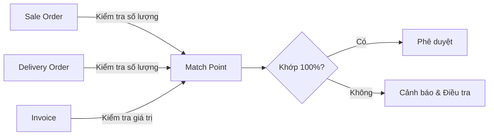

# QUY TRÌNH KIỂM SOÁT SALE ORDER VÀ ĐỐI CHIẾU HÓA ĐƠN BÁN HÀNG

## Tổng quan
Quy trình kiểm soát sale order đảm bảo tính chính xác và đồng bộ giữa các bên liên quan: Khách hàng, Phòng kinh doanh, Kho hàng, Kế toán và Quản lý.

## Sơ đồ quy trình kiểm soát Sale Order

```mermaid
flowchart TB
    Start([Bắt đầu: Nhận yêu cầu từ khách hàng]) --> CreateSO[Tạo Sale Order<br/>- Mã SO<br/>- Thông tin KH<br/>- Danh sách hàng hóa<br/>- Số lượng, đơn giá<br/>- Điều khoản thanh toán]
    
    CreateSO --> CheckCredit{Kiểm tra<br/>Hạn mức<br/>tín dụng}
    
    CheckCredit -->|Vượt hạn mức| RejectSO[Từ chối SO<br/>Thông báo KH]
    RejectSO --> End1([Kết thúc])
    
    CheckCredit -->|Trong hạn mức| CheckInventory{Kiểm tra<br/>Tồn kho}
    
    CheckInventory -->|Không đủ hàng| CreatePO[Tạo Purchase Order<br/>Đặt hàng NCC]
    CreatePO --> WaitGoods[Chờ nhận hàng]
    WaitGoods --> CheckInventory
    
    CheckInventory -->|Đủ hàng| ApproveSO[Phê duyệt SO<br/>Bởi: Sales Manager]
    
    ApproveSO --> CreateDO[Tạo Delivery Order<br/>- Mã DO<br/>- Tham chiếu SO<br/>- Địa chỉ giao hàng<br/>- Ngày giao dự kiến]
    
    CreateDO --> PickGoods[Xuất kho/Picking<br/>- Kiểm tra chất lượng<br/>- Đóng gói<br/>- Cập nhật số serial/lot]
    
    PickGoods --> DeliverGoods[Giao hàng cho KH<br/>- Ký nhận DO<br/>- Chụp ảnh xác nhận]
    
    DeliverGoods --> CustomerSign{KH ký nhận<br/>đầy đủ?}
    
    CustomerSign -->|Có vấn đề| HandleIssue[Xử lý khiếu nại<br/>- Hàng thiếu/hư<br/>- Đổi trả<br/>- Ghi chú]
    HandleIssue --> UpdateDO[Cập nhật DO]
    UpdateDO --> CustomerSign
    
    CustomerSign -->|Đầy đủ| CreateInvoice[Tạo Hóa đơn bán hàng<br/>- Mã Invoice<br/>- Tham chiếu SO & DO<br/>- Giá trị trước thuế<br/>- VAT<br/>- Tổng giá trị]
    
    CreateInvoice --> ReconcileControl[KIỂM SOÁT ĐỐI CHIẾU]
    
    ReconcileControl --> CheckSO_DO{SO = DO?<br/>Số lượng<br/>Mã hàng}
    CheckSO_DO -->|Không khớp| Alert1[Cảnh báo sai lệch<br/>SO-DO]
    Alert1 --> Investigate1[Điều tra nguyên nhân]
    Investigate1 --> AdjustDO[Điều chỉnh DO<br/>hoặc tạo Credit Note]
    AdjustDO --> CheckSO_DO
    
    CheckSO_DO -->|Khớp| CheckDO_INV{DO = Invoice?<br/>Số lượng<br/>Giá trị}
    
    CheckDO_INV -->|Không khớp| Alert2[Cảnh báo sai lệch<br/>DO-Invoice]
    Alert2 --> Investigate2[Điều tra nguyên nhân]
    Investigate2 --> AdjustInv[Điều chỉnh Invoice<br/>hoặc tạo Debit Note]
    AdjustInv --> CheckDO_INV
    
    CheckDO_INV -->|Khớp| CheckInventory2{Cập nhật<br/>tồn kho<br/>chính xác?}
    
    CheckInventory2 -->|Không| Alert3[Cảnh báo sai lệch<br/>Inventory]
    Alert3 --> AdjustInv2[Điều chỉnh phiếu xuất kho]
    AdjustInv2 --> CheckInventory2
    
    CheckInventory2 -->|Đúng| SendInvoice[Gửi Invoice cho KH<br/>- Email<br/>- Bản cứng<br/>- Portal]
    
    SendInvoice --> RecordAR[Ghi nhận Khoản phải thu<br/>Debit: 131 - Phải thu KH<br/>Credit: 511 - Doanh thu]
    
    RecordAR --> Payment{KH thanh toán}
    
    Payment -->|Chưa đến hạn| Monitor[Theo dõi công nợ<br/>Nhắc nhở định kỳ]
    Monitor --> Payment
    
    Payment -->|Quá hạn| Reminder[Gửi thông báo nhắc nợ<br/>Cấp 1, 2, 3]
    Reminder --> Escalate{Quá 90 ngày?}
    Escalate -->|Có| LegalAction[Chuyển pháp lý<br/>Trích lập dự phòng]
    Escalate -->|Không| Payment
    
    Payment -->|Đã thanh toán| VerifyPayment[Xác nhận thanh toán<br/>- Đối chiếu số tiền<br/>- Kiểm tra phí/chiết khấu]
    
    VerifyPayment --> RecordPayment[Ghi nhận thanh toán<br/>Debit: 111/112 - Tiền<br/>Credit: 131 - Phải thu KH]
    
    RecordPayment --> Reconciliation[ĐỐI CHIẾU CUỐI KỲ]
    
    Reconciliation --> ReconcileSales{Đối chiếu<br/>Doanh thu}
    ReconcileSales --> ReconcileAR{Đối chiếu<br/>Công nợ}
    ReconcileAR --> ReconcileInventory{Đối chiếu<br/>Tồn kho}
    
    ReconcileInventory --> GenerateReport[Tạo báo cáo đối chiếu<br/>- Báo cáo doanh thu<br/>- Báo cáo công nợ<br/>- Báo cáo tồn kho<br/>- Báo cáo sai lệch]
    
    GenerateReport --> ReviewReport{Phê duyệt<br/>báo cáo}
    
    ReviewReport -->|Có sai lệch| InvestigateIssue[Điều tra và xử lý<br/>sai lệch]
    InvestigateIssue --> AdjustEntry[Điều chỉnh bút toán<br/>nếu cần thiết]
    AdjustEntry --> ReviewReport
    
    ReviewReport -->|Đã đối chiếu| Archive[Lưu trữ chứng từ<br/>- SO, DO, Invoice<br/>- Bảng đối chiếu<br/>- Biên bản họp]
    
    Archive --> End2([Kết thúc chu kỳ])
    
    style Start fill:#90EE90
    style End1 fill:#FFB6C1
    style End2 fill:#90EE90
    style ReconcileControl fill:#FFD700
    style CheckSO_DO fill:#87CEEB
    style CheckDO_INV fill:#87CEEB
    style CheckInventory2 fill:#87CEEB
    style Reconciliation fill:#FFD700
    style Alert1 fill:#FF6B6B
    style Alert2 fill:#FF6B6B
    style Alert3 fill:#FF6B6B
```

## Chi tiết các điểm kiểm soát chính

### 1. Kiểm soát tạo Sale Order
- **Mục đích**: Đảm bảo thông tin chính xác từ đầu
- **Kiểm tra**:
  - Thông tin khách hàng đầy đủ
  - Hạn mức tín dụng
  - Điều khoản thanh toán hợp lệ
  - Giá bán đúng theo bảng giá/hợp đồng

### 2. Kiểm soát Delivery Order
- **Mục đích**: Đảm bảo xuất đúng hàng
- **Kiểm tra**:
  - SO vs DO: Số lượng, mã hàng, mô tả
  - Chất lượng hàng hóa
  - Ký nhận của khách hàng
  - Serial/Lot number tracking

### 3. Kiểm soát Invoice
- **Mục đích**: Đảm bảo thanh toán chính xác
- **Kiểm tra**:
  - DO vs Invoice: Số lượng, đơn giá
  - Tính toán VAT đúng
  - Điều khoản thanh toán
  - Thông tin thuế GTGT

### 4. Đối chiếu 3 bên (Three-way Matching)

### 5. Kiểm soát tồn kho
- **Mục đích**: Đảm bảo số liệu kho chính xác
- **Kiểm tra**:
  - Xuất kho phản ánh đúng trên DO
  - Tồn kho thực tế = Tồn kho sổ sách
  - Định kỳ kiểm kê

### 6. Kiểm soát công nợ
- **Mục đích**: Quản lý dòng tiền
- **Kiểm tra**:
  - Tuổi nợ (Aging)
  - Hạn mức tín dụng
  - Lịch sử thanh toán
  - Dự phòng nợ khó đòi

## Ma trận trách nhiệm (RACI)

| Hoạt động | Sales | Warehouse | Accounting | Manager |
|-----------|-------|-----------|------------|---------|
| Tạo SO | R | I | I | A |
| Kiểm tra credit | C | - | R | A |
| Tạo DO | I | R | I | C |
| Xuất kho | I | R | C | I |
| Tạo Invoice | R | I | C | I |
| Đối chiếu SO-DO-INV | C | C | R | A |
| Theo dõi công nợ | C | - | R | A |
| Báo cáo cuối kỳ | C | C | R | A |

**Chú thích**: R=Responsible, A=Accountable, C=Consulted, I=Informed

## Các cảnh báo và xử lý sai lệch

### Sai lệch SO vs DO
1. **Thiếu hàng**: Tạo backorder hoặc hủy dòng SO
2. **Thừa hàng**: Kiểm tra và hoàn trả kho
3. **Sai mã hàng**: Điều chỉnh DO, thông báo KH

### Sai lệch DO vs Invoice
1. **Sai số lượng**: Tạo Credit/Debit Note
2. **Sai đơn giá**: Điều chỉnh Invoice, xin phê duyệt
3. **Sai VAT**: Điều chỉnh và xuất Invoice điều chỉnh

### Sai lệch Inventory
1. **Sai tồn kho**: Kiểm kê, lập biên bản điều chỉnh
2. **Sai giá vốn**: Xác định nguyên nhân, điều chỉnh bút toán
3. **Mất hàng/hư hỏng**: Lập biên bản, truy trách nhiệm

## Báo cáo và KPIs

### Báo cáo định kỳ
- **Hàng ngày**: Báo cáo xuất hàng và Invoice phát hành
- **Hàng tuần**: Báo cáo công nợ và tuổi nợ
- **Hàng tháng**: Báo cáo đối chiếu và sai lệch
- **Hàng quý**: Đánh giá hiệu quả kiểm soát

### KPIs chính
- **Perfect Order Rate**: % đơn hàng không có sai lệch
- **Matching Rate**: % khớp giữa SO-DO-Invoice
- **DSO (Days Sales Outstanding)**: Số ngày thu tiền trung bình
- **Inventory Accuracy**: Độ chính xác tồn kho
- **Bad Debt Ratio**: Tỷ lệ nợ khó đòi

## Quy định về chứng từ và lưu trữ

### Chứng từ bắt buộc
1. Sale Order (đã ký duyệt)
2. Delivery Order (có ký nhận KH)
3. Invoice (hóa đơn GTGT hợp lệ)
4. Bảng đối chiếu 3 bên
5. Biên bản xử lý sai lệch (nếu có)

### Thời gian lưu trữ
- **Chứng từ gốc**: 10 năm (theo quy định pháp luật)
- **Bản scan/digital**: Vĩnh viễn
- **Báo cáo đối chiếu**: 5 năm

## Công nghệ hỗ trợ

### Hệ thống ERP
- Module Sales Order Management
- Module Inventory Management
- Module Accounting & Finance
- Module Reporting & Analytics

### Tính năng tự động
- **Auto-matching**: Tự động đối chiếu SO-DO-Invoice
- **Alert system**: Cảnh báo sai lệch real-time
- **Workflow approval**: Phê duyệt điện tử
- **E-invoice integration**: Tích hợp hóa đơn điện tử

---

## Phụ lục: Biểu mẫu mẫu

### Template đối chiếu 3 bên

| Mã SO | Mã DO | Mã Invoice | Mã hàng | Tên hàng | SL SO | SL DO | SL Invoice | Đơn giá | Thành tiền | Trạng thái |
|-------|-------|------------|---------|----------|-------|-------|------------|---------|------------|------------|
| | | | | | | | | | | |

### Template báo cáo sai lệch

**Thông tin sai lệch**
- Loại sai lệch: [ ] SO-DO  [ ] DO-Invoice  [ ] Inventory
- Mức độ: [ ] Cao  [ ] Trung bình  [ ] Thấp
- Nguyên nhân:
- Giải pháp:
- Người chịu trách nhiệm:
- Thời hạn xử lý:

---

*Tài liệu này là phần của hệ thống quản lý quy trình BFlow Platform - v1.0*
*Cập nhật lần cuối: 03/10/2025*
