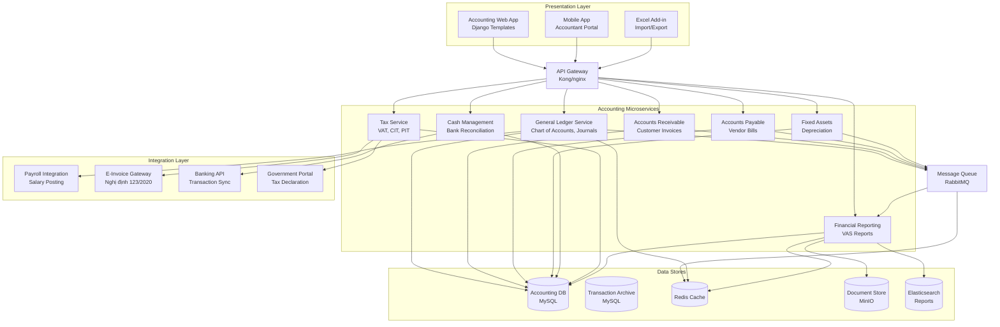
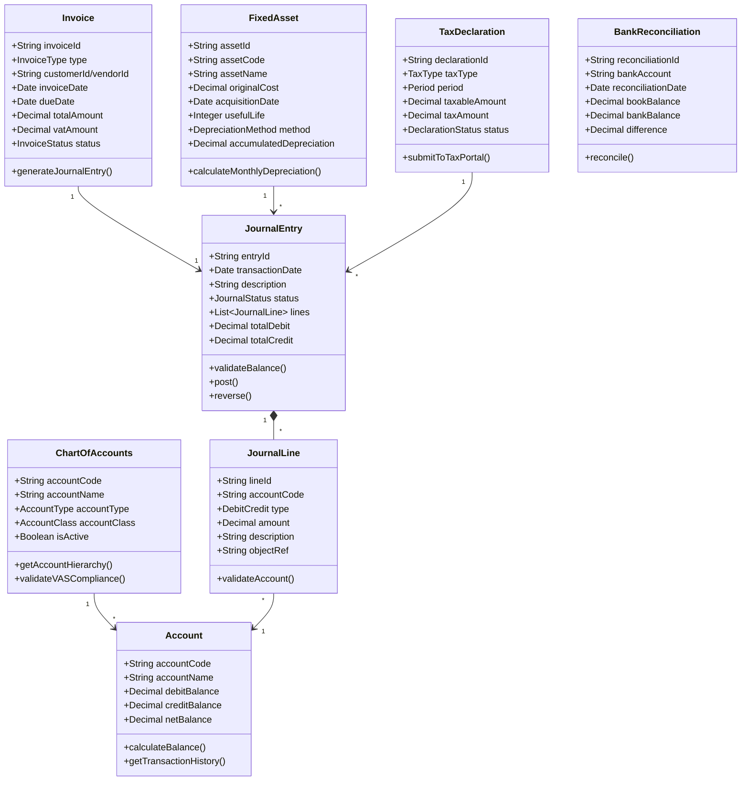
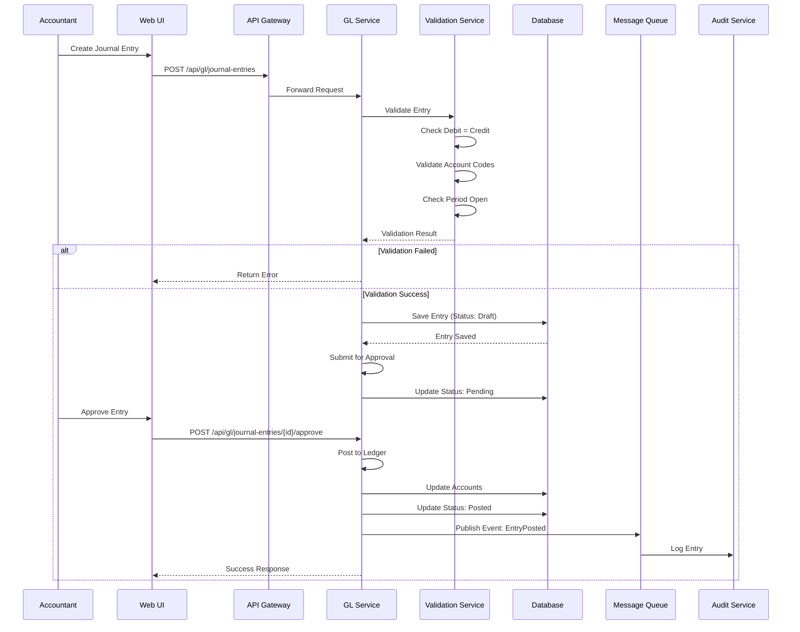
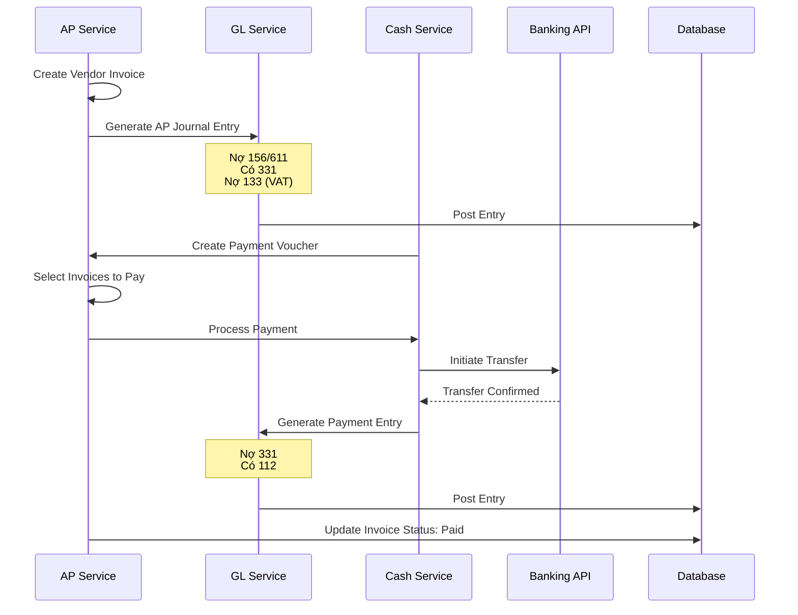
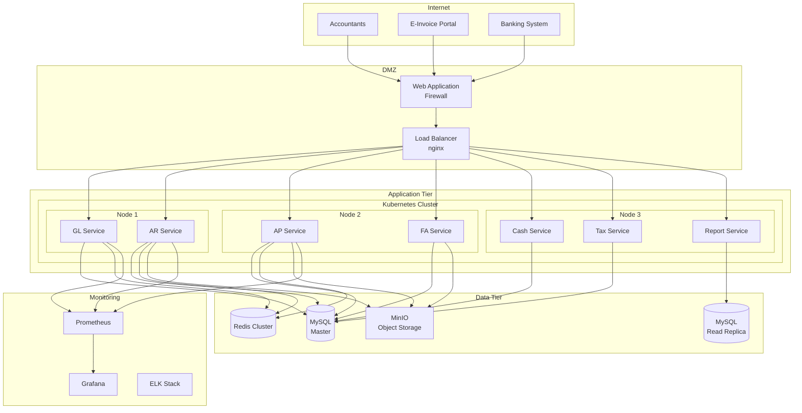
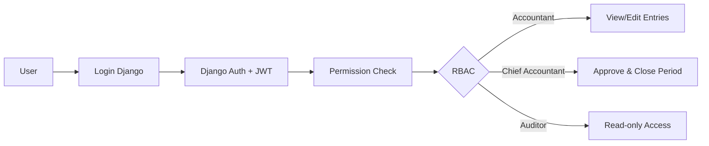

# ARCHITECTURE DESIGN DOCUMENT
## Hệ thống Kế toán - Accounting System

**Version:** 1.0
**Date:** 2024-10-09
**Status:** Draft
**Author:** Architecture Team

---

## MỤC LỤC
1. [Giới thiệu](#1-giới-thiệu)
2. [Kiến trúc Tổng quan](#2-kiến-trúc-tổng-quan)
3. [Architecture Views](#3-architecture-views)
4. [Technology Stack](#4-technology-stack)
5. [System Components](#5-system-components)
6. [Deployment Architecture](#6-deployment-architecture)
7. [Security Architecture](#7-security-architecture)
8. [Performance & Scalability](#8-performance--scalability)
9. [Integration Architecture](#9-integration-architecture)
10. [Architecture Decisions](#10-architecture-decisions)

---

## 1. GIỚI THIỆU

### 1.1 Mục đích
Tài liệu này mô tả kiến trúc tổng thể của Hệ thống Kế toán, tuân thủ Chuẩn mực Kế toán Việt Nam (VAS) và Thông tư 200/2014/TT-BTC.

### 1.2 Phạm vi
- Kiến trúc hệ thống kế toán cấp cao
- Các microservices và tương tác
- Công nghệ và frameworks
- Mô hình triển khai
- Chiến lược tích hợp với Payroll và hệ thống bên ngoài

### 1.3 Stakeholders
- Chief Financial Officer (CFO)
- Chief Accountant (Kế toán trưởng)
- Development Team
- Technical Architects
- DevOps Team
- Compliance & Audit Team

---

## 2. KIẾN TRÚC TỔNG QUAN

### 2.1 Architecture Style
**Microservices Architecture** với các đặc điểm:
- Domain-driven design cho accounting modules
- Service-oriented cho từng chức năng kế toán
- Event-driven architecture cho real-time updates
- CQRS pattern cho complex queries
- Eventual consistency với strong consistency cho financial transactions

### 2.2 Architecture Principles

| Principle | Description | Rationale |
|-----------|-------------|-----------|
| **Separation of Concerns** | Mỗi service quản lý một domain riêng (GL, AR, AP, FA) | Dễ maintain và audit |
| **Double-Entry Validation** | Mọi transaction đều cân đối Nợ-Có | Tuân thủ kế toán bút toán kép |
| **Audit Trail** | Log đầy đủ mọi thao tác | Compliance và truy xuất nguồn gốc |
| **Data Integrity** | ACID transactions cho financial data | Đảm bảo tính chính xác |
| **VAS Compliance** | Tuân thủ VAS và Thông tư 200 | Tuân thủ pháp luật VN |
| **Security by Design** | Encryption và access control từ đầu | Bảo vệ dữ liệu tài chính nhạy cảm |

### 2.3 High-Level Architecture Diagram



---

## 3. ARCHITECTURE VIEWS

### 3.1 Logical View

#### 3.1.1 Layered Architecture

| Layer | Responsibility | Components |
|-------|---------------|------------|
| **Presentation** | User Interface | Web App, Mobile, Excel Add-in |
| **API Gateway** | Routing, Auth, Rate limiting | Kong/nginx |
| **Business Logic** | Accounting business rules | Microservices (GL, AR, AP, FA, Tax) |
| **Data Access** | Data persistence | Django ORM, Repository pattern |
| **Integration** | External systems | Payroll, E-Invoice, Banking, Tax Portal |

#### 3.1.2 Accounting Domain Model



### 3.2 Process View

#### 3.2.1 Journal Entry Posting Sequence



#### 3.2.2 Invoice to Payment Flow



### 3.3 Development View

#### 3.3.1 Package Structure

```
accounting-system/
├── services/
│   ├── general-ledger-service/
│   │   ├── src/
│   │   │   ├── accounts/
│   │   │   ├── journals/
│   │   │   ├── period_close/
│   │   │   └── reports/
│   │   ├── tests/
│   │   └── Dockerfile
│   ├── ar-service/
│   │   ├── src/
│   │   │   ├── invoices/
│   │   │   ├── payments/
│   │   │   ├── customers/
│   │   │   └── aging/
│   ├── ap-service/
│   ├── fixed-assets-service/
│   ├── cash-management-service/
│   ├── tax-service/
│   └── reporting-service/
├── frontend/
│   ├── accounting-web/
│   └── excel-addin/
├── integration/
│   ├── payroll-connector/
│   ├── einvoice-gateway/
│   └── banking-connector/
├── infrastructure/
│   ├── docker-compose.yml
│   ├── kubernetes/
│   └── terraform/
└── shared/
    ├── accounting-standards/
    │   └── vas-rules/
    ├── common-libs/
    └── api-contracts/
```

---

## 4. TECHNOLOGY STACK

### 4.1 Backend Technologies

| Component | Technology | Version | Justification |
|-----------|-----------|---------|---------------|
| **Language** | Python | 3.11+ | Django ecosystem, extensive libraries |
| **Framework** | Django | 4.x | Full-stack, ORM, admin panel |
| **API** | Django REST Framework | 3.x | Powerful REST API toolkit |
| **Database** | MySQL | 8.0 | ACID compliance, JSON support for dynamic fields |
| **Cache** | Redis | 7.x | High performance caching |
| **Message Queue** | Celery + RabbitMQ | - | Async processing for reports |
| **Search** | Elasticsearch | 8.x | Full-text search for transactions |
| **File Storage** | MinIO | - | Document management (invoices, attachments) |

### 4.2 Frontend Technologies

| Component | Technology | Version | Justification |
|-----------|-----------|---------|---------------|
| **Template Engine** | Django Templates (DTL) | Built-in | Server-side rendering, SEO-friendly |
| **HTML/CSS/JS** | HTML5, CSS3, JavaScript | - | Lightweight, standard |
| **UI Framework** | Bootstrap 5 | 5.x | Responsive design |
| **DataTables** | DataTables.js | 1.x | Advanced table features for accounting grids |
| **Charts** | Chart.js | 4.x | Financial charts and dashboards |
| **Excel Integration** | SheetJS / ExcelJS | - | Import/Export accounting data |

### 4.3 Integration Technologies

| Component | Technology | Justification |
|-----------|-----------|---------------|
| **E-Invoice** | XML/SOAP | Nghị định 123/2020 compliance |
| **Banking API** | REST/Open Banking | Real-time transaction sync |
| **Tax Portal** | XML/REST | Electronic tax declaration |
| **Payroll** | REST API | Salary posting to GL |

---

## 5. SYSTEM COMPONENTS

### 5.1 Core Accounting Services

#### 5.1.1 General Ledger Service
- **Purpose:** Core accounting engine
- **Technology:** Django + Django REST Framework
- **Database:** MySQL (Chart of Accounts, Journals, Ledgers)
- **Features:**
  - Chart of Accounts management (Thông tư 200)
  - Journal entry CRUD with validation
  - Posting and reversal logic
  - Period closing and carry forward
  - Double-entry validation
  - Multi-currency support
- **API Endpoints:**
  - GET/POST/PUT/DELETE /api/gl/accounts/
  - GET/POST /api/gl/journal-entries/
  - POST /api/gl/journal-entries/{id}/post
  - POST /api/gl/period-close
  - GET /api/gl/ledger/{accountCode}

#### 5.1.2 Accounts Receivable Service
- **Purpose:** Customer invoicing and collections
- **Features:**
  - Customer invoice management
  - E-Invoice integration (Nghị định 123/2020)
  - Payment receipts
  - AR aging analysis
  - Credit limit checking
  - Customer statements
- **Key Algorithms:**
  - Aging buckets (0-30, 31-60, 61-90, 90+ days)
  - Payment allocation (FIFO, LIFO, manual)
  - Bad debt provisioning

#### 5.1.3 Accounts Payable Service
- **Purpose:** Vendor bill management and payments
- **Features:**
  - Vendor invoice processing
  - 3-way matching (PO-GR-Invoice)
  - Payment processing
  - AP aging analysis
  - Vendor statements
- **Integration:**
  - E-Invoice validation
  - Banking API for payments

#### 5.1.4 Fixed Assets Service
- **Purpose:** Asset lifecycle management
- **Features:**
  - Asset registration
  - Automatic depreciation calculation
  - Asset transfer between departments
  - Asset revaluation
  - Asset disposal
  - QR code/Barcode management
- **Depreciation Methods:**
  - Straight-line (Đường thẳng)
  - Declining balance (Số dư giảm dần)
- **Compliance:** VAS 03 - Tài sản cố định

#### 5.1.5 Cash Management Service
- **Purpose:** Cash and bank account management
- **Features:**
  - Cash book (Sổ quỹ)
  - Bank accounts management
  - Bank reconciliation
  - Cash flow forecasting
  - Payment vouchers
  - Receipt vouchers
- **Integration:**
  - Banking API for statement sync
  - Real-time balance updates

#### 5.1.6 Tax Service
- **Purpose:** Tax calculation and declaration
- **Features:**
  - VAT calculation (0%, 5%, 8%, 10%)
  - VAT declaration (Form 01/GTGT)
  - CIT calculation and declaration
  - PIT integration from Payroll
  - Tax payment tracking
  - Tax refund management
- **Compliance:**
  - Luật Thuế GTGT
  - Luật Thuế TNDN
  - Thông tư 219/2013/TT-BTC

#### 5.1.7 Financial Reporting Service
- **Purpose:** Generate financial reports per VAS
- **Features:**
  - Balance Sheet (Bảng cân đối kế toán - VAS)
  - Income Statement (Báo cáo kết quả kinh doanh)
  - Cash Flow Statement (Báo cáo lưu chuyển tiền tệ)
  - Notes to Financial Statements
  - Management reports
  - Custom report builder
  - Export to Excel, PDF
- **Report Templates:** Thông tư 133/2016/TT-BTC

### 5.2 Supporting Components

#### 5.2.1 Audit Service
- Comprehensive audit trails
- User activity logging
- Financial data change tracking
- Compliance reporting
- 7-year data retention

#### 5.2.2 Workflow Engine
- Approval workflows
- Multi-level approvals
- Configurable rules
- Email notifications

#### 5.2.3 Document Management
- Invoice attachments
- Contract storage
- Scanned receipts
- Version control

---

## 6. DEPLOYMENT ARCHITECTURE

### 6.1 Production Environment



### 6.2 Environment Specifications

| Environment | Purpose | Configuration |
|-------------|---------|---------------|
| **Development** | Local development | Docker Compose, single instance |
| **Testing** | QA testing | Kubernetes, 1 replica per service |
| **Staging** | Pre-production | Same as production, smaller scale |
| **Production** | Live system | HA setup, 3+ replicas |

### 6.3 Scaling Strategy

#### Horizontal Scaling
- Microservices: 3-5 replicas based on load
- Database: Read replicas for reporting
- Redis: Cluster mode with 6 nodes
- Report generation: Separate worker pool

#### Vertical Scaling
- Initial: 4 vCPU, 8GB RAM per service
- Peak: 8 vCPU, 16GB RAM

---

## 7. SECURITY ARCHITECTURE

### 7.1 Security Layers

| Layer | Security Measures |
|-------|------------------|
| **Network** | Firewall, VPN, DMZ segmentation |
| **Application** | Django authentication, JWT for API, RBAC |
| **Data** | AES-256 encryption at rest, TLS 1.3 in transit |
| **Audit** | Comprehensive logging, immutable audit trails |
| **Compliance** | VAS compliance checks, data retention policies |

### 7.2 Authentication & Authorization



### 7.3 Data Security
- **Encryption at Rest:** MySQL TDE (Transparent Data Encryption)
- **Encryption in Transit:** TLS 1.3
- **Sensitive Data:** Masking in logs and UI
- **Financial Data Protection:** Role-based column-level security
- **Backup:** Daily encrypted backups with 7-year retention

---

## 8. PERFORMANCE & SCALABILITY

### 8.1 Performance Requirements

| Metric | Target | Measurement |
|--------|--------|-------------|
| **Journal Entry Save** | <1 second | 95th percentile |
| **Report Generation** | <5 seconds | Standard reports |
| **Period Close** | <30 minutes | 10,000 transactions |
| **Concurrent Users** | 200+ | Active sessions |
| **Availability** | 99.9% | Monthly uptime |
| **RTO** | <4 hours | Recovery time |
| **RPO** | <1 hour | Data loss tolerance |

### 8.2 Performance Optimization

#### Caching Strategy
- **Redis:** Chart of Accounts, user sessions
- **Application Cache:** Tax rates, exchange rates
- **Database:** Materialized views for reports

#### Database Optimization
- Partitioning by fiscal year
- Indexes on account_code, transaction_date
- Read replicas for reporting
- Connection pooling

#### Async Processing
- Celery for report generation
- Background jobs for depreciation calculation
- Event-driven updates via RabbitMQ

---

## 9. INTEGRATION ARCHITECTURE

### 9.1 Integration Points

| System | Type | Protocol | Purpose |
|--------|------|----------|---------|
| **Payroll System** | Internal | REST API | Salary posting to GL |
| **E-Invoice Portal** | External | XML/SOAP | Invoice issuance (Nghị định 123) |
| **Banking System** | External | REST/Open Banking | Transaction sync |
| **Tax Portal** | External | XML | Tax declaration |
| **ERP Inventory** | Internal | REST API | COGS posting |

### 9.2 Integration Patterns

#### 9.2.1 Payroll to GL Integration
```
Payroll System → POST /api/gl/journal-entries
Body: {
  "source": "PAYROLL",
  "period": "2024-09",
  "entries": [
    {
      "account": "622",  // Salary expense
      "debit": 245000000,
      "description": "Salary Sep 2024"
    },
    {
      "account": "334",  // Salary payable
      "credit": 245000000
    }
  ]
}
```

#### 9.2.2 E-Invoice Integration
```
AR Service → E-Invoice Gateway → Tax Portal
- Generate invoice XML (CII format)
- Sign with HSM/USB token
- Submit to tax portal
- Receive invoice code
- Update AR with invoice status
```

#### 9.2.3 Banking Integration
```
Banking API → Cash Service
- Daily statement sync
- Transaction matching with vouchers
- Auto-reconciliation
- Variance reporting
```

---

## 10. ARCHITECTURE DECISIONS

### 10.1 Architecture Decision Records (ADRs)

| ADR# | Decision | Rationale | Consequences |
|------|----------|-----------|--------------|
| ADR-001 | Django Monolith over Microservices (initially) | Faster development, easier audit trail | May need to break into microservices later |
| ADR-002 | MySQL over PostgreSQL | Widespread use in VN, good JSON support | Vendor lock-in |
| ADR-003 | Django Templates over React SPA | Server-side rendering, better for compliance | Less interactive UI |
| ADR-004 | Event Sourcing for GL | Immutable audit trail, replay capability | Complexity in queries |
| ADR-005 | Elasticsearch for reporting | Fast full-text search on transactions | Additional infrastructure |
| ADR-006 | MinIO for documents | S3-compatible, self-hosted | Storage management |

### 10.2 VAS Compliance Decisions

| Decision | VAS Standard | Implementation |
|----------|-------------|----------------|
| Double-entry bookkeeping | VAS 01 | Validation in GL service |
| Chart of Accounts | Thông tư 200 | Configurable account structure |
| Financial statement format | Thông tư 133 | Report templates |
| Fixed asset depreciation | VAS 03 | Automatic calculation engine |
| Revenue recognition | VAS 14 | AR service logic |

### 10.3 Technical Debt

| Item | Priority | Mitigation |
|------|----------|------------|
| Monolith to microservices | Medium | Plan for gradual decomposition |
| Test coverage | High | Increase to 80%+ for financial logic |
| Real-time reporting | Low | Implement CQRS pattern |

---

## 11. DISASTER RECOVERY

### 11.1 Backup Strategy

| Data Type | Frequency | Retention | Location |
|-----------|-----------|-----------|----------|
| Transaction Data | Hourly | 7 years | Offsite backup |
| Financial Statements | Daily | 10 years | Encrypted archive |
| System Configs | On change | Versioned | Git repository |

### 11.2 Recovery Procedures

1. **Database Recovery**
   - Point-in-time recovery using binlogs
   - Automated failover to replica
   - Data integrity verification

2. **Service Recovery**
   - Kubernetes auto-restart
   - Health check monitoring
   - Load balancer failover

---

## 12. MONITORING & OBSERVABILITY

### 12.1 Key Metrics

| Category | Metrics |
|----------|---------|
| **Business** | Journal entries posted, Period close time, Report generation count |
| **Application** | API response time, Error rate, Queue depth |
| **Database** | Query performance, Lock wait time, Replication lag |
| **Integration** | E-Invoice success rate, Banking sync status |

### 12.2 Alerting Rules

| Alert | Condition | Action |
|-------|-----------|--------|
| Journal Imbalance | Debit != Credit | Block and alert accountant |
| Period Close Failure | Close process fails | Email CFO and accounting team |
| E-Invoice Error | >5% submission failures | Alert tax accountant |
| Database Lag | >10 seconds | Auto-failover |

---

## 13. COMPLIANCE & GOVERNANCE

### 13.1 Regulatory Compliance

- **Luật Kế toán 88/2015/QH13**
- **Chuẩn mực Kế toán Việt Nam (VAS 01-26)**
- **Thông tư 200/2014/TT-BTC** - Hệ thống tài khoản
- **Thông tư 133/2016/TT-BTC** - Báo cáo tài chính
- **Nghị định 123/2020/NĐ-CP** - Hóa đơn điện tử
- **Nghị định 13/2023/NĐ-CP** - Bảo vệ dữ liệu cá nhân

### 13.2 Architecture Governance

- Architecture review board (CFO, CTO, Chief Accountant)
- Quarterly architecture reviews
- Annual compliance audits
- External audit readiness

---

## 14. APPENDICES

### A. Glossary
| Term | Definition |
|------|------------|
| VAS | Vietnamese Accounting Standards |
| GL | General Ledger |
| AR | Accounts Receivable |
| AP | Accounts Payable |
| FA | Fixed Assets |
| COGS | Cost of Goods Sold |
| TDE | Transparent Data Encryption |

### B. References
- [VAS Standards](http://www.mof.gov.vn)
- [Thông tư 200/2014/TT-BTC](https://thuvienphapluat.vn)
- [Django Documentation](https://www.djangoproject.com/)
- [MySQL Documentation](https://dev.mysql.com/doc/)

### C. Version History
| Version | Date | Changes | Author |
|---------|------|---------|--------|
| 1.0 | 2024-10-09 | Initial version | Architecture Team |

---

**Document Status:** DRAFT
**Review Status:** Pending
**Approval:** Required from CFO and Chief Accountant
