# DETAILED DESIGN DOCUMENT
## Finance & Accounting Module

**Document Version:** 1.0
**Date:** 2025-10-09
**Project:** Bflow ERP System
**Module:** Finance & Accounting
**Phase:** Design (Thiết kế)

---

## Document Control

| Version | Date | Author | Changes |
|---------|------|--------|---------|
| 1.0 | 2025-10-09 | Design Team | Initial detailed design |

**Review & Approval:**
| Role | Name | Signature | Date |
|------|------|-----------|------|
| Tech Lead | | | |
| Chief Accountant | | | |
| Security Lead | | | |

---

## Table of Contents

1. [Introduction](#1-introduction)
2. [Domain Model](#2-domain-model)
3. [Class Diagrams](#3-class-diagrams)
4. [Sequence Diagrams](#4-sequence-diagrams)
5. [State Diagrams](#5-state-diagrams)
6. [Design Patterns](#6-design-patterns)
7. [Component Design](#7-component-design)
8. [Data Validation Rules](#8-data-validation-rules)
9. [Exception Handling](#9-exception-handling)
10. [Performance Considerations](#10-performance-considerations)

---

## 1. Introduction

### 1.1 Purpose
This document provides detailed object-oriented design for the Finance & Accounting module, including class structures, interactions, and behavioral models.

### 1.2 Scope
Covers:
- Domain model for accounting entities
- Class diagrams for all subsystems
- Sequence diagrams for critical workflows
- State machines for business objects
- Design patterns and best practices

### 1.3 References
- Architecture Design Document (1_ArchitectureDesign.md)
- Database Design Document (3_DatabaseDesign.md)
- VAS 01 - Presentation of Financial Statements
- Thông tư 200/2014/TT-BTC - Accounting Standards

---

## 2. Domain Model

### 2.1 Core Domain Entities

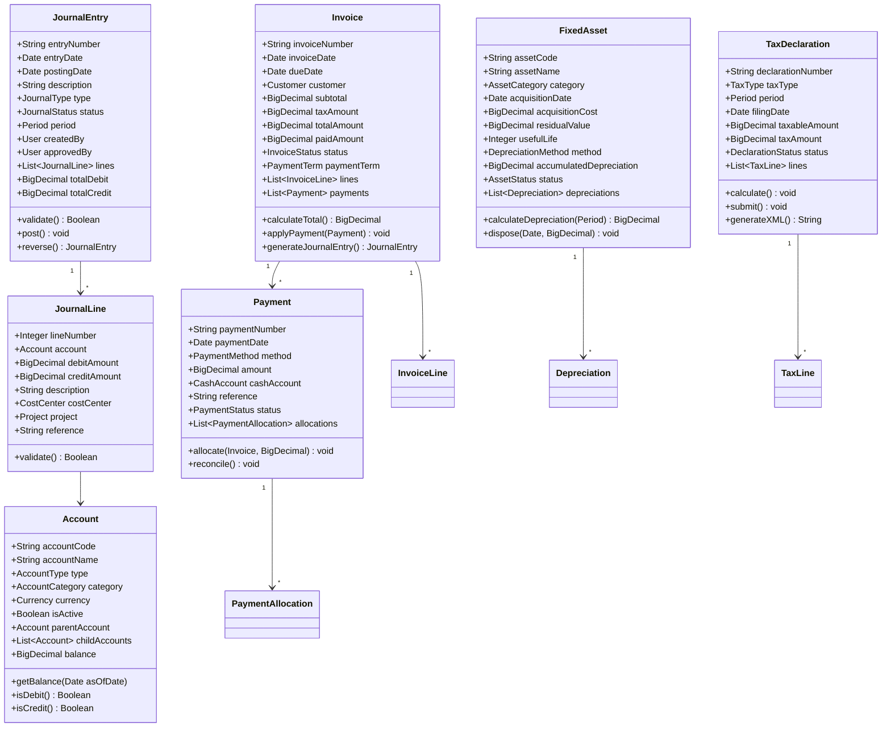
```mermaid
classDiagram
    class Account {
        +String accountCode
        +String accountName
        +AccountType type
        +AccountCategory category
        +Currency currency
        +Boolean isActive
        +Account parentAccount
        +List~Account~ childAccounts
        +BigDecimal balance
        +getBalance(Date asOfDate)
        +isDebit() Boolean
        +isCredit() Boolean
    }

    class JournalEntry {
        +String entryNumber
        +Date entryDate
        +Date postingDate
        +String description
        +JournalType type
        +JournalStatus status
        +Period period
        +User createdBy
        +User approvedBy
        +List~JournalLine~ lines
        +BigDecimal totalDebit
        +BigDecimal totalCredit
        +validate() Boolean
        +post() void
        +reverse() JournalEntry
    }

    class JournalLine {
        +Integer lineNumber
        +Account account
        +BigDecimal debitAmount
        +BigDecimal creditAmount
        +String description
        +CostCenter costCenter
        +Project project
        +String reference
        +validate() Boolean
    }

    class Invoice {
        +String invoiceNumber
        +Date invoiceDate
        +Date dueDate
        +Customer customer
        +BigDecimal subtotal
        +BigDecimal taxAmount
        +BigDecimal totalAmount
        +BigDecimal paidAmount
        +InvoiceStatus status
        +PaymentTerm paymentTerm
        +List~InvoiceLine~ lines
        +List~Payment~ payments
        +calculateTotal() BigDecimal
        +applyPayment(Payment) void
        +generateJournalEntry() JournalEntry
    }

    class Payment {
        +String paymentNumber
        +Date paymentDate
        +PaymentMethod method
        +BigDecimal amount
        +CashAccount cashAccount
        +String reference
        +PaymentStatus status
        +List~PaymentAllocation~ allocations
        +allocate(Invoice, BigDecimal) void
        +reconcile() void
    }

    class FixedAsset {
        +String assetCode
        +String assetName
        +AssetCategory category
        +Date acquisitionDate
        +BigDecimal acquisitionCost
        +BigDecimal residualValue
        +Integer usefulLife
        +DepreciationMethod method
        +BigDecimal accumulatedDepreciation
        +AssetStatus status
        +List~Depreciation~ depreciations
        +calculateDepreciation(Period) BigDecimal
        +dispose(Date, BigDecimal) void
    }

    class TaxDeclaration {
        +String declarationNumber
        +TaxType taxType
        +Period period
        +Date filingDate
        +BigDecimal taxableAmount
        +BigDecimal taxAmount
        +DeclarationStatus status
        +List~TaxLine~ lines
        +calculate() void
        +submit() void
        +generateXML() String
    }

    JournalEntry "1" --> "*" JournalLine
    Invoice "1" --> "*" InvoiceLine
    Invoice "1" --> "*" Payment
    Payment "1" --> "*" PaymentAllocation
    FixedAsset "1" --> "*" Depreciation
    TaxDeclaration "1" --> "*" TaxLine
    JournalLine --> Account
```

### 2.2 Accounting Equation Model

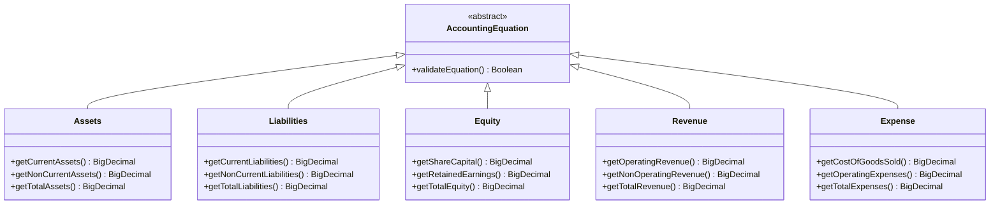
```mermaid
classDiagram
    class AccountingEquation {
        <<abstract>>
        +validateEquation() Boolean
    }

    class Assets {
        +getCurrentAssets() BigDecimal
        +getNonCurrentAssets() BigDecimal
        +getTotalAssets() BigDecimal
    }

    class Liabilities {
        +getCurrentLiabilities() BigDecimal
        +getNonCurrentLiabilities() BigDecimal
        +getTotalLiabilities() BigDecimal
    }

    class Equity {
        +getShareCapital() BigDecimal
        +getRetainedEarnings() BigDecimal
        +getTotalEquity() BigDecimal
    }

    class Revenue {
        +getOperatingRevenue() BigDecimal
        +getNonOperatingRevenue() BigDecimal
        +getTotalRevenue() BigDecimal
    }

    class Expense {
        +getCostOfGoodsSold() BigDecimal
        +getOperatingExpenses() BigDecimal
        +getTotalExpenses() BigDecimal
    }

    AccountingEquation <|-- Assets
    AccountingEquation <|-- Liabilities
    AccountingEquation <|-- Equity
    AccountingEquation <|-- Revenue
    AccountingEquation <|-- Expense
```

---

## 3. Class Diagrams

### 3.1 General Ledger Subsystem

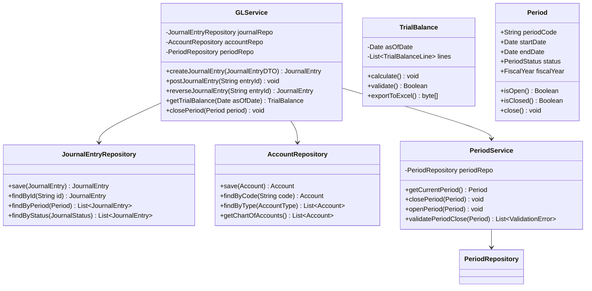
```mermaid
classDiagram
    class GLService {
        -JournalEntryRepository journalRepo
        -AccountRepository accountRepo
        -PeriodRepository periodRepo
        +createJournalEntry(JournalEntryDTO) JournalEntry
        +postJournalEntry(String entryId) void
        +reverseJournalEntry(String entryId) JournalEntry
        +getTrialBalance(Date asOfDate) TrialBalance
        +closePeriod(Period period) void
    }

    class JournalEntryRepository {
        +save(JournalEntry) JournalEntry
        +findById(String id) JournalEntry
        +findByPeriod(Period) List~JournalEntry~
        +findByStatus(JournalStatus) List~JournalEntry~
    }

    class AccountRepository {
        +save(Account) Account
        +findByCode(String code) Account
        +findByType(AccountType) List~Account~
        +getChartOfAccounts() List~Account~
    }

    class TrialBalance {
        -Date asOfDate
        -List~TrialBalanceLine~ lines
        +calculate() void
        +validate() Boolean
        +exportToExcel() byte[]
    }

    class PeriodService {
        -PeriodRepository periodRepo
        +getCurrentPeriod() Period
        +closePeriod(Period) void
        +openPeriod(Period) void
        +validatePeriodClose(Period) List~ValidationError~
    }

    class Period {
        +String periodCode
        +Date startDate
        +Date endDate
        +PeriodStatus status
        +FiscalYear fiscalYear
        +isOpen() Boolean
        +isClosed() Boolean
        +close() void
    }

    GLService --> JournalEntryRepository
    GLService --> AccountRepository
    GLService --> PeriodService
    PeriodService --> PeriodRepository
```

### 3.2 Accounts Receivable Subsystem

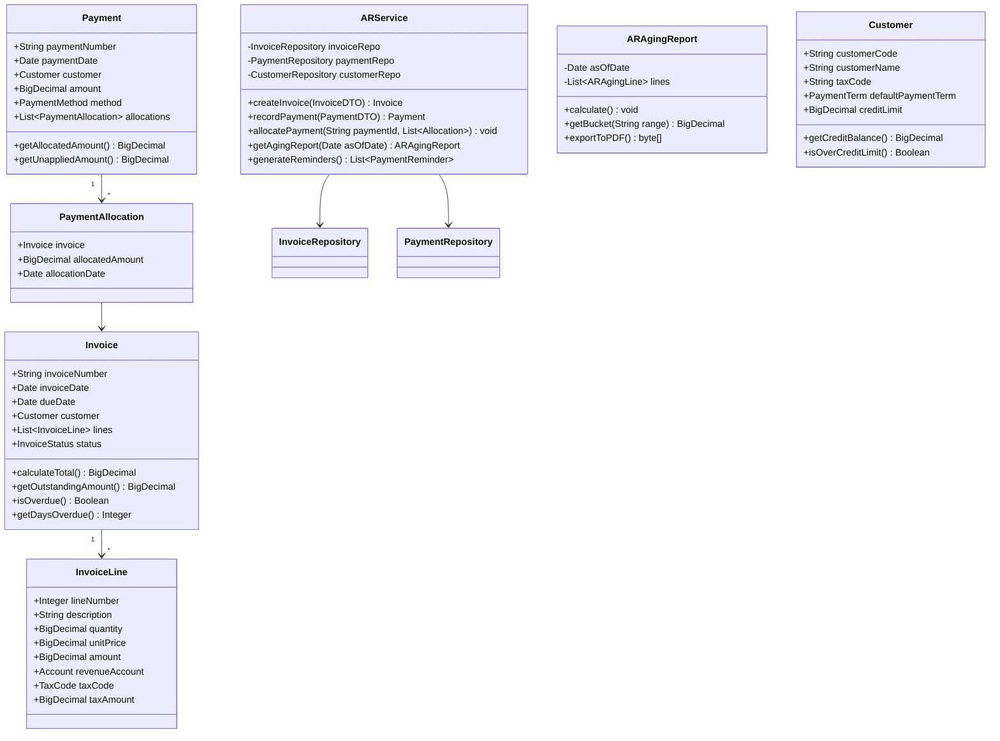
```mermaid
classDiagram
    class ARService {
        -InvoiceRepository invoiceRepo
        -PaymentRepository paymentRepo
        -CustomerRepository customerRepo
        +createInvoice(InvoiceDTO) Invoice
        +recordPayment(PaymentDTO) Payment
        +allocatePayment(String paymentId, List~Allocation~) void
        +getAgingReport(Date asOfDate) ARAgingReport
        +generateReminders() List~PaymentReminder~
    }

    class Invoice {
        +String invoiceNumber
        +Date invoiceDate
        +Date dueDate
        +Customer customer
        +List~InvoiceLine~ lines
        +InvoiceStatus status
        +calculateTotal() BigDecimal
        +getOutstandingAmount() BigDecimal
        +isOverdue() Boolean
        +getDaysOverdue() Integer
    }

    class InvoiceLine {
        +Integer lineNumber
        +String description
        +BigDecimal quantity
        +BigDecimal unitPrice
        +BigDecimal amount
        +Account revenueAccount
        +TaxCode taxCode
        +BigDecimal taxAmount
    }

    class Payment {
        +String paymentNumber
        +Date paymentDate
        +Customer customer
        +BigDecimal amount
        +PaymentMethod method
        +List~PaymentAllocation~ allocations
        +getAllocatedAmount() BigDecimal
        +getUnappliedAmount() BigDecimal
    }

    class PaymentAllocation {
        +Invoice invoice
        +BigDecimal allocatedAmount
        +Date allocationDate
    }

    class ARAgingReport {
        -Date asOfDate
        -List~ARAgingLine~ lines
        +calculate() void
        +getBucket(String range) BigDecimal
        +exportToPDF() byte[]
    }

    class Customer {
        +String customerCode
        +String customerName
        +String taxCode
        +PaymentTerm defaultPaymentTerm
        +BigDecimal creditLimit
        +getCreditBalance() BigDecimal
        +isOverCreditLimit() Boolean
    }

    ARService --> InvoiceRepository
    ARService --> PaymentRepository
    Invoice "1" --> "*" InvoiceLine
    Payment "1" --> "*" PaymentAllocation
    PaymentAllocation --> Invoice
```

### 3.3 Accounts Payable Subsystem

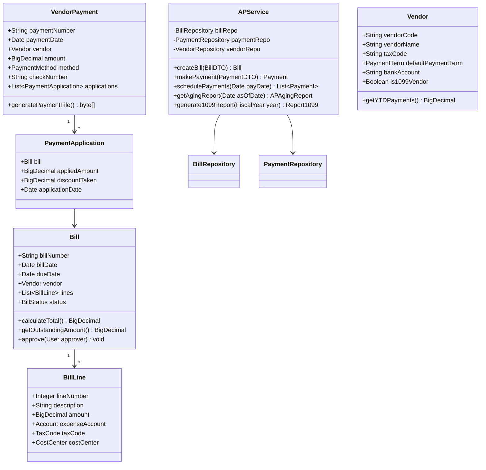
```mermaid
classDiagram
    class APService {
        -BillRepository billRepo
        -PaymentRepository paymentRepo
        -VendorRepository vendorRepo
        +createBill(BillDTO) Bill
        +makePayment(PaymentDTO) Payment
        +schedulePayments(Date payDate) List~Payment~
        +getAgingReport(Date asOfDate) APAgingReport
        +generate1099Report(FiscalYear year) Report1099
    }

    class Bill {
        +String billNumber
        +Date billDate
        +Date dueDate
        +Vendor vendor
        +List~BillLine~ lines
        +BillStatus status
        +calculateTotal() BigDecimal
        +getOutstandingAmount() BigDecimal
        +approve(User approver) void
    }

    class BillLine {
        +Integer lineNumber
        +String description
        +BigDecimal amount
        +Account expenseAccount
        +TaxCode taxCode
        +CostCenter costCenter
    }

    class VendorPayment {
        +String paymentNumber
        +Date paymentDate
        +Vendor vendor
        +BigDecimal amount
        +PaymentMethod method
        +String checkNumber
        +List~PaymentApplication~ applications
        +generatePaymentFile() byte[]
    }

    class PaymentApplication {
        +Bill bill
        +BigDecimal appliedAmount
        +BigDecimal discountTaken
        +Date applicationDate
    }

    class Vendor {
        +String vendorCode
        +String vendorName
        +String taxCode
        +PaymentTerm defaultPaymentTerm
        +String bankAccount
        +Boolean is1099Vendor
        +getYTDPayments() BigDecimal
    }

    APService --> BillRepository
    APService --> PaymentRepository
    Bill "1" --> "*" BillLine
    VendorPayment "1" --> "*" PaymentApplication
    PaymentApplication --> Bill
```

### 3.4 Fixed Assets Subsystem

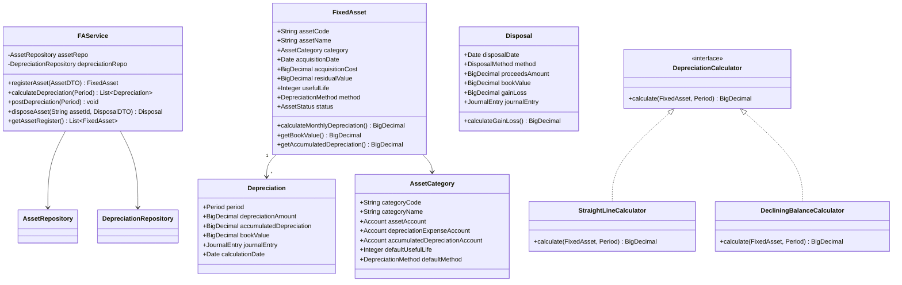
```mermaid
classDiagram
    class FAService {
        -AssetRepository assetRepo
        -DepreciationRepository depreciationRepo
        +registerAsset(AssetDTO) FixedAsset
        +calculateDepreciation(Period) List~Depreciation~
        +postDepreciation(Period) void
        +disposeAsset(String assetId, DisposalDTO) Disposal
        +getAssetRegister() List~FixedAsset~
    }

    class FixedAsset {
        +String assetCode
        +String assetName
        +AssetCategory category
        +Date acquisitionDate
        +BigDecimal acquisitionCost
        +BigDecimal residualValue
        +Integer usefulLife
        +DepreciationMethod method
        +AssetStatus status
        +calculateMonthlyDepreciation() BigDecimal
        +getBookValue() BigDecimal
        +getAccumulatedDepreciation() BigDecimal
    }

    class Depreciation {
        +Period period
        +BigDecimal depreciationAmount
        +BigDecimal accumulatedDepreciation
        +BigDecimal bookValue
        +JournalEntry journalEntry
        +Date calculationDate
    }

    class AssetCategory {
        +String categoryCode
        +String categoryName
        +Account assetAccount
        +Account depreciationExpenseAccount
        +Account accumulatedDepreciationAccount
        +Integer defaultUsefulLife
        +DepreciationMethod defaultMethod
    }

    class Disposal {
        +Date disposalDate
        +DisposalMethod method
        +BigDecimal proceedsAmount
        +BigDecimal bookValue
        +BigDecimal gainLoss
        +JournalEntry journalEntry
        +calculateGainLoss() BigDecimal
    }

    class DepreciationCalculator {
        <<interface>>
        +calculate(FixedAsset, Period) BigDecimal
    }

    class StraightLineCalculator {
        +calculate(FixedAsset, Period) BigDecimal
    }

    class DecliningBalanceCalculator {
        +calculate(FixedAsset, Period) BigDecimal
    }

    FAService --> AssetRepository
    FAService --> DepreciationRepository
    FixedAsset "1" --> "*" Depreciation
    FixedAsset --> AssetCategory
    DepreciationCalculator <|.. StraightLineCalculator
    DepreciationCalculator <|.. DecliningBalanceCalculator
```

### 3.5 Tax Management Subsystem

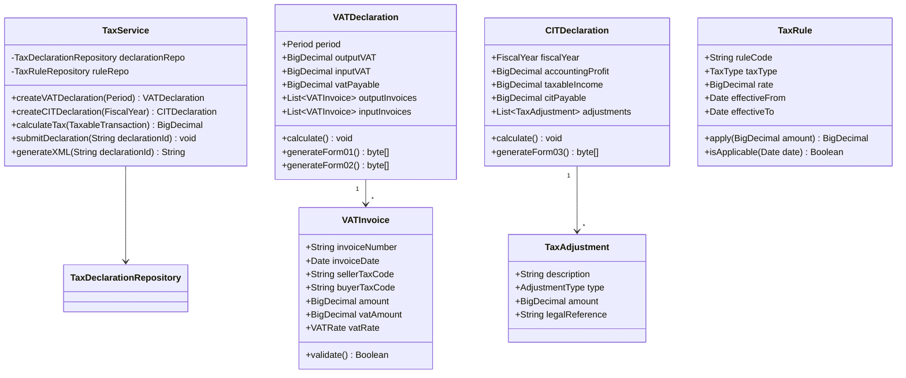
```mermaid
classDiagram
    class TaxService {
        -TaxDeclarationRepository declarationRepo
        -TaxRuleRepository ruleRepo
        +createVATDeclaration(Period) VATDeclaration
        +createCITDeclaration(FiscalYear) CITDeclaration
        +calculateTax(TaxableTransaction) BigDecimal
        +submitDeclaration(String declarationId) void
        +generateXML(String declarationId) String
    }

    class VATDeclaration {
        +Period period
        +BigDecimal outputVAT
        +BigDecimal inputVAT
        +BigDecimal vatPayable
        +List~VATInvoice~ outputInvoices
        +List~VATInvoice~ inputInvoices
        +calculate() void
        +generateForm01() byte[]
        +generateForm02() byte[]
    }

    class CITDeclaration {
        +FiscalYear fiscalYear
        +BigDecimal accountingProfit
        +BigDecimal taxableIncome
        +BigDecimal citPayable
        +List~TaxAdjustment~ adjustments
        +calculate() void
        +generateForm03() byte[]
    }

    class TaxRule {
        +String ruleCode
        +TaxType taxType
        +BigDecimal rate
        +Date effectiveFrom
        +Date effectiveTo
        +apply(BigDecimal amount) BigDecimal
        +isApplicable(Date date) Boolean
    }

    class VATInvoice {
        +String invoiceNumber
        +Date invoiceDate
        +String sellerTaxCode
        +String buyerTaxCode
        +BigDecimal amount
        +BigDecimal vatAmount
        +VATRate vatRate
        +validate() Boolean
    }

    class TaxAdjustment {
        +String description
        +AdjustmentType type
        +BigDecimal amount
        +String legalReference
    }

    TaxService --> TaxDeclarationRepository
    VATDeclaration "1" --> "*" VATInvoice
    CITDeclaration "1" --> "*" TaxAdjustment
```

---

## 4. Sequence Diagrams

### 4.1 Journal Entry Posting Flow

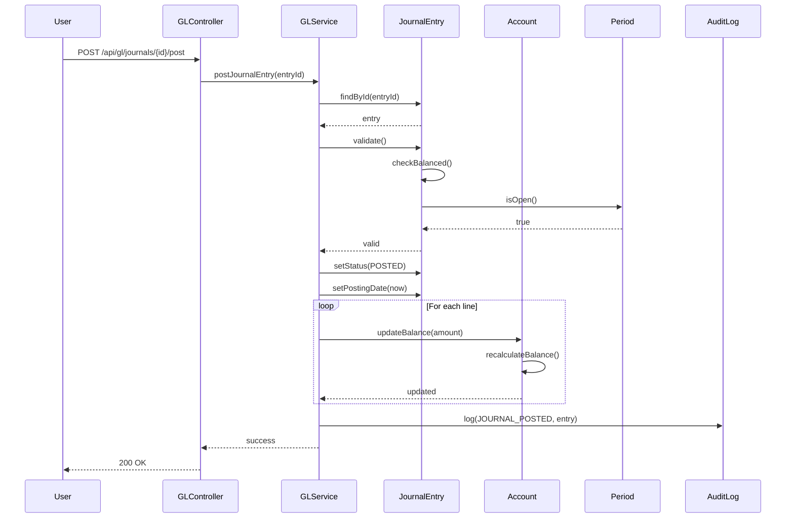
```mermaid
sequenceDiagram
    participant User
    participant GLController
    participant GLService
    participant JournalEntry
    participant Account
    participant Period
    participant AuditLog

    User->>GLController: POST /api/gl/journals/{id}/post
    GLController->>GLService: postJournalEntry(entryId)
    GLService->>JournalEntry: findById(entryId)
    JournalEntry-->>GLService: entry

    GLService->>JournalEntry: validate()
    JournalEntry->>JournalEntry: checkBalanced()
    JournalEntry->>Period: isOpen()
    Period-->>JournalEntry: true
    JournalEntry-->>GLService: valid

    GLService->>JournalEntry: setStatus(POSTED)
    GLService->>JournalEntry: setPostingDate(now)

    loop For each line
        GLService->>Account: updateBalance(amount)
        Account->>Account: recalculateBalance()
        Account-->>GLService: updated
    end

    GLService->>AuditLog: log(JOURNAL_POSTED, entry)
    GLService-->>GLController: success
    GLController-->>User: 200 OK
```

### 4.2 Invoice Creation and Payment Flow

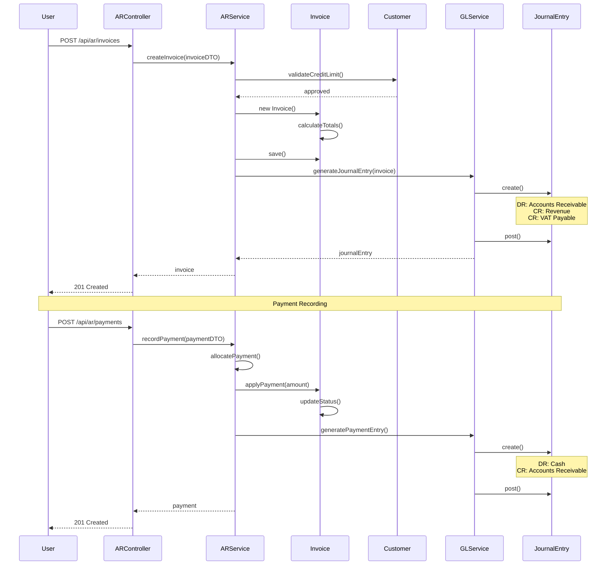
```mermaid
sequenceDiagram
    participant User
    participant ARController
    participant ARService
    participant Invoice
    participant Customer
    participant GLService
    participant JournalEntry

    User->>ARController: POST /api/ar/invoices
    ARController->>ARService: createInvoice(invoiceDTO)
    ARService->>Customer: validateCreditLimit()
    Customer-->>ARService: approved

    ARService->>Invoice: new Invoice()
    Invoice->>Invoice: calculateTotals()
    ARService->>Invoice: save()

    ARService->>GLService: generateJournalEntry(invoice)
    GLService->>JournalEntry: create()
    Note over JournalEntry: DR: Accounts Receivable<br/>CR: Revenue<br/>CR: VAT Payable
    GLService->>JournalEntry: post()
    GLService-->>ARService: journalEntry

    ARService-->>ARController: invoice
    ARController-->>User: 201 Created

    Note over User,JournalEntry: Payment Recording

    User->>ARController: POST /api/ar/payments
    ARController->>ARService: recordPayment(paymentDTO)
    ARService->>ARService: allocatePayment()
    ARService->>Invoice: applyPayment(amount)
    Invoice->>Invoice: updateStatus()

    ARService->>GLService: generatePaymentEntry()
    GLService->>JournalEntry: create()
    Note over JournalEntry: DR: Cash<br/>CR: Accounts Receivable
    GLService->>JournalEntry: post()

    ARService-->>ARController: payment
    ARController-->>User: 201 Created
```

### 4.3 Period-End Closing Procedure

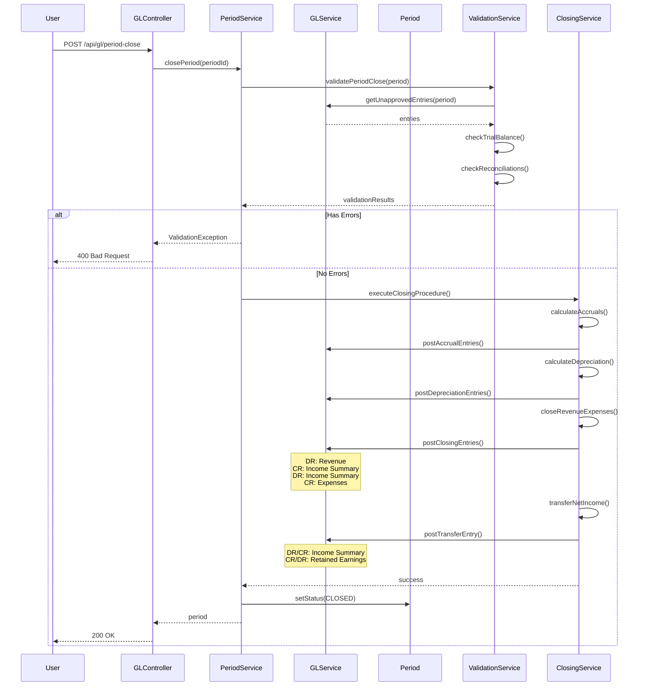
```mermaid
sequenceDiagram
    participant User
    participant GLController
    participant PeriodService
    participant GLService
    participant Period
    participant ValidationService
    participant ClosingService

    User->>GLController: POST /api/gl/period-close
    GLController->>PeriodService: closePeriod(periodId)

    PeriodService->>ValidationService: validatePeriodClose(period)
    ValidationService->>GLService: getUnapprovedEntries(period)
    GLService-->>ValidationService: entries
    ValidationService->>ValidationService: checkTrialBalance()
    ValidationService->>ValidationService: checkReconciliations()
    ValidationService-->>PeriodService: validationResults

    alt Has Errors
        PeriodService-->>GLController: ValidationException
        GLController-->>User: 400 Bad Request
    else No Errors
        PeriodService->>ClosingService: executeClosingProcedure()

        ClosingService->>ClosingService: calculateAccruals()
        ClosingService->>GLService: postAccrualEntries()

        ClosingService->>ClosingService: calculateDepreciation()
        ClosingService->>GLService: postDepreciationEntries()

        ClosingService->>ClosingService: closeRevenueExpenses()
        ClosingService->>GLService: postClosingEntries()
        Note over GLService: DR: Revenue<br/>CR: Income Summary<br/>DR: Income Summary<br/>CR: Expenses

        ClosingService->>ClosingService: transferNetIncome()
        ClosingService->>GLService: postTransferEntry()
        Note over GLService: DR/CR: Income Summary<br/>CR/DR: Retained Earnings

        ClosingService-->>PeriodService: success
        PeriodService->>Period: setStatus(CLOSED)
        PeriodService-->>GLController: period
        GLController-->>User: 200 OK
    end
```

### 4.4 Fixed Asset Acquisition and Depreciation

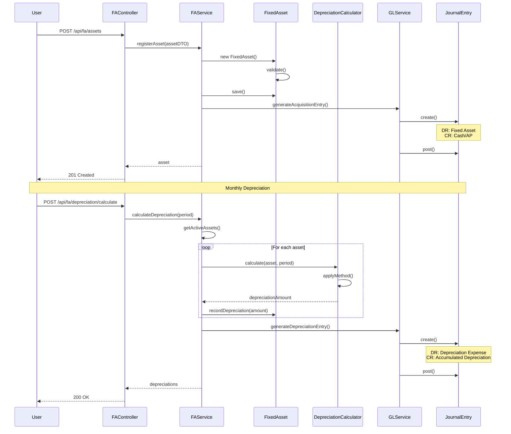
```mermaid
sequenceDiagram
    participant User
    participant FAController
    participant FAService
    participant FixedAsset
    participant DepreciationCalculator
    participant GLService
    participant JournalEntry

    User->>FAController: POST /api/fa/assets
    FAController->>FAService: registerAsset(assetDTO)
    FAService->>FixedAsset: new FixedAsset()
    FixedAsset->>FixedAsset: validate()
    FAService->>FixedAsset: save()

    FAService->>GLService: generateAcquisitionEntry()
    GLService->>JournalEntry: create()
    Note over JournalEntry: DR: Fixed Asset<br/>CR: Cash/AP
    GLService->>JournalEntry: post()

    FAService-->>FAController: asset
    FAController-->>User: 201 Created

    Note over User,JournalEntry: Monthly Depreciation

    User->>FAController: POST /api/fa/depreciation/calculate
    FAController->>FAService: calculateDepreciation(period)

    FAService->>FAService: getActiveAssets()
    loop For each asset
        FAService->>DepreciationCalculator: calculate(asset, period)
        DepreciationCalculator->>DepreciationCalculator: applyMethod()
        DepreciationCalculator-->>FAService: depreciationAmount
        FAService->>FixedAsset: recordDepreciation(amount)
    end

    FAService->>GLService: generateDepreciationEntry()
    GLService->>JournalEntry: create()
    Note over JournalEntry: DR: Depreciation Expense<br/>CR: Accumulated Depreciation
    GLService->>JournalEntry: post()

    FAService-->>FAController: depreciations
    FAController-->>User: 200 OK
```

### 4.5 VAT Declaration Submission

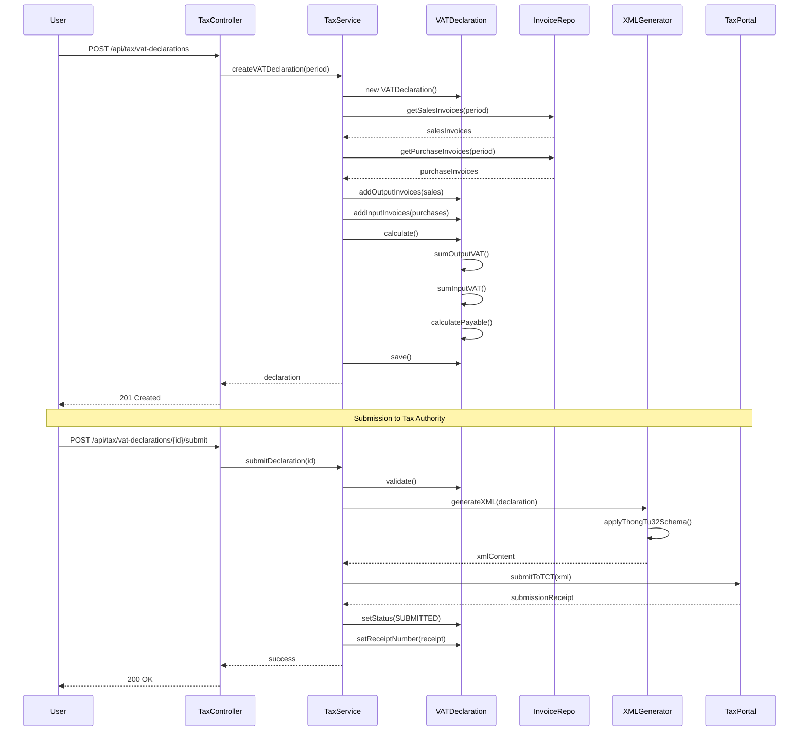
```mermaid
sequenceDiagram
    participant User
    participant TaxController
    participant TaxService
    participant VATDeclaration
    participant InvoiceRepo
    participant XMLGenerator
    participant TaxPortal

    User->>TaxController: POST /api/tax/vat-declarations
    TaxController->>TaxService: createVATDeclaration(period)

    TaxService->>VATDeclaration: new VATDeclaration()
    TaxService->>InvoiceRepo: getSalesInvoices(period)
    InvoiceRepo-->>TaxService: salesInvoices
    TaxService->>InvoiceRepo: getPurchaseInvoices(period)
    InvoiceRepo-->>TaxService: purchaseInvoices

    TaxService->>VATDeclaration: addOutputInvoices(sales)
    TaxService->>VATDeclaration: addInputInvoices(purchases)
    TaxService->>VATDeclaration: calculate()
    VATDeclaration->>VATDeclaration: sumOutputVAT()
    VATDeclaration->>VATDeclaration: sumInputVAT()
    VATDeclaration->>VATDeclaration: calculatePayable()

    TaxService->>VATDeclaration: save()
    TaxService-->>TaxController: declaration
    TaxController-->>User: 201 Created

    Note over User,TaxPortal: Submission to Tax Authority

    User->>TaxController: POST /api/tax/vat-declarations/{id}/submit
    TaxController->>TaxService: submitDeclaration(id)

    TaxService->>VATDeclaration: validate()
    TaxService->>XMLGenerator: generateXML(declaration)
    XMLGenerator->>XMLGenerator: applyThongTu32Schema()
    XMLGenerator-->>TaxService: xmlContent

    TaxService->>TaxPortal: submitToTCT(xml)
    TaxPortal-->>TaxService: submissionReceipt

    TaxService->>VATDeclaration: setStatus(SUBMITTED)
    TaxService->>VATDeclaration: setReceiptNumber(receipt)

    TaxService-->>TaxController: success
    TaxController-->>User: 200 OK
```

---

## 5. State Diagrams

### 5.1 Journal Entry Status

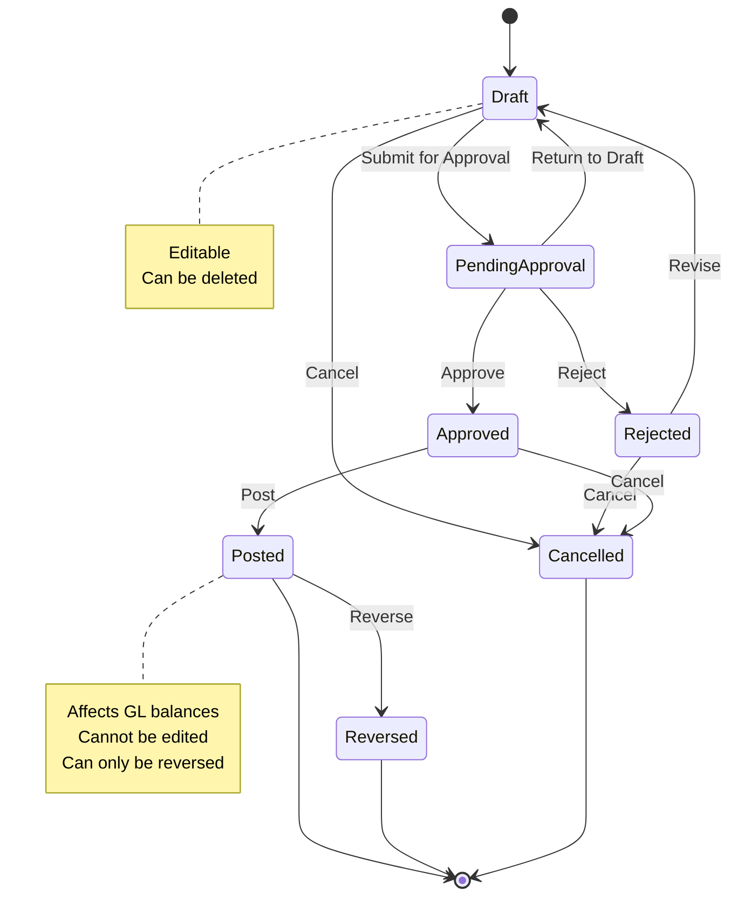
```mermaid
stateDiagram-v2
    [*] --> Draft
    Draft --> PendingApproval: Submit for Approval
    Draft --> Cancelled: Cancel

    PendingApproval --> Approved: Approve
    PendingApproval --> Rejected: Reject
    PendingApproval --> Draft: Return to Draft

    Rejected --> Draft: Revise
    Rejected --> Cancelled: Cancel

    Approved --> Posted: Post
    Approved --> Cancelled: Cancel

    Posted --> Reversed: Reverse
    Posted --> [*]

    Reversed --> [*]
    Cancelled --> [*]

    note right of Draft
        Editable
        Can be deleted
    end note

    note right of Posted
        Affects GL balances
        Cannot be edited
        Can only be reversed
    end note
```

### 5.2 Invoice Status

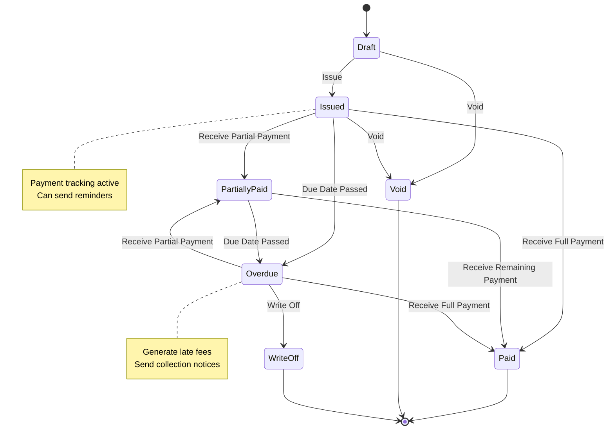
```mermaid
stateDiagram-v2
    [*] --> Draft
    Draft --> Issued: Issue
    Draft --> Void: Void

    Issued --> PartiallyPaid: Receive Partial Payment
    Issued --> Paid: Receive Full Payment
    Issued --> Overdue: Due Date Passed
    Issued --> Void: Void

    PartiallyPaid --> Paid: Receive Remaining Payment
    PartiallyPaid --> Overdue: Due Date Passed

    Overdue --> PartiallyPaid: Receive Partial Payment
    Overdue --> Paid: Receive Full Payment
    Overdue --> WriteOff: Write Off

    Paid --> [*]
    Void --> [*]
    WriteOff --> [*]

    note right of Issued
        Payment tracking active
        Can send reminders
    end note

    note right of Overdue
        Generate late fees
        Send collection notices
    end note
```

### 5.3 Period Status

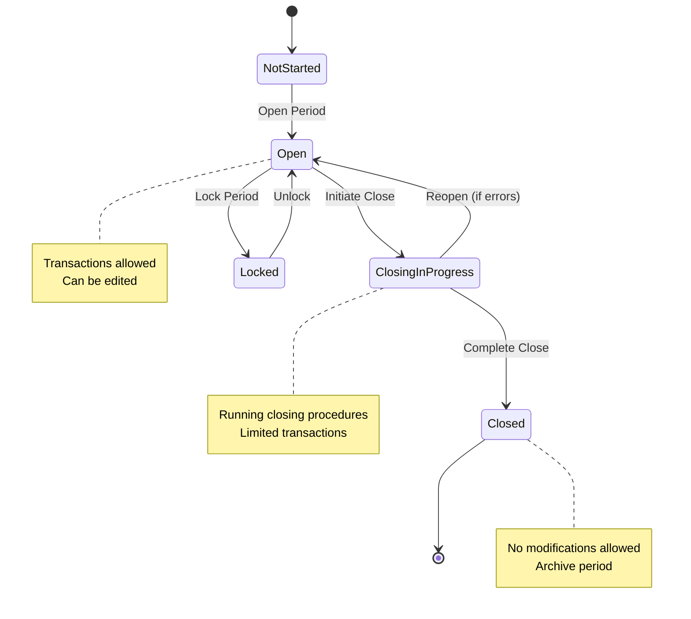
```mermaid
stateDiagram-v2
    [*] --> NotStarted
    NotStarted --> Open: Open Period

    Open --> ClosingInProgress: Initiate Close
    Open --> Locked: Lock Period

    ClosingInProgress --> Open: Reopen (if errors)
    ClosingInProgress --> Closed: Complete Close

    Locked --> Open: Unlock

    Closed --> [*]

    note right of Open
        Transactions allowed
        Can be edited
    end note

    note right of ClosingInProgress
        Running closing procedures
        Limited transactions
    end note

    note right of Closed
        No modifications allowed
        Archive period
    end note
```

### 5.4 Fixed Asset Status

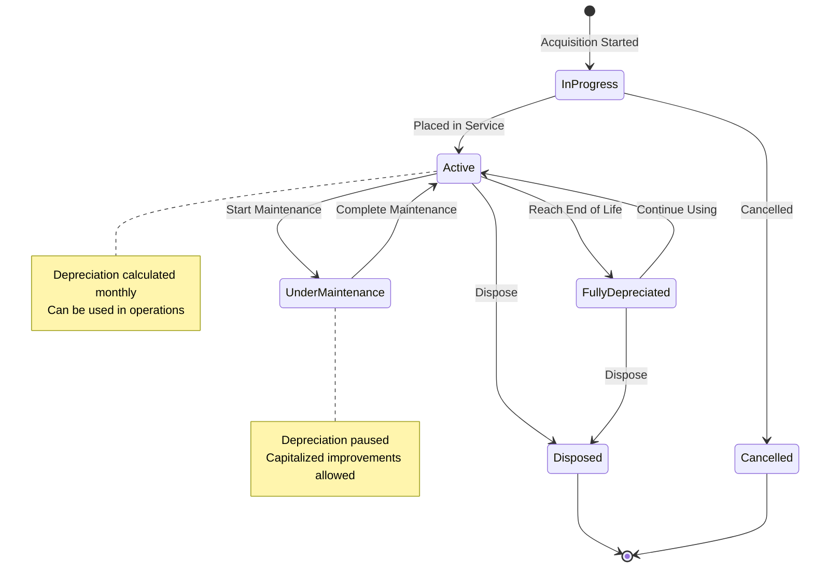
```mermaid
stateDiagram-v2
    [*] --> InProgress: Acquisition Started
    InProgress --> Active: Placed in Service
    InProgress --> Cancelled: Cancelled

    Active --> UnderMaintenance: Start Maintenance
    Active --> Disposed: Dispose
    Active --> FullyDepreciated: Reach End of Life

    UnderMaintenance --> Active: Complete Maintenance

    FullyDepreciated --> Disposed: Dispose
    FullyDepreciated --> Active: Continue Using

    Disposed --> [*]
    Cancelled --> [*]

    note right of Active
        Depreciation calculated monthly
        Can be used in operations
    end note

    note right of UnderMaintenance
        Depreciation paused
        Capitalized improvements allowed
    end note
```

---

## 6. Design Patterns

### 6.1 Strategy Pattern - Calculation Strategies

```java
// Strategy Interface
public interface CalculationStrategy {
    BigDecimal calculate(CalculationContext context);
}

// Concrete Strategies
public class TaxCalculationStrategy implements CalculationStrategy {
    @Override
    public BigDecimal calculate(CalculationContext context) {
        BigDecimal taxableAmount = context.getAmount();
        BigDecimal rate = context.getTaxRate();
        return taxableAmount.multiply(rate);
    }
}

public class DepreciationStraightLineStrategy implements CalculationStrategy {
    @Override
    public BigDecimal calculate(CalculationContext context) {
        BigDecimal cost = context.getAcquisitionCost();
        BigDecimal residual = context.getResidualValue();
        Integer life = context.getUsefulLife();
        return cost.subtract(residual).divide(new BigDecimal(life), RoundingMode.HALF_UP);
    }
}

public class DepreciationDecliningBalanceStrategy implements CalculationStrategy {
    @Override
    public BigDecimal calculate(CalculationContext context) {
        BigDecimal bookValue = context.getBookValue();
        BigDecimal rate = new BigDecimal("2.0").divide(
            new BigDecimal(context.getUsefulLife()),
            RoundingMode.HALF_UP
        );
        return bookValue.multiply(rate);
    }
}

// Context
public class CalculationContext {
    private CalculationStrategy strategy;

    public void setStrategy(CalculationStrategy strategy) {
        this.strategy = strategy;
    }

    public BigDecimal executeCalculation() {
        return strategy.calculate(this);
    }
}

// Usage
CalculationContext context = new CalculationContext();
context.setStrategy(new DepreciationStraightLineStrategy());
BigDecimal depreciation = context.executeCalculation();
```

### 6.2 Observer Pattern - Event Publishing

```java
// Event
public class AccountingEvent {
    private String eventType;
    private Object eventData;
    private LocalDateTime timestamp;
    private String userId;
}

// Observer Interface
public interface AccountingEventListener {
    void onEvent(AccountingEvent event);
}

// Concrete Observers
public class JournalEntryPostedListener implements AccountingEventListener {
    @Override
    public void onEvent(AccountingEvent event) {
        if ("JOURNAL_POSTED".equals(event.getEventType())) {
            JournalEntry entry = (JournalEntry) event.getEventData();
            // Update account balances
            // Trigger trial balance recalculation
            // Send notifications
        }
    }
}

public class InvoiceCreatedListener implements AccountingEventListener {
    @Override
    public void onEvent(AccountingEvent event) {
        if ("INVOICE_CREATED".equals(event.getEventType())) {
            Invoice invoice = (Invoice) event.getEventData();
            // Schedule payment reminder
            // Update customer credit limit
            // Generate journal entry
        }
    }
}

// Event Publisher
public class AccountingEventPublisher {
    private List<AccountingEventListener> listeners = new ArrayList<>();

    public void subscribe(AccountingEventListener listener) {
        listeners.add(listener);
    }

    public void publish(AccountingEvent event) {
        for (AccountingEventListener listener : listeners) {
            listener.onEvent(event);
        }
    }
}

// Usage in Service
@Service
public class GLService {
    @Autowired
    private AccountingEventPublisher eventPublisher;

    public void postJournalEntry(String entryId) {
        JournalEntry entry = journalRepo.findById(entryId);
        entry.post();
        journalRepo.save(entry);

        // Publish event
        AccountingEvent event = new AccountingEvent(
            "JOURNAL_POSTED", entry, LocalDateTime.now()
        );
        eventPublisher.publish(event);
    }
}
```

### 6.3 Repository Pattern - Data Access

```java
// Repository Interface
public interface JournalEntryRepository extends JpaRepository<JournalEntry, String> {
    List<JournalEntry> findByPeriod(Period period);
    List<JournalEntry> findByStatus(JournalStatus status);
    List<JournalEntry> findByCreatedBy(User user);

    @Query("SELECT j FROM JournalEntry j WHERE j.entryDate BETWEEN :start AND :end")
    List<JournalEntry> findByDateRange(
        @Param("start") LocalDate start,
        @Param("end") LocalDate end
    );
}

// Custom Repository Implementation
public interface JournalEntryRepositoryCustom {
    List<JournalEntry> findUnapprovedEntries(Period period);
    BigDecimal getTotalDebitForPeriod(Period period);
}

@Repository
public class JournalEntryRepositoryImpl implements JournalEntryRepositoryCustom {
    @PersistenceContext
    private EntityManager em;

    @Override
    public List<JournalEntry> findUnapprovedEntries(Period period) {
        CriteriaBuilder cb = em.getCriteriaBuilder();
        CriteriaQuery<JournalEntry> query = cb.createQuery(JournalEntry.class);
        Root<JournalEntry> root = query.from(JournalEntry.class);

        query.where(
            cb.and(
                cb.equal(root.get("period"), period),
                cb.or(
                    cb.equal(root.get("status"), JournalStatus.DRAFT),
                    cb.equal(root.get("status"), JournalStatus.PENDING_APPROVAL)
                )
            )
        );

        return em.createQuery(query).getResultList();
    }
}
```

### 6.4 Factory Pattern - Document Generation

```java
// Factory Interface
public interface FinancialReportFactory {
    FinancialReport createReport(ReportType type, ReportParameters params);
}

// Concrete Factory
public class FinancialReportFactoryImpl implements FinancialReportFactory {
    @Override
    public FinancialReport createReport(ReportType type, ReportParameters params) {
        switch (type) {
            case BALANCE_SHEET:
                return new BalanceSheetReport(params);
            case INCOME_STATEMENT:
                return new IncomeStatementReport(params);
            case CASH_FLOW:
                return new CashFlowReport(params);
            case TRIAL_BALANCE:
                return new TrialBalanceReport(params);
            case AR_AGING:
                return new ARAgingReport(params);
            default:
                throw new IllegalArgumentException("Unknown report type: " + type);
        }
    }
}

// Abstract Product
public abstract class FinancialReport {
    protected ReportParameters parameters;

    public FinancialReport(ReportParameters params) {
        this.parameters = params;
    }

    public abstract void generate();
    public abstract byte[] exportToPDF();
    public abstract byte[] exportToExcel();
}

// Concrete Products
public class BalanceSheetReport extends FinancialReport {
    public BalanceSheetReport(ReportParameters params) {
        super(params);
    }

    @Override
    public void generate() {
        // Query assets, liabilities, equity
        // Calculate totals
        // Validate accounting equation
    }
}
```

### 6.5 Template Method Pattern - Approval Workflow

```java
// Abstract Template
public abstract class ApprovalWorkflow<T> {

    // Template method
    public final void executeApproval(T item, User approver) {
        validateApprover(approver);
        validateItem(item);

        if (requiresAdditionalApproval(item)) {
            routeToNextApprover(item);
        } else {
            performApproval(item, approver);
            notifyStakeholders(item);
            executePostApprovalActions(item);
        }
    }

    protected abstract void validateApprover(User approver);
    protected abstract void validateItem(T item);
    protected abstract boolean requiresAdditionalApproval(T item);
    protected abstract void routeToNextApprover(T item);
    protected abstract void performApproval(T item, User approver);
    protected abstract void notifyStakeholders(T item);
    protected abstract void executePostApprovalActions(T item);
}

// Concrete Implementation
public class JournalEntryApprovalWorkflow extends ApprovalWorkflow<JournalEntry> {

    @Override
    protected void validateApprover(User approver) {
        if (!approver.hasRole("ACCOUNTANT") && !approver.hasRole("CHIEF_ACCOUNTANT")) {
            throw new UnauthorizedException("User not authorized to approve journal entries");
        }
    }

    @Override
    protected void validateItem(JournalEntry entry) {
        if (!entry.isBalanced()) {
            throw new ValidationException("Journal entry is not balanced");
        }
        if (entry.getStatus() != JournalStatus.PENDING_APPROVAL) {
            throw new ValidationException("Entry is not pending approval");
        }
    }

    @Override
    protected boolean requiresAdditionalApproval(JournalEntry entry) {
        // Entries over 100M VND require CFO approval
        return entry.getTotalDebit().compareTo(new BigDecimal("100000000")) > 0
            && !approver.hasRole("CFO");
    }

    @Override
    protected void performApproval(JournalEntry entry, User approver) {
        entry.setStatus(JournalStatus.APPROVED);
        entry.setApprovedBy(approver);
        entry.setApprovedDate(LocalDateTime.now());
    }
}
```

---

## 7. Component Design

### 7.1 Service Layer Components

```java
@Service
@Transactional
public class GeneralLedgerService {

    @Autowired
    private JournalEntryRepository journalRepo;

    @Autowired
    private AccountRepository accountRepo;

    @Autowired
    private PeriodService periodService;

    @Autowired
    private AccountingEventPublisher eventPublisher;

    @Autowired
    private AuditLogService auditService;

    /**
     * Creates a new journal entry
     * @param dto Journal entry data
     * @return Created journal entry
     * @throws ValidationException if validation fails
     */
    public JournalEntry createJournalEntry(JournalEntryDTO dto) {
        // Validate period is open
        Period period = periodService.getPeriod(dto.getPeriodId());
        if (!period.isOpen()) {
            throw new PeriodClosedException("Cannot create entry in closed period");
        }

        // Create entry
        JournalEntry entry = new JournalEntry();
        entry.setEntryDate(dto.getEntryDate());
        entry.setDescription(dto.getDescription());
        entry.setPeriod(period);
        entry.setStatus(JournalStatus.DRAFT);

        // Add lines
        for (JournalLineDTO lineDTO : dto.getLines()) {
            Account account = accountRepo.findByCode(lineDTO.getAccountCode());
            JournalLine line = new JournalLine();
            line.setAccount(account);
            line.setDebitAmount(lineDTO.getDebitAmount());
            line.setCreditAmount(lineDTO.getCreditAmount());
            line.setDescription(lineDTO.getDescription());
            entry.addLine(line);
        }

        // Validate
        if (!entry.isBalanced()) {
            throw new ValidationException("Journal entry debits and credits do not balance");
        }

        // Save
        entry = journalRepo.save(entry);

        // Audit
        auditService.log(AuditAction.JOURNAL_CREATED, entry);

        return entry;
    }

    /**
     * Posts a journal entry to the general ledger
     * @param entryId Journal entry ID
     * @throws ValidationException if entry cannot be posted
     */
    public void postJournalEntry(String entryId) {
        JournalEntry entry = journalRepo.findById(entryId)
            .orElseThrow(() -> new EntityNotFoundException("Journal entry not found"));

        // Validate status
        if (entry.getStatus() != JournalStatus.APPROVED) {
            throw new ValidationException("Only approved entries can be posted");
        }

        // Validate period
        if (!entry.getPeriod().isOpen()) {
            throw new PeriodClosedException("Cannot post to closed period");
        }

        // Post entry
        entry.setStatus(JournalStatus.POSTED);
        entry.setPostingDate(LocalDate.now());

        // Update account balances
        for (JournalLine line : entry.getLines()) {
            Account account = line.getAccount();
            if (line.getDebitAmount() != null && line.getDebitAmount().compareTo(BigDecimal.ZERO) > 0) {
                account.addDebit(line.getDebitAmount());
            }
            if (line.getCreditAmount() != null && line.getCreditAmount().compareTo(BigDecimal.ZERO) > 0) {
                account.addCredit(line.getCreditAmount());
            }
            accountRepo.save(account);
        }

        journalRepo.save(entry);

        // Publish event
        eventPublisher.publish(new AccountingEvent("JOURNAL_POSTED", entry));

        // Audit
        auditService.log(AuditAction.JOURNAL_POSTED, entry);
    }

    /**
     * Generates trial balance report
     * @param asOfDate As of date for balance
     * @return Trial balance
     */
    @Transactional(readOnly = true)
    public TrialBalance getTrialBalance(LocalDate asOfDate) {
        List<Account> accounts = accountRepo.findAll();
        TrialBalance tb = new TrialBalance(asOfDate);

        for (Account account : accounts) {
            BigDecimal balance = account.getBalance(asOfDate);
            TrialBalanceLine line = new TrialBalanceLine();
            line.setAccount(account);

            if (account.isDebitNormal()) {
                if (balance.compareTo(BigDecimal.ZERO) >= 0) {
                    line.setDebitBalance(balance);
                } else {
                    line.setCreditBalance(balance.abs());
                }
            } else {
                if (balance.compareTo(BigDecimal.ZERO) >= 0) {
                    line.setCreditBalance(balance);
                } else {
                    line.setDebitBalance(balance.abs());
                }
            }

            tb.addLine(line);
        }

        tb.calculate();
        return tb;
    }
}
```

### 7.2 Controller Layer Components

```java
@RestController
@RequestMapping("/api/gl")
@Validated
public class GeneralLedgerController {

    @Autowired
    private GeneralLedgerService glService;

    @PostMapping("/journals")
    @PreAuthorize("hasAnyRole('ACCOUNTANT', 'CHIEF_ACCOUNTANT')")
    public ResponseEntity<JournalEntryResponse> createJournalEntry(
            @Valid @RequestBody JournalEntryDTO dto) {

        JournalEntry entry = glService.createJournalEntry(dto);
        JournalEntryResponse response = JournalEntryMapper.toResponse(entry);

        return ResponseEntity
            .created(URI.create("/api/gl/journals/" + entry.getId()))
            .body(response);
    }

    @PostMapping("/journals/{id}/post")
    @PreAuthorize("hasRole('CHIEF_ACCOUNTANT')")
    public ResponseEntity<Void> postJournalEntry(@PathVariable String id) {
        glService.postJournalEntry(id);
        return ResponseEntity.ok().build();
    }

    @GetMapping("/trial-balance")
    @PreAuthorize("hasAnyRole('ACCOUNTANT', 'CHIEF_ACCOUNTANT', 'CFO')")
    public ResponseEntity<TrialBalanceResponse> getTrialBalance(
            @RequestParam @DateTimeFormat(iso = DateTimeFormat.ISO.DATE) LocalDate asOfDate) {

        TrialBalance tb = glService.getTrialBalance(asOfDate);
        TrialBalanceResponse response = TrialBalanceMapper.toResponse(tb);

        return ResponseEntity.ok(response);
    }
}
```

---

## 8. Data Validation Rules

### 8.1 Journal Entry Validation

| Field | Rule | Error Message |
|-------|------|---------------|
| Entry Date | Not null, within open period | Entry date must be in open period |
| Description | Not blank, max 500 chars | Description is required |
| Lines | Min 2 lines | At least 2 lines required for double-entry |
| Debit/Credit | Either debit OR credit, not both | Line must have either debit or credit, not both |
| Balance | Total debits = Total credits | Entry must balance (debits = credits) |
| Account | Valid, active account | Invalid or inactive account |
| Amount | > 0, max 2 decimal places | Amount must be positive with max 2 decimals |

### 8.2 Invoice Validation

| Field | Rule | Error Message |
|-------|------|---------------|
| Invoice Number | Unique, format: INV-YYYYMMDD-#### | Invalid invoice number format |
| Invoice Date | Not null, not future date | Invoice date cannot be in future |
| Due Date | >= Invoice date | Due date must be after invoice date |
| Customer | Valid, active customer | Invalid or inactive customer |
| Line Items | At least 1 line | Invoice must have at least one line item |
| Unit Price | > 0 | Unit price must be positive |
| Quantity | > 0 | Quantity must be positive |
| Tax Code | Valid VAT rate (0%, 5%, 10%) | Invalid tax code |
| Total | > 0 | Invoice total must be positive |
| Credit Limit | Customer balance + invoice <= limit | Customer credit limit exceeded |

### 8.3 Payment Validation

| Field | Rule | Error Message |
|-------|------|---------------|
| Payment Date | Not null, not future date | Payment date cannot be in future |
| Amount | > 0, <= invoice outstanding | Invalid payment amount |
| Payment Method | Valid method (Cash, Bank, Card) | Invalid payment method |
| Bank Account | Required if method = Bank | Bank account required for bank payments |
| Allocations | Sum <= payment amount | Allocation exceeds payment amount |
| Invoice | Valid, not fully paid | Invoice not found or already paid |

### 8.4 Fixed Asset Validation

| Field | Rule | Error Message |
|-------|------|---------------|
| Asset Code | Unique, format: FA-YYYY-#### | Invalid asset code format |
| Acquisition Cost | > 0 | Acquisition cost must be positive |
| Residual Value | >= 0, < acquisition cost | Residual value must be less than cost |
| Useful Life | > 0, <= 50 years | Useful life must be 1-50 years |
| Depreciation Method | SL, DB, or SYD | Invalid depreciation method |
| Acquisition Date | Not null, not future | Invalid acquisition date |

---

## 9. Exception Handling

### 9.1 Exception Hierarchy

```java
// Base Exception
public class AccountingException extends RuntimeException {
    private String errorCode;
    private Map<String, Object> details;

    public AccountingException(String message, String errorCode) {
        super(message);
        this.errorCode = errorCode;
    }
}

// Business Logic Exceptions
public class ValidationException extends AccountingException {
    public ValidationException(String message) {
        super(message, "VAL_001");
    }
}

public class PeriodClosedException extends AccountingException {
    public PeriodClosedException(String message) {
        super(message, "PERIOD_001");
    }
}

public class UnbalancedEntryException extends AccountingException {
    public UnbalancedEntryException(BigDecimal debit, BigDecimal credit) {
        super(String.format("Entry unbalanced: DR=%s, CR=%s", debit, credit), "JOURNAL_001");
    }
}

public class InsufficientCreditLimitException extends AccountingException {
    public InsufficientCreditLimitException(String customer, BigDecimal limit) {
        super(String.format("Credit limit exceeded for %s (limit: %s)", customer, limit), "AR_001");
    }
}

// Global Exception Handler
@ControllerAdvice
public class GlobalExceptionHandler {

    @ExceptionHandler(ValidationException.class)
    public ResponseEntity<ErrorResponse> handleValidation(ValidationException ex) {
        ErrorResponse error = new ErrorResponse(
            ex.getErrorCode(),
            ex.getMessage(),
            LocalDateTime.now()
        );
        return ResponseEntity.badRequest().body(error);
    }

    @ExceptionHandler(PeriodClosedException.class)
    public ResponseEntity<ErrorResponse> handlePeriodClosed(PeriodClosedException ex) {
        ErrorResponse error = new ErrorResponse(
            ex.getErrorCode(),
            ex.getMessage(),
            LocalDateTime.now()
        );
        return ResponseEntity.status(HttpStatus.CONFLICT).body(error);
    }

    @ExceptionHandler(EntityNotFoundException.class)
    public ResponseEntity<ErrorResponse> handleNotFound(EntityNotFoundException ex) {
        ErrorResponse error = new ErrorResponse(
            "NOT_FOUND",
            ex.getMessage(),
            LocalDateTime.now()
        );
        return ResponseEntity.status(HttpStatus.NOT_FOUND).body(error);
    }
}
```

### 9.2 Error Response Format

```json
{
  "errorCode": "JOURNAL_001",
  "message": "Entry unbalanced: DR=1000000, CR=900000",
  "timestamp": "2025-10-09T14:30:00",
  "details": {
    "debitTotal": 1000000,
    "creditTotal": 900000,
    "difference": 100000
  }
}
```

---

## 10. Performance Considerations

### 10.1 Database Query Optimization

```java
// Bad: N+1 Query Problem
public List<JournalEntry> getEntriesWithLines() {
    List<JournalEntry> entries = journalRepo.findAll();
    for (JournalEntry entry : entries) {
        // Lazy loading triggers N queries
        entry.getLines().size();
    }
    return entries;
}

// Good: Fetch Join
@Query("SELECT DISTINCT e FROM JournalEntry e LEFT JOIN FETCH e.lines WHERE e.period = :period")
List<JournalEntry> findByPeriodWithLines(@Param("period") Period period);

// Good: Entity Graph
@EntityGraph(attributePaths = {"lines", "lines.account"})
List<JournalEntry> findByPeriod(Period period);
```

### 10.2 Caching Strategy

```java
@Service
public class AccountService {

    // Cache chart of accounts (rarely changes)
    @Cacheable(value = "chartOfAccounts", key = "'all'")
    public List<Account> getChartOfAccounts() {
        return accountRepo.findAll();
    }

    // Cache account by code
    @Cacheable(value = "accounts", key = "#code")
    public Account findByCode(String code) {
        return accountRepo.findByCode(code);
    }

    // Evict cache when account updated
    @CacheEvict(value = {"accounts", "chartOfAccounts"}, allEntries = true)
    public Account updateAccount(Account account) {
        return accountRepo.save(account);
    }
}
```

### 10.3 Batch Processing

```java
@Service
public class DepreciationService {

    @Transactional
    public void calculateMonthlyDepreciation(Period period) {
        List<FixedAsset> assets = assetRepo.findActiveAssets();

        // Process in batches of 100
        int batchSize = 100;
        for (int i = 0; i < assets.size(); i += batchSize) {
            int end = Math.min(i + batchSize, assets.size());
            List<FixedAsset> batch = assets.subList(i, end);

            processBatch(batch, period);

            // Flush and clear to avoid memory issues
            entityManager.flush();
            entityManager.clear();
        }
    }

    private void processBatch(List<FixedAsset> assets, Period period) {
        for (FixedAsset asset : assets) {
            BigDecimal amount = calculator.calculate(asset, period);
            Depreciation dep = new Depreciation(asset, period, amount);
            depreciationRepo.save(dep);
        }
    }
}
```

### 10.4 Indexing Recommendations

```sql
-- Journal Entries
CREATE INDEX idx_journal_period ON gl_journals(period_id);
CREATE INDEX idx_journal_status ON gl_journals(status);
CREATE INDEX idx_journal_date ON gl_journals(entry_date);

-- Journal Lines
CREATE INDEX idx_journal_line_account ON gl_journal_entries(account_id);
CREATE INDEX idx_journal_line_journal ON gl_journal_entries(journal_id);

-- Invoices
CREATE INDEX idx_invoice_customer ON ar_invoices(customer_id);
CREATE INDEX idx_invoice_date ON ar_invoices(invoice_date);
CREATE INDEX idx_invoice_status ON ar_invoices(status);
CREATE INDEX idx_invoice_due_date ON ar_invoices(due_date);

-- Accounts
CREATE INDEX idx_account_code ON gl_accounts(account_code);
CREATE INDEX idx_account_type ON gl_accounts(account_type);
```

---

## Appendix A: Class Reference

### Core Entities
- **Account**: Chart of accounts entity
- **JournalEntry**: General ledger journal entry
- **Invoice**: Accounts receivable invoice
- **Bill**: Accounts payable vendor bill
- **Payment**: Cash receipt/payment
- **FixedAsset**: Fixed asset register
- **TaxDeclaration**: Tax filing documents

### Services
- **GLService**: General ledger operations
- **ARService**: Accounts receivable management
- **APService**: Accounts payable management
- **FAService**: Fixed asset management
- **TaxService**: Tax calculation and filing
- **PeriodService**: Accounting period management

### Repositories
- **JournalEntryRepository**: Journal entry data access
- **AccountRepository**: Account data access
- **InvoiceRepository**: Invoice data access
- **PaymentRepository**: Payment data access
- **AssetRepository**: Fixed asset data access

---

## Appendix B: Design Patterns Summary

| Pattern | Use Case | Location |
|---------|----------|----------|
| Strategy | Calculation algorithms (tax, depreciation) | CalculationStrategy |
| Observer | Event publishing and handling | AccountingEventPublisher |
| Repository | Data access abstraction | All repositories |
| Factory | Report generation | FinancialReportFactory |
| Template Method | Approval workflows | ApprovalWorkflow |
| Builder | Complex object construction | JournalEntryBuilder |
| Singleton | Configuration management | AppConfig |

---

## Document Approval

**Prepared by:** Design Team
**Reviewed by:** Tech Lead, Chief Accountant
**Approved by:** CTO
**Date:** 2025-10-09

---

**End of Document**
