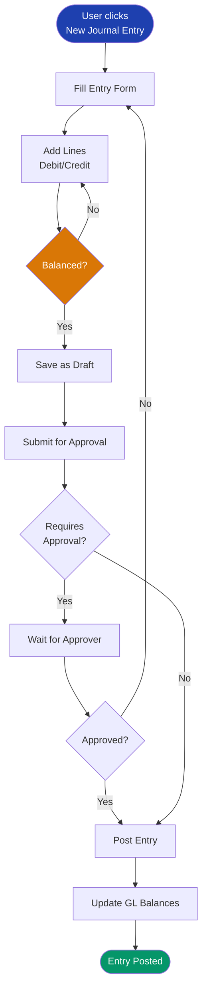
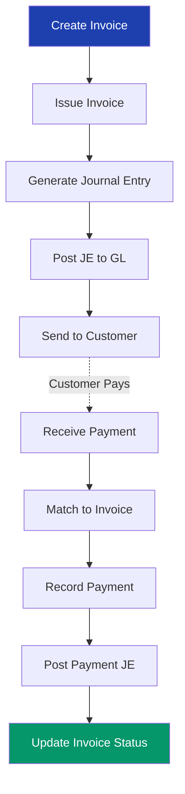
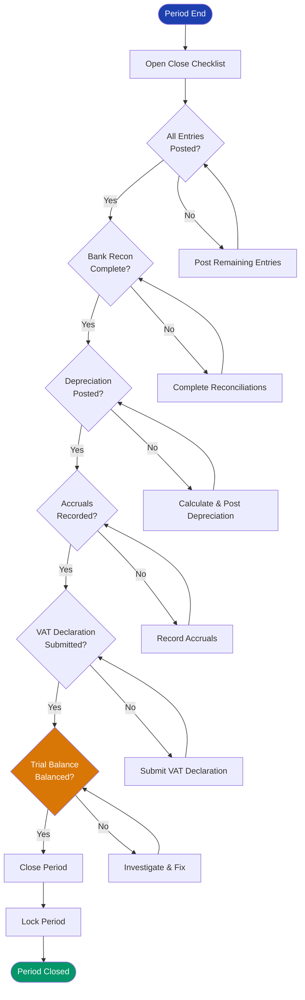

# UI/UX DESIGN DOCUMENT
## Finance & Accounting Module

**Document Version:** 1.0
**Date:** 2025-10-09
**Project:** Bflow ERP System
**Module:** Finance & Accounting
**Phase:** Design (Thiết kế)

---

## Document Control

| Version | Date | Author | Changes |
|---------|------|--------|---------|
| 1.0 | 2025-10-09 | UX Team | Initial UI/UX design |

**Review & Approval:**
| Role | Name | Signature | Date |
|------|------|-----------|------|
| UX Lead | | | |
| Product Owner | | | |
| Chief Accountant | | | |

---

## Table of Contents

1. [Introduction](#1-introduction)
2. [Design Principles](#2-design-principles)
3. [User Personas](#3-user-personas)
4. [Information Architecture](#4-information-architecture)
5. [Wireframes](#5-wireframes)
6. [Visual Design](#6-visual-design)
7. [Component Library](#7-component-library)
8. [User Flows](#8-user-flows)
9. [Responsive Design](#9-responsive-design)
10. [Accessibility](#10-accessibility)

---

## 1. Introduction

### 1.1 Purpose
This document defines the UI/UX design for the Finance & Accounting module, ensuring an intuitive, efficient, and accessible user experience for accounting professionals.

### 1.2 Design Goals
- **Efficiency**: Minimize clicks for common tasks
- **Clarity**: Clear information hierarchy
- **Accuracy**: Prevent errors through good design
- **Compliance**: Support Vietnam accounting standards
- **Accessibility**: WCAG 2.1 Level AA compliance

### 1.3 Target Platforms
- **Desktop Web**: Primary platform (Chrome, Edge, Firefox)
- **Tablet**: Secondary support (iPad, Android tablets)
- **Mobile**: View-only for reports and approvals

---

## 2. Design Principles

### 2.1 Core Principles

**1. Double-Entry Clarity**
- Always show both debit and credit sides
- Visual balance indicators
- Clear account hierarchy

**2. Data Density vs Readability**
- Accounting requires dense information
- Use progressive disclosure
- Collapsible sections for detail

**3. Error Prevention**
- Inline validation
- Clear error messages in Vietnamese
- Confirmation for critical actions

**4. Workflow Orientation**
- Guide users through multi-step processes
- Show progress indicators
- Save draft at each step

**5. Audit Trail Transparency**
- Show who, when, what changed
- Read-only view of posted entries
- Clear status indicators

---

## 3. User Personas

### 3.1 Persona 1: Chief Accountant (Kế toán trưởng)

**Name:** Trần Thị Mai (45 years old)
**Role:** Chief Accountant
**Goals:**
- Close month-end efficiently
- Ensure compliance with VAS
- Review and approve all journal entries
- Generate financial reports for management

**Pain Points:**
- Too many clicks to approve entries
- Hard to see period closing status
- Need better drill-down in reports

**Tech Proficiency:** Medium
**Daily Tasks:**
- Review 20-30 journal entries
- Approve invoices over 50M VND
- Close monthly period
- Generate management reports

**Design Requirements:**
- Dashboard with pending approvals
- Bulk approval capabilities
- One-click period close checklist
- Quick access to trial balance

---

### 3.2 Persona 2: AR/AP Clerk (Kế toán công nợ)

**Name:** Nguyễn Văn An (28 years old)
**Role:** AR/AP Accountant
**Goals:**
- Process invoices quickly
- Track customer payments
- Follow up on overdue invoices
- Reconcile payments

**Pain Points:**
- Manual data entry is slow
- Hard to match payments to invoices
- Need faster aging report

**Tech Proficiency:** High
**Daily Tasks:**
- Create 15-20 invoices
- Record 10-15 payments
- Send payment reminders
- Update aging report

**Design Requirements:**
- Quick invoice entry form
- Auto-complete for customers
- Payment matching wizard
- Real-time aging dashboard

---

### 3.3 Persona 3: Auditor (Kiểm toán viên)

**Name:** Lê Minh Hoàng (35 years old)
**Role:** Internal Auditor
**Goals:**
- Review transaction trail
- Export audit reports
- Verify account balances
- Check compliance

**Pain Points:**
- Can't see full audit trail
- Export formats not flexible
- Hard to trace transactions

**Tech Proficiency:** High
**Daily Tasks:**
- Review 50+ transactions
- Export general ledger
- Verify reconciliations
- Generate audit reports

**Design Requirements:**
- Read-only access with full visibility
- Advanced filtering and search
- Flexible export (Excel, PDF, CSV)
- Audit trail viewer

---

## 4. Information Architecture

### 4.1 Navigation Structure

```mermaid
graph TB
    Dashboard[Dashboard<br/>Tổng quan]

    GL[General Ledger<br/>Sổ cái]
    GL_COA[Chart of Accounts<br/>Hệ thống tài khoản]
    GL_JE[Journal Entries<br/>Bút toán]
    GL_Trial[Trial Balance<br/>Số dư]
    GL_Period[Period Close<br/>Khóa sổ]

    AR[Accounts Receivable<br/>Công nợ phải thu]
    AR_Cust[Customers<br/>Khách hàng]
    AR_Inv[Invoices<br/>Hóa đơn bán]
    AR_Rec[Receipts<br/>Phiếu thu]
    AR_Aging[Aging Report<br/>Báo cáo tuổi nợ]

    AP[Accounts Payable<br/>Công nợ phải trả]
    AP_Vend[Vendors<br/>Nhà cung cấp]
    AP_Bill[Bills<br/>Hóa đơn mua]
    AP_Pay[Payments<br/>Phiếu chi]

    FA[Fixed Assets<br/>Tài sản cố định]
    FA_Reg[Asset Register<br/>Danh mục TSCĐ]
    FA_Dep[Depreciation<br/>Khấu hao]

    Tax[Tax Management<br/>Thuế]
    Tax_VAT[VAT Declaration<br/>Tờ khai thuế GTGT]
    Tax_CIT[CIT Declaration<br/>Thuế TNDN]

    Reports[Reports<br/>Báo cáo]
    Reports_BS[Balance Sheet<br/>Bảng cân đối]
    Reports_IS[Income Statement<br/>KQKD]
    Reports_CF[Cash Flow<br/>Lưu chuyển tiền]

    Dashboard --> GL
    Dashboard --> AR
    Dashboard --> AP
    Dashboard --> FA
    Dashboard --> Tax
    Dashboard --> Reports

    GL --> GL_COA
    GL --> GL_JE
    GL --> GL_Trial
    GL --> GL_Period

    AR --> AR_Cust
    AR --> AR_Inv
    AR --> AR_Rec
    AR --> AR_Aging

    AP --> AP_Vend
    AP --> AP_Bill
    AP --> AP_Pay

    FA --> FA_Reg
    FA --> FA_Dep

    Tax --> Tax_VAT
    Tax --> Tax_CIT

    Reports --> Reports_BS
    Reports --> Reports_IS
    Reports --> Reports_CF
```



### 4.2 Page Hierarchy

**Level 1: Dashboard**
- Key metrics and KPIs
- Pending approvals
- Quick actions
- Recent activities

**Level 2: Module Landing Pages**
- AR, AP, GL, FA, Tax
- Summary statistics
- Quick filters
- Common actions

**Level 3: List Views**
- Invoices, Journals, Assets
- Advanced filters
- Bulk actions
- Export options

**Level 4: Detail/Edit Forms**
- Full CRUD operations
- Related data
- Audit trail
- Attachments

---

## 5. Wireframes

### 5.1 Dashboard

```
┌────────────────────────────────────────────────────────────────────────┐
│  BFLOW ERP - Finance & Accounting                          [User Menu] │
├────────────────────────────────────────────────────────────────────────┤
│  Dashboard  │  GL  │  AR  │  AP  │  FA  │  Tax  │  Reports  │  Admin  │
├────────────────────────────────────────────────────────────────────────┤
│                                                                          │
│  ┌──────────────────────────────────────────────┐  ┌──────────────────┐│
│  │  Pending Approvals (8)                   [>] │  │  Quick Actions   ││
│  ├──────────────────────────────────────────────┤  ├──────────────────┤│
│  │  • JE-2025-10-0025  1,100,000 VND           │  │  + New Invoice   ││
│  │  • INV-2025-10-0015  16,500,000 VND         │  │  + New Receipt   ││
│  │  • BILL-2025-10-0008  5,500,000 VND         │  │  + New Journal   ││
│  │  [View All]                                  │  │  + New Payment   ││
│  └──────────────────────────────────────────────┘  └──────────────────┘│
│                                                                          │
│  ┌─────────────────┬─────────────────┬─────────────────┬──────────────┐│
│  │  AR Outstanding │  AP Outstanding │  Cash Balance   │  Monthly P&L ││
│  │  320,000,000 ₫  │  180,000,000 ₫  │  300,000,000 ₫  │  +50,000,000 ₫│
│  │  ↑ 15% vs LM    │  ↓ 8% vs LM     │  ↓ 5% vs LM     │  ↑ 20% vs LM ││
│  └─────────────────┴─────────────────┴─────────────────┴──────────────┘│
│                                                                          │
│  ┌──────────────────────────────────────┐  ┌─────────────────────────┐ │
│  │  AR Aging (Top 5 Customers)          │  │  AP Aging (Due This Week│ │
│  ├──────────────────────────────────────┤  ├─────────────────────────┤ │
│  │  ABC Corp      45M ₫  [15 days]     │  │  Vendor XYZ  10M ₫  Oct 11│
│  │  DEF Ltd       30M ₫  [8 days]      │  │  Supplier A   8M ₫  Oct 12│
│  │  GHI Co        25M ₫  [45 days]     │  │  Vendor B     5M ₫  Oct 13│
│  │  [View Full Report]                  │  │  [View All]             │ │
│  └──────────────────────────────────────┘  └─────────────────────────┘ │
│                                                                          │
│  ┌────────────────────────────────────────────────────────────────────┐ │
│  │  Recent Activities                                                 │ │
│  ├────────────────────────────────────────────────────────────────────┤ │
│  │  2 mins ago    Nguyen Van A created JE-2025-10-0030               │ │
│  │  15 mins ago   Tran Thi B approved INV-2025-10-0025               │ │
│  │  1 hour ago    System posted depreciation for October 2025        │ │
│  └────────────────────────────────────────────────────────────────────┘ │
└────────────────────────────────────────────────────────────────────────┘
```

---

### 5.2 Chart of Accounts Tree View

```
┌────────────────────────────────────────────────────────────────────────┐
│  General Ledger > Chart of Accounts                                    │
├────────────────────────────────────────────────────────────────────────┤
│  [+ New Account]  [Import]  [Export]         [Search accounts...]  [🔍]│
├────────────────────────────────────────────────────────────────────────┤
│                                                                          │
│  ▼ 1 - Tài sản ngắn hạn (ASSET)                     Balance: 700M ₫    │
│    ▼ 11 - Tiền                                                          │
│      │  111 - Tiền mặt                                   50M ₫  [Edit]  │
│      ▼  112 - Tiền gửi ngân hàng                        250M ₫          │
│         │  1121 - VCB - TK 1234567890                  150M ₫  [Edit]  │
│         │  1122 - Techcombank - TK 9876543210          100M ₫  [Edit]  │
│    ▼ 13 - Các khoản phải thu                                            │
│      │  131 - Phải thu khách hàng                      150M ₫  [Edit]  │
│      │  133 - Thuế GTGT được khấu trừ                   18M ₫  [Edit]  │
│                                                                          │
│  ▼ 2 - Tài sản dài hạn (ASSET)                      Balance: 530M ₫    │
│    │  211 - Tài sản cố định hữu hình                  850M ₫  [Edit]   │
│    │  214 - Hao mòn TSCĐ hữu hình                    -320M ₫  [Edit]   │
│                                                                          │
│  ▼ 3 - Nợ phải trả (LIABILITY)                      Balance: 522M ₫    │
│    │  331 - Phải trả người bán                        100M ₫  [Edit]   │
│    │  3331 - Thuế GTGT phải nộp                        22M ₫  [Edit]   │
│    │  341 - Vay ngắn hạn                              150M ₫  [Edit]   │
│                                                                          │
│  ▼ 4 - Vốn chủ sở hữu (EQUITY)                      Balance: 808M ₫    │
│  ▼ 5 - Doanh thu (REVENUE)                          Balance: 2,500M ₫  │
│  ▼ 6 - Chi phí (EXPENSE)                            Balance: 2,050M ₫  │
│                                                                          │
└────────────────────────────────────────────────────────────────────────┘
```

---

### 5.3 Journal Entry Form (Double-Entry)

```
┌────────────────────────────────────────────────────────────────────────┐
│  Create Journal Entry                                     [Save Draft] │
│                                                           [Submit]      │
├────────────────────────────────────────────────────────────────────────┤
│                                                                          │
│  Entry Date:  [2025-10-09 ▼]     Period: [2025-10 ▼]  Status: DRAFT   │
│                                                                          │
│  Journal Type: [Manual ▼]        Source: [—]                            │
│                                                                          │
│  Description: [Record cash sale to customer ABC                       ]│
│                                                                          │
│  ┌────────────────────────────────────────────────────────────────────┐│
│  │ Line Items                                           [+ Add Line]  ││
│  ├────┬─────────────────┬──────────────┬──────────────┬──────────────┤│
│  │ #  │ Account         │ Debit        │ Credit       │ Description  ││
│  ├────┼─────────────────┼──────────────┼──────────────┼──────────────┤│
│  │ 1  │ 111 - Tiền mặt  │ 1,100,000.00 │              │ Cash from    ││
│  │    │                 │              │              │ customer     ││
│  │    │ CC: [—]  Project: [—]                                        ││
│  ├────┼─────────────────┼──────────────┼──────────────┼──────────────┤│
│  │ 2  │ 511 - Doanh thu │              │ 1,000,000.00 │ Sales revenue││
│  │    │                 │              │              │              ││
│  │    │ CC: [Sales]  Project: [PRJ-001]                              ││
│  ├────┼─────────────────┼──────────────┼──────────────┼──────────────┤│
│  │ 3  │ 3331 - VAT đầu  │              │   100,000.00 │ VAT 10%      ││
│  │    │ ra              │              │              │              ││
│  │    │ CC: [—]  Project: [—]                                        ││
│  ├────┴─────────────────┼──────────────┼──────────────┼──────────────┤│
│  │                TOTALS │ 1,100,000.00 │ 1,100,000.00 │ ✓ Balanced   ││
│  └──────────────────────┴──────────────┴──────────────┴──────────────┘│
│                                                                          │
│  Attachments: [📎 Upload files...]                                      │
│                                                                          │
│  Notes: [Additional notes...]                                           │
│                                                                          │
│                                              [Cancel]  [Save]  [Submit] │
└────────────────────────────────────────────────────────────────────────┘

Validation Rules (shown inline):
• Total Debit must equal Total Credit
• Each line must have either Debit OR Credit (not both)
• Account must be active and allow manual entry
• Period must be open
• If account requires Cost Center, it must be selected
```

---

### 5.4 Invoice Creation Form

```
┌────────────────────────────────────────────────────────────────────────┐
│  Create Invoice                                              [Save]    │
│                                                              [Issue]    │
├────────────────────────────────────────────────────────────────────────┤
│                                                                          │
│  Customer: [ABC Company ▼]  🔍                  Credit Limit: 100M ₫   │
│            Tax Code: 0123456789                 Available:    55M ₫   │
│                                                                          │
│  Invoice Date: [2025-10-09 ▼]    Due Date: [2025-11-08 ▼]  (30 days)  │
│                                                                          │
│  Payment Terms: [Net 30 Days ▼]  Currency: [VND ▼]                     │
│                                                                          │
│  ┌────────────────────────────────────────────────────────────────────┐│
│  │ Line Items                                           [+ Add Line]  ││
│  ├────┬────────────────┬─────┬───────────┬──────────┬────────┬───────┤│
│  │ #  │ Description    │ Qty │ Unit Price│ Amount   │ Tax    │ Total ││
│  ├────┼────────────────┼─────┼───────────┼──────────┼────────┼───────┤│
│  │ 1  │ Consulting     │ 20  │ 500,000   │10,000,000│VAT 10% │11,000K││
│  │    │ services Oct   │     │           │          │1,000K  │       ││
│  │    │ Revenue Acc: [511 - Doanh thu ▼]                             ││
│  ├────┼────────────────┼─────┼───────────┼──────────┼────────┼───────┤│
│  │ 2  │ Software       │  1  │ 5,000,000 │ 5,000,000│VAT 10% │5,500K ││
│  │    │ license 1 year │     │           │          │  500K  │       ││
│  │    │ Revenue Acc: [511 - Doanh thu ▼]                             ││
│  ├────┴────────────────┴─────┴───────────┼──────────┼────────┼───────┤│
│  │                                  TOTAL │15,000,000│1,500,000│16,500K││
│  └────────────────────────────────────────┴──────────┴────────┴───────┘│
│                                                                          │
│  Notes: [Payment by bank transfer to VCB 1234567890                   ]│
│                                                                          │
│  VAT Invoice:  ☑ Generate e-invoice    Template: [01GTKT0/001 ▼]       │
│                                                                          │
│                                              [Cancel]  [Save]  [Issue]  │
└────────────────────────────────────────────────────────────────────────┘

After clicking [Issue]:
• Customer credit limit is checked
• Invoice number auto-generated: INV-2025-10-0001
• Journal entry auto-created and posted
• VAT invoice record created
• Status changes to ISSUED
• Email/print options shown
```

---

### 5.5 Payment Matching Wizard

```
┌────────────────────────────────────────────────────────────────────────┐
│  Record Customer Payment                                Step 1 of 3    │
├────────────────────────────────────────────────────────────────────────┤
│                                                                          │
│  Customer: [ABC Company ▼]  🔍                                          │
│                                                                          │
│  Payment Date: [2025-10-09 ▼]                                           │
│                                                                          │
│  Amount Received: [16,500,000 ₫]                                        │
│                                                                          │
│  Payment Method: [Bank Transfer ▼]    Cash Account: [VCB-1234 ▼]       │
│                                                                          │
│  Reference: [TXN20251009123456]                                         │
│                                                                          │
│  ┌────────────────────────────────────────────────────────────────────┐│
│  │ Outstanding Invoices for ABC Company                               ││
│  ├────┬──────────────┬────────────┬──────────────┬──────────┬────────┤│
│  │ ☑  │ Invoice #    │ Date       │ Amount       │ Paid     │ Balance││
│  ├────┼──────────────┼────────────┼──────────────┼──────────┼────────┤│
│  │ ☑  │ INV-2025-10-1│ 2025-10-09 │ 16,500,000   │        0 │16,500K ││
│  │    │ Due: 2025-11-08 (30 days)                  [16,500,000 ₫]   ││
│  ├────┼──────────────┼────────────┼──────────────┼──────────┼────────┤│
│  │ ☐  │ INV-2025-09-5│ 2025-09-15 │ 10,000,000   │        0 │10,000K ││
│  │    │ Due: 2025-10-15 (OVERDUE 6 days)           [           ₫]   ││
│  ├────┼──────────────┼────────────┼──────────────┼──────────┼────────┤│
│  │ ☐  │ INV-2025-09-2│ 2025-09-01 │ 15,000,000   │ 5,000,000│10,000K ││
│  │    │ Due: 2025-10-01 (OVERDUE 8 days)           [           ₫]   ││
│  └────┴──────────────┴────────────┴──────────────┴──────────┴────────┘│
│                                                                          │
│  Total Allocated: 16,500,000 ₫                                          │
│  Unapplied Amount: 0 ₫                              ✓ Fully allocated  │
│                                                                          │
│                                        [Back]  [Cancel]  [Next: Review] │
└────────────────────────────────────────────────────────────────────────┘

Smart Features:
• Auto-suggest oldest invoices first
• Highlight overdue invoices in red
• Show remaining credit limit after payment
• Validate allocated amount doesn't exceed payment
```

---

### 5.6 AR Aging Report

```
┌────────────────────────────────────────────────────────────────────────┐
│  Accounts Receivable Aging Report                      As of: 2025-10-09│
├────────────────────────────────────────────────────────────────────────┤
│  [Export Excel] [Export PDF] [Send Email]              [Print]  [🔍]   │
├────────────────────────────────────────────────────────────────────────┤
│                                                                          │
│  ┌────────────────────────────────────────────────────────────────────┐│
│  │ Filters                                                            ││
│  │ Customer: [All ▼]  Salesperson: [All ▼]  Min Amount: [      ]     ││
│  │ Show: ☑ Current  ☑ 1-30  ☑ 31-60  ☑ 61-90  ☑ Over 90  [Apply]     ││
│  └────────────────────────────────────────────────────────────────────┘│
│                                                                          │
│  ┌────────────────────────────────────────────────────────────────────┐│
│  │                            Aging Buckets (VND)                     ││
│  ├──────────────┬────────┬──────────┬──────────┬──────────┬──────────┤│
│  │ Customer     │Current │ 1-30 Days│ 31-60 Days│61-90 Days│ Over 90 ││
│  ├──────────────┼────────┼──────────┼──────────┼──────────┼──────────┤│
│  │ ABC Company  │50,000K │  30,000K │  15,000K │   5,000K │        0 ││
│  │ Contact: NVA │        │          │          │          │   [Call] ││
│  ├──────────────┼────────┼──────────┼──────────┼──────────┼──────────┤│
│  │ DEF Ltd      │30,000K │  20,000K │        0 │        0 │        0 ││
│  │ ⚠ Overdue    │        │          │          │          │  [Email] ││
│  ├──────────────┼────────┼──────────┼──────────┼──────────┼──────────┤│
│  │ GHI Corp     │20,000K │  10,000K │   5,000K │  10,000K │  15,000K ││
│  │ ⚠⚠ High Risk │        │          │          │          │  [Alert] ││
│  ├──────────────┼────────┼──────────┼──────────┼──────────┼──────────┤│
│  │ TOTALS       │250,000K│ 120,000K │  60,000K │  30,000K │  10,000K ││
│  │ Percentage   │  53.2% │    25.5% │    12.8% │     6.4% │     2.1% ││
│  └──────────────┴────────┴──────────┴──────────┴──────────┴──────────┘│
│                                                                          │
│  ▲ Visual Summary                                                       │
│  ████████████████████████░░░░░░░░░░░░░░░░░░░░░ 53% Current             │
│  ████████████░░░░░░░░░░░░░░░░░░░░░░░░░░░░░░░░ 26% 1-30 Days            │
│  ██████░░░░░░░░░░░░░░░░░░░░░░░░░░░░░░░░░░░░░░ 13% 31-60 Days           │
│  ███░░░░░░░░░░░░░░░░░░░░░░░░░░░░░░░░░░░░░░░░░  6% 61-90 Days           │
│  █░░░░░░░░░░░░░░░░░░░░░░░░░░░░░░░░░░░░░░░░░░░  2% Over 90 Days         │
│                                                                          │
│  Total Outstanding: 470,000,000 ₫                                       │
│  At Risk (Over 60 days): 40,000,000 ₫ (8.5%)                           │
│                                                                          │
└────────────────────────────────────────────────────────────────────────┘
```

---

### 5.7 Period Close Checklist

```
┌────────────────────────────────────────────────────────────────────────┐
│  Close Accounting Period: October 2025                                 │
├────────────────────────────────────────────────────────────────────────┤
│  Period: 2025-10  (Oct 1 - Oct 31)              Status: OPEN           │
│                                                                          │
│  ┌────────────────────────────────────────────────────────────────────┐│
│  │ Pre-Close Checklist                                      Progress   ││
│  ├────────────────────────────────────────────────────────────────────┤│
│  │ ✓ All journal entries posted                             100%  ✓   ││
│  │   Posted: 125   Draft: 0   Pending: 0                              ││
│  │                                                          [Review]   ││
│  ├────────────────────────────────────────────────────────────────────┤│
│  │ ✓ Trial balance balanced                                        ✓   ││
│  │   Total Debit: 5,250,000,000 ₫                                     ││
│  │   Total Credit: 5,250,000,000 ₫                                    ││
│  │   Difference: 0 ₫                                      [View TB]   ││
│  ├────────────────────────────────────────────────────────────────────┤│
│  │ ⚠ Bank reconciliations completed                        75%  ⚠     ││
│  │   Completed: 3 of 4 accounts                                       ││
│  │   Missing: Techcombank - TK 9876543210                 [Complete] ││
│  ├────────────────────────────────────────────────────────────────────┤│
│  │ ✓ Fixed asset depreciation posted                               ✓   ││
│  │   Assets depreciated: 45                                           ││
│  │   Total depreciation: 15,000,000 ₫                    [View Entry]││
│  ├────────────────────────────────────────────────────────────────────┤│
│  │ ✓ Accruals and deferrals recorded                               ✓   ││
│  │   Accrual entries: 5                                               ││
│  │   Total amount: 8,500,000 ₫                          [View Entries]││
│  ├────────────────────────────────────────────────────────────────────┤│
│  │ ✓ Inventory count reconciled                                    ✓   ││
│  │   Count date: 2025-10-31                                           ││
│  │   Variance: 0 ₫                                       [View Report]││
│  ├────────────────────────────────────────────────────────────────────┤│
│  │ ✗ VAT declaration submitted                               0%  ✗     ││
│  │   Status: Draft                                                    ││
│  │   VAT Payable: 22,000,000 ₫                            [Submit]   ││
│  └────────────────────────────────────────────────────────────────────┘│
│                                                                          │
│  Overall Progress: 85% (6 of 7 completed)                               │
│  █████████████████████████████░░░░░░░░                                  │
│                                                                          │
│  ⚠ 1 item requires attention before closing                            │
│                                                                          │
│                          [Cancel]  [Close Period] (disabled until 100%) │
└────────────────────────────────────────────────────────────────────────┘
```

---

## 6. Visual Design

### 6.1 Color Palette

**Primary Colors:**
- Primary Blue: `#1E40AF` - Actions, links, primary buttons
- Success Green: `#059669` - Positive balances, success states
- Warning Orange: `#D97706` - Warnings, pending states
- Danger Red: `#DC2626` - Errors, overdue items, negative balances
- Info Blue: `#0284C7` - Information messages

**Neutral Colors:**
- Text Primary: `#111827`
- Text Secondary: `#6B7280`
- Background: `#F9FAFB`
- Border: `#E5E7EB`
- White: `#FFFFFF`

**Semantic Colors:**
- Debit: `#059669` (Green)
- Credit: `#DC2626` (Red)
- Balanced: `#6B7280` (Gray)

### 6.2 Typography

**Font Family:**
- Primary: "Inter" (Latin characters)
- Secondary: "Noto Sans Vietnamese" (Vietnamese characters)

**Font Sizes:**
- H1 (Page Title): 24px, Bold
- H2 (Section): 20px, Semibold
- H3 (Subsection): 16px, Semibold
- Body: 14px, Regular
- Small: 12px, Regular
- Numbers: "Roboto Mono" (monospace for alignment)

**Font Weights:**
- Regular: 400
- Medium: 500
- Semibold: 600
- Bold: 700

### 6.3 Spacing System

Based on 8px grid:
- xs: 4px
- sm: 8px
- md: 16px
- lg: 24px
- xl: 32px
- 2xl: 48px

### 6.4 Component Styling

**Buttons:**
```css
Primary Button:
  background: #1E40AF
  color: #FFFFFF
  padding: 8px 16px
  border-radius: 6px
  font-weight: 600

Secondary Button:
  background: #FFFFFF
  color: #1E40AF
  border: 1px solid #1E40AF
  padding: 8px 16px
  border-radius: 6px

Danger Button:
  background: #DC2626
  color: #FFFFFF
```

**Input Fields:**
```css
Text Input:
  border: 1px solid #E5E7EB
  border-radius: 6px
  padding: 8px 12px
  font-size: 14px

  :focus
    border-color: #1E40AF
    box-shadow: 0 0 0 3px rgba(30, 64, 175, 0.1)

  .error
    border-color: #DC2626
```

**Tables:**
```css
Table:
  border: 1px solid #E5E7EB
  border-radius: 8px

Table Header:
  background: #F3F4F6
  font-weight: 600
  color: #374151

Table Row:
  border-bottom: 1px solid #E5E7EB

  :hover
    background: #F9FAFB
```

---

## 7. Component Library

### 7.1 Common Components

**1. Account Selector**
```jsx
<AccountSelector
  value="111"
  onChange={(account) => handleAccountChange(account)}
  filter={{ allowManualEntry: true, isActive: true }}
  placeholder="Select account..."
  showBalance={true}
  required={true}
/>

Features:
• Hierarchical tree structure
• Type-ahead search
• Show account code + name
• Display current balance
• Filter by type/category
• Keyboard navigation (↑↓ Enter)
```

**2. Amount Input (Vietnamese Format)**
```jsx
<AmountInput
  value={1500000}
  onChange={(value) => handleAmountChange(value)}
  currency="VND"
  placeholder="0"
  min={0}
  max={999999999999}
/>

Features:
• Auto-format with thousand separators: 1,500,000
• Right-aligned for accounting
• Decimal places based on currency
• Currency symbol display
• Min/max validation
• Negative amounts in red
```

**3. Date Picker (Vietnamese Locale)**
```jsx
<DatePicker
  value="2025-10-09"
  onChange={(date) => handleDateChange(date)}
  minDate="2025-10-01"
  maxDate="2025-10-31"
  locale="vi-VN"
/>

Features:
• Vietnamese date format: 09/10/2025
• Fiscal period awareness
• Disable closed periods
• Quick selections (Today, Start of Month, End of Month)
• Keyboard input support
```

**4. Status Badge**
```jsx
<StatusBadge status="POSTED" />

Renders:
  DRAFT          → Gray badge
  PENDING        → Yellow badge
  APPROVED       → Blue badge
  POSTED         → Green badge
  REVERSED       → Red badge
  OVERDUE        → Red badge with icon
```

**5. Journal Entry Grid**
```jsx
<JournalEntryGrid
  lines={[
    { account: "111", debit: 1100000, credit: null },
    { account: "511", debit: null, credit: 1000000 },
    { account: "3331", debit: null, credit: 100000 }
  ]}
  onChange={(lines) => handleLinesChange(lines)}
  editable={true}
/>

Features:
• Add/remove lines
• Auto-calculate totals
• Balance indicator
• Account auto-complete
• Copy/paste rows
• Keyboard navigation (Tab, Enter, ↑↓)
• Real-time validation
```

**6. Approval Workflow Widget**
```jsx
<ApprovalWorkflow
  status="PENDING_APPROVAL"
  createdBy={{ name: "Nguyen Van A", date: "2025-10-09" }}
  approvedBy={null}
  onApprove={() => handleApprove()}
  onReject={() => handleReject()}
/>

Shows:
• Created by whom, when
• Current status
• Approve/Reject buttons (if has permission)
• Approval history
• Comments
```

---

## 8. User Flows

### 8.1 Create and Post Journal Entry Flow



### 8.2 Invoice to Payment Flow



### 8.3 Month-End Close Flow



---

## 9. Responsive Design

### 9.1 Breakpoints

```css
/* Mobile */
@media (max-width: 767px) {
  /* Single column layout */
  /* Stack form fields */
  /* Simplified navigation */
}

/* Tablet */
@media (min-width: 768px) and (max-width: 1023px) {
  /* Two column layout */
  /* Sidebar navigation */
}

/* Desktop */
@media (min-width: 1024px) {
  /* Full layout */
  /* Side-by-side panels */
  /* Dense data tables */
}

/* Large Desktop */
@media (min-width: 1440px) {
  /* Wide layout */
  /* Multi-panel views */
}
```

### 9.2 Mobile Adaptations

**Dashboard (Mobile):**
```
┌─────────────────────┐
│ ☰ Finance & Accounting
├─────────────────────┤
│ Pending Approvals   │
│ (8)            [>]  │
├─────────────────────┤
│ AR Outstanding      │
│ 320,000,000 ₫       │
│ ↑ 15%               │
├─────────────────────┤
│ AP Outstanding      │
│ 180,000,000 ₫       │
├─────────────────────┤
│ Cash Balance        │
│ 300,000,000 ₫       │
├─────────────────────┤
│ Quick Actions       │
│ [+ Invoice]         │
│ [+ Receipt]         │
│ [+ Journal]         │
└─────────────────────┘
```

**Mobile Navigation:**
- Bottom navigation bar
- Hamburger menu for modules
- Swipe gestures
- Large touch targets (minimum 44x44px)

**Mobile-Optimized Features:**
- View-only reports
- Approve/reject actions
- Dashboard widgets
- Payment verification
- Invoice viewing

**Not on Mobile:**
- Complex data entry
- Multi-line journal entries
- Period close
- Bulk operations

---

## 10. Accessibility

### 10.1 WCAG 2.1 Level AA Compliance

**1. Perceivable**
- Color contrast ratio ≥ 4.5:1 for normal text
- Color is not the only indicator (use icons + text)
- All images have alt text
- Forms have visible labels

**2. Operable**
- All functionality available via keyboard
- Skip navigation links
- Focus indicators visible
- No keyboard traps
- Adequate time for interactions

**3. Understandable**
- Clear error messages in Vietnamese
- Consistent navigation
- Predictable behavior
- Input assistance (placeholders, examples)

**4. Robust**
- Valid HTML5
- ARIA labels for screen readers
- Semantic markup
- Compatible with assistive technologies

### 10.2 Keyboard Navigation

**Global Shortcuts:**
- `Alt + D` → Dashboard
- `Alt + G` → General Ledger
- `Alt + R` → AR Module
- `Alt + P` → AP Module
- `Alt + F` → Fixed Assets
- `Alt + S` → Search
- `Alt + N` → New Entry (context-aware)
- `Esc` → Cancel/Close modal
- `/` → Focus search box

**Form Navigation:**
- `Tab` → Next field
- `Shift + Tab` → Previous field
- `Enter` → Submit form
- `Esc` → Cancel
- `↑↓` → Navigate dropdowns
- `Space` → Toggle checkbox
- `Ctrl + S` → Save draft

**Grid Navigation:**
- `↑↓←→` → Move between cells
- `Enter` → Edit cell
- `Tab` → Next editable cell
- `Ctrl + C/V` → Copy/Paste
- `Delete` → Clear cell

### 10.3 Screen Reader Support

**ARIA Labels:**
```html
<button aria-label="Approve journal entry JE-2025-10-0001">
  Approve
</button>

<input
  type="text"
  aria-label="Account code"
  aria-describedby="account-help"
  aria-required="true"
  aria-invalid="false"
/>

<div role="alert" aria-live="polite">
  Journal entry saved successfully
</div>
```

**Status Announcements:**
- Form validation errors
- Save confirmations
- Balance updates
- Period close status

### 10.4 Internationalization (i18n)

**Supported Languages:**
- Vietnamese (primary)
- English (secondary)

**Date/Number Formats:**
- Vietnamese: 09/10/2025, 1.500.000 ₫
- English: 10/09/2025, 1,500,000 VND

**RTL Support:**
- Not required (Vietnamese/English are LTR)

**Translation Keys:**
```json
{
  "gl.journal.create": "Tạo bút toán",
  "gl.journal.post": "Hạch toán",
  "gl.journal.approve": "Phê duyệt",
  "ar.invoice.create": "Tạo hóa đơn",
  "validation.required": "Trường này là bắt buộc",
  "validation.balance": "Nợ và Có phải cân bằng"
}
```

---

## Appendix A: Design Assets

### Locations
- **Figma:** https://figma.com/bflow/finance-accounting
- **Component Library:** Storybook at /storybook
- **Icons:** Heroicons + Custom accounting icons
- **Illustrations:** /assets/illustrations

### Design Tokens
```json
{
  "colors": {
    "primary": "#1E40AF",
    "success": "#059669",
    "warning": "#D97706",
    "danger": "#DC2626"
  },
  "spacing": {
    "xs": "4px",
    "sm": "8px",
    "md": "16px",
    "lg": "24px"
  },
  "typography": {
    "fontFamily": "Inter, Noto Sans Vietnamese",
    "fontSize": {
      "sm": "12px",
      "base": "14px",
      "lg": "16px",
      "xl": "20px"
    }
  }
}
```

---

## Document Approval

**Prepared by:** UX Team
**Reviewed by:** UX Lead, Product Owner
**Approved by:** CPO
**Date:** 2025-10-09

---

**End of Document**
