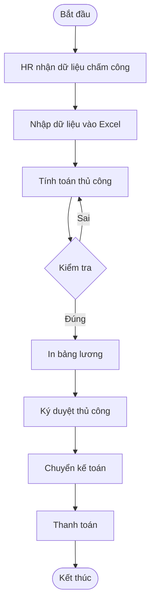
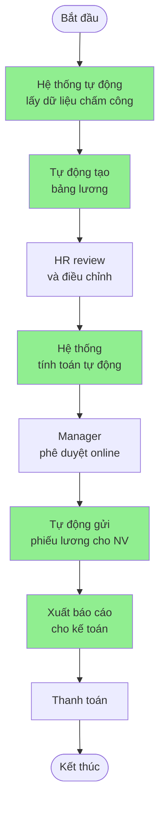
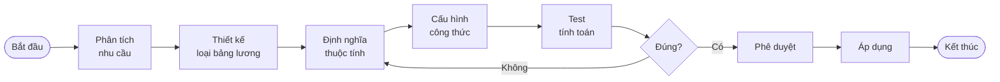
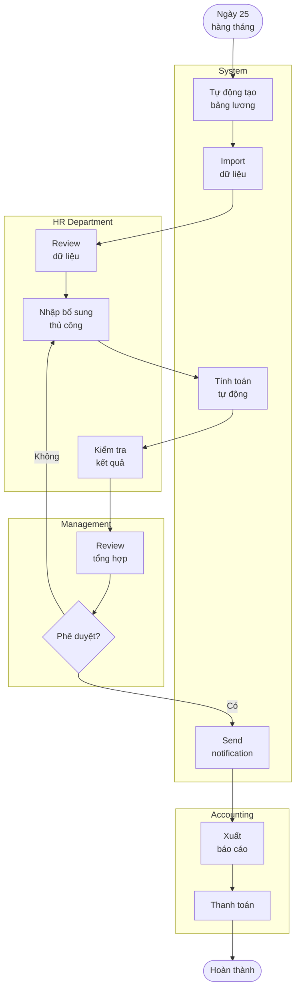
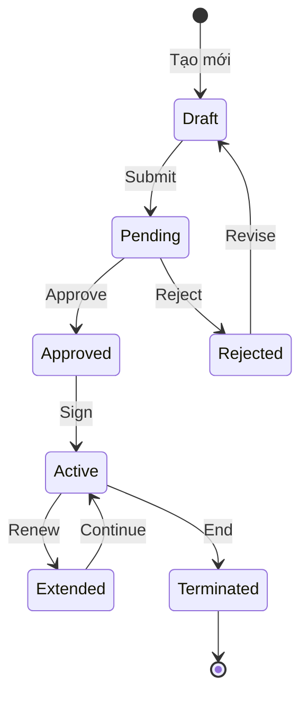
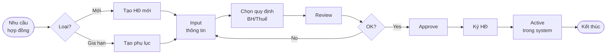
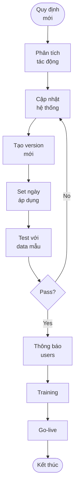

# BUSINESS PROCESS MODEL
# HỆ THỐNG QUẢN LÝ LƯƠNG

**Phiên bản:** 1.0  
**Ngày:** 2024  
**Định dạng:** BPMN 2.0

---

## MỤC LỤC
1. [Tổng quan](#1-tổng-quan)
2. [Quy trình hiện tại (AS-IS)](#2-quy-trình-hiện-tại-as-is)
3. [Quy trình mong muốn (TO-BE)](#3-quy-trình-mong-muốn-to-be)
4. [Chi tiết các quy trình nghiệp vụ](#4-chi-tiết-các-quy-trình-nghiệp-vụ)
5. [Ma trận RACI](#5-ma-trận-raci)
6. [KPIs và Metrics](#6-kpis-và-metrics)

---

## 1. TỔNG QUAN

### 1.1 Mục đích
Tài liệu này mô tả các quy trình nghiệp vụ liên quan đến quản lý lương, từ quy trình hiện tại (AS-IS) đến quy trình được tối ưu hóa (TO-BE) khi triển khai hệ thống mới.

### 1.2 Phạm vi
- Quy trình thiết lập cấu hình lương
- Quy trình tính lương hàng tháng
- Quy trình quản lý hợp đồng lao động
- Quy trình báo cáo và thanh toán

### 1.3 Stakeholders
- **HR Department**: Quản lý nhân sự và tính lương
- **Accounting**: Thanh toán và báo cáo tài chính
- **Management**: Phê duyệt và giám sát
- **Employees**: Nhận lương và xem thông tin
- **IT Department**: Hỗ trợ kỹ thuật

---

## 2. QUY TRÌNH HIỆN TẠI (AS-IS)

### 2.1 Tổng quan quy trình hiện tại

### 2.2 Vấn đề của quy trình hiện tại

| STT | Vấn đề | Tác động | Mức độ |
|-----|--------|----------|---------|
| 1 | Tính toán thủ công | Sai sót cao (15-20%) | Cao |
| 2 | Thời gian xử lý lâu | 5-7 ngày/tháng | Cao |
| 3 | Khó cập nhật thay đổi | Mất 2-3 ngày điều chỉnh | Trung bình |
| 4 | Thiếu tính minh bạch | Nhân viên không thể kiểm tra | Trung bình |
| 5 | Khó kiểm soát | Không có audit trail | Cao |
| 6 | Phụ thuộc vào cá nhân | Risk khi người key nghỉ | Cao |

### 2.3 Thời gian và chi phí hiện tại

- **Thời gian xử lý**: 5-7 ngày/tháng
- **Nhân lực**: 2-3 người toàn thời gian
- **Chi phí lỗi**: ~2% tổng lương do sai sót
- **Chi phí cơ hội**: Mất 40 giờ/tháng cho việc không tạo giá trị

---

## 3. QUY TRÌNH MONG MUỐN (TO-BE)

### 3.1 Tổng quan quy trình tối ưu

### 3.2 Cải thiện đạt được

| Chỉ số | Hiện tại | Mục tiêu | Cải thiện |
|--------|----------|----------|-----------|
| Thời gian xử lý | 5-7 ngày | 1-2 ngày | -75% |
| Tỷ lệ sai sót | 15-20% | <1% | -95% |
| Nhân lực cần | 2-3 người | 1 người | -66% |
| Thời gian phê duyệt | 2 ngày | 2 giờ | -93% |
| Độ hài lòng NV | 60% | >90% | +50% |

---

## 4. CHI TIẾT CÁC QUY TRÌNH NGHIỆP VỤ

### 4.1 BP01: Quy trình thiết lập cấu hình lương

#### 4.1.1 BPMN Diagram

#### 4.1.2 Mô tả chi tiết

| Bước | Hoạt động | Người thực hiện | Input | Output | Thời gian |
|------|-----------|----------------|-------|--------|-----------|
| 1 | Phân tích nhu cầu | HR Manager | Yêu cầu từ BOD | Tài liệu phân tích | 2 giờ |
| 2 | Thiết kế loại bảng lương | HR Specialist | Tài liệu phân tích | Template design | 4 giờ |
| 3 | Định nghĩa thuộc tính | HR Specialist | Template design | Danh sách thuộc tính | 2 giờ |
| 4 | Cấu hình công thức | HR Specialist | Thuộc tính | Công thức tính | 2 giờ |
| 5 | Test tính toán | HR Specialist | Test data | Kết quả test | 1 giờ |
| 6 | Phê duyệt | HR Manager | Template hoàn chỉnh | Approval | 30 phút |
| 7 | Áp dụng | System Admin | Approved template | Active template | 30 phút |

#### 4.1.3 Business Rules
- BR01: Mỗi loại bảng lương phải có tối thiểu 5 thuộc tính
- BR02: Công thức phải được validate trước khi lưu
- BR03: Phải có approval từ HR Manager
- BR04: Backup template cũ trước khi áp dụng mới

### 4.2 BP02: Quy trình tính lương hàng tháng

#### 4.2.1 BPMN Diagram với Swimlanes

#### 4.2.2 Timeline chi tiết

| Ngày | Hoạt động | Responsible | Duration |
|------|-----------|-------------|----------|
| 25 | System tự động khởi tạo bảng lương | System | 30 phút |
| 26-27 | HR nhập dữ liệu bổ sung | HR Team | 2 ngày |
| 28 | System tính toán và validate | System | 2 giờ |
| 29 | Manager review và approve | Managers | 1 ngày |
| 30 | Gửi bảng lương cho nhân viên | System | 1 giờ |
| 01 | Kế toán xử lý thanh toán | Accounting | 1 ngày |

### 4.3 BP03: Quy trình quản lý hợp đồng lao động

#### 4.3.1 State Diagram

#### 4.3.2 Process Flow

### 4.4 BP04: Quy trình xử lý thay đổi quy định

#### 4.4.1 Process Flow

#### 4.4.2 Impact Analysis Template

| Thay đổi | Đối tượng ảnh hưởng | Mức độ | Action required |
|----------|-------------------|---------|-----------------|
| Tăng BHXH | Tất cả nhân viên | Cao | Update tỷ lệ, tính lại |
| Thay đổi giảm trừ | Nhân viên có phụ thuộc | Trung | Update mức giảm trừ |
| Bậc thuế mới | Thu nhập > 10tr | Cao | Update bảng thuế |

---

## 5. MA TRẬN RACI

### 5.1 Quy trình tính lương

| Hoạt động | CEO | HR Manager | HR Staff | Accountant | Employee | System |
|-----------|-----|------------|----------|------------|----------|--------|
| Khởi tạo bảng lương | I | I | C | I | I | R |
| Nhập dữ liệu | - | A | R | C | - | - |
| Tính toán | - | I | C | I | - | R |
| Review | I | R | C | C | - | - |
| Approve | A | R | I | I | - | - |
| Gửi bảng lương | - | I | I | - | I | R |
| Thanh toán | I | I | C | R | - | - |

**Chú thích:**
- R (Responsible): Người thực hiện
- A (Accountable): Người chịu trách nhiệm
- C (Consulted): Người được tham vấn
- I (Informed): Người được thông báo

### 5.2 Quy trình quản lý hợp đồng

| Hoạt động | CEO | HR Manager | HR Staff | Legal | Employee |
|-----------|-----|------------|----------|-------|----------|
| Tạo hợp đồng | I | A | R | C | I |
| Review legal | - | C | I | R | - |
| Approve | A | R | I | C | - |
| Ký hợp đồng | R | C | I | - | R |
| Lưu trữ | - | I | R | I | C |

---

## 6. KPIs VÀ METRICS

### 6.1 Process KPIs

| KPI | Công thức | Target | Frequency |
|-----|-----------|--------|-----------|
| Thời gian xử lý lương | End date - Start date | ≤ 2 ngày | Monthly |
| Tỷ lệ chính xác | (1 - Errors/Total) × 100% | > 99% | Monthly |
| Độ hài lòng NV | Survey score | > 4.0/5.0 | Quarterly |
| Chi phí xử lý | Total cost / Employees | < 50k VND | Monthly |
| Tỷ lệ tự động hóa | Auto tasks / Total tasks | > 80% | Monthly |

### 6.2 System Metrics

| Metric | Description | Target | Alert threshold |
|--------|-------------|--------|-----------------|
| Response time | Thời gian tính 1 bảng lương | < 2s | > 5s |
| Uptime | System availability | 99.5% | < 99% |
| Error rate | Lỗi hệ thống | < 0.1% | > 1% |
| Concurrent users | Số user đồng thời | 100 | > 150 |

### 6.3 Business Metrics

| Metric | Baseline | Year 1 | Year 2 |
|--------|----------|---------|---------|
| FTE reduction | 3 | 2 | 1.5 |
| Cost saving | 0 | 30% | 50% |
| Processing days | 7 | 3 | 2 |
| Compliance rate | 85% | 95% | 99% |

---

## 7. RISK MANAGEMENT

### 7.1 Process Risks

| Risk | Probability | Impact | Mitigation |
|------|-------------|---------|------------|
| Sai dữ liệu đầu vào | Medium | High | Validation rules, double-check |
| Deadline bị trễ | Low | High | Automated reminders, buffer time |
| System downtime | Low | High | Backup process, manual override |
| User resistance | Medium | Medium | Training, change management |

### 7.2 Contingency Plans

#### Scenario 1: System failure ngày tính lương
1. Switch to backup server
2. If backup fails, use last month template
3. Manual calculation for critical cases
4. Communicate delay to stakeholders

#### Scenario 2: Massive data error
1. Rollback to previous version
2. Identify error source
3. Fix and re-run calculations
4. Additional review cycle

---

## 8. CHANGE MANAGEMENT

### 8.1 Training Plan

| Audience | Topics | Duration | Method |
|----------|---------|----------|---------|
| HR Staff | Full system | 16 hours | Hands-on |
| Managers | Approval flow | 2 hours | Online |
| Accountants | Reports | 4 hours | Workshop |
| Employees | Self-service | 1 hour | Video |

### 8.2 Communication Plan

| Phase | Message | Channel | Frequency |
|-------|---------|---------|-----------|
| Pre-launch | Benefits, timeline | Email, Meeting | Weekly |
| Launch | Go-live, support | All channels | Daily |
| Post-launch | Tips, feedback | Email, Portal | Weekly |
| Steady state | Updates | Portal | Monthly |

### 8.3 Success Criteria

- [ ] 100% staff trained before go-live
- [ ] Error rate < 1% in first month
- [ ] 90% positive feedback
- [ ] No critical issues in first week
- [ ] All reports generated on time

---

## 9. APPENDIX

### 9.1 Process Notation Legend

| Symbol | Meaning |
|--------|---------|
| ○ | Start/End event |
| □ | Task/Activity |
| ◇ | Decision/Gateway |
| → | Flow/Sequence |
| ┊ | Message flow |
| ═ | Data association |

### 9.2 Document References

- BPMN 2.0 Specification
- Company HR Policy v2.0
- Vietnam Labor Law 2019
- System Design Document v1.0

### 9.3 Revision History

| Date | Version | Changes | Author |
|------|---------|---------|--------|
| 01/01/2024 | 1.0 | Initial draft | Process Team |

---

**Approval:**

| Role | Name | Signature | Date |
|------|------|-----------|------|
| Process Owner | | | |
| HR Director | | | |
| IT Manager | | | |
| Quality Manager | | | |
