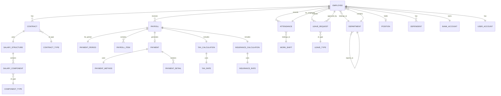

# ERD CONCEPTUAL - PAYROLL MANAGEMENT SYSTEM
## High-Level Entity Relationship Diagram

**Version:** 1.0
**Date:** 2024-10-02
**Status:** Final

---

## 🎯 OVERVIEW

This conceptual ERD represents the high-level data model for the Payroll Management System, showing main entities and their relationships without technical implementation details.

---

## 📊 ENTITY RELATIONSHIP DIAGRAM



---

## 🏢 CORE BUSINESS ENTITIES

### 1. EMPLOYEE
**Purpose:** Central entity representing all employees
**Key Relationships:**
- Has multiple contracts over time
- Receives monthly payroll
- Belongs to one department
- May hold multiple positions
- Has attendance records
- Can submit leave requests

### 2. CONTRACT
**Purpose:** Employment contract details
**Key Relationships:**
- Belongs to one employee
- Uses a salary structure
- Has a contract type (probation/official/part-time)

### 3. DEPARTMENT
**Purpose:** Organizational structure
**Key Relationships:**
- Contains multiple employees
- May report to parent department
- Has department head (employee)

### 4. POSITION
**Purpose:** Job roles and titles
**Key Relationships:**
- Held by employees
- Defines salary ranges
- Links to required skills

---

## 💰 PAYROLL ENTITIES

### 5. PAYROLL
**Purpose:** Monthly salary calculation record
**Key Relationships:**
- For one employee
- In one payment period
- Contains multiple payroll items
- Includes tax calculation
- Includes insurance calculation
- Generates payment

### 6. PAYROLL_ITEM
**Purpose:** Individual line items in payroll
**Types:**
- Earnings (basic, allowances, overtime)
- Deductions (tax, insurance, other)
**Key Relationships:**
- Belongs to payroll record
- References salary component

### 7. SALARY_STRUCTURE
**Purpose:** Template for salary calculation
**Key Relationships:**
- Used by contracts
- Contains multiple salary components
- Defines calculation rules

### 8. SALARY_COMPONENT
**Purpose:** Building blocks of salary
**Examples:**
- Basic salary
- Position allowance
- Meal allowance
- Transportation
**Key Relationships:**
- Part of salary structure
- Has component type

---

## 📅 TIME & ATTENDANCE ENTITIES

### 9. ATTENDANCE
**Purpose:** Daily attendance tracking
**Key Relationships:**
- For one employee
- On specific date
- Links to work shift
- Used in payroll calculation

### 10. WORK_SHIFT
**Purpose:** Define working hours
**Types:**
- Regular (8:00-17:00)
- Night shift (22:00-6:00)
- Flexible
**Key Relationships:**
- Used by attendance records

### 11. LEAVE_REQUEST
**Purpose:** Employee leave management
**Key Relationships:**
- Submitted by employee
- Approved by manager
- Has leave type
- Affects payroll

### 12. LEAVE_TYPE
**Purpose:** Categories of leave
**Examples:**
- Annual leave
- Sick leave
- Maternity leave
- Unpaid leave

---

## 🏦 FINANCIAL ENTITIES

### 13. PAYMENT_PERIOD
**Purpose:** Payroll cycle definition
**Attributes:**
- Month/Year
- Start date
- End date
- Status (open/closed)
**Key Relationships:**
- Has multiple payrolls

### 14. PAYMENT
**Purpose:** Actual payment transaction
**Key Relationships:**
- From payroll
- Uses payment method
- Has payment details
- Links to bank transaction

### 15. BANK_ACCOUNT
**Purpose:** Employee bank details
**Key Relationships:**
- Owned by employee
- Used for salary transfer
- Validated with bank

### 16. PAYMENT_METHOD
**Purpose:** How salary is paid
**Types:**
- Bank transfer
- Cash (exceptional)
- Check

---

## 📊 CALCULATION ENTITIES

### 17. TAX_CALCULATION
**Purpose:** Personal income tax details
**Key Relationships:**
- Part of payroll
- Uses tax rates
- Considers dependents

### 18. TAX_RATE
**Purpose:** Progressive tax brackets
**Vietnam 2024 Rates:**
- 5%, 10%, 15%, 20%, 25%, 30%, 35%

### 19. INSURANCE_CALCULATION
**Purpose:** Social insurance details
**Types:**
- BHXH (Social insurance)
- BHYT (Health insurance)
- BHTN (Unemployment insurance)

### 20. INSURANCE_RATE
**Purpose:** Insurance contribution rates
**Current Rates:**
- BHXH: 8% + 17.5%
- BHYT: 1.5% + 3%
- BHTN: 1% + 1%

---

## 👨‍👩‍👧‍👦 SUPPLEMENTARY ENTITIES

### 21. DEPENDENT
**Purpose:** Employee's tax dependents
**Key Relationships:**
- Belongs to employee
- Affects tax calculation
- Maximum 4 for tax deduction

### 22. USER_ACCOUNT
**Purpose:** System access credentials
**Key Relationships:**
- One per employee
- Has roles and permissions
- Tracks login history

### 23. CONTRACT_TYPE
**Purpose:** Employment categories
**Types:**
- Probation (≤2 months)
- Official (≥12 months)
- Part-time
- Consultant

### 24. COMPONENT_TYPE
**Purpose:** Classify salary components
**Categories:**
- Earning
- Deduction
- Employer contribution
- Reimbursement

---

## 🔄 KEY RELATIONSHIPS

### One-to-Many (1:N)
```
DEPARTMENT → EMPLOYEE
EMPLOYEE → CONTRACT
EMPLOYEE → PAYROLL
EMPLOYEE → ATTENDANCE
PAYROLL → PAYROLL_ITEM
SALARY_STRUCTURE → SALARY_COMPONENT
```

### Many-to-One (N:1)
```
EMPLOYEE → DEPARTMENT
CONTRACT → SALARY_STRUCTURE
PAYROLL → PAYMENT_PERIOD
ATTENDANCE → WORK_SHIFT
```

### One-to-One (1:1)
```
EMPLOYEE ↔ USER_ACCOUNT
EMPLOYEE ↔ BANK_ACCOUNT
PAYROLL ↔ TAX_CALCULATION
PAYROLL ↔ INSURANCE_CALCULATION
```

### Many-to-Many (N:N)
```
EMPLOYEE ↔ POSITION (through EMPLOYEE_POSITION)
```

---

## 📐 BUSINESS RULES (High-Level)

### Employee Rules
1. Must belong to exactly one department
2. Must have at least one active contract
3. Can have maximum one active user account
4. Can have multiple dependents (max 4 for tax)

### Contract Rules
1. No overlapping active contracts per employee
2. Probation contract ≤ 2 months
3. Official contract ≥ 12 months
4. Salary must be ≥ minimum wage

### Payroll Rules
1. One payroll per employee per period
2. Must include tax calculation
3. Must include insurance calculation
4. Cannot be modified after approval

### Attendance Rules
1. One record per employee per day
2. Cannot exceed 24 hours per day
3. Overtime requires approval
4. Links to payroll calculation

---

## 🎯 DESIGN PRINCIPLES

### Normalization
- Entities are in conceptual form
- No technical attributes shown
- Focus on business relationships

### Flexibility
- Supports multiple salary structures
- Configurable components
- Extensible for new requirements

### Compliance
- Vietnam tax law ready
- Insurance regulations included
- Audit trail capability

### Scalability
- Designed for 1000+ employees
- Historical data retention
- Performance considered

---

## 🔄 ENTITY LIFECYCLE

### Employee Lifecycle
```
Candidate → New Hire → Active → Resigned/Retired
```

### Contract Lifecycle
```
Draft → Active → Renewed/Expired → Archived
```

### Payroll Lifecycle
```
Draft → Calculated → Reviewed → Approved → Paid → Archived
```

### Leave Request Lifecycle
```
Draft → Submitted → Approved/Rejected → Taken → Closed
```

---

## 📝 NOTES FOR NEXT PHASE

### To be detailed in Logical Model:
1. All entity attributes
2. Data types and constraints
3. Calculated fields
4. Audit columns
5. Indexes and keys

### To be added in Physical Schema:
1. Junction tables for N:N relationships
2. Lookup tables for codes
3. Audit log tables
4. Archive tables
5. Performance optimizations

---

## ✅ VALIDATION CHECKLIST

- [x] All business entities identified
- [x] Relationships properly defined
- [x] Cardinality specified
- [x] No technical details included
- [x] Business rules captured
- [x] Vietnam compliance considered
- [x] Scalability addressed
- [x] Next steps documented

---

**Document Status:** ✅ Approved
**Reviewed by:** Business Analyst, Domain Expert
**Next Document:** 3_DataModel.md (Logical Model)