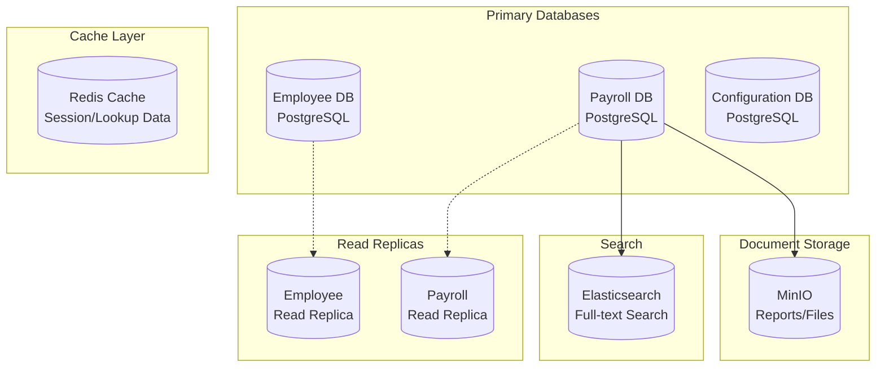
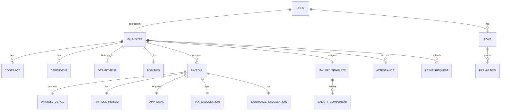

# DATABASE DESIGN DOCUMENT
## Hệ thống Quản lý Lương - Payroll Management System

**Version:** 1.0
**Date:** 2024-09-24
**Status:** Draft
**Author:** Database Team

---

## MỤC LỤC
1. [Giới thiệu](#1-giới-thiệu)
2. [Database Architecture](#2-database-architecture)
3. [Conceptual Data Model](#3-conceptual-data-model)
4. [Logical Data Model](#4-logical-data-model)
5. [Physical Data Model](#5-physical-data-model)
6. [Data Dictionary](#6-data-dictionary)
7. [Indexing Strategy](#7-indexing-strategy)
8. [Data Security](#8-data-security)
9. [Migration Strategy](#9-migration-strategy)
10. [Backup & Recovery](#10-backup--recovery)

---

## 1. GIỚI THIỆU

### 1.1 Mục đích
Tài liệu này định nghĩa thiết kế database cho Hệ thống Quản lý Lương, bao gồm cấu trúc dữ liệu, quan hệ, và chiến lược tối ưu.

### 1.2 Scope
- Database schema design
- Data relationships
- Constraints và validations
- Performance optimization
- Security measures

### 1.3 Database Management System
- **Primary DBMS:** PostgreSQL 15
- **Caching:** Redis 7.x
- **Document Store:** MinIO (for files)
- **Search Engine:** Elasticsearch 8.x

---

## 2. DATABASE ARCHITECTURE

### 2.1 Database Distribution



### 2.2 Database Separation Strategy

| Database | Purpose | Tables | Size Estimate |
|----------|---------|--------|--------------|
| **employee_db** | Employee master data | 15 tables | 10-50 GB |
| **payroll_db** | Transactional payroll data | 20 tables | 100-500 GB |
| **config_db** | System configuration | 10 tables | <1 GB |

---

## 3. CONCEPTUAL DATA MODEL

### 3.1 Entity Relationship Diagram (High Level)



### 3.2 Core Entities

| Entity | Description | Volume |
|--------|------------|--------|
| **Employee** | Employee master data | 10,000+ |
| **Payroll** | Monthly payroll records | 120,000/year |
| **Contract** | Employment contracts | 15,000 |
| **Department** | Organization structure | 100 |
| **Salary_Template** | Salary structures | 50 |
| **Tax_Calculation** | Tax computation records | 120,000/year |

---

## 4. LOGICAL DATA MODEL

### 4.1 Employee Management Schema

```sql
-- Departments Table
CREATE TABLE departments (
    department_id UUID PRIMARY KEY DEFAULT gen_random_uuid(),
    department_code VARCHAR(20) UNIQUE NOT NULL,
    department_name VARCHAR(100) NOT NULL,
    parent_department_id UUID REFERENCES departments(department_id),
    manager_id UUID,
    is_active BOOLEAN DEFAULT true,
    created_at TIMESTAMP DEFAULT CURRENT_TIMESTAMP,
    updated_at TIMESTAMP DEFAULT CURRENT_TIMESTAMP
);

-- Positions Table
CREATE TABLE positions (
    position_id UUID PRIMARY KEY DEFAULT gen_random_uuid(),
    position_code VARCHAR(20) UNIQUE NOT NULL,
    position_name VARCHAR(100) NOT NULL,
    department_id UUID REFERENCES departments(department_id),
    level INT CHECK (level BETWEEN 1 AND 10),
    min_salary DECIMAL(15,2),
    max_salary DECIMAL(15,2),
    is_active BOOLEAN DEFAULT true,
    created_at TIMESTAMP DEFAULT CURRENT_TIMESTAMP
);

-- Employees Table (Master)
CREATE TABLE employees (
    employee_id UUID PRIMARY KEY DEFAULT gen_random_uuid(),
    employee_code VARCHAR(20) UNIQUE NOT NULL,
    first_name VARCHAR(50) NOT NULL,
    last_name VARCHAR(50) NOT NULL,
    middle_name VARCHAR(50),
    date_of_birth DATE NOT NULL,
    gender CHAR(1) CHECK (gender IN ('M', 'F', 'O')),
    national_id VARCHAR(20) UNIQUE NOT NULL,
    tax_code VARCHAR(20),

    -- Contact Information
    email VARCHAR(100) UNIQUE,
    phone VARCHAR(20),
    address TEXT,
    city VARCHAR(50),
    district VARCHAR(50),
    ward VARCHAR(50),

    -- Employment Information
    department_id UUID REFERENCES departments(department_id),
    position_id UUID REFERENCES positions(position_id),
    manager_id UUID REFERENCES employees(employee_id),
    hire_date DATE NOT NULL,
    probation_end_date DATE,

    -- Status
    employment_status VARCHAR(20) DEFAULT 'ACTIVE',

    -- Audit
    created_at TIMESTAMP DEFAULT CURRENT_TIMESTAMP,
    updated_at TIMESTAMP DEFAULT CURRENT_TIMESTAMP,
    created_by UUID,
    updated_by UUID,

    CONSTRAINT chk_employment_status CHECK (
        employment_status IN ('ACTIVE', 'INACTIVE', 'TERMINATED', 'ON_LEAVE')
    )
);

-- Dependents Table
CREATE TABLE dependents (
    dependent_id UUID PRIMARY KEY DEFAULT gen_random_uuid(),
    employee_id UUID REFERENCES employees(employee_id) ON DELETE CASCADE,
    full_name VARCHAR(100) NOT NULL,
    relationship VARCHAR(20) NOT NULL,
    date_of_birth DATE,
    national_id VARCHAR(20),
    tax_code VARCHAR(20),
    is_tax_dependent BOOLEAN DEFAULT true,
    effective_from DATE NOT NULL,
    effective_to DATE,
    created_at TIMESTAMP DEFAULT CURRENT_TIMESTAMP,

    CONSTRAINT chk_relationship CHECK (
        relationship IN ('SPOUSE', 'CHILD', 'PARENT', 'OTHER')
    )
);

-- Contracts Table
CREATE TABLE contracts (
    contract_id UUID PRIMARY KEY DEFAULT gen_random_uuid(),
    employee_id UUID REFERENCES employees(employee_id),
    contract_number VARCHAR(50) UNIQUE NOT NULL,
    contract_type VARCHAR(20) NOT NULL,
    start_date DATE NOT NULL,
    end_date DATE,

    -- Salary Information
    base_salary DECIMAL(15,2) NOT NULL CHECK (base_salary > 0),
    salary_template_id UUID,
    insurance_salary DECIMAL(15,2),

    -- Status
    status VARCHAR(20) DEFAULT 'ACTIVE',
    signed_date DATE,

    -- Audit
    created_at TIMESTAMP DEFAULT CURRENT_TIMESTAMP,
    updated_at TIMESTAMP DEFAULT CURRENT_TIMESTAMP,

    CONSTRAINT chk_contract_type CHECK (
        contract_type IN ('PERMANENT', 'FIXED_TERM', 'PART_TIME', 'PROBATION')
    ),
    CONSTRAINT chk_contract_status CHECK (
        status IN ('DRAFT', 'ACTIVE', 'EXPIRED', 'TERMINATED')
    )
);

-- Bank Accounts
CREATE TABLE employee_bank_accounts (
    account_id UUID PRIMARY KEY DEFAULT gen_random_uuid(),
    employee_id UUID REFERENCES employees(employee_id),
    bank_name VARCHAR(100) NOT NULL,
    bank_branch VARCHAR(100),
    account_number VARCHAR(50) NOT NULL,
    account_name VARCHAR(100) NOT NULL,
    is_primary BOOLEAN DEFAULT false,
    is_active BOOLEAN DEFAULT true,
    created_at TIMESTAMP DEFAULT CURRENT_TIMESTAMP
);
```

### 4.2 Payroll Configuration Schema

```sql
-- Salary Templates
CREATE TABLE salary_templates (
    template_id UUID PRIMARY KEY DEFAULT gen_random_uuid(),
    template_code VARCHAR(20) UNIQUE NOT NULL,
    template_name VARCHAR(100) NOT NULL,
    description TEXT,
    is_active BOOLEAN DEFAULT true,
    created_at TIMESTAMP DEFAULT CURRENT_TIMESTAMP,
    updated_at TIMESTAMP DEFAULT CURRENT_TIMESTAMP
);

-- Salary Components
CREATE TABLE salary_components (
    component_id UUID PRIMARY KEY DEFAULT gen_random_uuid(),
    component_code VARCHAR(20) UNIQUE NOT NULL,
    component_name VARCHAR(100) NOT NULL,
    component_type VARCHAR(20) NOT NULL,
    calculation_type VARCHAR(20) NOT NULL,

    -- Tax & Insurance
    is_taxable BOOLEAN DEFAULT true,
    is_insurance_applicable BOOLEAN DEFAULT true,

    -- Formula
    formula TEXT,
    fixed_amount DECIMAL(15,2),
    percentage DECIMAL(5,2),

    -- Display
    display_order INT,
    is_visible BOOLEAN DEFAULT true,

    created_at TIMESTAMP DEFAULT CURRENT_TIMESTAMP,

    CONSTRAINT chk_component_type CHECK (
        component_type IN ('EARNING', 'DEDUCTION', 'BENEFIT', 'TAX', 'INSURANCE')
    ),
    CONSTRAINT chk_calculation_type CHECK (
        calculation_type IN ('FIXED', 'PERCENTAGE', 'FORMULA', 'TABLE')
    )
);

-- Template Components Mapping
CREATE TABLE template_components (
    template_id UUID REFERENCES salary_templates(template_id),
    component_id UUID REFERENCES salary_components(component_id),
    is_mandatory BOOLEAN DEFAULT true,
    default_value DECIMAL(15,2),
    min_value DECIMAL(15,2),
    max_value DECIMAL(15,2),
    display_order INT,
    PRIMARY KEY (template_id, component_id)
);

-- Tax Configuration
CREATE TABLE tax_brackets (
    bracket_id UUID PRIMARY KEY DEFAULT gen_random_uuid(),
    year INT NOT NULL,
    bracket_order INT NOT NULL,
    min_income DECIMAL(15,2) NOT NULL,
    max_income DECIMAL(15,2),
    tax_rate DECIMAL(5,2) NOT NULL,
    quick_deduction DECIMAL(15,2) DEFAULT 0,
    created_at TIMESTAMP DEFAULT CURRENT_TIMESTAMP,
    UNIQUE(year, bracket_order)
);

-- Insurance Configuration
CREATE TABLE insurance_rates (
    rate_id UUID PRIMARY KEY DEFAULT gen_random_uuid(),
    insurance_type VARCHAR(20) NOT NULL,
    effective_date DATE NOT NULL,
    employee_rate DECIMAL(5,2) NOT NULL,
    employer_rate DECIMAL(5,2) NOT NULL,
    min_salary DECIMAL(15,2),
    max_salary DECIMAL(15,2),
    created_at TIMESTAMP DEFAULT CURRENT_TIMESTAMP,

    CONSTRAINT chk_insurance_type CHECK (
        insurance_type IN ('SOCIAL', 'HEALTH', 'UNEMPLOYMENT', 'ACCIDENT')
    )
);

-- Tax Deductions Configuration
CREATE TABLE tax_deductions (
    deduction_id UUID PRIMARY KEY DEFAULT gen_random_uuid(),
    deduction_type VARCHAR(30) NOT NULL,
    year INT NOT NULL,
    amount DECIMAL(15,2) NOT NULL,
    created_at TIMESTAMP DEFAULT CURRENT_TIMESTAMP,
    UNIQUE(deduction_type, year),

    CONSTRAINT chk_deduction_type CHECK (
        deduction_type IN ('PERSONAL', 'DEPENDENT')
    )
);
```

### 4.3 Payroll Transaction Schema

```sql
-- Payroll Periods
CREATE TABLE payroll_periods (
    period_id UUID PRIMARY KEY DEFAULT gen_random_uuid(),
    period_code VARCHAR(20) UNIQUE NOT NULL,
    month INT NOT NULL CHECK (month BETWEEN 1 AND 12),
    year INT NOT NULL CHECK (year > 2020),
    start_date DATE NOT NULL,
    end_date DATE NOT NULL,
    payment_date DATE,
    status VARCHAR(20) DEFAULT 'OPEN',
    created_at TIMESTAMP DEFAULT CURRENT_TIMESTAMP,
    closed_at TIMESTAMP,
    closed_by UUID,

    CONSTRAINT chk_period_status CHECK (
        status IN ('OPEN', 'PROCESSING', 'CLOSED', 'PAID')
    ),
    UNIQUE(month, year)
);

-- Payroll Master
CREATE TABLE payrolls (
    payroll_id UUID PRIMARY KEY DEFAULT gen_random_uuid(),
    payroll_number VARCHAR(30) UNIQUE NOT NULL,
    employee_id UUID REFERENCES employees(employee_id),
    period_id UUID REFERENCES payroll_periods(period_id),

    -- Working Days
    working_days DECIMAL(5,2) DEFAULT 0,
    standard_days DECIMAL(5,2) DEFAULT 22,

    -- Salary Components
    basic_salary DECIMAL(15,2) NOT NULL,
    gross_salary DECIMAL(15,2) NOT NULL,
    total_deductions DECIMAL(15,2) DEFAULT 0,
    net_salary DECIMAL(15,2) NOT NULL,

    -- Status & Workflow
    status VARCHAR(20) DEFAULT 'DRAFT',
    calculation_date TIMESTAMP,
    approval_date TIMESTAMP,
    approved_by UUID,
    payment_date DATE,
    payment_method VARCHAR(20),

    -- Audit
    created_at TIMESTAMP DEFAULT CURRENT_TIMESTAMP,
    updated_at TIMESTAMP DEFAULT CURRENT_TIMESTAMP,
    created_by UUID,
    updated_by UUID,

    CONSTRAINT chk_payroll_status CHECK (
        status IN ('DRAFT', 'CALCULATED', 'APPROVED', 'REJECTED', 'PAID', 'CANCELLED')
    ),
    CONSTRAINT chk_payment_method CHECK (
        payment_method IN ('BANK_TRANSFER', 'CASH', 'CHECK')
    ),
    UNIQUE(employee_id, period_id)
);

-- Payroll Details
CREATE TABLE payroll_details (
    detail_id UUID PRIMARY KEY DEFAULT gen_random_uuid(),
    payroll_id UUID REFERENCES payrolls(payroll_id) ON DELETE CASCADE,
    component_id UUID REFERENCES salary_components(component_id),
    component_name VARCHAR(100) NOT NULL,
    component_type VARCHAR(20) NOT NULL,
    amount DECIMAL(15,2) NOT NULL,
    is_taxable BOOLEAN DEFAULT true,
    is_insurance_applicable BOOLEAN DEFAULT true,
    calculation_note TEXT,
    display_order INT,
    created_at TIMESTAMP DEFAULT CURRENT_TIMESTAMP
);

-- Tax Calculations
CREATE TABLE tax_calculations (
    tax_id UUID PRIMARY KEY DEFAULT gen_random_uuid(),
    payroll_id UUID REFERENCES payrolls(payroll_id) ON DELETE CASCADE,

    -- Income
    gross_income DECIMAL(15,2) NOT NULL,
    taxable_income DECIMAL(15,2) NOT NULL,

    -- Deductions (Vietnam 2024)
    insurance_deduction DECIMAL(15,2) DEFAULT 0,
    personal_deduction DECIMAL(15,2) DEFAULT 11000000,
    dependent_deduction DECIMAL(15,2) DEFAULT 0,
    dependent_count INT DEFAULT 0,

    -- Tax Calculation
    taxable_amount DECIMAL(15,2) NOT NULL,
    tax_amount DECIMAL(15,2) NOT NULL,

    -- Details
    calculation_details JSONB,
    created_at TIMESTAMP DEFAULT CURRENT_TIMESTAMP,

    CONSTRAINT chk_taxable_income CHECK (
        taxable_income = gross_income - insurance_deduction - personal_deduction - dependent_deduction
    )
);

-- Insurance Calculations
CREATE TABLE insurance_calculations (
    insurance_id UUID PRIMARY KEY DEFAULT gen_random_uuid(),
    payroll_id UUID REFERENCES payrolls(payroll_id) ON DELETE CASCADE,
    insurance_salary DECIMAL(15,2) NOT NULL,

    -- Employee Contributions (Vietnam 2024)
    social_insurance_employee DECIMAL(15,2) DEFAULT 0, -- 8%
    health_insurance_employee DECIMAL(15,2) DEFAULT 0, -- 1.5%
    unemployment_insurance_employee DECIMAL(15,2) DEFAULT 0, -- 1%

    -- Employer Contributions
    social_insurance_employer DECIMAL(15,2) DEFAULT 0, -- 17.5%
    health_insurance_employer DECIMAL(15,2) DEFAULT 0, -- 3%
    unemployment_insurance_employer DECIMAL(15,2) DEFAULT 0, -- 1%
    accident_insurance_employer DECIMAL(15,2) DEFAULT 0, -- 0.5%

    total_employee DECIMAL(15,2) NOT NULL,
    total_employer DECIMAL(15,2) NOT NULL,

    created_at TIMESTAMP DEFAULT CURRENT_TIMESTAMP
);

-- Attendance Summary (for payroll)
CREATE TABLE payroll_attendance (
    attendance_id UUID PRIMARY KEY DEFAULT gen_random_uuid(),
    employee_id UUID REFERENCES employees(employee_id),
    period_id UUID REFERENCES payroll_periods(period_id),

    -- Working Days
    regular_days DECIMAL(5,2) DEFAULT 0,
    overtime_hours DECIMAL(7,2) DEFAULT 0,
    holiday_hours DECIMAL(7,2) DEFAULT 0,

    -- Leave Days
    paid_leave_days DECIMAL(5,2) DEFAULT 0,
    unpaid_leave_days DECIMAL(5,2) DEFAULT 0,
    sick_leave_days DECIMAL(5,2) DEFAULT 0,

    -- Summary
    total_working_days DECIMAL(5,2) NOT NULL,

    created_at TIMESTAMP DEFAULT CURRENT_TIMESTAMP,
    updated_at TIMESTAMP DEFAULT CURRENT_TIMESTAMP,

    UNIQUE(employee_id, period_id)
);
```

### 4.4 Audit & History Schema

```sql
-- Payroll History (for tracking changes)
CREATE TABLE payroll_history (
    history_id UUID PRIMARY KEY DEFAULT gen_random_uuid(),
    payroll_id UUID NOT NULL,
    action VARCHAR(20) NOT NULL,
    old_status VARCHAR(20),
    new_status VARCHAR(20),
    changes JSONB,
    reason TEXT,
    performed_by UUID NOT NULL,
    performed_at TIMESTAMP DEFAULT CURRENT_TIMESTAMP,

    CONSTRAINT chk_action CHECK (
        action IN ('CREATE', 'UPDATE', 'APPROVE', 'REJECT', 'CANCEL', 'PAY')
    )
);

-- Audit Log (generic)
CREATE TABLE audit_logs (
    log_id UUID PRIMARY KEY DEFAULT gen_random_uuid(),
    table_name VARCHAR(50) NOT NULL,
    record_id UUID NOT NULL,
    action VARCHAR(20) NOT NULL,
    old_values JSONB,
    new_values JSONB,
    user_id UUID NOT NULL,
    ip_address INET,
    user_agent TEXT,
    created_at TIMESTAMP DEFAULT CURRENT_TIMESTAMP,

    CONSTRAINT chk_audit_action CHECK (
        action IN ('INSERT', 'UPDATE', 'DELETE')
    )
);

-- System Configuration
CREATE TABLE system_configs (
    config_id UUID PRIMARY KEY DEFAULT gen_random_uuid(),
    config_key VARCHAR(100) UNIQUE NOT NULL,
    config_value TEXT NOT NULL,
    config_type VARCHAR(20) NOT NULL,
    description TEXT,
    is_encrypted BOOLEAN DEFAULT false,
    created_at TIMESTAMP DEFAULT CURRENT_TIMESTAMP,
    updated_at TIMESTAMP DEFAULT CURRENT_TIMESTAMP,

    CONSTRAINT chk_config_type CHECK (
        config_type IN ('STRING', 'NUMBER', 'BOOLEAN', 'JSON')
    )
);
```

---

## 5. PHYSICAL DATA MODEL

### 5.1 Tablespace Organization

```sql
-- Create tablespaces for better performance
CREATE TABLESPACE payroll_data LOCATION '/data/payroll';
CREATE TABLESPACE payroll_index LOCATION '/data/payroll_idx';
CREATE TABLESPACE payroll_archive LOCATION '/data/archive';

-- Assign tables to tablespaces
ALTER TABLE payrolls SET TABLESPACE payroll_data;
ALTER TABLE payroll_details SET TABLESPACE payroll_data;
ALTER TABLE employees SET TABLESPACE payroll_data;
```

### 5.2 Partitioning Strategy

```sql
-- Partition payrolls table by year
CREATE TABLE payrolls_2024 PARTITION OF payrolls
    FOR VALUES FROM ('2024-01-01') TO ('2025-01-01');

CREATE TABLE payrolls_2025 PARTITION OF payrolls
    FOR VALUES FROM ('2025-01-01') TO ('2026-01-01');

-- Partition audit_logs by month
CREATE TABLE audit_logs_2024_09 PARTITION OF audit_logs
    FOR VALUES FROM ('2024-09-01') TO ('2024-10-01');
```

### 5.3 Storage Estimates

| Table | Row Size | Row Count/Year | Total Size/Year |
|-------|----------|----------------|-----------------|
| employees | 2 KB | 10,000 | 20 MB |
| payrolls | 1 KB | 120,000 | 120 MB |
| payroll_details | 0.5 KB | 2,400,000 | 1.2 GB |
| audit_logs | 2 KB | 500,000 | 1 GB |
| **Total** | - | - | **~3 GB/year** |

---

## 6. DATA DICTIONARY

### 6.1 Employee Table Fields

| Column | Data Type | Constraints | Description |
|--------|-----------|-------------|-------------|
| employee_id | UUID | PK, NOT NULL | Unique identifier |
| employee_code | VARCHAR(20) | UNIQUE, NOT NULL | Employee code |
| first_name | VARCHAR(50) | NOT NULL | First name |
| last_name | VARCHAR(50) | NOT NULL | Last name |
| national_id | VARCHAR(20) | UNIQUE, NOT NULL | CCCD/CMND number |
| tax_code | VARCHAR(20) | - | Personal tax code |
| hire_date | DATE | NOT NULL | Employment start date |
| base_salary | DECIMAL(15,2) | > 0 | Basic salary |

### 6.2 Payroll Table Fields

| Column | Data Type | Constraints | Description |
|--------|-----------|-------------|-------------|
| payroll_id | UUID | PK, NOT NULL | Unique identifier |
| payroll_number | VARCHAR(30) | UNIQUE, NOT NULL | Payroll reference |
| gross_salary | DECIMAL(15,2) | NOT NULL | Total before deductions |
| net_salary | DECIMAL(15,2) | NOT NULL | Take-home pay |
| status | VARCHAR(20) | CHECK | Payroll status |

### 6.3 Common Data Types

| Type | Usage | Example |
|------|-------|---------|
| UUID | Primary keys | 550e8400-e29b-41d4-a716-446655440000 |
| DECIMAL(15,2) | Money amounts | 25000000.50 |
| TIMESTAMP | Date/time with timezone | 2024-09-24 10:30:00+07 |
| JSONB | Flexible data | {"key": "value"} |

---

## 7. INDEXING STRATEGY

### 7.1 Primary Indexes

```sql
-- Primary key indexes (automatic)
-- Already created with PRIMARY KEY constraint

-- Unique indexes (automatic)
-- Already created with UNIQUE constraint

-- Foreign key indexes (manual)
CREATE INDEX idx_employees_department ON employees(department_id);
CREATE INDEX idx_employees_position ON employees(position_id);
CREATE INDEX idx_employees_manager ON employees(manager_id);

CREATE INDEX idx_payrolls_employee ON payrolls(employee_id);
CREATE INDEX idx_payrolls_period ON payrolls(period_id);
CREATE INDEX idx_payrolls_status ON payrolls(status);

CREATE INDEX idx_payroll_details_payroll ON payroll_details(payroll_id);
CREATE INDEX idx_payroll_details_component ON payroll_details(component_id);
```

### 7.2 Performance Indexes

```sql
-- Composite indexes for common queries
CREATE INDEX idx_payrolls_employee_period ON payrolls(employee_id, period_id);
CREATE INDEX idx_payrolls_period_status ON payrolls(period_id, status);

-- Partial indexes for active records
CREATE INDEX idx_employees_active ON employees(employee_id)
    WHERE employment_status = 'ACTIVE';

-- Expression indexes
CREATE INDEX idx_employees_fullname ON employees(
    lower(first_name || ' ' || last_name)
);

-- GiST index for JSONB
CREATE INDEX idx_audit_logs_values ON audit_logs USING gin(new_values);
```

### 7.3 Index Maintenance

```sql
-- Analyze tables regularly
ANALYZE employees;
ANALYZE payrolls;

-- Reindex periodically
REINDEX TABLE payrolls;
REINDEX TABLE payroll_details;

-- Monitor index usage
SELECT * FROM pg_stat_user_indexes
WHERE schemaname = 'public'
ORDER BY idx_scan;
```

---

## 8. DATA SECURITY

### 8.1 Encryption

```sql
-- Enable encryption at rest
ALTER DATABASE payroll_db SET encryption_key = 'vault:v1:key';

-- Encrypt sensitive columns
CREATE EXTENSION IF NOT EXISTS pgcrypto;

-- Encrypt tax_code
UPDATE employees
SET tax_code = pgp_sym_encrypt(tax_code, 'encryption_key');

-- Decrypt when reading
SELECT pgp_sym_decrypt(tax_code::bytea, 'encryption_key') as tax_code
FROM employees;
```

### 8.2 Access Control

```sql
-- Create roles
CREATE ROLE payroll_admin;
CREATE ROLE payroll_user;
CREATE ROLE payroll_viewer;

-- Grant permissions
GRANT ALL ON ALL TABLES IN SCHEMA public TO payroll_admin;
GRANT SELECT, INSERT, UPDATE ON payrolls TO payroll_user;
GRANT SELECT ON ALL TABLES IN SCHEMA public TO payroll_viewer;

-- Row-level security
ALTER TABLE employees ENABLE ROW LEVEL SECURITY;

CREATE POLICY employee_isolation ON employees
    FOR ALL
    TO payroll_user
    USING (department_id IN (
        SELECT department_id FROM user_departments
        WHERE user_id = current_user_id()
    ));
```

### 8.3 Data Masking

```sql
-- Create masked views for sensitive data
CREATE VIEW employees_masked AS
SELECT
    employee_id,
    employee_code,
    first_name,
    last_name,
    CASE
        WHEN current_user_role() = 'HR_ADMIN' THEN national_id
        ELSE CONCAT(SUBSTR(national_id, 1, 3), '****', SUBSTR(national_id, -2))
    END as national_id,
    CASE
        WHEN current_user_role() IN ('HR_ADMIN', 'PAYROLL_ADMIN') THEN base_salary
        ELSE NULL
    END as base_salary
FROM employees;
```

---

## 9. MIGRATION STRATEGY

### 9.1 Migration Approach

```sql
-- Version control for database
CREATE TABLE schema_migrations (
    version VARCHAR(20) PRIMARY KEY,
    applied_at TIMESTAMP DEFAULT CURRENT_TIMESTAMP,
    description TEXT
);

-- Sample migration script
-- V1.0.0__initial_schema.sql
BEGIN;
    -- Create tables
    -- Create indexes
    -- Insert initial data
    INSERT INTO schema_migrations VALUES ('1.0.0', NOW(), 'Initial schema');
COMMIT;

-- V1.0.1__add_employee_fields.sql
BEGIN;
    ALTER TABLE employees ADD COLUMN middle_name VARCHAR(50);
    ALTER TABLE employees ADD COLUMN photo_url TEXT;
    INSERT INTO schema_migrations VALUES ('1.0.1', NOW(), 'Add employee fields');
COMMIT;
```

### 9.2 Data Migration from Legacy System

```sql
-- ETL Process
-- 1. Extract from legacy
COPY (SELECT * FROM legacy.employees) TO '/tmp/employees.csv' CSV HEADER;

-- 2. Transform
CREATE TEMP TABLE employees_staging (LIKE employees);
COPY employees_staging FROM '/tmp/employees.csv' CSV HEADER;

-- Data cleaning
UPDATE employees_staging
SET email = LOWER(TRIM(email)),
    phone = REGEXP_REPLACE(phone, '[^0-9]', '', 'g');

-- 3. Load
INSERT INTO employees
SELECT * FROM employees_staging
ON CONFLICT (employee_code) DO UPDATE
SET updated_at = CURRENT_TIMESTAMP;
```

---

## 10. BACKUP & RECOVERY

### 10.1 Backup Strategy

```bash
# Daily full backup
pg_dump -h localhost -U postgres -d payroll_db -Fc -f /backup/payroll_$(date +%Y%m%d).dump

# Hourly WAL archiving
archive_command = 'cp %p /archive/%f'

# Weekly logical backup
pg_dumpall -h localhost -U postgres > /backup/weekly_$(date +%Y%m%d).sql
```

### 10.2 Recovery Procedures

```bash
# Point-in-time recovery
pg_basebackup -h localhost -D /recovery -X stream

# Restore from dump
pg_restore -h localhost -U postgres -d payroll_db /backup/payroll_20240924.dump

# Restore specific table
pg_restore -h localhost -U postgres -d payroll_db -t employees /backup/payroll_20240924.dump
```

### 10.3 Backup Testing

```sql
-- Verify backup integrity
SELECT pg_verifybackup('/backup/payroll_20240924.dump');

-- Test recovery procedures monthly
-- Document recovery time
-- Validate data integrity after recovery
```

---

## 11. PERFORMANCE OPTIMIZATION

### 11.1 Query Optimization

```sql
-- Use EXPLAIN ANALYZE
EXPLAIN (ANALYZE, BUFFERS)
SELECT e.*, p.*
FROM employees e
JOIN payrolls p ON e.employee_id = p.employee_id
WHERE p.period_id = '...' AND p.status = 'APPROVED';

-- Common Table Expressions (CTE)
WITH active_employees AS (
    SELECT * FROM employees WHERE employment_status = 'ACTIVE'
),
current_payroll AS (
    SELECT * FROM payrolls WHERE period_id = current_period()
)
SELECT * FROM active_employees e
JOIN current_payroll p ON e.employee_id = p.employee_id;
```

### 11.2 Connection Pooling

```yaml
# PgBouncer configuration
[databases]
payroll_db = host=localhost dbname=payroll_db

[pgbouncer]
pool_mode = transaction
max_client_conn = 1000
default_pool_size = 25
reserve_pool_size = 5
reserve_pool_timeout = 3
```

### 11.3 Monitoring Queries

```sql
-- Slow queries
SELECT query, mean_exec_time, calls
FROM pg_stat_statements
ORDER BY mean_exec_time DESC
LIMIT 10;

-- Table bloat
SELECT schemaname, tablename,
       pg_size_pretty(pg_total_relation_size(schemaname||'.'||tablename)) as size
FROM pg_tables
WHERE schemaname = 'public'
ORDER BY pg_total_relation_size(schemaname||'.'||tablename) DESC;

-- Index usage
SELECT indexrelname, idx_scan, idx_tup_read, idx_tup_fetch
FROM pg_stat_user_indexes
WHERE idx_scan = 0
ORDER BY indexrelname;
```

---

## 12. DATABASE MAINTENANCE

### 12.1 Regular Maintenance Tasks

```sql
-- Daily
VACUUM ANALYZE;

-- Weekly
REINDEX DATABASE payroll_db;

-- Monthly
VACUUM FULL;

-- Check for corruption
SELECT * FROM pg_check_database('payroll_db');
```

### 12.2 Monitoring Scripts

```sql
-- Database size
SELECT pg_database_size('payroll_db');

-- Table sizes
SELECT relname, pg_size_pretty(pg_total_relation_size(relid))
FROM pg_stat_user_tables
ORDER BY pg_total_relation_size(relid) DESC;

-- Connection count
SELECT count(*) FROM pg_stat_activity;

-- Lock monitoring
SELECT * FROM pg_locks WHERE granted = false;
```

---

## 13. COMPLIANCE & REGULATIONS

### 13.1 Data Retention

```sql
-- Archive old payroll data
INSERT INTO payroll_archive
SELECT * FROM payrolls
WHERE created_at < NOW() - INTERVAL '7 years';

DELETE FROM payrolls
WHERE created_at < NOW() - INTERVAL '7 years';

-- Compliance tracking
CREATE TABLE data_retention_log (
    log_id UUID PRIMARY KEY DEFAULT gen_random_uuid(),
    table_name VARCHAR(50),
    records_archived INT,
    records_deleted INT,
    retention_date DATE,
    performed_at TIMESTAMP DEFAULT CURRENT_TIMESTAMP
);
```

### 13.2 Audit Requirements

- All changes tracked in audit_logs
- User actions logged with IP and timestamp
- Sensitive data access logged
- Reports available for compliance review

---

## 14. APPENDICES

### A. SQL Naming Conventions

| Object | Convention | Example |
|--------|------------|---------|
| Table | Plural, snake_case | employees, payroll_details |
| Column | Singular, snake_case | employee_id, first_name |
| Primary Key | {table}_id | employee_id |
| Foreign Key | {ref_table}_id | department_id |
| Index | idx_{table}_{column} | idx_employees_department |
| Constraint | chk_{table}_{rule} | chk_employees_status |

### B. Database Parameters

```sql
-- PostgreSQL configuration
max_connections = 200
shared_buffers = 4GB
effective_cache_size = 12GB
maintenance_work_mem = 1GB
work_mem = 32MB
wal_level = replica
max_wal_size = 2GB
min_wal_size = 1GB
checkpoint_completion_target = 0.9
```

### C. Useful Queries

```sql
-- Find duplicate records
SELECT employee_code, COUNT(*)
FROM employees
GROUP BY employee_code
HAVING COUNT(*) > 1;

-- Unused indexes
SELECT schemaname, tablename, indexname
FROM pg_indexes
WHERE indexname NOT IN (
    SELECT indexrelname FROM pg_stat_user_indexes
);

-- Table statistics
SELECT * FROM pg_stat_user_tables;
```

---

**Document Status:** DRAFT
**Review Status:** Pending
**Approval:** Required from Database Architect