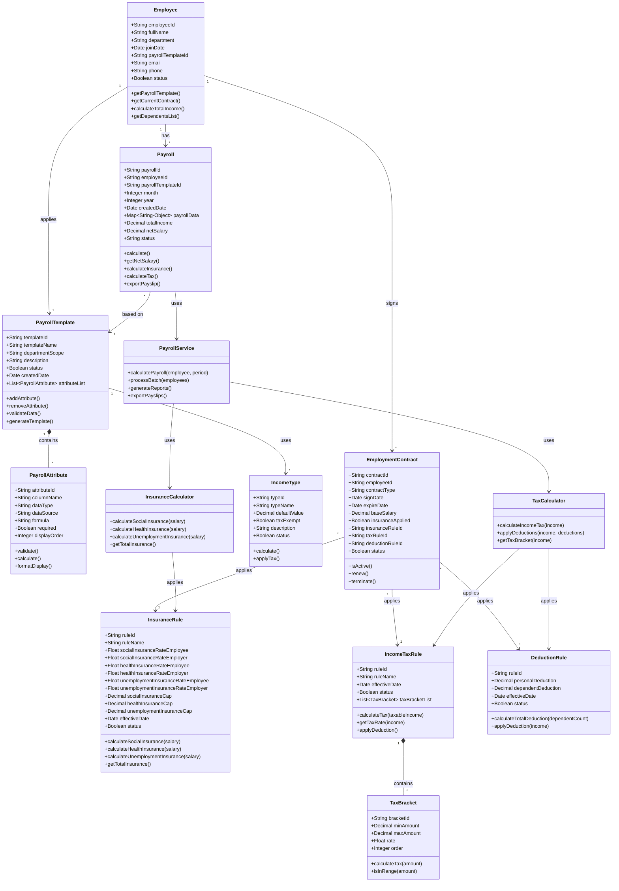
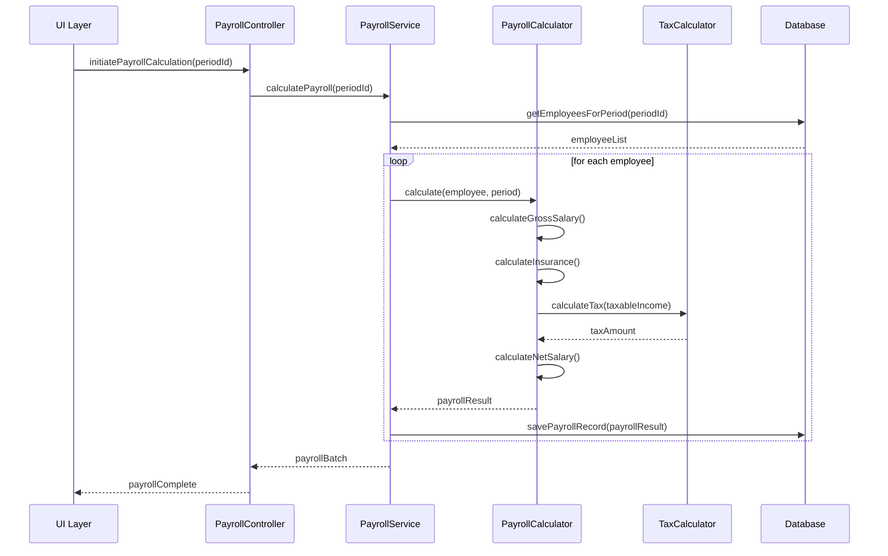
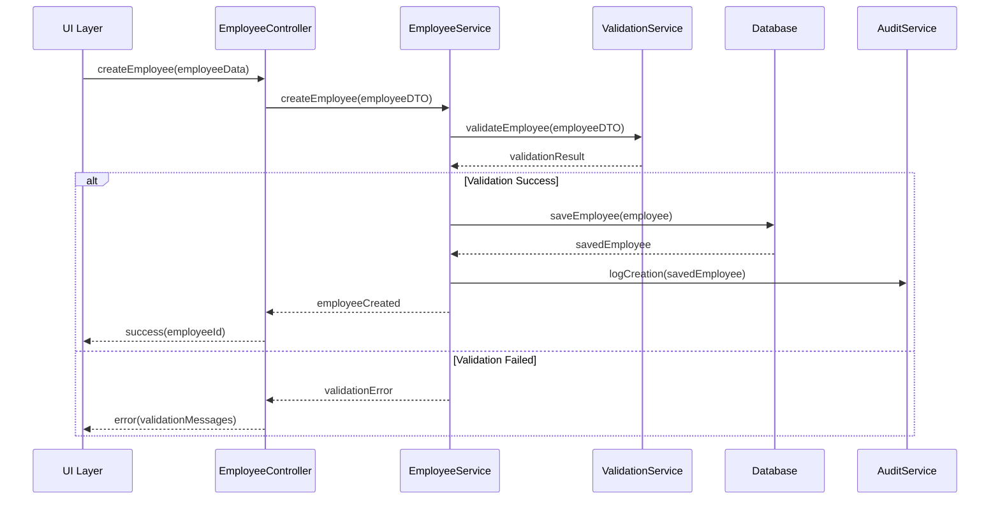

# DETAILED DESIGN DOCUMENT
## Hệ thống Quản lý Lương - HRM/Payroll

**Version:** 1.0
**Date:** 2024-10-02
**Status:** Draft
**Author:** Design Team

---

## 1. EXECUTIVE SUMMARY

### 1.1 Tổng quan
Tài liệu thiết kế chi tiết mô tả cấu trúc và hoạt động chi tiết của từng module trong hệ thống Quản lý Lương, bao gồm thiết kế lớp, sequence diagrams, và chi tiết implementation.

### 1.2 Phạm vi
- Thiết kế chi tiết cho tất cả modules chính
- Class diagrams và component interactions
- Business logic implementation details
- Data flow và processing algorithms

---

## 2. MODULE DESIGN DETAILS

### 2.0 Overall System Class Diagram



### 2.1 Employee Management Module

#### 2.1.1 Component Structure
```
EmployeeManagement/
├── Controllers/
│   ├── EmployeeController
│   └── ContractController
├── Services/
│   ├── EmployeeService
│   ├── ContractService
│   └── ValidationService
├── Repositories/
│   ├── EmployeeRepository
│   └── ContractRepository
├── Models/
│   ├── Employee
│   ├── Contract
│   └── Department
└── DTOs/
    ├── EmployeeDTO
    └── ContractDTO
```

#### 2.1.2 Class Design

**Employee Class:**
```java
public class Employee {
    private String employeeId;
    private String fullName;
    private Date dateOfBirth;
    private String identityNumber;
    private String taxCode;
    private String socialInsuranceNo;
    private Department department;
    private Position position;
    private Date joinDate;
    private EmployeeStatus status;
    private List<Contract> contracts;
    private List<Dependent> dependents;
    private BankAccount bankAccount;

    // Methods
    public Contract getActiveContract();
    public BigDecimal getBaseSalary();
    public int getDependentCount();
    public boolean isActive();
}
```

**Contract Class:**
```java
public class Contract {
    private String contractId;
    private String contractNumber;
    private ContractType type;
    private Date startDate;
    private Date endDate;
    private BigDecimal baseSalary;
    private List<Allowance> allowances;
    private WorkingTime workingTime;
    private ContractStatus status;

    // Methods
    public boolean isActive();
    public BigDecimal getTotalAllowances();
    public boolean isExpired();
}
```

#### 2.1.3 Service Layer Design

**EmployeeService:**
```java
@Service
public class EmployeeService {
    @Autowired
    private EmployeeRepository employeeRepo;

    @Autowired
    private ValidationService validationService;

    @Autowired
    private AuditService auditService;

    public Employee createEmployee(EmployeeDTO dto) {
        // Validation
        validationService.validateEmployee(dto);

        // Business logic
        Employee employee = mapToEntity(dto);
        employee.setStatus(EmployeeStatus.ACTIVE);

        // Save and audit
        Employee saved = employeeRepo.save(employee);
        auditService.logCreation(saved);

        return saved;
    }

    public Employee updateEmployee(String id, EmployeeDTO dto) {
        // Implementation
    }

    public void terminateEmployee(String id, Date terminationDate) {
        // Implementation
    }
}
```

---

### 2.2 Salary Configuration Module

#### 2.2.1 Component Structure
```
SalaryConfiguration/
├── Controllers/
│   ├── SalaryStructureController
│   └── AllowanceController
├── Services/
│   ├── SalaryStructureService
│   ├── AllowanceService
│   └── TaxConfigService
├── Repositories/
│   ├── SalaryStructureRepository
│   └── AllowanceRepository
└── Models/
    ├── SalaryStructure
    ├── AllowanceType
    └── TaxBracket
```

#### 2.2.2 Salary Structure Design

**SalaryStructure Class:**
```java
public class SalaryStructure {
    private String structureId;
    private String structureName;
    private List<SalaryComponent> components;
    private Date effectiveFrom;
    private Date effectiveTo;
    private boolean isActive;

    public BigDecimal calculateGrossSalary(Employee employee) {
        BigDecimal gross = employee.getBaseSalary();
        for (SalaryComponent component : components) {
            gross = gross.add(component.calculate(employee));
        }
        return gross;
    }
}
```

**SalaryComponent Class:**
```java
public abstract class SalaryComponent {
    protected String componentId;
    protected String componentName;
    protected ComponentType type;
    protected boolean isTaxable;
    protected boolean isInsurable;

    public abstract BigDecimal calculate(Employee employee);
}
```

---

### 2.3 Payroll Calculation Module

#### 2.3.1 Core Calculation Engine

**PayrollCalculator Class:**
```java
@Component
public class PayrollCalculator {

    @Autowired
    private TaxCalculator taxCalculator;

    @Autowired
    private InsuranceCalculator insuranceCalculator;

    public PayrollResult calculatePayroll(Employee employee, PayPeriod period) {
        PayrollResult result = new PayrollResult();

        // Step 1: Calculate gross salary
        BigDecimal grossSalary = calculateGrossSalary(employee, period);
        result.setGrossSalary(grossSalary);

        // Step 2: Calculate insurance deductions
        InsuranceDeduction insurance = insuranceCalculator.calculate(grossSalary);
        result.setInsuranceDeduction(insurance);

        // Step 3: Calculate taxable income
        BigDecimal taxableIncome = grossSalary
            .subtract(insurance.getEmployeeContribution())
            .subtract(getTaxExemptions(employee));

        // Step 4: Calculate tax
        BigDecimal tax = taxCalculator.calculateTax(taxableIncome);
        result.setIncomeTax(tax);

        // Step 5: Calculate net salary
        BigDecimal netSalary = grossSalary
            .subtract(insurance.getEmployeeContribution())
            .subtract(tax)
            .subtract(getOtherDeductions(employee));
        result.setNetSalary(netSalary);

        return result;
    }

    private BigDecimal calculateGrossSalary(Employee employee, PayPeriod period) {
        // Implementation based on attendance, overtime, etc.
    }

    private BigDecimal getTaxExemptions(Employee employee) {
        BigDecimal personalExemption = new BigDecimal("11000000");
        BigDecimal dependentExemption = new BigDecimal("4400000")
            .multiply(new BigDecimal(employee.getDependentCount()));
        return personalExemption.add(dependentExemption);
    }
}
```

#### 2.3.2 Tax Calculation Logic

**TaxCalculator Class:**
```java
@Component
public class TaxCalculator {

    private static final List<TaxBracket> TAX_BRACKETS = Arrays.asList(
        new TaxBracket(0, 5000000, 0.05),
        new TaxBracket(5000000, 10000000, 0.10),
        new TaxBracket(10000000, 18000000, 0.15),
        new TaxBracket(18000000, 32000000, 0.20),
        new TaxBracket(32000000, 52000000, 0.25),
        new TaxBracket(52000000, 80000000, 0.30),
        new TaxBracket(80000000, Long.MAX_VALUE, 0.35)
    );

    public BigDecimal calculateTax(BigDecimal taxableIncome) {
        if (taxableIncome.compareTo(BigDecimal.ZERO) <= 0) {
            return BigDecimal.ZERO;
        }

        BigDecimal tax = BigDecimal.ZERO;

        for (TaxBracket bracket : TAX_BRACKETS) {
            if (taxableIncome.compareTo(bracket.getMinAmount()) > 0) {
                BigDecimal taxableInBracket = taxableIncome
                    .min(bracket.getMaxAmount())
                    .subtract(bracket.getMinAmount());

                BigDecimal bracketTax = taxableInBracket
                    .multiply(bracket.getRate());

                tax = tax.add(bracketTax);

                if (taxableIncome.compareTo(bracket.getMaxAmount()) <= 0) {
                    break;
                }
            }
        }

        return tax;
    }
}
```

---

### 2.4 Reporting Module

#### 2.4.1 Report Generation Service

**ReportService Class:**
```java
@Service
public class ReportService {

    @Autowired
    private PayrollRepository payrollRepo;

    @Autowired
    private ReportTemplateEngine templateEngine;

    @Autowired
    private ExportService exportService;

    public Report generatePayrollReport(ReportRequest request) {
        // Validate request
        validateReportRequest(request);

        // Fetch data
        List<PayrollRecord> records = payrollRepo.findByPeriod(
            request.getStartDate(),
            request.getEndDate()
        );

        // Apply filters
        records = applyFilters(records, request.getFilters());

        // Generate report
        Report report = new Report();
        report.setTitle(request.getReportType().getTitle());
        report.setGeneratedDate(new Date());
        report.setData(processData(records, request));

        // Apply template
        if (request.hasTemplate()) {
            report = templateEngine.applyTemplate(report, request.getTemplate());
        }

        return report;
    }

    public File exportReport(Report report, ExportFormat format) {
        return exportService.export(report, format);
    }
}
```

---

## 3. SEQUENCE DIAGRAMS

### 3.1 Payroll Calculation Flow



### 3.2 Employee Creation Flow



---

## 4. DATA PROCESSING ALGORITHMS

### 4.1 Overtime Calculation

```python
def calculate_overtime(employee, period):
    standard_hours = period.working_days * 8
    actual_hours = get_actual_hours(employee, period)

    if actual_hours <= standard_hours:
        return 0

    overtime_hours = actual_hours - standard_hours
    hourly_rate = employee.base_salary / (period.working_days * 8)

    # Normal overtime (150%)
    normal_ot = min(overtime_hours, 30)
    normal_ot_pay = normal_ot * hourly_rate * 1.5

    # Weekend overtime (200%)
    weekend_ot = get_weekend_hours(employee, period)
    weekend_ot_pay = weekend_ot * hourly_rate * 2.0

    # Holiday overtime (300%)
    holiday_ot = get_holiday_hours(employee, period)
    holiday_ot_pay = holiday_ot * hourly_rate * 3.0

    return normal_ot_pay + weekend_ot_pay + holiday_ot_pay
```

### 4.2 Insurance Calculation

```python
def calculate_insurance(gross_salary):
    # Social insurance cap at 29.8M VND
    si_base = min(gross_salary, 29800000)

    # Health insurance cap at 29.8M VND
    hi_base = min(gross_salary, 29800000)

    # Unemployment insurance cap at 88.4M VND
    ui_base = min(gross_salary, 88400000)

    employee_contribution = {
        'social_insurance': si_base * 0.08,
        'health_insurance': hi_base * 0.015,
        'unemployment_insurance': ui_base * 0.01
    }

    employer_contribution = {
        'social_insurance': si_base * 0.175,
        'health_insurance': hi_base * 0.03,
        'unemployment_insurance': ui_base * 0.01,
        'accident_insurance': si_base * 0.005
    }

    return {
        'employee': employee_contribution,
        'employer': employer_contribution,
        'total_employee': sum(employee_contribution.values()),
        'total_employer': sum(employer_contribution.values())
    }
```

---

## 5. ERROR HANDLING & VALIDATION

### 5.1 Validation Rules

**Employee Validation:**
- Identity number: 9 or 12 digits
- Tax code: 10 or 13 digits
- Social insurance: 10 digits
- Email: Valid email format
- Phone: Valid Vietnam phone format
- Join date: Not future date
- Birth date: Age between 18-60

**Payroll Validation:**
- Period must not be in future
- No duplicate calculation for same period
- All mandatory fields present
- Salary components sum correctly
- Tax calculation within legal limits

### 5.2 Error Handling Strategy

```java
@ControllerAdvice
public class GlobalExceptionHandler {

    @ExceptionHandler(ValidationException.class)
    public ResponseEntity<ErrorResponse> handleValidation(ValidationException e) {
        ErrorResponse error = new ErrorResponse();
        error.setCode("VALIDATION_ERROR");
        error.setMessage(e.getMessage());
        error.setDetails(e.getValidationErrors());
        return ResponseEntity.badRequest().body(error);
    }

    @ExceptionHandler(BusinessException.class)
    public ResponseEntity<ErrorResponse> handleBusiness(BusinessException e) {
        ErrorResponse error = new ErrorResponse();
        error.setCode(e.getErrorCode());
        error.setMessage(e.getMessage());
        return ResponseEntity.status(e.getHttpStatus()).body(error);
    }

    @ExceptionHandler(Exception.class)
    public ResponseEntity<ErrorResponse> handleGeneral(Exception e) {
        ErrorResponse error = new ErrorResponse();
        error.setCode("INTERNAL_ERROR");
        error.setMessage("An unexpected error occurred");
        // Log full exception
        logger.error("Unexpected error", e);
        return ResponseEntity.internalServerError().body(error);
    }
}
```

---

## 6. PERFORMANCE OPTIMIZATION

### 6.1 Caching Strategy

**Cache Layers:**
1. **Application Cache (Redis)**
   - Employee data (TTL: 1 hour)
   - Salary structures (TTL: 24 hours)
   - Tax configurations (TTL: 24 hours)

2. **Database Query Cache**
   - Frequently accessed reports
   - Common calculations

3. **CDN Cache**
   - Static assets
   - Report templates

### 6.2 Database Optimization

**Indexing Strategy:**
```sql
-- Employee indexes
CREATE INDEX idx_employee_status ON employees(status);
CREATE INDEX idx_employee_department ON employees(department_id);
CREATE INDEX idx_employee_join_date ON employees(join_date);

-- Payroll indexes
CREATE INDEX idx_payroll_period ON payroll_records(period_id);
CREATE INDEX idx_payroll_employee ON payroll_records(employee_id);
CREATE UNIQUE INDEX idx_payroll_unique ON payroll_records(employee_id, period_id);

-- Composite indexes for reporting
CREATE INDEX idx_payroll_report ON payroll_records(period_id, department_id, status);
```

### 6.3 Batch Processing

```java
@Component
public class BatchProcessor {

    private static final int BATCH_SIZE = 100;

    public void processBatch(List<Employee> employees, PayPeriod period) {
        List<List<Employee>> batches = Lists.partition(employees, BATCH_SIZE);

        List<CompletableFuture<Void>> futures = batches.stream()
            .map(batch -> CompletableFuture.runAsync(() ->
                processSingleBatch(batch, period)))
            .collect(Collectors.toList());

        CompletableFuture.allOf(futures.toArray(new CompletableFuture[0]))
            .join();
    }

    private void processSingleBatch(List<Employee> batch, PayPeriod period) {
        // Process batch with transaction
        transactionTemplate.execute(status -> {
            batch.forEach(employee ->
                payrollCalculator.calculate(employee, period));
            return null;
        });
    }
}
```

---

## 7. SECURITY IMPLEMENTATION

### 7.1 Authentication & Authorization

```java
@Configuration
@EnableWebSecurity
public class SecurityConfig {

    @Bean
    public SecurityFilterChain filterChain(HttpSecurity http) throws Exception {
        http
            .authorizeHttpRequests(auth -> auth
                .requestMatchers("/api/public/**").permitAll()
                .requestMatchers("/api/employee/**").hasRole("EMPLOYEE")
                .requestMatchers("/api/hr/**").hasRole("HR")
                .requestMatchers("/api/admin/**").hasRole("ADMIN")
                .anyRequest().authenticated()
            )
            .oauth2Login()
            .jwt(jwt -> jwt.jwtDecoder(jwtDecoder()))
            .sessionManagement(session ->
                session.sessionCreationPolicy(SessionCreationPolicy.STATELESS));

        return http.build();
    }
}
```

### 7.2 Data Encryption

```java
@Component
public class EncryptionService {

    private static final String ALGORITHM = "AES/GCM/NoPadding";
    private static final int KEY_SIZE = 256;

    @Value("${encryption.key}")
    private String masterKey;

    public String encrypt(String plainText) {
        try {
            Cipher cipher = Cipher.getInstance(ALGORITHM);
            SecretKey key = generateKey();
            cipher.init(Cipher.ENCRYPT_MODE, key);

            byte[] cipherText = cipher.doFinal(plainText.getBytes());
            byte[] iv = cipher.getIV();

            return Base64.getEncoder().encodeToString(
                ArrayUtils.addAll(iv, cipherText));
        } catch (Exception e) {
            throw new EncryptionException("Encryption failed", e);
        }
    }

    public String decrypt(String encryptedText) {
        // Decryption implementation
    }
}
```

---

## 8. INTEGRATION POINTS

### 8.1 External System Integration

**Banking Integration:**
```java
@Service
public class BankingIntegrationService {

    @Autowired
    private RestTemplate restTemplate;

    public TransferResult transferSalary(PaymentBatch batch) {
        BankTransferRequest request = new BankTransferRequest();
        request.setBatchId(batch.getId());
        request.setTransfers(mapToTransfers(batch.getPayments()));
        request.setTotalAmount(batch.getTotalAmount());

        HttpHeaders headers = new HttpHeaders();
        headers.set("API-Key", bankApiKey);
        headers.set("Content-Type", "application/json");

        HttpEntity<BankTransferRequest> entity = new HttpEntity<>(request, headers);

        ResponseEntity<TransferResult> response = restTemplate.exchange(
            bankApiUrl + "/transfer/batch",
            HttpMethod.POST,
            entity,
            TransferResult.class
        );

        return response.getBody();
    }
}
```

### 8.2 Message Queue Integration

```java
@Component
public class PayrollEventPublisher {

    @Autowired
    private RabbitTemplate rabbitTemplate;

    public void publishPayrollCompleted(PayrollBatch batch) {
        PayrollCompletedEvent event = new PayrollCompletedEvent();
        event.setBatchId(batch.getId());
        event.setPeriodId(batch.getPeriodId());
        event.setEmployeeCount(batch.getEmployeeCount());
        event.setCompletedAt(new Date());

        rabbitTemplate.convertAndSend(
            "payroll.exchange",
            "payroll.completed",
            event
        );
    }
}
```

---

## 9. TESTING STRATEGY

### 9.1 Unit Testing

```java
@ExtendWith(MockitoExtension.class)
class PayrollCalculatorTest {

    @Mock
    private TaxCalculator taxCalculator;

    @Mock
    private InsuranceCalculator insuranceCalculator;

    @InjectMocks
    private PayrollCalculator calculator;

    @Test
    void testCalculatePayroll_WithStandardEmployee() {
        // Given
        Employee employee = createTestEmployee();
        PayPeriod period = createTestPeriod();

        when(taxCalculator.calculateTax(any())).thenReturn(new BigDecimal("2000000"));
        when(insuranceCalculator.calculate(any())).thenReturn(createTestInsurance());

        // When
        PayrollResult result = calculator.calculatePayroll(employee, period);

        // Then
        assertNotNull(result);
        assertEquals(new BigDecimal("20000000"), result.getGrossSalary());
        assertEquals(new BigDecimal("15500000"), result.getNetSalary());
        verify(taxCalculator, times(1)).calculateTax(any());
    }
}
```

### 9.2 Integration Testing

```java
@SpringBootTest
@AutoConfigureMockMvc
class PayrollIntegrationTest {

    @Autowired
    private MockMvc mockMvc;

    @Test
    @WithMockUser(roles = "HR")
    void testPayrollCalculationEndToEnd() throws Exception {
        // Prepare test data
        String requestBody = """
            {
                "periodId": "2024-09",
                "departmentIds": ["HR", "IT"],
                "calculateBonus": true
            }
            """;

        // Execute request
        mockMvc.perform(post("/api/payroll/calculate")
                .contentType(MediaType.APPLICATION_JSON)
                .content(requestBody))
                .andExpect(status().isOk())
                .andExpect(jsonPath("$.status").value("COMPLETED"))
                .andExpect(jsonPath("$.processedCount").value(50));
    }
}
```

---

## 10. DEPLOYMENT CONFIGURATION

### 10.1 Docker Configuration

```dockerfile
# Dockerfile
FROM openjdk:17-jdk-alpine
VOLUME /tmp
COPY target/payroll-system.jar app.jar
ENTRYPOINT ["java","-Djava.security.egd=file:/dev/./urandom","-jar","/app.jar"]
```

### 10.2 Kubernetes Deployment

```yaml
apiVersion: apps/v1
kind: Deployment
metadata:
  name: payroll-system
spec:
  replicas: 3
  selector:
    matchLabels:
      app: payroll
  template:
    metadata:
      labels:
        app: payroll
    spec:
      containers:
      - name: payroll
        image: payroll-system:1.0.0
        ports:
        - containerPort: 8080
        env:
        - name: SPRING_PROFILES_ACTIVE
          value: "production"
        - name: DB_HOST
          valueFrom:
            configMapKeyRef:
              name: db-config
              key: host
        resources:
          requests:
            memory: "512Mi"
            cpu: "500m"
          limits:
            memory: "1Gi"
            cpu: "1000m"
```

---

## APPENDICES

### A. Naming Conventions

**Java/Backend:**
- Classes: PascalCase (EmployeeService)
- Methods: camelCase (calculateSalary)
- Constants: UPPER_SNAKE_CASE (MAX_RETRY_COUNT)
- Packages: lowercase (com.company.payroll)

**Database:**
- Tables: snake_case (employee_contracts)
- Columns: snake_case (employee_id)
- Indexes: idx_table_column
- Foreign Keys: fk_table_reference

### B. Code Review Checklist

- [ ] Code follows style guide
- [ ] Unit tests written and passing
- [ ] Documentation updated
- [ ] No hardcoded values
- [ ] Error handling implemented
- [ ] Performance considered
- [ ] Security reviewed
- [ ] Logging appropriate

### C. Performance Benchmarks

| Operation | Target | Actual | Status |
|-----------|--------|--------|--------|
| Employee Query | <100ms | 85ms | ✅ |
| Payroll Calculation (per employee) | <500ms | 420ms | ✅ |
| Batch Processing (100 employees) | <30s | 25s | ✅ |
| Report Generation | <5s | 4.2s | ✅ |

---

**Document Control:**
- Review Cycle: Quarterly
- Approval Authority: Technical Lead
- Distribution: Development Team
- Classification: Internal Use Only