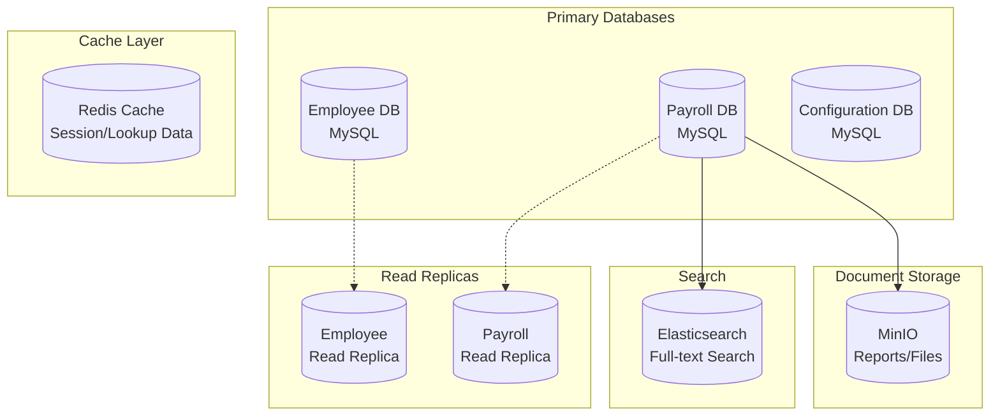
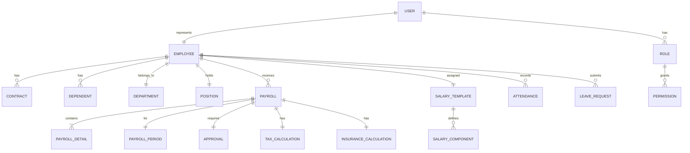
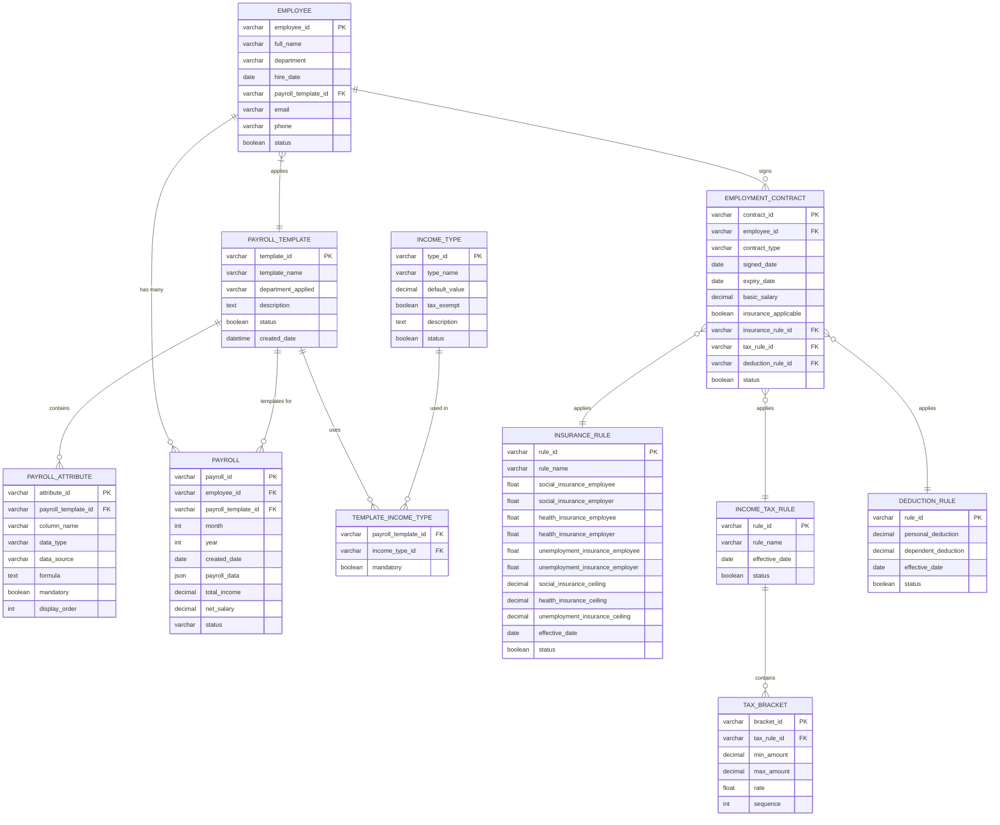

# DATABASE DESIGN DOCUMENT
## Hệ thống Quản lý Lương - Payroll Management System

**Version:** 1.0
**Date:** 2024-09-24
**Status:** Draft
**Author:** Database Team

---

## MỤC LỤC
1. [Giới thiệu](#1-giới-thiệu)
2. [Database Architecture](#2-database-architecture)
3. [Conceptual Data Model](#3-conceptual-data-model)
4. [Logical Data Model](#4-logical-data-model)
5. [Physical Data Model](#5-physical-data-model)
6. [Data Dictionary](#6-data-dictionary)
7. [Indexing Strategy](#7-indexing-strategy)
8. [Data Security](#8-data-security)
9. [Migration Strategy](#9-migration-strategy)
10. [Backup & Recovery](#10-backup--recovery)

---

## 1. GIỚI THIỆU

### 1.1 Mục đích
Tài liệu này định nghĩa thiết kế database cho Hệ thống Quản lý Lương, bao gồm cấu trúc dữ liệu, quan hệ, và chiến lược tối ưu.

### 1.2 Scope
- Database schema design
- Data relationships
- Constraints và validations
- Performance optimization
- Security measures

### 1.3 Database Management System
- **Primary DBMS:** MySQL 8.0
- **Caching:** Redis 7.x
- **Document Store:** MinIO (for files)
- **Search Engine:** Elasticsearch 8.x

---

## 2. DATABASE ARCHITECTURE

### 2.1 Database Distribution



### 2.2 Database Separation Strategy

| Database | Purpose | Tables | Size Estimate |
|----------|---------|--------|--------------|
| **employee_db** | Employee master data | 15 tables | 10-50 GB |
| **payroll_db** | Transactional payroll data | 20 tables | 100-500 GB |
| **config_db** | System configuration | 10 tables | <1 GB |

---

## 3. CONCEPTUAL DATA MODEL

### 3.1 Entity Relationship Diagram (High Level)



### 3.2 Detailed Entity Relationship Diagram



### 3.3 Mô tả chi tiết các thành phần

#### 3.3.1 Payroll Template (PAYROLL_TEMPLATE)

**Mục đích:**
- Định nghĩa cấu trúc bảng lương áp dụng cho nhân viên/phòng ban
- Cho phép tạo nhiều mẫu bảng lương khác nhau cho từng bộ phận

**Key attributes:**
- **Template ID**: Unique identifier (e.g., "SALES_TEMPLATE", "OFFICE_TEMPLATE")
- **Template Name**: Display name (e.g., "Sales Staff Payroll Template")
- **Department Applied**: Default department using this template
- **Attribute List**: Dynamically defined columns in the payroll

**Example JSON configuration:**
```json
{
  "template_id": "SALES_TEMPLATE",
  "template_name": "Sales Staff Payroll Template",
  "department_applied": "SALES_DEPARTMENT",
  "attributes": [
    {
      "column_code": "BASIC_SALARY",
      "column_name": "Basic Salary",
      "data_type": "number",
      "data_source": "system",
      "mandatory": true
    },
    {
      "column_code": "STANDARD_DAYS",
      "column_name": "Standard Working Days",
      "data_type": "number",
      "default_value": 22,
      "mandatory": true
    },
    {
      "column_code": "ACTUAL_DAYS",
      "column_name": "Actual Working Days",
      "data_type": "number",
      "data_source": "manual",
      "mandatory": true
    },
    {
      "column_code": "PRORATED_SALARY",
      "column_name": "Prorated Salary",
      "data_type": "formula",
      "formula": "ACTUAL_DAYS / STANDARD_DAYS * BASIC_SALARY",
      "mandatory": true
    },
    {
      "column_code": "COMMISSION",
      "column_name": "Sales Commission",
      "data_type": "number",
      "data_source": "manual",
      "mandatory": false
    }
  ]
}
```

#### 3.3.2 Payroll Attributes (PAYROLL_ATTRIBUTE - Dynamic Columns)

**Mục đích:**
- Định nghĩa từng cột/trường dữ liệu trong bảng lương
- Cho phép cấu hình linh hoạt theo nhu cầu từng doanh nghiệp

**Các thuộc tính quan trọng:**

| Attribute | Description | Example |
|-----------|-------------|----------|
| **Column Name** | Display name on interface | "Basic Salary" |
| **Column Code** | Reference code in formulas | "BASIC_SALARY" |
| **Data Type** | number, text, date, boolean, formula | "number" |
| **Data Source** | system, manual, formula, import | "system" |
| **Formula** | Calculation expression (if type = formula) | "A * B / C" |
| **Mandatory** | Whether input is required | true/false |
| **Display Order** | Column position in payroll | 1, 2, 3... |

**Phân loại nguồn dữ liệu:**
- **system**: Lấy tự động từ hệ thống (từ hợp đồng, chấm công)
- **manual**: Nhập thủ công mỗi tháng
- **formula**: Tính toán theo công thức từ các cột khác
- **import**: Nhập từ file Excel/CSV

#### 3.3.3 Payroll (PAYROLL - Actual Instance)

**Mục đích:**
- Lưu trữ bảng lương thực tế của từng nhân viên theo tháng
- Chứa giá trị cụ thể sau khi tính toán

**Đặc điểm:**
- Được tạo tự động dựa trên template (loại bảng lương)
- Lưu trữ dạng JSON để linh hoạt với cấu trúc động
- Tính toán tự động theo công thức đã định nghĩa
- Lưu trữ snapshot để đảm bảo tính toàn vẹn dữ liệu

**Payroll creation process:**
1. Determine employee's payroll template
2. Create payroll based on template
3. Fill data from system (basic salary from contract)
4. Allow manual data entry
5. Calculate formulas
6. Calculate social insurance
7. Calculate income tax
8. Calculate net salary

**Example stored data:**
```json
{
  "payroll_id": "PAY202409001",
  "employee_id": "EMP001",
  "month": 9,
  "year": 2024,
  "payroll_data": {
    "BASIC_SALARY": 15000000,
    "STANDARD_DAYS": 22,
    "ACTUAL_DAYS": 20,
    "PRORATED_SALARY": 13636364,
    "COMMISSION": 5000000,
    "LUNCH_ALLOWANCE": 800000,
    "TRANSPORT_ALLOWANCE": 500000
  },
  "total_income": 19936364,
  "social_insurance": 1595091,
  "income_tax": 987273,
  "net_salary": 17354000
}
```

#### 3.3.4 Employee (EMPLOYEE)

**Management information:**
- **Personal information**: Full name, birth date, ID number, phone, email
- **Work information**: Employee code, department, position, hire date
- **Payroll template**: Determines applicable payroll template
- **Status**: Active, on leave, terminated

**Relationships:**
- Links to multiple employment contracts (1-n)
- Links to multiple monthly payrolls (1-n)
- Belongs to one department (n-1)
- Applies one payroll template (n-1)

#### 3.3.5 Employment Contract (EMPLOYMENT_CONTRACT)

**Contract information:**
- **Contract type**: Permanent, fixed-term, probationary
- **Duration**: Signed date, expiry date
- **Basic salary**: Salary amount specified in contract
- **Applied regulations**: Insurance, tax, deductions

**Characteristics:**
- An employee can have multiple contracts (renewals, amendments)
- Only one active contract at a time
- Inherits information from previous contract when creating new one

#### 3.3.6 Income Type (INCOME_TYPE)

**Income classification:**

| Type | Description | Tax Exempt | Insurable |
|------|-------------|------------|-----------|
| **Basic salary** | Contractual salary | No | Yes |
| **Lunch allowance** | Lunch support | Yes (730k) | No |
| **Phone allowance** | Phone expenses | Partial | No |
| **Transport allowance** | Travel expenses | Partial | No |
| **Housing allowance** | Housing support | No | Yes |
| **Performance bonus** | KPI bonus | No | Yes |
| **Holiday bonus** | Holiday bonuses | No | No |
| **Commission** | Sales commission | No | Yes |
| **Overtime** | Overtime pay | No | Yes |

**Important attributes:**
- **Tax exempt**: Whether exempt from personal income tax
- **Insurance applicable**: Whether included in insurance salary
- **Default value**: Standard value if applicable

#### 3.3.7 Insurance Rules (INSURANCE_RULE)

**Thông tin quy định năm 2024:**

| Loại bảo hiểm | Người lao động | Doanh nghiệp | Mức trần |
|---------------|----------------|--------------|----------|
| **BHXH** | 8% | 17.5% | 20 lần lương cơ sở (29,800,000 VNĐ) |
| **BHYT** | 1.5% | 3% | 20 lần lương cơ sở (29,800,000 VNĐ) |
| **BHTN** | 1% | 1% | 20 lần lương tối thiểu vùng |
| **BHTNLĐ-BNN** | 0% | 0.5% | Theo lương thực tế |

**Cách tính:**
```
Lương đóng BH = MIN(Lương thực tế, Mức trần)
BH người lao động = Lương đóng BH × Tỷ lệ NLĐ
BH doanh nghiệp = Lương đóng BH × Tỷ lệ DN
```

#### 3.3.8 Income Tax Rules (INCOME_TAX_RULE & TAX_BRACKET)

**Bảng thuế lũy tiến từng phần 2024:**

| Bậc | Thu nhập tính thuế/tháng | Thuế suất |
|-----|--------------------------|-----------|
| 1 | Đến 5 triệu | 5% |
| 2 | Trên 5 - 10 triệu | 10% |
| 3 | Trên 10 - 18 triệu | 15% |
| 4 | Trên 18 - 32 triệu | 20% |
| 5 | Trên 32 - 52 triệu | 25% |
| 6 | Trên 52 - 80 triệu | 30% |
| 7 | Trên 80 triệu | 35% |

**Công thức tính:**
```
Thu nhập tính thuế = Tổng thu nhập - Các khoản miễn thuế - BHXH/BHYT/BHTN - Giảm trừ gia cảnh
Thuế TNCN = Σ(Thu nhập trong bậc × Thuế suất bậc)
```

**Ví dụ tính thuế:**
- Thu nhập: 25,000,000 VNĐ
- BHXH/BHYT/BHTN: 2,500,000 VNĐ
- Giảm trừ bản thân: 11,000,000 VNĐ
- Thu nhập tính thuế: 11,500,000 VNĐ
- Thuế TNCN = 5,000,000 × 5% + 5,000,000 × 10% + 1,500,000 × 15% = 975,000 VNĐ

#### 3.3.9 Deduction Rules (DEDUCTION_RULE)

**Mức giảm trừ hiện hành (2024):**
- **Bản thân**: 11,000,000 VNĐ/tháng
- **Người phụ thuộc**: 4,400,000 VNĐ/tháng/người

**Điều kiện người phụ thuộc:**
- Con dưới 18 tuổi
- Con trên 18 tuổi đang đi học
- Vợ/chồng không có thu nhập hoặc thu nhập < 1 triệu/tháng
- Bố mẹ già yếu, không có thu nhập

**Ví dụ:**
- Nhân viên có 2 con nhỏ, vợ không đi làm
- Tổng giảm trừ = 11,000,000 + (3 × 4,400,000) = 24,200,000 VNĐ/tháng

### 3.4 Core Entities Summary

| Entity | Description | Volume |
|--------|------------|--------|
| **EMPLOYEE** | Employee information | 10,000+ |
| **PAYROLL_TEMPLATE** | Payroll templates | 10-20 |
| **PAYROLL_ATTRIBUTE** | Dynamic column configuration | 200-500 |
| **PAYROLL** | Monthly payroll records | 120,000/year |
| **EMPLOYMENT_CONTRACT** | Employment contracts | 15,000 |
| **INSURANCE_RULE** | Social/Health/Unemployment insurance rules | 10-20 |
| **INCOME_TAX_RULE** | Income tax regulations | 5-10 |
| **TAX_BRACKET** | Progressive tax brackets | 7 brackets |
| **DEDUCTION_RULE** | Personal deduction rules | 5-10 |

---

## 4. LOGICAL DATA MODEL

### 4.1 Employee Management Schema

```sql
-- Departments Table
CREATE TABLE departments (
    department_id CHAR(36) PRIMARY KEY DEFAULT (UUID()),
    department_code VARCHAR(20) UNIQUE NOT NULL,
    department_name VARCHAR(100) NOT NULL,
    parent_department_id CHAR(36),
    manager_id CHAR(36),
    is_active BOOLEAN DEFAULT true,
    created_at TIMESTAMP DEFAULT CURRENT_TIMESTAMP,
    updated_at TIMESTAMP DEFAULT CURRENT_TIMESTAMP ON UPDATE CURRENT_TIMESTAMP,
    FOREIGN KEY (parent_department_id) REFERENCES departments(department_id)
);

-- Positions Table
CREATE TABLE positions (
    position_id CHAR(36) PRIMARY KEY DEFAULT (UUID()),
    position_code VARCHAR(20) UNIQUE NOT NULL,
    position_name VARCHAR(100) NOT NULL,
    department_id CHAR(36),
    level INT,
    min_salary DECIMAL(15,2),
    max_salary DECIMAL(15,2),
    is_active BOOLEAN DEFAULT true,
    created_at TIMESTAMP DEFAULT CURRENT_TIMESTAMP,
    FOREIGN KEY (department_id) REFERENCES departments(department_id),
    CONSTRAINT chk_level CHECK (level BETWEEN 1 AND 10)
);

-- Employees Table (Master)
CREATE TABLE employees (
    employee_id CHAR(36) PRIMARY KEY DEFAULT (UUID()),
    employee_code VARCHAR(20) UNIQUE NOT NULL,
    first_name VARCHAR(50) NOT NULL,
    last_name VARCHAR(50) NOT NULL,
    middle_name VARCHAR(50),
    date_of_birth DATE NOT NULL,
    gender CHAR(1),
    national_id VARCHAR(20) UNIQUE NOT NULL,
    tax_code VARCHAR(20),

    -- Contact Information
    email VARCHAR(100) UNIQUE,
    phone VARCHAR(20),
    address TEXT,
    city VARCHAR(50),
    district VARCHAR(50),
    ward VARCHAR(50),

    -- Employment Information
    department_id CHAR(36),
    position_id CHAR(36),
    manager_id CHAR(36),
    hire_date DATE NOT NULL,
    probation_end_date DATE,

    -- Status
    employment_status VARCHAR(20) DEFAULT 'ACTIVE',

    -- Audit
    created_at TIMESTAMP DEFAULT CURRENT_TIMESTAMP,
    updated_at TIMESTAMP DEFAULT CURRENT_TIMESTAMP ON UPDATE CURRENT_TIMESTAMP,
    created_by CHAR(36),
    updated_by CHAR(36),

    FOREIGN KEY (department_id) REFERENCES departments(department_id),
    FOREIGN KEY (position_id) REFERENCES positions(position_id),
    FOREIGN KEY (manager_id) REFERENCES employees(employee_id),
    CONSTRAINT chk_gender CHECK (gender IN ('M', 'F', 'O')),
    CONSTRAINT chk_employment_status CHECK (
        employment_status IN ('ACTIVE', 'INACTIVE', 'TERMINATED', 'ON_LEAVE')
    )
);

-- Dependents Table
CREATE TABLE dependents (
    dependent_id CHAR(36) PRIMARY KEY DEFAULT (UUID()),
    employee_id CHAR(36),
    full_name VARCHAR(100) NOT NULL,
    relationship VARCHAR(20) NOT NULL,
    date_of_birth DATE,
    national_id VARCHAR(20),
    tax_code VARCHAR(20),
    is_tax_dependent BOOLEAN DEFAULT true,
    effective_from DATE NOT NULL,
    effective_to DATE,
    created_at TIMESTAMP DEFAULT CURRENT_TIMESTAMP,

    FOREIGN KEY (employee_id) REFERENCES employees(employee_id) ON DELETE CASCADE,
    CONSTRAINT chk_relationship CHECK (
        relationship IN ('SPOUSE', 'CHILD', 'PARENT', 'OTHER')
    )
);

-- Contracts Table
CREATE TABLE contracts (
    contract_id CHAR(36) PRIMARY KEY DEFAULT (UUID()),
    employee_id CHAR(36),
    contract_number VARCHAR(50) UNIQUE NOT NULL,
    contract_type VARCHAR(20) NOT NULL,
    start_date DATE NOT NULL,
    end_date DATE,

    -- Salary Information
    base_salary DECIMAL(15,2) NOT NULL,
    salary_template_id CHAR(36),
    insurance_salary DECIMAL(15,2),

    -- Status
    status VARCHAR(20) DEFAULT 'ACTIVE',
    signed_date DATE,

    -- Audit
    created_at TIMESTAMP DEFAULT CURRENT_TIMESTAMP,
    updated_at TIMESTAMP DEFAULT CURRENT_TIMESTAMP ON UPDATE CURRENT_TIMESTAMP,

    FOREIGN KEY (employee_id) REFERENCES employees(employee_id),
    CONSTRAINT chk_base_salary CHECK (base_salary > 0),
    CONSTRAINT chk_contract_type CHECK (
        contract_type IN ('PERMANENT', 'FIXED_TERM', 'PART_TIME', 'PROBATION')
    ),
    CONSTRAINT chk_contract_status CHECK (
        status IN ('DRAFT', 'ACTIVE', 'EXPIRED', 'TERMINATED')
    )
);

-- Bank Accounts
CREATE TABLE employee_bank_accounts (
    account_id CHAR(36) PRIMARY KEY DEFAULT (UUID()),
    employee_id CHAR(36),
    bank_name VARCHAR(100) NOT NULL,
    bank_branch VARCHAR(100),
    account_number VARCHAR(50) NOT NULL,
    account_name VARCHAR(100) NOT NULL,
    is_primary BOOLEAN DEFAULT false,
    is_active BOOLEAN DEFAULT true,
    created_at TIMESTAMP DEFAULT CURRENT_TIMESTAMP,
    FOREIGN KEY (employee_id) REFERENCES employees(employee_id)
);
```

### 4.2 Payroll Configuration Schema

```sql
-- Salary Templates
CREATE TABLE salary_templates (
    template_id CHAR(36) PRIMARY KEY DEFAULT (UUID()),
    template_code VARCHAR(20) UNIQUE NOT NULL,
    template_name VARCHAR(100) NOT NULL,
    description TEXT,
    is_active BOOLEAN DEFAULT true,
    created_at TIMESTAMP DEFAULT CURRENT_TIMESTAMP,
    updated_at TIMESTAMP DEFAULT CURRENT_TIMESTAMP ON UPDATE CURRENT_TIMESTAMP
);

-- Salary Components
CREATE TABLE salary_components (
    component_id CHAR(36) PRIMARY KEY DEFAULT (UUID()),
    component_code VARCHAR(20) UNIQUE NOT NULL,
    component_name VARCHAR(100) NOT NULL,
    component_type VARCHAR(20) NOT NULL,
    calculation_type VARCHAR(20) NOT NULL,

    -- Tax & Insurance
    is_taxable BOOLEAN DEFAULT true,
    is_insurance_applicable BOOLEAN DEFAULT true,

    -- Formula
    formula TEXT,
    fixed_amount DECIMAL(15,2),
    percentage DECIMAL(5,2),

    -- Display
    display_order INT,
    is_visible BOOLEAN DEFAULT true,

    created_at TIMESTAMP DEFAULT CURRENT_TIMESTAMP,

    CONSTRAINT chk_component_type CHECK (
        component_type IN ('EARNING', 'DEDUCTION', 'BENEFIT', 'TAX', 'INSURANCE')
    ),
    CONSTRAINT chk_calculation_type CHECK (
        calculation_type IN ('FIXED', 'PERCENTAGE', 'FORMULA', 'TABLE')
    )
);

-- Template Components Mapping
CREATE TABLE template_components (
    template_id CHAR(36),
    component_id CHAR(36),
    is_mandatory BOOLEAN DEFAULT true,
    default_value DECIMAL(15,2),
    min_value DECIMAL(15,2),
    max_value DECIMAL(15,2),
    display_order INT,
    PRIMARY KEY (template_id, component_id),
    FOREIGN KEY (template_id) REFERENCES salary_templates(template_id),
    FOREIGN KEY (component_id) REFERENCES salary_components(component_id)
);

-- Tax Configuration
CREATE TABLE tax_brackets (
    bracket_id CHAR(36) PRIMARY KEY DEFAULT (UUID()),
    year INT NOT NULL,
    bracket_order INT NOT NULL,
    min_income DECIMAL(15,2) NOT NULL,
    max_income DECIMAL(15,2),
    tax_rate DECIMAL(5,2) NOT NULL,
    quick_deduction DECIMAL(15,2) DEFAULT 0,
    created_at TIMESTAMP DEFAULT CURRENT_TIMESTAMP,
    UNIQUE(year, bracket_order)
);

-- Insurance Configuration
CREATE TABLE insurance_rates (
    rate_id CHAR(36) PRIMARY KEY DEFAULT (UUID()),
    insurance_type VARCHAR(20) NOT NULL,
    effective_date DATE NOT NULL,
    employee_rate DECIMAL(5,2) NOT NULL,
    employer_rate DECIMAL(5,2) NOT NULL,
    min_salary DECIMAL(15,2),
    max_salary DECIMAL(15,2),
    created_at TIMESTAMP DEFAULT CURRENT_TIMESTAMP,

    CONSTRAINT chk_insurance_type CHECK (
        insurance_type IN ('SOCIAL', 'HEALTH', 'UNEMPLOYMENT', 'ACCIDENT')
    )
);

-- Tax Deductions Configuration
CREATE TABLE tax_deductions (
    deduction_id CHAR(36) PRIMARY KEY DEFAULT (UUID()),
    deduction_type VARCHAR(30) NOT NULL,
    year INT NOT NULL,
    amount DECIMAL(15,2) NOT NULL,
    created_at TIMESTAMP DEFAULT CURRENT_TIMESTAMP,
    UNIQUE(deduction_type, year),

    CONSTRAINT chk_deduction_type CHECK (
        deduction_type IN ('PERSONAL', 'DEPENDENT')
    )
);
```

### 4.3 Payroll Transaction Schema

```sql
-- Payroll Periods
CREATE TABLE payroll_periods (
    period_id CHAR(36) PRIMARY KEY DEFAULT (UUID()),
    period_code VARCHAR(20) UNIQUE NOT NULL,
    month INT NOT NULL,
    year INT NOT NULL,
    start_date DATE NOT NULL,
    end_date DATE NOT NULL,
    payment_date DATE,
    status VARCHAR(20) DEFAULT 'OPEN',
    created_at TIMESTAMP DEFAULT CURRENT_TIMESTAMP,
    closed_at TIMESTAMP NULL,
    closed_by CHAR(36),

    CONSTRAINT chk_month CHECK (month BETWEEN 1 AND 12),
    CONSTRAINT chk_year CHECK (year > 2020),
    CONSTRAINT chk_period_status CHECK (
        status IN ('OPEN', 'PROCESSING', 'CLOSED', 'PAID')
    ),
    UNIQUE(month, year)
);

-- Payroll Master
CREATE TABLE payrolls (
    payroll_id CHAR(36) PRIMARY KEY DEFAULT (UUID()),
    payroll_number VARCHAR(30) UNIQUE NOT NULL,
    employee_id CHAR(36),
    period_id CHAR(36),

    -- Working Days
    working_days DECIMAL(5,2) DEFAULT 0,
    standard_days DECIMAL(5,2) DEFAULT 22,

    -- Salary Components
    basic_salary DECIMAL(15,2) NOT NULL,
    gross_salary DECIMAL(15,2) NOT NULL,
    total_deductions DECIMAL(15,2) DEFAULT 0,
    net_salary DECIMAL(15,2) NOT NULL,

    -- Status & Workflow
    status VARCHAR(20) DEFAULT 'DRAFT',
    calculation_date TIMESTAMP NULL,
    approval_date TIMESTAMP NULL,
    approved_by CHAR(36),
    payment_date DATE,
    payment_method VARCHAR(20),

    -- Audit
    created_at TIMESTAMP DEFAULT CURRENT_TIMESTAMP,
    updated_at TIMESTAMP DEFAULT CURRENT_TIMESTAMP ON UPDATE CURRENT_TIMESTAMP,
    created_by CHAR(36),
    updated_by CHAR(36),

    FOREIGN KEY (employee_id) REFERENCES employees(employee_id),
    FOREIGN KEY (period_id) REFERENCES payroll_periods(period_id),
    CONSTRAINT chk_payroll_status CHECK (
        status IN ('DRAFT', 'CALCULATED', 'APPROVED', 'REJECTED', 'PAID', 'CANCELLED')
    ),
    CONSTRAINT chk_payment_method CHECK (
        payment_method IN ('BANK_TRANSFER', 'CASH', 'CHECK')
    ),
    UNIQUE(employee_id, period_id)
);

-- Payroll Details
CREATE TABLE payroll_details (
    detail_id CHAR(36) PRIMARY KEY DEFAULT (UUID()),
    payroll_id CHAR(36),
    component_id CHAR(36),
    component_name VARCHAR(100) NOT NULL,
    component_type VARCHAR(20) NOT NULL,
    amount DECIMAL(15,2) NOT NULL,
    is_taxable BOOLEAN DEFAULT true,
    is_insurance_applicable BOOLEAN DEFAULT true,
    calculation_note TEXT,
    display_order INT,
    created_at TIMESTAMP DEFAULT CURRENT_TIMESTAMP,
    FOREIGN KEY (payroll_id) REFERENCES payrolls(payroll_id) ON DELETE CASCADE,
    FOREIGN KEY (component_id) REFERENCES salary_components(component_id)
);

-- Tax Calculations
CREATE TABLE tax_calculations (
    tax_id CHAR(36) PRIMARY KEY DEFAULT (UUID()),
    payroll_id CHAR(36),

    -- Income
    gross_income DECIMAL(15,2) NOT NULL,
    taxable_income DECIMAL(15,2) NOT NULL,

    -- Deductions (Vietnam 2024)
    insurance_deduction DECIMAL(15,2) DEFAULT 0,
    personal_deduction DECIMAL(15,2) DEFAULT 11000000,
    dependent_deduction DECIMAL(15,2) DEFAULT 0,
    dependent_count INT DEFAULT 0,

    -- Tax Calculation
    taxable_amount DECIMAL(15,2) NOT NULL,
    tax_amount DECIMAL(15,2) NOT NULL,

    -- Details
    calculation_details JSON,
    created_at TIMESTAMP DEFAULT CURRENT_TIMESTAMP,

    FOREIGN KEY (payroll_id) REFERENCES payrolls(payroll_id) ON DELETE CASCADE,
    CONSTRAINT chk_taxable_income CHECK (
        taxable_income = gross_income - insurance_deduction - personal_deduction - dependent_deduction
    )
);

-- Insurance Calculations
CREATE TABLE insurance_calculations (
    insurance_id CHAR(36) PRIMARY KEY DEFAULT (UUID()),
    payroll_id CHAR(36),
    insurance_salary DECIMAL(15,2) NOT NULL,

    -- Employee Contributions (Vietnam 2024)
    social_insurance_employee DECIMAL(15,2) DEFAULT 0, -- 8%
    health_insurance_employee DECIMAL(15,2) DEFAULT 0, -- 1.5%
    unemployment_insurance_employee DECIMAL(15,2) DEFAULT 0, -- 1%

    -- Employer Contributions
    social_insurance_employer DECIMAL(15,2) DEFAULT 0, -- 17.5%
    health_insurance_employer DECIMAL(15,2) DEFAULT 0, -- 3%
    unemployment_insurance_employer DECIMAL(15,2) DEFAULT 0, -- 1%
    accident_insurance_employer DECIMAL(15,2) DEFAULT 0, -- 0.5%

    total_employee DECIMAL(15,2) NOT NULL,
    total_employer DECIMAL(15,2) NOT NULL,

    created_at TIMESTAMP DEFAULT CURRENT_TIMESTAMP,
    FOREIGN KEY (payroll_id) REFERENCES payrolls(payroll_id) ON DELETE CASCADE
);

-- Attendance Summary (for payroll)
CREATE TABLE payroll_attendance (
    attendance_id CHAR(36) PRIMARY KEY DEFAULT (UUID()),
    employee_id CHAR(36),
    period_id CHAR(36),

    -- Working Days
    regular_days DECIMAL(5,2) DEFAULT 0,
    overtime_hours DECIMAL(7,2) DEFAULT 0,
    holiday_hours DECIMAL(7,2) DEFAULT 0,

    -- Leave Days
    paid_leave_days DECIMAL(5,2) DEFAULT 0,
    unpaid_leave_days DECIMAL(5,2) DEFAULT 0,
    sick_leave_days DECIMAL(5,2) DEFAULT 0,

    -- Summary
    total_working_days DECIMAL(5,2) NOT NULL,

    created_at TIMESTAMP DEFAULT CURRENT_TIMESTAMP,
    updated_at TIMESTAMP DEFAULT CURRENT_TIMESTAMP ON UPDATE CURRENT_TIMESTAMP,

    FOREIGN KEY (employee_id) REFERENCES employees(employee_id),
    FOREIGN KEY (period_id) REFERENCES payroll_periods(period_id),
    UNIQUE(employee_id, period_id)
);
```

### 4.4 Audit & History Schema

```sql
-- Payroll History (for tracking changes)
CREATE TABLE payroll_history (
    history_id CHAR(36) PRIMARY KEY DEFAULT (UUID()),
    payroll_id CHAR(36) NOT NULL,
    action VARCHAR(20) NOT NULL,
    old_status VARCHAR(20),
    new_status VARCHAR(20),
    changes JSON,
    reason TEXT,
    performed_by CHAR(36) NOT NULL,
    performed_at TIMESTAMP DEFAULT CURRENT_TIMESTAMP,

    CONSTRAINT chk_action CHECK (
        action IN ('CREATE', 'UPDATE', 'APPROVE', 'REJECT', 'CANCEL', 'PAY')
    )
);

-- Audit Log (generic)
CREATE TABLE audit_logs (
    log_id CHAR(36) PRIMARY KEY DEFAULT (UUID()),
    table_name VARCHAR(50) NOT NULL,
    record_id CHAR(36) NOT NULL,
    action VARCHAR(20) NOT NULL,
    old_values JSON,
    new_values JSON,
    user_id CHAR(36) NOT NULL,
    ip_address VARCHAR(45),
    user_agent TEXT,
    created_at TIMESTAMP DEFAULT CURRENT_TIMESTAMP,

    CONSTRAINT chk_audit_action CHECK (
        action IN ('INSERT', 'UPDATE', 'DELETE')
    )
);

-- System Configuration
CREATE TABLE system_configs (
    config_id CHAR(36) PRIMARY KEY DEFAULT (UUID()),
    config_key VARCHAR(100) UNIQUE NOT NULL,
    config_value TEXT NOT NULL,
    config_type VARCHAR(20) NOT NULL,
    description TEXT,
    is_encrypted BOOLEAN DEFAULT false,
    created_at TIMESTAMP DEFAULT CURRENT_TIMESTAMP,
    updated_at TIMESTAMP DEFAULT CURRENT_TIMESTAMP ON UPDATE CURRENT_TIMESTAMP,

    CONSTRAINT chk_config_type CHECK (
        config_type IN ('STRING', 'NUMBER', 'BOOLEAN', 'JSON')
    )
);
```

---

## 5. PHYSICAL DATA MODEL

### 5.1 Tablespace Organization

```sql
-- MySQL uses InnoDB tablespaces differently than PostgreSQL
-- Configure innodb_file_per_table for better management
SET GLOBAL innodb_file_per_table = ON;

-- Create separate database schemas for logical separation
CREATE DATABASE payroll_data;
CREATE DATABASE payroll_archive;

-- Use table partitioning for large tables
ALTER TABLE payrolls PARTITION BY RANGE (YEAR(created_at)) (
    PARTITION p2024 VALUES LESS THAN (2025),
    PARTITION p2025 VALUES LESS THAN (2026),
    PARTITION p2026 VALUES LESS THAN (2027)
);
```

### 5.2 Partitioning Strategy

```sql
-- MySQL partitioning for payrolls table by year-month
ALTER TABLE payrolls
PARTITION BY RANGE (YEAR(created_at) * 100 + MONTH(created_at)) (
    PARTITION p202401 VALUES LESS THAN (202402),
    PARTITION p202402 VALUES LESS THAN (202403),
    PARTITION p202403 VALUES LESS THAN (202404),
    PARTITION p202404 VALUES LESS THAN (202405),
    PARTITION p202405 VALUES LESS THAN (202406),
    PARTITION p202406 VALUES LESS THAN (202407),
    PARTITION p202407 VALUES LESS THAN (202408),
    PARTITION p202408 VALUES LESS THAN (202409),
    PARTITION p202409 VALUES LESS THAN (202410),
    PARTITION p202410 VALUES LESS THAN (202411),
    PARTITION p202411 VALUES LESS THAN (202412),
    PARTITION p202412 VALUES LESS THAN (202501)
);

-- Partition audit_logs by month
ALTER TABLE audit_logs
PARTITION BY RANGE (TO_DAYS(created_at)) (
    PARTITION p202409 VALUES LESS THAN (TO_DAYS('2024-10-01')),
    PARTITION p202410 VALUES LESS THAN (TO_DAYS('2024-11-01')),
    PARTITION p202411 VALUES LESS THAN (TO_DAYS('2024-12-01')),
    PARTITION p202412 VALUES LESS THAN (TO_DAYS('2025-01-01'))
);
```

### 5.3 Storage Estimates

| Table | Row Size | Row Count/Year | Total Size/Year |
|-------|----------|----------------|-----------------|
| employees | 2 KB | 10,000 | 20 MB |
| payrolls | 1 KB | 120,000 | 120 MB |
| payroll_details | 0.5 KB | 2,400,000 | 1.2 GB |
| audit_logs | 2 KB | 500,000 | 1 GB |
| **Total** | - | - | **~3 GB/year** |

---

## 6. DATA DICTIONARY

### 6.1 Employee Table Fields

| Column | Data Type | Constraints | Description |
|--------|-----------|-------------|-------------|
| employee_id | CHAR(36) | PK, NOT NULL | Unique identifier |
| employee_code | VARCHAR(20) | UNIQUE, NOT NULL | Employee code |
| first_name | VARCHAR(50) | NOT NULL | First name |
| last_name | VARCHAR(50) | NOT NULL | Last name |
| national_id | VARCHAR(20) | UNIQUE, NOT NULL | CCCD/CMND number |
| tax_code | VARCHAR(20) | - | Personal tax code |
| hire_date | DATE | NOT NULL | Employment start date |
| base_salary | DECIMAL(15,2) | > 0 | Basic salary |

### 6.2 Payroll Table Fields

| Column | Data Type | Constraints | Description |
|--------|-----------|-------------|-------------|
| payroll_id | UUID | PK, NOT NULL | Unique identifier |
| payroll_number | VARCHAR(30) | UNIQUE, NOT NULL | Payroll reference |
| gross_salary | DECIMAL(15,2) | NOT NULL | Total before deductions |
| net_salary | DECIMAL(15,2) | NOT NULL | Take-home pay |
| status | VARCHAR(20) | CHECK | Payroll status |

### 6.3 Common Data Types

| Type | Usage | Example |
|------|-------|---------|
| CHAR(36) | Primary keys (UUID) | 550e8400-e29b-41d4-a716-446655440000 |
| DECIMAL(15,2) | Money amounts | 25000000.50 |
| TIMESTAMP | Date/time | 2024-09-24 10:30:00 |
| JSON | Flexible data | {"key": "value"} |

---

## 7. INDEXING STRATEGY

### 7.1 Primary Indexes

```sql
-- Primary key indexes (automatic)
-- Already created with PRIMARY KEY constraint

-- Unique indexes (automatic)
-- Already created with UNIQUE constraint

-- Foreign key indexes (manual)
CREATE INDEX idx_employees_department ON employees(department_id);
CREATE INDEX idx_employees_position ON employees(position_id);
CREATE INDEX idx_employees_manager ON employees(manager_id);

CREATE INDEX idx_payrolls_employee ON payrolls(employee_id);
CREATE INDEX idx_payrolls_period ON payrolls(period_id);
CREATE INDEX idx_payrolls_status ON payrolls(status);

CREATE INDEX idx_payroll_details_payroll ON payroll_details(payroll_id);
CREATE INDEX idx_payroll_details_component ON payroll_details(component_id);
```

### 7.2 Performance Indexes

```sql
-- Composite indexes for common queries
CREATE INDEX idx_payrolls_employee_period ON payrolls(employee_id, period_id);
CREATE INDEX idx_payrolls_period_status ON payrolls(period_id, status);

-- Partial indexes for active records
CREATE INDEX idx_employees_active ON employees(employee_id)
    WHERE employment_status = 'ACTIVE';

-- Expression indexes
CREATE INDEX idx_employees_fullname ON employees(
    lower(first_name || ' ' || last_name)
);

-- MySQL JSON index
CREATE INDEX idx_audit_logs_values ON audit_logs((CAST(new_values AS CHAR(255))));
```

### 7.3 Index Maintenance

```sql
-- Analyze tables regularly
ANALYZE TABLE employees;
ANALYZE TABLE payrolls;

-- Optimize tables periodically
OPTIMIZE TABLE payrolls;
OPTIMIZE TABLE payroll_details;

-- Monitor index usage
SELECT
    table_name,
    index_name,
    cardinality
FROM information_schema.statistics
WHERE table_schema = 'payroll_db'
ORDER BY cardinality DESC;
```

---

## 8. DATA SECURITY

### 8.1 Encryption

```sql
-- Enable transparent encryption (MySQL Enterprise)
-- Or use table-level encryption
CREATE TABLE employees_encrypted (
    employee_id CHAR(36),
    tax_code VARBINARY(255),
    -- other columns
) ENCRYPTION='Y';

-- Encrypt sensitive data with AES
UPDATE employees
SET tax_code = AES_ENCRYPT(tax_code, 'encryption_key');

-- Decrypt when reading
SELECT AES_DECRYPT(tax_code, 'encryption_key') as tax_code
FROM employees;
```

### 8.2 Access Control

```sql
-- Create users with roles
CREATE USER 'payroll_admin'@'%' IDENTIFIED BY 'password';
CREATE USER 'payroll_user'@'%' IDENTIFIED BY 'password';
CREATE USER 'payroll_viewer'@'%' IDENTIFIED BY 'password';

-- Grant permissions
GRANT ALL PRIVILEGES ON payroll_db.* TO 'payroll_admin'@'%';
GRANT SELECT, INSERT, UPDATE ON payroll_db.payrolls TO 'payroll_user'@'%';
GRANT SELECT ON payroll_db.* TO 'payroll_viewer'@'%';

-- Use views for row-level security
CREATE VIEW employee_dept_view AS
SELECT e.*
FROM employees e
INNER JOIN user_departments ud ON e.department_id = ud.department_id
WHERE ud.user_id = USER();

GRANT SELECT ON employee_dept_view TO 'payroll_user'@'%';
```

### 8.3 Data Masking

```sql
-- Create masked views for sensitive data
CREATE VIEW employees_masked AS
SELECT
    employee_id,
    employee_code,
    first_name,
    last_name,
    CASE
        WHEN USER() LIKE 'hr_admin%' THEN national_id
        ELSE CONCAT(SUBSTRING(national_id, 1, 3), '****', SUBSTRING(national_id, -2))
    END as national_id,
    CASE
        WHEN USER() IN ('hr_admin@%', 'payroll_admin@%') THEN base_salary
        ELSE NULL
    END as base_salary
FROM employees;
```

---

## 9. MIGRATION STRATEGY

### 9.1 Migration Approach

```sql
-- Version control for database
CREATE TABLE schema_migrations (
    version VARCHAR(20) PRIMARY KEY,
    applied_at TIMESTAMP DEFAULT CURRENT_TIMESTAMP,
    description TEXT
);

-- Sample migration script
-- V1.0.0__initial_schema.sql
START TRANSACTION;
    -- Create tables
    -- Create indexes
    -- Insert initial data
    INSERT INTO schema_migrations VALUES ('1.0.0', NOW(), 'Initial schema');
COMMIT;

-- V1.0.1__add_employee_fields.sql
START TRANSACTION;
    ALTER TABLE employees ADD COLUMN middle_name VARCHAR(50);
    ALTER TABLE employees ADD COLUMN photo_url TEXT;
    INSERT INTO schema_migrations VALUES ('1.0.1', NOW(), 'Add employee fields');
COMMIT;
```

### 9.2 Data Migration from Legacy System

```sql
-- ETL Process
-- 1. Export from legacy (using MySQL tools)
SELECT * FROM legacy.employees
INTO OUTFILE '/tmp/employees.csv'
FIELDS TERMINATED BY ','
ENCLOSED BY '"'
LINES TERMINATED BY '\n';

-- 2. Transform
CREATE TEMPORARY TABLE employees_staging LIKE employees;

-- Load data
LOAD DATA INFILE '/tmp/employees.csv'
INTO TABLE employees_staging
FIELDS TERMINATED BY ','
ENCLOSED BY '"'
LINES TERMINATED BY '\n';

-- Data cleaning
UPDATE employees_staging
SET email = LOWER(TRIM(email)),
    phone = REGEXP_REPLACE(phone, '[^0-9]', '');

-- 3. Load with duplicate handling
INSERT INTO employees
SELECT * FROM employees_staging
ON DUPLICATE KEY UPDATE
    updated_at = CURRENT_TIMESTAMP;
```

---

## 10. BACKUP & RECOVERY

### 10.1 Backup Strategy

```bash
# Daily full backup
mysqldump -h localhost -u root -p payroll_db > /backup/payroll_$(date +%Y%m%d).sql

# Hourly incremental backup using binary logs
mysqlbinlog --start-datetime="2024-09-24 00:00:00" /var/log/mysql/binlog.* > /backup/incremental_$(date +%Y%m%d_%H).sql

# Weekly logical backup with compression
mysqldump -h localhost -u root -p --all-databases | gzip > /backup/weekly_$(date +%Y%m%d).sql.gz
```

### 10.2 Recovery Procedures

```bash
# Restore from full backup
mysql -h localhost -u root -p payroll_db < /backup/payroll_20240924.sql

# Point-in-time recovery using binary logs
mysql -h localhost -u root -p payroll_db < /backup/payroll_20240924.sql
mysqlbinlog --stop-datetime="2024-09-24 10:00:00" /var/log/mysql/binlog.* | mysql -u root -p

# Restore specific table
mysql -h localhost -u root -p payroll_db -e "DROP TABLE employees;"
mysql -h localhost -u root -p payroll_db < /backup/employees_20240924.sql
```

### 10.3 Backup Testing

```bash
# Verify backup integrity
mysqlcheck -h localhost -u root -p --all-databases

# Test restore to separate database
mysql -u root -p -e "CREATE DATABASE payroll_test;"
mysql -u root -p payroll_test < /backup/payroll_20240924.sql

# Validate data integrity
mysql -u root -p payroll_test -e "SELECT COUNT(*) FROM employees;"
```

---

## 11. PERFORMANCE OPTIMIZATION

### 11.1 Query Optimization

```sql
-- Use EXPLAIN ANALYZE
EXPLAIN ANALYZE
SELECT e.*, p.*
FROM employees e
JOIN payrolls p ON e.employee_id = p.employee_id
WHERE p.period_id = '...' AND p.status = 'APPROVED';

-- Common Table Expressions (CTE) - MySQL 8.0+
WITH active_employees AS (
    SELECT * FROM employees WHERE employment_status = 'ACTIVE'
),
current_payroll AS (
    SELECT * FROM payrolls WHERE period_id = @current_period
)
SELECT * FROM active_employees e
JOIN current_payroll p ON e.employee_id = p.employee_id;
```

### 11.2 Connection Pooling

```ini
# MySQL connection pooling (in application config)
# Example for HikariCP or ProxySQL

[mysql]
max_connections = 200
max_user_connections = 50

# ProxySQL configuration
mysql_servers =
(
    {
        address="localhost"
        port=3306
        hostgroup=0
        max_connections=100
    }
)

mysql_query_rules =
(
    {
        rule_id=1
        match_pattern="^SELECT"
        destination_hostgroup=0
        apply=1
    }
)
```

### 11.3 Monitoring Queries

```sql
-- Slow queries (from slow query log)
SELECT *
FROM mysql.slow_log
ORDER BY query_time DESC
LIMIT 10;

-- Table sizes
SELECT
    table_name,
    ROUND(((data_length + index_length) / 1024 / 1024), 2) AS 'Size (MB)'
FROM information_schema.tables
WHERE table_schema = 'payroll_db'
ORDER BY (data_length + index_length) DESC;

-- Unused indexes
SELECT
    s.table_name,
    s.index_name
FROM information_schema.statistics s
LEFT JOIN sys.schema_unused_indexes u
    ON s.table_schema = u.object_schema
    AND s.table_name = u.object_name
    AND s.index_name = u.index_name
WHERE s.table_schema = 'payroll_db'
    AND u.index_name IS NOT NULL;
```

---

## 12. DATABASE MAINTENANCE

### 12.1 Regular Maintenance Tasks

```sql
-- Daily
ANALYZE TABLE employees, payrolls, payroll_details;

-- Weekly
OPTIMIZE TABLE employees, payrolls, payroll_details;

-- Monthly
ALTER TABLE payrolls ENGINE=InnoDB; -- Rebuild table

-- Check for corruption
CHECK TABLE employees, payrolls, payroll_details;
REPAIR TABLE employees QUICK;
```

### 12.2 Monitoring Scripts

```sql
-- Database size
SELECT
    table_schema AS 'Database',
    ROUND(SUM(data_length + index_length) / 1024 / 1024, 2) AS 'Size (MB)'
FROM information_schema.tables
WHERE table_schema = 'payroll_db'
GROUP BY table_schema;

-- Table sizes
SELECT
    table_name,
    ROUND(((data_length + index_length) / 1024 / 1024), 2) AS 'Size (MB)'
FROM information_schema.tables
WHERE table_schema = 'payroll_db'
ORDER BY (data_length + index_length) DESC;

-- Connection count
SELECT COUNT(*) FROM information_schema.processlist;

-- Lock monitoring
SELECT * FROM information_schema.innodb_locks;
SELECT * FROM information_schema.innodb_lock_waits;
```

---

## 13. COMPLIANCE & REGULATIONS

### 13.1 Data Retention

```sql
-- Archive old payroll data
INSERT INTO payroll_archive
SELECT * FROM payrolls
WHERE created_at < DATE_SUB(NOW(), INTERVAL 7 YEAR);

DELETE FROM payrolls
WHERE created_at < DATE_SUB(NOW(), INTERVAL 7 YEAR);

-- Compliance tracking
CREATE TABLE data_retention_log (
    log_id CHAR(36) PRIMARY KEY DEFAULT (UUID()),
    table_name VARCHAR(50),
    records_archived INT,
    records_deleted INT,
    retention_date DATE,
    performed_at TIMESTAMP DEFAULT CURRENT_TIMESTAMP
);
```

### 13.2 Audit Requirements

- All changes tracked in audit_logs
- User actions logged with IP and timestamp
- Sensitive data access logged
- Reports available for compliance review

---

## 14. APPENDICES

### A. SQL Naming Conventions

| Object | Convention | Example |
|--------|------------|---------|
| Table | Plural, snake_case | employees, payroll_details |
| Column | Singular, snake_case | employee_id, first_name |
| Primary Key | {table}_id | employee_id |
| Foreign Key | {ref_table}_id | department_id |
| Index | idx_{table}_{column} | idx_employees_department |
| Constraint | chk_{table}_{rule} | chk_employees_status |

### B. Database Parameters

```ini
# MySQL configuration (my.cnf)
[mysqld]
max_connections = 200
innodb_buffer_pool_size = 4G
innodb_log_file_size = 256M
innodb_flush_method = O_DIRECT
innodb_file_per_table = 1
innodb_flush_log_at_trx_commit = 1
innodb_lock_wait_timeout = 50
query_cache_size = 128M
query_cache_type = 1
tmp_table_size = 64M
max_heap_table_size = 64M
```

### C. Useful Queries

```sql
-- Find duplicate records
SELECT employee_code, COUNT(*)
FROM employees
GROUP BY employee_code
HAVING COUNT(*) > 1;

-- Unused indexes
SELECT
    s.table_schema,
    s.table_name,
    s.index_name
FROM information_schema.statistics s
LEFT JOIN sys.schema_unused_indexes u
    ON s.table_schema = u.object_schema
    AND s.table_name = u.object_name
    AND s.index_name = u.index_name
WHERE s.table_schema = 'payroll_db';

-- Table statistics
SELECT
    table_name,
    table_rows,
    data_length,
    index_length,
    auto_increment
FROM information_schema.tables
WHERE table_schema = 'payroll_db';
```

---

**Document Status:** DRAFT
**Review Status:** Pending
**Approval:** Required from Database Architect