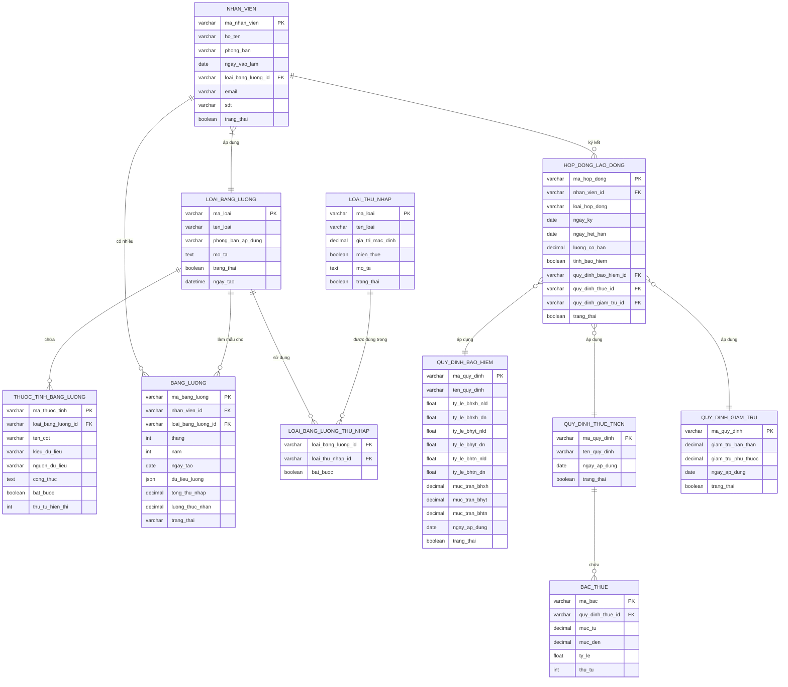

# Tài liệu Hệ thống Quản lý Lương

## Mục lục
1. [Tổng quan hệ thống](#tổng-quan-hệ-thống)
2. [Kiến trúc hệ thống](#kiến-trúc-hệ-thống)
3. [Mô tả chi tiết các thành phần](#mô-tả-chi-tiết-các-thành-phần)
4. [Quy trình nghiệp vụ](#quy-trình-nghiệp-vụ)
5. [Hướng dẫn triển khai](#hướng-dẫn-triển-khai)
6. [Ví dụ thực tế](#ví-dụ-thực-tế)

---

## Tổng quan hệ thống

### Mục tiêu
Hệ thống Quản lý Lương được thiết kế để:
- **Linh hoạt** trong việc cấu hình bảng lương cho từng phòng ban, nhân viên
- **Tự động hóa** việc tính toán lương, bảo hiểm, thuế TNCN
- **Quản lý tập trung** các quy định về lương, bảo hiểm, thuế
- **Đảm bảo tính chính xác** trong việc tính toán và thanh toán lương

### Đặc điểm nổi bật
- Hỗ trợ nhiều loại bảng lương khác nhau cho từng phòng ban
- Cho phép cấu hình động các thuộc tính (cột) trong bảng lương
- Tích hợp công thức tính toán phức tạp
- Quản lý lịch sử thay đổi quy định bảo hiểm, thuế
- Hỗ trợ nhiều hợp đồng lao động cho một nhân viên

---

## Kiến trúc hệ thống

### Sơ đồ tổng quan

```
┌─────────────────────────────────────────────────────────┐
│                    Tầng Giao diện                       │
│         (Quản lý NV, Tạo bảng lương, Báo cáo)          │
└─────────────────────────────────────────────────────────┘
                             │
┌─────────────────────────────────────────────────────────┐
│                    Tầng Nghiệp vụ                       │
│   ┌────────────┐  ┌────────────┐  ┌────────────┐      │
│   │   Quản lý  │  │   Tính     │  │   Quản lý  │      │
│   │  Nhân viên │  │   Lương    │  │  Quy định  │      │
│   └────────────┘  └────────────┘  └────────────┘      │
└─────────────────────────────────────────────────────────┘
                             │
┌─────────────────────────────────────────────────────────┐
│                    Tầng Dữ liệu                         │
│   ┌──────────────────────────────────────────────┐     │
│   │  Database: Nhân viên, Bảng lương, Quy định  │     │
│   └──────────────────────────────────────────────┘     │
└─────────────────────────────────────────────────────────┘
```

### Các module chính

1. **Module Quản lý Nhân viên**: Quản lý thông tin nhân viên, hợp đồng lao động
2. **Module Cấu hình Bảng lương**: Thiết kế loại bảng lương, thuộc tính động
3. **Module Tính lương**: Xử lý tính toán lương hàng tháng
4. **Module Quy định**: Quản lý các quy định bảo hiểm, thuế, giảm trừ
5. **Module Báo cáo**: Xuất báo cáo lương, bảo hiểm, thuế

### Class Diagram - Mô hình hướng đối tượng


### Entity Relationship Diagram - Mô hình quan hệ dữ liệu



---

## Mô tả chi tiết các thành phần

### 1. Loại bảng lương (Template)

#### Mục đích
Định nghĩa cấu trúc bảng lương áp dụng cho nhân viên/phòng ban

#### Thuộc tính chính
- **Mã loại**: Định danh duy nhất
- **Tên loại**: Tên hiển thị (VD: "Bảng lương nhân viên kinh doanh")
- **Phòng ban áp dụng**: Phòng ban mặc định sử dụng
- **Danh sách thuộc tính**: Các cột trong bảng lương

#### Thuộc tính bảng lương (Cột động)
Mỗi thuộc tính có:
- **Tên cột**: Tên hiển thị (VD: "Lương cơ bản")
- **Mã cột**: Mã tham chiếu trong công thức (VD: "LUONG_CO_BAN")
- **Kiểu dữ liệu**: number, text, date, boolean, formula
- **Nguồn dữ liệu**:
  - `system`: Lấy từ hệ thống (VD: từ hợp đồng)
  - `manual`: Nhập thủ công
  - `formula`: Tính theo công thức
- **Công thức**: Nếu là formula (VD: `CONG_THUC_TE / CONG_CHUAN * LUONG_CO_BAN`)

#### Ví dụ cấu hình
```json
{
  "ma_loai": "BL_KINH_DOANH",
  "ten_loai": "Bảng lương nhân viên kinh doanh",
  "thuoc_tinh": [
    {
      "ma_cot": "LUONG_CO_BAN",
      "ten_cot": "Lương cơ bản",
      "kieu_du_lieu": "number",
      "nguon_du_lieu": "system"
    },
    {
      "ma_cot": "CONG_CHUAN",
      "ten_cot": "Số công chuẩn",
      "kieu_du_lieu": "number",
      "gia_tri_mac_dinh": 22
    },
    {
      "ma_cot": "CONG_THUC_TE",
      "ten_cot": "Số công thực tế",
      "kieu_du_lieu": "number",
      "nguon_du_lieu": "manual"
    },
    {
      "ma_cot": "LUONG_THEO_CONG",
      "ten_cot": "Lương theo công",
      "kieu_du_lieu": "formula",
      "cong_thuc": "CONG_THUC_TE / CONG_CHUAN * LUONG_CO_BAN"
    },
    {
      "ma_cot": "HOA_HONG",
      "ten_cot": "Hoa hồng bán hàng",
      "kieu_du_lieu": "number",
      "nguon_du_lieu": "manual"
    }
  ]
}
```

### 2. Bảng lương (Instance thực tế)

#### Mục đích
Bảng lương thực tế của từng nhân viên theo tháng

#### Đặc điểm
- Được tạo tự động dựa trên loại bảng lương
- Lưu trữ giá trị thực tế của các thuộc tính
- Tính toán tự động theo công thức đã định nghĩa
- Lưu trữ dạng JSON để linh hoạt với cấu trúc động

#### Quy trình tạo bảng lương
1. Hệ thống xác định loại bảng lương của nhân viên
2. Tạo bảng lương theo template
3. Điền dữ liệu từ hệ thống (lương cơ bản từ hợp đồng)
4. Cho phép nhập dữ liệu thủ công
5. Tính toán các công thức
6. Tính bảo hiểm, thuế TNCN
7. Tính lương thực nhận

### 3. Nhân viên

#### Thông tin quản lý
- Thông tin cá nhân: Họ tên, ngày sinh, CMND/CCCD
- Thông tin công việc: Phòng ban, chức vụ, ngày vào làm
- **Loại bảng lương áp dụng**: Xác định template bảng lương

#### Quan hệ
- 1 nhân viên → 1 loại bảng lương
- 1 nhân viên → nhiều bảng lương (theo tháng)
- 1 nhân viên → nhiều hợp đồng lao động
- 1 nhân viên → nhiều người phụ thuộc (giảm trừ gia cảnh)

### 4. Hợp đồng lao động

#### Thông tin hợp đồng
- Loại hợp đồng: Thử việc, chính thức, thời vụ
- Thời hạn: Ngày ký, ngày hiệu lực, ngày hết hạn
- **Lương cơ bản**: Mức lương trong hợp đồng
- **Lương đóng bảo hiểm**: Có thể khác lương cơ bản

#### Cấu hình bảo hiểm và thuế
- **Tính bảo hiểm**: Có/Không
- **Quy định bảo hiểm áp dụng**: Chọn bảng quy định
- **Quy định thuế TNCN áp dụng**: Chọn bảng thuế
- **Quy định giảm trừ áp dụng**: Chọn bảng giảm trừ

#### Phụ lục hợp đồng
- Hỗ trợ tạo phụ lục hợp đồng
- Liên kết với hợp đồng gốc
- Kế thừa và ghi đè thông tin từ hợp đồng gốc

### 5. Loại thu nhập

#### Phân loại
- **Lương cơ bản**
- **Phụ cấp**: Điện thoại, xăng xe, ăn trưa, nhà ở
- **Thưởng**: Hiệu suất, lễ tết, dự án
- **Hoa hồng**: Bán hàng, dịch vụ
- **Làm thêm giờ**

#### Thuộc tính quan trọng
- **Miễn thuế**: Có được miễn thuế TNCN không
- **Tính bảo hiểm**: Có tính vào lương đóng BH không

### 6. Quy định bảo hiểm

#### Thông tin quy định
- **Tỷ lệ đóng**: BHXH, BHYT, BHTN, BHTNLĐ-BNN
- **Phân chia**: Người lao động / Doanh nghiệp
- **Mức trần/sàn**: Giới hạn đóng bảo hiểm
- **Thời gian áp dụng**: Từ ngày - đến ngày

#### Ví dụ quy định 2024
```
BHXH: 
- Người lao động: 8%
- Doanh nghiệp: 17.5%
- Mức trần: 20 lần lương cơ sở (29.800.000 VNĐ)

BHYT:
- Người lao động: 1.5%
- Doanh nghiệp: 3%
- Mức trần: 20 lần lương cơ sở

BHTN:
- Người lao động: 1%
- Doanh nghiệp: 1%
- Mức trần: 20 lần lương tối thiểu vùng
```

### 7. Quy định thuế TNCN

#### Biểu thuế lũy tiến từng phần
| Bậc | Thu nhập tính thuế/tháng | Thuế suất |
|-----|---------------------------|-----------|
| 1 | Đến 5 triệu | 5% |
| 2 | Trên 5 - 10 triệu | 10% |
| 3 | Trên 10 - 18 triệu | 15% |
| 4 | Trên 18 - 32 triệu | 20% |
| 5 | Trên 32 - 52 triệu | 25% |
| 6 | Trên 52 - 80 triệu | 30% |
| 7 | Trên 80 triệu | 35% |

#### Công thức tính
```
Thu nhập tính thuế = Tổng thu nhập - Các khoản miễn thuế - Bảo hiểm - Giảm trừ
Thuế TNCN = Thu nhập tính thuế × Thuế suất theo bậc
```

### 8. Quy định giảm trừ gia cảnh

#### Mức giảm trừ hiện hành (2024)
- **Bản thân**: 11.000.000 VNĐ/tháng
- **Người phụ thuộc**: 4.400.000 VNĐ/tháng/người

---

## Quy trình nghiệp vụ

### Quy trình 1: Thiết lập hệ thống ban đầu


### Quy trình 2: Tính lương hàng tháng


### Quy trình 3: Xử lý thay đổi

#### Khi có thay đổi quy định
1. Tạo quy định mới với ngày áp dụng
2. Hệ thống tự động áp dụng cho các bảng lương sau ngày đó
3. Giữ nguyên quy định cũ cho các bảng lương trước đó

#### Khi nhân viên thay đổi phòng ban
1. Cập nhật thông tin phòng ban
2. Xem xét thay đổi loại bảng lương nếu cần
3. Áp dụng từ tháng tiếp theo

---

## Hướng dẫn triển khai

### Bước 1: Chuẩn bị dữ liệu

#### 1.1 Nhập các quy định
```sql
-- Nhập quy định bảo hiểm
INSERT INTO quy_dinh_bao_hiem (
    ma_quy_dinh, ten_quy_dinh,
    ty_le_bhxh_nld, ty_le_bhxh_dn,
    ty_le_bhyt_nld, ty_le_bhyt_dn,
    ty_le_bhtn_nld, ty_le_bhtn_dn,
    muc_tran_bhxh, ngay_ap_dung
) VALUES (
    'QD_BH_2024', 'Quy định bảo hiểm năm 2024',
    8.0, 17.5,
    1.5, 3.0,
    1.0, 1.0,
    29800000, '2024-01-01'
);

-- Nhập quy định thuế và các bậc thuế
INSERT INTO quy_dinh_thue_tncn (ma_quy_dinh, ten_quy_dinh, loai_thue, ngay_ap_dung)
VALUES ('QD_THUE_2024', 'Thuế TNCN 2024', 'luy_tien', '2024-01-01');

-- Nhập các bậc thuế
INSERT INTO bac_thue (ma_bac, quy_dinh_thue_id, thu_tu, muc_tu, muc_den, ty_le)
VALUES 
    ('BAC1', 'QD_THUE_2024', 1, 0, 5000000, 5),
    ('BAC2', 'QD_THUE_2024', 2, 5000000, 10000000, 10),
    ('BAC3', 'QD_THUE_2024', 3, 10000000, 18000000, 15);

-- Nhập quy định giảm trừ
INSERT INTO quy_dinh_giam_tru (
    ma_quy_dinh, giam_tru_ban_than, giam_tru_phu_thuoc, ngay_ap_dung
) VALUES (
    'QD_GT_2024', 11000000, 4400000, '2024-01-01'
);
```

#### 1.2 Tạo loại thu nhập
```sql
INSERT INTO loai_thu_nhap (ma_loai, ten_loai, mien_thue, tinh_bao_hiem)
VALUES 
    ('LUONG_CB', 'Lương cơ bản', false, true),
    ('PC_AN_TRUA', 'Phụ cấp ăn trưa', true, false),
    ('PC_DIEN_THOAI', 'Phụ cấp điện thoại', true, false),
    ('PC_XANG_XE', 'Phụ cấp xăng xe', false, false),
    ('THUONG_HIEU_SUAT', 'Thưởng hiệu suất', false, true),
    ('THUONG_LE_TET', 'Thưởng lễ tết', false, false);
```

### Bước 2: Thiết kế loại bảng lương

#### 2.1 Tạo loại bảng lương cho phòng kinh doanh
```sql
-- Tạo loại bảng lương
INSERT INTO loai_bang_luong (ma_loai, ten_loai, phong_ban_ap_dung)
VALUES ('BL_KINH_DOANH', 'Bảng lương phòng kinh doanh', 'PHONG_KINH_DOANH');

-- Thêm các thuộc tính
INSERT INTO thuoc_tinh_bang_luong (
    ma_thuoc_tinh, loai_bang_luong_id, ten_cot, ma_cot, 
    kieu_du_lieu, nguon_du_lieu, thu_tu_hien_thi
) VALUES 
    ('TT01', 'BL_KINH_DOANH', 'Lương cơ bản', 'LUONG_CO_BAN', 'number', 'system', 1),
    ('TT02', 'BL_KINH_DOANH', 'Công chuẩn', 'CONG_CHUAN', 'number', 'system', 2),
    ('TT03', 'BL_KINH_DOANH', 'Công thực tế', 'CONG_THUC_TE', 'number', 'manual', 3),
    ('TT04', 'BL_KINH_DOANH', 'Lương theo công', 'LUONG_THEO_CONG', 'formula', 'formula', 4),
    ('TT05', 'BL_KINH_DOANH', 'Doanh số', 'DOANH_SO', 'number', 'manual', 5),
    ('TT06', 'BL_KINH_DOANH', 'Hoa hồng', 'HOA_HONG', 'formula', 'formula', 6);

-- Cập nhật công thức
UPDATE thuoc_tinh_bang_luong 
SET cong_thuc = 'CONG_THUC_TE / CONG_CHUAN * LUONG_CO_BAN'
WHERE ma_cot = 'LUONG_THEO_CONG';

UPDATE thuoc_tinh_bang_luong 
SET cong_thuc = 'DOANH_SO * 0.03'  -- 3% doanh số
WHERE ma_cot = 'HOA_HONG';
```

#### 2.2 Tạo loại bảng lương cho phòng kỹ thuật
```sql
INSERT INTO loai_bang_luong (ma_loai, ten_loai, phong_ban_ap_dung)
VALUES ('BL_KY_THUAT', 'Bảng lương phòng kỹ thuật', 'PHONG_KY_THUAT');

INSERT INTO thuoc_tinh_bang_luong (
    ma_thuoc_tinh, loai_bang_luong_id, ten_cot, ma_cot, 
    kieu_du_lieu, nguon_du_lieu, thu_tu_hien_thi
) VALUES 
    ('TT11', 'BL_KY_THUAT', 'Lương cơ bản', 'LUONG_CO_BAN', 'number', 'system', 1),
    ('TT12', 'BL_KY_THUAT', 'Công chuẩn', 'CONG_CHUAN', 'number', 'system', 2),
    ('TT13', 'BL_KY_THUAT', 'Công thực tế', 'CONG_THUC_TE', 'number', 'manual', 3),
    ('TT14', 'BL_KY_THUAT', 'Giờ làm thêm', 'GIO_LAM_THEM', 'number', 'manual', 4),
    ('TT15', 'BL_KY_THUAT', 'Lương làm thêm', 'LUONG_LAM_THEM', 'formula', 'formula', 5);

UPDATE thuoc_tinh_bang_luong 
SET cong_thuc = 'GIO_LAM_THEM * LUONG_CO_BAN / CONG_CHUAN / 8 * 1.5'
WHERE ma_cot = 'LUONG_LAM_THEM';
```

### Bước 3: Nhập dữ liệu nhân viên

```sql
-- Nhập nhân viên
INSERT INTO nhan_vien (
    ma_nhan_vien, ho_ten, phong_ban, 
    ngay_vao_lam, loai_bang_luong_id
) VALUES 
    ('NV001', 'Nguyễn Văn A', 'PHONG_KINH_DOANH', '2023-01-15', 'BL_KINH_DOANH'),
    ('NV002', 'Trần Thị B', 'PHONG_KY_THUAT', '2023-03-20', 'BL_KY_THUAT');

-- Tạo hợp đồng lao động
INSERT INTO hop_dong_lao_dong (
    ma_hop_dong, nhan_vien_id, loai_hop_dong,
    ngay_ky, ngay_hieu_luc, luong_co_ban,
    tinh_bao_hiem, quy_dinh_bao_hiem_id,
    quy_dinh_thue_id, quy_dinh_giam_tru_id
) VALUES 
    ('HD001', 'NV001', 'chinh_thuc', '2023-01-15', '2023-01-15', 15000000,
     true, 'QD_BH_2024', 'QD_THUE_2024', 'QD_GT_2024'),
    ('HD002', 'NV002', 'chinh_thuc', '2023-03-20', '2023-03-20', 20000000,
     true, 'QD_BH_2024', 'QD_THUE_2024', 'QD_GT_2024');

-- Nhập người phụ thuộc
INSERT INTO nguoi_phu_thuoc (nhan_vien_id, ho_ten, quan_he, tu_ngay)
VALUES 
    ('NV001', 'Nguyễn Văn A Jr.', 'con', '2023-01-01'),
    ('NV001', 'Nguyễn Thị C', 'vo_chong', '2023-01-01');
```

### Bước 4: Tạo và tính lương tháng

```sql
-- Tạo bảng lương tháng 10/2024
INSERT INTO bang_luong (
    ma_bang_luong, nhan_vien_id, loai_bang_luong_id,
    hop_dong_id, thang, nam, ngay_tao,
    so_cong_chuan, so_cong_thuc_te, luong_co_ban
) VALUES 
    ('BL_202410_NV001', 'NV001', 'BL_KINH_DOANH', 'HD001', 10, 2024, '2024-10-01',
     22, 20, 15000000);

-- Nhập dữ liệu động (JSON)
UPDATE bang_luong 
SET du_lieu_luong = '{
    "LUONG_CO_BAN": 15000000,
    "CONG_CHUAN": 22,
    "CONG_THUC_TE": 20,
    "LUONG_THEO_CONG": 13636364,
    "DOANH_SO": 100000000,
    "HOA_HONG": 3000000
}'
WHERE ma_bang_luong = 'BL_202410_NV001';

-- Tính tổng thu nhập
UPDATE bang_luong 
SET tong_thu_nhap = 13636364 + 3000000
WHERE ma_bang_luong = 'BL_202410_NV001';

-- Tính bảo hiểm (đơn giản hóa)
UPDATE bang_luong 
SET 
    bhxh_nld = 13636364 * 0.08,  -- 8% BHXH
    bhyt_nld = 13636364 * 0.015, -- 1.5% BHYT
    bhtn_nld = 13636364 * 0.01   -- 1% BHTN
WHERE ma_bang_luong = 'BL_202410_NV001';

-- Tính thuế TNCN (đơn giản hóa)
-- Thu nhập tính thuế = Tổng thu nhập - BH - Giảm trừ bản thân - Giảm trừ phụ thuộc
-- = 16,636,364 - 1,500,000 - 11,000,000 - 8,800,000 = -4,663,636 (âm nên không phải đóng thuế)

UPDATE bang_luong 
SET 
    thue_tncn = 0,
    tong_khau_tru = bhxh_nld + bhyt_nld + bhtn_nld + thue_tncn,
    luong_thuc_nhan = tong_thu_nhap - (bhxh_nld + bhyt_nld + bhtn_nld + thue_tncn)
WHERE ma_bang_luong = 'BL_202410_NV001';
```

---

## Ví dụ thực tế

### Ví dụ 1: Bảng lương nhân viên kinh doanh

**Thông tin:**
- Nhân viên: Nguyễn Văn A
- Lương cơ bản: 15.000.000 VNĐ
- Công chuẩn: 22 ngày
- Công thực tế: 20 ngày
- Doanh số: 100.000.000 VNĐ
- Hoa hồng: 3% doanh số
- Có 2 người phụ thuộc

**Tính toán:**
```
1. Lương theo công = 20/22 × 15.000.000 = 13.636.364 VNĐ
2. Hoa hồng = 100.000.000 × 3% = 3.000.000 VNĐ
3. Phụ cấp ăn trưa = 500.000 VNĐ (miễn thuế)
4. Tổng thu nhập = 13.636.364 + 3.000.000 + 500.000 = 17.136.364 VNĐ

5. Bảo hiểm (tính trên lương theo công):
   - BHXH (8%) = 13.636.364 × 8% = 1.090.909 VNĐ
   - BHYT (1.5%) = 13.636.364 × 1.5% = 204.545 VNĐ
   - BHTN (1%) = 13.636.364 × 1% = 136.364 VNĐ
   - Tổng BH = 1.431.818 VNĐ

6. Thuế TNCN:
   - Thu nhập tính thuế = 17.136.364 - 500.000 - 1.431.818 - 11.000.000 - 8.800.000
   - = -4.595.454 VNĐ (âm → không phải đóng thuế)

7. Lương thực nhận = 17.136.364 - 1.431.818 = 15.704.546 VNĐ
```

### Ví dụ 2: Bảng lương nhân viên kỹ thuật

**Thông tin:**
- Nhân viên: Trần Thị B
- Lương cơ bản: 20.000.000 VNĐ
- Công chuẩn: 22 ngày
- Công thực tế: 22 ngày
- Giờ làm thêm: 20 giờ
- Không có người phụ thuộc

**Tính toán:**
```
1. Lương theo công = 22/22 × 20.000.000 = 20.000.000 VNĐ
2. Lương làm thêm = 20 × (20.000.000/22/8) × 1.5 = 1.704.545 VNĐ
3. Phụ cấp ăn trưa = 500.000 VNĐ (miễn thuế)
4. Tổng thu nhập = 20.000.000 + 1.704.545 + 500.000 = 22.204.545 VNĐ

5. Bảo hiểm:
   - BHXH (8%) = 20.000.000 × 8% = 1.600.000 VNĐ
   - BHYT (1.5%) = 20.000.000 × 1.5% = 300.000 VNĐ
   - BHTN (1%) = 20.000.000 × 1% = 200.000 VNĐ
   - Tổng BH = 2.100.000 VNĐ

6. Thuế TNCN:
   - Thu nhập tính thuế = 22.204.545 - 500.000 - 2.100.000 - 11.000.000
   - = 8.604.545 VNĐ
   - Thuế:
     * Bậc 1 (0-5tr): 5.000.000 × 5% = 250.000 VNĐ
     * Bậc 2 (5-10tr): 3.604.545 × 10% = 360.455 VNĐ
     * Tổng thuế = 610.455 VNĐ

7. Lương thực nhận = 22.204.545 - 2.100.000 - 610.455 = 19.494.090 VNĐ
```

### Ví dụ 3: Xử lý phụ lục hợp đồng tăng lương

**Tình huống:**
- Nhân viên NV001 được tăng lương từ 15 triệu lên 18 triệu từ tháng 11/2024

**Xử lý:**
```sql
-- Tạo phụ lục hợp đồng
INSERT INTO hop_dong_lao_dong (
    ma_hop_dong, nhan_vien_id, loai_hop_dong,
    ngay_ky, ngay_hieu_luc, luong_co_ban,
    la_phu_luc, hop_dong_goc_id,
    tinh_bao_hiem, quy_dinh_bao_hiem_id,
    quy_dinh_thue_id, quy_dinh_giam_tru_id
) VALUES (
    'PL_HD001_01', 'NV001', 'chinh_thuc',
    '2024-10-25', '2024-11-01', 18000000,
    true, 'HD001',
    true, 'QD_BH_2024', 'QD_THUE_2024', 'QD_GT_2024'
);

-- Vô hiệu hóa hợp đồng cũ
UPDATE hop_dong_lao_dong 
SET trang_thai = false
WHERE ma_hop_dong = 'HD001';

-- Từ tháng 11, bảng lương sẽ tự động lấy lương mới 18 triệu
```

---

## Lưu ý quan trọng

### 1. Về thiết kế linh hoạt
- Sử dụng JSON để lưu dữ liệu động cho phép thay đổi cấu trúc mà không cần sửa database
- Công thức tính toán nên được xử lý ở tầng ứng dụng để dễ bảo trì

### 2. Về tính toán
- Luôn làm tròn số tiền theo quy định (thường làm tròn đến hàng nghìn)
- Lưu ý thứ tự tính toán: Thu nhập → Bảo hiểm → Thuế → Thực nhận

### 3. Về quy định pháp lý
- Cập nhật kịp thời các thay đổi về quy định bảo hiểm, thuế
- Lưu trữ lịch sử để có thể truy vết và điều chỉnh khi cần

### 4. Về bảo mật
- Mã hóa dữ liệu nhạy cảm như lương, thu nhập
- Phân quyền chi tiết theo vai trò: HR xem tất cả, Manager xem phòng mình, Nhân viên chỉ xem của mình

### 5. Về hiệu suất
- Index các trường thường xuyên query: nhan_vien_id, thang, nam
- Có thể tạo bảng tổng hợp (aggregate) cho báo cáo nếu dữ liệu lớn

---

## Kết luận

Hệ thống quản lý lương được thiết kế với các ưu điểm:
- **Linh hoạt**: Cho phép cấu hình động các loại bảng lương
- **Chính xác**: Tự động tính toán theo công thức và quy định
- **Minh bạch**: Lưu trữ đầy đủ thông tin và lịch sử
- **Tuân thủ**: Cập nhật kịp thời các quy định pháp lý
- **Mở rộng**: Dễ dàng thêm loại thu nhập, thuộc tính mới

Hệ thống này phù hợp cho doanh nghiệp vừa và nhỏ, có thể mở rộng cho doanh nghiệp lớn với một số điều chỉnh về hiệu suất và tính năng nâng cao.
